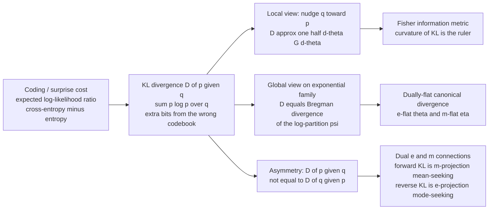

# 📐 Kullback-Leibler Divergence and Geometry

> [!abstract] TL;DR
> The **Kullback-Leibler divergence** $D(p\,\|\,q) = \sum_x p(x)\log\frac{p(x)}{q(x)}$ is the *extra bits per message* you waste when you compress data drawn from $p$ using a codebook built for $q$ — the expected log-likelihood ratio, the "surprise penalty" for holding the wrong belief. Information geometry reveals this single quantity as the **master ruler of the space of distributions**. *Locally* it is the **Fisher metric**: $D(p_\theta\,\|\,p_{\theta+d\theta}) \approx \tfrac12\, d\theta^\top G(\theta)\, d\theta$, so the metric is literally the curvature of KL. *Globally* on an exponential family it is the **canonical Bregman divergence** of the log-partition function, making the family **dually flat**. Its **asymmetry** — $D(p\,\|\,q) \neq D(q\,\|\,p)$ — is not a defect but *structure*: forward KL is mean-seeking $m$-projection (moment matching), reverse KL is mode-seeking $e$-projection (variational inference). KL is the $\alpha=\pm1$ endpoint of the $\alpha$-divergences and a special $f$-divergence, and it is *the* divergence for inference because exponential families make it exactly quadratic in the right coordinates.

---

## Intuition

**Analogy — the wrong codebook.** Imagine you build a compression scheme for tomorrow's weather assuming it follows one pattern — say, "70% sunny." You assign the shortest codewords to the outcomes you think are most likely. But reality follows a *different* pattern — actually "40% sunny." Every message you send now wastes bits: you spent your short codes on the wrong outcomes and are stuck paying long codes for what actually happens. The **KL divergence counts exactly how many extra bits per message your wrong belief costs you**, averaged over the true weather. It is the *price of modeling reality with the wrong distribution* — zero only when your codebook $q$ matches reality $p$ perfectly, and strictly positive otherwise.

Now the deep turn that makes this a *geometry* note. That same "surprise penalty" becomes a **ruler for the whole space of distributions**. Take two distributions a hair apart and the extra-bits penalty grows like a quadratic bowl — and that bowl's curvature *is* the Fisher information metric. Take two distributions on the same exponential family and the penalty equals the **Bregman divergence** of a single convex potential (the log-partition), the canonical divergence of flat space. And the fact that the penalty for using $q$-in-place-of-$p$ differs from using $p$-in-place-of-$q$ encodes the **dual $e$- and $m$-geometry** that runs through all of information geometry. KL is precisely the place where information theory and differential geometry become one object.

---

## How It Works

### The definition and its three readings (recap from information theory)

For distributions $p, q$ on the same space,
$$D(p\,\|\,q) \;=\; \sum_x p(x)\,\log\frac{p(x)}{q(x)} \;=\; \mathbb{E}_{x\sim p}\!\left[\log\frac{p(x)}{q(x)}\right] \;\ge\; 0,$$
with equality iff $p=q$ (**Gibbs' inequality**). Three equivalent readings, developed in [[Relative_Entropy_and_Cross_Entropy]], all say the same thing:

1. **Extra coding cost.** $D(p\,\|\,q) = H(p,q) - H(p)$ — the cross-entropy of coding $p$ with $q$'s codebook, *minus* the irreducible entropy of $p$. It is the redundancy of the wrong codebook, measured in bits (log base 2) or nats (log base $e$).
2. **Expected log-likelihood ratio.** $D(p\,\|\,q) = \mathbb{E}_p[\log p - \log q]$ is the average evidence, per sample, that data drawn from $p$ provides *against* the hypothesis $q$. This is the quantity that governs hypothesis testing (Stein's lemma) and the consistency of maximum likelihood.
3. **Surprise penalty.** Log-loss $-\log q(x)$ is your "surprise" at outcome $x$ under belief $q$; KL is the *excess* expected surprise of belief $q$ over the truth $p$.

### View 1 — Locally, KL is the Fisher metric

Restrict to a smooth family $p_\theta$ and expand KL between two nearby members. Because KL is non-negative and vanishes on the diagonal, its value and gradient are zero at $d\theta=0$ — the diagonal is a flat valley floor. The first surviving term is quadratic:
$$D\big(p_\theta \,\|\, p_{\theta+d\theta}\big) \;=\; \tfrac12\, d\theta^\top G(\theta)\, d\theta \;+\; O(\|d\theta\|^3), \qquad G_{ij}(\theta) = \mathbb{E}_p[\partial_i\log p\,\partial_j\log p].$$
The Hessian of KL *is* the Fisher information matrix — the Riemannian metric on the manifold of distributions. So the metric is not an add-on; it is the **local shape of KL at the bottom of its valley**. This is the second-order face of Eguchi's theorem, and it is why *The Fisher Information Metric* and this note are two views of one object: KL globally, Fisher locally.

### View 2 — Globally on exponential families, KL is a Bregman divergence

An exponential family writes $p_\theta(x) = \exp\!\big(\langle\theta, t(x)\rangle - \psi(\theta)\big)h(x)$ with **natural parameter** $\theta$ and **log-partition** $\psi(\theta) = \log\sum_x e^{\langle\theta,t(x)\rangle}h(x)$, a smooth *convex* potential. For two members,
$$D(p_{\theta_1} \,\|\, p_{\theta_2}) \;=\; \psi(\theta_2) - \psi(\theta_1) - \langle\nabla\psi(\theta_1),\, \theta_2 - \theta_1\rangle \;=\; B_\psi(\theta_2 \,\|\, \theta_1),$$
exactly the **Bregman divergence** of $\psi$: potential-at-$\theta_2$ minus its first-order Taylor extrapolation from $\theta_1$ — the vertical gap between a convex surface and its tangent plane. Because $\psi$ is convex this gap is non-negative, re-deriving Gibbs' inequality *geometrically*. This is the **canonical divergence of a dually-flat space**: the family is flat under the exponential ($e$-) connection in $\theta$ and flat under the mixture ($m$-) connection in the dual **expectation parameter** $\eta = \nabla\psi(\theta) = \mathbb{E}_\theta[t(x)]$. KL is the bridge between the two flat coordinate systems. This global structure is expanded in *Bregman Divergences* and *Exponential Families and Their Geometry*; the convex potential machinery is the same one behind [[Convex_Functions]].

### View 3 — The asymmetry is the dual geometry

$D(p\,\|\,q) \neq D(q\,\|\,p)$: KL is a *directed* squared-distance, not a metric. That directionality is exactly the $e$/$m$ duality.

- **Forward KL** $\min_q D(p\,\|\,q)$ is **moment/mean matching** — it is the $m$-projection of the true $p$ onto the model. It is *mass-covering*: $q$ is penalized wherever $p$ has mass but $q$ does not, so $q$ spreads to cover every mode. Maximum likelihood minimizes forward KL from the empirical distribution.
- **Reverse KL** $\min_q D(q\,\|\,p)$ is **mode-seeking** — the $e$-projection. It is *zero-forcing*: $q$ is penalized wherever $q$ has mass but $p$ does not, so $q$ collapses onto a single high-probability mode and ignores the rest. This is the objective of variational inference and the ELBO.

Choosing forward vs reverse is choosing *which projection*, which is choosing *which flat connection* — the asymmetry literally names the two dual connections. This projection viewpoint, together with the **generalized Pythagorean theorem** ($D(p\,\|\,r) = D(p\,\|\,q) + D(q\,\|\,r)$ when the $m$-geodesic from $p$ to $q$ meets the $e$-geodesic from $q$ to $r$ orthogonally), is the engine of *The Generalized Pythagorean Theorem* and *Variational Inference and Geometry*.

### KL among the divergences, and its properties

KL is the $\alpha=\pm1$ endpoint of the **$\alpha$-divergence** family and the $f$-divergence generated by $f(u)=u\log u$ — both developed in *f-Divergences*. As an $f$-divergence it inherits the guarantees that make it the canonical choice for inference:

- **Non-negativity (Gibbs):** $D\ge 0$, zero iff $p=q$ — the convexity of $u\log u$ (Jensen).
- **Additivity:** $D(p_1p_2\,\|\,q_1q_2) = D(p_1\,\|\,q_1) + D(p_2\,\|\,q_2)$ for independent factors — extensivity, the property a coding cost *must* have.
- **Monotonicity / data-processing:** pushing both $p$ and $q$ through any channel (coarse-graining) can only *shrink* KL — you cannot manufacture distinguishability by processing. This is the KL side of the [[Information_Inequalities_and_the_Data_Processing_Inequality]], dual to the monotonicity of Fisher information.
- **Joint convexity:** $D(p\,\|\,q)$ is jointly convex in $(p,q)$ — what makes KL-constrained optimization (I-projection, max-entropy, variational bounds) tractable.

### Flow: one quantity, three geometric faces



---

## Key Concepts

### Secondary (plain-language core)

- **KL is a wrong-codebook penalty.** Build a compression scheme for belief $q$, feed it data from reality $p$: KL is the extra bits you waste, on average, per message. Zero only when belief matches reality.
- **It is one-way.** The penalty for using $q$ in place of $p$ is generally *not* the penalty for using $p$ in place of $q$. This asymmetry carries real meaning, not noise.
- **Zoom in and it becomes a smooth bowl.** For two nearby distributions the penalty grows like a parabola; the shape of that parabola is the Fisher "distinguishability" ruler.
- **Two ways to fit.** Minimizing "forward" KL makes your model spread out to cover everything (mean-seeking); minimizing "reverse" KL makes it snap onto one peak (mode-seeking).

### Undergraduate (working machinery)

- **Definition and decomposition.** $D(p\,\|\,q) = \mathbb{E}_p[\log p - \log q] = H(p,q) - H(p) \ge 0$; nats if $\log$, bits if $\log_2$.
- **Local = Fisher.** $D(p_\theta\,\|\,p_{\theta+d\theta}) \approx \tfrac12 d\theta^\top G\, d\theta$ with $G$ the Fisher matrix; the metric is the Hessian of KL at the diagonal.
- **Gaussian closed forms.** $D\big(\mathcal N(\mu_1,\sigma_1)\,\|\,\mathcal N(\mu_2,\sigma_2)\big) = \log\frac{\sigma_2}{\sigma_1} + \frac{\sigma_1^2 + (\mu_1-\mu_2)^2}{2\sigma_2^2} - \tfrac12$. For fixed unit variance this collapses to $\tfrac12(\mu_1-\mu_2)^2$ — exactly quadratic, so Fisher is exact.
- **MLE minimizes forward KL.** Maximizing likelihood is minimizing $D(\hat p_{\text{emp}}\,\|\,p_\theta)$ from the empirical distribution; cross-entropy loss is forward KL up to the constant $H(\hat p)$.
- **Bregman identity.** On an exponential family, $D(p_{\theta_1}\,\|\,p_{\theta_2}) = B_\psi(\theta_2\,\|\,\theta_1)$, the tangent-gap of the convex log-partition $\psi$.
- **Support matters.** If $q(x)=0$ where $p(x)>0$, then $D(p\,\|\,q)=+\infty$: absolute continuity $p \ll q$ is required for finiteness.

### Graduate (structural payoff)

- **Dually-flat canonical divergence.** An exponential family carries $(g, \nabla^{(e)}, \nabla^{(m)})$: Fisher metric plus a pair of flat, torsion-free connections dual w.r.t. $g$. KL is the canonical Bregman divergence bridging the $e$-flat natural coordinates $\theta$ and the $m$-flat expectation coordinates $\eta=\nabla\psi(\theta)$, with $\psi$ and its Legendre dual $\varphi$ (the negative entropy) as the conjugate potentials.
- **Two projections.** Forward KL $\to$ $m$-projection onto the model (moment matching, mass-covering); reverse KL $\to$ $e$-projection (mode-seeking, zero-forcing). The **generalized Pythagorean theorem** decomposes KL along orthogonal $e$/$m$-geodesics, giving the geometric proof of the EM algorithm, max-entropy uniqueness, and iterative scaling.
- **$\alpha=\pm1$ of the $\alpha$-divergences.** KL and reverse-KL are the two endpoints of Amari's $\alpha$-family; $\alpha=0$ is (twice, squared) Hellinger. All share the same Fisher metric at second order and differ only in the connection (third order).
- **Csiszár's I-projection.** Minimizing $D(\cdot\,\|\,q)$ over a linear (moment) constraint set yields a unique projection lying in an exponential family through $q$ — the variational principle behind maximum entropy and exponential-family inference.
- **Invariance and monotonicity.** As an $f$-divergence, KL is invariant under sufficient statistics and monotone under Markov morphisms — the data-processing inequality, dual to Fisher monotonicity and the reason KL, not Euclidean distance, is *the* discrepancy for statistics.

---

## Python Demo

```python
# KL as the bridge between INFORMATION and GEOMETRY.
#
# (a) ASYMMETRY has consequences. Fit ONE Gaussian q to a BIMODAL target p by
#     minimizing forward KL D(p||q) vs reverse KL D(q||p):
#       - forward KL  -> MOMENT MATCH -> broad, MEAN-SEEKING / mass-covering
#       - reverse KL  -> collapses onto ONE mode -> MODE-SEEKING / zero-forcing
#
# (b) KL between exponential-family members = the CANONICAL / BREGMAN divergence
#     of the log-partition psi, AND its local expansion = 1/2 * Fisher * dtheta^2.
#     Family: Bernoulli, natural theta = logit(p), psi(theta) = log(1+e^theta).
#     This links the THREE views: coding cost = Bregman(global) = Fisher(local).

import numpy as np
import matplotlib.pyplot as plt

# ===========================================================================
# (a) forward vs reverse KL: fit one Gaussian to a bimodal target
# ===========================================================================
w   = np.array([0.65, 0.35])          # asymmetric weights -> unambiguous mode
mus = np.array([-2.5, 2.5])
sds = np.array([0.5, 1.0])            # left mode taller/narrower, right wider

xg = np.linspace(-9, 9, 3001)         # integration grid
dx = xg[1] - xg[0]

def gauss(x, m, s):
    return np.exp(-0.5 * ((x - m) / s) ** 2) / (s * np.sqrt(2 * np.pi))

p = sum(wi * gauss(xg, mi, si) for wi, mi, si in zip(w, mus, sds))
p /= p.sum() * dx                      # normalize on the grid

# Forward KL  D(p||q): optimal single Gaussian is the MOMENT MATCH ----------
m_fwd = (p * xg).sum() * dx
s_fwd = np.sqrt((p * (xg - m_fwd) ** 2).sum() * dx)

# Reverse KL  D(q||p): mode-seeking. Minimize by grid search over (m, s) -----
def reverse_kl(m, s):
    q = gauss(xg, m, s)
    q /= q.sum() * dx
    mask = q > 1e-12
    return float((q[mask] * np.log(q[mask] / np.maximum(p[mask], 1e-300))).sum() * dx)

m_grid = np.linspace(-4.0, 4.0, 161)
s_grid = np.linspace(0.20, 3.0, 141)
best_val, m_rev, s_rev = np.inf, None, None
for m in m_grid:
    for s in s_grid:
        v = reverse_kl(m, s)
        if v < best_val:
            best_val, m_rev, s_rev = v, m, s

print("(a) Fitting one Gaussian to a bimodal target")
print(f"    forward-KL  fit:  mu={m_fwd:+.2f}  sigma={s_fwd:.2f}   (broad, mass-covering)")
print(f"    reverse-KL  fit:  mu={m_rev:+.2f}  sigma={s_rev:.2f}   (collapsed onto one mode)")

# ===========================================================================
# (b) KL(exponential family) = Bregman(log-partition);  local = 1/2 Fisher
# ===========================================================================
def logit(pp):  return np.log(pp / (1 - pp))
def psi(th):    return np.logaddexp(0.0, th)        # log-partition log(1+e^theta)
def dpsi(th):   return 1.0 / (1.0 + np.exp(-th))    # psi'(theta) = mean = p
def d2psi(th):  return dpsi(th) * (1 - dpsi(th))    # psi''(theta) = Fisher (nat. param)

def kl_bern(p1, p2):
    return p1 * np.log(p1 / p2) + (1 - p1) * np.log((1 - p1) / (1 - p2))

def bregman_psi(a, b):                               # B_psi(a || b)
    return psi(a) - psi(b) - dpsi(b) * (a - b)

p1  = 0.30
p2s = np.linspace(0.05, 0.95, 400)
th1 = logit(p1)
th2 = logit(p2s)

kl_direct  = kl_bern(p1, p2s)                        # information-theory definition
kl_bregman = bregman_psi(th2, th1)                   # KL(p1||p2) = B_psi(theta2 || theta1)
fisher_par = 0.5 * d2psi(th1) * (th2 - th1) ** 2     # 1/2 Fisher(theta1) dtheta^2  (local)

print("\n(b) KL = Bregman divergence of the log-partition")
print(f"    max |KL_direct - KL_bregman| = {np.max(np.abs(kl_direct - kl_bregman)):.2e}")
print(f"    Fisher(theta1) = psi''(theta1) = p1(1-p1) = {d2psi(th1):.4f}")

# asymmetry of KL, in the SAME family
kl_fwd = kl_bern(p1, p2s)                            # D(p1 || p2)
kl_rev = kl_bern(p2s, p1)                            # D(p2 || p1)

# ===========================================================================
# Plots
# ===========================================================================
fig, ax = plt.subplots(1, 3, figsize=(16, 4.8))

# LEFT: forward vs reverse KL fit ------------------------------------------
ax[0].fill_between(xg, p, color="0.80", label="target p (bimodal)")
ax[0].plot(xg, gauss(xg, m_fwd, s_fwd), "b-", lw=2,
           label=f"forward KL fit  N({m_fwd:.1f},{s_fwd:.1f})")
ax[0].plot(xg, gauss(xg, m_rev, s_rev), "r-", lw=2,
           label=f"reverse KL fit  N({m_rev:.1f},{s_rev:.1f})")
ax[0].set_xlim(-7, 7)
ax[0].set_title("Asymmetry has consequences\nforward = mean-seeking, reverse = mode-seeking")
ax[0].set_xlabel("x"); ax[0].set_ylabel("density"); ax[0].legend(fontsize=8)

# MIDDLE: KL = Bregman, local = 1/2 Fisher ---------------------------------
ax[1].plot(p2s, kl_direct, "b-", lw=3, label="KL direct  (information theory)")
ax[1].plot(p2s, kl_bregman, "y--", lw=2, label="Bregman of log-partition  (geometry)")
ax[1].plot(p2s, fisher_par, "g:", lw=2.5, label=r"$\frac12$ Fisher $d\theta^2$  (local)")
ax[1].axvline(p1, color="k", ls=":", alpha=0.5)
ax[1].set_ylim(0, 1.4)
ax[1].set_title("One KL, three views\nglobal = Bregman, local = Fisher")
ax[1].set_xlabel(r"$p_2$  (with $p_1=0.30$)"); ax[1].set_ylabel("KL (nats)")
ax[1].legend(fontsize=8)

# RIGHT: asymmetry forward vs reverse KL -----------------------------------
ax[2].plot(p2s, kl_fwd, "b-", lw=2, label=r"forward $D(p_1\|p_2)$")
ax[2].plot(p2s, kl_rev, "r-", lw=2, label=r"reverse $D(p_2\|p_1)$")
ax[2].plot(p2s, fisher_par, "g:", lw=2.5, label=r"$\frac12$ Fisher $d\theta^2$")
ax[2].axvline(p1, color="k", ls=":", alpha=0.5)
ax[2].set_ylim(0, 1.4)
ax[2].set_title("Forward != reverse (asymmetry)\nagree to 2nd order, split beyond")
ax[2].set_xlabel(r"$p_2$  (with $p_1=0.30$)"); ax[2].set_ylabel("KL (nats)")
ax[2].legend(fontsize=8)

plt.tight_layout()
plt.savefig("kl_divergence_and_geometry.png", dpi=120)
plt.show()
```

**What you see.** Part (a) prints a **forward-KL Gaussian centered near $-0.75$ with $\sigma\approx2.5$** — a broad bell that straddles *both* modes (mean-seeking, mass-covering, because forward KL punishes any region where $p$ has mass but $q$ does not) — versus a **reverse-KL Gaussian collapsed onto the dominant left mode at $\mu\approx-2.5$, $\sigma\approx0.5$** (mode-seeking, zero-forcing). One target, one Gaussian family, opposite fits: that is the asymmetry made visible, and it is exactly the mean-covering vs mode-seeking split behind maximum likelihood vs variational inference. Part (b) prints `max |KL_direct - KL_bregman|` at the level of floating-point noise ($\sim10^{-16}$): the information-theoretic KL and the Bregman divergence of the log-partition are *literally the same number*. The middle panel overlays three curves — direct KL, Bregman, and the $\tfrac12$-Fisher parabola — where Bregman sits exactly on KL everywhere while the Fisher parabola hugs it only near $p_1$ and peels away outward: **global = Bregman, local = Fisher, one KL**. The right panel shows forward and reverse KL kissing at the bottom of the valley (equal to second order, the shared Fisher parabola between them) and splitting on the flanks — the asymmetry is a *third-order* effect, precisely the dual connection.

---

## Real-World Applications

> **Variational inference, ELBO, and VAEs.** Modern probabilistic ML minimizes **reverse KL** $D(q_\phi\,\|\,p)$ because $p$'s normalizer is intractable but $q$'s is not — maximizing the ELBO is minimizing reverse KL to the true posterior. This is why VAEs and mean-field VI are famously *mode-seeking* and under-cover posterior uncertainty. The geometric reading: it is an $e$-projection onto the variational family. See [[Variational_Inference_as_Free_Energy_Minimization]] and [[Variational_Autoencoders]].

> **Cross-entropy loss = forward KL.** Every classifier trained with cross-entropy is minimizing $D(\hat p_{\text{data}}\,\|\,p_\theta)$, forward KL from the empirical label distribution — mass-covering by construction, which is why cross-entropy models hedge across classes rather than committing to one. See [[Loss_Functions]].

> **Policy optimization with KL trust regions.** TRPO and PPO bound the KL step between successive policies, using the *local Fisher form* of KL as the natural-gradient metric — a direct, deployed use of "KL curvature = Fisher metric" to keep updates on the statistical manifold rather than in raw parameter space.

> **Hypothesis testing and detection.** By Stein's lemma the KL divergence sets the exponential rate at which the probability of missed detection falls with sample size — the fundamental limit in radar, anomaly detection, and A/B testing, and the operational meaning of "expected evidence per sample" from [[Relative_Entropy_and_Cross_Entropy]].

> **Maximum-entropy modeling.** Fitting a max-ent (exponential-family) model under moment constraints is an I-projection: minimize KL to a reference subject to matching statistics. The unique solution is the exponential family whose Bregman/KL geometry this note describes — the backbone of MaxEnt language models, Gibbs/Boltzmann distributions, and Ising fits.

---

## Common Pitfalls

- **Direction matters — pick it on purpose.** $D(p\,\|\,q) \neq D(q\,\|\,p)$, and they optimize to *different* fits: forward KL spreads to cover all modes (mean-seeking), reverse KL snaps to one (mode-seeking). Silently choosing the "convenient" direction (usually reverse, because it dodges the intractable normalizer) can badly under-report uncertainty. Name your projection.
- **Support and absolute continuity.** If $q(x)=0$ anywhere $p(x)>0$, then $D(p\,\|\,q)=+\infty$ — a single zero in your model where the data isn't blows up the loss. This is why practitioners smooth/clip $q$, add $\varepsilon$, or use bounded alternatives (Hellinger, Jensen-Shannon, Wasserstein) when supports may not match.
- **Infinite / undefined KL.** Empirical distributions with unseen events, mismatched supports, or heavy tails routinely produce infinite or NaN KL. Guard with pseudocounts or move to a symmetric bounded divergence when the geometry near the boundary is the point.
- **Reverse KL in VI is a *feature and a trap*.** The ELBO's mode-seeking is deliberate but means posterior variances are systematically *underestimated* and secondary modes are dropped. If you need calibrated uncertainty, forward-KL / expectation-propagation-style objectives (or importance weighting) are the fix — not a smaller learning rate.
- **Nats vs bits.** KL in nats ($\ln$) and bits ($\log_2$) differ by $\ln 2 \approx 0.693$. Cross-library comparisons, "how many bits saved" claims, and reported divergences silently mix units — always state the base. The *geometry* (metric, Bregman structure) is unaffected by the constant, but numerical claims are not.
- **KL is not a distance.** No symmetry, no triangle inequality; $\sqrt{D}$ is not a metric either. Only the *local* second-order term (the Fisher metric) is metric-like. Do not feed KL to algorithms that assume a true distance without symmetrizing (Jeffreys, Jensen-Shannon) and knowing what you gave up.

---

## Related Concepts

*Cross-vault connections (Glob-verified):*
- [[Relative_Entropy_and_Cross_Entropy]] — the information-theory home of KL: coding cost, cross-entropy, and the expected log-likelihood ratio. This note is the **geometric** view of the *same* quantity — locally a metric, globally a Bregman divergence.
- [[Information_Inequalities_and_the_Data_Processing_Inequality]] — the monotonicity of KL under coarse-graining, dual to Fisher monotonicity and the reason KL is *the* invariant discrepancy for statistics.
- [[Entropy_and_Information_Content]] — entropy is the potential whose Bregman divergence *is* KL; $D(p\,\|\,q) = H(p,q) - H(p)$ ties the two together.
- [[Maximum_Likelihood_and_Information]] — MLE is minimization of forward KL from the empirical distribution; consistency and efficiency are KL-geometry statements.
- [[Variational_Inference_as_Free_Energy_Minimization]] — inference recast as **reverse-KL** ($e$-projection) minimization; the mode-seeking behavior demonstrated in the code lives here.
- [[Maximum_Entropy_and_Exponential_Families]] — the dually-flat exponential-family geometry whose canonical divergence is exactly KL / Bregman; I-projection and MaxEnt as KL minimization.
- [[Loss_Functions]] — cross-entropy loss is forward KL up to an additive constant; training a classifier is projecting onto the model in KL geometry.
- [[Variational_Autoencoders]] — the ELBO is a reverse-KL objective; its known mode-collapse and under-dispersion are the asymmetry of KL in production.
- [[Statistical_Inference]] — sufficiency, likelihood, and estimation, the classical machinery on which KL geometry and its projections operate.
- [[Convex_Functions]] — convexity of the log-partition $\psi$ is what makes KL a non-negative Bregman divergence; the tangent-gap picture is the geometric root of Gibbs' inequality.

*Sibling notes in this section (Information Geometry — Divergences and Distances): **The Fisher Information Metric** is the local quadratic form of the KL developed here; **Bregman Divergences** generalize the log-partition tangent-gap that KL instantiates on exponential families; **f-Divergences** are the invariant family of which KL is the $\alpha=\pm1$ member; **The Generalized Pythagorean Theorem** decomposes KL along orthogonal $e$/$m$-geodesics (I-projection); and **Variational Inference and Geometry** turns reverse-KL minimization into an $e$-projection. See also **Statistical Manifolds**, **Exponential Families and Their Geometry**, and **Divergences as Geometric Structure**.*

---

## Review Questions

1. **(Secondary)** Using the wrong-codebook analogy, explain why $D(p\,\|\,q)$ can differ from $D(q\,\|\,p)$. If you fit a single simple model to data that actually has two peaks, which direction of KL makes your model straddle both peaks, and which makes it snap onto one? Give the everyday intuition for each.
2. **(Undergraduate)** For the Gaussian family with fixed unit variance, show $D\big(\mathcal N(\mu_1,1)\,\|\,\mathcal N(\mu_2,1)\big) = \tfrac12(\mu_1-\mu_2)^2$, and confirm this equals both (a) the Bregman divergence of the natural-parameter log-partition $\psi(\theta)=\theta^2/2$ and (b) the local $\tfrac12$-Fisher form with $G=1$. Why is the Fisher approximation *exact* here but only *local* for the Bernoulli family?
3. **(Graduate)** State precisely why forward KL is an $m$-projection and reverse KL is an $e$-projection, and how the generalized Pythagorean theorem uses orthogonal $e$/$m$-geodesics to decompose KL. Explain what makes an exponential family "dually flat," identify the two conjugate potentials, and say where in the Taylor expansion of KL the Fisher metric and the dual connections each appear.

---

## Sources

- Kullback, S. & Leibler, R. A. (1951). *On information and sufficiency.* Annals of Mathematical Statistics, 22(1), 79-86. (the original definition of the divergence)
- Cover, T. M. & Thomas, J. A. (2006). *Elements of Information Theory* (2nd ed.), Ch. 2 & 11 (relative entropy, Fisher information, and statistics). Wiley.
- Amari, S. & Nagaoka, H. (2000). *Methods of Information Geometry.* AMS / Oxford University Press. (KL as canonical Bregman divergence, dual e/m geometry, Pythagorean theorem)
- MacKay, D. J. C. (2003). *Information Theory, Inference, and Learning Algorithms.* Cambridge University Press. (variational inference, forward vs reverse KL)
- Nielsen, F. (2020). *An elementary introduction to information geometry.* Entropy, 22(10), 1100. (Bregman/KL duality, exponential families, modern treatment)

---

#information-geometry #kl-divergence #relative-entropy #bregman #dual-geometry
