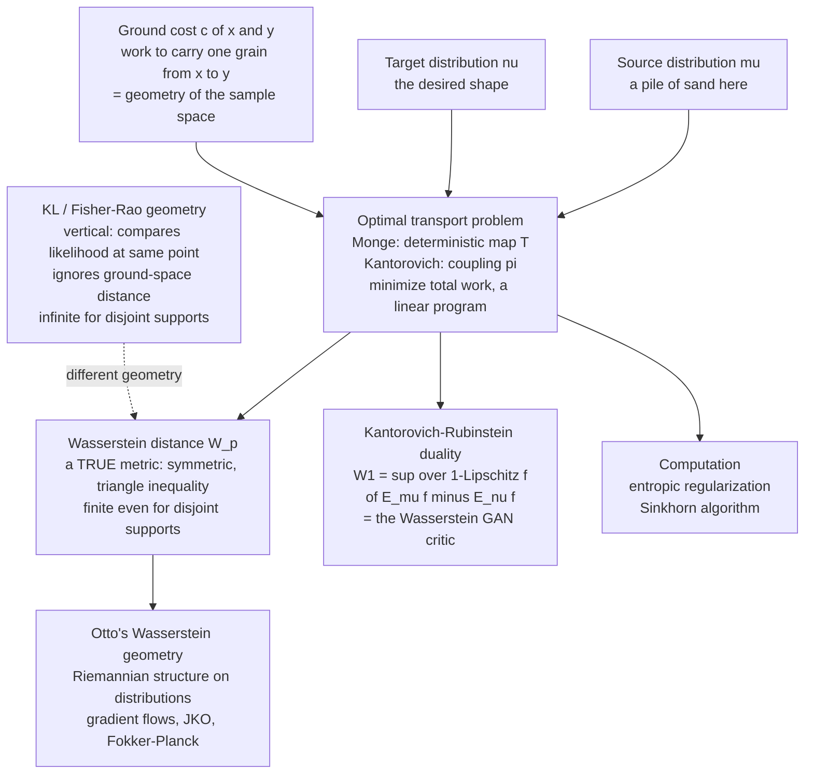

# 🏜️ Optimal Transport and Wasserstein Geometry

> [!abstract] TL;DR
> **Optimal transport** asks a physical question: given a pile of probability mass shaped like $\mu$ and a target shape $\nu$, what is the *least-cost plan* to move the first into the second, where moving a grain from $x$ to $y$ costs $c(x,y)$? The minimum total cost is the **Wasserstein distance** $W_p(\mu,\nu)$ — the "earth-mover's distance." Unlike KL divergence, it is a **true metric** (symmetric, triangle inequality) and it *respects the geometry of the sample space*: it stays **finite and meaningful even when $\mu$ and $\nu$ have non-overlapping supports**, exactly the regime where KL and Fisher-Rao explode. It comes with a powerful dual form — **Kantorovich duality** ($W_1 = \sup$ over $1$-Lipschitz functions, the engine of Wasserstein GANs), a Riemannian structure on the space of distributions (**Otto calculus**, distinct from the Fisher-Rao geometry), a practical algorithm (**entropic regularization / Sinkhorn**), and a dynamical reading (**Wasserstein gradient flows**, the JKO scheme, diffusion as gradient descent of entropy). It has become the beating heart of modern generative modeling.

---

## Intuition

**Analogy — shovelling sand.** KL divergence has an absurd blind spot: it sees two distributions with **non-overlapping supports as infinitely far apart**. A pile of sand *here* and an identical pile *one inch away* are "infinitely different" to KL — because at every point where the first pile has sand, the second has none, and $\log(p/0) = \infty$. That is nonsense: the two piles are obviously *nearly the same*, just nudged sideways.

Optimal transport fixes this by asking a **physical** question instead of a statistical one: *what is the least amount of work to shovel one pile of sand into the exact shape of the other?* You pay for **how much** sand you move times **how far** you carry it. Nudge the pile one inch and the answer is tiny — you carry all the sand one inch. Push it a mile and the cost grows to a mile's worth of shovelling. This "earth-mover's distance" — the **Wasserstein distance** — is small when the piles are close *in the sample space* and large when they are far, gracefully and finitely, whether or not they overlap.

The crucial upgrade over KL is that optimal transport **knows the geometry of the ground it is shovelling on**. KL only ever compares mass point-by-point ("how much probability does each of you assign to *this exact* spot?") and never asks how far apart two spots are. Optimal transport is built entirely on a **ground cost** $c(x,y)$ — a metric on the sample space — so distance between distributions *inherits* distance in the underlying world. That single idea makes it finite across disjoint supports, makes it a real metric, and makes its gradients point in physically sensible directions — which is why it quietly took over generative AI.

---

## How It Works

### Core mechanics

1. **The two piles and the ground cost.** You are given a source distribution $\mu$ and a target $\nu$ on a space $\mathcal{X}$, and a **ground cost** $c(x,y)$ — the price of transporting one unit of mass from $x$ to $y$. The canonical choice is $c(x,y)=\|x-y\|^p$; this is where the geometry of $\mathcal{X}$ enters. KL has no such object, which is exactly why it is geometry-blind.

2. **Monge's problem (a deterministic map).** Find a map $T:\mathcal{X}\to\mathcal{X}$ that pushes every grain at $x$ to $T(x)$, rearranges $\mu$ into $\nu$ (written $T_\#\mu=\nu$), and minimizes total cost $\int c(x,T(x))\,d\mu(x)$. This is intuitive but can be *infeasible* — you cannot split a grain, so a single point mass can never be mapped onto two.

3. **Kantorovich's relaxation (a transport plan).** Allow mass to *split*: instead of a map, seek a **coupling** $\pi(x,y)$ — a joint distribution whose marginals are $\mu$ and $\nu$ — minimizing $\iint c(x,y)\,d\pi(x,y)$. This is a **linear program**: linear objective, linear marginal constraints. It always has a solution, and for nice costs the optimal plan collapses back to a Monge map. The minimum cost, raised to the $1/p$ power, is the **Wasserstein-$p$ distance** $W_p(\mu,\nu)$.

4. **Why it is a true metric.** $W_p$ is symmetric, zero iff $\mu=\nu$, and satisfies the **triangle inequality** (shovel $\mu\!\to\!\rho\!\to\!\nu$; you cannot beat the direct plan). It **metrizes weak convergence** and stays finite for disjoint supports. KL is none of these things.

5. **Kantorovich–Rubinstein duality.** For $p=1$ the LP dual has a beautiful form:
$$W_1(\mu,\nu)=\sup_{\|f\|_{\mathrm{Lip}}\le 1}\ \mathbb{E}_{x\sim\mu}[f(x)]-\mathbb{E}_{y\sim\nu}[f(y)].$$
Find the $1$-Lipschitz "witness" function $f$ that most separates the two distributions in *average value*. This is literally the objective a **Wasserstein GAN** optimizes, with the critic network as $f$.

6. **The 1-D shortcut.** On the real line optimal transport is *sorting*: the optimal map sends the $q$-th quantile of $\mu$ to the $q$-th quantile of $\nu$, so $W_p^p=\int_0^1|F_\mu^{-1}(q)-F_\nu^{-1}(q)|^p\,dq$ — an integral of quantile-function differences, or equivalently $W_1=\int|F_\mu-F_\nu|$. No LP needed.

7. **Computation at scale — Sinkhorn.** The raw LP is $O(n^3\log n)$. **Cuturi's** trick adds an **entropy penalty** $\varepsilon H(\pi)$ to the cost; the solution becomes $\pi=\operatorname{diag}(u)\,K\,\operatorname{diag}(v)$ with $K=e^{-c/\varepsilon}$, and $u,v$ are found by cheap alternating rescalings — the **Sinkhorn algorithm** (a few matrix–vector products). This GPU-friendly speedup is what made OT practical in machine learning.

8. **Two different geometries on the space of distributions.** The Fisher-Rao metric (see [[The_Fisher_Information_Metric]]) measures distributions by **likelihood ratios** — a "vertical" comparison of how much probability each assigns to the *same* point, ignoring where points sit. Wasserstein measures them by **horizontal transport** — how far mass must physically move — and so bakes in the ground metric. **Otto** showed $W_2$ endows the space of distributions with its *own* Riemannian structure, under which diffusion is a gradient flow. Fisher-Rao and Wasserstein are genuinely *different* geometries; the emerging **Wasserstein information geometry** studies how they interact.

### Flow / architecture



---

## Key Concepts

### Secondary (plain-language core)

- **Earth-mover's distance.** How far apart are two distributions? Weigh the *least work* to shovel one into the other — mass moved times distance carried. That number is the Wasserstein distance.
- **It knows geometry.** Unlike KL, optimal transport uses a *ground distance* on the sample space, so nearby-but-non-overlapping piles are correctly judged *close*, not infinitely far.
- **It is a real distance.** Symmetric and obeys the triangle inequality — you can treat it like a genuine metric, average with it, and interpolate along it.
- **The catch is cost.** Computing it means solving a transport (assignment) problem; entropic smoothing (Sinkhorn) makes it fast.

### Undergraduate (working machinery)

- **Monge vs Kantorovich.** Monge seeks a deterministic map $T$ with $T_\#\mu=\nu$; Kantorovich relaxes to a coupling $\pi$ with marginals $\mu,\nu$. Kantorovich is a **linear program** and always solvable; Monge is the special case where the plan is a map.
- **The distance.** $W_p(\mu,\nu)=\big(\min_{\pi}\iint\|x-y\|^p\,d\pi\big)^{1/p}$. $W_1$ is earth-mover; $W_2$ is the "energy" version tied to diffusions.
- **1-D closed form.** Sort both samples and pair them: $W_2^2=\frac1n\sum_i(x_{(i)}-y_{(i)})^2$; in general $W_p^p=\int_0^1|F_\mu^{-1}-F_\nu^{-1}|^p$.
- **Duality.** $W_1=\sup_{\|f\|_{\mathrm{Lip}}\le1}\mathbb E_\mu f-\mathbb E_\nu f$ — the Lipschitz witness function; the WGAN critic.
- **Sinkhorn.** Add $\varepsilon$-entropy, set $K=e^{-C/\varepsilon}$, alternate $u\leftarrow a/(Kv)$, $v\leftarrow b/(K^\top u)$; the plan is $\operatorname{diag}(u)K\operatorname{diag}(v)$.

### Graduate (structural payoff)

- **Otto calculus.** $(\mathcal P_2(\mathcal X),W_2)$ is a formal infinite-dimensional Riemannian manifold: tangent vectors are $\partial_t\rho=-\nabla\!\cdot(\rho\,\nabla\phi)$, the metric is $\langle\phi,\phi\rangle_\rho=\int\|\nabla\phi\|^2\rho$. This is a **horizontal** geometry (ground-space displacement), fundamentally distinct from the **vertical** Fisher-Rao geometry of likelihood ratios; the **Wasserstein information geometry** program studies their interplay and the Fisher-Rao / Wasserstein interpolations.
- **Gradient flows and JKO.** Many PDEs are $W_2$ gradient flows of an energy: the **heat / Fokker–Planck** equation is the gradient flow of *entropy* (Jordan–Kinderlehrer–Otto scheme), $\rho_{k+1}=\arg\min_\rho\ \tfrac1{2\tau}W_2^2(\rho,\rho_k)+\mathcal F[\rho]$. This links OT directly to diffusion-based generative models and non-equilibrium thermodynamics.
- **Benamou–Brenier dynamics.** $W_2^2=\min\int_0^1\!\int\|v\|^2\rho\,dx\,dt$ over $(\rho,v)$ solving the continuity equation — OT as least-kinetic-energy fluid flow, connecting to conservation laws.
- **Brenier's theorem.** For quadratic cost the optimal map is the gradient of a convex potential, $T=\nabla\varphi$ — the OT analogue of polar decomposition, and the bridge to convex duality / Legendre transforms.
- **Regularity and curvature.** OT is subtle in high dimension (curse of dimensionality: empirical $W_p$ converges at rate $n^{-1/d}$), and its geometry encodes **Ricci curvature lower bounds** (Lott–Villani–Sturm synthetic curvature via displacement convexity of entropy).

---

## Python Demo

```python
# Optimal transport & the Wasserstein distance, numpy + matplotlib only.
#
#   (a) 1D optimal transport MAP via the closed form (sort the samples =
#       match quantile functions), AND a head-to-head of Wasserstein vs KL as
#       two piles slide apart: W stays finite & linear, KL explodes once the
#       supports stop overlapping -- the whole point of the analogy.
#
#   (b) discrete OT by ENTROPIC regularization (the Sinkhorn algorithm): solve
#       a small transport problem between two histograms and visualize the
#       optimal coupling matrix (the transport plan).
import numpy as np
import matplotlib.pyplot as plt

rng = np.random.default_rng(0)

# =========================================================================
# (a) 1D optimal transport map  ---  sorting IS the optimal plan in 1D:
#     the increasing map sends the q-th quantile of P to the q-th of Q.
# =========================================================================
n = 12
P_samples = np.sort(rng.normal(-2.0, 0.6, n))   # source pile of sand
Q_samples = np.sort(rng.normal(+2.0, 1.1, n))   # target shape
W2 = np.sqrt(np.mean((P_samples - Q_samples) ** 2))   # closed-form W2
print(f"(a) 1D W2 via sorted quantile matching : {W2:.4f}")

# --- Wasserstein (finite, linear) vs KL (blows up) as supports separate ---
grid = np.linspace(-8.0, 22.0, 1600)
dx = grid[1] - grid[0]

def bump(center, sigma=0.5):
    p = np.exp(-0.5 * ((grid - center) / sigma) ** 2)
    return p / (p.sum() * dx)                    # normalized density

def w1_1d(p, q):                                 # earth-mover = integral |CDF diff|
    Fp, Fq = np.cumsum(p) * dx, np.cumsum(q) * dx
    return np.sum(np.abs(Fp - Fq)) * dx

def kl_div(p, q, eps=1e-12):                     # KL in nats, with a support floor
    pp, qq = np.clip(p * dx, eps, None), np.clip(q * dx, eps, None)
    return np.sum(pp * np.log(pp / qq))

shifts = np.linspace(0.0, 14.0, 45)
P0 = bump(0.0)
W_curve  = np.array([w1_1d(P0, bump(s)) for s in shifts])
KL_curve = np.array([kl_div(P0, bump(s)) for s in shifts])
print(f"    W1  at max separation : {W_curve[-1]:.2f}  (grows linearly, finite)")
print(f"    KL  at max separation : {KL_curve[-1]:.2f}  (ceiling is an eps artifact; "
      f"true value is +infinity for disjoint supports)")

# =========================================================================
# (b) discrete OT via entropic regularization (Sinkhorn)
# =========================================================================
m = 48
xs = np.linspace(0.0, 1.0, m)
a = np.exp(-0.5 * ((xs - 0.30) / 0.08) ** 2) + 0.6 * np.exp(-0.5 * ((xs - 0.55) / 0.05) ** 2)
b = np.exp(-0.5 * ((xs - 0.68) / 0.10) ** 2) + 0.5 * np.exp(-0.5 * ((xs - 0.22) / 0.04) ** 2)
a /= a.sum(); b /= b.sum()                       # two histograms (the marginals)

C = (xs[:, None] - xs[None, :]) ** 2             # squared-distance ground cost
reg = 0.01
K = np.exp(-C / reg)
u = np.ones(m) / m
for _ in range(300):                             # Sinkhorn fixed-point iterations
    u = a / (K @ (b / (K.T @ u)))
v = b / (K.T @ u)
Pi = u[:, None] * K * v[None, :]                 # optimal coupling / transport plan
sink_W2 = np.sqrt(np.sum(Pi * C))
print(f"(b) Sinkhorn W2 (entropic, reg={reg}) : {sink_W2:.4f}")
print(f"    coupling marginal error           : {np.abs(Pi.sum(1) - a).max():.2e}")

# =========================================================================
# Plots
# =========================================================================
fig, ax = plt.subplots(2, 2, figsize=(13, 9))

# (a) the transport map: arrows carry mass from source to target
axm = ax[0, 0]
axm.scatter(P_samples, np.zeros(n), c="b", s=45, zorder=3, label="source P")
axm.scatter(Q_samples, np.ones(n),  c="r", s=45, zorder=3, label="target Q")
for xp, xq in zip(P_samples, Q_samples):
    axm.annotate("", xy=(xq, 1), xytext=(xp, 0),
                 arrowprops=dict(arrowstyle="->", color="gray", alpha=0.7))
axm.set_yticks([0, 1]); axm.set_yticklabels(["P", "Q"])
axm.set_ylim(-0.4, 1.4)
axm.set_title(f"(a) Optimal transport MAP in 1D (sorted matching)\nW2 = {W2:.3f}")
axm.set_xlabel("sample space  (the ground metric lives here)")
axm.legend(loc="center right", fontsize=8)

# (a2) Wasserstein finite/linear vs KL exploding as supports separate
axk = ax[0, 1]
l1, = axk.plot(shifts, W_curve, "g-o", ms=3, lw=2, label="Wasserstein W1 (finite, linear)")
axk.set_xlabel("separation between the two piles")
axk.set_ylabel("W1 distance", color="g"); axk.tick_params(axis="y", labelcolor="g")
axk2 = axk.twinx()
l2, = axk2.plot(shifts, KL_curve, "m-s", ms=3, lw=2, label="KL divergence (blows up)")
axk2.set_ylabel("KL divergence (nats)", color="m"); axk2.tick_params(axis="y", labelcolor="m")
axk.set_title("(a) W stays meaningful; KL explodes\nonce supports stop overlapping")
axk.legend([l1, l2], [l1.get_label(), l2.get_label()], loc="center right", fontsize=8)

# (b) Sinkhorn coupling matrix = the transport plan
axc = ax[1, 0]
im = axc.imshow(Pi, origin="lower", cmap="viridis", aspect="auto", extent=[0, 1, 0, 1])
axc.plot([0, 1], [0, 1], "w--", lw=1, alpha=0.6)
axc.set_title(f"(b) Sinkhorn transport plan (coupling matrix)\nentropic W2 = {sink_W2:.3f}")
axc.set_xlabel("target bin position"); axc.set_ylabel("source bin position")
fig.colorbar(im, ax=axc, label="mass moved")

# (b2) the two histograms (marginals of the coupling)
axh = ax[1, 1]
axh.fill_between(xs,  a, color="b", alpha=0.5, label="source histogram a")
axh.fill_between(xs, -b, color="r", alpha=0.5, label="target histogram b")
axh.axhline(0, color="k", lw=0.6)
axh.set_title("(b) Source and target histograms\n(row/column marginals of the plan)")
axh.set_xlabel("bin position"); axh.set_ylabel("mass")
axh.legend(fontsize=8)

plt.tight_layout()
plt.savefig("optimal_transport_wasserstein.png", dpi=120)
plt.show()
```

**What you see.** *Panel (a-left):* twelve grains of source mass at the bottom are carried by gray arrows to their sorted partners on top — the 1-D optimal plan is nothing but *sorting*, and the arrows never cross, because the cost-minimizing map is monotone. *Panel (a-right):* as the two bumps slide apart, the green Wasserstein curve rises **linearly and stays finite** (it equals the physical separation), while the magenta KL curve shoots up and then flattens at a ceiling of $\approx\!\log(1/\varepsilon)\approx 27.6$ — and that ceiling is only there because of the numerical floor; the *true* KL is $+\infty$ the instant the supports become disjoint. That single divergence between the two curves is the entire argument for optimal transport. *Panel (b-left):* the Sinkhorn coupling matrix shows mass concentrated in a slightly blurred band (entropic smoothing) that maps the source's two lumps onto the target's two lumps — the transport *plan*, not just the distance. *Panel (b-right):* the source and target histograms are exactly the row and column marginals of that plan.

---

## Real-World Applications

> **Wasserstein GANs and generative models.** Vanilla GANs minimize a Jensen–Shannon divergence that saturates (zero gradient) when generator and data distributions barely overlap — precisely the KL blind spot. **WGAN** (Arjovsky et al., 2017) replaces it with $W_1$ via Kantorovich duality: the critic is the $1$-Lipschitz witness function, giving *non-vanishing, meaningful gradients even across disjoint supports* and far more stable training. See [[GAN]].

> **Diffusion and flow-matching models.** Modern generative models transport noise to data. The $W_2$ gradient-flow view (JKO / Fokker–Planck) and OT-based **flow matching** produce straighter, cheaper sampling trajectories; this is the geometric backbone of [[Diffusion_Models]] and connects directly to [[Optimal_Transport_and_Schrodinger_Bridges]].

> **Domain adaptation and transfer.** Aligning a source and target feature distribution is an OT problem: learn a transport plan (or a Wasserstein-minimizing encoder) that maps labeled-source features onto unlabeled-target features so a classifier carries over. See [[Transfer_Learning]].

> **Single-cell genomics.** Cells are destroyed when measured, so time-courses are *unpaired* snapshot distributions. Optimal transport (e.g. Waddington-OT) infers the most-likely developmental trajectories by transporting the population at time $t$ to time $t{+}1$ at least cost — reconstructing lineage dynamics from static snapshots.

> **Color transfer, shape and image retrieval.** Recoloring one image with another's palette is transporting one color histogram onto another; the earth-mover's distance is a classic, perceptually faithful metric for image and shape retrieval because it respects ground distance in color/feature space.

---

## Common Pitfalls

- **Forgetting OT needs a ground metric; KL does not.** Wasserstein is only as meaningful as the cost $c(x,y)$ you supply — it *inherits* the geometry of the sample space. On categorical data with no natural distance, "earth-mover's distance" is ill-defined, whereas KL still works. Choosing (or learning) the ground cost is a real modeling decision, not a detail.
- **Underestimating the computational cost.** The exact LP is $O(n^3\log n)$; naively applying it to large point clouds is hopeless. Use **entropic regularization / Sinkhorn** — but then remember $\varepsilon$ *blurs* the plan and *biases* the distance (Sinkhorn divergences debias it), and very small $\varepsilon$ makes $K=e^{-C/\varepsilon}$ numerically unstable (work in log-domain).
- **Treating KL and Wasserstein as interchangeable.** $W$ is a **true metric** (symmetric, triangle inequality, finite across disjoint supports); KL is an asymmetric divergence that diverges there. They induce *different* topologies and different gradients — swapping one for the other silently changes what your objective rewards. See [[Divergences_as_Geometric_Structure]].
- **Ignoring the curse of dimensionality.** Empirical Wasserstein between $n$ samples converges to the true value only at rate $\sim n^{-1/d}$; in high dimension the estimate is badly biased and noisy. Sliced-Wasserstein, entropic estimators, or projecting to a learned low-dimensional space are the usual escapes.
- **Confusing Wasserstein geometry with Fisher-Rao geometry.** They are *not* the same geometry on the space of distributions. Fisher-Rao (see [[The_Fisher_Information_Metric]]) is a **vertical** likelihood-ratio geometry that ignores ground distance and blows up for disjoint supports; Wasserstein is a **horizontal** transport geometry built on the ground metric. Natural-gradient (Fisher) preconditioning and Wasserstein gradient flows are different objects — use the one that matches your notion of "closeness."

---

## Related Concepts

*Within Information Geometry (this vault):*
- [[The_Fisher_Information_Metric]] — the *other* geometry on the space of distributions: vertical/likelihood-based, local, and infinite across disjoint supports. Wasserstein is its horizontal/transport counterpart; contrasting the two is the core of this note.
- [[Divergences_as_Geometric_Structure]] — Wasserstein is a genuine **metric**, not a divergence; this note explains what KL sacrifices (symmetry, triangle inequality, finiteness) that OT restores.
- [[The_Fisher_Rao_Distance]] — the *intrinsic* distance of the Fisher-Rao geometry; the direct sibling to compare against $W_p$, since both are true metrics on distributions but built from opposite (vertical vs horizontal) principles.
- [[Kullback_Leibler_Divergence_and_Geometry]] — the archetypal geometry-blind divergence; this note is its metric-respecting, ground-cost-aware counterpart.
- [[f_Divergences]] — the invariant divergence family (KL, Hellinger, $\chi^2$); Wasserstein sits *outside* it, which is exactly why WGAN escaped the saturating-gradient trap of $f$-GANs.
- [[Legendre_Transform_and_Convex_Duality]] — Kantorovich duality and Brenier's theorem ($T=\nabla\varphi$ for a convex potential) are OT's face of the same convex/Legendre machinery.
- [[Bregman_Divergences]] — the canonical divergence of dually-flat spaces; a useful foil for the metric, ground-cost-based structure of $W_p$.

*Cross-vault (Glob-verified):*
- [[Optimal_Transport_and_Schrodinger_Bridges]] — the Statistical-Mechanics-and-ML treatment: entropic OT as a Schrödinger bridge and its link to diffusion; this note is the geometry-of-distributions companion, contrasting Wasserstein with Fisher-Rao/KL.
- [[Diffusion_Models_as_Non_Equilibrium_Thermodynamics]] — diffusion as a Wasserstein gradient flow of entropy (JKO); the dynamical reading of OT.
- [[The_Fokker_Planck_Equation_in_Generative_Modeling]] — the heat/Fokker–Planck PDE *is* the $W_2$ gradient flow of free energy; Otto calculus made concrete.
- [[GAN]] — Wasserstein GANs use Kantorovich–Rubinstein duality ($W_1$ = sup over $1$-Lipschitz critics) to fix the saturating-gradient pathology.
- [[Diffusion_Models]] — OT-based couplings and flow matching straighten generative trajectories.
- [[Transfer_Learning]] — domain adaptation as transporting a source feature distribution onto a target.
- [[LP_Duality]] — the Kantorovich problem is a linear program; its dual gives the potential/witness formulation and WGAN critic.
- [[Duality_Theory]] — the convex-duality background behind Kantorovich duality and Sinkhorn.
- [[Convex_Functions]] — Brenier maps are gradients of convex potentials; convexity underlies the whole dual picture.
- [[Gradient_Descent]] — Wasserstein *gradient flows* generalize gradient descent from parameters to the space of distributions (JKO discretization).
- [[Conservation_Laws_and_Control_Volumes]] — the Benamou–Brenier dynamic formulation is a continuity-equation (mass-conservation) problem: OT as least-kinetic-energy fluid flow.
- [[Probability_Theory]] and [[Common_Probability_Distributions]] — couplings, marginals, and the distributions being transported.
- [[Relative_Entropy_and_Cross_Entropy]] — the KL divergence whose geometry blindness optimal transport is designed to repair.

*Sibling notes still forthcoming (prose only):* **Geometry of Generative Models** (the generative-model payoff), **Wasserstein Information Geometry and Modern Frontiers** (the Fisher-Rao/Wasserstein bridge and Otto calculus), and **The Reach and Future of Information Geometry** (the outlook) each extend one branch above.

---

## Review Questions

**Secondary.** Two identical sand piles sit one inch apart. Explain why KL divergence calls them "infinitely different" while the earth-mover's distance calls them "nearly the same." Which answer is more useful, and why does optimal transport get it right?

**Undergraduate.** (a) State the Monge and Kantorovich problems and explain why Kantorovich always has a solution while Monge may not. (b) For two sets of $n$ real numbers, give the $O(n\log n)$ algorithm for $W_2$ and justify why sorting is optimal. (c) Write the Kantorovich–Rubinstein dual for $W_1$ and identify each piece with a component of a Wasserstein GAN.

**Graduate.** Contrast the Fisher-Rao and Wasserstein geometries on the space of probability distributions: what does each metric measure, why does Fisher-Rao diverge for non-overlapping supports while $W_2$ stays finite, and how does Otto's formulation recast the Fokker–Planck equation as a gradient flow? Then explain the role of entropic regularization: what does the Sinkhorn algorithm compute, and what bias does it introduce relative to true $W_2$?

---

## Sources

- Villani, C. (2009). *Optimal Transport: Old and New.* Grundlehren der mathematischen Wissenschaften 338, Springer. [Springer](https://link.springer.com/book/10.1007/978-3-540-71050-9)
- Peyré, G. & Cuturi, M. (2019). *Computational Optimal Transport.* Foundations and Trends in Machine Learning, 11(5-6), 355-607. [arXiv:1803.00567](https://arxiv.org/abs/1803.00567)
- Ambrosio, L., Gigli, N. & Savaré, G. (2008). *Gradient Flows in Metric Spaces and in the Space of Probability Measures* (2nd ed.). Birkhäuser. [Springer](https://link.springer.com/book/10.1007/978-3-7643-8722-8)
- Arjovsky, M., Chintala, S. & Bottou, L. (2017). *Wasserstein GAN.* ICML. [arXiv:1701.07875](https://arxiv.org/abs/1701.07875)
- Cuturi, M. (2013). *Sinkhorn Distances: Lightspeed Computation of Optimal Transport.* NeurIPS. [arXiv:1306.0895](https://arxiv.org/abs/1306.0895)

---

#information-geometry #optimal-transport #wasserstein #earth-movers-distance #generative-models
