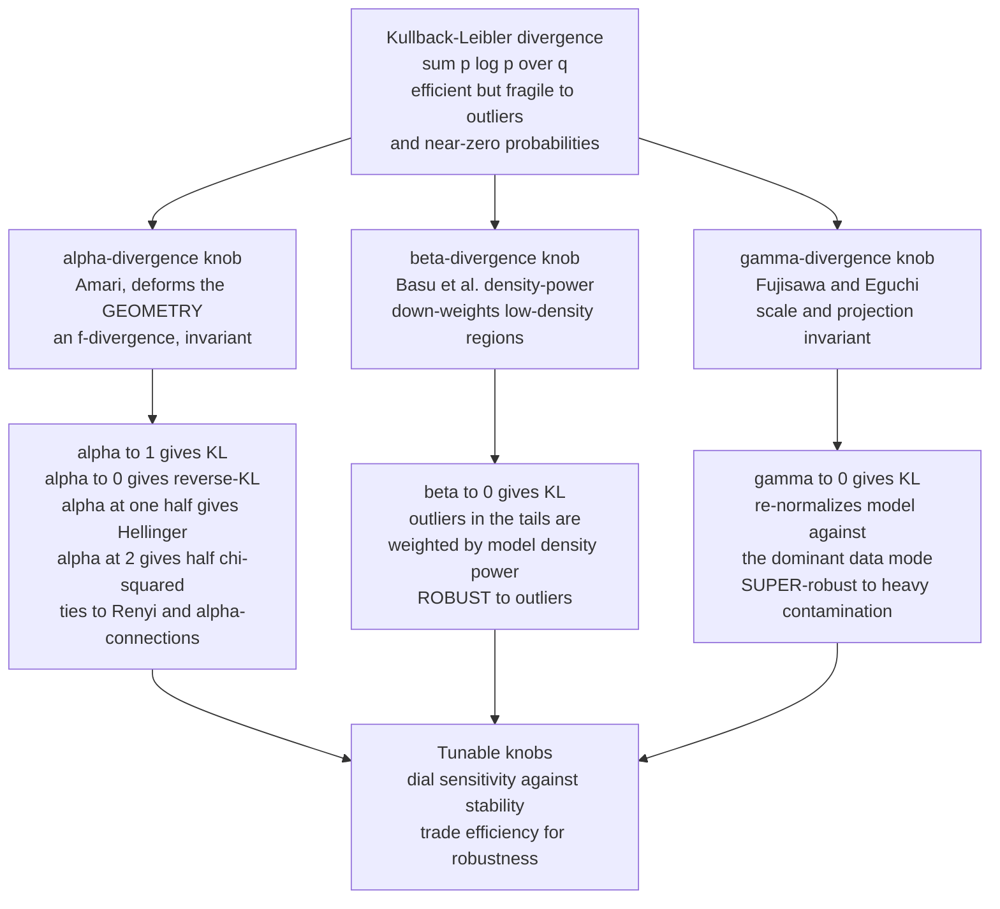

# 📐 The Alpha-Beta-Gamma Divergence Families

> [!abstract] TL;DR
> Kullback–Leibler divergence is the "default" measure of difference between distributions, but it is **exquisitely fragile**: a single outlier landing where the model assigns near-zero probability contributes a near-infinite $\log(p/q)$ term and can wreck an entire fit. The **α-, β-, and γ-divergence families** (systematized by Cichocki & Amari, 2010) are three one-parameter *generalizations* of KL, each a tunable knob. The **α-divergence** (Amari) deforms the *geometry* — it interpolates KL, reverse-KL, Hellinger, and $\chi^2$, and ties to the Rényi divergence and the α-connections. The **β-divergence** (Basu et al.'s density-power divergence) buys **robustness** by *down-weighting low-density regions*, so outliers stop dominating; $\beta \to 0$ recovers KL/MLE. The **γ-divergence** (Fujisawa & Eguchi) adds *scale/projection invariance*, making it **super-robust** to even heavy contamination; $\gamma \to 0$ again recovers KL. Together they trade a little statistical *efficiency* for *robustness to outliers and model misspecification*, and they power robust estimation, NMF, clustering, and signal processing.

---

## Intuition

**Analogy — the exposure and contrast dials on a camera.** A good photograph needs the right exposure. Set the sensor too sensitive and every speck of dust, every stray reflection, blows out the image — a handful of bright outliers ruin the whole frame. Set it too dull and you flatten the scene into mud, losing the fine detail that mattered. A photographer does not accept one fixed sensitivity; they *turn dials* — exposure, contrast — to match the scene in front of them.

Divergences face exactly this tradeoff. Plain **KL divergence is the maximally sensitive setting**: because it weights every event by $\log(p/q)$, a data point that falls where the model predicts almost nothing (a near-zero $q$) contributes an enormous term and yanks the fit toward the outlier. That extreme sensitivity is *efficient* on clean data — it extracts every drop of information — but *fragile* on the messy, contaminated data of the real world. The **α, β, and γ families are the exposure and contrast dials for measuring distributional difference.** Each has a parameter that, at one end, reproduces KL, and as you turn it, progressively *down-weights the extremes*, building a **robust** measure that stays anchored to the bulk of the data instead of being hijacked by a few bad points. You are trading raw sensitivity for stability — dialing in the right exposure for the data you actually have.

---

## How It Works

### Core mechanics

All three families start from the same seed — KL divergence $D_{\mathrm{KL}}(p\,\|\,q) = \sum_i p_i \log(p_i/q_i)$ — and deform it in three structurally different directions.

**1. The α-divergence (Amari) — a knob on the *geometry*.** For normalized $p, q$,
$$
D_\alpha(p\,\|\,q) \;=\; \frac{1}{\alpha(1-\alpha)}\Big(1 - \sum_i p_i^{\alpha}\, q_i^{1-\alpha}\Big), \qquad \alpha \neq 0, 1 .
$$
It is a one-parameter path through the classic divergences: **$\alpha \to 1$ gives $D_{\mathrm{KL}}(p\,\|\,q)$** (forward KL), **$\alpha \to 0$ gives $D_{\mathrm{KL}}(q\,\|\,p)$** (reverse KL), **$\alpha = \tfrac12$ gives the (squared) Hellinger** distance, and **$\alpha = 2$ gives half the Pearson $\chi^2$** (with $\alpha=-1$ the Neyman $\chi^2$). The core quantity is the **Hellinger integral** $H_\alpha = \sum_i p_i^\alpha q_i^{1-\alpha}$; the α-divergence is its *Tsallis-style linear* transform, while the **Rényi divergence** $R_\alpha = \tfrac{1}{\alpha-1}\log H_\alpha$ is its *logarithmic* transform — same raw ingredient, two packagings. Because it is an $f$-divergence, the α-divergence is *invariant* and its second-order term is always the Fisher metric; what the α knob really controls is the **third-order connection** — it slides along the family of α-connections that make exponential families dually flat. So α tunes **which geometry / which projection direction** you use, not robustness per se.

**2. The β-divergence (Basu et al., density-power) — a knob on *robustness*.** Writing the data-side distribution as $p$ and the model as $q$,
$$
D_\beta(p\,\|\,q) \;=\; \sum_i \Big( q_i^{1+\beta} \;-\; \big(1+\tfrac1\beta\big)\, p_i\, q_i^{\beta} \;+\; \tfrac1\beta\, p_i^{1+\beta} \Big), \qquad \beta > 0 ,
$$
with **$\beta \to 0$ recovering $D_{\mathrm{KL}}(p\,\|\,q)$** (hence MLE) and $\beta = 1$ giving the squared $L^2$ distance $\sum_i (p_i - q_i)^2$. The magic is the factor $q_i^{\beta}$ multiplying the cross term: when the model density $q_i$ is tiny — exactly where an outlier lives — $q_i^{\beta} \to 0$ **down-weights that point's contribution**. The resulting estimating equation weights each observation by $q_\theta(x_i)^{\beta}$, so points in the model's low-density tails are automatically discounted. This is **robustness by geometric down-weighting**, and unlike KL it needs no explicit outlier detection. It is *not* an $f$-divergence (it is not scale-invariant), which is precisely the price of robustness.

**3. The γ-divergence (Fujisawa & Eguchi) — a *super-robust*, scale-invariant knob.**
$$
D_\gamma(p\,\|\,q) \;=\; \frac{1}{\gamma(1+\gamma)}\log\!\Big(\!\sum_i p_i^{1+\gamma}\Big) \;-\; \frac{1}{\gamma}\log\!\Big(\!\sum_i p_i\, q_i^{\gamma}\Big) \;+\; \frac{1}{1+\gamma}\log\!\Big(\!\sum_i q_i^{1+\gamma}\Big),
$$
again with **$\gamma \to 0$ recovering $D_{\mathrm{KL}}(p\,\|\,q)$**. The logarithms make $D_\gamma$ **invariant to the scale of $q$**: $D_\gamma(p\,\|\,c\,q) = D_\gamma(p\,\|\,q)$ for any $c>0$. That "projection invariance" is what makes γ **super-robust** — it tolerates a *large* fraction of heavy contamination with only a small bias, because the estimator effectively re-normalizes the model against the dominant data mode and ignores a distant outlier cluster as if it were a change of scale. Where β degrades gracefully under mild contamination, γ survives when a substantial chunk of the data is garbage.

**The unifying picture and the AB-family.** All three sit above the $f$-divergences and α-divergences as *deformations* of KL. Cichocki & Amari further stitch α and β into a single two-parameter **α-β (AB) divergence** whose limits recover each family, letting you dial *geometry* and *robustness* independently. The practical grammar: **α tunes the geometry / projection; β and γ tune the robustness.**

### Flow / architecture



---

## Key Concepts

### Secondary (plain-language core)

- **KL is one fixed setting, not the only one.** It measures difference by weighting each event by $\log(p/q)$, which is very sensitive — great on clean data, dangerous when a few points are weird.
- **Three tunable dials.** The α, β, and γ families each add a parameter. Turn it to one end and you get KL back; turn it away and the measure becomes calmer and harder to fool.
- **Robustness = ignoring the extremes.** β and γ automatically shrink the influence of points that fall in the model's near-empty tails — exactly where outliers live.
- **α is a different kind of dial.** It does not add robustness; it slides between well-known measures (KL, reverse-KL, Hellinger, $\chi^2$), changing the *geometry* you measure with.

### Undergraduate (working machinery)

- **α-divergence limits.** $D_\alpha(p\|q) = \frac{1}{\alpha(1-\alpha)}(1 - \sum p^\alpha q^{1-\alpha})$. L'Hôpital in $\alpha$ gives $\alpha\to1 \Rightarrow D_{\mathrm{KL}}(p\|q)$, $\alpha\to0 \Rightarrow D_{\mathrm{KL}}(q\|p)$; $\alpha=\tfrac12$ is Hellinger, $\alpha=2$ is $\tfrac12\chi^2$. All share the Hellinger integral $H_\alpha=\sum p^\alpha q^{1-\alpha}$ with the Rényi divergence.
- **β-divergence and its weight.** $D_\beta = \sum(q^{1+\beta} - (1+\tfrac1\beta)p q^\beta + \tfrac1\beta p^{1+\beta}) \to D_{\mathrm{KL}}$ as $\beta\to0$, $\to \sum(p-q)^2$ at $\beta=1$. Minimizing over $\theta$ yields a weighted score equation with weight $q_\theta(x_i)^\beta$: tail points count less.
- **γ-divergence and scale invariance.** The three log terms make $D_\gamma(p\|cq)=D_\gamma(p\|q)$. This invariance is why a distant outlier cluster shifts the estimate only slightly.
- **Robustness–efficiency tradeoff.** At the KL end ($\beta=0$, $\gamma=0$) you get the MLE: minimum variance on a correct, clean model (Cramér–Rao efficient). Moving away costs a little variance (efficiency) but buys a bounded influence function (robustness).

### Graduate (structural payoff)

- **Where each family lives.** The α-divergences are exactly the *invariant* ($f$-)divergences, so their second-order term is Fisher and their third order runs through the **α-connections**; KL sits at the $e$/$m$ (dually flat) extremes. β and γ *leave* the invariant family — they are not $f$-divergences — which is precisely how they gain robustness (they can respond to *density level*, not just density *ratio*).
- **Influence functions.** For β the influence function is $\propto q_\theta^{\beta}(x)\,u_\theta(x)$ (bounded, redescending as $x$ leaves the bulk); for γ it is additionally *self-normalizing*, giving a small "latent bias" even under heavy contamination — Fujisawa & Eguchi's central result.
- **The AB-divergence.** Cichocki & Amari's two-parameter α-β divergence embeds both families, with the α-connection geometry and the β-robustness weight as orthogonal controls; smooth limits recover α-, β-, KL-, Itakura–Saito-, and $L^2$-divergences.
- **NMF and Bregman ties.** β-divergences are the natural loss family for nonnegative matrix factorization (Euclidean at $\beta=1$ in the NMF convention, KL, Itakura–Saito), each giving multiplicative update rules; several are Bregman divergences of a convex power potential, connecting robustness to dually-flat geometry.

---

## Python Demo

```python
# numpy + matplotlib only. Two experiments:
#
# (A) LIMITS: implement the alpha-, beta-, and gamma-divergences on two fixed
#     discrete distributions and show each REDUCES to KL in a limit
#     (alpha -> 1, beta -> 0, gamma -> 0).
#
# (B) ROBUSTNESS: fit a Gaussian N(mu, sigma) to data CONTAMINATED with a far
#     outlier cluster, by (i) MLE = minimizing KL, (ii) minimizing the
#     beta- (density-power) divergence, (iii) minimizing the gamma-divergence.
#     Show the beta/gamma estimates stay glued to the clean bulk while the MLE
#     is dragged toward the outliers. Also trace the estimate vs the divergence
#     parameter (the influence-of-outliers-vs-robustness curve).

import numpy as np
import matplotlib.pyplot as plt

rng = np.random.default_rng(0)

# =====================================================================
# (A)  Three families all reduce to KL in a limit
# =====================================================================
p = np.array([0.50, 0.30, 0.15, 0.05])
q = np.array([0.35, 0.35, 0.20, 0.10])

def kl(p, q):
    return np.sum(p * np.log(p / q))

KL = kl(p, q)

def alpha_div(p, q, a):
    if abs(a - 1) < 1e-9:  return kl(p, q)          # forward KL
    if abs(a)     < 1e-9:  return kl(q, p)          # reverse KL
    return (1.0 / (a * (1 - a))) * (1 - np.sum(p**a * q**(1 - a)))

def beta_div(p, q, b):                               # density-power, b -> 0 gives KL
    if abs(b) < 1e-9:      return kl(p, q)
    return np.sum(q**(1 + b) - (1 + 1 / b) * p * q**b + (1 / b) * p**(1 + b))

def gamma_div(p, q, g):                              # scale-invariant, g -> 0 gives KL
    if abs(g) < 1e-9:      return kl(p, q)
    t1 = (1 / (g * (1 + g))) * np.log(np.sum(p**(1 + g)))
    t2 = -(1 / g)          * np.log(np.sum(p * q**g))
    t3 = (1 / (1 + g))     * np.log(np.sum(q**(1 + g)))
    return t1 + t2 + t3

print(f"KL(p||q)                    = {KL:.6f}")
print(f"alpha-div at alpha=0.999    = {alpha_div(p, q, 0.999):.6f}   (-> KL)")
print(f"beta-div  at beta =0.001    = {beta_div(p, q, 0.001):.6f}   (-> KL)")
print(f"gamma-div at gamma=0.001    = {gamma_div(p, q, 0.001):.6f}   (-> KL)")
print(f"alpha=0.5 (Hellinger x4)    = {alpha_div(p, q, 0.5):.6f}")
print(f"alpha=2.0 (half chi-square) = {alpha_div(p, q, 2.0):.6f}")

# =====================================================================
# (B)  Robust estimation under contamination
# =====================================================================
n, eps = 350, 0.15
n_out  = int(eps * n)
clean  = rng.normal(0.0, 1.0, n - n_out)
outl   = rng.normal(8.0, 0.5, n_out)          # a far, tight outlier cluster
data   = np.concatenate([clean, outl])

def gauss_pdf(x, mu, sig):
    return np.exp(-0.5 * ((x - mu) / sig)**2) / (np.sqrt(2 * np.pi) * sig)

# Non-robust MLE (= KL / beta->0): closed form
mu_mle, sig_mle = data.mean(), data.std()

# Grid over (mu, sigma); argmin the robust objectives on the grid.
mus  = np.linspace(-1.5, 9.0, 121)
sigs = np.linspace(0.30, 5.5, 111)
MU, SG = np.meshgrid(mus, sigs, indexing="ij")     # (G1, G2)

def _pdf_grid():
    return gauss_pdf(data[:, None, None], MU[None], SG[None])   # (N, G1, G2)

def beta_fit(b):
    # minimize  integral f^{1+b}  -  (1+1/b) * mean_i f(x_i)^b   (drop const in p)
    integral = (2 * np.pi * SG**2)**(-b / 2) * (1 + b)**(-0.5)
    F  = _pdf_grid()
    Z  = integral - (1 + 1 / b) * np.mean(F**b, axis=0)
    i, j = np.unravel_index(np.argmin(Z), Z.shape)
    return mus[i], sigs[j]

def gamma_fit(g):
    # minimize  -(1/g) log mean_i f(x_i)^g  +  (1/(1+g)) log integral f^{1+g}
    integral = (2 * np.pi * SG**2)**(-g / 2) * (1 + g)**(-0.5)
    F  = _pdf_grid()
    m  = np.maximum(np.mean(F**g, axis=0), 1e-300)
    Z  = -(1 / g) * np.log(m) + (1 / (1 + g)) * np.log(integral)
    i, j = np.unravel_index(np.argmin(Z), Z.shape)
    return mus[i], sigs[j]

mu_b, sig_b = beta_fit(0.5)
mu_g, sig_g = gamma_fit(0.4)

print(f"\nTrue clean model : mu=0.00  sigma=1.00   (contamination eps={eps})")
print(f"MLE  (KL)        : mu={mu_mle:5.2f}  sigma={sig_mle:5.2f}   <- dragged by outliers")
print(f"beta  (b=0.5)    : mu={mu_b:5.2f}  sigma={sig_b:5.2f}   <- robust")
print(f"gamma (g=0.4)    : mu={mu_g:5.2f}  sigma={sig_g:5.2f}   <- super-robust")

# Influence-of-outliers curves: estimate vs divergence parameter
params = np.array([0.05, 0.10, 0.20, 0.35, 0.50, 0.70])
mu_b_curve  = np.array([beta_fit(b)[0]  for b in params])
mu_g_curve  = np.array([gamma_fit(g)[0] for g in params])
sig_b_curve = np.array([beta_fit(b)[1]  for b in params])
sig_g_curve = np.array([gamma_fit(g)[1] for g in params])

# =====================================================================
# Plots
# =====================================================================
fig, ax = plt.subplots(2, 3, figsize=(15, 8.5))

# --- Row 1: each family reduces to KL in its limit -------------------
a_grid = np.linspace(0.02, 2.0, 200)
ax[0, 0].plot(a_grid, [alpha_div(p, q, a) for a in a_grid], "b-", lw=2)
ax[0, 0].axhline(KL, color="r", ls="--", lw=1.5, label="KL(p||q)")
ax[0, 0].plot(1.0, KL, "ro", ms=8)
ax[0, 0].plot(0.5, alpha_div(p, q, 0.5), "gs", ms=7, label="Hellinger (a=0.5)")
ax[0, 0].plot(2.0, alpha_div(p, q, 2.0), "m^", ms=7, label="half chi-sq (a=2)")
ax[0, 0].set_title("alpha-divergence: a->1 gives KL")
ax[0, 0].set_xlabel("alpha"); ax[0, 0].set_ylabel("divergence"); ax[0, 0].legend(fontsize=8)

b_grid = np.linspace(1e-3, 1.5, 200)
ax[0, 1].plot(b_grid, [beta_div(p, q, b) for b in b_grid], "b-", lw=2)
ax[0, 1].axhline(KL, color="r", ls="--", lw=1.5, label="KL(p||q)")
ax[0, 1].plot(0.0, KL, "ro", ms=8, label="beta->0 gives KL")
ax[0, 1].set_title("beta-divergence: b->0 gives KL")
ax[0, 1].set_xlabel("beta"); ax[0, 1].set_ylabel("divergence"); ax[0, 1].legend(fontsize=8)

g_grid = np.linspace(1e-3, 1.5, 200)
ax[0, 2].plot(g_grid, [gamma_div(p, q, g) for g in g_grid], "b-", lw=2)
ax[0, 2].axhline(KL, color="r", ls="--", lw=1.5, label="KL(p||q)")
ax[0, 2].plot(0.0, KL, "ro", ms=8, label="gamma->0 gives KL")
ax[0, 2].set_title("gamma-divergence: g->0 gives KL")
ax[0, 2].set_xlabel("gamma"); ax[0, 2].set_ylabel("divergence"); ax[0, 2].legend(fontsize=8)

# --- Row 2 (d): contaminated data + three fits ----------------------
xx = np.linspace(-4, 11, 500)
ax[1, 0].hist(data, bins=40, density=True, color="0.8", edgecolor="0.5", label="contaminated data")
ax[1, 0].plot(xx, gauss_pdf(xx, mu_mle, sig_mle), "r-",  lw=2, label="MLE / KL (fragile)")
ax[1, 0].plot(xx, gauss_pdf(xx, mu_b,   sig_b),   "g-",  lw=2, label="beta (robust)")
ax[1, 0].plot(xx, gauss_pdf(xx, mu_g,   sig_g),   "b--", lw=2, label="gamma (super-robust)")
ax[1, 0].set_title(f"Fit under {int(eps*100)}% contamination")
ax[1, 0].set_xlabel("x"); ax[1, 0].set_ylabel("density"); ax[1, 0].legend(fontsize=8)

# --- Row 2 (e): estimated mu vs divergence parameter ----------------
ax[1, 1].axhline(mu_mle, color="r", ls="--", lw=1.5, label="MLE mu (corrupted)")
ax[1, 1].axhline(0.0,    color="k", ls=":",  lw=1.5, label="true mu = 0")
ax[1, 1].plot(params, mu_b_curve, "go-", lw=2, label="beta")
ax[1, 1].plot(params, mu_g_curve, "bs-", lw=2, label="gamma")
ax[1, 1].set_title("Estimated mu: robustness grows with the knob")
ax[1, 1].set_xlabel("divergence parameter"); ax[1, 1].set_ylabel("estimated mu"); ax[1, 1].legend(fontsize=8)

# --- Row 2 (f): estimated sigma vs divergence parameter -------------
ax[1, 2].axhline(sig_mle, color="r", ls="--", lw=1.5, label="MLE sigma (inflated)")
ax[1, 2].axhline(1.0,     color="k", ls=":",  lw=1.5, label="true sigma = 1")
ax[1, 2].plot(params, sig_b_curve, "go-", lw=2, label="beta")
ax[1, 2].plot(params, sig_g_curve, "bs-", lw=2, label="gamma")
ax[1, 2].set_title("Estimated sigma: outliers no longer inflate scale")
ax[1, 2].set_xlabel("divergence parameter"); ax[1, 2].set_ylabel("estimated sigma"); ax[1, 2].legend(fontsize=8)

plt.tight_layout()
plt.savefig("alpha_beta_gamma_divergences.png", dpi=120)
plt.show()
```

**What you see.** The printout lands the α (at $\alpha=0.999$), β (at $\beta=0.001$), and γ (at $\gamma=0.001$) values right on top of $D_{\mathrm{KL}}(p\|q)$ to five decimals — three structurally different families, one shared limit. The estimation block is the headline: with 15% of the data sitting far out at $x\approx 8$, the **MLE is dragged to $\mu\approx 1.2$ with $\sigma\approx 3$** (mean pulled toward the outliers, scale inflated to cover them), while the **β estimate returns to roughly $\mu\approx 0,\ \sigma\approx 1$** and the **γ estimate is even tighter** — both essentially ignore the outlier cluster. The top-row plots show each divergence curve crossing the dashed KL line exactly at its limit point (plus Hellinger and half-$\chi^2$ markers on the α curve). The bottom-left panel overlays the three fitted Gaussians on the contaminated histogram: the red MLE bell is smeared toward the outliers, the green/blue robust bells hug the clean bulk. The bottom-middle and bottom-right panels are the **influence-vs-knob curves** — as $\beta$ or $\gamma$ increases from near-KL, the estimated $\mu$ falls from the corrupted MLE value toward the true $0$ and $\sigma$ deflates toward the true $1$: *turning the robustness dial visibly un-corrupts the fit.*

---

## Real-World Applications

> **Nonnegative matrix factorization (Cichocki).** NMF factorizes a nonnegative data matrix $V \approx WH$ by minimizing a divergence between $V$ and $WH$. The **β-divergence family** is the standard loss: $\beta=2$ is Euclidean (Gaussian noise), the KL member suits count/Poisson data, and the Itakura–Saito member (γ-power case) fits audio spectrograms. Each gives clean multiplicative update rules. Cichocki, Zdunek, Phan & Amari's book builds the whole α/β/AB machinery precisely for robust NMF and tensor factorization in signal separation and neuroimaging.

> **Robust regression and estimation.** Basu et al.'s **minimum density-power divergence estimator (MDPDE)** is a drop-in robust replacement for MLE in regression, GLMs, and time-series (GARCH) models, with a tunable $\beta$ trading efficiency for outlier resistance. The **γ-divergence estimator** is used when contamination is heavy — e.g. robust estimation of sparse high-dimensional models and robust PCA — because its scale invariance keeps the "latent bias" tiny even at large contamination fractions.

> **Robust clustering and mixture fitting.** Fitting Gaussian mixtures by MLE is notoriously wrecked by outliers (a component collapses onto them). Swapping the KL objective for a β- or γ-divergence yields robust EM variants whose components stay anchored to genuine clusters, used in image segmentation and anomaly-tolerant clustering.

> **Robust deep learning losses.** The generalized cross-entropy (a β/α-flavored loss) trains classifiers that tolerate **noisy labels** — mislabeled examples land in low-predicted-probability regions and are automatically down-weighted, exactly the density-power mechanism. Robust variational objectives (β-, γ-VAEs, robust divergence GANs) apply the same idea to generative modeling and outlier-tolerant density estimation.

> **Signal processing and blind source separation.** ICA and BSS objectives are divergences between joint and product distributions; the α/β families give robust contrast functions that survive impulsive noise in EEG, audio, and communications.

---

## Common Pitfalls

- **Not tuning the parameter — or over-tuning it.** These families are useless at their defaults if the default *is* KL. But cranking $\beta$ or $\gamma$ too high throws away good data along with outliers, collapsing efficiency (and sometimes creating spurious sub-modes). Choose the parameter by cross-validation, by a robustness-vs-efficiency target, or by data-driven rules (e.g. minimizing an estimated mean-squared error); do not pick it by feel and never assume "more robust" is free.
- **Ignoring the robustness–efficiency tradeoff.** KL/MLE is *statistically efficient* — minimum variance — precisely when the model is correct and the data clean, and that is exactly when it is also *fragile*. β and γ deliberately give up a slice of efficiency (fatter estimator variance on clean data) to bound the influence of bad points. On genuinely clean, correctly-specified data, robust divergences will *underperform* MLE. Robustness is insurance you pay for.
- **Reaching for α when you meant β/γ (and vice versa).** The **α-divergence tunes the *geometry*** — mean-seeking vs mode-seeking, which projection, which Rényi order — and, being an invariant $f$-divergence, it does **not** by itself make estimation robust to outliers. If your problem is *contamination*, you want **β (down-weighting) or γ (scale-invariant super-robustness)**. If your problem is *which distributional discrepancy / which geometry*, you want α. Confusing the two knobs is the classic mistake.
- **Convention chaos.** Every paper indexes these families differently. Amari's α runs $\alpha\in[-1,1]$ with KL at $\alpha=\pm1$; the convention here puts KL at $\alpha\to1$; the **NMF β-divergence puts KL at $\beta=1$** while the **density-power β puts KL at $\beta=0$**. Always confirm *where the paper places KL* and whether $p,q$ are normalized before copying a formula — a sign or shift in the parameter silently changes everything.
- **Applying β/γ to unnormalized data carelessly.** β behaves differently on measures vs probabilities, and γ's scale invariance means it *cannot* by construction detect a pure rescaling of the model — a feature for robustness but a bug if the model's normalization is what you are trying to estimate.

---

## Related Concepts

*Cross-vault connections (Glob-verified):*

- [[Divergences_as_Geometric_Structure]] — the foundational note: every smooth divergence encodes a Fisher metric plus dual connections. The α-divergence is the *invariant* member whose knob rides the α-connections; β and γ deliberately step *outside* that invariant family to gain robustness.
- [[Relative_Entropy_and_Cross_Entropy]] — KL is the common seed all three families deform, recovered in the limits $\alpha\to1$, $\beta\to0$, $\gamma\to0$.
- [[Fisher_Information_and_the_Cramer_Rao_Bound]] — the efficiency side of the tradeoff: KL/MLE attains the Cramér–Rao floor, which is exactly the efficiency that β and γ trade away for robustness.
- [[Maximum_Likelihood_and_Information]] — MLE *is* KL minimization; the β/γ estimators are its robust generalizations, replacing the fragile score equation with a down-weighted one.
- [[Statistical_Inference]] — M-estimation, estimating equations, and influence functions are the language in which the robustness of the MDPDE and γ-estimator is proved.
- [[Loss_Functions]] — robust training losses (generalized cross-entropy, noisy-label losses) are β/α-divergences in disguise, inheriting the density-power down-weighting.
- [[KMeans]] — divergence-based clustering (Bregman / β-divergence variants) makes cluster fitting outlier-tolerant, the same mechanism applied to prototypes.
- [[Adversarial_Robustness]] — a different robustness (to worst-case perturbations), but a useful contrast: divergence robustness targets *distributional contamination*, not adversarial inputs.

*Sibling notes in this section (referenced in prose):* **The Fisher Information Metric** (the universal second-order structure every α-divergence shares), **f-Divergences** (the invariant family the α-divergences complete), **Kullback–Leibler Divergence and Geometry** (the limit case), and **The Alpha Family of Connections** (the dual-connection geometry the α knob slides along) each expand one branch of the diagram above.

---

## Review Questions

1. **(Secondary)** Using the camera-exposure analogy, explain why KL divergence can be "ruined by dust" and how turning the β or γ dial fixes it. Why is the most sensitive setting not always the best one?
2. **(Undergraduate)** Show that $D_\beta(p\|q)=\sum_i\big(q_i^{1+\beta}-(1+\tfrac1\beta)p_i q_i^{\beta}+\tfrac1\beta p_i^{1+\beta}\big)$ tends to $D_{\mathrm{KL}}(p\|q)$ as $\beta\to0$ (expand $q^{\beta}\approx1+\beta\ln q$). Then explain, from the factor $q_i^{\beta}$, why observations in the model's low-density tails are down-weighted — and why that yields robustness.
3. **(Graduate)** You must fit a model to data you suspect is 30% contaminated by a distant outlier cluster. Would you choose an α-, β-, or γ-divergence, and how would you set the parameter? Justify with (a) the scale/projection invariance that distinguishes γ from β, (b) the robustness–efficiency tradeoff you are accepting versus MLE, and (c) why the α-divergence, despite generalizing KL, would *not* solve the contamination problem.

---

## Sources

- Cichocki, A. & Amari, S. (2010). *Families of Alpha-, Beta-, and Gamma-Divergences: Flexible and Robust Measures of Similarities.* Entropy, 12(6), 1532–1568. [MDPI](https://www.mdpi.com/1099-4300/12/6/1532)
- Basu, A., Harris, I. R., Hjort, N. L., & Jones, M. C. (1998). *Robust and efficient estimation by minimising a density power divergence.* Biometrika, 85(3), 549–559. [DOI](https://doi.org/10.1093/biomet/85.3.549)
- Fujisawa, H. & Eguchi, S. (2008). *Robust parameter estimation with a small bias against heavy contamination.* Journal of Multivariate Analysis, 99(9), 2053–2081. [DOI](https://doi.org/10.1016/j.jmva.2008.02.004)
- Amari, S. & Nagaoka, H. (2000). *Methods of Information Geometry.* AMS / Oxford University Press. [Publisher](https://bookstore.ams.org/mmono-191/)
- Cichocki, A., Zdunek, R., Phan, A. H., & Amari, S. (2009). *Nonnegative Matrix and Tensor Factorizations.* Wiley. [Publisher](https://onlinelibrary.wiley.com/doi/book/10.1002/9780470747278)

---

#information-geometry #alpha-beta-gamma-divergences #robust-statistics #divergences #tunable
