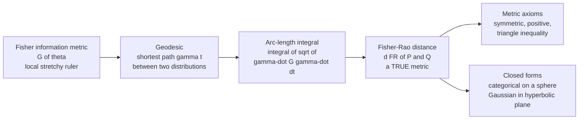

# 📐 The Fisher-Rao Distance

> [!abstract] TL;DR
> The **Fisher-Rao distance** (Rao, 1945) is the length of the **shortest path — the geodesic — between two probability distributions** on the statistical manifold, measured with the Fisher information metric: $d_{\mathrm{FR}}(P,Q) = \min_{\gamma} \int_0^1 \sqrt{\dot\gamma^\top G(\gamma)\,\dot\gamma}\; dt$. Unlike the KL divergence — which is asymmetric and violates the triangle inequality, so it is *not* a distance you can navigate with — the Fisher-Rao distance is a **genuine Riemannian metric**: symmetric, positive, and triangle-obeying. Closed forms are rare but beautiful: for the **categorical** family the $\sqrt{p}$ embedding sends the simplex to a **sphere** and $d_{\mathrm{FR}} = 2\arccos\big(\sum_i\sqrt{p_i q_i}\big)$ (twice the Bhattacharyya angle; Hellinger is the chord); for the **univariate Gaussian** the $(\mu,\sigma)$ half-plane *is* the **hyperbolic (Poincaré) plane** and $d_{\mathrm{FR}}$ is a hyperbolic distance. It is the "as-the-crow-flies" distance across the curved landscape of distributions.

---

## Intuition

**Analogy — the crow versus the compass.** The KL divergence tells you how different two distributions are, but it is *lopsided*: the effort to mistake $P$ for $Q$ is not the effort to mistake $Q$ for $P$, and hopping $A\to B\to C$ can somehow be "cheaper" than going $A\to C$ directly. KL is a **divergence**, not a distance — a directed, squared-ish separation with no triangle inequality, the way "gallons of fuel burned uphill" is not a symmetric notion of distance between two towns.

The **Fisher-Rao distance fixes this.** Picture the space of all distributions as a curved, hilly terrain whose local stretch is set by the Fisher metric (the "stretchy ruler" from *The_Fisher_Information_Metric*). The Fisher-Rao distance is the **length of the shortest path a crow would fly across that terrain** — a genuine, symmetric, triangle-obeying metric distance. Two remarkable things fall out of the geometry: for **discrete (categorical) distributions**, the shortest path is a **great-circle arc on a sphere**; for **Gaussians**, it is a **geodesic of hyperbolic geometry**, the same negatively-curved world of saddles and Escher tilings. The abstract "distance between distributions" turns out to be plain old spherical and hyperbolic trigonometry in disguise.

---

## How It Works

### From metric to distance

The Fisher information matrix $G(\theta)$ gives only an **infinitesimal** ruler: the squared length of a tiny step $d\theta$ is $ds^2 = d\theta^\top G(\theta)\, d\theta$ (see *The_Fisher_Information_Metric* and *Riemannian_Geometry_Primer_for_Statistics*). To get a **global** distance between two distributions $P = p_{\theta_A}$ and $Q = p_{\theta_B}$, you must add up these infinitesimal lengths along a connecting curve $\gamma(t)$, and then take the *shortest* such curve:

$$
d_{\mathrm{FR}}(P, Q) \;=\; \min_{\gamma:\,\theta_A \to \theta_B} \; \int_0^1 \sqrt{\dot\gamma(t)^\top\, G(\gamma(t))\, \dot\gamma(t)}\;dt .
$$

The minimizing curve is the **geodesic** — the manifold's version of a straight line. Because $G$ varies from point to point (the ruler stretches), the geodesic is generally *curved* in parameter coordinates, and its length is **not** the Euclidean gap $\lVert\theta_A - \theta_B\rVert$.

### Why it is a true metric (and KL is not)

Any distance arising as the **arc length of a Riemannian metric** automatically satisfies the three metric axioms (see *Metric_Spaces*):

1. **Positivity / identity:** $d_{\mathrm{FR}}(P,Q) \ge 0$, with equality iff $P = Q$ (the shortest path has zero length only for coincident points).
2. **Symmetry:** $d_{\mathrm{FR}}(P,Q) = d_{\mathrm{FR}}(Q,P)$ — a path traversed backwards has the same length.
3. **Triangle inequality:** $d_{\mathrm{FR}}(P,R) \le d_{\mathrm{FR}}(P,Q) + d_{\mathrm{FR}}(Q,R)$ — the direct geodesic cannot be longer than a detour through $Q$.

The **KL divergence** $D(P\Vert Q)$ fails (2) and (3): it is asymmetric and obeys no triangle inequality. It is only the *local, second-order* shadow of the metric, $D(p_\theta \Vert p_{\theta+d\theta}) \approx \tfrac12 d\theta^\top G\, d\theta$ — so KL and Fisher-Rao **agree infinitesimally** ($d_{\mathrm{FR}}^2 \approx 2D$ for nearby distributions) but diverge globally (contrast with *Kullback_Leibler_Divergence_and_Geometry*).

### Closed form 1 — categorical / multinomial: the sphere

For a categorical distribution $p = (p_1,\dots,p_k)$ on the simplex, apply the **square-root embedding** $z_i = \sqrt{p_i}$. Then $\sum_i z_i^2 = 1$, so every distribution becomes a point on the **positive orthant of a sphere**, and the Fisher metric becomes (a constant multiple of) the ordinary round metric of that sphere. Distances are therefore **great-circle arcs**:

$$
d_{\mathrm{FR}}(p, q) \;=\; 2\,\arccos\!\Big(\underbrace{\textstyle\sum_i \sqrt{p_i\,q_i}}_{\text{Bhattacharyya coeff. } BC}\Big).
$$

The dot product $z_p \cdot z_q = \sum_i\sqrt{p_i q_i}$ is exactly the **Bhattacharyya coefficient**, so the angle between the two embedded points is the Bhattacharyya angle $\arccos(BC)$ and the Fisher-Rao distance is twice it. The **Hellinger distance** $H = \sqrt{1 - BC}$ is the *straight-line chord* between the same two points, while Fisher-Rao is the *arc* over the surface — the chord-versus-arc relationship makes their kinship precise.

### Closed form 2 — univariate Gaussian: the hyperbolic plane

For $\mathcal{N}(\mu,\sigma)$ the Fisher metric is $ds^2 = \dfrac{d\mu^2 + 2\,d\sigma^2}{\sigma^2}$. Rescaling the mean $\bar\mu = \mu/\sqrt2$ turns this into $ds^2 = 2\,\dfrac{d\bar\mu^2 + d\sigma^2}{\sigma^2}$ — precisely (twice) the **Poincaré upper half-plane** metric, a surface of *constant negative curvature*. The Gaussian family is **hyperbolic**, and the Fisher-Rao distance is a hyperbolic distance:

$$
d_{\mathrm{FR}}\big((\mu_1,\sigma_1),(\mu_2,\sigma_2)\big) \;=\; \sqrt2\;\operatorname{arccosh}\!\left(1 + \frac{\big(\tfrac{\mu_1-\mu_2}{\sqrt2}\big)^2 + (\sigma_1-\sigma_2)^2}{2\,\sigma_1\sigma_2}\right).
$$

Geodesics are **vertical lines** (same mean, changing spread) and **semicircles centred on the $\sigma = 0$ axis** (changing mean). For equal means this collapses to the clean $d_{\mathrm{FR}} = \sqrt2\,\lvert\ln(\sigma_2/\sigma_1)\rvert$: scale differences are measured *logarithmically*, and the boundary $\sigma\to 0$ is infinitely far away.

### The hard case — multivariate Gaussian

For general $\mathcal{N}(\mu, \Sigma)$ there is **no simple closed form**; the manifold is the space of symmetric-positive-definite (SPD) matrices coupled to the mean, with a rich but intractable geometry. Special cases (fixed mean, or fixed covariance) reduce to the SPD affine-invariant metric $d(\Sigma_1,\Sigma_2) = \big(\sum_i \ln^2\lambda_i\big)^{1/2}$ where $\lambda_i$ are the generalized eigenvalues — the workhorse of diffusion-tensor imaging. The full case is handled by solving the **geodesic equations** numerically or via tight approximations (Calvo–Oller lower bounds; Nielsen's 2023 approximation).

### Computing geodesics in general

When no closed form exists, the geodesic $\gamma(t)$ solves the **geodesic ODE**

$$
\ddot\gamma^{\,k} + \Gamma^k_{ij}(\gamma)\,\dot\gamma^{\,i}\dot\gamma^{\,j} = 0,
\qquad
\Gamma^k_{ij} = \tfrac12 G^{k\ell}\big(\partial_i G_{j\ell} + \partial_j G_{i\ell} - \partial_\ell G_{ij}\big),
$$

with $\gamma(0)=\theta_A,\ \gamma(1)=\theta_B$ — a two-point boundary-value problem solved by shooting or path-relaxation, after which $d_{\mathrm{FR}}$ is the arc-length integral along the solution.



---

## Key Concepts

### Secondary (intuition-level)

- **Distance, not divergence.** Fisher-Rao is the crow's-flight distance across the curved space of distributions; KL is a one-way, lopsided cost that is not a real distance.
- **Shortest path = geodesic.** The distance is the length of the *straightest possible* curve between two distributions, measured with the Fisher ruler.
- **Discrete data lives on a sphere; Gaussians live in a saddle-world.** Categorical distributions embed on a sphere (great-circle distances); Gaussians embed in hyperbolic geometry.
- **It obeys the rules of distance.** Symmetric, never negative, and a detour is never shorter than going direct — the properties KL lacks.

### Undergraduate (needs probability + multivariable calculus)

- **Arc-length definition.** $d_{\mathrm{FR}} = \min_\gamma \int \sqrt{\dot\gamma^\top G\,\dot\gamma}\,dt$; the minimizer is the geodesic.
- **Categorical closed form.** $\sqrt{p}$ embedding $\Rightarrow$ sphere $\Rightarrow d_{\mathrm{FR}}(p,q)=2\arccos\big(\sum_i\sqrt{p_iq_i}\big)$; the argument is the Bhattacharyya coefficient, and $H=\sqrt{1-BC}$ (Hellinger) is the chord.
- **Gaussian closed form.** $(\mu,\sigma)$ half-plane $=$ hyperbolic plane; $d_{\mathrm{FR}} = \sqrt2\,\operatorname{arccosh}(\cdots)$; equal means give $\sqrt2\,\lvert\ln(\sigma_2/\sigma_1)\rvert$.
- **Local link to KL.** For nearby distributions $d_{\mathrm{FR}}^2 \approx 2\,D(P\Vert Q)$; globally they part ways.
- **Not Euclidean.** Because $G$ varies, $d_{\mathrm{FR}} \ne \lVert\theta_A-\theta_B\rVert$; geodesics bend away from the boundary of parameter space.

### Graduate (system-level)

- **Riemannian distance function.** $d_{\mathrm{FR}}$ is the intrinsic distance of the Riemannian manifold $(\mathcal{M}, G)$; it is complete for the Gaussian and categorical families (boundaries are at infinite distance).
- **Constant-curvature geometries.** Categorical $=$ spherical ($K>0$); univariate Gaussian $=$ hyperbolic ($K<0$). Their geodesics are great circles and Poincaré semicircles respectively — see *Non_Euclidean_Geometry*.
- **Invariance (Chentsov).** Because the Fisher metric is the *unique* metric invariant under sufficient statistics and Markov morphisms, the Fisher-Rao distance is the canonical, reparameterization-invariant distance between distributions (see *Chentsov_Uniqueness_Theorem*).
- **SPD geometry.** The (fixed-mean) multivariate Gaussian reduces to the affine-invariant metric on SPD matrices, $d(\Sigma_1,\Sigma_2)=\lVert\ln(\Sigma_1^{-1/2}\Sigma_2\Sigma_1^{-1/2})\rVert_F$ — the basis of tensor imaging and radar covariance geometry.
- **Relation to other transport distances.** Fisher-Rao is the *information* geometry distance; the Wasserstein distance is the *optimal-transport* geometry distance (see *Optimal_Transport_and_Wasserstein_Geometry*). They coincide only infinitesimally in special cases; the Wasserstein-Fisher-Rao (Hellinger-Kantorovich) metric interpolates between them.
- **Geodesic equations and numerics.** Christoffel symbols from $G$ give the geodesic ODE; boundary-value solvers (shooting, path relaxation) yield distances where closed forms are absent.

---

## Python Demo

```python
# numpy + matplotlib only.
# The FISHER-RAO DISTANCE = geodesic (shortest-path) distance under the Fisher metric.
# Unlike KL divergence it is a TRUE METRIC: symmetric, positive, triangle inequality.
#
# We use the two families with CLOSED-FORM Fisher-Rao distance:
#   (A) CATEGORICAL simplex:  sqrt-embedding  p -> sqrt(p)  lands on a SPHERE;
#       Fisher-Rao distance = arc length = 2 * arccos( sum_i sqrt(p_i q_i) ),
#       where sum_i sqrt(p_i q_i) is the Bhattacharyya coefficient and the
#       straight chord between the two sphere points is the Hellinger distance.
#   (B) univariate GAUSSIAN N(mu, sigma):  the (mu, sigma) half-plane with the
#       Fisher metric IS the HYPERBOLIC (Poincare) plane; geodesics are
#       semicircles, distance = sqrt(2) * arccosh( 1 + (dmu2 + dsigma^2)/(2 s1 s2) )
#       with the mean rescaled by 1/sqrt(2).
# Then we VERIFY the metric axioms numerically and contrast with KL.

import numpy as np
import matplotlib.pyplot as plt

rng = np.random.default_rng(1)

# ---------------------------------------------------------------------------
# CLOSED-FORM distances
# ---------------------------------------------------------------------------
def bhattacharyya(p, q):
    return float(np.sum(np.sqrt(p * q)))

def fisher_rao_categorical(p, q):
    bc = np.clip(bhattacharyya(p, q), -1.0, 1.0)
    return 2.0 * np.arccos(bc)                    # arc length on the sqrt-sphere

def hellinger(p, q):
    return np.sqrt(max(0.0, 1.0 - bhattacharyya(p, q)))   # the chord (scaled)

def kl(p, q):
    p = np.clip(p, 1e-12, 1.0); q = np.clip(q, 1e-12, 1.0)
    return float(np.sum(p * np.log(p / q)))

def fisher_rao_gaussian(m1, s1, m2, s2):
    a1, a2 = m1 / np.sqrt(2), m2 / np.sqrt(2)     # rescale mean -> exact Poincare
    arg = 1.0 + ((a1 - a2) ** 2 + (s1 - s2) ** 2) / (2.0 * s1 * s2)
    return np.sqrt(2) * np.arccosh(arg)

# ---------------------------------------------------------------------------
# PART A: categorical distributions on the sqrt-sphere (k = 3 -> unit 2-sphere)
# ---------------------------------------------------------------------------
p = np.array([0.60, 0.30, 0.10])
q = np.array([0.15, 0.25, 0.60])
u, v = np.sqrt(p), np.sqrt(q)                     # unit vectors on the sphere
Omega = np.arccos(np.clip(u @ v, -1, 1))         # angle between them
tt = np.linspace(0, 1, 60)
arc = (np.sin((1 - tt) * Omega)[:, None] * u +
       np.sin(tt * Omega)[:, None] * v) / np.sin(Omega)   # great-circle slerp

print("PART A  categorical p, q")
print("  Bhattacharyya coeff :", round(bhattacharyya(p, q), 4))
print("  Fisher-Rao (arc)    :", round(fisher_rao_categorical(p, q), 4))
print("  Hellinger  (chord)  :", round(hellinger(p, q), 4))
print("  KL(p||q), KL(q||p)  :", round(kl(p, q), 4), round(kl(q, p), 4),
      " <- asymmetric")

# ---------------------------------------------------------------------------
# PART B: Gaussian geodesics in the hyperbolic (mu/sqrt2, sigma) half-plane
# ---------------------------------------------------------------------------
def poincare_geodesic(a1, s1, a2, s2, n=80):
    # a = rescaled mean; returns a semicircle (or vertical line) between the pts
    if abs(a1 - a2) < 1e-9:
        y = np.linspace(s1, s2, n)
        return np.full(n, a1), y
    c = (a1 ** 2 - a2 ** 2 + s1 ** 2 - s2 ** 2) / (2 * (a1 - a2))   # center on axis
    R = np.hypot(a1 - c, s1)
    th1, th2 = np.arctan2(s1, a1 - c), np.arctan2(s2, a2 - c)
    th = np.linspace(th1, th2, n)
    return c + R * np.cos(th), R * np.sin(th)

gaussians = [(-2.0, 0.6), (2.0, 0.6), (0.0, 1.8), (-1.5, 1.4)]      # (mu, sigma)
print("\nPART B  Gaussian Fisher-Rao distances")
print("  N(-2,0.6) -> N(2,0.6):", round(fisher_rao_gaussian(-2, 0.6, 2, 0.6), 4))
print("  N(0,1.8)  -> N(0,0.6):", round(fisher_rao_gaussian(0, 1.8, 0, 0.6), 4),
      " == sqrt(2)*|ln(0.6/1.8)| =", round(np.sqrt(2) * abs(np.log(0.6 / 1.8)), 4))

# ---------------------------------------------------------------------------
# PART C+D: verify metric axioms on random triples; contrast with KL
# ---------------------------------------------------------------------------
def rand_simplex(k=4):
    x = rng.exponential(size=k)
    return x / x.sum()

n_tri = 20000
fr_slack, kl_asym = [], []
kl_tri_violations = 0
fr_tri_min = np.inf
for _ in range(n_tri):
    A, B, C = rand_simplex(), rand_simplex(), rand_simplex()
    # Fisher-Rao triangle inequality: d(A,C) <= d(A,B) + d(B,C)
    dab = fisher_rao_categorical(A, B)
    dbc = fisher_rao_categorical(B, C)
    dac = fisher_rao_categorical(A, C)
    slack = dab + dbc - dac                     # >= 0 for a true metric
    fr_slack.append(slack); fr_tri_min = min(fr_tri_min, slack)
    # KL: asymmetry and triangle-inequality violations
    kl_asym.append((kl(A, B), kl(B, A)))
    if kl(A, B) + kl(B, C) < kl(A, C):
        kl_tri_violations += 1

fr_slack = np.array(fr_slack); kl_asym = np.array(kl_asym)
print("\nPART C/D  metric check over", n_tri, "random categorical triples")
print("  Fisher-Rao  min triangle slack :", round(fr_tri_min, 6),
      " (>= 0 up to fp noise => METRIC ok)")
print("  KL          triangle violations:", kl_tri_violations,
      f"({100 * kl_tri_violations / n_tri:.1f} percent)")
print("  KL          mean |asymmetry|    :",
      round(float(np.mean(np.abs(kl_asym[:, 0] - kl_asym[:, 1]))), 4))

# ---------------------------------------------------------------------------
# FIGURE
# ---------------------------------------------------------------------------
fig = plt.figure(figsize=(13, 10))

# (a) sqrt-sphere embedding of the categorical family
axA = fig.add_subplot(2, 2, 1, projection="3d")
uu = np.linspace(0, np.pi / 2, 40); vv = np.linspace(0, np.pi / 2, 40)
UU, VV = np.meshgrid(uu, vv)
axA.plot_surface(np.sin(UU) * np.cos(VV), np.sin(UU) * np.sin(VV), np.cos(UU),
                 alpha=0.15, color="steelblue", linewidth=0)
axA.plot(arc[:, 0], arc[:, 1], arc[:, 2], "r-", lw=2.5,
         label="Fisher-Rao geodesic (arc)")
axA.plot([u[0], v[0]], [u[1], v[1]], [u[2], v[2]], "g--", lw=1.5,
         label="Hellinger (chord)")
axA.scatter(*u, color="k", s=40); axA.scatter(*v, color="k", s=40)
axA.text(*u, "  sqrt(p)"); axA.text(*v, "  sqrt(q)")
axA.set_title("Categorical: sqrt-embedding -> sphere\nFisher-Rao = arc, Hellinger = chord")
axA.set_xlabel("sqrt(p1)"); axA.set_ylabel("sqrt(p2)"); axA.set_zlabel("sqrt(p3)")
axA.legend(fontsize=8)

# (b) Gaussian hyperbolic geodesics
axB = fig.add_subplot(2, 2, 2)
for i in range(len(gaussians)):
    for j in range(i + 1, len(gaussians)):
        m1, s1 = gaussians[i]; m2, s2 = gaussians[j]
        gx, gy = poincare_geodesic(m1 / np.sqrt(2), s1, m2 / np.sqrt(2), s2)
        axB.plot(gx, gy, "-", lw=1.4, alpha=0.8)
for (m, s) in gaussians:
    axB.plot(m / np.sqrt(2), s, "ko", ms=6)
    axB.annotate(f"N({m},{s})", (m / np.sqrt(2), s), fontsize=8,
                 textcoords="offset points", xytext=(4, 4))
axB.set_title("Gaussian family = hyperbolic half-plane\ngeodesics are semicircles (Poincare)")
axB.set_xlabel("rescaled mean  mu / sqrt(2)"); axB.set_ylabel("std dev  sigma")
axB.set_ylim(0, 2.2); axB.grid(alpha=0.3)

# (c) Fisher-Rao triangle-inequality slack (all >= 0)
axC = fig.add_subplot(2, 2, 3)
axC.hist(fr_slack, bins=60, color="seagreen", edgecolor="k", linewidth=0.3)
axC.axvline(0, color="red", lw=2, label="slack = 0 boundary")
axC.set_title("Fisher-Rao is a METRIC\nd(A,B) + d(B,C) - d(A,C) >= 0 always")
axC.set_xlabel("triangle-inequality slack"); axC.set_ylabel("count")
axC.legend(fontsize=8)

# (d) KL asymmetry scatter
axD = fig.add_subplot(2, 2, 4)
sub = kl_asym[:3000]
axD.scatter(sub[:, 0], sub[:, 1], s=4, alpha=0.25, color="darkorange")
lim = float(np.percentile(kl_asym, 99))
axD.plot([0, lim], [0, lim], "k--", lw=1.2, label="KL(p||q) = KL(q||p)")
axD.set_xlim(0, lim); axD.set_ylim(0, lim)
axD.set_title(f"KL is NOT a metric\nasymmetric + {kl_tri_violations} triangle violations")
axD.set_xlabel("KL(p || q)"); axD.set_ylabel("KL(q || p)"); axD.legend(fontsize=8)

plt.tight_layout()
plt.savefig("fisher_rao_distance.png", dpi=120)
plt.show()
```

**What the output shows.** Part A prints the Bhattacharyya coefficient and confirms the two Fisher-Rao / Hellinger identities: the arc distance $2\arccos(BC)$ and the chord $\sqrt{1-BC}$ are two readings of the *same* pair of points on the sphere, while KL$(p\Vert q)\ne$ KL$(q\Vert p)$ flags the asymmetry the metric cures. Panel (a) draws the positive octant of the sphere with $\sqrt p,\sqrt q$ on it: the **red great-circle arc** is the Fisher-Rao geodesic, the **green chord** is Hellinger. Part B verifies the Gaussian formula, including the equal-mean shortcut $\sqrt2\,\lvert\ln(\sigma_2/\sigma_1)\rvert$; panel (b) plots the **hyperbolic geodesics** as semicircles bowing away from the $\sigma=0$ boundary. Parts C/D run 20,000 random triples: the Fisher-Rao **triangle-inequality slack is non-negative** everywhere (panel c, all mass at or above zero), so it passes the metric test, while KL racks up thousands of **triangle violations** and scatters off the diagonal (panel d) — a divergence, never a distance.

---

## Real-World Applications

> **Diffusion-tensor imaging (DTI) and diffusion MRI.** Each voxel models water diffusion as a zero-mean Gaussian whose covariance is an SPD "diffusion tensor." Interpolating, smoothing, and averaging these tensors with the *Euclidean* metric causes tensor "swelling" (inflated determinants and false fiber signals); using the Fisher-Rao / affine-invariant SPD distance $\lVert\ln(\Sigma_1^{-1/2}\Sigma_2\Sigma_1^{-1/2})\rVert_F$ preserves determinants and yields anatomically faithful tractography.

> **Statistical shape analysis (elastic matching).** Srivastava and Klassen's square-root-velocity framework equips the space of curves and probability densities with the Fisher-Rao metric — the same $\sqrt{\cdot}$-sphere geometry as the categorical case — making shape comparison **invariant to reparameterization**. It underpins elastic curve registration, protein-backbone comparison, and functional-data alignment.

> **Radar and signal processing.** Clutter and interference are characterized by covariance matrices living on the SPD manifold. Barbaresco's information-geometric radar detectors compute geodesic (Fisher-Rao) distances between an observed covariance and a reference to decide "target vs. clutter," outperforming Euclidean thresholds in low-sample regimes.

> **Histogram classification and retrieval.** Documents (word histograms), images (color/texture histograms), and text embeddings are categorical distributions. Running $k$-means, nearest-neighbor, or SVMs with the Fisher-Rao great-circle distance $2\arccos(\sum\sqrt{p_iq_i})$ instead of Euclidean respects the simplex geometry and improves clustering and retrieval accuracy.

> **Hyperbolic representation learning.** Because the Gaussian family *is* hyperbolic, modeling data points as Gaussians ties directly to hyperbolic embeddings of hierarchical data (trees, taxonomies) — an increasingly popular alternative to Euclidean embeddings in modern machine learning, where negative curvature gives exponentially more "room" near the boundary.

---

## Common Pitfalls

- **Confusing a divergence with a distance.** KL, Jensen-Shannon (squared), and $\alpha$-divergences are *divergences* — asymmetric and/or triangle-violating. Only the Fisher-Rao geodesic distance is a true metric. Do not feed KL into algorithms (metric $k$-means, ball-trees, MDS) that *assume* the triangle inequality; results silently corrupt.
- **Assuming closed forms exist.** They are the exception, not the rule: essentially only the **categorical/multinomial** (sphere) and the **univariate Gaussian** (hyperbolic plane) — plus reduced SPD cases — have clean formulas. The *multivariate* Gaussian, mixtures, and most exponential families require numerical geodesics or approximations. Reaching for a "formula" that does not exist is a classic error.
- **Botching the numerical geodesic.** Solving the two-point geodesic boundary-value problem is delicate: shooting methods are sensitive to the initial velocity, path-relaxation can converge to a non-minimizing critical curve, and the metric blows up near the boundary ($\sigma\to 0$, $p_i\to 0$). Discretize in coordinates that push the boundary to infinity and validate against the closed-form cases.
- **Mixing up Hellinger, Bhattacharyya, and Fisher-Rao.** On the $\sqrt p$-sphere they are three readings of the same geometry: Bhattacharyya coefficient $=$ cosine of the angle, Hellinger $=$ the *chord*, Fisher-Rao $=$ the *arc*. Hellinger is itself a metric (chord distances are), but it is **not** the geodesic distance — do not quote it as Fisher-Rao.
- **Treating parameter distance as statistical distance.** Because $G$ varies, $d_{\mathrm{FR}}\ne\lVert\theta_A-\theta_B\rVert$. Two Gaussians with the same $\lvert\Delta\sigma\rvert$ are much farther apart when $\sigma$ is small than when it is large. Euclidean parameter gaps are a misleading proxy for distinguishability.

---

## Related Concepts

*Cross-vault connections (Glob-verified):*

- [[Non_Euclidean_Geometry]] — the Fisher-Rao distance for categorical distributions is **spherical** geometry and for Gaussians is **hyperbolic** geometry; this note supplies the great-circle and Poincaré-plane machinery the distance formulas rely on.
- [[Differential_Geometry]] — geodesics, arc length, Riemannian metrics, and Christoffel symbols are the general apparatus specialized here to the statistical manifold.
- [[Metric_Spaces]] — defines the metric axioms (positivity, symmetry, triangle inequality) that Fisher-Rao satisfies and KL fails; this is *why* Fisher-Rao counts as a genuine distance.
- [[Statistical_Inference]] — the Fisher-Rao distance measures statistical *distinguishability*; families that are far apart in this metric are easy to tell apart from data, tying geometry to hypothesis testing and estimation.
- [[Common_Probability_Distributions]] — the categorical, Gaussian, and Bernoulli families whose closed-form Fisher-Rao geometries (sphere, hyperbolic plane, circular arc) are worked out here.

*Siblings in this vault (Information Geometry): the **Fisher information metric** whose arc length this distance integrates; the **Riemannian geometry primer** supplying geodesics and arc length; **Chentsov's uniqueness theorem** that makes it the canonical invariant distance; the **KL divergence and geometry** it is contrasted against (metric vs. divergence); and **optimal transport and Wasserstein geometry** as the alternative, transport-based distance between distributions.*

---

## Review Questions

1. **(Secondary)** Explain, using the crow-versus-compass analogy, why the KL divergence is *not* a distance but the Fisher-Rao distance is. Which two everyday properties of "distance" does KL break, and how does taking the length of a shortest path automatically restore them?
2. **(Undergraduate)** For a categorical distribution, show that the $\sqrt{p}$ embedding lands every distribution on a sphere and that the Fisher-Rao distance is $2\arccos(\sum_i\sqrt{p_iq_i})$. Identify where the Bhattacharyya coefficient and the Hellinger distance appear in this picture, and explain the "arc versus chord" relationship between Hellinger and Fisher-Rao.
3. **(Graduate)** The univariate Gaussian manifold is hyperbolic; the categorical manifold is spherical. (a) Given two Gaussians with equal means $\mu$ but standard deviations $\sigma_1,\sigma_2$, derive $d_{\mathrm{FR}}=\sqrt2\,\lvert\ln(\sigma_2/\sigma_1)\rvert$ from the half-plane metric and explain why the boundary $\sigma\to0$ is infinitely far away. (b) Why does the *multivariate* Gaussian lack a simple closed-form Fisher-Rao distance, and how does Chentsov's theorem justify calling Fisher-Rao *the* canonical distance between distributions despite this?

---

## Sources

- Rao, C. R. (1945). *Information and the accuracy attainable in the estimation of statistical parameters.* Bulletin of the Calcutta Mathematical Society, 37, 81–91. (the original Fisher-Rao geodesic distance; reprinted in *Breakthroughs in Statistics*, Springer, 1992)
- Atkinson, C. & Mitchell, A. F. S. (1981). *Rao's distance measure.* Sankhyā: The Indian Journal of Statistics, Series A, 43(3), 345–365. [JSTOR](https://www.jstor.org/stable/25050283) (closed-form Rao distances for Gaussian and other families)
- Costa, S. I. R., Santos, S. A. & Strapasson, J. E. (2015). *Fisher information distance: A geometrical reading.* Discrete Applied Mathematics, 197, 59–69. [arXiv:1210.2354](https://arxiv.org/abs/1210.2354)
- Nielsen, F. (2023). *A simple approximation method for the Fisher–Rao distance between multivariate normal distributions.* Entropy, 25(4), 654. [arXiv:2302.08175](https://arxiv.org/abs/2302.08175)
- Nielsen, F. (2020). *An elementary introduction to information geometry.* Entropy, 22(10), 1100. [MDPI](https://www.mdpi.com/1099-4300/22/10/1100) (Fisher-Rao distance, geodesics, and closed forms)

---

#information-geometry #fisher-rao-distance #geodesic-distance #hyperbolic #riemannian
