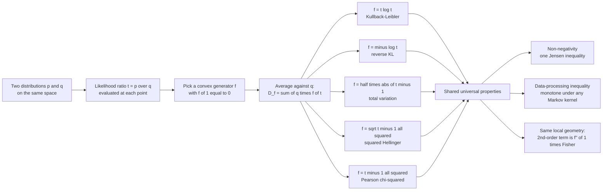

# 📐 f-Divergences

> [!abstract] TL;DR
> An **$f$-divergence** measures the gap between two distributions with a single recipe: form the **likelihood ratio** $t = p/q$ at each point, pass it through **any convex function $f$ with $f(1)=0$**, and average against $q$ — $D_f(p\,\|\,q) = \int q(x)\, f\!\big(\tfrac{p(x)}{q(x)}\big)\,dx$. Swap $f$ and you swap the divergence: $f=t\log t$ is **KL**, $f=\tfrac12|t-1|$ is **total variation**, $f=(\sqrt t-1)^2$ is **squared Hellinger**, $f=(t-1)^2$ is **Pearson $\chi^2$**. The whole "zoo" of statistical distances is one family. And they all share the same deep skeleton: **non-negativity** (from Jensen), the **data-processing inequality** (they can only shrink under any Markov kernel), and an **identical local geometry** — every $f$-divergence's second-order term is $f''(1)$ times the **Fisher metric**, so they induce the *same* Riemannian metric and differ only globally.

---

## Intuition

**Analogy — one blender, many smoothies.** Statistics hands you a bewildering pantry of "distances" between distributions: KL divergence, chi-squared distance, total variation, Hellinger, Jensen–Shannon. They look like an arbitrary zoo — each with its own formula, its own folklore, its own paper. The revelation is that they are all the **same blender running one recipe**. At every point you take the *ratio* of the two distributions, $t = p/q$ — how much more (or less) likely this outcome is under $p$ than under $q$. You feed that ratio through a **convex shaping function $f$**, then blend by averaging with weights $q$. The *only* thing that changes from KL to total variation to Hellinger is which shaping function $f$ you drop in. Change the one swappable ingredient and out comes a different named divergence.

Because they all come off the same production line, they inherit the same structural DNA. Every choice of convex $f$ gives you something non-negative (the blender never returns a negative smoothie), something that **can only lose information when you blur the data** (mixing outcomes together can never make two distributions *more* distinguishable), and — most strikingly — something that looks *identical* under a microscope: zoom into any $f$-divergence between two nearby distributions and its curvature is always the **same Fisher metric**, merely rescaled by the number $f''(1)$. The divergences differ only when you pull back and look at the large-scale picture.

---

## How It Works

### Core mechanics

Fix a convex function $f:(0,\infty)\to\mathbb{R}$ with $f(1)=0$ — the **generator**. The **Csiszár–Ali–Silvey $f$-divergence** of $p$ from $q$ is

$$D_f(p\,\|\,q) \;=\; \int q(x)\, f\!\left(\frac{p(x)}{q(x)}\right) dx \;=\; \mathbb{E}_{x\sim q}\!\left[\, f\!\left(\frac{p(x)}{q(x)}\right)\right].$$

Everything hangs on the **likelihood ratio** $t = p/q$ and the shape of $f$. The construction was introduced independently by Csiszár (1963/1967) and Ali & Silvey (1966), which is why it carries both names.

1. **The members are just choices of $f$.** Each classical divergence is one generator:

   | Divergence | Generator $f(t)$ | $f''(1)$ | Symmetric? | Metric? |
   |---|---|---|---|---|
   | Kullback–Leibler $D_{\mathrm{KL}}(p\|q)$ | $t\log t$ | $1$ | no | no |
   | Reverse KL $D_{\mathrm{KL}}(q\|p)$ | $-\log t$ | $1$ | no | no |
   | Total variation | $\tfrac12\lvert t-1\rvert$ | — (kink) | yes | **yes** |
   | Squared Hellinger $H^2$ | $(\sqrt t - 1)^2$ | $\tfrac12$ | yes | $\sqrt{\cdot}$ is |
   | Pearson $\chi^2$ | $(t-1)^2$ | $2$ | no | no |
   | Neyman $\chi^2$ | $\tfrac{(t-1)^2}{t}$ | $2$ | no | no |
   | Jensen–Shannon | $t\log\tfrac{2t}{t+1} + \log\tfrac{2}{t+1}$ | $\tfrac12$ | yes | $\sqrt{\cdot}$ is |

   The **$\alpha$-divergences** are a smooth one-parameter *subfamily* of $f$-divergences (generator indexed by $\alpha$) that interpolates KL ($\alpha\to 1$), reverse KL ($\alpha\to -1$), Hellinger ($\alpha=0$), and the $\chi^2$ divergences.

2. **Non-negativity is Jensen, once.** Since $f$ is convex and $\int q\,(p/q) = \int p = 1$,
   $$D_f(p\|q) = \mathbb{E}_q\!\left[f(t)\right] \;\ge\; f\!\big(\mathbb{E}_q[t]\big) = f(1) = 0,$$
   with equality iff $t\equiv 1$, i.e. $p=q$ (strict convexity). One inequality proves *every* member is a valid divergence.

3. **The data-processing inequality (the defining structural property).** Push both distributions through **any** Markov kernel / channel $W$ (a stochastic map, e.g. a noisy channel, a lossy summary, a coarse-graining). Then
   $$D_f(Wp \,\|\, Wq) \;\le\; D_f(p \,\|\, q) \qquad\text{for every convex } f.$$
   Processing data can never *increase* an $f$-divergence: you cannot make two distributions more distinguishable by garbling, blurring, or summarizing them. Equality holds iff the kernel preserves a **sufficient statistic** for telling $p$ from $q$. This monotonicity — together with **joint convexity** of $(p,q)\mapsto D_f(p\|q)$ — is what makes $f$-divergences the "right" measures of statistical information.

4. **The universal local geometry.** Expand $D_f(p_\theta \,\|\, p_{\theta+d\theta})$ for a parametric family. Because $t\to 1$ as $d\theta\to 0$, only the *local* shape of $f$ near $t=1$ matters, and a Taylor expansion gives
   $$D_f(p_\theta \,\|\, p_{\theta+d\theta}) \;=\; \frac{f''(1)}{2}\, d\theta^\top G(\theta)\, d\theta \;+\; O(\|d\theta\|^3),$$
   where $G$ is the **Fisher information matrix**. Every smooth $f$-divergence produces the *same* metric $G$, scaled only by the scalar $f''(1)$. This is the deep information-geometry fact: the metric is **universal** (it is Fisher, forced by **Chentsov's uniqueness theorem** — the only invariant Riemannian metric on a statistical manifold), while the *global* shape of the divergence is generator-specific. KL, Hellinger, and $\chi^2$ are indistinguishable under a microscope and only diverge when you zoom out.

5. **Metrics vs mere divergences.** Most $f$-divergences are asymmetric and violate the triangle inequality — they are *not* metrics. The exceptions: **total variation** is itself a metric; the **square roots** of squared Hellinger and of Jensen–Shannon are metrics. KL and the $\chi^2$ divergences are not, and no power of them is.

6. **Variational / dual representations.** Convex duality gives every $f$-divergence a **variational form** $D_f(p\|q)=\sup_{g}\ \mathbb{E}_p[g] - \mathbb{E}_q[f^\star(g)]$ using the convex conjugate $f^\star$. For KL this is the **Donsker–Varadhan** representation; parametrizing $g$ by a neural network turns the family into trainable objectives — the **$f$-GAN** framework, of which the vanilla GAN (Jensen–Shannon) is one instance.

### Flow / architecture



---

## Key Concepts

**Secondary (plain-language core).**
There is no single "distance" between two probability distributions — there is a whole *family*, and it is built from one recipe. At each outcome, compare how likely it is under $p$ versus under $q$ (their ratio), bend that ratio through a bowl-shaped function $f$, and take the average. Different bowls give the famous named divergences: KL, total variation, Hellinger, chi-squared. All of them are always $\ge 0$, hit zero only when $p=q$, and can only *shrink* when you blur or summarize your data.

**Undergraduate (working machinery).**
$D_f(p\|q) = \sum_x q(x)\, f(p(x)/q(x))$ with $f$ convex and $f(1)=0$. Convexity plus Jensen forces $D_f \ge 0$. The **data-processing inequality** $D_f(Wp\|Wq)\le D_f(p\|q)$ holds for *every* convex $f$ under *every* stochastic map $W$ — a direct consequence of joint convexity. Locally, $D_f(p_\theta\|p_{\theta+d\theta}) \approx \tfrac{f''(1)}{2}\,d\theta^\top G\,d\theta$, so all $f$-divergences reproduce the Fisher metric $G$ up to the constant $f''(1)$. Careful: **total variation is not twice-differentiable** at $t=1$, so its local behavior is *linear* in $d\theta$, not quadratic — it is the exception that is genuinely a metric.

**Graduate (structural payoff).**
The generator is only defined **up to an affine term**: $f(t)$ and $f(t) + c\,(t-1)$ yield the *identical* divergence, because $\mathbb{E}_q[c(t-1)] = c(\int p - \int q) = 0$. This freedom is used to normalize $f(1)=0$ and (optionally) $f'(1)=0$. The **DPI and sufficiency** are two sides of one coin: $D_f(Wp\|Wq)=D_f(p\|q)$ iff $W$ retains a statistic sufficient for the binary discrimination of $p$ against $q$ — the geometric shadow of the **Chentsov uniqueness theorem**, which pins the second-order term to Fisher for *any* generator. $f$-divergences and **Bregman divergences** are two different generalizations of KL that overlap **only at KL itself**; likewise the $\alpha$-divergences form the $f$-divergence subfamily that is simultaneously "flat" in the dual-connection sense. The **integral (Feldman–Österreicher) representation** writes any $f$-divergence as a mixture of elementary total-variation-like "hockey-stick" divergences, exposing exactly why the DPI is inherited by the whole family.

---

## Python Demo

```python
# f-DIVERGENCES: one recipe, many members.
#   D_f(p || q) = sum_x q(x) * f( p(x)/q(x) ),   f convex, f(1) = 0.
# (a) instantiate the family by swapping the generator f;
# (b) show all SMOOTH members share the SAME local Fisher metric;
# (c) verify the data-processing inequality (coarse-graining shrinks every D_f).
import numpy as np
import matplotlib.pyplot as plt

# ---- generators f(t): each convex with f(1) = 0 ---------------------------
generators = {
    "KL":        lambda t: t * np.log(t),
    "revKL":     lambda t: -np.log(t),
    "Pearson":   lambda t: (t - 1.0) ** 2,
    "Hellinger": lambda t: (np.sqrt(t) - 1.0) ** 2,
    "TV":        lambda t: 0.5 * np.abs(t - 1.0),
    "JS":        lambda t: t * np.log(2 * t / (t + 1)) + np.log(2 / (t + 1)),
}

def f_divergence(p, q, f):
    """D_f(p||q) = sum q * f(p/q), summed over the support where q > 0."""
    p = np.asarray(p, float); q = np.asarray(q, float)
    m = q > 0
    return float(np.sum(q[m] * f(p[m] / q[m])))

# ---- (a) every member on ONE pair of distributions ------------------------
p = np.array([0.10, 0.40, 0.30, 0.20])
q = np.array([0.25, 0.25, 0.25, 0.25])
print("(a) f-divergences of the SAME pair (p||q):")
names, vals = [], []
for name, f in generators.items():
    d = f_divergence(p, q, f)
    names.append(name); vals.append(d)
    print(f"    {name:10s} = {d:.5f}")

# ---- (b) all SMOOTH members share the local Fisher metric -----------------
# Bernoulli(theta): Fisher information I(theta) = 1 / (theta (1-theta)).
def bern(a):        return np.array([a, 1 - a])
def fisher_bern(a): return 1.0 / (a * (1 - a))

theta, eps = 0.40, 1e-3
I = fisher_bern(theta)
fpp1 = {"KL": 1.0, "revKL": 1.0, "Pearson": 2.0, "Hellinger": 0.5}  # f''(1)
print(f"\n(b) Local Fisher check at theta={theta}, I(theta)={I:.4f}")
print("    D_f/eps^2  should match  (f''(1)/2) * I(theta):")
for name, c2 in fpp1.items():
    d = f_divergence(bern(theta), bern(theta + eps), generators[name])
    print(f"    {name:10s}: D_f/eps^2 = {d/eps**2:8.4f}   (f''(1)/2)I = {0.5*c2*I:8.4f}")
# TV is NOT twice-differentiable at t=1 -> its local term is LINEAR, not Fisher:
d_tv = f_divergence(bern(theta), bern(theta + eps), generators["TV"])
print(f"    TV (exception): D_f/eps = {d_tv/eps:.4f} (linear in eps, so D_f/eps^2 -> inf)")

# ---- (c) data-processing inequality: coarse-grain 4 symbols -> 2 bins ------
def coarse(v): return np.array([v[0] + v[1], v[2] + v[3]])
pc, qc = coarse(p), coarse(q)
print("\n(c) Data-processing inequality (merge {0,1} and {2,3}):")
dpi_before, dpi_after = [], []
for name, f in generators.items():
    d_full, d_coarse = f_divergence(p, q, f), f_divergence(pc, qc, f)
    dpi_before.append(d_full); dpi_after.append(d_coarse)
    tag = "OK" if d_coarse <= d_full + 1e-12 else "VIOLATED"
    print(f"    {name:10s}: full={d_full:.5f}  coarse={d_coarse:.5f}  [{tag}]")

# ---- plots ----------------------------------------------------------------
fig, ax = plt.subplots(1, 3, figsize=(16, 4.6))

ax[0].bar(range(len(names)), vals, color="steelblue")
ax[0].set_xticks(range(len(names))); ax[0].set_xticklabels(names, rotation=30, ha="right")
ax[0].set_title("(a) f-divergences of ONE pair (p||q)")
ax[0].set_ylabel(r"$D_f(p\,\|\,q)$")

dth = np.linspace(-0.12, 0.12, 200)
parab = 0.5 * I * dth**2
ax[1].plot(dth, parab, "k--", lw=2.6, label=r"Fisher $\frac{1}{2} I\, d\theta^2$")
for name, col in zip(fpp1, ["C0", "C1", "C2", "C3"]):
    f = generators[name]
    curve = np.array([f_divergence(bern(theta), bern(theta + d), f) for d in dth]) / fpp1[name]
    ax[1].plot(dth, curve, color=col, lw=1.7, alpha=0.85, label=name)
ax[1].set_title(r"(b) $D_f / f''(1)$ all collapse onto the Fisher metric")
ax[1].set_xlabel(r"$d\theta$"); ax[1].set_ylabel("normalized divergence"); ax[1].legend(fontsize=8)

x, w = np.arange(len(names)), 0.38
ax[2].bar(x - w/2, dpi_before, w, label="before (4 symbols)", color="indianred")
ax[2].bar(x + w/2, dpi_after,  w, label="after coarse-grain (2)", color="seagreen")
ax[2].set_xticks(x); ax[2].set_xticklabels(names, rotation=30, ha="right")
ax[2].set_title("(c) DPI: coarse-graining never increases $D_f$")
ax[2].legend(fontsize=8)

plt.tight_layout()
plt.savefig("f_divergences.png", dpi=120)
plt.show()
```

**What you see.** Part (a) prints six *different* numbers for the *same* pair $(p,q)$ — proof that the divergence is a choice, not a fact. Part (b) is the punchline: `D_f/eps^2` lands on `(f''(1)/2) * I` for KL, reverse-KL, Pearson, and Hellinger, and in the middle plot their $f''(1)$-normalized curves all lie on top of the single dashed **Fisher parabola** near $d\theta=0$ — the same local metric, four different generators. Total variation is flagged as the exception: its local term is *linear* in $\varepsilon$, so it never becomes the quadratic Fisher form (it is the member that is a genuine metric). Part (c) shows every bar shrink when the four outcomes are merged into two — the **data-processing inequality** holding across the entire family at once.

---

## Real-World Applications

> **Generative adversarial networks ($f$-GAN).** Nowozin et al. showed the GAN objective is the *variational lower bound* of an $f$-divergence: choose the generator $f$ and you choose what the discriminator estimates. The vanilla GAN minimizes (a shifted) **Jensen–Shannon** divergence; other $f$'s give KL, reverse-KL, or Pearson $\chi^2$ objectives with different mode-covering vs mode-seeking behavior. See [[GAN]] and [[Loss_Functions]].

> **Hypothesis testing and channel comparison.** The DPI is the engine behind the **Neyman–Pearson** and Le Cam bounds: total variation upper-bounds how well *any* test can separate two hypotheses, and no processing of the data can beat it. Comparing communication channels by "which is more informative" is literally a statement that one dominates the other on *all* $f$-divergences ([[Hypothesis_Testing_and_Information]]).

> **Distribution-shift and drift monitoring.** Production ML systems watch **Pearson $\chi^2$**, **KL**, and **Jensen–Shannon** between a reference and a live feature distribution to trigger retraining; the DPI guarantees that any downstream aggregation of the monitored signal can only *understate* the true drift, so a raised alarm is trustworthy.

> **Variational inference and information bottleneck.** The ELBO gap is a **reverse-KL** $f$-divergence; rate–distortion and the information bottleneck trade off **mutual information** (an $f$-divergence between joint and product) against distortion. The shared Fisher metric is exactly what **natural-gradient** optimizers exploit ([[Relative_Entropy_and_Cross_Entropy]]).

---

## Common Pitfalls

- **Forgetting the generator is only defined up to an affine term.** $f(t)$ and $f(t) + c\,(t-1)$ give the *same* divergence, since $\mathbb{E}_q[c(t-1)] = 0$. Two "different-looking" generators can be identical divergences. Always normalize before comparing generators.
- **Skipping the $f(1)=0$ normalization.** If $f(1)\ne 0$, then $p=q$ gives $D_f = f(1)\ne 0$ and the "divergence" no longer vanishes on the diagonal. Subtract $f(1)$ (an affine shift) to fix it — it changes nothing else.
- **Calling every $f$-divergence a distance.** Only **total variation**, $\sqrt{\text{squared Hellinger}}$, and $\sqrt{\text{Jensen–Shannon}}$ are true metrics. KL, reverse-KL, and the $\chi^2$ divergences are asymmetric and violate the triangle inequality; no power of KL is a metric. Do not feed them to algorithms that assume symmetry or triangle inequality.
- **Assuming a non-convex or improperly-shaped $f$ still works.** Convexity is what delivers non-negativity (Jensen), joint convexity, and the DPI *all at once*. Drop convexity and you can get negative "divergences" that increase under processing — the entire theory collapses.
- **Expecting different $f$-divergences to change the Fisher metric.** They do not: locally they are all $\tfrac{f''(1)}{2}\,d\theta^\top G\,d\theta$ with the *same* $G$. If your natural-gradient or Cramér–Rao computation depends on *which* $f$ you picked (beyond the scalar $f''(1)$), you have a bug.
- **Using TV where you need a smooth local expansion.** Total variation's generator has a kink at $t=1$, so its local behavior is linear, not quadratic — it has no Fisher-metric second-order term. Reach for Hellinger, KL, or $\chi^2$ when you need differentiable local geometry.

---

## Related Concepts

- [[Relative_Entropy_and_Cross_Entropy]] — KL divergence is the flagship $f$-divergence ($f=t\log t$); its Donsker–Varadhan variational form is the $f$-GAN template and its second-order term is the Fisher metric worked out here.
- [[Information_Inequalities_and_the_Data_Processing_Inequality]] — the DPI is the *defining* structural property of the whole family; this note gives the information-theory statement that $f$-divergences generalize.
- [[Joint_Conditional_Entropy_and_Mutual_Information]] — mutual information is the $f$-divergence between a joint and the product of marginals, so its non-negativity and chain behavior inherit directly from $f$-divergence theory.
- [[Entropy_and_Information_Content]] — entropy and cross-entropy are the potentials whose KL $f$-divergence measures coding overhead; the thermodynamic anchor of these distances.
- [[Statistical_Inference]] — parametric families $p_\theta$, likelihood ratios, and sufficiency are the objects $f$-divergences act on; sufficiency is exactly the DPI equality condition.
- [[Hypothesis_Testing_and_Information]] — total variation and KL bound the error probabilities of optimal tests; the DPI says no data processing can improve them.
- [[Convex_Functions]] — convexity of the generator $f$ is the single engine behind non-negativity, joint convexity, and the DPI; without it the family has no theory.
- [[Jensen_and_Inequalities]] — Jensen's inequality applied once to convex $f$ proves *every* $f$-divergence is non-negative with equality iff $p=q$.
- [[GAN]] — adversarial training minimizes a variational estimate of an $f$-divergence (Jensen–Shannon for the vanilla GAN); different generators give the $f$-GAN objectives.
- [[Loss_Functions]] — cross-entropy and many training losses are $f$-divergences in disguise, inheriting the local Fisher geometry during optimization.

*Sibling notes in this section (Information Geometry):* Kullback–Leibler Divergence and Geometry, The Alpha–Beta–Gamma Divergence Families, The Fisher Information Metric, the Chentsov Uniqueness Theorem, and Divergences as Geometric Structure each expand one branch of the family sketched above — the Fisher-metric universality of every $f$-divergence is the through-line that ties them together.

---

## Review Questions

**Secondary.** Total variation, KL divergence, and Hellinger distance all measure "how far apart" two distributions are, yet give different numbers on the same pair. Explain in one sentence what single ingredient they differ in, and why they nonetheless all report zero exactly when the distributions are identical.

**Undergraduate.** Starting from $D_f(p\|q) = \mathbb{E}_q[f(p/q)]$ with $f$ convex, prove $D_f(p\|q)\ge 0$ using Jensen's inequality, and identify the equality condition. Then show that replacing $f(t)$ with $f(t) + c(t-1)$ leaves $D_f$ unchanged — and use this to explain the $f(1)=0$ convention.

**Graduate.** (i) State the data-processing inequality for $f$-divergences and explain why its equality case is equivalent to $W$ preserving a sufficient statistic. (ii) Derive the leading term $\tfrac{f''(1)}{2}\,d\theta^\top G\,d\theta$ and explain why $G$ must be the Fisher matrix for *every* generator, invoking Chentsov's theorem. (iii) Total variation is a metric but has no Fisher second-order term, while KL has the Fisher term but is not a metric — reconcile these two facts.

---

## Sources

- Csiszár, I. (1967). *Information-type measures of difference of probability distributions and indirect observations*. Studia Scientiarum Mathematicarum Hungarica, 2, 299–318.
- Ali, S. M. & Silvey, S. D. (1966). *A general class of coefficients of divergence of one distribution from another*. Journal of the Royal Statistical Society, Series B, 28(1), 131–142. [JSTOR](https://www.jstor.org/stable/2984279)
- Liese, F. & Vajda, I. (2006). *On divergences and informations in statistics and information theory*. IEEE Transactions on Information Theory, 52(10), 4394–4412. [IEEE](https://ieeexplore.ieee.org/document/1705001)
- Amari, S. & Nagaoka, H. (2000). *Methods of Information Geometry*. AMS / Oxford University Press. [Publisher](https://bookstore.ams.org/mmono-191/)
- Nowozin, S., Cseke, B. & Tomioka, R. (2016). *f-GAN: Training generative neural samplers using variational divergence minimization*. NeurIPS. [arXiv:1606.00709](https://arxiv.org/abs/1606.00709)

---

#information-geometry #f-divergences #csiszar #data-processing-inequality #divergences
