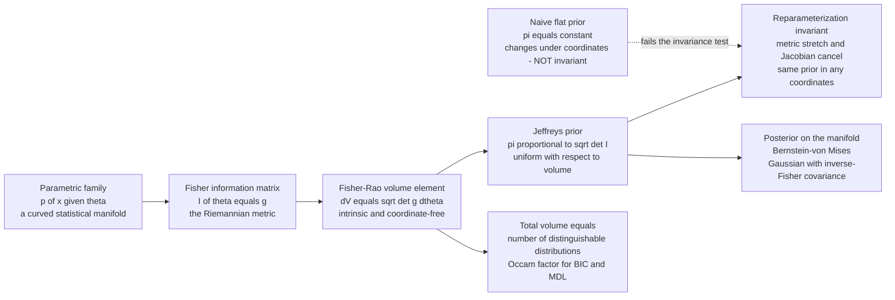

# 🧭 Bayesian Information Geometry and Jeffreys Priors

> [!abstract] TL;DR
> A Bayesian who wants to start "from ignorance" must choose a prior — but a **flat prior is a lie**, because "flat" depends on the coordinates you happen to write your parameter in. Uniform on a coin's bias $p$ is *not* uniform on its log-odds $\log\frac{p}{1-p}$, so the same "ignorance" says different things after a harmless change of variables. Information geometry fixes this: the right way to measure ignorance is by **area on the curved manifold of distributions itself**. The **Jeffreys prior** $\pi(\theta)\propto\sqrt{\det \mathcal I(\theta)}$ — the square root of the Fisher information determinant — is precisely the **uniform distribution with respect to the intrinsic Fisher-Rao volume element** $dV=\sqrt{\det g}\,d\theta$. Because that volume is coordinate-free, the Jeffreys prior means *the same thing in every parameterization* (Jeffreys' rule). The same geometry drives the rest of Bayesian inference: the posterior is a point on the manifold that, by **Bernstein-von Mises**, becomes Gaussian with inverse-Fisher covariance (mirroring the frequentist Cramér-Rao floor), and the **total Fisher-Rao volume $\int\sqrt{\det \mathcal I}\,d\theta$ counts the number of distinguishable distributions** in a model — the "Occam factor" that MDL and BIC use to penalize complexity.

---

## Intuition

**Analogy — measuring ignorance by acreage, not by ruler.** Suppose two surveyors are asked to "spread paint evenly" over a hilly national park, one working from a *flat road map* and the other from the *actual 3-D terrain*. The road-map surveyor pours equal paint per map-inch; but where the map compresses a steep mountainside into a thin strip, they starve a huge slope of paint, and where it stretches a flat plain, they drown a small field. "Even on the map" is *not* "even on the ground" — it depends entirely on how the mapmaker projected the hills onto paper. The only projection-proof way to spread paint evenly is to pour it **proportional to true surface area**: equal paint per real acre of terrain. Then re-drawing the map with different distortions changes nothing about where the paint actually lands.

A Bayesian choosing a "non-informative" prior faces exactly this puzzle. A **flat prior** is "even on the map" — even in whatever coordinate $\theta$ you happened to pick. But a coin's bias can be written as its probability $p$, its log-odds $\phi=\log\frac{p}{1-p}$, its angle $\arcsin\sqrt p$, and a prior flat in one is a lopsided hump in another. "Ignorance" is not coordinate-free. Information geometry supplies the missing notion of *surface area*: the **statistical manifold** of distributions is curved, and the [Fisher information metric] measures its true acreage. The **Jeffreys prior pours prior mass proportional to Fisher-Rao area** — the same acre gets the same mass no matter how the map is drawn. That is what makes it objective.

---

## How It Works

### Core mechanics

1. **Every parametric model is a curved surface.** Fix a family $\{p(x;\theta):\theta\in\Theta\}$. Each distribution is a *point*; the parameters $\theta$ are *coordinates*; the collection is a **statistical manifold**. The Fisher information matrix $\mathcal I_{ij}(\theta)=\mathbb E[\partial_i\log p\,\partial_j\log p]=-\mathbb E[\partial_i\partial_j\log p]$ is its Riemannian metric $g_{ij}$ — the local curvature of the KL divergence between neighbouring distributions.

2. **A metric gives you a notion of volume.** On any Riemannian manifold the invariant infinitesimal volume is $dV=\sqrt{\det g(\theta)}\,d\theta=\sqrt{\det \mathcal I(\theta)}\,d\theta$. This is the exact analogue of "true surface area" for distributions. It is **coordinate-free**: under a smooth reparameterization $\phi=\phi(\theta)$ with Jacobian $J=\partial\theta/\partial\phi$, the metric transforms as $g'=J^\top g\,J$, so $\det g' = (\det J)^2\det g$ and $\sqrt{\det g'}\,d\phi=\sqrt{\det g}\,|\det J|\,d\phi=\sqrt{\det g}\,d\theta$. The stretching of coordinates and the stretching of the metric **cancel exactly**.

3. **Jeffreys prior = uniform on the manifold.** Declare the prior that is "flat with respect to area":
$$\pi_J(\theta)\;\propto\;\sqrt{\det \mathcal I(\theta)}.$$
Because $\sqrt{\det \mathcal I}\,d\theta$ is invariant, this prior is **reparameterization-invariant**: the prior you get by computing $\pi_J$ in $\theta$ and pushing it through the change-of-variables formula equals the prior you get by computing $\pi_J$ directly in $\phi$. Jeffreys' rule (1946) is exactly this recipe.

4. **A flat prior fails this test.** A uniform prior $\pi(\theta)=\text{const}$ transforms into $\text{const}\cdot|\det J|$ — generally *not* constant in the new coordinates. "Uniform" is a statement about a chart, not about the distributions; Jeffreys removes the chart-dependence.

5. **Scalar case makes it concrete.** For one parameter, $\pi_J(\theta)\propto\sqrt{\mathcal I(\theta)}$. For **Bernoulli**$(p)$: $\mathcal I(p)=\frac1{p(1-p)}$, so $\pi_J(p)\propto\frac1{\sqrt{p(1-p)}}$ — the $\mathrm{Beta}(\tfrac12,\tfrac12)$ **arcsine prior**, which piles mass near the certain outcomes $p=0,1$ (where distributions are most distinguishable) rather than flat across the middle.

6. **The posterior is a point on the manifold too.** After data, Bayes' rule reweights the manifold: $p(\theta\mid x)\propto \ell(\theta)\,\pi(\theta)$. Asymptotically the **Bernstein-von Mises theorem** says the posterior collapses to a Gaussian centred at the MLE with covariance $(n\,\mathcal I)^{-1}$ — the prior washes out and the posterior spread equals the frequentist **Cramér-Rao** floor. Bayesian credible intervals and frequentist confidence intervals coincide in the large-sample limit.

7. **The total volume is the Occam factor.** Integrate the volume element over the whole model: $V(\mathcal M)=\int\sqrt{\det \mathcal I(\theta)}\,d\theta$. This counts the **number of statistically distinguishable distributions** the model contains. A model with more distinguishable settings is more "flexible" and must be penalized — this $\log\det \mathcal I$ term is exactly the complexity penalty in **BIC**, in Rissanen's normalized-maximum-likelihood **stochastic complexity**, and in Balasubramanian's geometric MDL.

### Flow: from metric to prior to posterior



---

## Key Concepts

### Secondary (intuition-level)

- **Flat is not fair.** A prior that looks "even" in one parameterization looks lopsided in another; "ignorance" is not automatically coordinate-free.
- **Measure by area.** The space of distributions is a curved surface with a real notion of area (Fisher-Rao volume). Spreading prior mass by area is the fair way to be non-informative.
- **Jeffreys is that fair spread.** The Jeffreys prior is uniform *on the surface*, so it says the same thing whatever coordinates you write the parameter in.
- **It is not truly blank.** For a coin, Jeffreys leans toward "the coin is nearly certain" ($p$ near 0 or 1), because those distributions are the easiest to tell apart from data.

### Undergraduate (probability + multivariable calculus)

- **The rule.** $\pi_J(\theta)\propto\sqrt{\det \mathcal I(\theta)}$, with $\mathcal I$ the Fisher information; scalar case $\pi_J(\theta)\propto\sqrt{\mathcal I(\theta)}$.
- **Why it is invariant.** Under $\phi=\phi(\theta)$, $\mathcal I'=J^\top \mathcal I J$ so $\sqrt{\det \mathcal I'}=|\det J|\sqrt{\det \mathcal I}$; this is exactly the Jacobian factor a density picks up under change of variables, so $\pi_J$ transforms *as a density should*. A constant prior does not.
- **Bernoulli worked example.** $\mathcal I(p)=1/[p(1-p)]$ gives $\pi_J(p)\propto 1/\sqrt{p(1-p)}=\mathrm{Beta}(\tfrac12,\tfrac12)$; posterior after $s$ successes in $n$ trials is $\mathrm{Beta}(s+\tfrac12,\,n-s+\tfrac12)$.
- **Conjugate reading.** Jeffreys for Bernoulli/Binomial is the conjugate Beta with $\alpha=\beta=\tfrac12$; for a Gaussian mean (known variance) it is the flat prior; for a scale parameter $\sigma$ it is $1/\sigma$ (flat in $\log\sigma$).
- **Volume element.** $dV=\sqrt{\det \mathcal I}\,d\theta$ is the invariant volume; normalizing it (when finite) gives $\pi_J$.

### Graduate (system-level)

- **Chentsov and objectivity.** The Fisher-Rao metric is the *unique* metric (up to scale) invariant under sufficient statistics; its volume is therefore the *unique* invariant reference measure, which is what makes Jeffreys canonical rather than arbitrary.
- **Reference priors (Bernardo-Berger).** Generalize Jeffreys by **maximizing the expected information gain** (the mutual information between parameter and data) that the experiment provides, asymptotically. In one dimension the reference prior *equals* Jeffreys; in higher dimensions, ordering parameters into interest vs nuisance groups yields reference priors that avoid Jeffreys' multivariate pathologies (e.g. the Neyman-Scott and marginalization problems).
- **Bernstein-von Mises.** $p(\theta\mid x_{1:n})\rightsquigarrow \mathcal N(\hat\theta_{\text{MLE}},\,(n\mathcal I)^{-1})$: the posterior is asymptotically Gaussian with inverse-Fisher covariance, so Bayesian and frequentist uncertainty agree and the prior's influence is $O(1/n)$. This is the Bayesian counterpart of asymptotic efficiency and the Cramér-Rao bound.
- **Geometry of model selection.** Laplace approximation of the evidence gives $\log p(x)\approx \log \ell(\hat\theta)-\tfrac{k}{2}\log n+\log\!\big(\pi(\hat\theta)/\sqrt{\det \mathcal I(\hat\theta)}\big)+\dots$ The $\sqrt{\det \mathcal I}$ cancels against a Jeffreys prior, and the leftover $\int\sqrt{\det \mathcal I}\,d\theta$ is the **parametric complexity / stochastic complexity** (Rissanen NML, Balasubramanian). BIC's $\tfrac k2\log n$ is the leading term; the volume term is the finite-sample refinement. Bayesian evidence $\leftrightarrow$ MDL code length $\leftrightarrow$ Fisher-Rao volume are three views of one quantity.
- **Where the picture breaks.** For **singular models** (mixtures, neural networks) the Fisher information is degenerate, $\det \mathcal I=0$ on subsets, Bernstein-von Mises fails, and Watanabe's *singular learning theory* replaces $\tfrac k2\log n$ with a rational learning coefficient (real log-canonical threshold). Jeffreys is undefined there.

---

## Python Demo

```python
# numpy + matplotlib only.
# THEME: the Jeffreys prior  pi(theta) ~ sqrt(det Fisher)  is the UNIQUE prior
# that is "uniform" with respect to the intrinsic Fisher-Rao volume, so it means
# the SAME THING in every parameterization. A naive flat prior does not.
#
# Model: Bernoulli(p).  Fisher information I(p) = 1 / (p (1-p)).
#   -> Jeffreys prior  pi(p) ~ 1/sqrt(p(1-p)) = Beta(1/2, 1/2)  (the arcsine prior).
#
# (a) INVARIANCE: reparameterize to log-odds phi = logit(p). Show the Jeffreys
#     prior PUSHED through the Jacobian equals the Jeffreys prior computed
#     DIRECTLY from the Fisher information in phi -- while a naive uniform prior
#     does NOT stay uniform. "Uniform" is coordinate-dependent; Jeffreys is not.
# (b) VOLUME PICTURE: the square-root embedding (sqrt p, sqrt(1-p)) lands on the
#     unit circle; the Fisher-Rao arc length is  ds = 2 d(xi)  with  p = sin^2(xi).
#     Jeffreys prior = UNIFORM in arc length xi. Equal-mass points are equally
#     spaced along the arc but cluster near p=0,1 -- that IS the bathtub shape.

import numpy as np
import matplotlib.pyplot as plt

rng = np.random.default_rng(0)

# ---------- analytic pieces ----------
def fisher_bernoulli_p(p):                 # I(p) = 1/(p(1-p))
    return 1.0 / (p * (1.0 - p))

def jeffreys_p(p):                         # normalized Beta(1/2,1/2) = 1/(pi sqrt(p(1-p)))
    return 1.0 / (np.pi * np.sqrt(p * (1.0 - p)))

def sigmoid(phi):
    return 1.0 / (1.0 + np.exp(-phi))

# Jeffreys PUSHED from p to phi via the Jacobian |dp/dphi| = p(1-p)
def jeffreys_pushed_to_phi(phi):
    p = sigmoid(phi)
    return jeffreys_p(p) * (p * (1.0 - p))         # = sqrt(p(1-p)) / pi

# Jeffreys computed DIRECTLY in phi:  I(phi) = I(p) (dp/dphi)^2 = p(1-p)
def jeffreys_direct_in_phi(phi):
    p = sigmoid(phi)
    return np.sqrt(p * (1.0 - p)) / np.pi          # same normalizer -> must match push

# naive UNIFORM-in-p pushed to phi:  pi(p)=1  ->  1 * |dp/dphi| = p(1-p)
def uniform_p_pushed_to_phi(phi):
    p = sigmoid(phi)
    return p * (1.0 - p)

# ---------- numerical checks ----------
phi_grid = np.linspace(-6, 6, 2001)
push   = jeffreys_pushed_to_phi(phi_grid)
direct = jeffreys_direct_in_phi(phi_grid)
print("INVARIANCE CHECK (Jeffreys in log-odds coordinates):")
print("  max |pushed - direct| =", float(np.max(np.abs(push - direct))))   # ~ 0

p_grid = np.linspace(1e-6, 1 - 1e-6, 200001)
print("  integral of Jeffreys over p   =", float(np.trapz(jeffreys_p(p_grid), p_grid)))
print("  integral of Jeffreys over phi =", float(np.trapz(direct, phi_grid)))

# Monte Carlo: sample p ~ Beta(1/2,1/2), map to phi; its density must equal 'direct'
p_samp   = rng.beta(0.5, 0.5, size=400_000)
phi_samp = np.log(p_samp / (1.0 - p_samp))

# ---------- plots ----------
fig, ax = plt.subplots(1, 3, figsize=(15.5, 4.6))

# (A) two priors in p-space
pp = np.linspace(0.001, 0.999, 500)
ax[0].plot(pp, jeffreys_p(pp), lw=2.2, color="crimson",
           label="Jeffreys  1/sqrt(p(1-p))")
ax[0].hlines(1.0, 0, 1, color="steelblue", lw=2, label="naive uniform in p")
ax[0].set_title("(A) priors in p-coordinates")
ax[0].set_xlabel("p"); ax[0].set_ylabel("density"); ax[0].set_ylim(0, 4)
ax[0].legend(fontsize=8)

# (B) same priors in log-odds phi -- invariance vs coordinate-dependence
ax[1].hist(phi_samp, bins=80, range=(-6, 6), density=True, color="0.85",
           label="MC: p~Beta(1/2,1/2) -> phi")
ax[1].plot(phi_grid, push,   lw=2.6, color="crimson", label="Jeffreys pushed p -> phi")
ax[1].plot(phi_grid, direct, "--", lw=1.5, color="black", label="Jeffreys direct in phi")
ax[1].plot(phi_grid, uniform_p_pushed_to_phi(phi_grid), lw=2, color="steelblue",
           label="uniform-in-p pushed to phi (a hump, NOT flat)")
ax[1].set_title("(B) log-odds phi: Jeffreys invariant, 'uniform' is not")
ax[1].set_xlabel("phi = logit(p)"); ax[1].set_ylabel("density")
ax[1].legend(fontsize=7)

# (C) volume picture: sqrt-embedding on the unit circle, Jeffreys = uniform arc
xi_arc = np.linspace(0, np.pi / 2, 400)
ax[2].plot(np.sin(xi_arc), np.cos(xi_arc), color="0.5", lw=1.2)        # quarter unit circle
xis = np.linspace(0, np.pi / 2, 11)                # EQUAL arc spacing = equal Jeffreys mass
px, py = np.sin(xis), np.cos(xis)                  # (sqrt p, sqrt(1-p))
ax[2].scatter(px, py, color="crimson", zorder=3, label="equal Jeffreys mass (equal arc)")
for a, b in zip(px, py):
    ax[2].plot([a, a], [0, b], color="crimson", lw=0.6, alpha=0.5)
ax[2].scatter(px, np.zeros_like(px), color="crimson", marker="|", s=200,
              label="projected to sqrt(p): clusters near 0 and 1")
ax[2].set_title("(C) sqrt-embedding: Jeffreys = UNIFORM on the arc")
ax[2].set_xlabel("sqrt(p)"); ax[2].set_ylabel("sqrt(1-p)")
ax[2].set_aspect("equal"); ax[2].legend(fontsize=7)

plt.tight_layout()
plt.savefig("jeffreys_prior_invariance.png", dpi=120)
plt.show()
```

**What the output shows.** The invariance check prints `max |pushed - direct| ~ 1e-16`: the Jeffreys prior computed in $p$ and pushed to log-odds $\phi$ via the Jacobian is *identical* to the Jeffreys prior computed directly from the Fisher information in $\phi$ — the definition is genuinely coordinate-free, and both integrate to $1.0$ over their own coordinate. Panel **(A)** contrasts the two priors in $p$: Jeffreys is the U-shaped $\mathrm{Beta}(\tfrac12,\tfrac12)$ arcsine density (mass piled near $0$ and $1$) while the naive prior is a flat line. Panel **(B)** reveals the punchline in log-odds coordinates: the crimson "pushed" curve and the black dashed "direct" curve lie exactly on top of each other *and* on the Monte-Carlo histogram of transformed Beta samples — Jeffreys is the *same distribution* in both charts — whereas the blue "uniform-in-$p$ pushed to $\phi$" curve is a fat hump, visibly **not flat**, so a prior that was uniform in $p$ is informative in $\phi$. "Uniform" flipped meaning under a harmless relabelling; Jeffreys did not. Panel **(C)** gives the geometric reason: the square-root embedding $(\sqrt p,\sqrt{1-p})$ traces a quarter unit circle, on which the Fisher-Rao arc length is $ds=2\,d\xi$ with $p=\sin^2\xi$, so **Jeffreys is literally uniform along the arc**. Equally spaced (equal-mass) points on the arc project down to $\sqrt p$ values that bunch up near $0$ and $1$ — the arcsine bathtub is nothing but *uniform-on-the-sphere seen in $p$-coordinates*.

---

## Real-World Applications

> **Objective / default priors in Bayesian software.** When a modeller has "no real prior information," Jeffreys and reference priors are the principled defaults: scale parameters get $1/\sigma$, Binomial/Bernoulli rates get $\mathrm{Beta}(\tfrac12,\tfrac12)$, Poisson rates get $1/\sqrt\lambda$. Objective-Bayes analyses (Berger, Bernardo) use these when reporting results must not depend on how the analyst happened to parameterize the model. See [[Bayesian_Statistics]].

> **A/B testing, clinical trials, and epidemiology.** Estimating a conversion rate or a treatment success probability from $s$ successes in $n$ trials with a Jeffreys prior gives the posterior $\mathrm{Beta}(s+\tfrac12,\,n-s+\tfrac12)$ and the **Jeffreys interval**, the standard small-sample binomial credible/confidence interval with excellent frequentist coverage — recommended over the naive Wald interval precisely because it does not collapse when $s=0$ or $s=n$.

> **Model selection via MDL and BIC.** The total Fisher-Rao volume $\int\sqrt{\det \mathcal I}\,d\theta$ is the "number of distinguishable distributions" a model can express — its intrinsic complexity. Rissanen's normalized-maximum-likelihood **stochastic complexity** and Balasubramanian's geometric MDL use exactly this $\log\det \mathcal I$ term as the Occam penalty; **BIC**'s $\tfrac k2\log n$ is its leading approximation. Used in genomics, time-series order selection, and clustering. See [[Minimum_Description_Length_and_Model_Selection]].

> **Bridging Bayesian and frequentist uncertainty.** The Bernstein-von Mises theorem guarantees that large-sample Bayesian credible intervals coincide with frequentist confidence intervals built from the inverse Fisher information. This licenses fast Laplace / Gaussian posterior approximations in physics parameter estimation, phylogenetics, and machine-learning uncertainty quantification.

> **Reference priors in the physical sciences.** Particle-physics and cosmology parameter fits, where a "coordinate-neutral" prior matters because parameters (masses, mixing angles, log-scales) are naturally expressed in several units, adopt reference/Jeffreys priors to keep reported credible regions from silently depending on the chosen parameterization.

---

## Common Pitfalls

- **Jeffreys is often improper.** For unbounded parameters the volume $\int\sqrt{\det \mathcal I}\,d\theta$ diverges — the Gaussian-mean Jeffreys prior is flat on all of $\mathbb R$, the scale prior $1/\sigma$ is flat on all of $\log\sigma$. An improper prior is usable *only if the posterior is proper*; you must check integrability of $\ell(\theta)\pi(\theta)$ before trusting any credible interval, and improper priors can silently break Bayes-factor model comparison.
- **Multivariate Jeffreys misbehaves; use reference priors.** The joint Jeffreys rule applied to all parameters at once can be badly biased in the presence of nuisance parameters. The textbook case is Gaussian $(\mu,\sigma)$: joint Jeffreys gives $1/\sigma^2$, which over-shrinks $\sigma$, whereas the "independence Jeffreys" / reference prior $1/\sigma$ has correct frequentist properties. The Neyman-Scott problem (many means, one variance) makes joint Jeffreys *inconsistent*. Bernardo's reference priors, built by ordering interest vs nuisance parameters and maximizing expected information gain, are the principled multivariate fix.
- **Invariance is not "uninformativeness."** Jeffreys is invariant and objective, but it is *not* a blank slate: the arcsine prior deliberately concentrates mass where distributions are most distinguishable (near $p=0,1$). "Non-informative" is a loaded name; the honest claim is *coordinate-invariant*, not *information-free*. Do not sell it as "letting the data speak entirely for itself."
- **High-dimensional pathologies.** As dimension grows, $\sqrt{\det \mathcal I}$ can concentrate on thin shells or vanish, the prior can dominate marginals through **marginalization paradoxes** (Dawid-Stone-Zidek), and coverage guarantees erode. Reference-prior ordering, or partially informative priors, become necessary.
- **Singular models have no Jeffreys prior.** Mixtures and neural networks have degenerate Fisher information ($\det \mathcal I=0$ on submanifolds), so $\sqrt{\det \mathcal I}$ collapses, Bernstein-von Mises fails, and BIC's $\tfrac k2\log n$ is wrong. Watanabe's singular learning theory (WAIC, the real log-canonical threshold) replaces the regular-model machinery; do not apply Jeffreys or BIC blindly to over-parameterized models.

---

## Related Concepts

*Cross-vault connections (Glob-verified):*
- [[Fisher_Information_and_the_Cramer_Rao_Bound]] — the object under the square root: $\sqrt{\det \mathcal I}$ is the Jeffreys density and $\mathcal I^{-1}$ is both the Cramér-Rao floor and the Bernstein-von Mises posterior covariance. The frequentist bound *is* the Bayesian asymptotic spread.
- [[Bayesian_Statistics]] — supplies the prior-to-posterior machinery; this note answers its hardest question, "which prior when you claim to know nothing?", with a coordinate-invariant one.
- [[Statistical_Inference]] — sufficiency, the MLE, and asymptotic efficiency read geometrically here: sufficiency is what makes the Fisher volume (hence Jeffreys) invariant, and efficiency is Bernstein-von Mises.
- [[Minimum_Description_Length_and_Model_Selection]] — MDL's stochastic-complexity / Occam-factor term is $\log\int\sqrt{\det \mathcal I}\,d\theta$; Bayesian evidence, code length, and Fisher-Rao volume are the same quantity, and Jeffreys is the prior that makes the evidence a pure code length.
- [[Exponential_Families_and_Their_Geometry]] — the families where Fisher information, the volume element, and conjugate Jeffreys priors are cleanest (Bernoulli, Gaussian, Poisson all live here).
- [[Statistical_Manifolds]] — the curved space whose intrinsic volume the Jeffreys prior spreads mass uniformly over.
- [[Kullback_Leibler_Divergence_and_Geometry]] — the Fisher metric that defines the volume is the local curvature of KL divergence; the whole construction inherits KL's invariance.
- [[Maximum_Entropy_Principle]] — a *different* route to objective priors (maximize entropy subject to constraints); contrast MaxEnt (constraint-driven, coordinate-sensitive on continuous spaces) with Jeffreys/reference priors (geometry-driven, invariant).
- [[Joint_Conditional_Entropy_and_Mutual_Information]] — Bernardo's reference priors generalize Jeffreys by *maximizing the mutual information* between parameter and data, tying objective priors to information theory.
- [[Kolmogorov_Complexity_and_Algorithmic_Information]] — the MDL/stochastic-complexity link makes the Fisher-Rao volume a computable, statistical stand-in for the uncomputable shortest description length.
- [[Variational_Inference_as_Free_Energy_Minimization]] — the Laplace/evidence approximation used here for model selection is the second-order cousin of variational free-energy bounds.
- [[The_Free_Energy_Principle_and_the_Bayesian_Brain]] — pushes Bayesian posterior-on-a-manifold thinking into a theory of perception and action.

*Siblings in this vault (Information Geometry), referenced in prose above:* the **Fisher information metric** whose determinant defines the volume; the **Fisher-Rao distance** that integrates the same metric; the **Cramér-Rao bound and efficiency** that the posterior covariance mirrors; **Chentsov's uniqueness theorem** that makes the Fisher volume the one canonical reference measure; and **higher-order asymptotics and curvature**, where the finite-sample corrections to Bernstein-von Mises and BIC come from the manifold's curvature.

---

## Review Questions

1. **(Secondary)** Using the "paint the terrain by acreage, not by map-inch" analogy, explain why a Bayesian's flat prior on a coin's bias $p$ says something *different* after re-expressing the bias as log-odds. What does the Jeffreys prior do instead, and why does that make it coordinate-proof?
2. **(Undergraduate)** For the Bernoulli$(p)$ family, derive the Jeffreys prior from $\mathcal I(p)=1/[p(1-p)]$ and identify it as a Beta distribution. Then transform to log-odds $\phi=\log\frac{p}{1-p}$ two ways — (i) compute the Fisher information $\mathcal I(\phi)$ and take $\sqrt{\mathcal I(\phi)}$, and (ii) push $\pi_J(p)$ through the change-of-variables Jacobian — and show the two agree. Show that a prior uniform in $p$ does *not* stay uniform in $\phi$.
3. **(Graduate)** Explain the three faces of $\int\sqrt{\det \mathcal I(\theta)}\,d\theta$: as the normalizing constant of the Jeffreys prior, as the "number of distinguishable distributions" in the model, and as the Occam factor in MDL/BIC. Then state the Bernstein-von Mises theorem and describe (a) how it makes Bayesian and frequentist uncertainty coincide asymptotically, and (b) one class of models (singular models) where both this theorem *and* the Jeffreys construction fail, and what replaces them.

---

## Sources

- Jeffreys, H. (1946). *An invariant form for the prior probability in estimation problems.* Proc. Roy. Soc. London A, 186, 453-461. (the original invariance argument for $\pi\propto\sqrt{\det \mathcal I}$)
- Jeffreys, H. (1961). *Theory of Probability* (3rd ed.). Oxford University Press. (the systematic treatment of the invariant prior rule)
- Kass, R. E. & Wasserman, L. (1996). *The selection of prior distributions by formal rules.* Journal of the American Statistical Association, 91(435), 1343-1370. (survey of Jeffreys, reference, and other formal priors; pitfalls)
- Bernardo, J. M. (1979). *Reference posterior distributions for Bayesian inference.* JRSS B, 41(2), 113-147; Berger, Bernardo & Sun (2009), *The formal definition of reference priors*, Annals of Statistics, 37(2), 905-938. (information-theoretic generalization of Jeffreys)
- Amari, S. & Nagaoka, H. (2000). *Methods of Information Geometry.* AMS / Oxford University Press. (Fisher-Rao volume, invariance, and the geometry of estimation)
- Balasubramanian, V. (1997). *Statistical inference, Occam's razor, and statistical mechanics on the space of probability distributions.* Neural Computation, 9(2), 349-368. (Fisher-Rao volume as MDL/stochastic complexity)

---

#information-geometry #bayesian #jeffreys-prior #invariance #fisher-information
