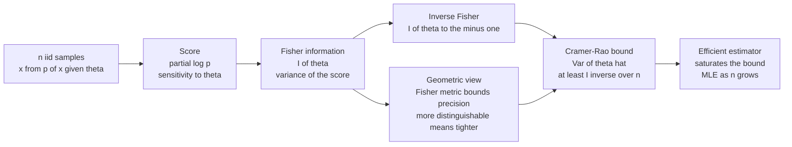

# 🎯 Cramér-Rao Bound and Efficiency

> [!abstract] TL;DR
> The **Cramér-Rao bound (CRB)** is the fundamental precision floor of estimation: for *any* unbiased estimator $\hat\theta$ of a parameter $\theta$ from $n$ i.i.d. samples, $\operatorname{Var}(\hat\theta) \ge \dfrac{1}{n\,I(\theta)} = \dfrac{I(\theta)^{-1}}{n}$, where $I(\theta)$ is the **Fisher information**. No cleverness beats it — the noise in the data caps how sharply you can pin down $\theta$. Geometrically, $I(\theta)$ is the **Fisher-Rao metric** on the space of distributions, and the CRB is simply its *inverse*: the more distinguishable your model is near $\theta$ (steeper metric), the tighter you can estimate. An estimator that attains the floor is **efficient**; equality holds exactly only for the *natural parameter of an exponential family*, and in general the **MLE attains it asymptotically** — $\sqrt{n}(\hat\theta - \theta) \to \mathcal{N}(0, I(\theta)^{-1})$. Curved families lose a second-order piece — the seed of Efron's statistical curvature.

---

## Intuition

**Analogy — the camera and the available light.** No matter how expensive your camera, physics caps how sharp a photo can be in a dim room. The lens, the sensor, your steadiness — none of it can conjure detail that the *available light* never delivered. Photon shot noise sets a hard floor on sharpness; the best you can do is not waste the light you have.

Estimation has exactly the same hard limit. No matter how ingenious your estimator, there is a floor on how precisely you can pin down a parameter $\theta$ from noisy data, and that floor is set entirely by how much the data *reacts* to $\theta$ — the **Fisher information**, the very same quantity that defines the geometry of the space of distributions. Where a tiny change in $\theta$ visibly reshapes the distribution (bright, information-rich data), samples "vote loudly" and you can estimate sharply; where $\theta$ barely moves the distribution (dim data), the samples are almost silent and no estimator can do better than a wide guess. The **Cramér-Rao bound** is this precision floor written as a formula, and geometrically it says: *the more curved and distinguishable your family is near the truth, the more precisely you can estimate.* A good estimator does not beat the light — it just refuses to waste it.

---

## How It Works

### Core mechanics

Fix a smooth family $p(x;\theta)$ and observe $n$ i.i.d. samples $x_1,\dots,x_n$. We want to estimate $\theta$ with an estimator $\hat\theta = T(x_1,\dots,x_n)$.

1. **The score is the sensitivity of the data to the parameter.** The score of one sample is $s(x;\theta) = \partial_\theta \log p(x;\theta)$. Under regularity it has **zero mean**, $\mathbb{E}[s]=0$, because $\int \partial_\theta p\,dx = \partial_\theta\!\int p\,dx = \partial_\theta 1 = 0$. Its spread around zero is the **Fisher information** $I(\theta) = \mathbb{E}[s^2] = -\mathbb{E}[\partial_\theta^2 \log p]$ — the variance of the score, equivalently the expected curvature of the log-likelihood peak.

2. **The covariance trick gives the bound.** For any unbiased $\hat\theta$, differentiating the unbiasedness identity $\mathbb{E}[\hat\theta] = \theta$ under the integral sign yields $\operatorname{Cov}(\hat\theta,\; S_n) = 1$, where $S_n = \sum_i s(x_i;\theta)$ is the total score with variance $n I(\theta)$. The **Cauchy-Schwarz inequality** $\operatorname{Cov}(\hat\theta, S_n)^2 \le \operatorname{Var}(\hat\theta)\operatorname{Var}(S_n)$ then forces
$$\operatorname{Var}(\hat\theta) \;\ge\; \frac{1}{n\,I(\theta)} \;=\; \frac{I(\theta)^{-1}}{n}.$$
That is the Cramér-Rao bound. The $1/n$ is not incidental: information *adds* across independent samples, so precision improves like $1/n$ and the standard error like $1/\sqrt{n}$.

3. **Equality is a geometric alignment.** Cauchy-Schwarz is tight exactly when $\hat\theta - \theta$ is *proportional to the score*: $\hat\theta - \theta = c(\theta)\,S_n$ for some function $c$. This happens **iff** the family is an exponential family and $\theta$ is its natural (canonical) parameter — then the sufficient statistic *is* the efficient estimator. Otherwise the score points slightly "off" the estimator's error direction, and a gap opens.

4. **Efficiency.** An unbiased estimator is **efficient** if it attains the CRB. Its **efficiency** is the ratio $e(\hat\theta) = \dfrac{I(\theta)^{-1}/n}{\operatorname{Var}(\hat\theta)} \in (0,1]$. The **MLE is asymptotically efficient**: even when no finite-sample efficient estimator exists, $\sqrt{n}(\hat\theta_{\text{MLE}} - \theta) \to \mathcal{N}\!\big(0,\,I(\theta)^{-1}\big)$, so its variance slides down onto the CRB as $n\to\infty$. This asymptotic normality *is* the CRB reappearing as the width of the limiting Gaussian.

### Geometric reading

The Fisher information is the **Fisher-Rao metric** $G(\theta)$ on the statistical manifold — it measures how distinguishable two nearby distributions are from data (see [[The_Fisher_Information_Metric]]). The CRB is literally the **inverse metric**: $\operatorname{Var}(\hat\theta) \succeq (nG)^{-1}$. Directions of high information (steep metric, distributions easy to tell apart) can be estimated precisely; flat directions (near-indistinguishable distributions) cannot be pinned down at all. Estimability and geometry are one fact. For a curved family the estimator lives *on* the manifold while the tangent (score) direction bends away from it; the residual bend — **statistical curvature** — is exactly the second-order efficiency loss beyond the CRB.

### Multivariate form

For a vector parameter $\theta\in\mathbb{R}^k$, $I(\theta)$ is the **Fisher information matrix** and the bound is a **matrix (Loewner) inequality**:
$$\operatorname{Cov}(\hat\theta) \;\succeq\; \frac{1}{n}\,I(\theta)^{-1},$$
meaning $\operatorname{Cov}(\hat\theta) - \tfrac1n I^{-1}$ is positive semi-definite. Each diagonal entry gives $\operatorname{Var}(\hat\theta_j) \ge \tfrac1n [I^{-1}]_{jj}$ — note the *inverse of the whole matrix*, not $1/I_{jj}$: nuisance parameters inflate the floor through the off-diagonals.

### Flow: from information to the precision floor



---

## Key Concepts

### Secondary (intuition-level)

- **A hard floor on precision.** However clever your estimator, the noise in the data caps how sharply you can estimate a parameter. That floor is the Cramér-Rao bound.
- **More information means tighter estimates.** If a small change in the parameter visibly changes the data, you can estimate precisely. If it barely changes the data, you cannot — no method helps.
- **Efficiency = not wasting the light.** An *efficient* estimator squeezes out all the precision the data allows; it sits right on the floor. An inefficient one throws some away and sits above it.
- **Averaging helps like 1/n.** Independent samples add information, so variance shrinks like $1/n$ and error bars like $1/\sqrt{n}$.

### Undergraduate (needs probability + calculus)

- **Score and Fisher information.** $s = \partial_\theta \log p$, $\mathbb{E}[s]=0$, and $I(\theta) = \operatorname{Var}(s) = -\mathbb{E}[\partial_\theta^2 \log p]$.
- **The bound.** For unbiased $\hat\theta$: $\operatorname{Var}(\hat\theta) \ge \frac{1}{nI(\theta)}$, proved by Cauchy-Schwarz on $\operatorname{Cov}(\hat\theta, S_n)=1$.
- **Worked floors.** Gaussian mean ($\sigma$ known): $I=1/\sigma^2$, CRB $=\sigma^2/n$, attained exactly by the sample mean. Poisson rate: $I=1/\lambda$, CRB $=\lambda/n$, attained by the sample mean. Exponential rate: $I=1/\lambda^2$, CRB $=\lambda^2/n$, attained only asymptotically by $1/\bar x$.
- **Efficiency.** $e(\hat\theta) = (\text{CRB})/\operatorname{Var}(\hat\theta) \le 1$; the Gaussian-mean *median* has efficiency $2/\pi \approx 0.64$.
- **MLE asymptotics.** $\sqrt{n}(\hat\theta_{\text{MLE}}-\theta)\to\mathcal{N}(0, I^{-1})$: the MLE is *consistent, asymptotically normal, and asymptotically efficient*.

### Graduate (system-level)

- **Attainability and exponential families.** The CRB is attained at finite $n$ **iff** $\hat\theta - \theta \propto S_n$, i.e. iff the model is an exponential family in the *natural* parameter with the sufficient statistic as estimator (see [[Exponential_Families_and_Their_Geometry]]). Under a nonlinear reparameterization the same model becomes *curved* and no finite-sample-efficient unbiased estimator exists.
- **Statistical curvature (Efron, 1975).** The second-order efficiency loss of the MLE is governed by the **statistical curvature** $\gamma_\theta$ of the family in the Fisher metric; the CRB is the first-order term, and curvature is the leading correction — the bridge to higher-order asymptotics and the $\alpha$-connections of information geometry.
- **Multivariate matrix inequality.** $\operatorname{Cov}(\hat\theta)\succeq \tfrac1n I^{-1}$ in the Loewner order; the CRB is the *inverse Fisher metric* — the volume of the smallest confidence ellipsoid the data permits.
- **Higher-order and Bhattacharyya bounds.** For biased or non-exponential families the CRB can be loose; the **Bhattacharyya bounds** use higher derivatives of the log-likelihood to tighten it, and the **Barankin bound** is the tightest possible (attainable) bound.
- **Bayesian analogue.** The **van Trees inequality** (Bayesian CRB) bounds mean-square error by the inverse of the *sum* of the expected Fisher information and the prior's information — the estimation-theory face of the posterior geometry.
- **Regular vs non-regular.** When the support depends on $\theta$ (e.g. Uniform$[0,\theta]$), regularity fails, Fisher information is undefined, and estimators can converge at rate $1/n$ (faster than $1/\sqrt n$) — the CRB simply does not apply.

---

## Python Demo

```python
# numpy + matplotlib only. The Cramer-Rao bound in action.
#
# PART A  Gaussian mean (sigma known) -- the textbook CRB.
#   Fisher info per sample  I(mu) = 1/sigma^2   ->   CRB(n) = sigma^2 / n.
#   * EFFICIENT   estimator: sample mean (= MLE), Var = sigma^2/n  -> SATURATES CRB.
#   * INEFFICIENT estimator: sample median,  Var -> (pi/2) sigma^2/n  -> ABOVE CRB.
#   Shows 1/n scaling, saturation, and that no unbiased estimator beats the floor.
#
# PART B  Exponential rate lambda -- MLE is only ASYMPTOTICALLY efficient.
#   pdf = lambda e^{-lambda x};  I(lambda) = 1/lambda^2  ->  CRB(n) = lambda^2 / n.
#   MLE  lhat = 1/xbar  is BIASED at finite n; its variance sits ABOVE the CRB
#   and slides down onto it as n grows -> efficiency CRB/Var -> 1.

import numpy as np
import matplotlib.pyplot as plt

rng = np.random.default_rng(0)
reps = 20000  # simulated datasets per sample size

# ---------------------------------------------------------------- PART A
mu_true, sigma = 5.0, 2.0
ns_A = np.array([4, 8, 16, 32, 64, 128, 256, 512, 1024])
crb_A, var_mean, var_median = [], [], []
for n in ns_A:
    X = rng.normal(mu_true, sigma, size=(reps, n))
    crb_A.append(sigma**2 / n)                 # Cramer-Rao floor
    var_mean.append(X.mean(axis=1).var())      # efficient (MLE)
    var_median.append(np.median(X, axis=1).var())  # inefficient
crb_A, var_mean, var_median = map(np.array, (crb_A, var_mean, var_median))

# ---------------------------------------------------------------- PART B
lam_true = 1.5
ns_B = np.array([4, 8, 16, 32, 64, 128, 256, 512, 1024])
crb_B, var_mle, eff_ratio = [], [], []
for n in ns_B:
    X = rng.exponential(1.0 / lam_true, size=(reps, n))
    lhat = 1.0 / X.mean(axis=1)                # MLE of the rate
    crb = lam_true**2 / n
    crb_B.append(crb)
    var_mle.append(lhat.var())
    eff_ratio.append(crb / lhat.var())         # -> 1 as n grows
crb_B, var_mle, eff_ratio = map(np.array, (crb_B, var_mle, eff_ratio))

print("PART A -- Gaussian mean, CRB = sigma^2/n:")
for n, c, vm, vd in zip(ns_A, crb_A, var_mean, var_median):
    print(f"  n={n:4d}  CRB={c:.5f}  Var(mean)={vm:.5f}  Var(median)={vd:.5f}"
          f"  eff(median)={c/vd:.3f}")
print(f"  asymptotic median efficiency 2/pi = {2/np.pi:.3f}\n")

print("PART B -- Exponential rate, MLE asymptotic efficiency:")
for n, c, vm, e in zip(ns_B, crb_B, var_mle, eff_ratio):
    print(f"  n={n:4d}  CRB={c:.5f}  Var(MLE)={vm:.5f}  efficiency CRB/Var={e:.3f}")

# ---------------------------------------------------------------- Plots
fig, (axL, axR) = plt.subplots(1, 2, figsize=(12, 4.8))

axL.loglog(ns_A, crb_A,      "k--", lw=2, label="Cramer-Rao bound  sigma^2/n")
axL.loglog(ns_A, var_mean,   "o-",  color="tab:green",
           label="Var(sample mean = MLE)  efficient")
axL.loglog(ns_A, var_median, "s-",  color="tab:red",
           label="Var(sample median)  inefficient")
axL.set_xlabel("sample size  n")
axL.set_ylabel("estimator variance")
axL.set_title("Gaussian mean: MLE saturates the CRB, median sits above")
axL.grid(True, which="both", alpha=0.3)
axL.legend(fontsize=8)

axR.semilogx(ns_B, eff_ratio, "o-", color="tab:blue",
             label="efficiency  CRB / Var(MLE)")
axR.axhline(1.0, color="k", ls="--", lw=1.5, label="bound attained (efficiency = 1)")
axR.set_xlabel("sample size  n")
axR.set_ylabel("efficiency  CRB / Var")
axR.set_ylim(0, 1.15)
axR.set_title("Exponential rate: MLE variance approaches CRB (asymptotic efficiency)")
axR.grid(True, which="both", alpha=0.3)
axR.legend(fontsize=8)

plt.tight_layout()
plt.savefig("cramer_rao_efficiency.png", dpi=120)
plt.show()
```

**What the output shows.** In Part A the sample mean's variance lands *exactly on* the dashed Cramér-Rao line $\sigma^2/n$ at every $n$ — the Gaussian mean is the natural parameter of an exponential family, so the MLE is **finite-sample efficient** and *no unbiased estimator does better*. The sample median tracks a parallel line a constant factor above: same $1/n$ slope, but efficiency $\approx 2/\pi = 0.637$, so it throws away a third of the information. In Part B the exponential-rate MLE $1/\bar x$ is biased for small $n$; its efficiency ratio starts well below 1 (around $0.28$ at $n=4$) and **climbs toward 1** as $n$ grows — the concrete face of $\sqrt n(\hat\theta-\theta)\to\mathcal N(0,I^{-1})$. Two lessons in one figure: an efficient estimator sits on the floor and an inefficient one sits above it, and the MLE, even when not finite-sample efficient, becomes efficient in the large-sample limit.

---

## Real-World Applications

> **Radar, sonar, and GNSS ranging.** The precision with which a receiver can estimate signal delay, Doppler shift, or angle-of-arrival is set by the Cramér-Rao bound: the CRB on time-delay is $\propto 1/(\text{SNR}\cdot B^2)$ with $B$ the bandwidth, which is why wide-bandwidth chirps and high SNR sharpen range estimates. GPS receivers report position accuracy computed straight from the inverse Fisher information (the "dilution of precision" is a Fisher-matrix quantity).

> **Quantum metrology and the Heisenberg limit.** The *quantum* Cramér-Rao bound governs the best achievable phase precision in interferometers, atomic clocks, and gravitational-wave detectors. Independent probes give the standard quantum limit $1/\sqrt N$; entanglement raises the quantum Fisher information to reach the $1/N$ Heisenberg limit — pushing the estimation floor down is the entire game of precision measurement.

> **MRI and quantitative imaging.** Parameter maps (T1/T2 relaxation, diffusion tensors) are fit per-voxel by maximum likelihood, and the CRB tells you the minimum achievable variance for a given pulse sequence. **CRB-optimal experiment design** chooses echo times and flip angles to minimize $\operatorname{tr}(I^{-1})$, buying the sharpest maps per unit scan time.

> **Standard errors and power analysis in statistics.** Every confidence interval from a maximum-likelihood fit — logistic regression, GLMs, survival models — comes from inverting the (observed) Fisher information at the MLE: $\hat\theta \pm 1.96\sqrt{[I^{-1}]_{jj}/n}$. Sample-size and power calculations run the CRB backwards: how large must $n$ be for the variance floor to drop below a target? See [[Maximum_Likelihood_Estimation]].

> **Optimal experimental design.** D-optimal and A-optimal designs choose measurement conditions to maximize $\det I$ or minimize $\operatorname{tr} I^{-1}$ — literally shrinking the Cramér-Rao confidence ellipsoid — in clinical trials, A/B tests, and sensor placement. You are buying the most Fisher information per experiment.

---

## Common Pitfalls

- **Forgetting the unbiasedness assumption.** The plain CRB bounds the variance of *unbiased* estimators only. A biased estimator can have variance *below* the CRB — and, crucially, lower **mean-squared error** too: shrinkage and ridge estimators (James-Stein famously) trade a little bias for a large variance cut and beat the "floor" in MSE. The right generalization is the *biased CRB*, $\operatorname{Var}(\hat\theta)\ge (1+b'(\theta))^2/(nI)$ with $b(\theta)$ the bias, and ultimately the MSE version.
- **Ignoring the regularity conditions.** The derivation needs fixed support, differentiation under the integral, and $\mathbb E[s]=0$. When the support moves with $\theta$ (Uniform$[0,\theta]$, shifted exponentials), Fisher information is undefined, estimators can converge at rate $1/n$ instead of $1/\sqrt n$, and quoting a CRB is simply wrong.
- **Expecting attainability in general.** Finite-sample equality holds *only* when $\theta$ is the natural parameter of an exponential family. For curved families (or nonlinear reparameterizations of exponential ones) *no* unbiased estimator reaches the floor at finite $n$ — the gap is Efron's statistical curvature. The MLE still reaches it *asymptotically*, which is the useful guarantee.
- **Confusing $1/I_{jj}$ with $[I^{-1}]_{jj}$ in the multivariate case.** With several parameters the floor on $\hat\theta_j$ is $[I^{-1}]_{jj}$, the $j$-th diagonal of the *inverted* matrix — always $\ge 1/I_{jj}$. Estimating extra nuisance parameters *raises* every floor through the off-diagonal coupling; treating parameters as if independent understates the true uncertainty.
- **Treating the CRB as achievable precision at any $n$.** It is a *lower* bound and often loose at small $n$ or low SNR, where the log-likelihood is multimodal and the MLE is far from Gaussian. Bhattacharyya/Barankin bounds and simulation (as in the demo) reveal the real behavior; the CRB is the *best-case* asymptote, not a promise.

---

## Related Concepts

*Cross-vault connections (Glob-verified):*

- [[The_Fisher_Information_Metric]] — the metric whose **inverse is the CRB**; this note is the estimation-precision face of the same geometry. Steep metric (distinguishable family) equals tight bound.
- [[Fisher_Information_and_the_Cramer_Rao_Bound]] — the Information-Theory companion: the *inequality / precision-bound* treatment. This note gives the **geometric** reading (inverse metric, curvature, attainability) of the identical result.
- [[Maximum_Likelihood_and_Information]] — the MLE's asymptotic normality $\sqrt n(\hat\theta-\theta)\to\mathcal N(0,I^{-1})$ *is* the CRB reappearing as the width of the limiting Gaussian.
- [[Exponential_Families_and_Their_Geometry]] — the CRB is attained at finite $n$ exactly for the *natural parameter* of an exponential family; curvature away from flatness is the efficiency loss.
- [[Statistical_Manifolds]] — the manifold on which estimation happens; the CRB is the inverse metric measuring how tightly a point (distribution) can be located from samples.
- [[Statistical_Inference]] — sufficiency, unbiasedness, consistency, and efficiency; the CRB is the benchmark against which estimators are graded.
- [[Maximum_Likelihood_Estimation]] — applied MLE and its standard errors, which are computed by inverting the observed Fisher information at the estimate.
- [[Common_Probability_Distributions]] — the Gaussian, Poisson, and exponential worked floors ($\sigma^2/n$, $\lambda/n$, $\lambda^2/n$) live on these families.
- [[Random_Variables]] — variance, expectation, and covariance, the raw material of the Cauchy-Schwarz proof.
- [[Bayesian_Statistics]] — the van Trees (Bayesian CRB) inequality bounds MSE by the inverse of prior-plus-data Fisher information.
- [[Probability_Theory]] — the measure-theoretic footing for scores, regularity, and differentiation under the integral.

*Siblings in this Information Geometry section (built alongside this note): **Maximum Likelihood as Projection**, where the MLE is an $m$-projection onto the model and the CRB is the projection's residual variance; **Higher-Order Asymptotics and Curvature**, which develops Efron's statistical curvature as the second-order efficiency loss beyond the CRB; and **Chentsov's Uniqueness Theorem**, which singles out the Fisher metric — hence the CRB — as the one invariant notion of statistical distance.*

---

## Review Questions

1. **(Secondary)** Using the camera-and-light analogy, explain why *no* estimator — however clever — can beat the Cramér-Rao bound, and what quantity plays the role of "available light." Why does collecting more data (larger $n$) tighten the floor, and by roughly how much when you go from $n$ to $4n$?
2. **(Undergraduate)** For the Gaussian family $\mathcal N(\mu,\sigma^2)$ with $\sigma$ known, derive $I(\mu)=1/\sigma^2$ and hence the CRB $\sigma^2/n$. Show the sample mean attains it exactly. The sample median is unbiased but has variance $\approx (\pi/2)\sigma^2/n$ — compute its efficiency and explain, in terms of the covariance-with-the-score argument, why it falls short.
3. **(Graduate)** State the attainability condition for the CRB and explain why it holds *only* for the natural parameter of an exponential family. Given a curved family where no finite-sample efficient estimator exists, what guarantees does the MLE still satisfy, and what does *statistical curvature* measure about the residual gap? How does the multivariate matrix inequality $\operatorname{Cov}(\hat\theta)\succeq \tfrac1n I^{-1}$ change the floor on a single component when nuisance parameters are present?

---

## Sources

- Rao, C. R. (1945). *Information and the accuracy attainable in the estimation of statistical parameters.* Bulletin of the Calcutta Mathematical Society, 37, 81-91. (the original bound)
- Cramér, H. (1946). *Mathematical Methods of Statistics.* Princeton University Press. (independent statement; the classic textbook derivation)
- Lehmann, E. L. & Casella, G. (1998). *Theory of Point Estimation* (2nd ed.). Springer. (unbiased estimation, efficiency, attainability)
- Amari, S. & Nagaoka, H. (2000). *Methods of Information Geometry.* AMS / Oxford University Press. (Fisher metric, CRB as inverse metric, curvature and higher-order efficiency)
- Efron, B. (1975). *Defining the curvature of a statistical problem (with applications to second order efficiency).* Annals of Statistics, 3(6), 1189-1242. (statistical curvature and second-order efficiency loss)

---

#information-geometry #cramer-rao-bound #fisher-information #efficiency #estimation
