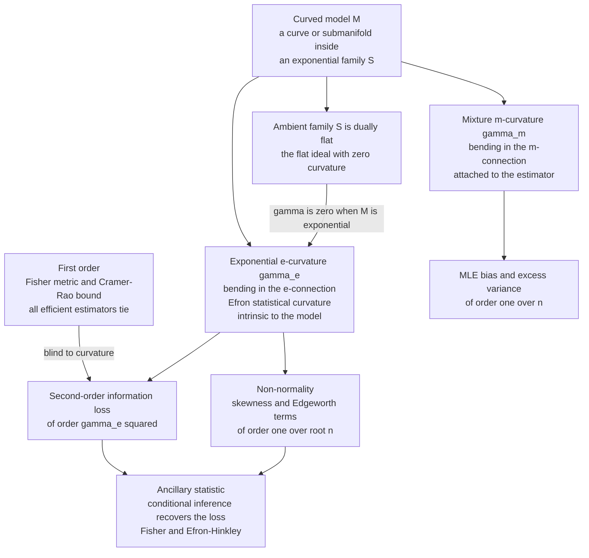

# 📐 Higher-Order Asymptotics and Curvature

> [!abstract] TL;DR
> To **first order**, every efficient estimator saturates the Cramér-Rao bound, so they all look equally good — the Fisher metric is the whole story. Look at **second order** and a hierarchy appears, governed by a single number: **Efron's statistical curvature** $\gamma$ (1975). A model that *is* a full exponential family is geometrically **flat** ($\gamma=0$), and its MLE is optimal to second order. A **curved exponential family** — a submanifold of an exponential family — bends away with $\gamma>0$, and that curvature exactly quantifies (i) the **second-order information loss** of the MLE ($\propto\gamma^2$), (ii) its $O(1/n)$ **bias and excess variance**, and (iii) its **non-normality** (skewness, Edgeworth corrections). Amari sharpened this into *two* dual curvatures — the **exponential ($e$-)** curvature (intrinsic to the model, $=$ Efron's $\gamma$) and the **mixture ($m$-)** curvature (attached to the estimator). The lost information is recoverable by conditioning on an **ancillary statistic** (Fisher; Efron-Hinkley). The deep reading: **curvature is the intrinsic difficulty of a statistical problem.**

---

## Intuition

**Analogy — the almost-straight road.** To a first approximation, every car that hits the speed limit on a highway looks equally fast — you cannot tell them apart from the top-line number. But watch closely on a road that is *almost* straight yet subtly bends, and differences emerge: the bending car must constantly correct its steering, it drifts, it overshoots on the curves in a way the truly-straight driver never does. **Efron discovered that a statistical model has exactly this kind of bend** — a *curvature*, in the precise sense of differential geometry — and that this curvature measures how much information an "efficient" estimator quietly loses at **second order**, and how far the model deviates from the clean, flat world of exponential families.

Translate the road into the domain: the "truly straight road" is an **exponential family**, where the log-likelihood is a tidy convex bowl, the MLE is a sufficient statistic, and everything is exactly Gaussian at the optimum. A **curved exponential family** is the road that is *almost* straight — a curve or surface threaded through the exponential family. Its bend is the **statistical curvature** $\gamma$. Where $\gamma=0$ the problem is "easy" and first-order theory tells the whole truth; where $\gamma$ is large the problem is intrinsically "hard," the MLE is biased and skewed at finite $n$, and no amount of cleverness in *choosing* the estimator removes the difficulty — the curvature literally quantifies it.

---

## How It Works

### First order: why everyone ties

Fix a smooth model $\{p(x;\theta)\}$. The [[Fisher_Information_and_the_Cramer_Rao_Bound|Fisher information]] $i(\theta)$ is the metric, and the Cramér-Rao bound says any unbiased estimator has variance at least $1/(n\,i(\theta))$. The MLE **attains** this bound asymptotically: $\sqrt{n}(\hat\theta-\theta)\to \mathcal{N}(0,\,i^{-1})$. So do a whole class of *first-order efficient* estimators. At this resolution they are indistinguishable — the geometry visible to first order is **only the metric**, and the metric alone cannot separate a flat model from a curved one. The sibling note *Cramér-Rao Bound and Efficiency* develops this floor; the present note is about what lives one order below it.

### Curved exponential families: where the flat theory bends

An **exponential family** $S=\{\exp(\eta\cdot T(x)-\psi(\eta))\}$ is the flat ideal: in its natural parameters $\eta$ it is $e$-flat, in its expectation parameters it is $m$-flat, it is [[Dually_Flat_Spaces|dually flat]], and its MLE ($\nabla\psi(\hat\eta)=\bar T$) is an exact sufficient statistic. A **curved exponential family** is a smooth **submanifold** $M=\{\eta(\theta):\theta\in\Theta\}$ threaded through $S$ — a lower-dimensional curve or surface inside the flat family (see [[Exponential_Families_and_Their_Geometry]]). The moment the submodel is *not* an affine ($e$-flat) subspace of $S$, it **bends**, and the clean exponential-family guarantees degrade to leading order in $1/n$.

### Efron's statistical curvature

Efron measured that bend intrinsically. Let the ambient family have covariance $V(\eta)=\mathrm{Cov}(T)$ (its Fisher metric), and let the submodel be the curve $\eta(\theta)$ with velocity $\dot\eta$ and acceleration $\ddot\eta$. Form the three **information moments**

$$
\nu_{20}=\dot\eta^\top V\dot\eta,\qquad
\nu_{11}=\dot\eta^\top V\ddot\eta,\qquad
\nu_{02}=\ddot\eta^\top V\ddot\eta .
$$

Here $\nu_{20}=i(\theta)$ is exactly the Fisher information of the submodel. The **statistical curvature** is the size of the *acceleration that is left over after removing its component along the velocity* — the part of $\ddot\eta$ that genuinely points "off the model," normalized by the information:

$$
\boxed{\;\gamma(\theta)=\frac{\sqrt{\nu_{20}\,\nu_{02}-\nu_{11}^2}}{\nu_{20}^{\,3/2}}\;}
$$

If the curve is a **straight line in the natural parameters** — i.e. the submodel *is* an exponential family — then $\ddot\eta=0$, so $\nu_{11}=\nu_{02}=0$ and $\gamma\equiv 0$. This is the flat ideal. Any genuine bend gives $\gamma>0$, and $\gamma^2$ turns out to be the **second-order information loss** of the MLE (in units of Fisher information per observation).

### Amari's two curvatures: $e$ and $m$

Amari (1982) recognized $\gamma$ as an **embedding curvature** and showed a submanifold of $S$ carries *two* of them, one for each of the [[The_Alpha_Family_of_Connections|dual connections]]:

- **Exponential ($e$-)curvature $\gamma_e$** — the bending of the model measured by the $e$-connection. It is **Efron's statistical curvature**, it is **intrinsic to the model**, and it measures how far the parameterization is from being a *natural* (exponential-family) one — the "naturalness" curvature. It is the part of the difficulty **no estimator can escape**.
- **Mixture ($m$-)curvature $\gamma_m$** — the bending measured by the $m$-connection. Unlike $\gamma_e$, it is attached to the **estimator**: an estimator picks a family of "level surfaces" (the sets of data mapping to the same estimate, i.e. its **ancillary family**), and $\gamma_m$ is the curvature of *those* surfaces. It governs the estimator-dependent **bias** and second-order variance.

Amari's second-order theorem: the total information loss of a first-order-efficient estimator splits as $\Delta I = \gamma_e^2 + \gamma_m^2$. The first term is fixed by the model; the second depends on your choice of estimator. The **MLE minimizes the loss** by making its ancillary family $m$-flat, so $\gamma_m=0$ for the MLE — leaving only the unavoidable $\gamma_e^2$. That residual is exactly what a good **ancillary statistic** lets you recover by conditioning.

### Consequences at order $1/\sqrt{n}$ and $1/n$

- **Information loss.** After first order, the MLE holds Fisher information $n\,i$ minus a term of order $\gamma_e^2$; conditioning on an ancillary (the observed information; Efron-Hinkley) restores it.
- **Bias.** $\mathbb{E}[\hat\theta]-\theta = b(\theta)/n + O(n^{-2})$, and $b$ contains a curvature term. Larger $\gamma$ ⇒ larger $O(1/n)$ bias.
- **Non-normality.** The Edgeworth expansion of the MLE's distribution has a **skewness** term of order $1/\sqrt{n}$ whose coefficient involves the curvature and the Amari-Chentsov cubic (skewness) tensor. Higher curvature ⇒ the sampling distribution departs from the Gaussian Cramér-Rao prediction sooner and more strongly.
- **The hierarchy.** Fisher metric $=$ first-order geometry; **curvature $=$ second-order**; higher tensors (skewness, kurtosis of the model) live beyond. Each order peels off one more layer of "difficulty."



---

## Key Concepts

### Secondary (intuitive)

- **Flat means easy, curved means hard.** An exponential family is a "straight" statistical model — its MLE is exact and Gaussian. A curved model bends away from it, and the amount of bend is a single number, the **statistical curvature**.
- **First order can't see the bend.** Judged only by the Cramér-Rao "top speed," all good estimators tie. The curvature is what separates them at the next level of detail.
- **Curvature costs you at finite $n$.** The more the model bends, the more the MLE is *biased* and *lopsided* (skewed) for small samples, even though it becomes perfect as $n\to\infty$.
- **You can claw some of it back.** Reporting an extra summary of the data (an *ancillary*) and doing inference conditional on it recovers information the plain MLE dropped.

### Undergraduate (needs likelihood + multivariable calculus)

- **Curved exponential family.** A submanifold $\eta(\theta)$ of an exponential family $S$; if $\eta$ is affine in $\theta$ the submodel is itself exponential and $\gamma=0$.
- **Efron's $\gamma$.** From $\nu_{20}=\dot\eta^\top V\dot\eta$, $\nu_{11}=\dot\eta^\top V\ddot\eta$, $\nu_{02}=\ddot\eta^\top V\ddot\eta$: $\gamma=\sqrt{\nu_{20}\nu_{02}-\nu_{11}^2}/\nu_{20}^{3/2}$. It is the length of the "off-model" acceleration per unit information.
- **Constant-curvature example.** A circle of radius $\rho$ in a Gaussian-$\mathcal{N}(\eta,I)$ family has $\gamma=1/\rho$ everywhere — literally the geometric curvature of the circle. Big radius ⇒ nearly straight ⇒ small $\gamma$.
- **Second-order effects.** MLE bias $\sim b(\theta)/n$ and skewness $\sim c(\theta)/\sqrt{n}$ both carry factors of the curvature; both vanish as $\gamma\to 0$.
- **Ancillary + conditioning.** An ancillary statistic has a distribution free of $\theta$ but tells you *how informative this particular sample was*; conditioning on it (observed vs expected information) sharpens error bars.

### Graduate (system-level)

- **Two dual embedding curvatures.** For $M\subset S$, the $e$-curvature $H^{(e)}$ and $m$-curvature $H^{(m)}$ are the second fundamental forms of $M$ with respect to $\nabla^{(e)}$ and $\nabla^{(m)}$. Efron's $\gamma$ is (a scalar contraction of) $H^{(e)}$.
- **Amari's information-loss decomposition.** For a first-order-efficient estimator, $\Delta I(\theta)=\gamma_e^2(\theta)+\gamma_m^2(\theta)$. The model term $\gamma_e^2$ is fixed; the MLE achieves $\gamma_m=0$ (its ancillary foliation is $m$-flat), hence **second-order efficiency / minimal deficiency**.
- **Edgeworth / cumulant expansions.** The MLE's cumulants expand in $1/\sqrt{n}$; the leading skewness couples the curvature with the Amari-Chentsov cubic tensor $T_{ijk}=\mathbb{E}[\partial_i\ell\,\partial_j\ell\,\partial_k\ell]$. Barndorff-Nielsen's $p^*$-formula and the modified likelihood-ratio $r^*$ organize these corrections.
- **Ancillaries and conditionality.** Fisher's conditionality principle, the Efron-Hinkley approximate ancillary, and the observed information $j(\hat\theta)$ (vs expected $i(\hat\theta)$) are the machinery that recovers the $\gamma_e^2$ loss and yields curvature-corrected confidence sets.
- **Where the story fails to be a story.** Everything above assumes a smooth, identifiable, regular model with fixed support; non-regular families (moving support, boundaries, non-identifiability, singular Fisher metric) need a different asymptotic theory.

---

## Python Demo

```python
# Statistical curvature and its finite-sample consequences.
# numpy + matplotlib only.
#
# Setup. Full (flat) exponential family: bivariate Normal  N(eta, I_2).
#   natural parameter eta = mean vector; sufficient statistic T = x; V = Cov(T) = I.
# A CURVED exponential family = a 1-D curve eta(u) threaded through this flat family.
#
# (a) STATISTICAL CURVATURE (Efron's gamma) from the three information moments
#         nu20 = eta' . V . eta'      (= Fisher info of the sub-family)
#         nu11 = eta' . V . eta''
#         nu02 = eta''. V . eta''
#         gamma = sqrt(nu20 nu02 - nu11^2) / nu20^{3/2}
#     * a STRAIGHT (exponential-family) sub-model -> eta'' = 0 -> gamma = 0
#     * a circle of radius rho          -> gamma = 1/rho  (curved, gamma > 0)
#
# (b) CONSEQUENCE. For low- vs high-curvature circles, simulate the MLE's sampling
#     distribution and show that the higher-curvature model is more BIASED and more
#     NON-NORMAL (skewed) at finite n, i.e. it deviates from the Gaussian Cramer-Rao
#     prediction at order 1/n -- an effect invisible to first-order theory.

import numpy as np
import matplotlib.pyplot as plt

rng = np.random.default_rng(0)
V = np.eye(2)                       # ambient Fisher metric (Gaussian, unit covariance)

# ---------------------------------------------------------------------------
# (a) Efron's statistical curvature
# ---------------------------------------------------------------------------
def efron_gamma(eta_dot, eta_ddot, V=V):
    n20 = eta_dot @ V @ eta_dot
    n11 = eta_dot @ V @ eta_ddot
    n02 = eta_ddot @ V @ eta_ddot
    return np.sqrt(max(n20 * n02 - n11**2, 0.0)) / n20**1.5

# straight sub-model: line eta(u) = (u, b)  ->  acceleration is zero
line_gamma = efron_gamma(np.array([1.0, 0.0]), np.array([0.0, 0.0]))
print(f"straight exponential-family sub-model : gamma = {line_gamma:.4f}  (flat ideal)")

# curved sub-model: circle eta(u) = rho (cos u, sin u)
def circle_gamma(rho, u=0.3):
    ed  = rho * np.array([-np.sin(u),  np.cos(u)])
    edd = rho * np.array([-np.cos(u), -np.sin(u)])
    return efron_gamma(ed, edd)

print("curved sub-model (circle):")
for rho in [0.7, 1.0, 2.0, 4.0]:
    print(f"   radius rho={rho:>4}: Efron gamma={circle_gamma(rho):.4f}"
          f"   (theory 1/rho={1/rho:.4f})")

# ---------------------------------------------------------------------------
# (b) Finite-sample non-normality of the MLE grows with curvature.
#     Circle model, true angle u0. We observe the sample mean m ~ N(true_pt, I/n).
#     MLE angle:  u_hat = atan2(m_y, m_x)          (project m onto the circle)
#     Estimand :  S = E[X] = rho cos u , true S0 = rho cos u0
#                 CRB std(S_hat) = |sin u0| / sqrt(n)   (independent of rho!)
#     Standardize the error by that CRB std: the FIRST-ORDER Gaussian prediction is
#     then N(0,1) for EVERY rho, so any bias / skew is a pure 2nd-order CURVATURE effect.
# ---------------------------------------------------------------------------
n, M, u0 = 20, 80_000, np.pi / 4
crb_std = abs(np.sin(u0)) / np.sqrt(n)

def simulate(rho):
    true_pt = rho * np.array([np.cos(u0), np.sin(u0)])
    m = true_pt + rng.normal(0.0, 1.0 / np.sqrt(n), size=(M, 2))
    u_hat = np.arctan2(m[:, 1], m[:, 0])
    z = (rho * np.cos(u_hat) - rho * np.cos(u0)) / crb_std   # standardized MLE error
    bias = z.mean()
    skew = ((z - z.mean())**3).mean() / z.std()**3
    return z, bias, skew

rhos   = np.array([0.7, 0.85, 1.0, 1.25, 1.6, 2.0, 2.6, 3.3, 4.0])
gammas = 1.0 / rhos
biases = np.empty_like(rhos)
skews  = np.empty_like(rhos)
for k, rho in enumerate(rhos):
    _, biases[k], skews[k] = simulate(rho)

z_lo, b_lo, s_lo = simulate(4.0)    # low curvature  gamma = 0.25
z_hi, b_hi, s_hi = simulate(0.7)    # high curvature gamma = 1.43
print(f"\nlow  curvature gamma={1/4.0:.2f}:  std-bias={b_lo:+.3f}  skew={s_lo:+.3f}")
print(f"high curvature gamma={1/0.7:.2f}:  std-bias={b_hi:+.3f}  skew={s_hi:+.3f}")

# ---------------------------------------------------------------------------
# Plots
# ---------------------------------------------------------------------------
fig, ax = plt.subplots(2, 2, figsize=(12, 9))

# (0,0) embedded curves in natural-parameter space + their curvature
t = np.linspace(0, 2 * np.pi, 400)
for rho, col in [(0.7, "tab:red"), (1.5, "tab:orange"), (3.0, "tab:green")]:
    ax[0, 0].plot(rho * np.cos(t), rho * np.sin(t), color=col, lw=2,
                  label=f"circle rho={rho}, gamma={1/rho:.2f}")
xx = np.linspace(-3.2, 3.2, 2)
ax[0, 0].plot(xx, 0.0 * xx, "k--", lw=2, label="line (exp. family), gamma=0")
ax[0, 0].set_aspect("equal"); ax[0, 0].set_xlabel("eta_1"); ax[0, 0].set_ylabel("eta_2")
ax[0, 0].set_title("Curved exponential families: model curvature gamma")
ax[0, 0].legend(fontsize=8, loc="upper right")

# (0,1) MLE standardized-error distributions vs first-order Gaussian
grid = np.linspace(-5, 4, 300)
gauss = np.exp(-0.5 * grid**2) / np.sqrt(2 * np.pi)
ax[0, 1].hist(np.clip(z_lo, -5, 4), bins=120, density=True, alpha=0.5,
              color="tab:green", label=f"low curv gamma=0.25 (skew {s_lo:+.2f})")
ax[0, 1].hist(np.clip(z_hi, -5, 4), bins=120, density=True, alpha=0.5,
              color="tab:red", label=f"high curv gamma=1.43 (skew {s_hi:+.2f})")
ax[0, 1].plot(grid, gauss, "k-", lw=2, label="Cramer-Rao N(0,1)")
ax[0, 1].axvline(0, color="k", lw=0.6)
ax[0, 1].set_xlabel("standardized MLE error"); ax[0, 1].set_ylabel("density")
ax[0, 1].set_title("MLE sampling distribution vs 1st-order Gaussian")
ax[0, 1].legend(fontsize=8)

# (1,0) second-order bias vs curvature
ax[1, 0].plot(gammas, np.abs(biases), "o-", color="tab:purple")
ax[1, 0].set_xlabel("statistical curvature gamma = 1/rho")
ax[1, 0].set_ylabel("|standardized MLE bias|")
ax[1, 0].set_title("2nd-order MLE bias grows with curvature")
ax[1, 0].grid(alpha=0.3)

# (1,1) non-normality (skewness) vs curvature
ax[1, 1].plot(gammas, np.abs(skews), "s-", color="tab:blue")
ax[1, 1].set_xlabel("statistical curvature gamma = 1/rho")
ax[1, 1].set_ylabel("|skewness of MLE|")
ax[1, 1].set_title("MLE non-normality grows with curvature")
ax[1, 1].grid(alpha=0.3)

plt.tight_layout()
plt.savefig("statistical_curvature.png", dpi=120)
plt.show()
```

**What the output shows.** Part (a) prints $\gamma=0$ for the straight (exponential-family) submodel — the flat ideal — while every circle returns $\gamma=1/\rho$ to numerical precision, confirming that Efron's statistical curvature of a circle of radius $\rho$ is exactly its geometric curvature; a big radius is "nearly straight" and barely curved. Part (b) makes the *consequence* visible: for the low-curvature model ($\gamma=0.25$) the standardized MLE error hugs the Cramér-Rao $\mathcal{N}(0,1)$ curve with near-zero bias and skew, but for the high-curvature model ($\gamma=1.43$) the same standardized error is **shifted (biased) and visibly left-skewed** — it has departed from the Gaussian first-order prediction. The bottom row plots the two second-order deficiencies against $\gamma$: both the $|$standardized bias$|$ and the $|$skewness$|$ **rise monotonically with curvature**, the numerical signature of the theory — first order is blind to $\gamma$, second order is governed by it.

---

## Real-World Applications

> **Conditional inference and the observed information.** Modern likelihood software does not stop at the expected Fisher information $i(\hat\theta)$; it reports standard errors from the **observed** information $j(\hat\theta)$ and, in careful implementations, conditions on an approximate ancillary (Efron-Hinkley). This is curvature theory in production: for curved models the two informations differ at order $\gamma^2$, and using the observed one recovers the accuracy the plain MLE lost.

> **Bias correction in nonlinear regression.** Pharmacokinetic models, growth curves, calibration curves, and other nonlinear least-squares fits are curved exponential families. Their MLEs carry an $O(1/n)$ bias proportional to the model curvature; Box's bias-correction formula and its geometric refinements subtract exactly this curvature term to sharpen small-sample estimates.

> **Higher-order confidence intervals ($r^*$, $p^*$, saddlepoint).** Barndorff-Nielsen's modified signed likelihood-ratio $r^*$ and the $p^*$-formula bake curvature and the skewness tensor into third-order-accurate $p$-values and intervals — routine in the statistics of small samples where the naive Wald/Gaussian interval (blind to curvature) is unreliable.

> **Bootstrap accuracy.** The bootstrap's edge over the normal approximation comes precisely from capturing the $O(1/\sqrt{n})$ Edgeworth skewness term — the curvature-driven non-normality this note is about. "Second-order accurate" bootstrap intervals are curvature-aware by construction.

> **Model and design choice.** Because $\gamma$ measures the intrinsic difficulty of a problem, experimental designers and modelers prefer parameterizations and designs that *reduce* curvature — flatter models give better-behaved, more Gaussian estimators at the sample sizes actually available.

---

## Common Pitfalls

- **Conflating $e$- and $m$-curvature.** They answer different questions. The **exponential ($e$-)curvature** is Efron's $\gamma$: intrinsic to the *model*, unavoidable, and it measures the naturalness of the parameterization / distance from being exponential. The **mixture ($m$-)curvature** is a property of the *estimator's* ancillary family and governs its bias; the MLE zeroes it out. Attributing bias to $\gamma_e$ (or information loss to $\gamma_m$) mixes up model difficulty with estimator choice.
- **Thinking curvature is an artifact of the embedding.** It looks like $\gamma$ depends on how you drew the curve inside the big family, but Efron proved it is **intrinsic** — a genuine invariant of the statistical problem, unchanged by re-embedding or by smooth reparameterization of $\theta$ (which rescales $\dot\eta,\ddot\eta$ but leaves $\gamma$ fixed). Do not dismiss it as a coordinate effect.
- **Believing first-order efficiency settles the matter.** "My estimator attains the Cramér-Rao bound" is a *first-order* statement; it is true for a whole class of estimators and says nothing about second-order bias, variance, or non-normality. Curvature is exactly the structure first-order efficiency cannot see — two estimators can tie at first order and differ at second.
- **Extrapolating asymptotics to small samples.** Curvature effects scale as $1/\sqrt{n}$ (skewness) and $1/n$ (bias, information loss). For large $n$ they vanish and the Gaussian picture is fine; for the small $n$ you often actually have, a high-curvature model's MLE can be markedly biased and skewed. The whole point of higher-order asymptotics is this finite-sample regime — do not quote the $n\to\infty$ Gaussian as if it held at $n=15$.
- **Assuming regularity.** The clean curvature story needs a smooth, identifiable model with fixed support and non-singular Fisher metric. Moving supports, boundary parameters, and non-identifiable directions (a singular metric) break the expansions entirely and need separate treatment.

---

## Related Concepts

*Cross-vault connections (Glob-verified):*
- [[Fisher_Information_and_the_Cramer_Rao_Bound]] — the first-order geometry (metric + variance floor) that curvature sits one order beneath; the whole "everyone ties at first order" story is the CRB, and $\gamma^2$ is the *second*-order information loss below it.
- [[Exponential_Families_and_Their_Geometry]] — the flat ideal ($\gamma=0$); curved exponential families are submanifolds of exactly these, so this note describes what happens when that clean structure is bent.
- [[The_Alpha_Family_of_Connections]] — supplies the dual $e$- and $m$-connections; the two curvatures $\gamma_e,\gamma_m$ are the embedding curvatures with respect to the $\alpha=+1$ and $\alpha=-1$ members.
- [[Dually_Flat_Spaces]] — "flat" here means *dually* flat; a curved exponential family loses global dual flatness, and the failure is measured by curvature.
- [[Statistical_Manifolds]] — the general stage: the model is a manifold, its metric is first-order structure, and curvature is the next geometric invariant.
- [[Mathematics/14_Advanced_Topics/Differential_Geometry|Differential Geometry]] — provides second fundamental forms, embedding curvature, and geodesics; statistical curvature specializes these to statistical manifolds.
- [[Mathematics/06_Probability_and_Statistics/Statistical_Inference|Statistical Inference]] — MLE, efficiency, sufficiency, and ancillarity are the inferential objects whose second-order behavior curvature controls.
- [[Econometrics/03_Advanced_Regression/Maximum_Likelihood_Estimation|Maximum Likelihood Estimation]] — the MLE whose $O(1/n)$ bias and non-normality this note explains and quantifies via $\gamma$.

*Section siblings (in this Information Geometry vault, referenced in prose):* the first-order floor is developed in **Cramér-Rao Bound and Efficiency**; the geometric prerequisites in **Riemannian Geometry Primer for Statistics** and **The Fisher Information Metric**; the projection view of the MLE in **Maximum Likelihood as Projection**; and the dual-connection machinery in **Dual Affine Connections**.

---

## Review Questions

1. **(Secondary)** Using the "almost-straight road" analogy, explain why two estimators that both "hit the speed limit" (attain the Cramér-Rao bound) can still differ, and what role the model's curvature plays in telling them apart. Why does a genuine exponential family have zero curvature?
2. **(Undergraduate)** For the circle model $\eta(u)=\rho(\cos u,\sin u)$ inside a Gaussian $\mathcal{N}(\eta,I)$ family, compute the information moments $\nu_{20},\nu_{11},\nu_{02}$ and show Efron's statistical curvature is $\gamma=1/\rho$ everywhere. Then argue qualitatively why the MLE's finite-sample bias and skewness should grow as $\rho$ shrinks.
3. **(Graduate)** State Amari's decomposition $\Delta I=\gamma_e^2+\gamma_m^2$ of an estimator's second-order information loss. Explain what makes the MLE *second-order efficient*, how it relates to $\gamma_m=0$, and how an ancillary statistic (Fisher; Efron-Hinkley) recovers the residual $\gamma_e^2$. Which of the two curvatures is intrinsic to the model and which to the estimator, and why?

---

## Sources

- Efron, B. (1975). *Defining the curvature of a statistical problem (with applications to second order efficiency).* The Annals of Statistics, 3(6), 1189-1242. (the original statistical curvature)
- Amari, S. (1982). *Differential geometry of curved exponential families — curvatures and information loss.* The Annals of Statistics, 10(2), 357-385. (the $e$/$m$ curvature decomposition and second-order efficiency)
- Amari, S. & Nagaoka, H. (2000). *Methods of Information Geometry.* AMS / Oxford University Press. (Ch. 4: curved exponential families and higher-order asymptotics)
- Barndorff-Nielsen, O. E. & Cox, D. R. (1994). *Inference and Asymptotics.* Chapman & Hall. (Edgeworth, $p^*$/$r^*$, ancillarity, conditional inference)
- Kass, R. E. & Vos, P. W. (1997). *Geometrical Foundations of Asymptotic Inference.* Wiley. (textbook synthesis linking Efron and Amari)

---

#information-geometry #statistical-curvature #higher-order-asymptotics #efron #efficiency
