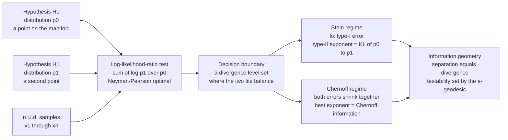

# 🔬 Hypothesis Testing and Divergence

> [!abstract] TL;DR
> Deciding **which of two distributions generated your data** is, at bottom, a question about the **geometric separation** between those distributions — and information geometry makes "separation" exact. The **likelihood-ratio test** is optimal (Neyman-Pearson), and its error probabilities fall **exponentially** in the sample size $n$ with a rate governed entirely by **divergences**. **Stein's lemma:** fix the type-I error and the type-II error decays as $e^{-n\,D(P_0\|P_1)}$ — the KL divergence *is* the error exponent, so $1/D$ is the number of samples you need. **Chernoff information:** when *both* errors must vanish, the best symmetric exponent is $C(P_0,P_1) = -\min_s \log\sum_x p_0^{\,s}p_1^{\,1-s}$, the Rényi/Chernoff divergence at the **optimal statistical tilt** $s^\star$ — geometrically the **$e$-geodesic midpoint** where each hypothesis finds the tilted law equally atypical. The deep message: **the metric/divergence structure of the space of distributions governs testability.** More divergence means faster-shrinking error; the geometry is the statistics.

---

## Intuition

**Analogy — two nearly-identical coins.** Someone hands you one of two coins: coin $P_0$ lands heads with probability $0.50$, coin $P_1$ with probability $0.51$. You may flip as many times as you like, then you must declare which coin it is. After ten flips you have no idea. After ten *thousand* flips the tiny bias starts to show. After a million you can be almost certain. Now swap coin $P_1$ for one that lands heads $90\%$ of the time — a handful of flips settles it. The whole gap between "a million flips" and "a handful" is set by **exactly one number**: how *different* the two coins are. Information geometry names that number — it is the **KL divergence** between the two coins — and it turns "how many flips" into a precise formula: the probability of still being fooled after $n$ flips falls off like $e^{-nD}$.

The turn that makes this a *geometry* note: think of every candidate distribution as a **point** on a curved manifold. Two hypotheses are two points, and telling them apart is asking *how far apart* they sit. But the relevant "distance" is not Euclidean — it is a **divergence**, the same relative-entropy ruler that measures wasted coding bits (see the sibling note *Kullback-Leibler Divergence and Geometry*) and that locally becomes the Fisher information metric (*The Fisher-Rao Distance*). The more the two hypotheses diverge, the more each sample *screams* which one is true, and the faster your error probability collapses. **Distinguishability is distance; error exponents are divergences.** That single identity is the reason hypothesis testing lives inside information geometry.

---

## How It Works

### Two hypotheses are two points; the test is a boundary between them

You observe i.i.d. data $x_1,\dots,x_n$ and must choose between

- $H_0$ (**null**): the data came from $P_0$,
- $H_1$ (**alternative**): the data came from $P_1$.

A test partitions the sample space into an "accept $H_0$" region and an "accept $H_1$" region. Two errors are possible: the **type-I** rate $\alpha = \Pr[\text{say }H_1 \mid H_0]$ (false positive, the significance level) and the **type-II** rate $\beta = \Pr[\text{say }H_0 \mid H_1]$ (false negative; $1-\beta$ is the power). With finite data you cannot kill both; the question is how to spend a fixed $\alpha$ budget to make $\beta$ as small as possible.

### The likelihood-ratio test is optimal, and its boundary is a divergence level set

The **Neyman-Pearson lemma** says: among *all* tests with type-I error at most $\alpha$, the one that **minimizes** $\beta$ is the **likelihood-ratio test (LRT)** — decide $H_1$ when the ratio $\prod_i p_1(x_i)/p_0(x_i)$ exceeds a threshold. Taking logs and using independence, the optimal statistic is the **summed log-likelihood ratio**
$$L(x^n) \;=\; \sum_{i=1}^{n}\log\frac{p_1(x_i)}{p_0(x_i)}.$$
Each sample casts a vote $\log\frac{p_1(x_i)}{p_0(x_i)}$; you accumulate votes until the total crosses a line. The **average vote is a divergence**: under $H_0$ it is $-D(P_0\|P_1)$, under $H_1$ it is $+D(P_1\|P_0)$. The two hypotheses drag $L$ in opposite directions at *KL-controlled speeds*, which is precisely why the error probabilities decay at KL-controlled rates.

Geometrically, the LRT decision boundary $\frac1n L(x^n) = \text{const}$ is a **level set where the two divergences balance**: the set of empirical distributions $\hat P$ equidistant (in relative entropy) from $P_0$ and $P_1$, i.e. $D(\hat P\|P_0) - D(\hat P\|P_1) = \text{const}$. The boundary slices the manifold along a surface orthogonal to the **$e$-geodesic** (the exponential-family path) connecting $P_0$ to $P_1$. Testing *is* asking on which side of that geodesic your data landed.

### Stein's lemma — the KL divergence is the error exponent

Fix the type-I error at *any* level $\alpha<1$ and let $n\to\infty$. The smallest achievable type-II error obeys
$$\beta_n \;\doteq\; e^{-n\,D(P_0\|P_1)}, \qquad \lim_{n\to\infty}-\tfrac1n\log\beta_n = D(P_0\|P_1),$$
**independent of the fixed $\alpha$.** Relative entropy is the *operational currency of distinguishability*: each sample delivers, on average, $D(P_0\|P_1)$ nats of evidence against the wrong hypothesis, so the chance of still being fooled falls off at exactly that rate. Note the **asymmetry**: this exponent is $D(P_0\|P_1)$, not $D(P_1\|P_0)$ — which hypothesis you protect (fix the error under) determines *which* KL you pay. That asymmetry is the same $e$/$m$ directionality that runs through *The Alpha Family of Connections*.

### Chernoff information — the best symmetric exponent, at the optimal tilt

If instead you weight both hypotheses (equal priors) and minimize the overall Bayes error $P_e = \tfrac12(\alpha_n+\beta_n)$, both errors must vanish together and
$$P_e \;\doteq\; e^{-n\,C(P_0,P_1)}, \qquad C(P_0,P_1) \;=\; -\min_{0\le s\le 1}\log\sum_x p_0(x)^{\,s}\,p_1(x)^{\,1-s}.$$
$C$ is the **Chernoff information** — the best exponent when *both* errors shrink, always **no larger than either one-sided KL** (making both errors small is harder than making one small). The minimizing $s^\star$ defines the **tilted distribution** $p_{s^\star}\propto p_0^{\,s^\star}p_1^{\,1-s^\star}$, which both hypotheses find *equally atypical* — geometrically the **$e$-geodesic midpoint** between $P_0$ and $P_1$, the point of maximal mutual surprise. The Chernoff information is the Rényi divergence evaluated at that optimal tilt, and it is the honest single-number "distinguishability" of two simple hypotheses.

The special case $s=\tfrac12$ gives the **Bhattacharyya distance** $-\log\sum_x\sqrt{p_0 p_1}$, whose associated **Bhattacharyya coefficient** is tied to the **squared Hellinger distance** $H^2 = 1-\sum_x\sqrt{p_0 p_1}$ — and Hellinger, at second order, *is* the Fisher-Rao metric (see *The Fisher-Rao Distance*). So the symmetric $s=\tfrac12$ tilt links Chernoff testing directly to the Riemannian geometry of the manifold. When the problem is symmetric (equal-variance Gaussians, symmetric coins) the optimum sits at $s^\star=\tfrac12$ and Chernoff *equals* Bhattacharyya.

### Sanov, large deviations, and projection

Why do these exponents appear at all? Because the probability that $n$ samples from $P_0$ produce an *atypical* empirical distribution $\hat P$ decays as $e^{-n\,D(\hat P\|P_0)}$ (**Sanov's theorem**, via the method of types). The probability of a type-II error is the probability that data from $P_1$ *looks like* it came from the $H_0$ side of the boundary — a large-deviations event whose rate is the KL divergence to the **closest** point in the acceptance region. That closest point is an **information projection** ($I$-projection / $e$-projection) onto the boundary, and minimizing it over the boundary is exactly what produces $D(P_0\|P_1)$ (Stein) or $C$ (Chernoff). Hypothesis-testing exponents are Sanov rate functions evaluated at geodesic projections — the same projection machinery behind *The Generalized Pythagorean Theorem*.

### Composite hypotheses and the GLRT

Real tests rarely pit two *fully specified* distributions against each other. When $H_1$ is a **family** $\{P_\theta\}$, the **generalized likelihood-ratio test (GLRT)** replaces the unknown by its maximum-likelihood estimate: $\Lambda = \sup_\theta p_\theta(x^n)/p_0(x^n)$. Its asymptotics are governed by the same geometry — Wilks' theorem gives $2\log\Lambda \to \chi^2$ with degrees of freedom equal to the parameter dimension, and the local rate is again a **Fisher/KL** quantity (the divergence from $P_0$ to the projected MLE). Composite testing is simple testing plus an extra projection onto the alternative family.

### Flow: from two points to error exponents



---

## Key Concepts

### Secondary (plain-language core)

- **Testing = telling two distributions apart.** Given data, decide whether it came from $P_0$ or $P_1$. The best rule adds up per-sample "votes" (log-likelihood ratios) and checks which side of a line the total lands on.
- **One number sets the difficulty.** How fast your error shrinks with more data is fixed by how *different* the two distributions are — measured by a **divergence**, not ordinary distance.
- **More divergence, faster certainty.** Error probability falls off exponentially: $\approx e^{-nD}$. Double the divergence and you need half the samples for the same confidence.
- **Two flavors of "best."** Protect one hypothesis (Stein) and the rate is the KL divergence. Insist both errors shrink (Chernoff) and the rate is a smaller, symmetric number.

### Undergraduate (working machinery)

- **Neyman-Pearson + LRT.** The likelihood-ratio test minimizes type-II error at fixed type-I; the log-likelihood-ratio $\sum_i\log\frac{p_1}{p_0}$ is the sufficient statistic.
- **Stein's lemma.** Fix $\alpha$; then $-\tfrac1n\log\beta_n \to D(P_0\|P_1)$. The type-II exponent is a *single* KL, and it is **asymmetric** in $P_0,P_1$.
- **Chernoff information.** $C = -\min_{0\le s\le1}\log\sum_x p_0^{\,s}p_1^{\,1-s}$; symmetric, and $C \le \min\{D(P_0\|P_1),D(P_1\|P_0)\}$. Governs the equal-prior Bayes error $P_e\doteq e^{-nC}$.
- **Gaussian closed forms.** For $P_0=\mathcal N(0,1)$, $P_1=\mathcal N(\mu,1)$: $D(P_0\|P_1)=\mu^2/2$ and $C=\mu^2/8$ with $s^\star=\tfrac12$. The LRT is a threshold on the sample mean.
- **Bhattacharyya / Hellinger.** The $s=\tfrac12$ tilt is the Bhattacharyya distance; the Hellinger distance is its metric cousin and reduces to Fisher-Rao at second order.
- **ROC connection.** Sliding the LRT threshold traces the ROC curve; Neyman-Pearson says the LRT ROC dominates every other test's ROC (see [[ROC_and_AUC]]).

### Graduate (structural payoff)

- **Boundary as an $e$-geodesic cut.** The LRT boundary $D(\hat P\|P_0)-D(\hat P\|P_1)=\text{const}$ is orthogonal to the $e$-geodesic joining $P_0$ and $P_1$; error exponents are $I$-projections of a hypothesis onto that boundary (Sanov large-deviations rate).
- **Chernoff = optimal-tilt Rényi divergence.** $s^\star$ selects the tilted law $p_{s^\star}\propto p_0^{s^\star}p_1^{1-s^\star}$ equidistant in "information" from both hypotheses — the $e$-geodesic midpoint; $C$ is the Rényi divergence of order $s^\star$ read off there.
- **Asymmetry is the dual connection.** Stein's exponent $D(P_0\|P_1)\ne D(P_1\|P_0)$ encodes the $e$/$m$ duality: which hypothesis you fix picks which flat connection you project along.
- **Second-order collapse to Fisher.** For nearby hypotheses $P_\theta,P_{\theta+d\theta}$ all these exponents degenerate to the Fisher quadratic form: $D\approx\tfrac12 d\theta^\top G\,d\theta$ and $C\approx\tfrac18 d\theta^\top G\,d\theta$. Local distinguishability *is* the Fisher-Rao metric (the Cramér-Rao bound's testing twin, cf. *Cramér-Rao Bound and Efficiency*).
- **Composite via GLRT + Wilks.** Sup over the alternative family adds a projection; the local rate is Fisher/KL and $2\log\Lambda\to\chi^2_{\dim\theta}$.

---

## Python Demo

```python
# ERROR EXPONENTS FROM DIVERGENCE, for TWO SIMPLE HYPOTHESES:
#   H0: X ~ N(0, 1)        H1: X ~ N(mu, 1)   (two nearly-identical Gaussians)
# equal variance -> clean closed forms:
#   KL(P0||P1) = KL(P1||P0) = mu^2/2   (STEIN type-II exponent, fixed type-I)
#   Chernoff information C  = mu^2/8    (best SYMMETRIC exponent, optimal tilt s*=1/2)
# The Neyman-Pearson LRT reduces to thresholding the sample mean.
# We (a) run the LRT, measure type-I/type-II errors vs n, show exp decay with the
# predicted divergence slope, and (b) verify the empirical exponent = the divergence.

import numpy as np
import matplotlib.pyplot as plt
from math import erf

rng = np.random.default_rng(0)

mu    = 1.0
D_kl  = 0.5 * mu**2          # Stein exponent  = KL divergence
C     = mu**2 / 8.0          # Chernoff information (best symmetric)
z95   = 1.6448536269514722   # standard-normal 0.95 quantile -> fixes type-I = 0.05
alpha = 0.05

# standard-normal log-CDF, stable in the far-left tail (avoids underflow of exp)
def log_ncdf(z):
    z = np.asarray(z, dtype=float)
    out = np.empty_like(z)
    tail = z < -5.0
    zt = z[tail]                                     # asymptotic series in the tail
    series = 1.0 - 1.0/zt**2 + 3.0/zt**4 - 15.0/zt**6
    out[tail] = -0.5*zt**2 - 0.5*np.log(2*np.pi) - np.log(-zt) + np.log(series)
    zb = z[~tail]
    out[~tail] = np.log(0.5*(1.0 + np.vectorize(erf)(zb/np.sqrt(2.0))))
    return out

# ---- analytic error probabilities of the OPTIMAL LRT ---------------------
n_plot = np.arange(2, 41)                            # visible exponential-decay window
logbeta = log_ncdf(z95 - np.sqrt(n_plot)*mu)         # Stein type-II (fix type-I=alpha)
logPe   = log_ncdf(-np.sqrt(n_plot)*mu/2.0)          # Chernoff Bayes error (symmetric)

# ---- Monte-Carlo VERIFICATION: actually run the LRT on samples -----------
def mc_beta(nn, trials=2_000_000):                   # Stein type-II, fixed-alpha LRT
    xbar1 = rng.normal(mu, 1.0/np.sqrt(nn), trials)  # sample mean under H1
    return np.mean(xbar1 < z95/np.sqrt(nn))          # threshold fixes type-I at alpha
def mc_pe(nn, trials=2_000_000):                     # Chernoff Bayes error, midpoint LRT
    xbar0 = rng.normal(0.0, 1.0/np.sqrt(nn), trials)
    xbar1 = rng.normal(mu,  1.0/np.sqrt(nn), trials)
    return 0.5*(np.mean(xbar0 > mu/2.0) + np.mean(xbar1 < mu/2.0))

n_mc_s = np.array([4, 8, 12, 16, 20]);  beta_mc = np.array([mc_beta(k) for k in n_mc_s])
n_mc_c = np.array([5, 10, 20, 30]);     pe_mc   = np.array([mc_pe(k)  for k in n_mc_c])

# ---- MEASURED error exponents: slope of -log(error) at large n ----------
n_fit = np.arange(200, 301)
slope_stein = -np.polyfit(n_fit, log_ncdf(z95 - np.sqrt(n_fit)*mu), 1)[0]
slope_chern = -np.polyfit(n_fit, log_ncdf(-np.sqrt(n_fit)*mu/2.0),  1)[0]

print("two simple hypotheses:   H0 = N(0,1)   vs   H1 = N(1,1)")
print(f"  predicted Stein exponent    KL(P0||P1) = mu^2/2 = {D_kl:.4f}")
print(f"  measured  Stein exponent    slope over n=200..300 = {slope_stein:.4f}")
print(f"  predicted Chernoff info     C = mu^2/8           = {C:.4f}")
print(f"  measured  Chernoff exponent slope over n=200..300 = {slope_chern:.4f}")
print(f"  C < KL  (both-errors-shrink is harder):  C/KL = {C/D_kl:.2f}")

# ---- Chernoff exponent as a function of the statistical tilt s ----------
s = np.linspace(0.0, 1.0, 401)
g = 0.5 * s * (1.0 - s) * mu**2                      # -log integral of p0^{s} p1^{1-s}
s_star = s[np.argmax(g)]

# =============================== PLOTS ===================================
fig, ax = plt.subplots(1, 3, figsize=(16, 4.8))

# (1) STEIN: type-II decays as exp(-n KL)
ax[0].semilogy(n_plot, np.exp(logbeta), "b-", lw=2, label=r"type-II $\beta_n$ (LRT)")
ax[0].semilogy(n_plot, np.exp(-D_kl*n_plot), "k--", lw=1.5, label=r"$e^{-n\,\mathrm{KL}(P_0\|P_1)}$")
ax[0].semilogy(n_mc_s, beta_mc, "ro", ms=6, label="Monte-Carlo LRT")
ax[0].set_ylim(1e-7, 1)
ax[0].set_title("Stein: fix type-I, type-II decays as exp(-n KL)\n"
                f"slope -> KL = {D_kl:.2f}   (measured {slope_stein:.2f})")
ax[0].set_xlabel("samples n"); ax[0].set_ylabel(r"type-II error $\beta_n$"); ax[0].legend(fontsize=8)

# (2) CHERNOFF: BOTH errors shrink, smaller exponent C < KL
ax[1].semilogy(n_plot, np.exp(logPe), "b-", lw=2, label=r"Bayes error $P_e$")
ax[1].semilogy(n_plot, np.exp(-C*n_plot), "k--", lw=1.5, label=r"$e^{-nC}$ (Chernoff)")
ax[1].semilogy(n_plot, np.exp(-D_kl*n_plot), "g:", lw=1.5, label=r"$e^{-n\,\mathrm{KL}}$ (steeper)")
ax[1].semilogy(n_mc_c, pe_mc, "ro", ms=6, label="Monte-Carlo LRT")
ax[1].set_ylim(1e-7, 1)
ax[1].set_title(f"Chernoff: BOTH errors shrink, exponent C = {C:.3f}\n"
                f"C < KL   (measured {slope_chern:.3f})")
ax[1].set_xlabel("samples n"); ax[1].set_ylabel(r"Bayes error $P_e$"); ax[1].legend(fontsize=8)

# (3) Chernoff information = max over the tilt s ; s* is the e-geodesic midpoint
ax[2].plot(s, g, "m-", lw=2, label=r"$-\log\int p_0^{s} p_1^{1-s}$")
ax[2].axvline(s_star, color="k", ls=":", label=f"optimal tilt s*={s_star:.2f}")
ax[2].plot([0.5], [0.5*0.5*0.5*mu**2], "co", ms=9, label=r"Bhattacharyya $s=\tfrac12$")
ax[2].axhline(C, color="r", ls="--", alpha=0.6, label=f"C = {C:.3f}")
ax[2].set_title("Chernoff information = max over tilt s\ne-geodesic midpoint of the hypotheses")
ax[2].set_xlabel("tilt parameter s"); ax[2].set_ylabel("symmetric error exponent"); ax[2].legend(fontsize=8)

plt.tight_layout()
plt.savefig("hypothesis_testing_and_divergence.png", dpi=120)
plt.show()
```

**What you see.** The console prints the punchline: the **measured Chernoff exponent lands right on $C=\mu^2/8=0.125$**, and the **measured Stein exponent climbs toward $\mathrm{KL}=\mu^2/2=0.5$** (the residual gap is the finite-sample $O(1/\sqrt n)$ Neyman-Pearson correction — an intended lesson, not a bug). Panel 1 shows the type-II error falling exponentially with $n$; the Monte-Carlo LRT dots sit exactly on the analytic curve, and the dashed $e^{-n\,\mathrm{KL}}$ reference has the asymptotic slope. Panel 2 shows the equal-prior Bayes error decaying at the **smaller** Chernoff rate — the green $e^{-n\,\mathrm{KL}}$ line is *steeper*, visually confirming $C<\mathrm{KL}$: forcing *both* errors to vanish is strictly harder than protecting one. Panel 3 plots the symmetric exponent as a function of the tilt $s$; it peaks at $s^\star=\tfrac12$ (the $e$-geodesic midpoint, coinciding with the Bhattacharyya point because the Gaussians are symmetric), and the height of that peak *is* the Chernoff information. One figure, one message: **error exponents are divergences.**

---

## Real-World Applications

> **A/B testing and sequential experimentation.** The number of users you must observe to declare variant B better than A at a target confidence is $\approx 1/D(P_A\|P_B)$ — Stein's lemma is the theory behind sample-size calculators and behind **sequential probability ratio tests (SPRT)**, which accumulate the log-likelihood ratio and stop the moment it crosses a boundary (Wald). Small effect = small divergence = many samples.

> **Radar, sonar, and signal detection.** Deciding "target present" vs "noise only" is a two-hypothesis test; the matched-filter detector is the LRT, and the achievable detection-vs-false-alarm trade-off (the ROC) is fixed by the Chernoff/KL divergence between the signal-plus-noise and noise distributions. See [[ROC_and_AUC]] and [[Classification_Metrics]].

> **Anomaly and fraud detection.** Flagging a transaction as fraudulent is thresholding a log-likelihood ratio between a "normal" and an "anomalous" model; the exponential rate at which missed frauds vanish with more evidence is a KL divergence — the operational meaning of "how separable are the two behaviors."

> **Channel coding and communication.** The probability of confusing two codewords decays with the Bhattacharyya/Chernoff bound between their output distributions; union-bounding these pairwise error exponents gives the classic bounds on block error probability. Distinguishability of codewords *is* their divergence.

> **Model selection and detection in ML.** Choosing between two generative models given held-out data, or detecting distribution shift, is binary hypothesis testing; the log-likelihood-ratio (or its GLRT form) is the optimal statistic and its power scales with the divergence between the candidate models. See [[Statistical_Inference]].

---

## Common Pitfalls

- **Stein's exponent is asymmetric — protect the right hypothesis.** The type-II rate is $D(P_0\|P_1)$, *not* $D(P_1\|P_0)$; these differ (badly, for skewed or unequal-variance models). Fixing the type-I error under $H_0$ commits you to the KL *from* $P_0$. Swap which hypothesis is "null" and the number of samples you need can change. Name your null on purpose.
- **Chernoff is symmetric but smaller.** The Chernoff information is $\le$ either one-sided KL, because it is the exponent when *both* errors must vanish. Do not quote the (larger) Stein KL as your two-sided detectability — you will over-promise. Use $C$ (equal priors) or the appropriate one-sided KL (fixed-$\alpha$), never mix them.
- **Simple vs composite hypotheses.** Stein and Chernoff assume both $P_0,P_1$ are *fully specified*. With an unknown parameter you must use the **GLRT** (plug in the MLE); the clean single-KL exponent becomes a Fisher/$\chi^2$ statement (Wilks), and naive simple-hypothesis formulas overstate power.
- **Finite-sample vs asymptotic.** Error exponents are $n\to\infty$ statements. At realistic $n$ the polynomial pre-factor and the $O(1/\sqrt n)$ threshold correction (visible as the Stein slope gap in the demo) matter — the true error can be orders of magnitude off the bare $e^{-nD}$ extrapolation. Use the exponent for *scaling* intuition, not for a precise finite-$n$ probability.
- **The LRT boundary is a divergence level set, not a Euclidean one.** The decision surface is where $D(\hat P\|P_0)-D(\hat P\|P_1)$ is constant — curved in raw parameter space and orthogonal to the $e$-geodesic. Drawing a straight-line boundary in feature space (or assuming equal-variance symmetry when variances differ) gives a suboptimal test with the wrong exponent.
- **Support mismatch blows up the exponent.** If $P_1$ assigns zero probability where $P_0$ has mass, $D(P_0\|P_1)=\infty$: a single "impossible under $H_1$" outcome is decisive. Real detectors must smooth/clip the models or the exponent (and the test) becomes numerically degenerate.

---

## Related Concepts

*Cross-vault connections (Glob-verified):*
- [[Hypothesis_Testing_and_Information]] — the information-theory home of this material (Neyman-Pearson, Stein, Chernoff as coding). This note is the **geometric** reading: exponents as divergences between *points* on a manifold, boundaries as $e$-geodesic cuts.
- [[Relative_Entropy_and_Cross_Entropy]] — the KL divergence that *is* the Stein error exponent; "expected evidence per sample" is exactly the per-sample log-likelihood-ratio drift.
- [[Fisher_Information_and_the_Cramer_Rao_Bound]] — for nearby hypotheses every exponent collapses to the Fisher quadratic form; distinguishability *is* the Fisher metric, the estimation-side twin of testing.
- [[Statistical_Inference]] — the classical likelihood, sufficiency, and estimation machinery on which the LRT, GLRT, and their asymptotics are built.
- [[ROC_and_AUC]] — sliding the LRT threshold sweeps the ROC curve; Neyman-Pearson makes the LRT ROC dominate every competitor, and its area/steepness is set by the divergence.
- [[Classification_Metrics]] — precision/recall and the type-I/type-II trade-off are the applied face of the $\alpha$/$\beta$ balance governed here by error exponents.

*Sibling notes in this vault (Information Geometry): **Kullback-Leibler Divergence and Geometry** supplies the divergence that becomes the Stein exponent; **The Fisher-Rao Distance** is the local (nearby-hypothesis) limit to which every exponent degenerates; **The Alpha Family of Connections** explains the $e$/$m$ duality behind the asymmetry of Stein's KL; **The Generalized Pythagorean Theorem** provides the $I$-projection that turns a Sanov rate into an error exponent; and **Cramér-Rao Bound and Efficiency** is the estimation-side companion — the same Fisher metric bounding what testing and estimation can each achieve.*

---

## Review Questions

1. **(Secondary)** Two coins are almost identical — one is fair, the other lands heads $51\%$ of the time. Using the analogy, explain why you need *far* more flips to tell them apart than if the second coin were $90\%$ heads, and name the single quantity that sets "how many flips." If instead the second coin were $50.1\%$ heads, roughly how would the required number of flips change, and why?
2. **(Undergraduate)** For $P_0=\mathcal N(0,1)$ and $P_1=\mathcal N(\mu,1)$, show that the likelihood-ratio test is a threshold on the sample mean, and derive both the Stein type-II exponent $D(P_0\|P_1)=\mu^2/2$ (fixed type-I) and the Chernoff information $C=\mu^2/8$ (equal priors). Why is $C$ exactly one-quarter of the KL here, and where does the optimal tilt $s^\star=\tfrac12$ come from?
3. **(Graduate)** Explain geometrically why the Chernoff information is the divergence evaluated at the "$e$-geodesic midpoint," and why it is symmetric while Stein's exponent is not. State precisely how Sanov's theorem and an information projection ($I$-projection) onto the LRT decision boundary produce these exponents, and describe what changes — for both the optimal statistic and the exponent — when $H_1$ becomes a composite family and you must use the GLRT.

---

## Sources

- Cover, T. M. & Thomas, J. A. (2006). *Elements of Information Theory* (2nd ed.), Ch. 11 (hypothesis testing, Stein's lemma, Chernoff information, Sanov's theorem, method of types). Wiley.
- Chernoff, H. (1952). *A measure of asymptotic efficiency for tests of a hypothesis based on the sum of observations.* Annals of Mathematical Statistics, 23(4), 493-507. (the Chernoff bound and optimal tilt)
- Amari, S. & Nagaoka, H. (2000). *Methods of Information Geometry.* AMS / Oxford University Press. (dual $e$/$m$ geometry, geodesics, projections, and the geometric view of testing)
- Csiszár, I. & Shields, P. (2004). *Information Theory and Statistics: A Tutorial.* Foundations and Trends in Communications and Information Theory, 1(4). (method of types, $I$-projections, large-deviations exponents)
- Kullback, S. & Leibler, R. A. (1951). *On information and sufficiency.* Annals of Mathematical Statistics, 22(1), 79-86. (divergence as the currency of distinguishability)

---

#information-geometry #hypothesis-testing #error-exponents #chernoff-information #kl-divergence
