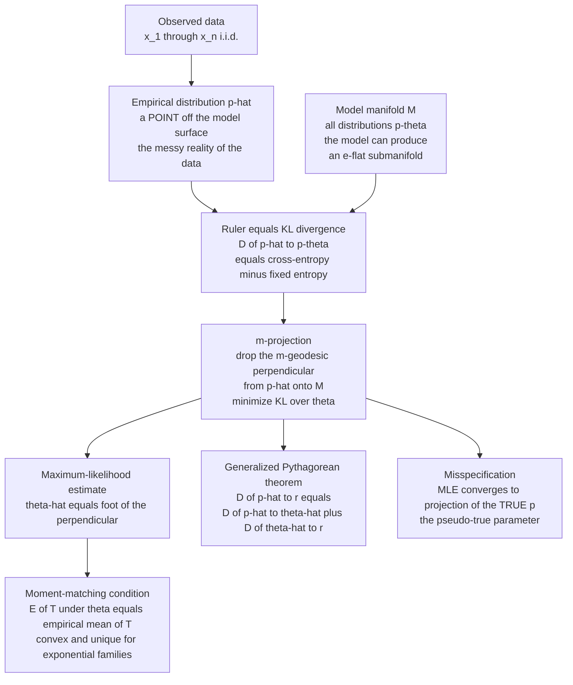

# 📐 Maximum Likelihood as Projection

> [!abstract] TL;DR
> **Maximum likelihood is not an algebra trick — it is a geometric projection.** Writing the average log-likelihood as $\frac1n\ell(\theta)=-H(\hat p)-D_{\mathrm{KL}}(\hat p\,\|\,p_\theta)$ shows that maximizing likelihood is *identical* to **minimizing the KL divergence from the empirical distribution $\hat p$ (the messy reality of your data) down to the model family** $\{p_\theta\}$. Geometrically the MLE is the **$m$-projection** (mixture-geodesic / information projection) of the data point $\hat p$ onto the model manifold $M$ — the foot of a KL-perpendicular dropped onto the surface. For an **exponential family** this projection has a stunningly simple closed condition: the MLE **matches moments**, $\mathbb{E}_{\theta}[T(X)]=\frac1n\sum_i T(x_i)$ — model expectation of the sufficient statistic equals its empirical mean — and because the negative log-likelihood is **convex** in the natural parameter, this projection is **unique**. The perpendicularity obeys a **generalized Pythagorean theorem** $D(\hat p\,\|\,r)=D(\hat p\,\|\,\hat\theta)+D(\hat\theta\,\|\,r)$ for any model point $r$. MLE ($m$-projection) and MaxEnt ($e$-projection) are **Legendre duals**. When the model is **misspecified**, the MLE still converges — to the projection of the *true* distribution onto the model, the **pseudo-true parameter** (White's sandwich). This is why every cross-entropy / negative-log-likelihood training loop in deep learning is, underneath, an information projection.

---

## Intuition

**Analogy — dropping a plumb line onto a curved surface.** Imagine your data live as a single point floating in the vast space of *all possible probability distributions*: this point is the **empirical distribution** $\hat p$, the raw tally of exactly what you observed, warts and all — every quirk, every outlier, perfectly and faithfully recorded. Your **model** — "Gaussian," "Poisson," "logistic" — cannot reach that point. A model is only a thin **surface** (a manifold) sitting inside that huge space: the collection of *every* distribution the model is able to produce as you turn its parameter dials. Fitting the model asks a purely geometric question: **of all the distributions on my model surface, which one sits closest to the data point $\hat p$?**

To answer "closest" you need a ruler, and the natural ruler between distributions is the **KL divergence**. Maximum likelihood — the workhorse behind essentially all of statistics and all of modern deep-learning training — turns out to be *exactly* this: **drop a perpendicular from the empirical point $\hat p$ straight down onto the model surface, measuring with KL, and the foot of that perpendicular is the MLE.** Fitting is not a formula to memorize; it is the act of finding the foot of a perpendicular on the manifold of models. The "perpendicular" here is a **mixture geodesic** ($m$-geodesic), which is why the operation is called an **$m$-projection** or **information projection**. For the friendliest, most common models — the exponential families — the foot of that perpendicular can be found by a single, beautifully simple rule: **make the model's average of the sufficient statistic equal the data's average.** Match the moments and you have found the projection.

---

## How It Works

### Core Mechanics

1. **The empirical distribution is the data-as-a-point.** From $n$ i.i.d. observations $x_1,\dots,x_n$ form $\hat p(x)=\frac1n\sum_{i=1}^n \delta(x-x_i)$: the distribution that puts mass $1/n$ on each sample. It is a *point* in the space of distributions, sitting off the model surface.
2. **Log-likelihood is (negative) cross-entropy.** Divide the log-likelihood by $n$:
$$
\frac1n\,\ell(\theta)=\frac1n\sum_{i=1}^n\log p_\theta(x_i)=\sum_x \hat p(x)\,\log p_\theta(x)=-H(\hat p,\,p_\theta),
$$
the negative **cross-entropy** between $\hat p$ and the model.
3. **Cross-entropy splits into entropy + KL.** Because $H(\hat p,p_\theta)=H(\hat p)+D_{\mathrm{KL}}(\hat p\,\|\,p_\theta)$,
$$
\boxed{\;\frac1n\,\ell(\theta)=-H(\hat p)-D_{\mathrm{KL}}(\hat p\,\|\,p_\theta)\;}
$$
The entropy $H(\hat p)$ does **not** depend on $\theta$. So **maximizing likelihood is exactly minimizing $D_{\mathrm{KL}}(\hat p\,\|\,p_\theta)$** — the KL divergence *from the data to the model*, empirical distribution as the first argument.
4. **That minimization is an $m$-projection.** Minimizing $D_{\mathrm{KL}}(\hat p\,\|\,p_\theta)$ over the model $M=\{p_\theta\}$ is, by definition, the **$m$-projection** of $\hat p$ onto $M$: the $m$-geodesic (mixture path) connecting $\hat p$ to the minimizer $p_{\hat\theta}$ meets the (e-flat) model manifold **orthogonally** in the dual geometry. The MLE $\hat\theta$ is the **foot of that KL-perpendicular**.
5. **Exponential families collapse the projection to moment matching.** For $p_\theta(x)=h(x)\exp\!\big(\theta^\top T(x)-\psi(\theta)\big)$, the score equation $\nabla_\theta\ell=0$ reads $\sum_i\big[T(x_i)-\nabla\psi(\theta)\big]=0$. Since $\nabla\psi(\theta)=\mathbb{E}_\theta[T(X)]$, the MLE satisfies the **$m$-projection condition**:
$$
\boxed{\;\mathbb{E}_{\hat\theta}\big[T(X)\big]=\frac1n\sum_{i=1}^n T(x_i)\;}
$$
The model's expected sufficient statistic equals the empirical mean — the estimator that **matches moments**.
6. **Convexity gives a unique foot.** The negative log-likelihood $-\ell(\theta)$ is **convex** in the natural parameter $\theta$ (its Hessian is $\nabla^2\psi=\mathrm{Cov}_\theta[T]=$ the Fisher information $\succeq 0$). So whenever the empirical mean $\frac1n\sum_i T(x_i)$ lies in the interior of the mean-parameter space, the $m$-projection **exists and is unique** — a single, well-defined foot of the perpendicular.
7. **The perpendicular obeys Pythagoras.** Because the model is e-flat and the projection is an $m$-projection, the **generalized Pythagorean theorem** holds exactly: for *any* model point $r=p_{\theta'}\in M$,
$$
D_{\mathrm{KL}}(\hat p\,\|\,r)=D_{\mathrm{KL}}(\hat p\,\|\,p_{\hat\theta})+D_{\mathrm{KL}}(p_{\hat\theta}\,\|\,r).
$$
The residual "distance to data" $D(\hat p\|p_{\hat\theta})$ is the shortest possible, and every other model point only adds on the extra leg $D(p_{\hat\theta}\|r)$.

This same decomposition is the machinery behind the *em* algorithm and Expectation-Maximization: alternate an $e$-projection (fill in latent variables) with an $m$-projection (re-fit parameters), each step a KL-perpendicular onto a manifold. See the sibling notes **The_Generalized_Pythagorean_Theorem** and **The_em_Algorithm_and_Information_Projection**.

### Flow / Architecture



---

## Key Concepts

### Secondary (intuition-level)

- **Data as a point, model as a surface.** All the observations, tallied exactly, form one point $\hat p$; the model is only a surface of the distributions it can make. Fitting = find the surface point nearest to the data point.
- **Likelihood measures closeness.** Making the data most probable under the model is the same as making the model closest to the empirical tally — "most likely" and "closest in KL" are two names for one thing.
- **Perpendicular, not any old line.** You do not connect the data point to just any model point; you drop a *perpendicular* (the shortest KL-path) onto the surface. Its foot is the estimate.
- **Match the average.** For the common models, the recipe is disarmingly simple: tune the dial until the model's average matches the data's average (fit the mean of a Gaussian to the sample mean, the rate of a Poisson to the sample rate).

### Undergraduate (needs probability + multivariable calculus)

- **Likelihood = negative cross-entropy = entropy + KL.** The identity $\frac1n\ell(\theta)=-H(\hat p)-D_{\mathrm{KL}}(\hat p\|p_\theta)$ is the whole story: since $H(\hat p)$ is constant in $\theta$, $\arg\max_\theta \ell(\theta)=\arg\min_\theta D_{\mathrm{KL}}(\hat p\|p_\theta)$.
- **Score equation = moment matching.** For an exponential family $\log p_\theta(x)=\theta^\top T(x)-\psi(\theta)+\log h(x)$, setting $\nabla_\theta\ell=\sum_i(T(x_i)-\nabla\psi(\theta))=0$ and using $\nabla\psi(\theta)=\mathbb{E}_\theta[T]$ gives $\mathbb{E}_{\hat\theta}[T]=\overline{T}$.
- **The log-partition is convex.** $\psi(\theta)=\log\int h(x)e^{\theta^\top T(x)}dx$ is convex (its Hessian is $\mathrm{Cov}_\theta[T]\succeq 0$), so $-\ell(\theta)$ is convex and the MLE is a global optimum — no bad local maxima for a full exponential family.
- **Concrete Gaussian check.** For $\mathcal N(\mu,\sigma^2)$ with known $\sigma$, $T(x)=x$, and $\mathbb{E}_\mu[X]=\mu$, so moment matching gives $\hat\mu=\bar x$ — the sample mean is literally the $m$-projection of the data onto the mean line.
- **Curved vs flat models.** A *full* (linear) exponential family is e-flat and the projection is unique and clean. A *curved* exponential family (a nonlinear submanifold, e.g. a constrained model) can have a projection that is only locally unique — Efron's curvature measures exactly this departure from flatness.

### Graduate (system-level)

- **Dual $e$-/$m$-projections.** In a dually-flat manifold, KL has two orthogonal projection operations. **MLE is the $m$-projection**: minimize $D(\hat p\|p_\theta)$ with the data fixed as the *first* argument, moving along an $m$-geodesic. **MaxEnt is the $e$-projection**: minimize $D(p\|p_0)$ with the free distribution as the *first* argument, moving along an $e$-geodesic. They are Legendre-dual operations; see **Kullback_Leibler_Divergence_and_Geometry** and the MaxEnt link below.
- **Projection theorem and uniqueness.** If $M$ is e-flat (a full exponential family), the $m$-projection of any $\hat p$ onto $M$ exists, is unique, and the $m$-geodesic from $\hat p$ to $p_{\hat\theta}$ is $g$-orthogonal to $M$ at the foot. The Pythagorean identity $D(\hat p\|r)=D(\hat p\|p_{\hat\theta})+D(p_{\hat\theta}\|r)$ certifies global optimality.
- **Asymptotics fall out of the geometry.** As $n\to\infty$, $\hat p\to p_{\theta_0}$ (Glivenko–Cantelli), so the foot of the perpendicular converges: $\hat\theta\to\theta_0$ (**consistency**). The curvature of the projection at $\theta_0$ is the Fisher information $I(\theta_0)$, and $\sqrt n(\hat\theta-\theta_0)\to\mathcal N(0,I(\theta_0)^{-1})$ — the MLE attains the Cramér–Rao bound, i.e. it is **asymptotically efficient**. See the sibling **Cramer_Rao_Bound_and_Efficiency** and the cross-vault Cramér–Rao note.
- **Misspecification and the pseudo-true parameter (White 1982).** If the truth $p^\*\notin M$, the MLE does not diverge — it converges to $\theta^\*=\arg\min_\theta D_{\mathrm{KL}}(p^\*\|p_\theta)$, the **$m$-projection of the truth onto the model**. Standard errors must use the **sandwich** estimator $A^{-1}BA^{-1}$ (Hessian $A$, score-covariance $B$), which collapses to $I^{-1}$ only when the model is correct ($A=B$, the information-matrix equality).
- **Cross-entropy training as information projection.** Minimizing the cross-entropy / negative-log-likelihood loss over a neural network's outputs is $\min_\theta D_{\mathrm{KL}}(\hat p\|p_\theta)$ up to the constant $H(\hat p)$: deep-learning fitting *is* an $m$-projection of the empirical data distribution onto the manifold the network can represent (a curved, non-flat manifold, hence non-convex and prone to local minima). See **Exponential_Families_and_Their_Geometry** and the AI-ML loss link.

---

## Python Demo

```python
# MLE = information projection, made concrete and visible.
# Model: Binomial(m=2, theta)  ->  support {0,1,2}, a 1-parameter EXPONENTIAL family
# with sufficient statistic T(x) = x and E_theta[X] = 2*theta.
# numpy + matplotlib only.
#
# We show three equivalent faces of the same geometric fact:
#   (a) maximizing log-likelihood  ==  MINIMIZING  KL(empirical || model)   over theta
#   (b) the minimizer is the MOMENT-MATCHING solution: E_theta[T] = empirical mean of T
#       => theta_MLE = xbar / 2      (the m-projection condition)
#   (c) the PROJECTION PICTURE: the empirical distribution is a point in the 2-simplex,
#       the model is a curve inside it, and the MLE is the foot of the KL-perpendicular.

import numpy as np
import matplotlib.pyplot as plt

rng = np.random.default_rng(7)

# ---- 1. generate data from a Binomial(2, theta_true) source ---------------------
theta_true, n = 0.62, 400
data = rng.binomial(2, theta_true, size=n)          # values in {0,1,2}
emp  = np.bincount(data, minlength=3) / n           # empirical pmf  [p0, p1, p2]
xbar = data.mean()                                  # empirical mean of T(x)=x

def model_pmf(th):
    """Binomial(2, th) pmf as a length-3 vector [P(0), P(1), P(2)]."""
    return np.array([(1 - th) ** 2, 2 * th * (1 - th), th ** 2])

def kl_emp_to_model(th):
    """KL( empirical || model(th) ) -- empirical is the FIRST argument (MLE direction)."""
    q = model_pmf(th)
    m = emp > 0                                     # 0 * log(0/.) = 0, skip empty bins
    return np.sum(emp[m] * np.log(emp[m] / q[m]))

def avg_loglik(th):
    """(1/n) * log-likelihood = sum_k emp[k] * log model[k] = -cross-entropy."""
    q = model_pmf(th)
    m = emp > 0
    return np.sum(emp[m] * np.log(q[m]))

# ---- 2. scan theta: locate the KL minimum and the likelihood maximum -------------
grid   = np.linspace(0.01, 0.99, 999)
kl_vals = np.array([kl_emp_to_model(t) for t in grid])
ll_vals = np.array([avg_loglik(t)      for t in grid])

theta_kl_min  = grid[np.argmin(kl_vals)]            # argmin KL
theta_ll_max  = grid[np.argmax(ll_vals)]            # argmax log-likelihood
theta_moment  = xbar / 2                            # moment-matching / closed-form MLE

print(f"theta_true                         = {theta_true:.4f}")
print(f"argmin_theta KL(emp || model)      = {theta_kl_min:.4f}")
print(f"argmax_theta avg log-likelihood    = {theta_ll_max:.4f}")
print(f"moment-matching MLE  xbar/2        = {theta_moment:.4f}")
print(f"--> all three coincide (up to grid resolution): MLE = m-projection")

# verify the m-projection / moment-matching condition E_theta[T] = empirical mean
E_T_at_mle = 2 * theta_moment
print(f"\nm-projection condition  E_theta[T] = {E_T_at_mle:.4f}  vs  xbar = {xbar:.4f}")

# ---- 3. Pythagorean check: D(emp||r) = D(emp||mle) + D(mle||r) for a model point r
def kl_model_to_model(th_p, th_q):
    p, q = model_pmf(th_p), model_pmf(th_q)
    return np.sum(p * np.log(p / q))
r = 0.80
lhs = kl_emp_to_model(r)
rhs = kl_emp_to_model(theta_moment) + kl_model_to_model(theta_moment, r)
print(f"\nGeneralized Pythagoras:  D(emp||r) = {lhs:.6f}"
      f"   D(emp||mle)+D(mle||r) = {rhs:.6f}   diff = {abs(lhs-rhs):.2e}")

# ================================ PLOTS ==========================================
fig, ax = plt.subplots(1, 3, figsize=(16.5, 5.2))

# (a) KL(emp || model) vs theta -- the projection distance, minimized at the MLE
ax[0].plot(grid, kl_vals, color="#1f77b4", lw=2.2, label="KL(empirical || model)")
ax[0].axvline(theta_moment, color="#d62728", ls="--", lw=1.8,
              label=f"MLE = xbar/2 = {theta_moment:.3f}")
ax[0].plot([theta_kl_min], [kl_vals.min()], "o", color="#d62728", ms=8)
ax[0].set_title("Maximizing likelihood = minimizing KL(empirical || model)")
ax[0].set_xlabel("model parameter theta"); ax[0].set_ylabel("KL divergence")
ax[0].legend(fontsize=9)

# (b) moment matching: E_theta[T] = 2*theta crosses the empirical mean at the MLE
ax[1].plot(grid, 2 * grid, color="#2ca02c", lw=2.2, label="E_theta[T] = 2*theta")
ax[1].axhline(xbar, color="#ff7f0e", ls="-", lw=1.8, label=f"empirical mean = {xbar:.3f}")
ax[1].axvline(theta_moment, color="#d62728", ls="--", lw=1.8, label=f"MLE = {theta_moment:.3f}")
ax[1].plot([theta_moment], [xbar], "o", color="#d62728", ms=8)
ax[1].set_title("m-projection condition: model moment = empirical moment")
ax[1].set_xlabel("model parameter theta"); ax[1].set_ylabel("E_theta[T]  and  empirical mean")
ax[1].legend(fontsize=9)

# (c) projection picture in the 2-simplex (triangle of pmfs over {0,1,2})
v0, v1, v2 = np.array([0, 0]), np.array([1, 0]), np.array([0.5, np.sqrt(3) / 2])
def to2d(p): return p[0] * v0 + p[1] * v1 + p[2] * v2
tri = np.array([to2d(np.eye(3)[k]) for k in range(3)] + [to2d(np.eye(3)[0])])
ax[2].plot(tri[:, 0], tri[:, 1], color="0.6", lw=1.2)                      # simplex edges
curve = np.array([to2d(model_pmf(t)) for t in grid])
ax[2].plot(curve[:, 0], curve[:, 1], color="#1f77b4", lw=2.4,
           label="model manifold: Binomial(2, theta)")
pe, pm = to2d(emp), to2d(model_pmf(theta_moment))
ax[2].plot([pe[0], pm[0]], [pe[1], pm[1]], color="#d62728", lw=2.2, ls="--",
           label="KL-perpendicular (m-projection)")
ax[2].plot(*pe, "o", color="#ff7f0e", ms=11, label="empirical distribution  p-hat")
ax[2].plot(*pm, "o", color="#d62728", ms=9,  label="MLE = foot of perpendicular")
for k, corner in zip(range(3), [v0, v1, v2]):
    ax[2].annotate(f"x={k}", corner, textcoords="offset points", xytext=(-6, -12))
ax[2].set_title("MLE is the m-projection of the data onto the model")
ax[2].set_aspect("equal"); ax[2].axis("off"); ax[2].legend(fontsize=8, loc="upper right")

plt.tight_layout()
plt.savefig("mle_as_projection.png", dpi=120)
plt.show()
```

**What the output shows.** The printout confirms the three faces of one fact land on the same number: the parameter that **minimizes** $D_{\mathrm{KL}}(\hat p\|p_\theta)$, the parameter that **maximizes** the log-likelihood, and the **moment-matching** value $\bar x/2$ all coincide (to grid resolution). The $m$-projection condition prints as $\mathbb{E}_\theta[T]=\bar x$ exactly. The Pythagorean check returns a residual $\sim10^{-16}$ — for any other model point $r$, the KL from the data splits *exactly* into "data-to-MLE" plus "MLE-to-$r$," certifying the MLE as the true foot of the perpendicular. The three panels make it visual: **(left)** the KL curve is a convex bowl bottoming out precisely at the red MLE line; **(middle)** the moment line $\mathbb{E}_\theta[T]=2\theta$ crosses the empirical-mean line exactly at the MLE; **(right)** the killer picture — the model is a curve threaded through the triangle of all pmfs over $\{0,1,2\}$, the orange dot is the empirical distribution floating *off* the curve, and the dashed red segment is the KL-perpendicular dropping it onto its foot, the MLE. That is maximum likelihood, drawn as geometry.

---

## Real-World Applications

> **Every deep-learning classifier trained with cross-entropy.** Minimizing categorical cross-entropy / negative-log-likelihood over a network's softmax outputs is literally $\min_\theta D_{\mathrm{KL}}(\hat p\|p_\theta)+H(\hat p)$ — an $m$-projection of the empirical label distribution onto the manifold of distributions the network can represent. The manifold is *curved* (non-flat), which is exactly why the projection is non-convex and gradient descent can stall in local minima. See [[Loss_Functions]] and [[Logistic_Regression]].

> **Generalized linear models and logistic regression.** Fitting a logistic, Poisson, or Gamma GLM is exponential-family MLE, so IRLS (iteratively reweighted least squares) is solving the moment-matching equation $\mathbb{E}_\theta[T]=\overline{T}$ — the model's fitted means are driven to match the sufficient statistics of the data. Convexity of the log-partition guarantees a unique global fit. See [[Statistical_Inference]] and [[Maximum_Likelihood_Estimation]].

> **Maximum-entropy language and vision models.** MaxEnt / log-linear models (the historical backbone of NLP taggers and modern energy-based models) are trained by the *dual* of MLE: the MaxEnt distribution subject to moment constraints is the $e$-projection, and its parameters are found by the same moment-matching MLE. Feature expectations under the model are pushed to equal empirical feature counts. See [[Maximum_Entropy_and_Exponential_Families]].

> **Robust econometrics under misspecification.** No economic model is exactly true, so applied work relies on quasi-MLE: the estimator converges to the pseudo-true parameter (the $m$-projection of reality onto the model) and inference uses White's heteroskedasticity-robust **sandwich** standard errors. The geometry tells you *what* your estimator is estimating when the model is wrong — the closest-in-KL member of the family. See [[Maximum_Likelihood_Estimation]].

> **Information-theoretic estimation and coding.** Because likelihood is negative cross-entropy, MLE is equivalently the model that gives the *shortest codelength* for the data (up to $H(\hat p)$), tying maximum likelihood directly to the minimum-description-length view of inference. See [[Maximum_Likelihood_and_Information]] and [[Fisher_Information_and_the_Cramer_Rao_Bound]].

---

## Common Pitfalls

- **Confusing the empirical distribution with the true one.** MLE projects the *empirical* $\hat p$, not the truth $p^\*$. For finite $n$ the foot of the perpendicular sits at a noisy point; overfitting is exactly "projecting onto a manifold flexible enough to hug $\hat p$'s sampling noise." The consistency guarantee is only asymptotic — $\hat p\to p^\*$ as $n\to\infty$ pulls the projection toward the true parameter, but small samples project onto a jittered target.
- **Projecting onto a curved model and expecting flat-model guarantees.** Full (linear) exponential families are e-flat: the $m$-projection is unique and convex. A **curved** exponential family — or a neural network — is a nonlinear submanifold, so the projection can have **multiple local feet** (local maxima of the likelihood). Efron's statistical curvature quantifies exactly how far a model departs from flatness and thus how badly the clean uniqueness/efficiency story degrades.
- **Assuming a unique maximum always exists.** For a full exponential family the MLE exists and is unique **only when the empirical mean of $T$ lies in the interior of the mean-parameter space**. Boundary data (e.g. perfectly separable data in logistic regression, or all-successes for a Bernoulli) push the natural parameter to $\pm\infty$ — the projection "runs off the edge" of the manifold and the MLE does not exist. This is a real modeling failure, not a numerical glitch.
- **Getting the KL direction backwards.** MLE minimizes $D(\hat p\|p_\theta)$ — empirical **first**, model second (the $m$-projection, mean-seeking / moment-matching). Minimizing the reverse, $D(p_\theta\|\hat p)$, is a different, mode-seeking problem (closer to variational inference), with a different solution. Swapping the arguments silently changes the estimator.
- **Ignoring misspecification when reporting uncertainty.** If the model is wrong, the naive Fisher-information standard errors $I^{-1}$ are invalid because the information-matrix equality $A=B$ fails. You must use the sandwich $A^{-1}BA^{-1}$. Treating the MLE as efficient under a misspecified model reports confidence intervals that are simply the wrong width.

---

## Related Concepts

*Cross-vault connections (Glob-verified):*
- [[Exponential_Families_and_Their_Geometry]] — the e-flat manifolds onto which MLE projects; the log-partition $\psi$ is the convex potential whose gradient gives the moment-matching condition $\nabla\psi(\theta)=\mathbb{E}_\theta[T]$.
- [[Divergences_as_Geometric_Structure]] — KL is the ruler for the projection; this note explains why KL, not Euclidean distance, is the natural yardstick between distributions.
- [[Dually_Flat_Spaces]] — the arena where $m$- and $e$-projections are Legendre-dual operations and the generalized Pythagorean theorem holds; MLE lives on the $m$-side.
- [[The_Fisher_Information_Metric]] — the local quadratic form of KL at the foot of the perpendicular; it is the curvature of the projection and sets the asymptotic variance $I^{-1}$ of the MLE.
- [[Statistical_Manifolds]] — the manifold-of-distributions viewpoint that turns "fitting" into "projecting a point onto a submanifold."
- [[Information_Geometry_Overview]] — the map of how metric, dual connections, divergence, and projection fit together, of which MLE-as-projection is the headline inference application.
- [[Maximum_Likelihood_and_Information]] — the information-theoretic reading: likelihood as negative cross-entropy / codelength, the same identity that powers the projection.
- [[Fisher_Information_and_the_Cramer_Rao_Bound]] — the efficiency bound the MLE attains asymptotically because the projection's curvature is the Fisher information.
- [[Statistical_Inference]] — the classical estimation context: consistency, sufficiency, and the score equations that here become moment matching.
- [[Maximum_Likelihood_Estimation]] — the econometric treatment, including quasi-MLE and sandwich covariance under misspecification (the projection of the truth onto the model).
- [[Maximum_Entropy_and_Exponential_Families]] — the Legendre-dual operation: MaxEnt is the $e$-projection, MLE is the $m$-projection, and the two meet at the same moment-matching parameter.
- [[Loss_Functions]] — cross-entropy / negative-log-likelihood training loss *is* $D_{\mathrm{KL}}(\hat p\|p_\theta)$ up to a constant; deep-learning fitting is an $m$-projection onto a curved manifold.
- [[Logistic_Regression]] — a canonical exponential-family MLE solved by moment matching (IRLS); a clean, convex instance of the projection.

*Future siblings in this vault (Information Geometry, `04_Statistical_Inference` — prose references, not yet written): **The_Generalized_Pythagorean_Theorem** (the right-angle law that certifies the foot of the perpendicular); **The_em_Algorithm_and_Information_Projection** (alternating $e$- and $m$-projections between data and model manifolds); **Cramer_Rao_Bound_and_Efficiency** (the asymptotic variance from the projection's curvature); **Kullback_Leibler_Divergence_and_Geometry** (the ruler and its dual $e$-/$m$-structure); and **Exponential_Families_and_Their_Geometry** (the flat model surfaces that make the projection convex and unique).*

---

## Review Questions

1. **(Secondary)** Using the "drop a plumb line onto a curved surface" analogy, explain why fitting a model by maximum likelihood is a *geometric* act rather than an algebra trick. What plays the role of the point, the surface, and the ruler, and where is the estimate?
2. **(Undergraduate)** Starting from $\frac1n\ell(\theta)=\sum_x\hat p(x)\log p_\theta(x)$, derive the identity $\frac1n\ell(\theta)=-H(\hat p)-D_{\mathrm{KL}}(\hat p\|p_\theta)$ and use it to argue that MLE minimizes KL from the data to the model. Then, for a Poisson family $p_\lambda(k)=e^{-\lambda}\lambda^k/k!$, show that the MLE is the sample mean and state the moment-matching condition it satisfies.
3. **(Graduate)** A model family $M$ is misspecified: the true distribution $p^\*\notin M$. Explain, in the language of $m$-projection and the generalized Pythagorean theorem, *what* the MLE converges to and why. State the pseudo-true parameter as an optimization problem, explain why the naive Fisher-information standard errors are wrong, and give the correct sandwich form. Finally, contrast the MLE ($m$-projection) with the MaxEnt solution ($e$-projection) and explain in what sense they are dual.

---

## Sources

- Amari, S. & Nagaoka, H. (2000). *Methods of Information Geometry.* AMS / Oxford University Press. (Chapters 3–4: $e$-/$m$-projections, the projection theorem, MLE as $m$-projection onto exponential families.)
- Csiszár, I. & Shields, P. (2004). *Information Theory and Statistics: A Tutorial.* Foundations and Trends in Communications and Information Theory, 1(4), 417–528. (Information projections, the Pythagorean identity, MLE and MaxEnt as dual projections.)
- Efron, B. (1975). *Defining the Curvature of a Statistical Problem (with Applications to Second Order Efficiency).* The Annals of Statistics, 3(6), 1189–1242. (Statistical curvature; flat vs curved exponential families and the limits of the projection story.)
- Barndorff-Nielsen, O. (1978). *Information and Exponential Families in Statistical Theory.* Wiley. (Exponential families, the log-partition function, and the moment-matching / mean-value parametrization underlying the MLE.)
- White, H. (1982). *Maximum Likelihood Estimation of Misspecified Models.* Econometrica, 50(1), 1–25. (Pseudo-true parameter as the KL projection of the truth; the sandwich covariance estimator.)

---

#information-geometry #maximum-likelihood #information-projection #kl-divergence #moment-matching
