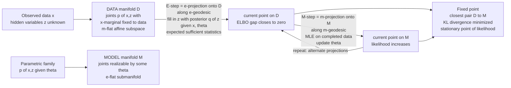

# 🕺 The em Algorithm and Information Projection

> [!abstract] TL;DR
> Amari's **em algorithm** is the geometric X-ray of the classical **EM algorithm** — the workhorse for fitting models with hidden variables. It reveals EM as **alternating projection** between two manifolds of distributions: a **data manifold** $D$ (every joint whose observed marginal matches your data) and a **model manifold** $M$ (your parametric family). The **E-step is an e-projection onto $D$** (fill in the hidden variables with the current posterior — the expected sufficient statistics); the **M-step is an m-projection onto $M$** (re-fit the parameters by maximum likelihood). Each half-step is a **KL-minimizing information projection**, each strictly cannot make things worse, and the two together climb a lower bound — the **ELBO / negative variational free energy** (Neal–Hinton) — guaranteeing the observed log-likelihood **never decreases**. It is the same "alternating minimization" studied by Csiszár–Tusnády, and its right triangles obey the generalized Pythagorean theorem of a dually flat space.

---

## Intuition

**Analogy — two people meeting in a foggy park, each stuck on their own path.** Two friends want to meet but the fog is thick and each can only walk along their *own* winding trail — trail $D$ and trail $M$ — that never touch. So they take turns. She looks across the fog, spots the point on *his* trail that is nearest to where she stands, and calls it out; he walks there. Now *he* looks and finds the point on *her* trail nearest to his new position; she walks there. Back and forth they go, each step a perpendicular dropped onto the other's path, and with every step the gap between them shrinks. They spiral inward until they are standing at the **closest pair of points** between the two trails — as close as the geometry allows.

The **EM algorithm is exactly this dance**, and information geometry supplies the missing picture. The two trails are the **data manifold** $D$ and the **model manifold** $M$; "distance" is the **Kullback–Leibler divergence**; and "drop a perpendicular to the nearest point" is an **information projection**. The E-step and M-step are the two friends taking turns, and where they finally meet is the maximum-likelihood fit.

---

## How It Works

### Core Mechanics

The setup lives in the space of *joint* distributions $p(x, z)$ over an observed variable $x$ and a hidden variable $z$.

1. **The data manifold $D$.** These are all joints whose **$x$-marginal equals the observed data distribution** $q_{\text{data}}(x)$, with the hidden part left completely free: $D = \{\, p(x,z) : \sum_z p(x,z) = q_{\text{data}}(x)\,\}$. Fixing a marginal is a *linear* constraint on probabilities, so $D$ is an **m-flat (mixture-flat) affine subspace** — straight under the mixture ($m$-) connection.

2. **The model manifold $M$.** These are the joints your parametric family can actually produce: $M = \{\, p(x,z\,;\theta) : \theta \in \Theta \,\}$. For a latent exponential-family model this is (locally) an **e-flat submanifold** — straight under the exponential ($e$-) connection.

3. **E-step = e-projection onto $D$.** From the current model point $p_{\theta^{(t)}}$, find the nearest point *in $D$* along an **$e$-geodesic**. The answer is $q^{(t)}(x,z) = q_{\text{data}}(x)\, p(z \mid x;\theta^{(t)})$ — you keep the empirical marginal and **fill in the hidden $z$ with the current posterior**. Concretely this is computing **responsibilities / expected sufficient statistics** — exactly the classical E-step. It minimizes $\mathrm{KL}(q \,\|\, p_{\theta^{(t)}})$ over $q \in D$.

4. **M-step = m-projection onto $M$.** From that filled-in point $q^{(t)}$, find the nearest point *in $M$* along an **$m$-geodesic**. The answer maximizes the expected complete-data log-likelihood over $\theta$ — an ordinary **MLE on the completed data**, the classical M-step. It minimizes $\mathrm{KL}(q^{(t)} \,\|\, p_{\theta})$ over $\theta$.

5. **Alternate to a fixed point.** Repeat e-projection, m-projection, e-projection, ... The iterates spiral toward the **closest pair** of points between $D$ and $M$; the fixed point is a **stationary point of the observed-data likelihood**.

6. **The free-energy / ELBO view (Neal–Hinton).** Define the functional
$$
\mathcal{F}(q,\theta) \;=\; \mathbb{E}_{q}\!\big[\log p(x,z;\theta)\big] + H(q) \;=\; \log p(x;\theta) \;-\; \mathrm{KL}\!\big(q(z) \,\|\, p(z\mid x;\theta)\big) \;\le\; \log p(x;\theta).
$$
This is the **ELBO**, the negative variational free energy. **EM is coordinate ascent on $\mathcal{F}$:** the E-step maximizes over $q$ (setting $q = $ posterior, driving the KL gap to **zero** so $\mathcal{F}$ *touches* the log-likelihood), and the M-step maximizes over $\theta$. Because the E-step leaves $\mathcal{F}$ equal to the current log-likelihood, whatever the M-step gains in $\mathcal{F}$ is a **guaranteed gain in the true log-likelihood** — the celebrated **monotone likelihood increase**.

7. **em vs EM.** Amari's **em** performs *exact* KL projections. The classical **EM** M-step maximizes the *expected complete-data log-likelihood* — which equals the exact m-projection **when $M$ is e-flat** (a genuine exponential family). For general *curved* models the two can differ slightly; both still ascend the likelihood.

### Flow / Architecture



---

## Key Concepts

### 🟢 Secondary — the meeting-in-the-fog picture

- **Two paths that never touch.** The data you saw defines one path (the **data manifold**); the models you allow define another (the **model manifold**). EM finds the closest pair of points between them.
- **Take turns dropping perpendiculars.** Each step jumps to the nearest point on the *other* path. That "nearest point" is measured by an information distance (KL), not ordinary distance.
- **You can only get better.** Every step brings the two paths closer, so the fit **never gets worse** — that monotone guarantee is why EM is so trusted.

### 🟡 Undergraduate — E-step, M-step, and the ELBO

- **Hidden variables.** In a mixture, each data point secretly belongs to a component ($z$); in an HMM, a hidden state chain; in missing-data problems, the unseen entries. EM handles the case where you cannot see $z$.
- **E-step (expectation).** Compute the **posterior** $p(z\mid x;\theta)$ — the "responsibilities" — and with it the **expected sufficient statistics**. Geometrically this is projecting onto the data manifold $D$.
- **M-step (maximization).** Pretend the expected statistics are real data and do ordinary **maximum likelihood** to update $\theta$. Geometrically this is projecting onto the model manifold $M$.
- **The ELBO.** $\mathcal{F}(q,\theta) = \log p(x;\theta) - \mathrm{KL}(q \,\|\, \text{posterior})$ is a **lower bound** on the log-likelihood. EM alternately maximizes it in $q$ (gap $\to 0$) and in $\theta$ — a minorize-maximize scheme that connects EM to [[Variational_Inference_the_ELBO_and_VAEs|variational inference]].

### 🔴 Graduate — projections, duality, and convergence

- **Dual projections in a dually flat space.** $D$ is m-flat and $M$ is e-flat. The **e-projection onto the m-flat $D$** minimizes $\mathrm{KL}(q\,\|\,p_\theta)$ over $q$; the **m-projection onto the e-flat $M$** minimizes $\mathrm{KL}(q\,\|\,p_\theta)$ over $\theta$. Each projection is **unique** when it targets a flat submanifold — a direct consequence of the generalized Pythagorean theorem.
- **Alternating minimization (Csiszár–Tusnády).** em is the information-geometric instance of alternating minimization of a single divergence $D(\cdot\,\|\,\cdot)$ over two convex sets of distributions; their five-point / three-point lemmas give convergence of the divergence to its infimum.
- **Monotonicity via the Pythagorean decomposition.** Writing $\log p(x;\theta^{(t+1)}) - \log p(x;\theta^{(t)}) = [\mathcal{F} \text{ gain}] + \mathrm{KL}\text{ gap} \ge 0$ makes the guarantee a right-triangle identity, not an inequality pulled from a hat.
- **Curved models and em ≠ EM.** When $M$ is a *curved* exponential family, the exact m-projection (em) and the expected-complete-log-likelihood maximizer (EM) need not coincide; Amari showed they agree exactly when $M$ is e-flat.
- **Fixed points are stationary, not global.** The algorithm converges to a **stationary point** of the likelihood (local max, saddle, or ridge), never guaranteed global — the price of a non-convex likelihood surface.

---

## Python Demo

We fit a **2-component 1-D Gaussian mixture** with EM and expose its geometry. Part **(a)** shows the fitted mixture snapping onto the data. Part **(b)** is the payoff: we track the **observed log-likelihood** $L(\theta)$ (which climbs **monotonically**) together with the **ELBO / negative free energy** $\mathcal{F}(q,\theta)$ recorded after *every half-step*. The ELBO **touches the likelihood curve after each E-step** (the KL gap closes — the e-projection) and then sits strictly **below** it after each M-step (the gap re-opens as $\theta$ moves — the m-projection). That sawtooth *is* Amari's alternating e-/m-projection, drawn.

```python
import numpy as np
import matplotlib.pyplot as plt

rng = np.random.default_rng(0)

# ---- (0) Data from a 2-component 1-D Gaussian mixture; z is HIDDEN ----------
true_mu, true_sigma, true_pi = np.array([-2.0, 3.0]), np.array([0.8, 1.3]), np.array([0.4, 0.6])
N = 600
z = rng.random(N) < true_pi[0]                      # latent label (unobserved)
x = np.where(z, rng.normal(true_mu[0], true_sigma[0], N),
                rng.normal(true_mu[1], true_sigma[1], N))

def gauss(x, mu, sig):
    return np.exp(-0.5 * ((x - mu) / sig) ** 2) / (np.sqrt(2 * np.pi) * sig)

def log_likelihood(x, pi, mu, sig):                # observed-data log-likelihood L(theta)
    comp = pi[None, :] * gauss(x[:, None], mu[None, :], sig[None, :])   # N x K
    return np.sum(np.log(comp.sum(axis=1)))

def responsibilities(x, pi, mu, sig):              # E-STEP: posterior q(z|x) = e-projection onto D
    comp = pi[None, :] * gauss(x[:, None], mu[None, :], sig[None, :])
    return comp / comp.sum(axis=1, keepdims=True)

def elbo(x, r, pi, mu, sig):                       # F(q, theta) = negative variational free energy
    comp = pi[None, :] * gauss(x[:, None], mu[None, :], sig[None, :])   # = pi_k * N_k
    eps = 1e-300
    return np.sum(r * (np.log(comp + eps) - np.log(r + eps)))

# ---- (1) EM = alternate e-projection (E) and m-projection (M) ---------------
pi, mu, sig = np.array([0.5, 0.5]), np.array([-0.5, 0.5]), np.array([2.0, 2.0])  # mediocre init
n_iter = 25

ll_trace = [log_likelihood(x, pi, mu, sig)]        # L(theta) at integer iterations
ex, ey = [], []                                    # ELBO points after each half-step
for it in range(n_iter):
    # E-STEP -- e-projection onto DATA manifold: gap KL(q||posterior) -> 0, so ELBO == L(theta_it)
    r = responsibilities(x, pi, mu, sig)
    ex.append(it);     ey.append(elbo(x, r, pi, mu, sig))          # lands ON the likelihood curve
    # M-STEP -- m-projection onto MODEL manifold: MLE with completed data (closed form for a GMM)
    Nk  = r.sum(axis=0)
    pi  = Nk / N
    mu  = (r * x[:, None]).sum(axis=0) / Nk
    sig = np.sqrt((r * (x[:, None] - mu[None, :]) ** 2).sum(axis=0) / Nk)
    ex.append(it + 1); ey.append(elbo(x, r, pi, mu, sig))          # gap re-opens: ELBO < L(theta_{it+1})
    ll_trace.append(log_likelihood(x, pi, mu, sig))

print("min per-iteration log-likelihood increment:", np.diff(ll_trace).min(), "(guarantee: >= 0)")
print("fitted means:", np.round(np.sort(mu), 3), " true:", np.round(np.sort(true_mu), 3))

# ---- (2) Plots -------------------------------------------------------------
fig, (axA, axB) = plt.subplots(1, 2, figsize=(13, 5.2))

grid = np.linspace(x.min() - 1, x.max() + 1, 400)
axA.hist(x, bins=40, density=True, color="#cbd5e1", edgecolor="white", label="data")
for k in range(2):
    axA.plot(grid, pi[k] * gauss(grid, mu[k], sig[k]), lw=1.8, ls="--", label=f"component {k + 1}")
axA.plot(grid, sum(pi[k] * gauss(grid, mu[k], sig[k]) for k in range(2)),
         color="#dc2626", lw=2.6, label="fitted mixture")
axA.set_title("(a) EM fit of a 2-component Gaussian mixture")
axA.set_xlabel("x"); axA.set_ylabel("density"); axA.legend(fontsize=8)

axB.plot(range(len(ll_trace)), ll_trace, "o-", color="#111827", lw=2,
         label="log-likelihood  L(theta)  -- monotone up")
axB.plot(ex, ey, ".-", color="#2563eb", lw=1, ms=7, alpha=0.85,
         label="ELBO  F(q, theta)  -- touches L after each E-step")
axB.set_title("(b) Alternating projection: ELBO <= L, gap = KL(q || posterior)")
axB.set_xlabel("iteration"); axB.set_ylabel("nats"); axB.legend(fontsize=8)

plt.tight_layout()
plt.savefig("em_alternating_projection.png", dpi=120)
print("Saved em_alternating_projection.png")
```

Reading the output: the printed **minimum increment is `>= 0`** (up to floating point) — the monotone-likelihood guarantee holds every single iteration — and the fitted means recover the true $(-2, 3)$. In panel **(b)** the black log-likelihood curve rises smoothly and never dips; the blue ELBO **kisses the curve after each E-step** (the e-projection zeroes the KL gap) and drops just below after each M-step (the m-projection moves $\theta$, re-opening the gap). The vertical distance between the two curves *is* $\mathrm{KL}\big(q \,\|\, p(z\mid x;\theta)\big)$ — the very quantity each projection is minimizing. Panel **(a)** shows the two Gaussians and their mixture converged onto the data.

---

## Real-World Applications

- **Gaussian mixture clustering.** The canonical use: soft-assign points to components (E) then re-estimate means/covariances/weights (M). A probabilistic generalization of [[KMeans|k-means]] (which is EM's "hard-assignment" limit as component variances shrink to zero).
- **Hidden Markov Models (Baum–Welch).** The forward–backward E-step computes expected state occupancies and transitions; the M-step re-estimates transition and emission probabilities. This is the backbone of classical **speech recognition** acoustic models — see [[HMM_GMM_ASR]].
- **Missing-data / incomplete-data problems.** The original Dempster–Laird–Rubin motivation: impute the *expected* contribution of missing entries (E), then fit as if complete (M) — used across biostatistics, survey analysis, and censored-data survival models.
- **Topic models and latent factors.** Probabilistic latent semantic analysis (pLSA) and factor-analysis / probabilistic PCA are fit by EM; the E-step infers latent topics/factors, the M-step re-fits loadings.
- **Variational autoencoders as amortized EM.** A [[Variational_Autoencoders|VAE]] is a variational-EM where the exact posterior is intractable: an encoder network approximates the E-step and gradient ascent on the ELBO plays the M-step — the same free-energy ascent, now with a *residual* KL gap (see [[Variational_Inference_as_Free_Energy_Minimization]]).
- **Mixture-of-experts and robust regression.** Gating responsibilities (E) and per-expert weighted least squares (M); the same pattern fits heavy-tailed / $t$-distribution regressions via latent scale variables.

---

## Common Pitfalls

- **Local optima, not global.** EM only guarantees convergence to a **stationary point**. Different runs from different seeds can land on very different fits. Mitigate with **multiple restarts** and keep the best final log-likelihood — never the first run.
- **Initialization sensitivity.** A poor start can converge to a useless or degenerate solution. Seeding GMM means with **k-means++** (rather than random) is standard practice precisely because EM inherits the non-convexity.
- **Variance collapse / singularities.** In a GMM a component can latch onto a single point, driving its variance $\sigma \to 0$ and the likelihood $\to \infty$ — a **spurious singularity**, not a real optimum. Guard with a variance floor or a small prior (MAP-EM / regularized covariances).
- **Label switching.** Components are exchangeable, so the *labels* $1$ and $2$ are not identifiable. Across runs or MCMC chains the same fit appears with permuted labels — never average parameters across runs without first **aligning components**.
- **The em (Amari) vs EM (Dempster) subtlety.** The M-step maximizes the *expected complete-data log-likelihood*, which equals the exact **m-projection only when the model $M$ is e-flat**. For a **curved** exponential family the two can differ; do not assume "M-step = exact KL projection" universally.
- **The residual ELBO gap (variational EM).** When the exact posterior is intractable you optimize an *approximate* $q$, so the E-step no longer closes the KL gap to zero. You then maximize the ELBO, a **lower bound** — the true log-likelihood may not be monotone, and the fit is biased by the approximation family.
- **Slow convergence on ridges.** Near flat, elongated likelihood ridges (highly overlapping components, weakly separated states) EM crawls, taking many iterations for tiny gains. Consider acceleration (Aitken, quasi-Newton, or SQUAREM) rather than waiting out the plateau.

---

## Related Concepts

- [[Dually_Flat_Spaces]] — the arena where em lives: the data manifold is m-flat, the model manifold is e-flat, and their orthogonal projections are unique here.
- [[Exponential_Families_and_Their_Geometry]] — when the model is a genuine exponential family, the M-step's expected-statistic matching *is* the exact m-projection, and em coincides with EM.
- [[Bregman_Divergences]] — the KL divergence being minimized at each projection is the canonical Bregman divergence of the log-partition potential; alternating minimization is Bregman-geometric.
- [[Divergences_as_Geometric_Structure]] — supplies the "distance" that each information projection minimizes and its infinitesimal link to the Fisher metric.
- [[Relative_Entropy_and_Cross_Entropy]] — the E-step gap is exactly $\mathrm{KL}(q \,\|\, \text{posterior})$; understanding KL's asymmetry explains why e- and m-projections differ.
- [[Variational_Inference_as_Free_Energy_Minimization]] — recasts the whole algorithm as ascent on the negative free energy; variational EM is the intractable-posterior generalization.
- [[Variational_Inference_the_ELBO_and_VAEs]] — the ELBO derived here is the same bound VAEs maximize; amortized inference replaces the exact E-step.
- [[Maximum_Likelihood_and_Information]] — the fixed point of em is a stationary point of the likelihood; MLE as information projection is the m-step's single-manifold special case.
- [[Variational_Autoencoders]] — a deep-learning instance of variational EM, with an encoder standing in for the E-step.
- [[KMeans]] — the hard-assignment, equal-spherical-variance limit of GMM-EM, a useful sanity anchor.

*Sibling notes in this vault (in prose; forthcoming or elsewhere): **The Generalized Pythagorean Theorem** supplies the right-triangle identity that makes each projection unique and the likelihood increase exact; **Maximum Likelihood as Projection** develops the single-manifold m-projection that the M-step generalizes; **Variational Inference and Geometry** extends the free-energy view to intractable posteriors; **Kullback–Leibler Divergence and Geometry** is the divergence every step minimizes; and **Dual Affine Connections** define the $e$- and $m$-geodesics along which the two projections travel.*

---

## Review Questions

### 🟢 Secondary
1. Using the "two friends meeting in the fog" analogy, explain what the data manifold and the model manifold are, and why taking turns dropping perpendiculars can only bring the two closer (never further apart).

### 🟡 Undergraduate
2. In fitting a Gaussian mixture, state precisely what the E-step computes and what the M-step computes. Which quantity is the "hidden" information you never directly observe, and how does the E-step deal with it?
3. Write the ELBO $\mathcal{F}(q,\theta) = \log p(x;\theta) - \mathrm{KL}(q \,\|\, p(z\mid x;\theta))$ and use it to argue why the observed log-likelihood can never decrease across a full EM iteration.

### 🔴 Graduate
4. Identify $D$ as m-flat and $M$ as e-flat, and explain why the E-step is an e-projection onto $D$ while the M-step is an m-projection onto $M$. Which direction of KL does each minimize, and why does flatness of the target guarantee a unique projection?
5. Under what condition on the model manifold do Amari's **em** and Dempster's **EM** produce identical updates, and how can they diverge for a curved exponential family? Separately, explain how the guarantee changes when the exact posterior is intractable and you run *variational* EM.

---

## Sources

- Amari, S. (1995). ["Information Geometry of the EM and em Algorithms for Neural Networks."](https://www.sciencedirect.com/science/article/abs/pii/0893608095000038) *Neural Networks*, 8(9), 1379–1408. — the paper that names and formalizes the em algorithm.
- Dempster, A. P., Laird, N. M., & Rubin, D. B. (1977). ["Maximum Likelihood from Incomplete Data via the EM Algorithm."](https://www.jstor.org/stable/2984875) *Journal of the Royal Statistical Society, Series B*, 39(1), 1–38. — the original EM.
- Csiszár, I., & Tusnády, G. (1984). "Information Geometry and Alternating Minimization Procedures." *Statistics & Decisions*, Supplement Issue 1, 205–237. — em as alternating minimization of a divergence.
- Neal, R. M., & Hinton, G. E. (1998). ["A View of the EM Algorithm that Justifies Incremental, Sparse, and Other Variants."](https://www.cs.toronto.edu/~radford/ftp/emk.pdf) In *Learning in Graphical Models* (M. I. Jordan, ed.), 355–368. — the free-energy / ELBO coordinate-ascent view.
- Amari, S., & Nagaoka, H. (2000). *Methods of Information Geometry*. AMS/Oxford, ch. 8. — dually flat projections applied to EM and estimation.

---

#information-geometry #em-algorithm #alternating-projection #latent-variables #information-projection
