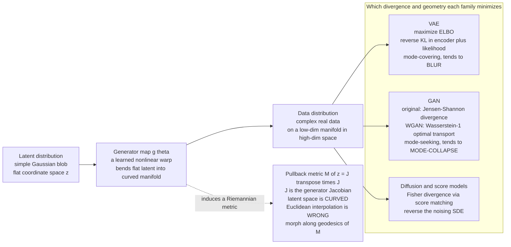

# 🌀 Geometry of Generative Models

> [!abstract] TL;DR
> A modern **generative model** — a VAE, a GAN, a diffusion model — is fundamentally a **map**: it takes a *simple* latent distribution (a featureless Gaussian blob of random numbers) and **warps** it into the *impossibly complex* distribution of real faces, molecules, or audio. Two pieces of geometry govern everything. **First**, the generator $g:\mathcal Z\to\mathcal X$ bends the flat latent space into the curved, low-dimensional **data manifold** embedded in high-dimensional space; the generator's Jacobian induces a **pullback (Riemannian) metric** $M(z)=J_g(z)^\top J_g(z)$ on latent space, so *latent-space distance is not data-space distance* — Euclidean interpolation between two latent codes is the **wrong** notion of "in-between," and the right one follows a **geodesic of the pullback metric** (Arvanitidis et al.'s *Latent Space Oddity*). **Second**, each model family is defined by *which divergence* it drives to zero between the generated and true data distributions: **VAEs** minimize a (reverse-)**KL**-based ELBO, **GANs** originally minimize the **Jensen–Shannon** divergence (and **Wasserstein GAN** swaps it for **optimal-transport** $W_1$ geometry), and **diffusion / score-based** models minimize a **Fisher divergence** via score matching. The choice of divergence is not cosmetic: it decides whether your model blurs, drops modes, or covers the data — it *is* the geometry of the failure mode.

---

## Intuition

**Analogy — warping a flat rubber sheet onto a crumpled landscape.** Imagine a perfectly flat, gridded rubber sheet: that is **latent space**, home to a boring cloud of Gaussian random numbers. The generator is a machine that grabs this sheet and stretches, folds, and drapes it over a rugged mountain landscape — the **data manifold**, the thin surface in a huge pixel space where real images actually live. Generating a sample is nothing more than picking a dot on the flat sheet and reading off where it landed on the mountains.

Now two things follow that make generative geometry *inevitable*. **(1) Distances lie.** Two dots that sit close together on the flat sheet can land on *opposite sides of a ridge* once draped — the straight "as the crow flies" latent distance badly misrepresents how far apart the generated images truly are. To measure real closeness you must measure *along the draped surface*, and the object that tells you how much the sheet was stretched at each point is the **pullback metric** $J^\top J$. **(2) Straight lines bend.** Walk in a straight line across the flat sheet — a naive "morph" between two faces — and on the mountain your path lurches up and over ridges, producing the muddy, unrealistic in-between frames everyone has seen. The *natural* morph follows the **geodesic**: the valley-hugging shortest path *on the surface*, which in the flat sheet looks curved. Understanding generative AI is understanding this warping — how latent space curves, why interpolations look the way they do, and which "distance" (which divergence) the model was really trained to minimize.

---

## How It Works

### Core mechanics

1. **The generator is a map, data lives on a manifold.** A generative model learns a smooth map $g_\theta:\mathcal Z\subset\mathbb R^d \to \mathcal X\subset\mathbb R^D$ with $d\ll D$, pushing a fixed simple prior $p(z)$ (standard Gaussian) forward into a model distribution $p_\theta(x)=g_{\theta\#}p(z)$. The **manifold hypothesis** says real data of dimension $D$ (millions of pixels) actually concentrates near a $d$-dimensional submanifold; the generator's job is to *parametrize* that manifold, using $z$ as intrinsic coordinates.

2. **The generator induces a pullback metric.** $g$ is (locally) an embedding of flat $\mathcal Z$ into $\mathcal X$. An infinitesimal latent step $dz$ becomes a data step $dx = J\,dz$ where $J=J_g(z)=\partial g/\partial z$ is the $D\times d$ **Jacobian**. Its squared data-space length is $\|dx\|^2 = dz^\top \underbrace{J^\top J}_{M(z)}\,dz$. That $d\times d$ matrix $M(z)=J^\top J$ is the **pullback Riemannian metric** on latent space: it records, position by position, how much the map stretches and shears. The **volume magnification** is $\sqrt{\det M}=\sqrt{\det(J^\top J)}$ — where it is large, a tiny latent region blows up into a large data region.

3. **Latent distance is not data distance.** Because $M(z)$ *varies* across latent space, the shortest path between two codes is not the straight Euclidean segment. The correct **geodesic** minimizes the Riemannian length $\int \sqrt{\dot\gamma^\top M(\gamma)\,\dot\gamma}\,dt$ — equivalently the data-space path length $\int\|\tfrac{d}{dt}g(\gamma(t))\|\,dt$. Interpolating along this geodesic (Arvanitidis et al.'s *Latent Space Oddity*) yields the smooth, on-manifold morphs; linearly interpolating in $z$ cuts *through* low-density regions off the manifold and produces artifacts.

4. **Each family minimizes a different divergence — the geometry of "close."** Training makes $p_\theta$ approach the data distribution $p_{\text{data}}$, but under *different* notions of distance:
   - **VAE** — maximizes the **ELBO**, which is $\log p_\theta(x)$ minus a **reverse-KL** gap $D_{\mathrm{KL}}(q_\phi(z\mid x)\,\|\,p(z\mid x))$; globally the decoder is trained with a likelihood term that behaves like **forward-KL / cross-entropy** to the data. Reverse-KL in the encoder is *mode-seeking*; the Gaussian likelihood term is *mode-covering*, which is why VAE samples tend to be **blurry** but rarely collapse.
   - **GAN** — the original min–max game minimizes the **Jensen–Shannon** divergence between $p_\theta$ and $p_{\text{data}}$; JS **saturates** (zero gradient) when the two supports barely overlap, and its mode-seeking pressure produces sharp but **mode-collapsed** samples. **Wasserstein GAN** replaces JS with the **optimal-transport** $W_1$ distance via Kantorovich–Rubinstein duality (the critic is a $1$-Lipschitz witness), giving finite, informative gradients even for disjoint supports.
   - **Diffusion / score-based** — learns the **score** $\nabla_x\log p_t(x)$ by minimizing a **Fisher divergence** (score-matching loss) across noise levels, then reverses the noising SDE to sample. The Fisher-divergence objective ties back to information geometry through **de Bruijn's identity**, which links the *time-derivative of entropy* under Gaussian smoothing to the **Fisher information** of the smoothed density.

5. **Normalizing flows: exact geometry via the change of variables.** When $g$ is *invertible*, the exact likelihood is $\log p_\theta(x)=\log p(z)-\log\bigl|\det J_g(z)\bigr|$. The $\log|\det J|$ term is literally the log volume-magnification of the pullback map — flows make the Jacobian geometry *explicit and tractable*, trading it for architectural constraints (invertibility, cheap determinants).

6. **Evaluation is itself a distance between distributions.** Scores like **FID** compare Gaussian fits of generated vs. real features with a (closed-form $W_2$) **Fréchet / Wasserstein-2** distance; **precision/recall** for generative models probe manifold coverage vs. fidelity. Even "how good is my generator" is answered geometrically.

### Flow / architecture



---

## Key Concepts

### Secondary (plain-language core)

- **A generator is a warp.** It drapes a flat sheet of random numbers over the rugged surface where real data lives. Sampling = pick a dot on the sheet, read where it landed.
- **Distances get distorted.** Two latent codes close on the flat sheet can be far apart as images, and vice-versa. The **pullback metric** is the "stretch map" that tells you the true distance.
- **Straight morphs look wrong.** Blending two faces along a straight latent line drags the path off the data surface into muddy nowhere-land; the **geodesic** (shortest path *on the surface*) gives clean morphs.
- **Different models chase different "closeness."** VAEs, GANs, and diffusion models each pull the generated distribution toward the real one under a *different* ruler (divergence) — which is why they fail differently (blur vs. collapse).

### Undergraduate (working machinery)

- **Pullback metric.** For $g:\mathcal Z\to\mathcal X$ with Jacobian $J$, the induced metric is $M(z)=J^\top J$; lengths are $\|dx\|^2=dz^\top M\,dz$, and $\sqrt{\det M}$ is the local volume-magnification factor.
- **Geodesic interpolation.** Replace $\gamma(t)=(1{-}t)z_a+tz_b$ with the curve minimizing $\int\sqrt{\dot\gamma^\top M\dot\gamma}\,dt$; solve the geodesic ODE or relax a discretized path by minimizing data-space length. This is the *Latent Space Oddity* fix.
- **Change of variables (flows).** Invertible $g$ gives $\log p_\theta(x)=\log p(z)-\log|\det J|$; exact likelihood at the price of tractable Jacobian determinants.
- **Divergence per family.** VAE → ELBO / KL; GAN → JS (vanilla) or $W_1$ (WGAN); diffusion → Fisher divergence (score matching). Reverse-KL is mode-seeking (collapse-prone); forward-KL is mode-covering (blur-prone).
- **Manifold hypothesis.** Data of ambient dimension $D$ lies near a $d$-dimensional manifold with $d\ll D$; the generator learns intrinsic coordinates for it.

### Graduate (structural payoff)

- **Two geometries, again.** The pullback metric $J^\top J$ is a **Wasserstein-flavored, horizontal** geometry (it inherits the *ground metric* of data space through $g$), conceptually distinct from the **Fisher-Rao, vertical** likelihood geometry on the parameter space $\theta$. The natural gradient (Fisher) and geodesic interpolation (pullback) answer different questions; conflating them is a common error.
- **de Bruijn's identity and score matching.** $\frac{d}{dt}H(p_t)=\tfrac12 J_{\text{Fisher}}(p_t)$ under heat/Gaussian smoothing links **entropy production to Fisher information**; diffusion models exploit exactly this by learning $\nabla_x\log p_t$, so the score-matching objective is a Fisher-divergence and the sampler integrates a probability-flow ODE / reverse SDE whose drift is the score.
- **Optimal transport as the honest generative geometry.** $W_2$ gradient flows (JKO / Fokker–Planck), flow-matching, and Schrödinger bridges recast "warp noise into data" as *least-action transport*, giving straighter trajectories and the stable gradients WGAN was reaching for. FID's $W_2$ form makes even evaluation an OT quantity.
- **Curvature, disentanglement, and identifiability.** The Riemann curvature of $M(z)$ controls how badly Euclidean latent operations fail; "disentangled" factors are, geometrically, a request that $M$ be (near-)diagonal in interpretable coordinates — generally unidentifiable without inductive bias (the source of the disentanglement debate).
- **Mode collapse is a divergence property.** Reverse-KL / JS reward the model for placing all mass on *some* data mode and none elsewhere ($D(p_\theta\|p_{\text{data}})$ is finite even if $p_\theta$ ignores modes), whereas forward-KL and $W$ penalize *missing* mass — collapse vs. blur is baked into the objective before a single weight is trained.

---

## Python Demo

```python
# The geometry of a generative map, numpy + matplotlib only.
#
# We build a tiny GENERATOR g: R^2 (latent) -> R^3 (data) that warps a FLAT
# latent plane onto a bumpy 2D manifold embedded in 3D -- the toy "data
# manifold." Then we show, concretely:
#   (a) the PULLBACK METRIC  M(z) = J^T J : how flat latent space is stretched
#       into curved data space (volume-magnification heatmap sqrt(det M));
#   (b) that a STRAIGHT latent line (naive Euclidean interpolation) maps to a
#       ridge-climbing path in data space, while the GEODESIC of the pullback
#       metric hugs the surface -> a shorter, more natural interpolation;
#   (c) the data-space SPEED profile: the geodesic moves at ~constant speed
#       (natural morph), the Euclidean interp lurches (uneven, artifact-prone);
#   (d) the generative PUSHFORWARD: a simple latent Gaussian -> a complex data
#       distribution living on the manifold.
# We also print which DIVERGENCE each model family minimizes.
import numpy as np
import matplotlib.pyplot as plt

rng = np.random.default_rng(1)
A, k = 0.9, 1.1  # bump amplitude / frequency of the toy data manifold

# ---- the generator g: R^2 -> R^3  (a wavy sheet; the data manifold) --------
def surface(Z):
    Z = np.atleast_2d(np.asarray(Z, float))
    z1, z2 = Z[:, 0], Z[:, 1]
    h = A * np.sin(k * z1) * np.cos(k * z2)      # the "height" that curves it
    return np.stack([z1, z2, h], axis=1)          # (N, 3)

def jac(z):                                        # Jacobian dg/dz at one point
    z1, z2 = z
    hz1 =  A * k * np.cos(k * z1) * np.cos(k * z2)
    hz2 = -A * k * np.sin(k * z1) * np.sin(k * z2)
    return np.array([[1.0, 0.0], [0.0, 1.0], [hz1, hz2]])   # (3, 2)

# =========================================================================
# (a) pullback metric M(z) = J^T J  ->  volume magnification sqrt(det M)
#     For this surface det(J^T J) = 1 + hz1^2 + hz2^2 (a clean closed form).
# =========================================================================
gx = np.linspace(-2.6, 2.6, 200)
GX, GY = np.meshgrid(gx, gx)
HZ1 =  A * k * np.cos(k * GX) * np.cos(k * GY)
HZ2 = -A * k * np.sin(k * GX) * np.sin(k * GY)
mag = np.sqrt(1.0 + HZ1**2 + HZ2**2)               # sqrt(det M): the stretch field
print(f"(a) pullback-metric magnification sqrt(det M): "
      f"min={mag.min():.2f}  max={mag.max():.2f}  (1.0 = no stretch)")

# =========================================================================
# (b) Euclidean interpolation vs pullback GEODESIC between two latent codes.
#     Relax a discretized latent path to minimize its DATA-SPACE length
#     (=> a constant-speed geodesic of the pullback metric), endpoints fixed.
# =========================================================================
za, zb = np.array([-2.0, -1.7]), np.array([2.0, 1.7])
N = 40
straight = np.linspace(za, zb, N + 1)              # naive Euclidean interp
P = straight.copy()
lr = 0.02
for _ in range(6000):                              # gradient descent on path energy
    S = surface(P)                                 # (N+1, 3)
    for i in range(1, N):                          # analytic grad of sum ||dg||^2
        resid = 2 * S[i] - S[i - 1] - S[i + 1]     # (3,)
        P[i] -= lr * (2.0 * jac(P[i]).T @ resid)   # J^T * residual
geodesic = P

def data_length(latpath):
    D = surface(latpath)
    return np.sum(np.linalg.norm(np.diff(D, axis=0), axis=1))

L_eucl = data_length(straight)
L_geo = data_length(geodesic)
print(f"(b) latent Euclidean distance za->zb          : {np.linalg.norm(zb - za):.3f}")
print(f"    data-space length of EUCLIDEAN interp     : {L_eucl:.3f}")
print(f"    data-space length of PULLBACK GEODESIC    : {L_geo:.3f}  (shorter = more natural)")

# =========================================================================
# (c) data-space speed profiles (per-step displacement in data space)
# =========================================================================
def data_speed(latpath):
    D = surface(latpath)
    return np.linalg.norm(np.diff(D, axis=0), axis=1)

t_mid = np.linspace(0, 1, N)
sp_eucl, sp_geo = data_speed(straight), data_speed(geodesic)

# =========================================================================
# (d) the generative pushforward: latent Gaussian -> data distribution
# =========================================================================
Zs = rng.normal(0.0, 0.8, size=(1500, 2))          # simple latent Gaussian
Xs = surface(Zs)                                   # complex data on the manifold

# which divergence does each family minimize?
print("\n    model family   ->  divergence / geometry minimized")
print("    VAE            ->  KL / ELBO (reverse-KL encoder, mode-covering: blur)")
print("    GAN (vanilla)  ->  Jensen-Shannon (mode-seeking: collapse)")
print("    WGAN           ->  Wasserstein-1 optimal transport")
print("    Diffusion      ->  Fisher divergence (score matching)")

# =========================================================================
# Plots
# =========================================================================
fig = plt.figure(figsize=(13, 10))

# (a) latent space: pullback-metric stretch field + both interpolation paths
ax1 = fig.add_subplot(2, 2, 1)
cf = ax1.contourf(GX, GY, mag, levels=30, cmap="magma")
ax1.plot(straight[:, 0], straight[:, 1], "c-", lw=2.5, label="Euclidean interp (naive)")
ax1.plot(geodesic[:, 0], geodesic[:, 1], "w-", lw=2.5, label="pullback geodesic")
ax1.scatter(*za, c="lime", s=60, zorder=5); ax1.scatter(*zb, c="lime", s=60, zorder=5)
ax1.set_title("(a) LATENT space: pullback-metric stretch  sqrt(det M)\n"
              "geodesic (white) curves to avoid high-stretch ridges")
ax1.set_xlabel("z1"); ax1.set_ylabel("z2"); ax1.legend(loc="lower right", fontsize=8)
fig.colorbar(cf, ax=ax1, label="volume magnification")

# (b) data manifold in 3D + images of both interpolation paths
ax2 = fig.add_subplot(2, 2, 2, projection="3d")
Zsurf = A * np.sin(k * GX) * np.cos(k * GY)
ax2.plot_surface(GX, GY, Zsurf, cmap="viridis", alpha=0.55, linewidth=0, antialiased=True)
De, Dg = surface(straight), surface(geodesic)
ax2.plot(De[:, 0], De[:, 1], De[:, 2], "c-", lw=3, label="Euclidean interp image")
ax2.plot(Dg[:, 0], Dg[:, 1], Dg[:, 2], "r-", lw=3, label="geodesic image")
ax2.set_title("(b) DATA manifold: straight latent line (cyan) climbs ridges;\n"
              "geodesic (red) hugs the surface -> shorter, natural morph")
ax2.set_xlabel("x1"); ax2.set_ylabel("x2"); ax2.set_zlabel("x3"); ax2.legend(fontsize=8)

# (c) data-space speed along the interpolation
ax3 = fig.add_subplot(2, 2, 3)
ax3.plot(t_mid, sp_eucl, "c-o", ms=3, label="Euclidean interp (lurches)")
ax3.plot(t_mid, sp_geo, "r-o", ms=3, label="geodesic (near-constant speed)")
ax3.set_title("(c) Data-space SPEED along the morph\n"
              "constant speed = a natural, even interpolation")
ax3.set_xlabel("interpolation parameter t"); ax3.set_ylabel("data-space step length")
ax3.legend(fontsize=8); ax3.grid(alpha=0.3)

# (d) generative pushforward: simple Gaussian -> complex data distribution
ax4 = fig.add_subplot(2, 2, 4, projection="3d")
ax4.plot_surface(GX, GY, Zsurf, color="lightgray", alpha=0.20, linewidth=0)
sc = ax4.scatter(Xs[:, 0], Xs[:, 1], Xs[:, 2], s=5, c=Xs[:, 2], cmap="plasma")
ax4.set_title("(d) Generative PUSHFORWARD\n"
              "latent Gaussian warped onto the data manifold")
ax4.set_xlabel("x1"); ax4.set_ylabel("x2"); ax4.set_zlabel("x3")
fig.colorbar(sc, ax=ax4, label="height on manifold", shrink=0.6)

plt.tight_layout()
plt.savefig("geometry_of_generative_models.png", dpi=120)
plt.show()
```

**What you see.** *Panel (a):* the latent plane is colored by the pullback-metric magnification $\sqrt{\det M}$ — dark valleys where the map barely stretches, bright ridges where a tiny latent step explodes into a big data step. The naive Euclidean interpolation (cyan) barrels straight across those bright ridges; the pullback **geodesic** (white) *bends* to skirt them. *Panel (b):* on the actual data manifold you see why — the straight latent line's image (cyan) rides up and over the surface's bumps, a longer and wobblier morph, while the geodesic's image (red) hugs the surface for a shorter, on-manifold path (the printout confirms the geodesic's data-space length is smaller even though its latent length is larger). *Panel (c):* the Euclidean morph *lurches* — its data-space speed spikes as it crosses ridges, exactly the uneven, artifact-prone transitions of naive latent interpolation — whereas the geodesic moves at near-constant speed, the signature of a natural blend. *Panel (d):* the whole point of a generative model in one image — a **simple** latent Gaussian is warped by $g$ into a **complex** distribution draped over the curved data manifold. The console prints the divergence each family minimizes, tying the picture to VAE-KL, GAN-JS/Wasserstein, and diffusion-Fisher.

---

## Real-World Applications

> **StyleGAN latent editing and morphing.** Face-editing tools walk the latent space of a GAN to change age, pose, or expression. Naive linear walks drift off-manifold and produce artifacts; geometry-aware or learned-trajectory walks (respecting the pullback structure) keep every frame photorealistic. This is the *Latent Space Oddity* insight in production. See [[GAN]] and [[GAN_Deep_Dive]].

> **Wasserstein GANs for stable training.** When generated and real image distributions barely overlap early in training, the Jensen–Shannon objective saturates and gradients vanish. **WGAN** switches to the optimal-transport $W_1$ distance (a $1$-Lipschitz critic), restoring informative gradients across disjoint supports — a direct application of Wasserstein geometry, connected to [[Optimal_Transport_and_Schrodinger_Bridges]].

> **Diffusion image synthesis (Stable Diffusion, DALL·E-class models).** Text-to-image diffusion learns the **score** $\nabla_x\log p_t(x)$ by minimizing a Fisher-divergence objective, then integrates a reverse SDE / probability-flow ODE from Gaussian noise to a sample — literally transporting a simple distribution to the data manifold. See [[Diffusion_Models]], [[Stable_Diffusion]], and [[Score_Matching_and_Score_Based_Models]].

> **VAEs for molecular and chemical design.** Chemical generative models (e.g. latent-space molecule generators) optimize properties by moving in a learned latent space; because that space is curved, **Riemannian / pullback-metric** sampling and geodesic interpolation produce more valid, drug-like molecules than Euclidean latent moves. See [[Variational_Autoencoders]].

> **FID and generative evaluation.** The standard **Fréchet Inception Distance** is a closed-form **Wasserstein-2** distance between Gaussian fits of real vs. generated feature statistics — so even *scoring* a generator is a geometric, optimal-transport computation.

---

## Common Pitfalls

- **Interpolating linearly in latent space (ignoring curvature).** The most common mistake: a straight segment $(1{-}t)z_a+tz_b$ ignores that $M(z)$ varies, so the morph cuts through off-manifold, low-density regions and yields muddy in-between frames. Use the **pullback-metric geodesic** — or at minimum spherical (slerp) interpolation for Gaussian priors, which respects the shell where Gaussian mass concentrates.
- **Choosing the wrong divergence for your failure mode.** **Reverse-KL / JS** (VAE encoder, vanilla GAN) are *mode-seeking* — they happily place all mass on a subset of modes, i.e. **mode collapse**. **Forward-KL** (maximum-likelihood decoders) is *mode-covering* — it refuses to leave any data mode empty, at the cost of **blur**. If your samples collapse, a mode-covering / Wasserstein objective helps; if they blur, more mode-seeking pressure (adversarial terms) sharpens. The pathology is chosen *by the objective*, not the architecture.
- **Assuming the pullback metric is free.** Computing $M(z)=J^\top J$ and geodesics needs Jacobian-vector products and path optimization — cheap for toy maps, expensive for deep generators with high-dimensional outputs. Practitioners approximate with stochastic-trace estimators, finite differences, or learned metrics; a naive full-Jacobian approach does not scale.
- **Trusting a single scalar evaluation metric.** FID conflates fidelity and diversity into one $W_2$ number and can be gamed (a memorizing model scores well). Report **precision/recall** (fidelity vs. coverage) or density/coverage to separate "sharp but collapsed" from "diverse but blurry" — two failures a single distance cannot distinguish.
- **Confusing pushforward density with generator smoothness.** Even a smooth $g$ produces a **singular** model density where the Jacobian loses rank (the manifold "pinches"); likelihoods become ill-defined off the $d$-dimensional manifold, which is why exact-likelihood claims for GAN/VAE ambient densities are misleading — only flows (invertible $g$) give an honest $\log p_\theta(x)$.

---

## Related Concepts

*Within Information Geometry (this vault):*
- [[The_Fisher_Information_Metric]] — the *other* metric in the story: the vertical, likelihood-based geometry on parameter space, contrasted here with the horizontal pullback metric on latent space; also the object de Bruijn's identity ties to diffusion.
- [[Statistical_Manifolds]] — the data manifold the generator parametrizes is a concrete instance of treating families of distributions as curved manifolds.
- [[The_Fisher_Rao_Distance]] — the intrinsic distance under the Fisher metric; a useful foil to the pullback-geodesic distance used for latent interpolation.
- [[f_Divergences]] — the invariant divergence family (KL, JS, $\chi^2$) that vanilla GANs and VAEs minimize; understanding it explains mode-seeking vs. mode-covering behavior.
- [[Divergences_as_Geometric_Structure]] — why the *choice* of divergence is a choice of geometry, and therefore of failure mode, for a generative model.
- [[Riemannian_Geometry_Primer_for_Statistics]] — geodesics, metrics, and volume elements, the exact toolkit used for the pullback metric and latent interpolation.

*Cross-vault (Glob-verified):*
- [[Variational_Autoencoders]] and [[VAE]] — the KL/ELBO family; encoder reverse-KL plus decoder likelihood, the canonical mode-covering (blur-prone) generator.
- [[Autoencoders]] — the deterministic ancestor; the encoder/decoder pair whose Jacobian defines the pullback map.
- [[GAN]] and [[GAN_Deep_Dive]] — the JS-divergence min–max game and its Wasserstein fix; the setting for latent-walk editing.
- [[Diffusion_Models]] and [[Diffusion_Models_Deep]] — score-based generators minimizing a Fisher divergence and reversing a noising SDE.
- [[Stable_Diffusion]] — a production text-to-image diffusion model realizing the noise-to-manifold transport.
- [[Score_Matching_and_Score_Based_Models]] — the Fisher-divergence objective that learns $\nabla_x\log p_t$; the information-geometric heart of diffusion.
- [[Diffusion_Models_as_Non_Equilibrium_Thermodynamics]] — diffusion as a Wasserstein/entropy gradient flow; the thermodynamic reading of the generative map.
- [[Optimal_Transport_and_Schrodinger_Bridges]] — OT couplings and flow-matching that straighten the noise-to-data transport (the WGAN and flow-matching backbone).
- [[The_Fokker_Planck_Equation_in_Generative_Modeling]] — the PDE governing the forward/reverse diffusion densities; the $W_2$ gradient-flow view made concrete.
- [[Score_SDEs_and_Probability_Flow]] — the SDE/ODE samplers whose drift is the learned score.
- [[Mathematics/14_Advanced_Topics/Differential_Geometry|Differential Geometry]] — Jacobians, pullback metrics, geodesics, and embeddings, the formal machinery underneath everything here.

*Sibling notes in this section (prose only):* this note is the generative-model payoff of **Variational_Inference_and_Geometry** (the VI/ELBO branch), the geometry-of-distributions companion to [[Optimal_Transport_and_Wasserstein_Geometry]] and [[Kullback_Leibler_Divergence_and_Geometry]], a downstream application of **Information_Geometry_of_Deep_Learning**, and one thread in **The_Reach_and_Future_of_Information_Geometry**.

---

## Review Questions

**Secondary.** You blend two faces by walking in a straight line between their latent codes and the middle frames look muddy and unrealistic. Using the "flat sheet draped over mountains" picture, explain *why* the straight walk goes wrong and what path you should follow instead.

**Undergraduate.** (a) Given a generator $g:\mathcal Z\to\mathcal X$ with Jacobian $J$, derive the pullback metric $M(z)$ and state what $\sqrt{\det M}$ measures. (b) Write the length functional whose minimizer is the correct interpolation, and explain why it differs from linear latent interpolation. (c) Name the divergence each of VAE, vanilla GAN, WGAN, and diffusion minimizes, and match each to its characteristic failure mode.

**Graduate.** Explain, at the level of the objective, *why* mode collapse is a property of the divergence rather than the network: contrast the mass-placement incentives of reverse-KL/JS versus forward-KL/$W_1$ for a mixture data distribution. Then connect diffusion models to information geometry via de Bruijn's identity: how does learning the score correspond to a Fisher-divergence objective, and how does that relate the entropy of the noised density to its Fisher information?

---

## Sources

- Arvanitidis, G., Hansen, L. K. & Hauberg, S. (2018). *Latent Space Oddity: on the Curvature of Deep Generative Models.* ICLR. [arXiv:1710.11379](https://arxiv.org/abs/1710.11379)
- Arjovsky, M., Chintala, S. & Bottou, L. (2017). *Wasserstein GAN.* ICML. [arXiv:1701.07875](https://arxiv.org/abs/1701.07875)
- Kingma, D. P. & Welling, M. (2014). *Auto-Encoding Variational Bayes.* ICLR. [arXiv:1312.6114](https://arxiv.org/abs/1312.6114)
- Song, Y. & Ermon, S. (2019). *Generative Modeling by Estimating Gradients of the Data Distribution.* NeurIPS. [arXiv:1907.05600](https://arxiv.org/abs/1907.05600)
- Ho, J., Jain, A. & Abbeel, P. (2020). *Denoising Diffusion Probabilistic Models.* NeurIPS. [arXiv:2006.11239](https://arxiv.org/abs/2006.11239)

---

#information-geometry #generative-models #latent-space #wasserstein #diffusion
