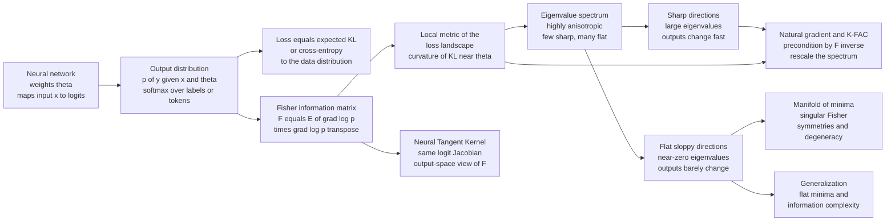

# 🧠 Information Geometry of Deep Learning

> [!abstract] TL;DR
> A neural network is, underneath, a machine that outputs a **probability distribution** $p(y\mid x;\theta)$ — over labels, pixels, or tokens — and training moves $\theta$ through the **statistical manifold** of those distributions. The natural ruler on that manifold is the **Fisher information matrix** $F(\theta) = \mathbb{E}\!\left[\nabla_\theta \log p \,\nabla_\theta \log p^\top\right]$, which is simultaneously the *local metric of the loss landscape* (the loss is an expected KL / cross-entropy, and $F$ is the curvature of KL near $\theta$) and the *Gauss-Newton / output-space* description of how predictions respond to weight changes. The decisive empirical fact (Karakida-Akaho-Amari) is that this metric is **extremely anisotropic**: its eigenvalue spectrum has a *few enormous "sharp" directions* and a *vast bulk of near-zero "flat / sloppy" directions*. The flat directions are ones where you can move the weights **without changing the network's outputs at all** — the geometric signature of **overparameterization**, symmetries, and the **manifold of minima** where the Fisher is *singular* (Watanabe's singular learning theory). This single picture explains why training is slow and ill-conditioned, why **natural gradient** / K-FAC preconditioning by $F^{-1}$ helps, how the **Neural Tangent Kernel** relates to $F$ via the logit Jacobian, and why the flatness of a minimum is entangled with generalization. It is the differential geometry hiding inside deep learning.

---

## Intuition

**Analogy — the warped landscape of "opinions."** Think of a trained network not as a function but as an *opinion-former*: for every input it emits a full opinion — a probability distribution over the possible answers. The complete collection of opinions the network could ever hold, as you dial its millions of weights, forms a vast landscape. Training is a hike across this landscape toward the region of "good opinions" (low loss). But the landscape is not flat ground with an honest ruler. It is **wildly warped**: in a handful of directions, taking a single step utterly transforms the network's opinions — a cliff face where everything changes at once. In the overwhelming majority of directions, you can walk for miles and the network's opinions **do not budge** — endless flat salt-plains where different weight settings are the *same opinion* wearing different clothes.

**Information geometry hands you the ruler for this warped ground.** The ruler is the **Fisher information matrix**: it measures distance not in "how far did the weights move" but in "how much did the *distribution* — the opinion — actually change." Where a tiny weight step changes the outputs a lot, the Fisher metric says you moved far (a sharp, high-curvature direction); where a big weight step leaves outputs untouched, it says you barely moved at all (a flat, "sloppy" direction). This one object explains *why training is hard* (the ground is stretched by factors of millions between the sharp and flat directions — an ill-conditioned hike), *why so many directions are forgotten* (they are flat — degenerate, redundant, symmetry-related), and *how to navigate faster* (rescale every direction by the ruler itself — the **natural gradient**). The loss surface has the shape it does because its metric is the Fisher metric.

---

## How It Works

### Core mechanics

1. **The network outputs a distribution.** A classifier maps $x \mapsto$ logits $\mapsto$ softmax $p(y\mid x;\theta)$; a language model outputs a distribution over the next token; a diffusion model parameterizes a distribution over images. In every case $\theta$ is a *coordinate* on a **statistical manifold** of distributions, and each weight setting is a *point* on it — see [[Statistical_Manifolds]].

2. **The loss is a divergence.** Cross-entropy training minimizes $\mathcal{L}(\theta) = \mathbb{E}_{x}\big[ H(q(\cdot\mid x),\, p(\cdot\mid x;\theta)) \big]$, which up to a constant is the **expected KL divergence** from the data distribution $q$ to the model $p_\theta$. So the loss *is* a distance on the manifold, and the geometry of that distance is the geometry of training — see [[Kullback_Leibler_Divergence_and_Geometry]].

3. **The Fisher matrix is the local metric.** Expanding the KL between neighbouring models to second order gives $D(p_\theta \,\|\, p_{\theta+d\theta}) \approx \tfrac12\, d\theta^\top F(\theta)\, d\theta$, so the **Fisher information matrix** is the Riemannian metric of the loss landscape (the full development of this metric lives in the sibling note *The_Fisher_Information_Metric*). Equivalently $F = \mathbb{E}_{x}\big[ J_x^\top A_x J_x \big]$, where $J_x = \partial(\text{logits})/\partial\theta$ is the **logit Jacobian** and $A_x = \operatorname{diag}(p) - pp^\top$ is the output distribution's own Fisher — this is exactly the **Gauss-Newton** matrix, tying "geometry of the output distribution" to "curvature of the loss."

4. **The spectrum is violently anisotropic.** Diagonalize $F$. In real (and even random) deep networks the eigenvalues span **many orders of magnitude**: a tiny number of huge eigenvalues (sharp directions where outputs change fast) and an overwhelming bulk crushed near zero (flat directions). Karakida, Akaho & Amari derived the *universal statistics* of this spectrum — the mean Fisher eigenvalue and the maximum both scale with width in predictable ways, and the landscape is generically pathologically stretched.

5. **Flat directions do not move the outputs.** A near-zero eigenvalue direction $v$ satisfies $v^\top F v \approx 0$, which forces $A_x^{1/2} J_x v \approx 0$ for all $x$: moving along $v$ changes the logits only by a *constant shift the softmax ignores*, or not at all. These flat directions are **overparameterization made visible** — weight rescalings, neuron permutations, dead units, and genuine redundancy. Where the Fisher's null space is nontrivial, minima are not points but a whole **manifold of equivalent solutions**, and $F$ is *singular* (the domain of Watanabe's singular learning theory).

6. **Natural gradient rescales the ruler.** Because raw gradient descent takes Euclidean steps on a non-Euclidean landscape, it crawls along flat directions and oscillates along sharp ones. The **natural gradient** $\tilde{\nabla}\mathcal{L} = F^{-1}\nabla\mathcal{L}$ (Amari) measures steepest descent in the Fisher metric, whitening the spectrum so every direction is treated on equal statistical footing. K-FAC (Martens-Grosse) makes this tractable by approximating $F$ as a Kronecker product per layer — see [[Optimizers]].

7. **The NTK is the same Jacobian, transposed.** The **Neural Tangent Kernel** $\Theta(x,x') = J_x J_{x'}^\top$ (Jacot et al.) is built from the very same logit Jacobian as the Fisher / Gauss-Newton matrix $\sum_x J_x^\top A_x J_x$ — one is the "kernel" (output $\times$ output) view, the other the "metric" (parameter $\times$ parameter) view of the linearized network. They share their nonzero spectrum, which is why NTK and Fisher analyses reach the same conclusions about training dynamics.

### Flow / Architecture



---

## Key Concepts

### Secondary (intuition-level)

- **The network makes distributions, not just answers.** Its output is a full probability over the possible labels; training slides those distributions toward the truth.
- **A warped landscape with a special ruler.** Distance is measured in "how much did the output opinion change," not "how far did the weights move." That ruler is the Fisher information.
- **Sharp cliffs and flat plains.** A few directions change everything (sharp); most directions change nothing (flat). This lopsidedness is why training is slow and why so many weight settings are secretly the same network.
- **Rescale to walk faster.** The natural gradient uses the ruler to stretch the flat directions and shrink the sharp ones, straightening the hike.

### Undergraduate (needs linear algebra + probability)

- **Fisher as metric and as Gauss-Newton.** $F = \mathbb{E}[\nabla\log p\,\nabla\log p^\top] = \mathbb{E}[J_x^\top A_x J_x]$ with logit Jacobian $J_x$ and output Fisher $A_x = \operatorname{diag}(p)-pp^\top$; it is the curvature of KL and (near a good fit) $\approx$ the loss Hessian.
- **Anisotropy = ill-conditioning.** The condition number $\lambda_{\max}/\lambda_{\min}$ of $F$ can be enormous; gradient descent's convergence rate is governed by exactly this ratio, so a stretched spectrum means slow training.
- **Flat directions and the output null space.** $Fv\approx 0 \iff J_x v$ is (softmax-)invisible for all $x$: you can change the weights along $v$ and the network's predictions do not move — the essence of overparameterization and symmetry.
- **Empirical vs true Fisher.** The *true* Fisher averages over labels sampled from the model, $y\sim p_\theta$; the *empirical* Fisher uses the observed labels. They coincide only near a good fit — a constant source of confusion in practice.
- **Natural gradient.** $\theta \leftarrow \theta - \eta\, F^{-1}\nabla\mathcal{L}$ is reparameterization-invariant steepest descent; it whitens the spectrum so all directions descend at a comparable rate.

### Graduate (system-level)

- **Universal Fisher statistics (Karakida-Akaho-Amari).** For wide random networks the mean Fisher eigenvalue $m_1$ and the largest eigenvalue scale with width and depth in closed form; the bulk concentrates near zero while a few outliers dominate — the landscape is generically "pathologically sharp" in a small subspace and flat elsewhere, quantitatively predicting learning-rate limits.
- **Singular learning theory (Watanabe).** Overparameterized models have *degenerate* Fisher information on the manifold of minima; the standard BIC/Laplace asymptotics fail and are replaced by the **real log canonical threshold** (RLCT / learning coefficient), which sets the true effective dimensionality and the Bayesian generalization error. Flat, singular directions are not a nuisance — they are the object of the theory.
- **NTK $\leftrightarrow$ Fisher / Gauss-Newton duality.** In the infinite-width lazy regime the network linearizes; $\Theta = JJ^\top$ (NTK, function space) and $G = J^\top A J$ (Fisher/GN, parameter space) share nonzero eigenvalues, so training dynamics, condition number, and the spectrum of "learnable directions" are two views of one operator (Jacot et al.; Martens).
- **Implicit regularization as geometry.** Gradient flow moves fastest along sharp (large-eigenvalue) directions and essentially freezes the flat bulk, so the reachable solution is confined to a low-dimensional sharp subspace — a geometric account of why overparameterized nets generalize despite huge nominal capacity (links to *The_Loss_Landscape_and_Generalization* and the mean-field / replica program).
- **Fisher as complexity / MDL.** $\sqrt{\det F}$ is the invariant volume element on the manifold; its integral is the stochastic-complexity term in **minimum description length** and the Jeffreys-prior normalizer in Bayesian model selection — connecting flatness (small $\det F$) to fewer effective bits and better generalization.
- **The flatness caveat (Dinh et al.).** Raw Fisher/Hessian sharpness is *not* reparameterization-invariant for ReLU nets — layerwise rescaling can fake any sharpness — so the "flat minima generalize" claim requires a scale-aware (Fisher-normalized or PAC-Bayes) measure; the geometry, done right, is invariant; the naive coordinate reading is not.

---

## Python Demo

```python
# The Fisher geometry of a small (overparameterized) neural network.
#
# We build a tiny MLP classifier that outputs a softmax distribution p(y|x;theta),
# then compute the FISHER INFORMATION MATRIX of that output distribution:
#     F = (1/N) sum_x  J_x^T A_x J_x
#   J_x = d(logits)/d(theta)          (logit Jacobian, analytic backprop below)
#   A_x = diag(p) - p p^T             (the output distribution's own Fisher)
#
# (a) ANISOTROPY: eigen-decompose F and show the spectrum spans many orders of
#     magnitude -- a few huge "sharp" eigenvalues and a vast bulk of near-zero
#     "flat / sloppy" directions. The landscape is extremely stretched.
# (b) FLAT vs SHARP: perturb theta along the smallest- and largest-eigenvalue
#     eigenvectors and measure how much the OUTPUT DISTRIBUTION changes (mean KL).
#     Flat directions move the weights WITHOUT changing outputs -> the geometric
#     face of overparameterization and the manifold of minima.
# (c) NATURAL GRADIENT: precondition by (F + lam I)^{-1/2} and show the whitened
#     spectrum collapses toward 1 -- every direction rescaled to equal footing.
import numpy as np
import matplotlib.pyplot as plt

rng = np.random.default_rng(0)

# ---- a tiny, deliberately OVERPARAMETERIZED MLP: d -> H (tanh) -> C (softmax) ----
d, H, C, N = 4, 16, 3, 24
W1 = 0.9 * rng.standard_normal((H, d)); b1 = 0.1 * rng.standard_normal(H)
W2 = 0.9 * rng.standard_normal((C, H)); b2 = 0.1 * rng.standard_normal(C)
X  = rng.standard_normal((N, d))
P_dim = W1.size + b1.size + W2.size + b2.size          # total number of parameters
print(f"parameters P = {P_dim},  softmax Fisher rank per point = C-1 = {C-1}")
print(f"max possible Fisher rank = N*(C-1) = {N*(C-1)}  << P  ->  many FLAT directions")

def forward(x, W1, b1, W2, b2):
    h = np.tanh(W1 @ x + b1)                            # hidden activations (H,)
    z = W2 @ h + b2                                     # logits (C,)
    p = np.exp(z - z.max()); p /= p.sum()              # softmax prob (C,)
    return h, z, p

def logit_jacobian(x, h, W2):
    """Analytic d(logits)/d(theta), shape (C, P). Param order: W1,b1,W2,b2."""
    omh2 = 1.0 - h**2                                   # tanh'(a1) (H,)
    dz_dW1 = W2[:, :, None] * omh2[None, :, None] * x[None, None, :]   # (C,H,d)
    dz_db1 = W2 * omh2[None, :]                                        # (C,H)
    dz_dW2 = np.eye(C)[:, :, None] * h[None, None, :]                  # (C,C,H)
    dz_db2 = np.eye(C)                                                 # (C,C)
    return np.concatenate([dz_dW1.reshape(C, -1), dz_db1.reshape(C, -1),
                           dz_dW2.reshape(C, -1), dz_db2.reshape(C, -1)], axis=1)

# ---------------- (a) assemble the Fisher information matrix -------------------
F = np.zeros((P_dim, P_dim))
for i in range(N):
    h, z, p = forward(X[i], W1, b1, W2, b2)
    J = logit_jacobian(X[i], h, W2)                    # (C, P)
    A = np.diag(p) - np.outer(p, p)                    # output Fisher (C, C)
    F += J.T @ A @ J
F /= N

evals = np.linalg.eigvalsh(F)[::-1]                    # descending
evals = np.clip(evals, 0, None)                        # kill tiny negatives (roundoff)
top = evals[evals > 1e-10]
print(f"\n(a) Fisher spectrum: numerical rank ~ {len(top)} of {P_dim}")
print(f"    largest eigenvalue  = {evals[0]:.3e}")
print(f"    smallest 'sharp' ev = {top[-1]:.3e}")
print(f"    anisotropy (cond#)  = {evals[0]/top[-1]:.1e}  (few sharp, many flat)")

# ---------------- (b) flat vs sharp directions: do outputs move? --------------
w, V = np.linalg.eigh(F)                               # ascending eigenvalues
v_flat  = V[:, 0]                                      # smallest eigenvalue  (flat)
v_sharp = V[:, -1]                                     # largest  eigenvalue  (sharp)

def unpack(theta):
    o = 0
    W1_ = theta[o:o+H*d].reshape(H, d); o += H*d
    b1_ = theta[o:o+H];                 o += H
    W2_ = theta[o:o+C*H].reshape(C, H); o += C*H
    b2_ = theta[o:o+C]
    return W1_, b1_, W2_, b2_

theta0 = np.concatenate([W1.ravel(), b1, W2.ravel(), b2])
P0 = np.array([forward(X[i], W1, b1, W2, b2)[2] for i in range(N)])   # base probs

def output_change(direction, t):
    """mean_x KL(p_base || p_perturbed) after stepping t along a unit direction."""
    W1p, b1p, W2p, b2p = unpack(theta0 + t * direction)
    tot = 0.0
    for i in range(N):
        _, _, pp = forward(X[i], W1p, b1p, W2p, b2p)
        tot += np.sum(P0[i] * (np.log(P0[i] + 1e-12) - np.log(pp + 1e-12)))
    return tot / N

ts = np.linspace(0, 1.5, 40)
kl_flat  = np.array([output_change(v_flat,  t) for t in ts])
kl_sharp = np.array([output_change(v_sharp, t) for t in ts])
print(f"\n(b) output-distribution change at step t=1.0:")
print(f"    along FLAT  direction: mean KL = {output_change(v_flat, 1.0):.2e}  (outputs frozen)")
print(f"    along SHARP direction: mean KL = {output_change(v_sharp,1.0):.2e}  (outputs move a lot)")

# ---------------- (c) natural-gradient whitening of the spectrum ---------------
lam = 1e-3 * evals[0]                                  # damping for the flat null space
# whitened operator M = (F+lam I)^{-1/2} F (F+lam I)^{-1/2}; its eigenvalues are
# w_i / (w_i + lam)  ->  ~1 for sharp directions, ~0 only for the truly-null ones.
white = w / (w + lam)
print(f"\n(c) natural-gradient whitened spectrum: sharp directions -> {white.max():.3f}")
print(f"    (raw spectrum spanned {evals[0]/top[-1]:.1e}; whitening equalizes the active subspace)")

# --------------------------------- plots --------------------------------------
fig, ax = plt.subplots(1, 3, figsize=(15.5, 4.6))

# (a) Fisher eigenvalue spectrum: anisotropy on a log scale
idx = np.arange(1, P_dim + 1)
ax[0].semilogy(idx, np.clip(evals, 1e-16, None), 'o-', ms=3, color="crimson")
ax[0].axhspan(1e-16, 1e-10, color="steelblue", alpha=0.15)
ax[0].text(P_dim*0.5, 1e-13, "FLAT / sloppy directions\n(near-zero eigenvalues)",
           ha="center", color="steelblue", fontsize=9)
ax[0].text(P_dim*0.12, evals[0]*0.3, "SHARP\ndirections", color="crimson", fontsize=9)
ax[0].set(title="(a) Fisher eigenvalue spectrum: highly ANISOTROPIC",
          xlabel="eigenvalue index (descending)", ylabel="eigenvalue (log scale)")

# (b) output change along flat vs sharp directions
ax[1].plot(ts, kl_sharp, 'r-', lw=2.2, label="SHARP direction (outputs move)")
ax[1].plot(ts, kl_flat,  'g-', lw=2.2, label="FLAT direction (outputs frozen)")
ax[1].set(title="(b) Move the weights: does the OUTPUT change?",
          xlabel="perturbation magnitude t", ylabel="mean KL(base || perturbed)")
ax[1].legend()

# (c) raw vs natural-gradient-whitened spectrum (active subspace only)
active = np.sort(top)[::-1]
active_white = np.sort(white[w > 1e-10])[::-1]
ax[2].semilogy(np.arange(1, len(active)+1), active/active.max(), 's-', ms=3,
               color="crimson", label="raw F (normalized)")
ax[2].semilogy(np.arange(1, len(active_white)+1), active_white, 'o-', ms=3,
               color="seagreen", label="natural-gradient whitened")
ax[2].set(title="(c) Natural gradient RESCALES the spectrum",
          xlabel="active eigenvalue index", ylabel="relative eigenvalue (log)")
ax[2].legend()

plt.tight_layout()
plt.savefig("information_geometry_of_deep_learning.png", dpi=120)
print("\nsaved information_geometry_of_deep_learning.png")
```

**What the output shows.** Panel (a) plots the Fisher eigenvalue spectrum on a log axis: a handful of large "sharp" eigenvalues at the top, then a **collapse of orders of magnitude** into a broad blue band of near-zero "flat / sloppy" directions. The printed condition number is astronomically large — the loss landscape is stretched by factors of millions, which is *exactly* why plain gradient descent is slow. Because we deliberately overparameterized ($P = 131$ weights but at most $N(C-1)=48$ can carry Fisher information), the bulk of the spectrum is *forced* to zero: those are genuine flat directions. Panel (b) makes the flat directions concrete — stepping the weights along the smallest-eigenvalue eigenvector leaves the network's output distribution essentially unchanged (mean KL $\approx 0$, a green flat line), while the same-sized step along the largest-eigenvalue eigenvector rapidly transforms the outputs (red curve shoots up). Moving along a flat direction is moving *along the manifold of equivalent networks* — overparameterization made visible. Panel (c) shows the **natural gradient's** effect: preconditioning by $(F+\lambda I)^{-1/2}$ whitens the active subspace so its eigenvalues collapse toward $1$, turning the stretched landscape into a locally round one where every learnable direction descends at the same rate.

---

## Real-World Applications

> **K-FAC and second-order optimizers.** Martens & Grosse's **K-FAC** approximates the Fisher as a layerwise Kronecker product $F_\ell \approx A_\ell \otimes B_\ell$, making $F^{-1}$ tractable so large networks can take natural-gradient steps. Shampoo, and the natural-gradient variants used in large-scale training, descend from the same geometry — see [[Optimizers]].

> **Trust-region reinforcement learning.** TRPO and natural policy gradients bound each update by a Fisher-metric (KL) trust region rather than a Euclidean weight ball, so policy updates are reparameterization-invariant and stable — the geometry directly controls how far the *policy distribution* is allowed to move per step.

> **Elastic Weight Consolidation (continual learning).** EWC penalizes changes to weights in proportion to their **Fisher information**, i.e. it forbids motion along sharp directions (which would destroy old skills) while permitting free motion along flat directions. Catastrophic forgetting is thus reframed as a geometry problem — protect the high-curvature subspace.

> **Pruning, quantization, and the loss Hessian.** Optimal Brain Surgeon and modern Fisher/Hessian-based pruning remove weights lying in flat (low-Fisher) directions because deleting them barely perturbs the output distribution — the same anisotropy that slows training tells you which parameters are safe to discard.

> **Laplace approximations and Bayesian deep learning.** Post-hoc uncertainty methods fit a Gaussian posterior with covariance $F^{-1}$ at the trained minimum; the flat (near-null) Fisher directions become the high-variance, poorly-determined parameter combinations, giving calibrated uncertainty from the landscape's geometry.

---

## Common Pitfalls

- **The Fisher is intractable at scale — you are always using an approximation.** A full $P\times P$ Fisher for a modern network is astronomically large. Every practical method (K-FAC, diagonal Fisher, block-diagonal, EF-based, low-rank) is an *approximation*, and its quality varies wildly by architecture. Never assume "the Fisher" you computed is the true Fisher; know which approximation you invoked.
- **Empirical Fisher $\neq$ true Fisher.** The *true* Fisher samples labels from the model ($y\sim p_\theta$); the *empirical* Fisher uses the dataset's labels. They agree only near a well-fit minimum. Using the empirical Fisher as a curvature proxy far from convergence (a very common shortcut) can badly misrepresent the geometry and mislead natural-gradient steps (Kunstner et al.).
- **The sharp-vs-flat-minima generalization claim is subtler than it sounds.** Flat minima *tend* to generalize, but raw flatness is **not reparameterization-invariant** (Dinh et al.): layerwise weight rescaling can make any ReLU minimum look arbitrarily sharp or flat without changing the function. Only a scale-aware (Fisher-normalized, PAC-Bayes, or SAM-style) sharpness measure carries the correlation — do not read raw Hessian eigenvalues as a generalization certificate.
- **Singular Fisher in overparameterized nets breaks classical asymptotics.** When $F$ is rank-deficient (the generic case), $F^{-1}$ does not exist, the Laplace/BIC approximation is invalid, and Cramér-Rao-style intuition collapses. This is not numerical noise to regularize away — it is the **singular learning** regime (Watanabe), and the right object is the RLCT / learning coefficient, not the naive parameter count. Always damp ($F+\lambda I$) *knowingly*, understanding you are choosing which flat directions to freeze.
- **Confusing the NTK and Fisher spectra with the loss-Hessian spectrum.** The Gauss-Newton / Fisher matrix equals the loss Hessian only near a good fit (where the residual term vanishes); early in training or at saddles they differ, and the Hessian can be indefinite while $F\succeq 0$ always. Attributing Hessian negative eigenvalues to the Fisher is a category error.

---

## Related Concepts

*Cross-vault connections (Glob-verified):*
- [[The_Fisher_Information_Metric]] — the foundational object: this note *applies* that Riemannian metric to the parameter space of a neural network, where the curvature of KL becomes the geometry of the loss landscape.
- [[Statistical_Manifolds]] — the manifold of output distributions on which the network's weights are coordinates; deep-learning training is a trajectory across it.
- [[Kullback_Leibler_Divergence_and_Geometry]] — cross-entropy training minimizes an expected KL, whose local quadratic form is precisely the Fisher metric analyzed here.
- [[Exponential_Families_and_Their_Geometry]] — the softmax output layer is an exponential family, so $A_x = \operatorname{diag}(p)-pp^\top$ is its natural Fisher; the whole demo rests on this.
- [[Riemannian_Geometry_Primer_for_Statistics]] — metrics, geodesics, and singular metrics; the flat-direction / manifold-of-minima picture is Riemannian geometry with a degenerate metric.
- [[Fisher_Information_and_the_Cramer_Rao_Bound]] — the estimation-theory face of Fisher information; a *singular* Fisher (flat directions) means non-identifiable parameters and an unbounded Cramér-Rao floor — the geometry of overparameterization.
- [[The_Loss_Landscape_and_Generalization]] — the statistical-mechanics companion: flat vs sharp *minima* and double descent, where this note supplies the *metric* that defines what "flat" and "sharp" mean.
- [[Mean_Field_Theory_of_Neural_Networks]] — the infinite-width limit in which the Fisher/NTK spectrum becomes analytically computable and training linearizes.
- [[Statistical_Mechanics_of_Generalization_and_Scaling_Laws]] — the typical-case theory of why overparameterized nets generalize; the Fisher's low effective rank is one geometric ingredient.
- [[Optimizers]] — natural gradient, K-FAC, and trust-region methods precondition by $F^{-1}$, the practical payoff of the geometry.
- [[Gradient_Descent_Variants]] — plain SGD takes Euclidean steps on this anisotropic landscape; its slowness *is* the condition number of $F$.
- [[Backpropagation]] — the logit Jacobian $J_x$ that builds the Fisher is computed by the same reverse-mode machinery as the gradient.
- [[Neural_Network_Basics]] — the softmax-output network whose distribution $p(y\mid x;\theta)$ is the object whose geometry we study.
- [[Regularization]] — weight decay, damping $(F+\lambda I)$, and EWC all act by penalizing motion in specific Fisher directions.
- [[Bias_Variance_Tradeoff]] — the classical picture that the anisotropic-Fisher / flat-direction account extends into the overparameterized regime.
- [[Minimum_Description_Length_and_Model_Selection]] — $\sqrt{\det F}$ is the stochastic-complexity volume term; flatness (small $\det F$) means fewer effective bits.
- [[Relative_Entropy_and_Cross_Entropy]] — the training loss itself, whose expected value's curvature is the Fisher metric.
- [[Eigenvalues_and_Eigenvectors]] — the anisotropy story *is* the eigen-spectrum of $F$; sharp and flat directions are its eigenvectors.
- [[Singular_Value_Decomposition]] — the logit Jacobian's SVD exposes the same active-vs-null subspace structure as the Fisher eigendecomposition.

*Sibling notes in this vault (Information Geometry), referenced in prose: **Natural_Gradient_Descent** (the optimization method whose metric is developed here), **Variational_Inference_and_Geometry** (the same Fisher geometry applied to approximate posteriors), **Geometry_of_Generative_Models** (Fisher/output geometry for VAEs, diffusion, and normalizing flows), and **Information_Geometry_and_Complex_Systems** (anisotropic "sloppy" Fisher spectra across physics and biology, of which deep networks are one instance).*

---

## Review Questions

1. **(Secondary)** Using the "warped landscape of opinions" analogy, explain what it means for a direction in weight space to be *flat* versus *sharp*, and why a network can have millions of weights but only a few directions that actually matter. Why does this lopsidedness make ordinary training slow?
2. **(Undergraduate)** Write the Fisher information matrix of a softmax classifier as $F = \mathbb{E}_x[J_x^\top A_x J_x]$, identifying $J_x$ and $A_x$. Show that a direction $v$ with $Fv=0$ must leave the output *distribution* unchanged (hint: what is the null space of $A_x$, and what does a constant logit shift do to the softmax?). Explain how the natural-gradient update $F^{-1}\nabla\mathcal{L}$ fixes the ill-conditioning that a large $\lambda_{\max}/\lambda_{\min}$ causes.
3. **(Graduate)** An overparameterized network has a *singular* Fisher matrix on its manifold of minima. (a) Why does this break the classical Laplace/BIC model-selection asymptotics, and what replaces the parameter count (name the quantity)? (b) State the relationship between the Neural Tangent Kernel $\Theta = JJ^\top$ and the Fisher / Gauss-Newton matrix $G = J^\top A J$, and why they share nonzero spectrum. (c) Explain the Dinh et al. objection to "flat minima generalize" and how a Fisher-normalized sharpness measure repairs it.

---

## Sources

- Amari, S. (2016). *Information Geometry and Its Applications.* Springer. (natural gradient, Fisher metric, applications to learning)
- Karakida, R., Akaho, S., & Amari, S. (2019). "Universal Statistics of Fisher Information in Deep Neural Networks: Mean Field Approach." *AISTATS*. [arXiv:1806.01316](https://arxiv.org/abs/1806.01316)
- Martens, J., & Grosse, R. (2015). "Optimizing Neural Networks with Kronecker-Factored Approximate Curvature (K-FAC)." *ICML*. [arXiv:1503.05671](https://arxiv.org/abs/1503.05671)
- Jacot, A., Gabriel, F., & Hongler, C. (2018). "Neural Tangent Kernel: Convergence and Generalization in Neural Networks." *NeurIPS*. [arXiv:1806.07572](https://arxiv.org/abs/1806.07572)
- Watanabe, S. (2009). *Algebraic Geometry and Statistical Learning Theory.* Cambridge University Press. (singular learning theory; degenerate Fisher information)
- Dinh, L., Pascanu, R., Bengio, S., & Bengio, Y. (2017). "Sharp Minima Can Generalize for Deep Nets." *ICML*. [arXiv:1703.04933](https://arxiv.org/abs/1703.04933)

---

#information-geometry #deep-learning #fisher-information #loss-landscape #natural-gradient
