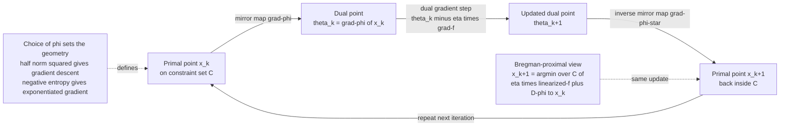

# 🪞 Mirror Descent and Bregman Optimization

> [!abstract] TL;DR
> **Mirror descent** (Nemirovski–Yudin, 1983) is first-order optimization re-tuned to the **geometry of the constraint set**. You pick a strictly convex **mirror map** (potential) $\varphi$, map your current point into a **dual "mirror world"** via $\nabla\varphi$, take an ordinary gradient step *there*, and map back via the Legendre conjugate gradient $\nabla\varphi^\ast$. Choosing $\varphi=\tfrac12\|\cdot\|^2$ recovers plain gradient descent; choosing the **negative entropy** $\varphi(x)=\sum_i x_i\log x_i$ on the probability simplex yields the **exponentiated-gradient / multiplicative-weights** update — a *multiplicative* step that stays on the simplex for free, no projection needed. Equivalently, each step is a **Bregman-proximal** update: minimize the linearized objective plus a Bregman divergence $D_\varphi$ to the current point. Over the simplex this buys a famous exponential improvement in dimension-dependence ($\sqrt{\log d}$ vs $\sqrt{d}$), and in continuous time with the exponential-family log-partition potential it **coincides with the natural gradient**. It is the algorithmic engine behind Hedge, AdaBoost, EXP3, Sinkhorn, and trust-region policy methods like TRPO/PPO.

---

## Intuition

**Analogy — optimizing in a mirror that matches the terrain.** Plain gradient descent silently assumes your parameters live on a **flat Euclidean field**: it takes a straight-line step in the direction of steepest descent. That is fine on an open plain. But suppose your parameters are **probabilities on a simplex** (they must be non-negative and sum to one), or a **positive-definite matrix**, or weights that must stay positive. A straight Euclidean step immediately walks *off the edge* of the valid region — a probability goes negative, the sum drifts from one — and you have to awkwardly drag the point back with a projection every single iteration.

Mirror descent fixes this by never stepping in the raw parameter space at all. It holds up a **mirror** — a convex potential $\varphi$ chosen to match the shape of your feasible set — and looks at the reflected image of your point in that mirror's **dual world**. In the mirror world the geometry is warped so that a plain straight step *automatically respects the constraints*. You take the gradient step there, then reflect the result back through the mirror ($\nabla\varphi^\ast$) into the original space. Pick the *right* mirror and every iterate lands cleanly inside the valid region, with the step sizes in each coordinate scaled to how the geometry actually curves. On the simplex the right mirror is **negative entropy**, and the reflection turns an *additive* step into a *multiplicative* one: coordinates get scaled by $e^{-\eta g_i}$ and renormalized — exactly the update that keeps a probability distribution a probability distribution.

---

## How It Works

### Core Mechanics

Let $C$ be a convex feasible set and $\varphi$ a **strictly convex, differentiable "mirror map"** (also called the potential, distance-generating function, or Legendre-type function) that is strongly convex over $C$. One mirror-descent step from iterate $x_k$, given the objective gradient $g_k=\nabla f(x_k)$ and step size $\eta$, is:

1. **Mirror to the dual space.** Map the primal point to its dual image $\theta_k=\nabla\varphi(x_k)$. Because $\varphi$ is strictly convex, $\nabla\varphi$ is a bijection onto the dual domain — this is the [[Legendre_Transform_and_Convex_Duality|Legendre]] gradient map linking primal ("mean/expectation") coordinates to dual ("natural") coordinates.
2. **Take a plain gradient step in the dual.** Move $\theta_{k+1}=\theta_k-\eta\,g_k$. The gradient of $f$ is a *dual* object (a covector), so this addition is geometrically the correct operation — you are adding a covector to a dual point, not to a primal point.
3. **Mirror back to the primal.** Return via the conjugate gradient $x_{k+1}=\nabla\varphi^\ast(\theta_{k+1})$, where $\varphi^\ast$ is the [[Legendre_Transform_and_Convex_Duality|convex conjugate]] and $\nabla\varphi^\ast=(\nabla\varphi)^{-1}$. If $C$ is a proper subset, this map includes the constraint, projecting via the Bregman geometry rather than the Euclidean one.

**Equivalent Bregman-proximal form.** Steps 1–3 collapse into a single variational update that is often the cleanest way to reason about the method:

$$
x_{k+1}=\arg\min_{x\in C}\ \Big\{\ \eta\,\langle g_k,\,x\rangle\ +\ D_\varphi(x\,\|\,x_k)\ \Big\},
$$

where $D_\varphi(x\|x_k)=\varphi(x)-\varphi(x_k)-\langle\nabla\varphi(x_k),x-x_k\rangle$ is the [[Bregman_Divergences|Bregman divergence]] generated by $\varphi$. Read it as: **minimize the linearized objective, but pay a Bregman "trust-region" penalty for straying from the current point.** Setting the gradient to zero gives $\nabla\varphi(x_{k+1})=\nabla\varphi(x_k)-\eta g_k$ — exactly steps 1–3. Choosing $\varphi=\tfrac12\|\cdot\|^2$ makes $D_\varphi$ the squared Euclidean distance and recovers the proximal view of ordinary [[Gradient_Descent|gradient descent]] (and, with a projection, projected gradient).

**The two canonical mirrors.**

| Mirror map $\varphi$ | Feasible geometry | Resulting update |
|---|---|---|
| $\tfrac12\|x\|_2^2$ | $\mathbb{R}^n$ / Euclidean ball | additive: $x_{k+1}=x_k-\eta g_k$ (plain gradient descent) |
| $\sum_i x_i\log x_i$ (negative entropy) | probability simplex $\Delta^{n-1}$ | multiplicative: $x_{k+1,i}\propto x_{k,i}\,e^{-\eta g_{k,i}}$ (exponentiated gradient / multiplicative weights) |

For negative entropy, $\nabla\varphi(x)_i=\log x_i+1$, so the dual step $\log x_{k+1}=\log x_k-\eta g_k$ (up to a constant) mirrors back through the softmax $\nabla\varphi^\ast$, giving the **Hedge / multiplicative-weights** rule. The Bregman divergence for this $\varphi$ is the **KL divergence**, so the proximal penalty above literally reads $\eta\langle g_k,x\rangle+\mathrm{KL}(x\|x_k)$ — the update stays on the simplex because KL blows up at the boundary.

### Flow / Architecture



---

## Key Concepts

**Secondary (intuitive core).**
- A **mirror map** $\varphi$ is a convex "hill" you choose to encode the shape of the allowed region.
- **Mirror world:** you translate your point into a dual space, step there, and translate back — so the raw step never violates the constraints.
- On the simplex the right mirror turns *additive* steps into *multiplicative* ones ($\times e^{-\eta g_i}$), which is why probabilities stay valid.

**Undergraduate (mechanics and duality).**
- The three-step map $x\to\nabla\varphi(x)\to$ step $\to\nabla\varphi^\ast$ is equivalent to the single **Bregman-proximal** update: linearized objective plus $D_\varphi$ penalty.
- **Legendre conjugacy:** $\nabla\varphi^\ast=(\nabla\varphi)^{-1}$; strict convexity makes the mirror a bijection, tying to [[Legendre_Transform_and_Convex_Duality|convex duality]] and to the primal/dual coordinates of [[Dually_Flat_Spaces|dually flat spaces]].
- **Exponentiated gradient = multiplicative weights = Hedge:** the negative-entropy instance, the workhorse of online learning and boosting.
- **Convergence:** for convex $f$ with subgradients bounded in the norm dual to $\varphi$'s strong-convexity norm, mirror descent achieves $O(1/\sqrt{T})$; on the simplex the constant depends on $\sqrt{\log d}$ rather than $\sqrt{d}$ — an exponential dimension win over Euclidean projected subgradient.

**Graduate (information-geometric unification).**
- The Bregman divergence generated by an exponential family's **log-partition function** $A$ is the **canonical divergence of a [[Dually_Flat_Spaces|dually flat space]]** (KL on the family). Mirror descent with $\varphi=A$ moves in the **natural (dual) coordinates** while the mean coordinates are $\nabla A$ — the information-geometric picture behind [[Maximum_Entropy_and_Exponential_Families|exponential families]].
- **Mirror descent ↔ natural gradient (Raskutti–Mukherjee).** In the small-step / continuous-time limit, mirror descent with the log-partition potential is *identical* to **natural gradient descent** with the Fisher metric: linearizing $\nabla A(\theta_{k+1})=\nabla A(\theta_k)-\eta\nabla_\theta f$ gives $\theta_{k+1}-\theta_k\approx-\eta\,[\nabla^2 A]^{-1}\nabla_\theta f=-\eta\,G^{-1}\nabla_\theta f$, where $G=\nabla^2 A$ is the Fisher information. Discrete-time steps differ; the equivalence is exact only in the flow limit.
- **Bregman projections and alternating minimization:** Sinkhorn's algorithm for entropic optimal transport is exactly **alternating Bregman (KL) projections** — a mirror-descent-flavored scheme (see [[Optimal_Transport_and_Schrodinger_Bridges|entropic optimal transport]]).

---

## Python Demo

```python
# Mirror descent on the probability simplex.
#   (a) Minimize a strictly convex quadratic over the 3-simplex using
#       EXPONENTIATED GRADIENT (mirror descent, negative-entropy mirror) which
#       stays ON the simplex for free, vs PROJECTED GRADIENT which must project
#       back every step. Plot both trajectories on the simplex triangle + the
#       objective-gap convergence curves.
#   (b) Verify the BREGMAN-PROXIMAL interpretation: the EG update is the exact
#       minimizer of  eta*<g,x> + KL(x||x_k)  over the simplex.
#   (c) Show NATURAL GRADIENT ~= MIRROR DESCENT for an exponential family:
#       mirror descent with the log-partition potential -> natural-gradient
#       direction as the step size -> 0.
import numpy as np
import matplotlib.pyplot as plt

rng = np.random.default_rng(0)

# ---- Problem: min f(x) = 0.5 x^T Q x + b^T x  over the simplex {x >= 0, sum x = 1}
Q = np.array([[2.0, 0.5, 0.0],
              [0.5, 1.0, 0.0],
              [0.0, 0.0, 1.5]])
b = np.array([-1.0, 0.5, 0.2])
f    = lambda x: 0.5 * x @ Q @ x + b @ x
grad = lambda x: Q @ x + b

def project_simplex(v):
    """Euclidean projection onto the probability simplex (Duchi et al. 2008)."""
    u = np.sort(v)[::-1]
    cssv = np.cumsum(u) - 1.0
    ind = np.arange(1, len(v) + 1)
    rho = ind[u - cssv / ind > 0][-1]
    theta = cssv[rho - 1] / rho
    return np.maximum(v - theta, 0.0)

def eg_step(x, eta):                       # exponentiated gradient = mirror descent
    w = x * np.exp(-eta * grad(x))         # multiplicative, positivity preserved
    return w / w.sum()                     # renormalize -> stays on the simplex

def pgd_step(x, eta):                      # projected (Euclidean) gradient descent
    return project_simplex(x - eta * grad(x))

# Reference optimum: long exponentiated-gradient run
x = np.array([1/3, 1/3, 1/3])
for _ in range(20000):
    x = eg_step(x, 0.3)
x_star, f_star = x.copy(), f(x)

# Run both methods from the centroid
T = 120
x_eg,  x_pgd = np.full(3, 1/3), np.full(3, 1/3)
traj_eg, traj_pgd = [x_eg.copy()], [x_pgd.copy()]
gap_eg, gap_pgd = [f(x_eg) - f_star], [f(x_pgd) - f_star]
for _ in range(T):
    x_eg,  x_pgd = eg_step(x_eg, 0.4), pgd_step(x_pgd, 0.15)
    traj_eg.append(x_eg.copy());  traj_pgd.append(x_pgd.copy())
    gap_eg.append(f(x_eg) - f_star); gap_pgd.append(f(x_pgd) - f_star)
traj_eg, traj_pgd = np.array(traj_eg), np.array(traj_pgd)

print("optimum x*      :", np.round(x_star, 4), " f* =", round(f_star, 5))
print("EG  min prob    :", round(traj_eg.min(),  6), "(never negative -> on simplex)")
print("PGD min prob    :", round(traj_pgd.min(), 6), "(projection needed each step)")

# ---- (b) Bregman-proximal check: EG update == argmin eta<g,x> + KL(x||x_k)
def kl(x, y): return np.sum(x * np.log(x / y))
xk, eta = np.array([0.5, 0.3, 0.2]), 0.5
g = grad(xk)
x_eg_pt = (xk * np.exp(-eta * g)); x_eg_pt /= x_eg_pt.sum()
sub = lambda x: eta * (g @ x) + kl(x, xk)      # linearized objective + Bregman(KL)
best = min((sub(p := rng.dirichlet(np.ones(3))), p) for _ in range(20000))[0]
print("\nBregman-proximal subproblem value at EG point:", round(sub(x_eg_pt), 6))
print("best value over 20000 random simplex points  :", round(best, 6),
      "-> EG point is the minimizer")

# ---- (c) Natural gradient ~= mirror descent for a categorical exponential family
# Natural params theta in R^2, log-partition A(theta)=log(1+e^{t1}+e^{t2}).
# Mean map mu = grad A (softmax); Fisher G = Hess A = diag(mu)-mu mu^T.
theta = np.array([0.3, -0.4])
def mean_map(t):
    e = np.exp(np.append(t, 0.0)); p = e / e.sum(); return p[:2]
mu = mean_map(theta)
G  = np.diag(mu) - np.outer(mu, mu)            # Fisher information = Hessian of A
gL = np.array([0.7, -0.2])                     # some loss gradient in theta-space
nat_dir = -np.linalg.solve(G, gL)              # natural-gradient direction
print("\nnatural-gradient direction:", np.round(nat_dir, 4))
for eta in [1e-1, 1e-2, 1e-3]:
    mu_next = mu - eta * gL                     # dual gradient step in mean coords
    theta_next = np.log(mu_next / (1 - mu_next.sum()))   # inverse mirror map
    mirror_dir = (theta_next - theta) / eta     # mirror-descent direction
    rel = np.linalg.norm(mirror_dir - nat_dir) / np.linalg.norm(nat_dir)
    print(f"  eta={eta:>6}: mirror dir {np.round(mirror_dir,4)}  rel.err={rel:.2e}")

# ---- Plots ---------------------------------------------------------------
V = np.array([[0.0, 0.0], [1.0, 0.0], [0.5, np.sqrt(3)/2]])   # simplex vertices
to2d = lambda P: P @ V
fig, ax = plt.subplots(1, 2, figsize=(12, 5))

tri = np.vstack([V, V[0]])
ax[0].plot(tri[:, 0], tri[:, 1], 'k-', lw=1)
for lbl, xy in zip(["e1", "e2", "e3"], V):
    ax[0].annotate(lbl, xy, ha="center", va="center", fontsize=9,
                   xytext=(xy[0], xy[1] - 0.05 if xy[1] < 0.1 else xy[1] + 0.03))
P_eg, P_pgd, P_star = to2d(traj_eg), to2d(traj_pgd), to2d(x_star[None])
ax[0].plot(P_eg[:, 0],  P_eg[:, 1],  '-o', ms=3, color="#1f77b4",
           label="mirror descent (EG)")
ax[0].plot(P_pgd[:, 0], P_pgd[:, 1], '-s', ms=3, color="#d62728",
           label="projected GD")
ax[0].scatter(*P_star.T, marker='*', s=260, color="gold", edgecolor="k",
              zorder=5, label="optimum x*")
ax[0].set_title("Trajectories on the probability simplex")
ax[0].axis("equal"); ax[0].axis("off"); ax[0].legend(loc="upper right")

ax[1].semilogy(gap_eg,  color="#1f77b4", label="mirror descent (EG)")
ax[1].semilogy(gap_pgd, color="#d62728", label="projected GD")
ax[1].set_xlabel("iteration"); ax[1].set_ylabel("f(x) - f*  (log scale)")
ax[1].set_title("Objective-gap convergence"); ax[1].legend(); ax[1].grid(alpha=0.3)

plt.tight_layout(); plt.savefig("mirror_descent_simplex.png", dpi=110)
print("\nsaved figure -> mirror_descent_simplex.png")
```

**What it shows.** (a) The exponentiated-gradient iterates never leave the simplex — every coordinate stays strictly positive and the trajectory glides across the triangle to the optimum, while projected gradient descent must snap back onto the simplex with an explicit Euclidean projection every step; both reach the same minimizer. (b) The EG update sits exactly at the minimum of the Bregman-proximal subproblem $\eta\langle g,x\rangle+\mathrm{KL}(x\|x_k)$ — confirming the two views are the same algorithm. (c) As the step size shrinks, the mirror-descent direction converges to the **natural gradient** direction $-G^{-1}\nabla_\theta f$ (relative error $\to 0$), demonstrating the continuous-time equivalence for exponential families.

---

## Real-World Applications

- **Online learning and prediction with expert advice.** The **Hedge / multiplicative-weights** algorithm is mirror descent with negative entropy over the simplex of experts; it attains near-optimal $O(\sqrt{T\log d})$ regret — the $\log d$ (not $d$) being precisely the simplex-geometry payoff.
- **Boosting.** [[Gradient_Boosting|AdaBoost]] can be read as exponentiated gradient / entropic mirror descent on the distribution over training examples: each round re-weights examples multiplicatively, which is the negative-entropy mirror step.
- **Adversarial and bandit settings.** EXP3 (bandit) and no-regret dynamics in games are multiplicative-weights / mirror-descent updates on action simplices; regret-matching and MWU underpin much of computational game theory.
- **Reinforcement learning.** Natural policy gradient, TRPO, and [[PPO|PPO]] use a **KL trust region** on the policy — a Bregman-proximal step in policy space. Mirror descent is the unifying lens: the KL penalty is the Bregman divergence of the softmax/entropy mirror, closely tied to natural-gradient policy updates and to [[RLHF|RLHF]] fine-tuning with KL regularization.
- **Optimal transport.** Sinkhorn's algorithm for entropically regularized OT is **alternating Bregman (KL) projections**, a mirror-descent-style scheme (see [[Optimal_Transport_and_Schrodinger_Bridges|entropic OT]] and [[Optimal_Transport_and_Wasserstein_Geometry|Wasserstein geometry]]).
- **Constrained and structured ML.** Positivity-constrained problems, portfolio weights, PU-learning, and matrix problems (with the log-det or von Neumann entropy mirror) all benefit from a mirror matched to the domain, avoiding costly projections.

---

## Common Pitfalls

- **Choosing the wrong mirror / geometry mismatch.** The benefit is entirely about matching $\varphi$ to the feasible set. On the simplex, negative entropy is right and gives $\sqrt{\log d}$ scaling; using the Euclidean mirror there throws away the advantage (and forces projections). On $\ell_2$ balls, the entropic mirror helps nothing. Match the mirror's strong-convexity norm to the norm in which your gradients are bounded.
- **Step size and strong convexity of the mirror.** Convergence bounds require $\varphi$ to be $\sigma$-strongly convex with respect to a chosen norm; the safe step size scales like $\sigma/L$ where $L$ bounds the gradient in the *dual* norm. A mirror that is only weakly convex (or a poorly scaled $\eta$) yields slow or unstable steps. Negative entropy is $1$-strongly convex in $\ell_1$ on the simplex — that is exactly why the $\ell_\infty$ gradient bound and $\log d$ constant appear.
- **Over-claiming "mirror descent = natural gradient."** They coincide **only in continuous time** (the flow limit) and specifically for the exponential-family log-partition potential (Raskutti–Mukherjee). Discrete-time mirror descent and discrete natural gradient descent take *different* finite steps; do not treat one implementation as a drop-in for the other at finite step size.
- **Numerical underflow / overflow in the exponentiated update.** Computing $x_i e^{-\eta g_i}$ directly can underflow. Work in **log space**: $\log x_i \leftarrow \log x_i-\eta g_i$, then apply a log-sum-exp normalization. This is the same stability trick as a numerically stable softmax.
- **Iterates hitting the boundary.** The entropic mirror keeps iterates in the *relative interior* (KL is infinite on the boundary), so a coordinate never becomes exactly zero — good for stability, but it means EG only *approaches* a vertex optimum asymptotically. If you truly need sparse/corner solutions, that asymptotic approach (or a different mirror) matters.
- **Forgetting that the gradient is a dual object.** The step $\theta\leftarrow\theta-\eta g$ happens in the **dual** space; adding $g$ to the primal $x$ (as vanilla GD does) is only correct when the mirror is Euclidean. Blurring primal and dual coordinates is the conceptual error that mirror descent exists to prevent.

---

## Related Concepts

- [[Bregman_Divergences]] — the divergence $D_\varphi$ that defines the proximal penalty in every mirror-descent step; its generator *is* the mirror map.
- [[Legendre_Transform_and_Convex_Duality]] — supplies the conjugate $\varphi^\ast$ and the bijection $\nabla\varphi^\ast=(\nabla\varphi)^{-1}$ that maps back from the dual "mirror world."
- [[Dually_Flat_Spaces]] — the information-geometric home of mirror descent: primal/dual (mean/natural) coordinates with the log-partition potential and its canonical divergence.
- [[Maximum_Entropy_and_Exponential_Families]] — where the log-partition potential lives; mirror descent with $\varphi=A$ is natural gradient in continuous time.
- [[Gradient_Descent]] — the Euclidean-mirror special case ($\varphi=\tfrac12\|\cdot\|^2$).
- [[Proximal_Methods]] — the Bregman-proximal update generalizes the classical (Euclidean) proximal / projected-gradient step.
- [[Convex_Functions]] — strict/strong convexity of $\varphi$ is the precondition that makes the mirror a bijection with a valid conjugate.
- [[Convex_Sets]] — the feasible set $C$ whose geometry the mirror map is chosen to encode.
- [[Duality_Theory]] — the broader convex-duality machinery behind the primal↔dual mirror maps.
- [[Optimizers]] — practical first-order optimizers; adaptive methods can be viewed through a mirror/preconditioning lens.
- [[Regularization]] — the Bregman penalty acts as an adaptive, geometry-aware regularizer on each step.
- [[Partial_Derivatives]] — the gradient/Hessian calculus underlying $\nabla\varphi$, $\nabla\varphi^\ast$, and the Fisher metric $\nabla^2 A$.
- [[PPO]] / [[RLHF]] — KL-trust-region policy updates as Bregman-proximal / mirror-descent steps in policy space.
- [[Optimal_Transport_and_Schrodinger_Bridges]] / [[Optimal_Transport_and_Wasserstein_Geometry]] — Sinkhorn as alternating Bregman (KL) projections.

---

## Review Questions

1. **(Secondary)** Why does the exponentiated-gradient update keep a probability distribution valid "for free," whereas an ordinary gradient step does not? What operation must plain projected gradient add on every iteration that mirror descent avoids?
2. **(Undergraduate)** Starting from the Bregman-proximal objective $\arg\min_{x\in\Delta}\ \eta\langle g,x\rangle+\mathrm{KL}(x\|x_k)$, derive the multiplicative-weights update $x_{k+1,i}\propto x_{k,i}e^{-\eta g_i}$. Which property of the KL penalty guarantees the minimizer stays in the interior of the simplex?
3. **(Graduate)** State precisely the sense in which mirror descent "equals" natural gradient descent for an exponential family, and where the equivalence breaks. Then explain the $\sqrt{\log d}$ vs $\sqrt{d}$ dimension-dependence: which norm is $\varphi$ strongly convex in, and how does that norm control the gradient bound that enters the regret constant?

---

## Sources

- Nemirovski, A. & Yudin, D. (1983). *Problem Complexity and Method Efficiency in Optimization.* Wiley. (Original mirror descent.)
- Beck, A. & Teboulle, M. (2003). "Mirror descent and nonlinear projected subgradient methods for convex optimization." *Operations Research Letters*, 31(3), 167–175.
- Raskutti, G. & Mukherjee, S. (2015). "The Information Geometry of Mirror Descent." *IEEE Transactions on Information Theory*, 61(3), 1451–1457.
- Bubeck, S. (2015). *Convex Optimization: Algorithms and Complexity.* Foundations and Trends in Machine Learning, 8(3–4). (Chapter on mirror descent and the simplex.)
- Amari, S. (1998). "Natural Gradient Works Efficiently in Learning." *Neural Computation*, 10(2), 251–276.

---

#information-geometry #mirror-descent #bregman #exponentiated-gradient #optimization
