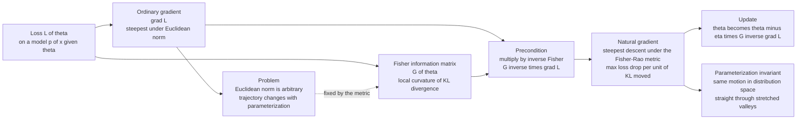

# 🧭 Natural Gradient Descent

> [!abstract] TL;DR
> **Natural gradient descent** (Amari, 1998) replaces the ordinary update $\theta \leftarrow \theta - \eta\,\nabla\mathcal{L}$ with the **Fisher-preconditioned** update $\theta \leftarrow \theta - \eta\, G(\theta)^{-1}\nabla\mathcal{L}$, where $G$ is the **Fisher information matrix**. The point: plain gradient descent takes the steepest step in *Euclidean parameter space*, but that "steepest" direction is an artifact of how you happened to parameterize the model — rescale a weight and the trajectory changes. The natural gradient instead takes the steepest step in the **Riemannian (Fisher-Rao) geometry of the distributions the model represents**: the direction of maximum loss decrease *per unit of KL divergence* moved. This makes the update **parameterization-invariant**, lets it follow the manifold's true terrain (straight through stretched valleys and across plateaus instead of zig-zagging), and connects it to **second-order methods** — for common losses the Fisher coincides with the **Gauss-Newton** matrix, so natural gradient behaves like a well-conditioned, always-positive-definite Newton step. The catch is cost: $G$ is $d\times d$ and inverting it is $O(d^3)$, impractical for deep nets, which is why practice uses approximations — diagonal, block-diagonal, **K-FAC** (Kronecker-factored), and empirical Fisher. This note opens the Machine Learning & Optimization section of the vault.

---

## Intuition

**Analogy — the warped contour map.** You are standing in a valley trying to reach the lowest point, and you have a topographic map. But the map's grid is *stretched*: one centimetre east on paper is a kilometre of real ground, while one centimetre north is only a metre. If you naively walk "straight downhill *on the map*," you march in a direction that looks steep on paper but is a terrible real-world route — and worse, if a friend hands you a *differently* stretched map of the same valley, "straight downhill" now points somewhere else entirely. The steepest direction depends on the map's units, and the units were arbitrary. Ordinary gradient descent is exactly this: it walks downhill in whatever units you happened to write the parameters in, so its path is secretly a coordinate accident, and in a long thin valley it **zig-zags** across the walls instead of running down the floor.

**Natural gradient descent throws away the arbitrary grid and measures steepness on the real terrain.** For a statistical model the "real terrain" is not the parameter numbers but the *distributions* the model produces — and the right ruler for how far apart two nearby distributions are is the **Fisher information metric** (the local curvature of KL divergence). The natural gradient asks: *of all directions I could step, which one decreases the loss the most per unit of change in the model's actual behaviour?* Because that question never mentions the parameterization, the answer is the same no matter how you named or scaled your parameters — and it tends to point straight at the optimum, moving fast and stably where ordinary gradient descent stalls or oscillates.

---

## How It Works

### Core mechanics

1. **Ordinary GD is steepest descent under the Euclidean norm.** The update $\theta \leftarrow \theta - \eta\nabla\mathcal{L}$ solves a hidden constrained problem: minimize the linearized loss $\nabla\mathcal{L}^\top\Delta\theta$ subject to a *small Euclidean step* $\lVert\Delta\theta\rVert_2^2 \le \varepsilon^2$. The minimizer is $\Delta\theta \propto -\nabla\mathcal{L}$. So "the gradient is the steepest direction" is only true *if you measure step size with the Euclidean norm on $\theta$* — an arbitrary choice.

2. **The Euclidean norm is parameterization-dependent.** Rescale one parameter, or switch from $\sigma$ to $\log\sigma$, and $\lVert\Delta\theta\rVert_2$ changes meaning. Two modellers describing the *same* family get *different* "steepest" directions. The optimizer's behaviour is contaminated by a naming convention.

3. **Change the ruler to the Fisher-Rao norm.** Measure the size of a step not in parameters but in *distribution space*: $\lVert\Delta\theta\rVert_F^2 = \Delta\theta^\top G(\theta)\,\Delta\theta \approx 2\,\mathrm{KL}\!\left(p_\theta \,\Vert\, p_{\theta+\Delta\theta}\right)$. Now "a small step" means "the model's output distribution barely moved," which is a statement about the model, not its coordinates.

4. **Solve steepest descent under the new constraint.** Minimize $\nabla\mathcal{L}^\top\Delta\theta$ subject to $\Delta\theta^\top G\,\Delta\theta \le \varepsilon^2$. The Lagrangian $\nabla\mathcal{L}^\top\Delta\theta + \tfrac{\lambda}{2}\Delta\theta^\top G\Delta\theta$ has stationary point $\Delta\theta \propto -G^{-1}\nabla\mathcal{L}$. This is the **natural gradient** $\tilde\nabla\mathcal{L} = G^{-1}\nabla\mathcal{L}$, and the update is
$$\theta \;\leftarrow\; \theta \;-\; \eta\, G(\theta)^{-1}\,\nabla\mathcal{L}(\theta).$$

5. **Parameterization invariance falls out.** Under a smooth reparameterization $\phi=\phi(\theta)$ with Jacobian $J = \partial\theta/\partial\phi$, the gradient transforms covariantly, $\nabla_\phi\mathcal{L} = J^\top\nabla_\theta\mathcal{L}$, and the Fisher metric as a $(0,2)$-tensor, $G_\phi = J^\top G_\theta J$. Therefore $G_\phi^{-1}\nabla_\phi\mathcal{L} = J^{-1}G_\theta^{-1}\nabla_\theta\mathcal{L}$ — the natural gradient transforms *contravariantly*, so $\Delta\theta = J\,\Delta\phi$ describes the **same motion in distribution space**. Ordinary GD has no such property.

6. **It is a second-order method in disguise.** For a loss that is the negative log-likelihood of an exponential-family output (squared error under a Gaussian head, cross-entropy under a softmax head), the Fisher equals the **generalized Gauss-Newton (GGN)** matrix — the part of the Hessian that is always positive semi-definite. The full Hessian is $H = \text{GGN} + R$, where the residual term $R$ vanishes in expectation at the true parameters. So natural gradient $\approx$ Newton with the ill-behaved curvature term dropped, which is why it is stable where raw Newton is not.

7. **The cost is the inverse.** $G$ is $d\times d$; forming and inverting it is $O(d^3)$ time and $O(d^2)$ memory — hopeless for a network with $d = 10^8$ weights. Every practical method is an *approximate* inverse: diagonal, block-diagonal, **K-FAC** (Kronecker-factored per layer), empirical Fisher, or a few conjugate-gradient solves against Fisher-vector products.

### Flow / Architecture



---

## Key Concepts

### Secondary (intuition-level)

- **Steepest in which units?** Ordinary gradient descent's "steepest downhill" depends on the arbitrary units you wrote the parameters in; change the units and the path changes.
- **Steepest in behaviour, not numbers.** The natural gradient measures a step by *how much the model's distribution changes* (the Fisher metric), so it heads in the direction that improves the model most per unit of real change.
- **A more direct route, immune to relabelling.** Because it ignores the coordinate grid, its path tends to run straight down the valley floor instead of zig-zagging across the walls, and it is the same path however you scaled your parameters.
- **The price of the good direction.** You must know the local "terrain map" — the Fisher matrix — and computing and inverting it is expensive.

### Undergraduate (needs linear algebra + probability)

- **Constrained-steepest-descent view.** Minimize the linearized loss subject to a small step in a chosen norm: Euclidean norm $\Rightarrow -\nabla\mathcal{L}$; Fisher norm $\Delta\theta^\top G\Delta\theta \Rightarrow -G^{-1}\nabla\mathcal{L}$.
- **The update.** $\theta \leftarrow \theta - \eta\,G^{-1}\nabla\mathcal{L}$; the preconditioner $G^{-1}$ rotates and rescales the raw gradient into the metric's coordinates.
- **KL as the step budget.** Since $\Delta\theta^\top G\,\Delta\theta \approx 2\,\mathrm{KL}(p_\theta\Vert p_{\theta+\Delta\theta})$, a fixed natural-gradient step size corresponds to a fixed KL move — automatically small where the model is sensitive, large where it is flat.
- **Invariance, concretely.** With $G_\phi = J^\top G_\theta J$ and $\nabla_\phi = J^\top\nabla_\theta$, the natural gradient satisfies $G_\phi^{-1}\nabla_\phi = J^{-1}G_\theta^{-1}\nabla_\theta$, so the update means the same thing in any parameterization.
- **Newton connection.** For a quadratic loss whose Hessian is the Fisher (e.g. estimating the mean of a known-covariance Gaussian), the natural gradient with $\eta=1$ reaches the optimum in a single step — it *is* Newton's method.

### Graduate (system-level)

- **Fisher vs Gauss-Newton vs Hessian.** For NLL losses of exponential-family outputs, $G = \text{GGN}$; the Hessian is $H = \text{GGN} + R$ with residual term $R$ that is zero in expectation at the optimum. Natural gradient is the always-PSD, curvature-consistent slice of Newton.
- **True vs empirical Fisher.** The *true* Fisher averages the score outer product over labels sampled *from the model*, $\mathbb{E}_{y\sim p_\theta}[\nabla\log p\,\nabla\log p^\top]$; the *empirical* Fisher uses the observed labels. They differ, and empirical Fisher can be a poor curvature proxy (Kunstner et al., 2019) — a frequent silent bug.
- **K-FAC.** Approximate each layer's Fisher block as a Kronecker product $G_\ell \approx A_\ell \otimes B_\ell$ (input covariance $\otimes$ output-gradient covariance); then $(A\otimes B)^{-1} = A^{-1}\otimes B^{-1}$ inverts two small matrices instead of one huge one, turning natural gradient into a practical deep-learning optimizer.
- **Damping and trust regions.** Near-singular Fisher (flat directions) makes $G^{-1}$ explode; a Levenberg-style damping $(G + \lambda I)^{-1}$ interpolates between natural gradient ($\lambda\to0$) and plain GD ($\lambda\to\infty$) and defines a KL trust region.
- **Dual and RL connections.** Natural gradient is the primal-space face of **mirror descent** with a Bregman geometry; in reinforcement learning the **natural policy gradient** and **TRPO** are natural gradient with a KL trust region on the policy; **natural evolution strategies** apply it to black-box search distributions.

---

## Python Demo

```python
# numpy + matplotlib only.
# NATURAL vs ORDINARY gradient descent on a parametric-distribution fit.
#
# Model:  x ~ N(theta, Sigma),  Sigma = diag(s1^2, s2^2) known, mean theta unknown.
# Fitting theta by minimizing the average negative log-likelihood gives a clean
# quadratic loss whose Hessian IS the Fisher information matrix:
#
#     L(theta)  = 1/2 (theta - m)^T Sigma^{-1} (theta - m) + const
#     grad L    = Sigma^{-1} (theta - m)
#     Fisher G  = Sigma^{-1}                          (constant on this model)
#     NATURAL   = G^{-1} grad L = (theta - m)         <-- points STRAIGHT at optimum
#
# Choosing s1=1, s2=0.2 makes Sigma^{-1} = diag(1, 25): a STRETCHED VALLEY with
# condition number 25. Three things this shows:
#   (A) ordinary GD zig-zags down the valley; natural GD walks straight in.
#   (B) natural GD converges in a couple of steps; ordinary GD crawls.
#   (C) rescale theta1 -> u = theta1 / a. Ordinary GD's path changes completely;
#       natural GD's path in theta-space is IDENTICAL (parameterization-invariant).

import numpy as np
import matplotlib.pyplot as plt

m    = np.array([0.0, 0.0])       # optimum (sample mean); placed at the origin
Sinv = np.array([1.0, 25.0])      # diag of Sigma^{-1} = Fisher; condition number 25

def loss(t1, t2):
    return 0.5 * (Sinv[0] * (t1 - m[0])**2 + Sinv[1] * (t2 - m[1])**2)

def grad(theta):
    return Sinv * (theta - m)                 # Sigma^{-1} (theta - m)

def nat_grad(theta):
    return theta - m                          # G^{-1} grad L = (theta - m)

def run(step, theta0, eta, n):
    th = np.array(theta0, float); traj = [th.copy()]
    for _ in range(n):
        th = th - eta * step(th); traj.append(th.copy())
    return np.array(traj)

theta0 = np.array([9.0, 4.0])                 # start far up the valley wall

ord_traj = run(grad,     theta0, eta=0.075, n=40)   # near stability edge -> zig-zag
nat_traj = run(nat_grad, theta0, eta=0.90,  n=40)   # straight, converges in a few steps

# ---- (C) reparameterization:  u = theta1 / a ------------------------------------
a = 4.0
def grad_u(w):                                # w = (u, theta2), with theta1 = a * u
    theta = np.array([a * w[0], w[1]])
    g = grad(theta)
    return np.array([a * g[0], g[1]])         # chain rule: dL/du = a * dL/dtheta1

def nat_grad_u(w):
    theta = np.array([a * w[0], w[1]])
    gu = np.array([a * grad(theta)[0], grad(theta)[1]])
    Gu = np.array([a**2 * Sinv[0], Sinv[1]])  # Fisher in u-coords: J^T G J
    return gu / Gu

def run_u(step, theta0, eta, n):
    w = np.array([theta0[0] / a, theta0[1]], float); traj = [w.copy()]
    for _ in range(n):
        w = w - eta * step(w); traj.append(w.copy())
    traj = np.array(traj); traj[:, 0] *= a    # map u back to theta1 for plotting
    return traj

ord_u = run_u(grad_u,     theta0, eta=0.075, n=40)
nat_u = run_u(nat_grad_u, theta0, eta=0.90,  n=40)

# ---- plots ----------------------------------------------------------------------
g1 = np.linspace(-2.5, 10, 400); g2 = np.linspace(-4.5, 5, 400)
T1, T2 = np.meshgrid(g1, g2); Z = loss(T1, T2)

fig, ax = plt.subplots(1, 3, figsize=(16.5, 5.2))

ax[0].contour(T1, T2, Z, levels=np.logspace(-1, 3.2, 22), cmap="Greys", linewidths=0.6)
ax[0].plot(ord_traj[:, 0], ord_traj[:, 1], "o-", color="crimson", ms=3, lw=1.1,
           label="ordinary GD (zig-zags)")
ax[0].plot(nat_traj[:, 0], nat_traj[:, 1], "s-", color="green", ms=4, lw=1.6,
           label="natural GD (straight)")
ax[0].plot(*theta0, "k*", ms=15, label="start")
ax[0].plot(m[0], m[1], "X", color="gold", mec="k", ms=13, label="optimum")
ax[0].set_xlabel("theta 1"); ax[0].set_ylabel("theta 2")
ax[0].set_title("A. Stretched valley, cond=25: ordinary zig-zags, natural goes straight")
ax[0].legend(fontsize=8)

ax[1].semilogy([loss(*t) + 1e-15 for t in ord_traj], color="crimson", lw=1.8,
               label="ordinary GD")
ax[1].semilogy([loss(*t) + 1e-15 for t in nat_traj], color="green", lw=1.8,
               label="natural GD")
ax[1].set_xlabel("iteration"); ax[1].set_ylabel("loss  L(theta)")
ax[1].set_title("B. Convergence: natural GD in a few steps")
ax[1].legend(fontsize=9); ax[1].grid(alpha=0.3, which="both")

ax[2].plot(ord_traj[:, 0], ord_traj[:, 1], "-",  color="crimson", lw=1.7,
           label="ordinary GD, theta coords")
ax[2].plot(ord_u[:, 0],    ord_u[:, 1],    "--", color="orange",  lw=1.7,
           label="ordinary GD, rescaled u = theta1/a")
ax[2].plot(nat_traj[:, 0], nat_traj[:, 1], "-",  color="green",   lw=3.0,
           label="natural GD, theta coords")
ax[2].plot(nat_u[:, 0],    nat_u[:, 1],    "--", color="lime",    lw=1.3,
           label="natural GD, rescaled u  (overlaps!)")
ax[2].plot(m[0], m[1], "X", color="gold", mec="k", ms=12)
ax[2].set_xlabel("theta 1"); ax[2].set_ylabel("theta 2")
ax[2].set_title("C. Invariance: natural GD path unchanged by rescaling")
ax[2].legend(fontsize=8)

plt.tight_layout()
plt.savefig("natural_gradient_descent.png", dpi=120)
plt.show()
```

**What the output shows.** In **Panel A** the loss is an ill-conditioned bowl 25 times steeper along $\theta_2$ than along $\theta_1$. Ordinary GD, with a learning rate pushed near the stability limit of the steep axis, bounces back and forth across the valley walls — the textbook **zig-zag** — while creeping along the floor; natural GD, whose update is exactly $\theta \leftarrow \theta - \eta(\theta - m)$, walks in a **straight line to the optimum** because $G^{-1}$ has undone the anisotropy. **Panel B** turns this into numbers: natural GD drops the loss to machine zero in a handful of steps (it is Newton's method here), whereas ordinary GD's loss decays slowly, throttled by the shallow direction. **Panel C** is the invariance test: rescaling $\theta_1 \mapsto u = \theta_1/a$ is an innocent change of units, yet ordinary GD's trajectory (solid crimson vs dashed orange) changes completely — its effective step along $\theta_1$ is off by $a^2$. Natural GD's two curves (solid green, dashed lime) lie **exactly on top of each other**: the algorithm never saw the reparameterization, because it optimizes in distribution space, not coordinate space.

---

## Real-World Applications

> **Deep-learning optimization with K-FAC.** Full natural gradient is infeasible for networks with millions of weights, so Martens & Grosse's **K-FAC** approximates each layer's Fisher block as a Kronecker product and inverts the two small factors. It has trained large CNNs and transformers with far fewer updates than SGD/Adam per unit of progress, and underlies distributed second-order training systems. See [[Optimizers]] and [[Gradient_Descent_Variants]].

> **Reinforcement learning — natural policy gradients and TRPO.** Kakade's natural policy gradient and Schulman's **Trust Region Policy Optimization** precondition the policy-gradient estimate by the inverse Fisher of the policy distribution and cap the KL divergence per update. This stabilizes training where vanilla policy gradients collapse, and is the direct ancestor of PPO's clipped objective.

> **Stochastic variational inference.** Hoffman, Blei, Wang & Paisley's SVI takes **natural gradient** steps in the variational parameters of exponential-family models; because the natural gradient of the ELBO has a strikingly simple closed form for conjugate models, natural-gradient VI scales Bayesian inference (LDA, Gaussian mixtures) to massive datasets.

> **Blind source separation — Amari's original.** The natural gradient was introduced for independent component analysis and blind source separation over the Lie group of invertible mixing matrices: the natural-gradient ICA update $W \leftarrow W + \eta(I - \phi(y)y^\top)W$ avoids matrix inversions and converges far faster than ordinary gradient learning — the birthplace of the idea.

> **Evolution strategies.** Natural Evolution Strategies and the theory behind CMA-ES cast black-box optimization as natural-gradient ascent on the parameters of a search *distribution*, using the Fisher metric of that distribution to get scale- and rotation-invariant, robust updates.

---

## Common Pitfalls

- **Assuming you can afford the exact inverse.** Forming $G$ is $O(d^2)$ memory and inverting it $O(d^3)$ time — impossible past a few thousand parameters. Real systems never invert $G$ directly; they use **diagonal**, **block-diagonal**, or **K-FAC** approximations, or solve $Gx=\nabla\mathcal{L}$ with a few conjugate-gradient iterations using cheap **Fisher-vector products**. Reaching for `np.linalg.inv(G)` on a real net is the first mistake.
- **Using empirical Fisher and calling it Fisher.** The *empirical* Fisher (outer product of gradients on the observed labels) is not the *true* Fisher (expectation over labels sampled from the model). They coincide only at a well-fit optimum; away from it the empirical version can point in unhelpful directions and behave more like a gradient-magnitude rescaling than curvature. Know which one your code computes.
- **Confusing Fisher, Gauss-Newton, and the Hessian.** They are equal only for the right loss/output pairing (NLL of an exponential-family head). Natural gradient uses the *Fisher/GGN*, which is always PSD; the true Hessian can be indefinite. Substituting one for another silently changes the algorithm and its stability.
- **Forgetting damping.** Flat directions make $G$ near-singular and $G^{-1}$ blow up, sending the step to infinity. Practical natural gradient always uses **Tikhonov/Levenberg damping** $(G+\lambda I)^{-1}$, which doubles as a KL trust region; tuning $\lambda$ matters as much as tuning the learning rate.
- **Expecting it to always win.** On well-conditioned or nearly isotropic problems the natural gradient buys little over a good adaptive optimizer while costing much more per step. Noisy Fisher estimates from small batches can also make it *worse* than SGD. It pays off on **ill-conditioned, plateau-ridden, reparameterization-sensitive** landscapes — not everywhere.
- **Dropping the learning rate.** $G^{-1}\nabla\mathcal{L}$ fixes the *direction*, not the *magnitude*; you still need a step size $\eta$ (and, with damping, a trust region). Setting $\eta=1$ is exact only when the Fisher truly equals the local Hessian, which holds for quadratic/Gaussian losses but not in general.

---

## Related Concepts

*Cross-vault connections (Glob-verified):*
- [[The_Fisher_Information_Metric]] — the metric $G$ that the natural gradient preconditions by; natural gradient *is* steepest descent under this Fisher-Rao metric, and its reparameterization-invariance is inherited directly from the metric's tensorial invariance.
- [[Fisher_Information_and_the_Cramer_Rao_Bound]] — the estimation-theory face of the same $G$: the natural gradient's preconditioner is the inverse of the very matrix that lower-bounds estimator variance.
- [[Gradient_Descent]] — the ordinary $\theta \leftarrow \theta - \eta\nabla\mathcal{L}$ baseline; natural gradient is the special case where the "norm" defining steepest descent is Fisher rather than Euclidean.
- [[Newtons_Method]] — the second-order method natural gradient mirrors; for NLL losses the Fisher equals the Gauss-Newton approximation of the Hessian, so natural gradient is a stable, always-PSD Newton variant.
- [[Quasi_Newton]] — BFGS/L-BFGS also build a metric to precondition the gradient, but from curvature of the *loss* rather than the *distribution*; a useful contrast to the Fisher preconditioner.
- [[Optimizers]] — where K-FAC and other Fisher approximations sit among Adam, RMSProp, and momentum in the deep-learning optimizer landscape.
- [[Gradient_Descent_Variants]] — situates natural gradient relative to SGD, momentum, and adaptive methods as a curvature-aware update rule.
- [[Optimization_Theory]] — the constrained-steepest-descent and Lagrangian machinery that derives $\Delta\theta \propto -G^{-1}\nabla\mathcal{L}$.
- [[Backpropagation]] — supplies the gradients and (via Fisher-vector products) the curvature information that natural gradient reweights.
- [[Matrices_and_Determinants]] — the matrix inverse, positive-definiteness, and Kronecker-product identities ($(A\otimes B)^{-1}=A^{-1}\otimes B^{-1}$) behind computing and approximating $G^{-1}$.
- [[Eigenvalues_and_Eigenvectors]] — conditioning: the eigenvalue spread of the loss Hessian is what makes ordinary GD zig-zag and what the Fisher preconditioner flattens.

*Siblings in this Information Geometry vault (prose references): this note is the section-opener for Machine Learning & Optimization. It builds on **The_Fisher_Information_Metric** and looks ahead to **Information_Geometry_of_Deep_Learning** (Fisher geometry of neural loss landscapes), **Mirror_Descent_and_Bregman_Optimization** (the dual/Bregman view of the same update), **Natural_Policy_Gradients_in_RL** (the RL trust-region application, TRPO), and **Variational_Inference_and_Geometry** (natural-gradient VI). The metric's curvature-of-KL identity is developed in **Kullback_Leibler_Divergence_and_Geometry**, and the manifold it lives on in **Statistical_Manifolds**.*

---

## Review Questions

1. **(Secondary)** Using the warped-contour-map analogy, explain why ordinary gradient descent's path can change when you merely rescale a parameter, while natural gradient descent's path does not. Why is that invariance a desirable property rather than a mathematical curiosity?
2. **(Undergraduate)** Starting from "minimize the linearized loss subject to a small step," derive both the ordinary update $-\nabla\mathcal{L}$ (Euclidean constraint) and the natural update $-G^{-1}\nabla\mathcal{L}$ (Fisher constraint $\Delta\theta^\top G\Delta\theta\le\varepsilon^2$). Then explain, using $\Delta\theta^\top G\Delta\theta \approx 2\,\mathrm{KL}$, why a fixed natural-gradient step corresponds to a fixed amount of change in the model's distribution.
3. **(Graduate)** For a network with $10^8$ parameters, exact natural gradient is impossible. Describe **two** distinct approximation strategies (e.g. K-FAC vs conjugate-gradient with Fisher-vector products), state what each assumes about the structure of $G$, and explain the difference between the *true* Fisher and the *empirical* Fisher — including a scenario where using the empirical Fisher would degrade the update.

---

## Sources

- Amari, S. (1998). *Natural Gradient Works Efficiently in Learning.* Neural Computation, 10(2), 251-276. (the foundational paper)
- Martens, J. (2020). *New Insights and Perspectives on the Natural Gradient Method.* Journal of Machine Learning Research, 21(146), 1-76. (Fisher vs Gauss-Newton, invariance, modern view)
- Martens, J. & Grosse, R. (2015). *Optimizing Neural Networks with Kronecker-factored Approximate Curvature (K-FAC).* ICML. (the scalable approximation)
- Pascanu, R. & Bengio, Y. (2014). *Revisiting Natural Gradient for Deep Networks.* ICLR. (natural gradient, Hessian-free, and TONGA connections)
- Kunstner, F., Balles, L. & Hennig, P. (2019). *Limitations of the Empirical Fisher Approximation for Natural Gradient Descent.* NeurIPS. (true vs empirical Fisher)
- Amari, S. & Nagaoka, H. (2000). *Methods of Information Geometry.* AMS / Oxford University Press. (the geometric foundations)

---

#information-geometry #natural-gradient #fisher-information #optimization #deep-learning
