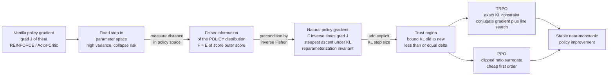

# 🎮 Natural Policy Gradients in RL

> [!abstract] TL;DR
> A vanilla **policy gradient** (REINFORCE, actor-critic) improves a parameterized policy $\pi_\theta(a\mid s)$ by ascending the expected-return gradient $\nabla_\theta J(\theta) = \mathbb{E}[\nabla_\theta \log \pi_\theta \cdot A]$ — but it measures step size in raw **parameter units**, so equal-sized steps can barely move behaviour or wreck it, making training high-variance and prone to collapse. The **natural policy gradient** (Kakade, 2001) fixes this by preconditioning with the **inverse Fisher information of the policy's action distribution**, $\tilde{g} = F^{-1}\nabla_\theta J$ — the steepest-ascent direction when distance is measured by **KL divergence between policies**, not Euclidean distance in $\theta$. This makes the update **invariant to how the policy is parameterized** and controls how much *behaviour* actually changes per step. **TRPO** turns this into an explicit **trust region** — cap $D_{\mathrm{KL}}(\pi_{\text{old}} \,\|\, \pi_{\text{new}}) \le \delta$ each update for near-monotonic improvement — and **PPO** is its cheap clipped surrogate, the practical workhorse behind game-playing agents, robot control, and RLHF fine-tuning of LLMs. It is information geometry doing the heavy lifting in modern RL.

---

## Intuition

**Analogy — steering a ship by how far it actually moves, not how far you turn the wheel.** A reinforcement-learning agent improves by nudging its policy — its probability of choosing each action — toward higher reward. But the *numbers* defining the policy (network weights, softmax logits) are like a ship's wheel with an unpredictable gear ratio: in a calm stretch you can spin the wheel a full turn and the ship barely drifts, while in a tight channel a hair's twitch swings it hard into the rocks. If you always turn the wheel the same amount — a fixed step in parameter space — you either crawl or you capsize. One bad step and the agent forgets everything it learned.

The fix is pure **information geometry**. Instead of measuring step size by how far you turned the wheel (Euclidean distance in parameters), you measure it by **how much the ship actually moved** — how much the policy's action distribution truly changed, quantified by **KL divergence**. The **Fisher information matrix** is the local "gear ratio" between wheel turns and real motion; dividing the raw gradient by it (preconditioning by $F^{-1}$) converts every step into a controlled, equal-*behaviour* nudge. This "natural" step keeps the agent on a stable, steady path of improvement — invariant to how you happened to wire up the policy — and it is the quiet secret behind the algorithms that mastered Atari, Go, StarCraft, robot locomotion, and instruction-following language models.

---

## How It Works

### Core mechanics

1. **Start from the policy gradient.** For a stochastic policy $\pi_\theta(a\mid s)$ and return objective $J(\theta) = \mathbb{E}_{\tau\sim\pi_\theta}[R(\tau)]$, the **policy gradient theorem** (via the log-derivative trick) gives
$$\nabla_\theta J(\theta) = \mathbb{E}_{\pi_\theta}\!\Big[\nabla_\theta \log \pi_\theta(a\mid s)\; A^{\pi}(s,a)\Big],$$
where $A^\pi$ is the advantage. REINFORCE plugs in the Monte-Carlo return; actor-critic plugs in a learned advantage.

2. **See why raw ascent is dangerous.** Gradient ascent $\theta \leftarrow \theta + \alpha \nabla_\theta J$ takes a fixed step in **parameter space**. But the map from $\theta$ to the *distribution* $\pi_\theta$ is wildly non-uniform: near-deterministic policies (logits large) are hypersensitive — a small $\Delta\theta$ produces an enormous shift in behaviour and can collapse the policy irrecoverably; elsewhere the same $\Delta\theta$ barely moves anything and learning stalls. Euclidean distance in $\theta$ is the wrong ruler.

3. **Measure distance in policy space with KL.** The right ruler is the **KL divergence** between the old and new action distributions. Its second-order (local) form *is* the **Fisher information metric of the policy**:
$$D_{\mathrm{KL}}\!\big(\pi_\theta \,\|\, \pi_{\theta+\Delta\theta}\big) \approx \tfrac12\,\Delta\theta^\top F(\theta)\,\Delta\theta,\qquad F(\theta) = \mathbb{E}_{\pi_\theta}\!\big[\nabla_\theta \log \pi_\theta \,\nabla_\theta \log \pi_\theta^\top\big].$$
Crucially $F$ is the Fisher of the **policy's action distribution** — an expectation of outer products of the *score of the policy* — not the covariance of returns.

4. **Precondition to get the natural gradient.** Solve "steepest ascent subject to a small fixed KL budget." The Lagrangian optimum is the **natural policy gradient**:
$$\tilde{g} = F(\theta)^{-1}\,\nabla_\theta J(\theta).$$
Because both $\nabla_\theta J$ and $F$ transform consistently under a change of coordinates, $\tilde g$ points to the *same distribution-space direction* regardless of parameterization — **reparameterization invariance**. The step no longer over-reacts where the policy is brittle or freeze where it is flat.

5. **Impose an explicit trust region (TRPO).** Instead of an implicit fixed KL budget, **TRPO** solves a constrained problem each update — maximize the surrogate advantage subject to $\mathbb{E}[D_{\mathrm{KL}}(\pi_{\text{old}} \,\|\, \pi_{\text{new}})] \le \delta$ — using a conjugate-gradient natural step plus a line search that enforces the constraint, yielding a **near-monotonic improvement guarantee**. The KL-optimal step length is
$$\eta = \sqrt{\frac{2\delta}{\tilde g^\top F\,\tilde g}}, \qquad \theta_{\text{new}} = \theta + \eta\,\tilde g.$$

6. **Approximate it cheaply (PPO).** TRPO's exact Fisher-vector second-order machinery is expensive. **PPO** replaces the hard KL constraint with a **clipped probability-ratio surrogate** that penalizes moving the ratio $\pi_\theta/\pi_{\text{old}}$ outside $[1-\varepsilon, 1+\varepsilon]$ — a first-order, mini-batch-friendly stand-in for the trust region. It captures most of the stability at a fraction of the cost and is the default in practice.

This chain — REINFORCE $\to$ Fisher preconditioning $\to$ natural gradient $\to$ KL trust region $\to$ TRPO/PPO — is the same **mirror-descent-on-policies** idea: take the largest reward-improving step whose *Bregman/KL* displacement stays within budget. See the sibling notes *Natural_Gradient_Descent*, *Mirror_Descent_and_Bregman_Optimization*, and *Information_Geometry_of_Deep_Learning* for the general optimization story, and *The_Fisher_Information_Metric* / *Kullback_Leibler_Divergence_and_Geometry* for the geometric primitives.

### Flow



---

## Key Concepts

**Secondary (intuitive first pass).**
- A policy is a probability recipe for choosing actions; RL learns it by making rewarding actions more likely.
- Changing the policy's raw numbers by a fixed amount is unreliable — sometimes nothing happens, sometimes the agent breaks.
- The natural fix measures step size by *how much the behaviour actually changed*, so every step is a safe, equal-sized nudge.
- Trust-region methods (TRPO/PPO) just cap that change per update so the agent never leaps off a cliff.

**Undergraduate (mechanism and formulas).**
- **Policy gradient theorem:** $\nabla_\theta J = \mathbb{E}[\nabla_\theta \log \pi_\theta \cdot A]$; the log-derivative trick makes the gradient an expectation over sampled trajectories.
- **Fisher of the policy:** $F(\theta) = \mathbb{E}_{\pi_\theta}[\nabla_\theta \log\pi_\theta \nabla_\theta \log\pi_\theta^\top]$ is the local metric because $D_{\mathrm{KL}} \approx \tfrac12\Delta\theta^\top F\Delta\theta$.
- **Natural policy gradient:** $\tilde g = F^{-1}\nabla_\theta J$ — the reparameterization-invariant steepest-ascent direction.
- **KL step size:** $\eta = \sqrt{2\delta / (\tilde g^\top F \tilde g)}$ keeps each update inside a KL ball of radius $\delta$.
- **PPO clip:** replace the constraint with $\min\big(\rho A,\ \mathrm{clip}(\rho, 1-\varepsilon, 1+\varepsilon)A\big)$ where $\rho = \pi_\theta/\pi_{\text{old}}$.

**Graduate (geometry and guarantees).**
- The natural gradient is the Riemannian gradient on the **statistical manifold of policies** with the Fisher-Rao metric; it is the unique (up to scale) invariant direction by Chentsov-type uniqueness.
- **Mirror-descent / proximal view:** the update solves $\max_\theta \langle \nabla_\theta J, \Delta\theta\rangle - \tfrac1\eta D_{\mathrm{KL}}$, i.e. proximal ascent with a KL (Bregman) regularizer — connecting NPG to mirror descent and the *compatible function approximation* of Sutton-Kakade.
- **TRPO monotonic improvement:** a surrogate lower bound $J(\pi_{\text{new}}) \ge L_{\pi_{\text{old}}}(\pi_{\text{new}}) - C\,\max_s D_{\mathrm{KL}}$ guarantees improvement when the KL is bounded; TRPO enforces this as a hard constraint, PPO as a soft penalty/clip.
- **Estimation:** $F$ is never formed explicitly at scale — TRPO uses **Fisher-vector products** (a Hessian-free trick on the KL) inside conjugate gradient; the natural step is $F^{-1}g$ solved iteratively.
- **On-policy caveat:** the whole construction assumes samples come from $\pi_{\text{old}}$; large KL steps make the importance-sampling surrogate invalid, which is exactly why the trust region exists.

---

## Python Demo

```python
# Natural Policy Gradient vs vanilla REINFORCE on a tiny 1-state MDP (a K-armed bandit)
# with a SOFTMAX policy. We show:
#   (a) the natural gradient (precondition by inverse Fisher of the POLICY) converges
#       faster and does not stall when the optimal action starts at low probability
#       -> parameterization invariance;
#   (b) the TRUST-REGION idea (TRPO): bound KL(pi_old || pi_new) per step keeps updates
#       safe, while an aggressive fixed-step natural update spikes the KL (destructive).
import numpy as np
import matplotlib.pyplot as plt

rng = np.random.default_rng(0)

# --- Tiny RL problem: a K-armed bandit = a single-state MDP ---
rewards = np.array([1.0, 0.5, 0.2, 0.8, 1.5])   # arm 4 is optimal
K       = len(rewards)
J_opt   = rewards.max()

def softmax(theta):
    z = theta - theta.max()
    e = np.exp(z)
    return e / e.sum()

def expected_return(theta):
    return softmax(theta) @ rewards

def policy_gradient(theta):
    # exact vanilla policy gradient of J wrt logits: g_i = pi_i * (r_i - E[r])
    pi = softmax(theta)
    return pi * (rewards - pi @ rewards)

def fisher(theta):
    # Fisher information of the categorical softmax POLICY: diag(pi) - pi pi^T
    pi = softmax(theta)
    return np.diag(pi) - np.outer(pi, pi)

def natural_gradient(theta, damping=1e-6):
    # F is rank-deficient (softmax over-parameterization) -> damped solve
    g = policy_gradient(theta)
    F = fisher(theta)
    return np.linalg.solve(F + damping * np.eye(K), g)

def kl(theta_old, theta_new):
    p, q = softmax(theta_old), softmax(theta_new)
    return float(np.sum(p * (np.log(p + 1e-12) - np.log(q + 1e-12))))

# The optimal arm starts VERY unlikely: this is where vanilla PG stalls
# (its gradient carries a pi_i factor) but the natural gradient does not.
theta0 = np.array([0.0, 0.0, 0.0, 0.0, -4.0])
n_iters = 150
lr      = 1.0

def run(kind, theta_init):
    theta = theta_init.copy()
    curve = [expected_return(theta)]
    for _ in range(n_iters):
        g = natural_gradient(theta) if kind == "natural" else policy_gradient(theta)
        theta = theta + lr * g
        curve.append(expected_return(theta))
    return np.array(curve)

curve_vanilla = run("vanilla", theta0)
curve_natural = run("natural", theta0)

# --- Trust-region comparison: aggressive fixed natural step vs KL-bounded TRPO step ---
delta = 0.01   # KL budget per update
def run_kl(mode):
    theta = theta0.copy()
    kls, rets = [], [expected_return(theta)]
    for _ in range(n_iters):
        g_nat = natural_gradient(theta)
        F     = fisher(theta)
        quad  = float(g_nat @ (F @ g_nat)) + 1e-12
        if mode == "trpo":
            eta = np.sqrt(2 * delta / quad)      # KL-optimal step length
        else:                                    # aggressive fixed step
            eta = 6.0
        theta_new = theta + eta * g_nat
        kls.append(kl(theta, theta_new))
        theta = theta_new
        rets.append(expected_return(theta))
    return np.array(kls), np.array(rets)

kl_fixed, _ = run_kl("fixed")
kl_trpo,  _ = run_kl("trpo")

# --- Plots ---
fig, ax = plt.subplots(1, 2, figsize=(12, 4.6))

ax[0].axhline(J_opt, ls="--", c="gray", lw=1, label="optimal return")
ax[0].plot(curve_vanilla, c="#ff6b6b", lw=2, label="vanilla policy gradient (REINFORCE)")
ax[0].plot(curve_natural, c="#4a9eff", lw=2, label="natural policy gradient (inverse Fisher)")
ax[0].set_xlabel("iteration"); ax[0].set_ylabel("expected return J(theta)")
ax[0].set_title("Learning curves: natural gradient converges faster\n(optimal arm starts unlikely -> vanilla stalls)")
ax[0].legend(loc="lower right"); ax[0].grid(alpha=0.3)

ax[1].axhline(delta, ls="--", c="green", lw=1.5, label=f"KL budget delta = {delta}")
ax[1].semilogy(kl_fixed, c="#ff6b6b", lw=2, label="aggressive fixed natural step (destructive)")
ax[1].semilogy(np.maximum(kl_trpo, 1e-9), c="#4a9eff", lw=2, label="TRPO KL-bounded step")
ax[1].set_xlabel("iteration"); ax[1].set_ylabel("KL(pi_old || pi_new)  [log scale]")
ax[1].set_title("Trust region: bounding per-step KL prevents\ndestructive policy updates")
ax[1].legend(loc="upper right"); ax[1].grid(alpha=0.3, which="both")

plt.tight_layout()
plt.savefig("natural_policy_gradient_demo.png", dpi=110)
print(f"vanilla final return = {curve_vanilla[-1]:.4f} (optimal {J_opt:.4f})")
print(f"natural final return = {curve_natural[-1]:.4f} (optimal {J_opt:.4f})")
print(f"fixed-step max KL/iter = {kl_fixed.max():.3f}   TRPO max KL/iter = {kl_trpo.max():.4f}")
```

**What you see.** *Left:* both methods start with the optimal arm nearly forbidden ($\pi_4 \approx 0.018$). The vanilla gradient carries a $\pi_i$ factor, so its push on the good-but-unlikely arm is tiny — it crawls. The natural gradient divides that factor out via $F^{-1}$ (for this bandit $\tilde g = r - \bar r\,\mathbf{1}$, independent of the current probabilities), so it climbs to the optimum in a handful of steps — the concrete face of **parameterization invariance**. *Right:* the KL-optimal TRPO step length pins the per-update KL essentially flat at the budget $\delta$, while an aggressive fixed natural step blows the KL up by orders of magnitude — the kind of leap that erases a learned policy. Bounding behaviour-change, not parameter-change, is what makes modern policy-gradient RL stable.

---

## Real-World Applications

- **Game-playing agents.** OpenAI Five (Dota 2) and much of the Atari/continuous-control literature are trained with **PPO** — the clipped trust-region surrogate — precisely because unbounded policy-gradient steps collapse long-horizon strategies. DeepMind's AlphaStar (StarCraft II) combined actor-critic policy gradients with trust-region-style stabilization at massive scale.
- **Robotics and continuous control.** TRPO and PPO are standard for learning locomotion and manipulation policies (MuJoCo humanoid, quadruped gaits, dexterous hands) where the action space is continuous and a single bad update can destabilize a physically meaningful controller. See *Reinforcement_Learning_for_Control*.
- **RLHF for LLMs.** The reinforcement-learning-from-human-feedback stage that aligns models like ChatGPT uses **PPO** to fine-tune the language-model policy against a learned reward model, with a KL penalty to the reference model — an explicit trust region keeping the fine-tuned policy from drifting into degenerate text. See *RLHF* and *PPO*.
- **Recommendation and operations RL.** Policy-gradient systems in ad allocation, bidding, and sequential recommendation adopt trust-region updates to avoid abrupt, revenue-damaging policy shifts between deployments.

---

## Common Pitfalls

- **Fisher of the policy vs "Fisher of the returns."** The metric is the Fisher information of the **action distribution** $\pi_\theta(a\mid s)$ — an expected outer product of the *policy score* $\nabla_\theta\log\pi_\theta$. It is *not* the covariance of returns, nor the Gauss-Newton/Hessian of the reward. Preconditioning by the wrong matrix gives a direction with no invariance guarantee and no KL interpretation.
- **Estimating the Fisher from samples.** At scale you never form $F$; you estimate Fisher-vector products $F v$ from mini-batches (differentiating the KL). Too few samples give a noisy, ill-conditioned $F$, so damping/regularization ($F + \lambda I$) and conjugate-gradient truncation are essential — otherwise $F^{-1}g$ explodes. The softmax Fisher is also rank-deficient (over-parameterization), which *requires* damping.
- **TRPO's exact cost vs PPO's clipped approximation.** TRPO's constrained natural step (conjugate gradient + line search + Fisher-vector products) is expensive and fiddly. PPO's clip is a *cheap surrogate* for the trust region, not an equivalent: it bounds the probability ratio, not the KL directly, so it can still take over-large steps on some samples. Monitor the empirical KL; add a KL penalty or early-stop the epoch if it drifts.
- **On-policy sample inefficiency.** The trust-region/surrogate objective is only valid near $\pi_{\text{old}}$, so data cannot be freely reused like off-policy replay. Running too many gradient epochs on one rollout, or taking too large a KL step, invalidates the importance-sampling surrogate and causes silent collapse — the tension between sample efficiency and staying inside the trust region is fundamental.

---

## Related Concepts

- [[The_Fisher_Information_Metric]] — the exact metric that preconditions the gradient; NPG *is* Riemannian ascent under this metric.
- [[Kullback_Leibler_Divergence_and_Geometry]] — KL is the "step-size ruler" in policy space; its local form is the Fisher matrix.
- [[Policy_Gradient_Methods]] — the REINFORCE/actor-critic/PPO family that NPG stabilizes; direct parent topic.
- [[PPO]] — the clipped-surrogate approximation to the KL trust region; the practical workhorse.
- [[RL_Fundamentals]] — MDPs, value functions, and returns that define the objective $J(\theta)$.
- [[Deep_Q_Networks]] — the value-based alternative; contrast off-policy replay with on-policy trust-region PG.
- [[RLHF]] — PPO with a KL trust region to a reference policy is the core of LLM alignment.
- [[Reinforcement_Learning_for_Control]] — robotics/continuous-control use of TRPO/PPO.
- [[Fisher_Information_and_the_Cramer_Rao_Bound]] — the statistical Fisher information underpinning the policy metric.
- [[Trust_Region]] — the general constrained-step optimization idea TRPO instantiates in KL geometry.
- [[KKT_Conditions]] — the constrained-optimization machinery behind the KL-constrained TRPO subproblem.
- [[Reinforcement_Learning]] — the broader RL setting these methods live in.

---

## Review Questions

1. **(Secondary)** Why can taking a fixed-size step in a policy's raw parameters be dangerous, and what does the natural gradient measure instead to keep updates safe?
2. **(Undergraduate)** Write the natural policy gradient $\tilde g = F^{-1}\nabla_\theta J$ and derive the KL-optimal step length $\eta = \sqrt{2\delta/(\tilde g^\top F \tilde g)}$ from a second-order KL trust-region constraint. Why is $\tilde g$ invariant to reparameterization while $\nabla_\theta J$ is not?
3. **(Undergraduate/Graduate)** In the softmax-bandit demo the vanilla gradient stalls when the optimal arm starts unlikely, but the natural gradient does not. Show that the vanilla gradient is $g_i = \pi_i(r_i - \bar r)$ while the natural gradient is $r_i - \bar r$, and explain mechanistically why the $\pi_i$ factor causes the stall.
4. **(Graduate)** Given a fixed compute budget and a high-dimensional policy network, would you choose TRPO or PPO, and why? Address Fisher-vector-product cost, the validity window of the importance-sampling surrogate, and how you would monitor the empirical KL to detect a violated trust region.

---

## Sources

- Kakade, S. (2001). *A Natural Policy Gradient.* Advances in Neural Information Processing Systems (NeurIPS) 14.
- Amari, S. (1998). *Natural Gradient Works Efficiently in Learning.* Neural Computation, 10(2), 251–276.
- Schulman, J., Levine, S., Moritz, P., Jordan, M., Abbeel, P. (2015). *Trust Region Policy Optimization (TRPO).* ICML 2015. arXiv:1502.05477.
- Schulman, J., Wolski, F., Dhariwal, P., Radford, A., Klimov, O. (2017). *Proximal Policy Optimization Algorithms (PPO).* arXiv:1707.06347.
- Peters, J. & Schaal, S. (2008). *Natural Actor-Critic.* Neurocomputing, 71(7–9), 1180–1190.

---

#information-geometry #reinforcement-learning #natural-policy-gradient #trpo #trust-region
