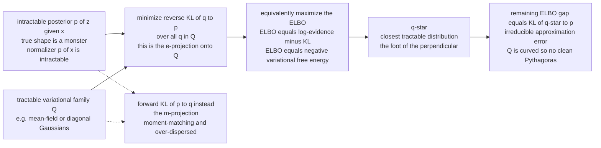

# 📐 Variational Inference and Geometry

> [!abstract] TL;DR
> The exact Bayesian posterior $p(z\mid x)$ is usually a **monstrous, intractable shape** — its normalizer $p(x)=\int p(x,z)\,dz$ is an impossible integral. **Variational inference (VI)** stops fighting it and instead finds the **closest tractable distribution** $q$ inside a chosen family $\mathcal{Q}$ (a Gaussian, a mean-field product) by minimizing a KL divergence. Geometrically this is a **projection**: dropping the intractable posterior onto the variational family, with KL as the ruler. Maximizing the **ELBO** $=$ minimizing the **reverse** $\mathrm{KL}(q\,\|\,p)$ $=$ minimizing the **variational free energy** — one triple-equivalent objective, and the leftover gap *is* $\mathrm{KL}(q^\star\,\|\,p)$. **Which KL direction you use decides the shape of the answer**: reverse-KL VI is the **e-projection** — *mode-seeking* and *under-dispersed* (it shrinks inside the posterior); forward-KL / expectation propagation is the **m-projection** — *moment-matching* and *over-dispersed*. Because the variational family is generally a **curved submanifold**, this projection is *not* the clean dually-flat Pythagorean case, which is exactly where the approximation error lives.

---

## Intuition

**Analogy — trace the coastline with a rubber band.** Imagine the true posterior is the wild, jagged coastline of a fjord — every inlet, cliff, and correlation mapped out. You cannot afford to store the whole thing; worse, you can never even finish surveying it (that survey is the intractable evidence integral). So you make peace with the impossible: you take a **simple elastic loop** — an ellipse, say — and you stretch and pin it to hug the coastline as closely as your simple shape allows. You do not reproduce the coast; you find the *nearest simple stand-in*. "Nearest" needs a ruler, and the ruler here is **KL divergence** — how many extra bits you waste using the stand-in instead of the truth.

That single act — dropping the intractable posterior onto a family of tractable shapes, using KL to measure "closest" — is **literally a projection**, the same move as dropping a perpendicular from a point onto a plane. Information geometry adds the twist that matters most in practice: KL is **asymmetric**, so there are *two* rulers. Measure "closest" with the reverse KL and your ellipse dives *inside* the coast, clinging to one bay and **under-representing** the true spread (standard VI, mode-seeking). Measure it with the forward KL and your ellipse balloons to *cover* the whole coastline, over-spreading across bays (expectation propagation, moment-matching). **The direction of the ruler dictates whether your approximation hugs a mode or blankets them all** — before any equation, that is the whole story of variational inference.

---

## How It Works

### Core mechanics

1. **The problem.** Bayesian inference wants the posterior $p(z\mid x)=p(x,z)/p(x)$. The evidence $p(x)=\int p(x,z)\,dz$ is intractable, so the posterior's *shape* is known (the unnormalized $p(x,z)$) but its *normalizer* is not. You cannot sample it cheaply or write it in closed form.
2. **The family.** Choose a tractable **variational family** $\mathcal{Q}$ — e.g. all diagonal Gaussians, or all **mean-field** (factorized) distributions $q(z)=\prod_i q_i(z_i)$. Each member is easy to sample, integrate, and store.
3. **The objective.** Find the member closest to the posterior by minimizing the **reverse KL**:
   $$q^\star=\arg\min_{q\in\mathcal{Q}}\ \mathrm{KL}\big(q(z)\,\|\,p(z\mid x)\big).$$
4. **The ELBO trick.** That KL still contains the intractable $p(x)$. But the exact identity
   $$\log p(x)=\underbrace{\mathbb{E}_q[\log p(x,z)]-\mathbb{E}_q[\log q(z)]}_{\text{ELBO}(q)}\ +\ \mathrm{KL}\big(q\,\|\,p(z\mid x)\big)$$
   splits the (fixed) log-evidence into a computable **Evidence Lower BOund** plus the KL gap. Since $\log p(x)$ is constant, **maximizing the ELBO** $=$ **minimizing the KL** $=$ **minimizing the variational free energy** $F[q]=-\mathrm{ELBO}(q)=\langle E\rangle_q-H[q]$ with energy $E=-\log p(x,z)$. The ELBO is a true lower bound: $\mathrm{ELBO}(q)\le\log p(x)$, and the **gap is exactly** $\mathrm{KL}(q^\star\,\|\,p)$.
5. **The geometry.** Minimizing $\mathrm{KL}(q\,\|\,p)$ over $q\in\mathcal{Q}$ with $p$ fixed is the **e-projection** (information / I-projection) of the posterior onto the family. In a dually-flat world this projection would obey the generalized Pythagorean theorem exactly — a clean, unique perpendicular. Real variational families are usually **curved submanifolds**, so the projection is only *approximately* Pythagorean: local optima appear and the ELBO is non-convex.

### Forward vs reverse KL — the two projections

- **Reverse KL** $\mathrm{KL}(q\,\|\,p)=\mathbb{E}_q[\log q-\log p]$ — the standard VI objective. It is the **e-projection**. Because the expectation is under $q$, it heavily penalizes putting mass where $p$ is tiny, so $q$ **retreats into a single mode** and comes out **under-dispersed** (it fits a *conditional* slice, ignoring the width the correlations add).
- **Forward KL** $\mathrm{KL}(p\,\|\,q)=\mathbb{E}_p[\log p-\log q]$ — the **m-projection**, used by expectation propagation (EP). The expectation is under $p$, so $q$ is punished for putting *zero* mass where $p$ has any, forcing $q$ to **cover the whole support** and **match moments** — hence over-dispersed. It needs expectations under the intractable $p$, which is why it is usually harder than reverse-KL VI.

### Mean-field, natural gradients, amortization

- **Mean-field** $q=\prod_i q_i$ makes the e-projection tractable via **coordinate ascent** (CAVI): cyclically I-project onto each factor holding the rest fixed. This is alternating minimization — the same projection skeleton as the em-algorithm — but it structurally **cannot represent correlations**, so it under-estimates variance.
- **Natural-gradient VI** optimizes the variational parameters under the **Fisher–Rao metric** of $\mathcal{Q}$ rather than raw Euclidean gradients, following the steepest path in *distribution* space and converging far faster (stochastic VI, natural-gradient VI).
- **Amortized inference** replaces per-datapoint optimization with an **encoder network** $q_\phi(z\mid x)$ that *predicts* the variational parameters — the move that turns VI into the **VAE**.

### Flow / architecture



---

## Key Concepts

### Secondary (plain-language core)

- **Projection, not computation.** The true posterior is too complex to compute, so VI finds the *closest simple distribution* to it — geometrically, it drops the posterior onto a family of easy shapes.
- **KL is the ruler.** "Closest" is measured in KL divergence (wasted bits), and because KL is one-directional, the *direction you measure in* changes the answer.
- **Reverse KL hugs a mode.** Standard VI uses reverse KL: the fit dives inside the posterior, tight and confident, but **under-estimates the true spread**.
- **Forward KL covers everything.** The other direction spreads the fit to blanket the whole posterior — over-dispersed, moment-matching.
- **ELBO going up = fit getting tighter.** You cannot see the KL gap directly, but you can watch the ELBO climb; every step up is the projection tightening onto the posterior.

### Undergraduate (working machinery)

- **The evidence decomposition.** $\log p(x)=\mathrm{ELBO}(q)+\mathrm{KL}(q\,\|\,p(z\mid x))$; the log-evidence is fixed, so raising the ELBO lowers the KL by the same amount.
- **Reconstruction minus rate.** $\mathrm{ELBO}=\mathbb{E}_q[\log p(x\mid z)]-\mathrm{KL}(q(z\mid x)\,\|\,p(z))$ — fit the data while paying a bit-cost for the latent code (the VAE objective).
- **Free-energy identity.** $F[q]=-\mathrm{ELBO}=\langle E\rangle_q-H[q]$ with $E=-\log p(x,z)$; minimizing variational free energy *is* VI (the Gibbs–Bogoliubov bound).
- **Mean-field CAVI.** Optimal factor $\log q_i^\star(z_i)=\mathbb{E}_{q_{-i}}[\log p(x,z)]+\text{const}$; cyclic updates monotonically raise the ELBO.
- **Under-dispersion, exactly.** For a correlated Gaussian target with precision $\Lambda=\Sigma^{-1}$, the mean-field reverse-KL fit gives marginal variance $1/\Lambda_{ii}\le\Sigma_{ii}$ — it matches the *conditional*, not the *marginal*, variance.

### Graduate (structural payoff)

- **e-projection vs m-projection.** Reverse-KL VI ($\min_q \mathrm{KL}(q\,\|\,p)$) is the **e-projection**; forward-KL / EP ($\min_q \mathrm{KL}(p\,\|\,q)$) is the **m-projection**. In Amari's notation the m-projection $\min_Q D(R\,\|\,Q)$ yields moment matching; the e-projection $\min_Q D(Q\,\|\,R)$ yields the mode-seeking VI fit.
- **Why it is not Pythagorean.** The generalized Pythagorean theorem gives a *unique, cross-term-free* projection only when the target submanifold is **flat** in the correct dual sense. Mean-field / structured families are e-flat but generally **not m-flat**, so the e-projection lacks a clean decomposition — the ELBO can be **non-concave** with multiple local optima, and the "distance" you minimize is not additive.
- **Natural-gradient VI.** The ELBO's steepest-ascent direction in the Fisher–Rao geometry of $\mathcal{Q}$ is $\tilde\nabla=G^{-1}\nabla$ with $G$ the Fisher matrix; for exponential-family $q$ this reduces to elegant updates in the natural/expectation parameters (stochastic VI, natural-gradient VI, conjugate-computation VI).
- **The unifying picture.** MLE (m-projection of data onto a model), MaxEnt (e-projection onto a constraint set), the em-algorithm (alternating e/m projections), and VI (e-projection onto a variational family) are **all KL projections** — the same geometry with different fixed points and different flat surfaces.
- **Structured variational families.** Moving beyond mean-field (structured VI, normalizing flows, mixtures) *curves and enriches* $\mathcal{Q}$ to shrink the projection gap at the cost of tractability — trading Pythagorean cleanliness for expressiveness.

---

## Python Demo

```python
# numpy + matplotlib only.
# VARIATIONAL INFERENCE AS AN INFORMATION PROJECTION.
#
# Target p : a strongly CORRELATED 2D Gaussian, N(0, Sigma) with rho = 0.8 -- stand-in
# for an intractable posterior. We project it onto the MEAN-FIELD (factorized, diagonal)
# Gaussian family Q using the two KL directions and watch the geometry:
#
#   (1) REVERSE KL  min_q KL(q||p)   = the e-projection = standard VI.
#       Coordinate-ascent (CAVI) fixed point -> marginal variance 1/Lambda_ii.
#       This UNDER-DISPERSES: it clings inside the target, matching the CONDITIONAL
#       (not the marginal) width -> mode-seeking, over-confident.
#
#   (2) FORWARD KL  min_q KL(p||q)   = the m-projection = EP / moment matching.
#       Optimum -> marginal variance Sigma_ii. It COVERS the target's spread
#       -> over-dispersed relative to reverse KL.
#
# We also track the ELBO ascending during CAVI: ELBO going up == the projection
# tightening, its ceiling below log p(x) is the irreducible KL(q*||p) gap.

import numpy as np
import matplotlib.pyplot as plt

rho = 0.8
Sigma = np.array([[1.0, rho], [rho, 1.0]])     # correlated target covariance
Lam   = np.linalg.inv(Sigma)                   # precision Lambda = Sigma^-1
k     = 2

def kl_q_p(m, s2):
    """KL( N(m, diag(s2)) || N(0, Sigma) ) in nats  (p is normalized)."""
    S = np.diag(s2)
    return 0.5 * (np.trace(Lam @ S) + m @ Lam @ m - k
                  + np.log(np.linalg.det(Sigma)) - np.log(np.prod(s2)))

# log p(x) here is 0 (p is a normalized density), so ELBO = -KL(q||p) <= 0,
# and the ELBO gap at convergence is exactly KL(q*||p).
def elbo(m, s2):
    return -kl_q_p(m, s2)

# -------- (1) reverse-KL VI via mean-field coordinate ascent (CAVI) ----------
m  = np.array([1.6, -1.6])       # deliberately bad start
s2 = np.array([2.0, 2.0])
elbo_hist = [elbo(m, s2)]
for sweep in range(15):
    for i in range(k):
        j = 1 - i
        s2[i] = 1.0 / Lam[i, i]                        # optimal factor variance
        m[i]  = -(1.0 / Lam[i, i]) * Lam[i, j] * m[j]  # optimal factor mean (mu = 0)
        elbo_hist.append(elbo(m, s2))
m_rev, s2_rev = m.copy(), s2.copy()

# -------- (2) forward-KL / EP optimum : match the MARGINAL variances ----------
m_fwd  = np.zeros(k)
s2_fwd = np.array([Sigma[0, 0], Sigma[1, 1]])          # = [1, 1]

print(f"target marginal variance (both dims) : {Sigma[0,0]:.3f}")
print(f"reverse-KL VI  variance  (e-proj)    : {s2_rev[0]:.3f}   <-- UNDER-dispersed")
print(f"forward-KL/EP  variance  (m-proj)    : {s2_fwd[0]:.3f}   <-- moment-matching")
print(f"ELBO gap  KL(q*||p)  (nats)          : {kl_q_p(m_rev, s2_rev):.4f}")

# =============================== plots =======================================
def gauss2d(X, Y, mean, cov):
    pos = np.dstack((X, Y)) - mean
    inv, det = np.linalg.inv(cov), np.linalg.det(cov)
    quad = np.einsum('...i,ij,...j->...', pos, inv, pos)
    return np.exp(-0.5 * quad) / (2 * np.pi * np.sqrt(det))

g = np.linspace(-3.2, 3.2, 240)
X, Y = np.meshgrid(g, g)
fig, ax = plt.subplots(1, 3, figsize=(15, 4.6))

# panel 1 : target + the two projections as contour ellipses
ax[0].contour(X, Y, gauss2d(X, Y, np.zeros(2), Sigma), levels=5,
              colors="black", linewidths=1.2)
ax[0].contour(X, Y, gauss2d(X, Y, m_rev, np.diag(s2_rev)), levels=5,
              colors="crimson", linewidths=1.2)
ax[0].contour(X, Y, gauss2d(X, Y, m_fwd, np.diag(s2_fwd)), levels=5,
              colors="steelblue", linestyles="--", linewidths=1.2)
ax[0].plot([], [], color="black",     label="target p  (correlated)")
ax[0].plot([], [], color="crimson",   label="reverse KL  (VI, e-proj)")
ax[0].plot([], [], color="steelblue", ls="--", label="forward KL  (EP, m-proj)")
ax[0].set_title("VI hugs inside; EP covers the spread")
ax[0].set_xlabel("z1"); ax[0].set_ylabel("z2")
ax[0].set_aspect("equal"); ax[0].legend(fontsize=8, loc="upper left")

# panel 2 : ELBO ascent during CAVI  (projection tightening)
ax[1].plot(elbo_hist, "o-", color="crimson", ms=4)
ax[1].axhline(0.0, color="gray", ls=":", label="log-evidence ceiling (ELBO max)")
ax[1].set_title("ELBO ascent = projection tightening")
ax[1].set_xlabel("coordinate-ascent update")
ax[1].set_ylabel("ELBO  (= -KL(q||p))")
ax[1].legend(fontsize=8, loc="lower right")

# panel 3 : the variances, side by side
labels = ["target\nmarginal", "reverse KL\n(VI)", "forward KL\n(EP)"]
vals   = [Sigma[0, 0], s2_rev[0], s2_fwd[0]]
ax[2].bar(labels, vals, color=["black", "crimson", "steelblue"])
ax[2].set_title("reverse KL under-estimates variance")
ax[2].set_ylabel("marginal variance of q")
for i, v in enumerate(vals):
    ax[2].text(i, v + 0.02, f"{v:.2f}", ha="center", fontsize=9)

plt.tight_layout()
plt.savefig("variational_inference_and_geometry.png", dpi=120)
plt.show()
```

**What the output shows.** The printout lands the target marginal variance at `1.00`, the reverse-KL VI fit at `0.36` ($=1/\Lambda_{11}=1-\rho^2$), and the forward-KL/EP fit at `1.00`: the e-projection **under-estimates the spread by nearly threefold**, while the m-projection matches the marginal exactly. Panel 1 makes it visual — the black correlated target, the crimson VI ellipse jammed *inside* it (mode-seeking, over-confident), and the blue dashed EP ellipse *covering* the target's marginal extent (moment-matching). Panel 2 shows the ELBO climbing monotonically to a **ceiling strictly below** the log-evidence: that residual is the irreducible $\mathrm{KL}(q^\star\,\|\,p)\approx 0.51$ nats — the price of projecting onto a curved family that cannot represent the correlation. Panel 3 states the moral in one bar chart: **the direction of the KL ruler is the difference between hugging a slice and covering the whole.**

---

## Real-World Applications

> **Variational autoencoders (VAEs).** A VAE is **amortized VI**: an encoder network $q_\phi(z\mid x)$ predicts the variational Gaussian's mean and variance instead of optimizing them per datapoint, and the reparameterization trick lets the ELBO backpropagate. The projection view explains why vanilla VAEs produce *blurry, over-smoothed* samples — reverse-KL VI under-disperses the latent posterior. See [[Variational_Autoencoders]] and [[Variational_Inference_the_ELBO_and_VAEs]].

> **Probabilistic programming at scale.** Stan's **ADVI**, Pyro, PyMC, and TensorFlow Probability all default to **automatic differentiation VI** with mean-field or full-rank Gaussian families, turning arbitrary Bayesian models into an ELBO-maximization the same way this note describes — a projection onto a Gaussian family in an unconstrained coordinate space.

> **Topic models and large-scale text.** Latent Dirichlet Allocation was popularized by **mean-field VI** (Blei, Ng & Jordan), and **stochastic variational inference** (Hoffman, Blei, Wang & Paisley) scaled it to millions of documents using *natural-gradient* steps — the Fisher-geometry acceleration in action.

> **Sparse Gaussian processes.** Titsias's variational sparse GP places inducing points and **projects** the intractable GP posterior onto a tractable variational distribution by maximizing an ELBO, making GP regression scale from $O(N^3)$ to $O(NM^2)$.

> **Expectation propagation (the m-projection twin).** Where calibrated *uncertainty* matters more than a tight mode — Bayesian classification, signal processing, TrueSkill-style rating systems — EP's forward-KL moment-matching projection is preferred precisely because it does not under-estimate variance.

---

## Common Pitfalls

- **Trusting VI's uncertainty.** Reverse-KL VI is **mode-seeking and under-dispersed** — it systematically *under-estimates* posterior variance and can collapse onto one mode of a multimodal posterior, ignoring the others entirely. VI point estimates are usually fine; VI *credible intervals* are often too narrow. If calibrated uncertainty matters, use forward-KL/EP, importance-weighting, or MCMC.
- **Forgetting the ELBO gap.** The ELBO is a *lower bound*, not the log-evidence. Its ceiling sits below $\log p(x)$ by exactly $\mathrm{KL}(q^\star\,\|\,p)$, so comparing models by their ELBOs can be misleading when their gaps differ. A higher ELBO does not guarantee a better posterior fit.
- **Mean-field erases correlations.** A factorized $q=\prod_i q_i$ *cannot* represent posterior correlation by construction, so it fits the **conditional** variance $1/\Lambda_{ii}$ rather than the **marginal** $\Sigma_{ii}$. On strongly correlated posteriors the shrinkage is severe (the demo's threefold gap). Use structured VI, full-rank Gaussians, or normalizing flows when correlations matter.
- **Assuming a clean Pythagorean projection.** The generalized Pythagorean theorem gives a *unique, additive* projection only onto a **flat** submanifold. Variational families are generally **curved**, so the ELBO is non-convex with multiple local optima — different initializations converge to different $q^\star$. Restart, or use tempering/annealing.
- **Getting the KL direction backwards.** $\mathrm{KL}(q\,\|\,p)$ (reverse, VI, mode-seeking) and $\mathrm{KL}(p\,\|\,q)$ (forward, EP, moment-matching) give *qualitatively different* fits. Naming your objective "the KL" without stating the argument order is the single most common source of confusion in variational methods.
- **Vanilla gradients on the ELBO.** Optimizing variational parameters with raw Euclidean gradients ignores the curved Fisher geometry of $\mathcal{Q}$ and converges slowly or unstably. **Natural-gradient** (Fisher-preconditioned) updates follow the true steepest-ascent direction in distribution space.

---

## Related Concepts

*Cross-vault connections (Glob-verified):*
- [[Variational_Inference_as_Free_Energy_Minimization]] — the statistical-mechanics twin: the negative ELBO *is* the variational free energy $F[q]=\langle E\rangle_q-H[q]$, and this projection is free-energy minimization over a trial family.
- [[Variational_Inference_the_ELBO_and_VAEs]] — the information-theoretic view: the ELBO as reconstruction-minus-rate and the coding interpretation of the KL gap.
- [[Free_Energy_Minimization_and_Variational_Principles]] — the physics-first Gibbs–Bogoliubov bound that gives the same ELBO from equilibrium thermodynamics.
- [[Variational_Autoencoders]] — amortized VI with neural encoder/decoder; the concrete deep-learning instance of this projection.
- [[Bayesian_Statistics]] — supplies the intractable posterior $p(z\mid x)$ that VI approximates and the evidence $p(x)$ that the ELBO lower-bounds.
- [[Statistical_Inference]] — estimation recast as projection; MLE as an m-projection sits alongside VI's e-projection in the same geometric family.

*Siblings in this vault, referenced in prose (Information Geometry):* the **Generalized Pythagorean Theorem** supplies the projection theorem that VI is an *approximate* instance of; **Kullback–Leibler Divergence and Geometry** treats the asymmetric ruler whose *direction* selects e- vs m-projection; **the em-Algorithm and Information Projection** is the alternating-projection cousin (mean-field CAVI shares its skeleton); **Natural Gradient Descent** provides the Fisher-geometry preconditioning behind natural-gradient VI; and **Geometry of Generative Models** extends the projection picture to VAEs, flows, and diffusion.

---

## Review Questions

1. **(Secondary)** In one sentence, why is variational inference described as a *projection* rather than a *computation*? Explain, without formulas, why using the reverse KL as the "ruler" makes the fitted distribution hug a single mode and look over-confident.
2. **(Undergraduate)** Starting from the identity $\log p(x)=\mathrm{ELBO}(q)+\mathrm{KL}(q\,\|\,p(z\mid x))$, show why maximizing the ELBO is equivalent to minimizing the reverse KL, and explain what the *ELBO gap* equals at the optimum. For a correlated Gaussian target, why does a mean-field fit report variance $1/\Lambda_{ii}$ instead of the marginal $\Sigma_{ii}$?
3. **(Graduate)** Classify reverse-KL VI and forward-KL/EP as e- vs m-projections and justify each mode-seeking / moment-matching behavior from the direction of the expectation in the KL. Then explain why the generalized Pythagorean theorem does *not* apply cleanly to a mean-field variational family, and what practical consequence (non-uniqueness, non-convex ELBO) follows from the family being a curved submanifold.

---

## Sources

- Blei, D. M., Kucukelbir, A. & McAuliffe, J. D. (2017). *Variational Inference: A Review for Statisticians*. Journal of the American Statistical Association, 112(518), 859–877. [arXiv:1601.00670](https://arxiv.org/abs/1601.00670)
- Wainwright, M. J. & Jordan, M. I. (2008). *Graphical Models, Exponential Families, and Variational Inference*. Foundations and Trends in Machine Learning, 1(1–2), 1–305. [Publisher](https://www.nowpublishers.com/article/Details/MAL-001)
- Zhang, C., Butepage, J., Kjellstrom, H. & Mandt, S. (2019). *Advances in Variational Inference*. IEEE Transactions on Pattern Analysis and Machine Intelligence, 41(8), 2008–2026. [arXiv:1711.05597](https://arxiv.org/abs/1711.05597)
- Amari, S. & Nagaoka, H. (2000). *Methods of Information Geometry*, Ch. 3 (dual connections, e- and m-projections). AMS / Oxford University Press. [Publisher](https://bookstore.ams.org/mmono-191/)
- Bishop, C. M. (2006). *Pattern Recognition and Machine Learning*, Ch. 10 (variational inference, mean-field, the correlated-Gaussian under-dispersion example, Fig. 10.2). Springer. [Publisher](https://www.microsoft.com/en-us/research/publication/pattern-recognition-machine-learning/)

---

#information-geometry #variational-inference #elbo #kl-divergence #information-projection
