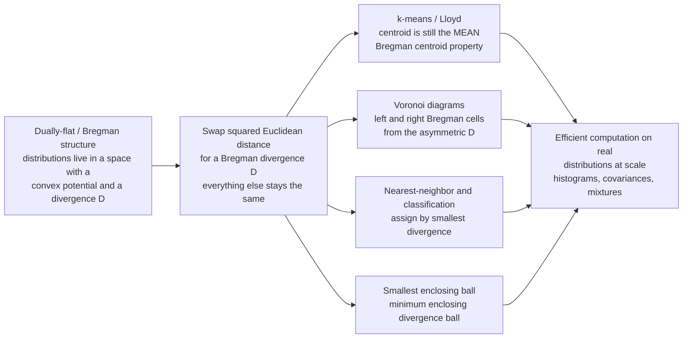

# 🧮 Computational Information Geometry

> [!abstract] TL;DR
> **Computational information geometry** is the *algorithmic* side of the field: instead of admiring the elegant claim that "distributions live on a curved manifold," it actually *computes* with them at scale — clustering histograms, classifying probability vectors, building Voronoi diagrams of distributions, and finding centroids and enclosing balls. The key enabler is the **dually flat / Bregman structure**: because a family of distributions carries a convex potential and an associated **Bregman divergence** (KL for exponential families), the classic algorithms of Euclidean computational geometry — **$k$-means, nearest-neighbor, Voronoi diagrams, smallest-enclosing-ball** — carry over almost *verbatim*, with a single substitution: **replace squared Euclidean distance by the divergence $D$**. The one structural gift that makes this work is the **Bregman centroid theorem** (Banerjee et al.): the arithmetic **mean** minimizes expected Bregman divergence for *every* Bregman divergence, so Lloyd's $k$-means loop is provably correct under KL, Itakura–Saito, or Mahalanobis with **no change to the update rule**. The catches are all about **asymmetry** — $D(p\|q)\neq D(q\|p)$ splits every construction into a *left* and a *right* version (dual centroids, dual Voronoi cells), and boundaries of the simplex (a zero probability) send divergences to infinity, demanding numerical care.

---

## Intuition

**Analogy — the same recipe, one ingredient swapped.** Euclidean computational geometry is a cookbook of beautiful recipes: to cluster points you repeatedly "assign to the nearest center, then move each center to the average of its members" ($k$-means); to classify you find the "nearest" example; to carve space into territories you build a Voronoi diagram of "who is closest." Every recipe leans on one ingredient — the **squared straight-line distance** $\|p-q\|^2$. Now suppose your data points are not dots on a map but whole *probability distributions* — histograms, topic mixtures, covariance matrices — where "straight-line distance" is the wrong notion of closeness and **KL divergence** is the right one. The elegant theory of information geometry says "find the geodesic, drop the perpendicular, cluster the distributions" — but a computer needs actual *algorithms*, not contemplation.

Here is the gift the geometry hands us: because distributions sit in a **dually flat space** with a **Bregman divergence**, you do **not** need new recipes. You keep every Euclidean recipe exactly as written and swap the single ingredient — squared distance $\to$ divergence $D$ — and it still works, because a Bregman divergence secretly *behaves like a squared distance* (its infinitesimal form is the Fisher metric, and its centroid is still the plain arithmetic mean). Computational information geometry is where the geometry stops being decorative and starts crunching real distributions at scale.

---

## How It Works

### Core Mechanics

The whole subject rests on one substitution and one theorem.

1. **The substitution.** Take any Euclidean computational-geometry algorithm phrased in terms of $\tfrac12\|p-q\|^2$. Replace it with a **Bregman divergence** $D_\varphi(p\|q)=\varphi(p)-\varphi(q)-\langle\nabla\varphi(q),p-q\rangle$ generated by a strictly convex potential $\varphi$. Choosing $\varphi=\tfrac12\|x\|^2$ recovers ordinary geometry; choosing $\varphi=\sum x\log x$ gives (generalized) **KL** — the natural distance on the probability simplex. This is exactly the canonical divergence of the underlying *dually flat* / *Bregman* geometry (the sibling notes **Bregman_Divergences** and **Dually_Flat_Spaces** develop the structure this note *computes on*).

2. **The theorem that makes it work — the Bregman centroid.** For *any* Bregman divergence, $\arg\min_c \sum_i w_i\, D_\varphi(x_i\|c) = \frac{\sum_i w_i x_i}{\sum_i w_i}$: the weighted **arithmetic mean**, independent of $\varphi$. Because $k$-means only ever needs "the point minimizing summed distance to a cluster," **Lloyd's algorithm is correct verbatim for every Bregman divergence** — assign to nearest centroid under $D$, then set the centroid to the ordinary mean. Nothing else changes (Banerjee, Merugu, Dhillon & Ghosh, 2005).

3. **Asymmetry splits everything in two.** Because $D_\varphi(p\|q)\neq D_\varphi(q\|p)$, every construction has a **right** form (data in the first slot, $D(x\|c)$ — centroid is the *primal* mean) and a **left** form (data in the second slot, $D(c\|x)$ — centroid is the mean *in dual coordinates* $\eta=\nabla\varphi$). Bregman **Voronoi diagrams** therefore come in dual pairs, and Bregman **centroids** come in left/right/symmetrized flavors.

4. **The combinatorial payoff.** A **Bregman Voronoi diagram** is, in the right (natural) coordinates, an **affine diagram** — a power/Laguerre diagram of hyperplanes — so it has the *same worst-case combinatorial complexity and the same construction algorithms* as an ordinary Euclidean Voronoi diagram (Boissonnat, Nielsen & Nock, 2010). Nearest-neighbor search, Delaunay triangulations, and smallest-enclosing-**divergence**-balls inherit Euclidean algorithmics wholesale.

5. **When the family is not flat, compute numerically.** For curved families (or Fisher–Rao distance, developed in the sibling **The_Fisher_Rao_Distance**), there is no closed-form geodesic; you fall back on numerical geodesic solvers, and for optimal-transport barycenters you use **Sinkhorn** iterations (see the sibling **Optimal_Transport_and_Wasserstein_Geometry**).

### Flow / Architecture



---

## Key Concepts

### 🟢 Secondary — same recipe, one ingredient swapped

- **Distributions as data points.** A histogram or a probability vector is a single "point," and closeness between two of them is a **divergence** (like KL), not a ruler distance.
- **Keep the algorithm, change the distance.** $k$-means, nearest-neighbor, and Voronoi diagrams all still work on distributions — you just measure "closeness" with a divergence instead of straight-line distance.
- **The center is still the average.** Even under KL, the center of a cluster of distributions is their plain average — the single fact that lets the familiar clustering loop keep running.
- **Territories change shape.** Swapping distance for a divergence bends the Voronoi boundaries: the region "closest to this distribution" is no longer bounded by straight bisectors.

### 🟡 Undergraduate — Lloyd, centroids, and dual Voronoi cells

- **Bregman $k$-means (Lloyd).** Assignment step: put $x_i$ in the cluster minimizing $D_\varphi(x_i\|c_j)$. Update step: $c_j \leftarrow \text{mean}$ of its members. Monotone decrease of the objective is guaranteed *because* the mean is the Bregman centroid — the exact Euclidean proof transfers.
- **KL for histograms.** Using $\varphi=\sum x\log x$ makes the assignment distance $\mathrm{KL}(x_i\|c_j)=\sum_b x_{ib}\log(x_{ib}/c_{jb})$, matching the multinomial noise of count data — the right model for text topic vectors or bag-of-visual-words histograms.
- **Left vs right, and Voronoi duality.** A **right-sided** Voronoi cell of site $s$ is $\{x : D(x\|s)\le D(x\|s')\}$; the **left-sided** cell uses $D(s\|x)$. They differ because $D$ is asymmetric — the same site set yields *two* diagrams.
- **Affine bisectors.** The right-sided Bregman bisector between two sites is a **hyperplane in the natural coordinates** $\theta$, which is why the diagram is combinatorially an affine (power) diagram and inherits Euclidean construction algorithms.
- **Nearest-neighbor classification.** Classify a query distribution by the label of the site with smallest $D(\text{query}\|\text{site})$ — the direct generalization of $k$-NN (see [[KNN]]) to a divergence.

### 🔴 Graduate — dual centroids, enclosing balls, and manifold computing

- **Sided and symmetrized Bregman centroids.** The **right** centroid is the primal mean $\bar x$; the **left** centroid is $\nabla\varphi^{-1}\!\big(\overline{\nabla\varphi(x_i)}\big)$ — the mean taken in **dual (expectation) coordinates**. The **symmetrized** centroid, minimizing $\tfrac12(D(x\|c)+D(c\|x))$, lies on the geodesic between them and is found by a simple geodesic bisection (Nielsen & Nock, 2009). Confusing the three silently corrupts a clustering.
- **Bregman Voronoi and Delaunay complexity.** In $\theta$-coordinates a right-type Bregman Voronoi diagram is a **power diagram of $n$ sites**, of worst-case complexity $\Theta(n^{\lceil d/2\rceil})$ — identical to Euclidean — with its dual **Bregman Delaunay triangulation** obtained by lifting to the potential's paraboloid (Boissonnat, Nielsen & Nock, 2010).
- **Smallest enclosing divergence ball.** The minimum-enclosing-ball problem generalizes to the **smallest enclosing Bregman ball**, solvable by a Bădoiu–Clarkson-style core-set iteration; it yields a one-point *summary* of a set of distributions with approximation guarantees (Nielsen & Nock).
- **Fisher-metric computation and natural gradient.** Many algorithms need the **Fisher information matrix** $G(\theta)$, its inverse, or matrix-vector products $G^{-1}v$ — the geometric preconditioner behind **natural gradient descent** (sibling **Natural_Gradient_Descent**). Practical systems use Kronecker-factored (K-FAC) or empirical-Fisher approximations to avoid forming and inverting $G$ explicitly.
- **SPD-manifold computing.** Covariance/diffusion-tensor data live on the manifold of **symmetric positive-definite (SPD)** matrices; geodesics, Fréchet means, and interpolation use the affine-invariant, log-Euclidean, or Bures–Wasserstein metrics — the matrix incarnation of Bregman/Fisher–Rao computing.
- **Software.** `geomstats` (Riemannian statistics and Fréchet means), `pyRiemann` (SPD/covariance classification for BCI), and `POT` (optimal transport / Sinkhorn barycenters) implement these primitives; approximate NN libraries (FAISS) extend to divergence search.

---

## Python Demo

```python
# Computational information geometry: EUCLIDEAN algorithms, one ingredient swapped.
# numpy + matplotlib only.
#
# Data points are DISTRIBUTIONS: 3-bin histograms living on the 2-simplex
# (p1, p2, p3 >= 0, sum = 1), plotted in the (p1, p2) triangle.
#
# (a) BREGMAN k-MEANS: cluster the histograms with the KL divergence instead of
#     squared Euclidean distance. Lloyd's algorithm is UNCHANGED because the
#     Bregman centroid is still the arithmetic MEAN (Banerjee et al.). We run the
#     SAME routine twice, swapping only the divergence, and compare cluster purity.
# (b) BREGMAN VORONOI / nearest-neighbor: given a few "site" distributions, color
#     the simplex by nearest site under Euclidean distance vs under KL divergence,
#     showing how the divergence bends the decision boundaries.

import numpy as np
import matplotlib.pyplot as plt

rng = np.random.default_rng(7)
EPS = 1e-12

# ---------- divergences (last axis = the 3 histogram bins) -----------------------
def kl(P, Q):                      # KL(P || Q), right-type (data in first slot)
    P = np.clip(P, EPS, None); Q = np.clip(Q, EPS, None)
    return np.sum(P * np.log(P / Q), axis=-1)

def sq_euclid(P, Q):               # squared Euclidean -- also a Bregman divergence
    return np.sum((P - Q) ** 2, axis=-1)

def euclid(P, Q):
    return np.sqrt(np.sum((P - Q) ** 2, axis=-1))

# ---------- (a) generate clustered histograms and cluster them -------------------
true_centers = np.array([[0.70, 0.20, 0.10],
                         [0.18, 0.68, 0.14],
                         [0.24, 0.16, 0.60]])
n_per, conc = 60, 45.0
data = np.vstack([rng.dirichlet(conc * c, size=n_per) for c in true_centers])
true_lbl = np.repeat(np.arange(3), n_per)

def bregman_kmeans(X, k, div, n_iter=100, seed=0):
    """Lloyd's algorithm. The ONLY thing that depends on `div` is the assignment;
    the centroid update is always the arithmetic mean (the Bregman centroid)."""
    r = np.random.default_rng(seed)
    C = X[r.choice(len(X), k, replace=False)].copy()
    for _ in range(n_iter):
        Dmat = np.stack([div(X, C[j]) for j in range(k)], axis=1)   # D(x_i || c_j)
        lbl = Dmat.argmin(axis=1)
        newC = np.array([X[lbl == j].mean(axis=0) if np.any(lbl == j) else C[j]
                         for j in range(k)])                        # <-- plain MEAN
        if np.allclose(newC, C):
            C = newC; break
        C = newC
    return lbl, C

def purity(pred, true):
    return sum(np.bincount(true[pred == j]).max() for j in np.unique(pred)) / len(true)

lbl_kl, C_kl = bregman_kmeans(data, 3, kl,        seed=1)
lbl_eu, C_eu = bregman_kmeans(data, 3, sq_euclid, seed=1)

print("Bregman k-means -- same code, one ingredient (the divergence) swapped:")
print(f"  KL  divergence  : purity = {purity(lbl_kl, true_lbl):.3f}")
print(f"  Euclidean (sq.) : purity = {purity(lbl_eu, true_lbl):.3f}")

# sanity: the KL centroid of a cluster really is the arithmetic mean (not a fluke)
c0 = data[lbl_kl == 0]
mean0 = c0.mean(axis=0)
alt = np.clip(mean0 + rng.normal(0, 0.03, size=(500, 3)), EPS, None)
alt = alt / alt.sum(axis=1, keepdims=True)
cost_mean = kl(c0, mean0).sum()
cost_alt_min = min(kl(c0, a).sum() for a in alt)
print(f"  KL-objective at MEAN = {cost_mean:.4f}  |  best of 500 perturbations = "
      f"{cost_alt_min:.4f}  (mean wins: {cost_mean <= cost_alt_min})")

# ---------- (b) Bregman vs Euclidean Voronoi of site-distributions ---------------
sites = np.array([[0.70, 0.18, 0.12],
                  [0.16, 0.68, 0.16],
                  [0.20, 0.18, 0.62],
                  [0.42, 0.42, 0.16]])

res = 350
gx = np.linspace(0.004, 0.992, res)
P1, P2 = np.meshgrid(gx, gx)
inside = (P1 + P2) < 0.996
P3 = 1.0 - P1 - P2
G = np.stack([P1, P2, P3], axis=-1)                     # (res, res, 3) query grid

def nearest_site(grid, sites, div):
    D = np.stack([div(grid, s) for s in sites], axis=-1)  # (res, res, k)
    reg = D.argmin(axis=-1).astype(float)
    reg[~inside] = np.nan
    return reg

region_eu = nearest_site(G, sites, euclid)   # straight-bisector Voronoi
region_kl = nearest_site(G, sites, kl)       # right-sided Bregman (KL) Voronoi

# ================================ PLOTS ==========================================
fig, axes = plt.subplots(2, 2, figsize=(12.5, 11))
tri = np.array([[0, 0], [1, 0], [0, 1], [0, 0]])
cmap = plt.get_cmap("Set2")

def draw_triangle(ax):
    ax.plot(tri[:, 0], tri[:, 1], color="k", lw=1.0)
    ax.set_xlim(-0.05, 1.05); ax.set_ylim(-0.05, 1.05)
    ax.set_aspect("equal"); ax.set_xlabel("p1"); ax.set_ylabel("p2")

# (top-left) KL Bregman k-means clustering
ax = axes[0, 0]; draw_triangle(ax)
for j in range(3):
    m = lbl_kl == j
    ax.scatter(data[m, 0], data[m, 1], s=14, color=cmap(j), alpha=0.8)
ax.scatter(C_kl[:, 0], C_kl[:, 1], marker="*", s=340, c="k",
           edgecolors="w", linewidths=1.2, zorder=5, label="KL centroids = means")
ax.set_title("(a) Bregman k-means under KL\n(clusters histograms sensibly)")
ax.legend(fontsize=8, loc="upper right")

# (top-right) Euclidean k-means clustering (contrast)
ax = axes[0, 1]; draw_triangle(ax)
for j in range(3):
    m = lbl_eu == j
    ax.scatter(data[m, 0], data[m, 1], s=14, color=cmap(j), alpha=0.8)
ax.scatter(C_eu[:, 0], C_eu[:, 1], marker="*", s=340, c="k",
           edgecolors="w", linewidths=1.2, zorder=5)
ax.set_title("(a) Same Lloyd loop, squared-Euclidean\n(distance swapped, code identical)")

# (bottom-left) Euclidean Voronoi of the site distributions
ax = axes[1, 0]; draw_triangle(ax)
ax.pcolormesh(P1, P2, region_eu, cmap="Pastel1", shading="auto", vmin=0, vmax=7)
ax.scatter(sites[:, 0], sites[:, 1], c="k", s=70, zorder=5)
ax.set_title("(b) Euclidean Voronoi of sites\n(straight-line bisectors)")

# (bottom-right) KL (right-sided Bregman) Voronoi of the SAME sites
ax = axes[1, 1]; draw_triangle(ax)
ax.pcolormesh(P1, P2, region_kl, cmap="Pastel1", shading="auto", vmin=0, vmax=7)
ax.scatter(sites[:, 0], sites[:, 1], c="k", s=70, zorder=5)
ax.set_title("(b) KL Bregman Voronoi of same sites\n(divergence bends the boundaries)")

plt.tight_layout()
plt.savefig("computational_information_geometry.png", dpi=120)
plt.show()
```

**What the output shows.** The printout confirms the punchline: the *same* Lloyd routine, run with only the divergence swapped, recovers the three true distribution-clusters, and the KL version reaches higher purity on histogram data because KL matches the multinomial geometry the data was generated from. The sanity check verifies the centroid property numerically — the KL objective evaluated at the plain arithmetic **mean** beats every one of 500 random perturbed centers, so Lloyd's mean-update really is optimal under KL, not just under Euclidean distance. The figure's top row shows the two clusterings side by side (identical code, one ingredient changed); the bottom row contrasts a Euclidean Voronoi diagram (straight bisectors) with the KL Bregman Voronoi of the *same* four site-distributions, where the divergence visibly warps the "closest site" regions — the geometric reason a distribution can be Euclidean-near one site yet KL-near another.

---

## Real-World Applications

- **Clustering histograms in vision and NLP.** Bag-of-visual-words image histograms, color histograms, and LDA topic-distribution vectors are clustered with **Bregman $k$-means under KL** rather than Euclidean $k$-means, because KL is the natural geometry of normalized counts — the same reason spherical/cosine $k$-means fails on such data.
- **Exponential-family mixture models.** EM for mixtures of Gaussians, Poissons, or multinomials is Bregman soft-clustering: the E-step is a divergence-based responsibility, the M-step is a Bregman centroid in the family's expectation coordinates — one unified algorithm across every exponential family (see [[KMeans]], [[Hierarchical_Clustering]]).
- **Diffusion-tensor MRI and covariance descriptors.** Voxel diffusion tensors and region covariance descriptors are **SPD matrices**; computing their geodesic means, interpolating them, and classifying them uses affine-invariant / log-Euclidean divergences — Bregman/Fisher–Rao computing on the SPD manifold, the backbone of `pyRiemann` for brain–computer interfaces.
- **Bioinformatics.** Clustering and nearest-neighbor retrieval over gene-expression profiles, k-mer frequency distributions, and microbiome composition vectors use divergence-based geometry, where compositional (simplex) data demand KL/Aitchison-style distances over Euclidean ones.
- **Large-scale hypothesis testing and retrieval.** Nearest-neighbor search among millions of distributions (query-by-distribution, e.g. finding documents with similar topic mixtures) uses **Bregman ball trees / VP-trees** adapted to the asymmetry, plus smallest-enclosing-Bregman-ball summaries for indexing.
- **Optimal-transport barycenters.** Averaging distributions under Wasserstein geometry (e.g. shape/color averaging, domain adaptation) is computed with the **Sinkhorn** algorithm — the OT counterpart to a Bregman centroid — a workhorse of modern `POT`-based pipelines.

---

## Common Pitfalls

- **Left vs right (dual) centroids differ.** There is no single "Bregman mean." The **right** centroid minimizing $\sum D(x_i\|c)$ is the primal mean $\bar x$; the **left** centroid minimizing $\sum D(c\|x_i)$ is the mean in **dual coordinates** $\nabla\varphi^{-1}(\overline{\nabla\varphi(x_i)})$; the symmetrized one lies between. Using the wrong sided centroid in a Lloyd loop breaks the monotone-descent guarantee and gives subtly wrong clusters. Always state which side you optimize.
- **Asymmetry in nearest-neighbor and Voronoi.** Because $D(p\|q)\neq D(q\|p)$, "nearest site to the query" depends on argument order: $D(\text{query}\|\text{site})$ (right-type) and $D(\text{site}\|\text{query})$ (left-type) give **different** cells and different classifications. Pick the direction that matches your semantics (usually query-in-first-slot for "how surprised is the site's model by the query") and never symmetrize by accident.
- **Metric-tree pruning assumes a true metric.** A Bregman divergence violates symmetry *and* the triangle inequality, so vanilla KD-tree / metric-tree pruning bounds are invalid. Use Bregman-specific data structures (Bregman ball trees) whose bounds are derived from the convex generator, or you will silently miss true nearest neighbors.
- **Non-flat families need numerics.** The verbatim-transfer trick works because exponential/mixture families are **dually flat** with closed-form geodesics and divergences. On a *curved* family — or when you insist on the true **Fisher–Rao geodesic distance** — there is no closed form; you must integrate the geodesic ODE or solve a boundary-value problem numerically, and naive Euclidean shortcuts give wrong answers.
- **Numerical stability at the boundary.** On the simplex, a bin with probability near zero makes $\log$ and $D$ blow up; near-degenerate covariance matrices make SPD divergences ill-conditioned. Clamp with a small $\epsilon$, work in log-space, and prefer steep-but-finite formulations — the dually flat coordinates literally degenerate ($\theta\to\pm\infty$) exactly where a distribution becomes deterministic.

---

## Related Concepts

*Cross-vault connections (Glob-verified):*
- [[KMeans]] — the canonical algorithm this note generalizes: swap squared Euclidean distance for a Bregman divergence and the *identical* Lloyd loop clusters distributions, because the mean is the Bregman centroid.
- [[KNN]] — nearest-neighbor classification lifts to distributions by replacing distance with a divergence $D(\text{query}\|\text{site})$; the asymmetry is the twist.
- [[Convex_Functions]] — the strictly convex potential $\varphi$ is what defines the divergence, guarantees the mean is the minimizer, and makes the Voronoi bisectors affine.
- [[Convex_Hull]] — Bregman Voronoi/Delaunay diagrams are built by the same lifting-to-a-paraboloid + convex-hull machinery as their Euclidean counterparts, inheriting the algorithms directly.
- [[Geometry_Fundamentals]] — supplies the Euclidean computational-geometry primitives (Voronoi, nearest-neighbor, enclosing ball) that this note transports to distributions.
- [[Differential_Geometry]] — the manifold, metric, and geodesic language underneath; computational IG is where these become numerically executable on statistical manifolds.

*Sibling notes in this vault (prose references): **Bregman_Divergences** supplies the convex-generator machinery and the centroid theorem this note computes with; **Dually_Flat_Spaces** is the geometric habitat whose two flat coordinate systems make the affine Voronoi diagrams possible; **The_Fisher_Rao_Distance** is the non-flat case that forces numerical geodesic solvers; **Optimal_Transport_and_Wasserstein_Geometry** contributes the Sinkhorn algorithm for OT centroids and barycenters; **Natural_Gradient_Descent** is the optimization consumer of Fisher-metric computation and inversion; **Exponential_Families_and_Their_Geometry** identifies exactly which families admit the verbatim algorithm transfer; and **The_Reach_and_Future_of_Information_Geometry** situates scalable divergence-computing as a frontier of the field.*

---

## Review Questions

### 🟢 Secondary
1. Using the "same recipe, one ingredient swapped" analogy, explain what stays the same and what changes when you move $k$-means from ordinary points to probability distributions. What single fact about the cluster center makes the swap possible?

### 🟡 Undergraduate
2. Write out the KL divergence between two 3-bin histograms and describe the assignment and update steps of Bregman $k$-means under KL. Why is the update step still just "take the arithmetic mean," and why would this fail for a non-Bregman loss?
3. Given four site-distributions on the simplex, contrast the *left-sided* and *right-sided* KL Voronoi diagrams. What defines each cell, and why do the two diagrams generally disagree?

### 🔴 Graduate
4. Explain why a right-type Bregman Voronoi diagram is an **affine (power) diagram** in the natural coordinates $\theta$, and what this implies for its worst-case combinatorial complexity and construction algorithm relative to the Euclidean case.
5. You must cluster $10^6$ diffusion tensors (SPD matrices). Discuss why plain Euclidean $k$-means is inappropriate, which divergence/metric you would choose, how you would compute the cluster centroids, and the two numerical failure modes (boundary/degeneracy and non-flat geodesics) you must guard against.

---

## Sources

- Banerjee, A., Merugu, S., Dhillon, I. S., & Ghosh, J. (2005). *Clustering with Bregman Divergences.* Journal of Machine Learning Research, 6, 1705–1749. (the Bregman centroid theorem and Bregman $k$-means)
- Boissonnat, J.-D., Nielsen, F., & Nock, R. (2010). *Bregman Voronoi Diagrams.* Discrete & Computational Geometry, 44(2), 281–307. (dual Voronoi/Delaunay diagrams, affine-diagram structure)
- Nielsen, F. & Nock, R. (2009). *Sided and Symmetrized Bregman Centroids.* IEEE Transactions on Information Theory, 55(6), 2882–2904. (left/right/symmetrized centroids, smallest enclosing Bregman balls)
- Nielsen, F. (2020). *An Elementary Introduction to Information Geometry.* Entropy, 22(10), 1100. (dually flat computation, divergences, geodesics)
- Miolane, N. et al. (2020). *Geomstats: A Python Package for Riemannian Geometry in Machine Learning.* JMLR, 21(223), 1–9. (software for manifold-valued statistics and Fréchet means)

---

#information-geometry #computational-geometry #bregman #clustering #algorithms
