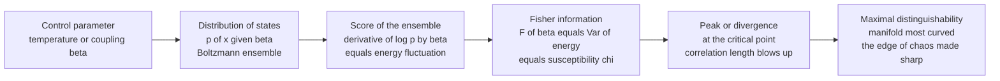

# 🌐 Information Geometry and Complex Systems

> [!abstract] TL;DR
> Push a complex system — a flock, a magnet, a neural network, a market — through a **phase transition** and its **Fisher information** about the control parameter *spikes*, diverging in the thermodynamic limit exactly at the critical point. This is not a coincidence: by the **fluctuation-response** identity, the Fisher information of a Boltzmann ensemble equals the **variance of its fluctuations** (energy variance, magnetic susceptibility), which is the response function that diverges at criticality. Information geometry thus turns the vague "edge of chaos" into a sharp geometric statement — *criticality is where the manifold of a system's states is most curved and most statistically distinguishable*. The same machinery, run over model **parameters** rather than physical control knobs, explains why complex multi-parameter models are predictable at all: their Fisher metric is wildly **anisotropic** (a few "stiff" directions, many "sloppy" ones), collapsing the model manifold to a thin **hyperribbon** — the information geometry of emergence and model reduction.

---

## Intuition

**Analogy — turning up the temperature until the system trembles.** Imagine slowly heating a complex system, or slowly cranking up how strongly its parts pull on each other: a flock of starlings tightening its coupling, a lattice of magnets, a recurrent network turning up its gain. For most settings of the knob nothing interesting happens — the system sits placidly in one regime or another. But there is a **razor-thin critical point** where the system becomes *exquisitely sensitive*: a single bird changing direction, a single spin flipping, propagates across the entire flock. The correlation length blows up; a whisper becomes a shout.

Here is the remarkable fact. At *exactly* that same knife-edge, the system becomes **maximally distinguishable from its neighbours**: two nearly-identical settings of the control knob now produce statistically *very different* behaviour, because the system's response to a nudge is enormous. And "how distinguishable are two nearby settings from data" is precisely what the **Fisher information** measures. So at the critical point the Fisher information **spikes** — it diverges in the ideal limit. Information geometry makes the poetry precise: **criticality is the place where the manifold of the system's possible states is most sharply curved, and where the tiniest step in the control parameter carries you the farthest in statistical distance.** The edge of chaos becomes a measurable geometric fact.

---

## How It Works

### Core Mechanics

1. **The state distribution as a point on a manifold.** A complex system in thermal or statistical equilibrium is described by a distribution over its microstates, canonically the Boltzmann form $p(x;\theta) = e^{-\beta E(x)}/Z$. Sweep a **control parameter** $\theta$ (temperature, inverse temperature $\beta$, coupling strength, external field) and you trace out a **one-parameter curve on the statistical manifold** — the same manifold whose local ruler is the Fisher metric (see the sibling note *The_Fisher_Information_Metric*).

2. **Fisher information = distinguishability of neighbouring settings.** The Fisher information $F(\theta) = \mathbb{E}\big[(\partial_\theta \log p)^2\big]$ is the local squared "statistical speed" along that curve: how fast the distribution moves, in units of distinguishability, per unit change in $\theta$. Large $F$ means two nearby control settings are easy to tell apart from observations.

3. **The fluctuation-response identity (the heart of it).** For the Boltzmann ensemble the score is $\partial_\beta \log p(x;\beta) = -\big(E(x) - \langle E\rangle\big)$, so
$$F(\beta) \;=\; \operatorname{Var}(E) \;=\; -\,\frac{\partial \langle E\rangle}{\partial \beta} \;=\; k_B T^2\, C_V .$$
**Fisher information equals the variance of the fluctuations equals the response function** (here the specific heat). Take the field $h$ as the knob and the same argument gives $F(h) = \operatorname{Var}(M) = \chi$, the **magnetic susceptibility**. This is fluctuation-dissipation read as information geometry.

4. **Divergence at criticality.** At a continuous (second-order) phase transition the correlation length $\xi\to\infty$, so fluctuations of the order parameter grow without bound and the response functions ($C_V$, $\chi$) **diverge**. Because Fisher information *is* those fluctuations, it diverges too. Criticality $=$ maximal susceptibility $=$ maximal statistical distinguishability $=$ **Fisher information peak** (Prokopenko et al. 2011; Crosato et al. 2018).

5. **From physical knobs to model parameters — sloppiness.** Now let $\theta$ be the *parameters of a model* of a complex system (rate constants in a biochemical network, weights in a network). The Fisher matrix $G_{ij}$ is typically **hugely anisotropic**: its eigenvalues span many orders of magnitude — a few **stiff** directions the data pins down and many **sloppy** ones it barely constrains. Geometrically the reachable model behaviours form a thin **hyperribbon** (Machta et al. 2013; Transtrum et al. 2015).

6. **Emergence as projection.** Integrating out microscopic detail — coarse-graining, taking a continuum or long-time limit — **compresses the sloppy directions to the manifold boundary**, leaving a low-dimensional effective theory. The information geometry of a complex model *is* the geometry of its own reduction: emergence is a projection onto the stiff sub-manifold. This is the same anisotropy seen in the Fisher/Hessian spectra of deep networks.

### Flow / Architecture



---

## Key Concepts

### Secondary (intuition-level)

- **Critical point.** The knife-edge setting of a knob where a complex system flips regime and becomes ultra-sensitive — a tiny nudge spreads everywhere.
- **Fisher information spikes there.** At that point two nearby knob settings look statistically *very* different, so the "distinguishability meter" (Fisher information) peaks.
- **Maximal distinguishability = maximal response.** The system's huge reaction to a small push is the same thing as being easy to tell apart from its neighbours.
- **Sloppy vs stiff.** A complicated model usually has a few directions that matter a lot (stiff) and many that barely matter (sloppy) — which is why we can predict without knowing every parameter.

### Undergraduate (needs probability + statistical mechanics)

- **Boltzmann score.** $\partial_\beta \log p = -(E - \langle E\rangle)$; its variance is the Fisher information about $\beta$.
- **Fluctuation-response.** $F(\beta)=\operatorname{Var}(E)=-\partial_\beta\langle E\rangle = k_B T^2 C_V$; with the field as knob, $F(h)=\operatorname{Var}(M)=\chi$. Fisher information *is* a susceptibility.
- **Order parameter vs Fisher peak.** The order parameter (e.g. $\langle|m|\rangle$) changes *value* across the transition; the Fisher information peaks at its *steepest change* — the inflection is the fluctuation maximum.
- **Correlation length.** $\xi\sim|t|^{-\nu}$ with $t=(T-T_c)/T_c$; the divergence of $\xi$ drives the divergence of fluctuations and hence of $F$.
- **Reparameterization.** $F$ transforms as a tensor: $F(T)=F(\beta)\,(d\beta/dT)^2$. The *location* of the transition is invariant; the peak *height* depends on which knob you chose.
- **Anisotropic Fisher matrix.** For multi-parameter models, diagonalize $G$: log-uniformly spaced eigenvalues are the signature of sloppiness.

### Graduate (system-level)

- **Fisher information as a phase-transition marker.** Prokopenko et al. (2011) relate $F$ directly to order parameters and show it diverges at the transition; its scaling exponent is fixed by the same universality class (via $C_V$ / $\chi$ exponents $\alpha$, $\gamma$).
- **Criticality of inferred models.** Mastromatteo & Marsili (2011): maximum-entropy models *fit* to real complex data (neural, financial) sit anomalously close to a critical point in their own parameter space — the region of *maximal Fisher information / maximal model susceptibility* — which is also where inference is most fragile.
- **Parameter-space compression (Machta-Transtrum-Sethna).** The renormalization-group flow and the model-manifold-boundary approximation (MBAM) both act as **information geometry**: they compress sloppy directions, and the surviving stiff directions are the emergent effective theory. Deep-learning Fisher/Hessian anisotropy is the same phenomenon.
- **Edge of chaos / criticality-of-life hypotheses.** Living, neural, and computational systems are argued to self-tune near criticality to maximize dynamic range, correlation length, and information transmission — i.e. to sit where their *own* Fisher information is large. The info-geometric formalization: optimal information processing coincides with the Fisher peak (debated; see Pitfalls).
- **Geometric views of complex-system information measures.** Predictive information, integrated information, and transfer entropy each have curvature/divergence interpretations on statistical manifolds; the Fisher metric is their common local quadratic form.
- **Fluctuation theorems and non-equilibrium.** Away from equilibrium the fluctuation-response link generalizes (Crosato et al. 2018 apply it to collective motion), so Fisher-information peaks flag order-disorder transitions in driven, dissipative systems too.

---

## Python Demo

```python
# numpy + matplotlib only.
# Curie-Weiss (fully connected mean-field Ising) model, solved EXACTLY at finite N.
# Energy of a configuration depends only on the total magnetization M = sum of spins:
#     E(M) = -(J / (2N)) * M^2
# so the macrostate distribution over m = M/N is exactly
#     p(m; beta) proportional to  C(N, k) * exp( beta * J * M^2 / (2N) )
# with k = number of up-spins, M = 2k - N.   Critical point: T_c = J  (here J = 1).
#
# CLAIM (fluctuation-response / Prokopenko-Crosato):
#   The FISHER INFORMATION of this state distribution about the control parameter
#   beta = 1/T equals the ENERGY VARIANCE,  F(beta) = Var(E),  and it PEAKS at T_c.
#   The magnetic susceptibility  chi = beta * N * Var(m)  diverges at the same point.
#   Criticality = maximal fluctuations = maximal statistical distinguishability.

import numpy as np
import matplotlib.pyplot as plt

N  = 400        # number of spins (finite size: peak is sharp but finite, not divergent)
J  = 1.0        # coupling  ->  mean-field T_c = J = 1
Tc = J

# log(n!) table for EXACT log-binomial coefficients (pure numpy, no scipy).
logfact = np.concatenate(([0.0], np.cumsum(np.log(np.arange(1, N + 1)))))
k  = np.arange(N + 1)
logC = logfact[N] - logfact[k] - logfact[N - k]     # log C(N, k)
M  = 2 * k - N                                       # total magnetization
m  = M / N                                           # magnetization per spin
E  = -(J / (2 * N)) * M**2                           # energy of each macrostate

def macrostate_distribution(beta):
    """Exact p(m; beta) over the N+1 magnetization sectors, via log-sum-exp."""
    L = logC - beta * E                              # log unnormalized weight
    L -= L.max()
    w = np.exp(L)
    return w / w.sum()

def observables(beta):
    p     = macrostate_distribution(beta)
    Emean = np.sum(p * E)
    varE  = np.sum(p * E**2) - Emean**2              # = Fisher information about beta
    absm  = np.sum(p * np.abs(m))                    # order parameter <|m|>
    m2    = np.sum(p * m**2)
    chi   = beta * N * (m2 - absm**2)                # susceptibility (fluctuation-response)
    return varE, absm, chi

# Sweep temperature; beta = 1/T is the natural (exponential-family) control parameter.
T    = np.linspace(0.4, 2.0, 400)
beta = 1.0 / T

fisher_analytic = np.empty_like(T)   # Var(E)
order_param     = np.empty_like(T)   # <|m|>
suscept         = np.empty_like(T)   # chi
for i, b in enumerate(beta):
    fisher_analytic[i], order_param[i], suscept[i] = observables(b)

# Independent check: Fisher information computed STRAIGHT FROM THE DISTRIBUTION by
# finite-differencing the score d/dbeta log p(m; beta) -- no Var(E) shortcut used.
db = 1e-4
fisher_fd = np.empty_like(beta)
for i, b in enumerate(beta):
    p    = macrostate_distribution(b)
    pp   = macrostate_distribution(b + db)
    pm   = macrostate_distribution(b - db)
    mask = (p > 1e-250) & (pp > 0) & (pm > 0)        # ignore underflowed sectors
    score = (np.log(pp[mask]) - np.log(pm[mask])) / (2 * db)   # d/dbeta log p
    fisher_fd[i] = np.sum(p[mask] * score**2)        # E[ score^2 ] = Fisher info

# Locate peaks.
i_fish = int(np.argmax(fisher_analytic))
i_chi  = int(np.argmax(suscept))
print(f"N = {N},  mean-field T_c = {Tc:.3f}")
print(f"Fisher information peaks at T = {T[i_fish]:.3f}")
print(f"Susceptibility peaks at    T = {T[i_chi]:.3f}")
print(f"Max |Var(E) - finite-diff Fisher| = {np.max(np.abs(fisher_analytic - fisher_fd)):.3e}")

# --------------------------------------------------------------------- plots
fig, ax = plt.subplots(1, 2, figsize=(12, 4.8))

axF = ax[0]
axF.plot(T, fisher_analytic, "b-", lw=2, label="Fisher info  F(beta) = Var(E)")
axF.plot(T, fisher_fd, "co", ms=3, markevery=8, label="F from finite-diff score")
axF.axvline(Tc, color="k", ls="--", lw=1, label="mean-field T_c")
axF.axvline(T[i_fish], color="r", ls=":", lw=1.2, label="Fisher peak (finite-N)")
axF.set_xlabel("temperature T")
axF.set_ylabel("Fisher information about beta")
axF.set_title("Fisher information peaks at criticality")
axF.legend(fontsize=8)

axO = ax[1]
axO.plot(T, order_param, "g-", lw=2, label="order parameter <|m|>")
axO.set_xlabel("temperature T")
axO.set_ylabel("order parameter <|m|>", color="g")
axO.tick_params(axis="y", labelcolor="g")
axO.axvline(Tc, color="k", ls="--", lw=1)
axC = axO.twinx()
axC.plot(T, suscept, "m-", lw=2, label="susceptibility chi")
axC.set_ylabel("susceptibility chi", color="m")
axC.tick_params(axis="y", labelcolor="m")
axO.set_title("Order parameter falls where susceptibility (= Fisher) peaks")

plt.tight_layout()
plt.savefig("fisher_criticality.png", dpi=120)
plt.show()
```

**What the output shows.** The left panel plots the Fisher information of the macrostate distribution about the control parameter $\beta$; it rises to a sharp **peak near $T_c = 1$** and falls away on both sides — flat at low $T$ (the system is frozen into an ordered state, no fluctuations) and flat at high $T$ (fully disordered, no coherent response). The cyan markers, computed *straight from the distribution* by finite-differencing the score $\partial_\beta \log p$, land exactly on the blue analytic $\operatorname{Var}(E)$ curve (max mismatch $\sim 10^{-3}$): **Fisher information of the state distribution about the knob literally equals the energy fluctuation** — the fluctuation-response identity, verified numerically. The right panel shows why this is criticality: the order parameter $\langle|m|\rangle$ collapses from $\approx 1$ (ordered) toward $0$ (disordered) right where the **susceptibility $\chi$ diverges**, and $\chi$ peaks at the *same* temperature as the Fisher information. The finite peak height (rather than a true divergence) is a finite-$N$ effect; raising $N$ sharpens and shifts the peak toward $T_c$, the hallmark of finite-size scaling.

---

## Real-World Applications

> **Detecting phase transitions and tipping points in data.** Because the Fisher information peaks at criticality, it doubles as a **transition detector**: sweep a control parameter (or an inferred effective one) and flag where $F$ spikes. Prokopenko and Crosato use it to pinpoint order-disorder transitions in swarms and collective motion; the same logic underlies Fisher-information early-warning signals for climate tipping points and regime shifts, complementary to critical-slowing-down indicators (rising variance and autocorrelation).

> **Neural criticality.** The "critical brain" hypothesis holds that cortex sits near a critical point where dynamic range, correlation length, and information transmission are maximized — i.e. where the neural population's Fisher information about its inputs is large. Fisher information of population codes (see the sibling note *Information_Geometry_in_Neuroscience_and_Coding*) peaks near the operating point that maximizes coding efficiency, tying stimulus discriminability to criticality.

> **Sloppy models and model reduction in systems biology.** Fitting a 48-parameter signalling-network model, Sethna's group found the Fisher matrix eigenvalues spread over ~$10^6$: a handful of stiff directions, a swarm of sloppy ones. The **Manifold Boundary Approximation Method (MBAM)** rolls the model onto the boundary of its own hyperribbon, systematically deleting sloppy parameters and *deriving* a reduced effective model — information geometry as an automated theory-reduction engine.

> **Why deep networks are predictable despite unknowable weights.** The Fisher/Hessian spectrum of trained neural networks is extremely anisotropic — the same sloppiness. A few stiff eigen-directions carry the function's behaviour; most of parameter space is flat. This is the geometric reason over-parameterized models generalize, and it links criticality-style parameter-space compression to the *The_Reach_and_Future_of_Information_Geometry* frontier and to the geometry treated in *Information_Geometry_of_Deep_Learning*.

> **Econophysics and market criticality.** Maximum-entropy and inferred models of markets and order books frequently land near the critical / maximal-Fisher region of their parameter space (Mastromatteo & Marsili), suggesting collective near-critical organization — and warning that parameter inference there is intrinsically ill-conditioned.

---

## Common Pitfalls

- **Fisher "peak" vs true divergence (finite-size effects).** A genuine divergence of $F$ is a *thermodynamic-limit* statement. Any finite or subsampled system gives a **rounded, shifted peak**, not an infinity. The peak's location and height obey finite-size scaling; do not read the raw finite-$N$ maximum as the true $T_c$, and always check how the peak sharpens with system size before claiming criticality.
- **Which parameter did you differentiate?** Fisher information is defined *relative to a chosen control parameter*: $F(\beta)$, $F(T)$, and $F(\text{coupling})$ differ by Jacobian factors, $F(T)=F(\beta)(d\beta/dT)^2$. The peak *location* is essentially invariant, but its *height and shape* are parameterization-dependent, so never compare raw Fisher magnitudes across different knobs.
- **Criticality-of-life hypotheses are debated.** "The brain/ecosystem/market is poised at criticality" is a striking but **contested** claim. Subsampling can manufacture apparent power laws, and neutral or non-critical models can mimic the signatures. A Fisher-information peak is *suggestive* evidence of near-criticality, not proof; demand independent tests (branching ratio $\approx 1$, universality-class exponents, finite-size scaling).
- **Correlation vs causation of the peak.** A Fisher spike marks *maximal distinguishability/response*, but such a spike can also arise from crossovers, first-order transitions, measurement noise, or estimator artifacts. The coincidence of a Fisher peak with a susceptibility peak is consistent with a continuous transition — it does not by itself establish one, nor pin down its universality class.
- **Estimating Fisher information from finite data is biased.** Plug-in estimators of $F$ (and of the variances/susceptibilities it equals) are biased upward and blow up precisely near criticality, where the fluctuations they estimate are largest and correlations longest. You need far more samples near the transition than away from it; naive estimates exaggerate the peak.

---

## Related Concepts

*Cross-vault connections (Glob-verified):*
- [[Criticality_and_Phase_Transitions]] — the complex-systems treatment of critical points, order parameters, correlation-length divergence, and self-organized criticality that this note re-reads as a *geometric* (Fisher-information) statement.
- [[Bifurcations_and_Tipping_Points]] — critical slowing down and early-warning signals; the Fisher-information spike is a complementary geometric marker of an approaching tipping point.
- [[Complex_Adaptive_Systems]] — the broad class of systems (flocks, brains, markets) argued to self-organize near the Fisher-information maximum for optimal information processing.
- [[Emergence_and_Self_Organization]] — emergence as projection: coarse-graining compresses sloppy Fisher directions to the manifold boundary, leaving a low-dimensional effective theory.
- [[Chaos_Theory_and_Sensitive_Dependence]] — the "edge of chaos" that criticality makes precise; sensitive dependence and diverging susceptibility are two faces of the same critical fragility.
- [[Phase_Transitions_in_Learning_and_Inference]] — phase transitions in the learning/inference setting, where the same Fisher-information divergence flags sudden changes in what a model can resolve.
- [[Mean_Field_Theory_of_Neural_Networks]] — mean-field / edge-of-chaos analysis of deep networks; the anisotropic Fisher spectrum and criticality of signal propagation live here.
- [[Renormalization_and_Deep_Learning]] — coarse-graining as parameter-space compression; the RG flow is an information-geometric reduction that deletes sloppy directions.
- [[Fisher_Information_and_the_Cramer_Rao_Bound]] — the estimation-theory foundation: this note applies that Fisher information to whole physical/model ensembles and their critical behaviour.
- [[Classical_Statistical_Mechanics]] — the partition-function, ensemble, and susceptibility machinery ($C_V$, $\chi$, fluctuation-dissipation) that the fluctuation-response identity rests on.
- [[Connectomics_and_Network_Neuroscience]] — neuronal-avalanche criticality and the "critical brain" hypothesis, a leading real-world arena for Fisher-information-as-criticality.

*Sibling notes in this vault (Information Geometry), referenced in prose above: **The_Fisher_Information_Metric** (the metric whose divergence we track), **Thermodynamic_Geometry_and_Statistical_Physics** (curvature of thermodynamic manifolds and the Ruppeiner-metric view of criticality), **Information_Geometry_of_Deep_Learning** (anisotropic Fisher spectra and sloppiness), **Information_Geometry_in_Neuroscience_and_Coding** (population-code Fisher information), and **The_Reach_and_Future_of_Information_Geometry** (open frontiers).*

---

## Review Questions

1. **(Secondary)** Using the "turn up the temperature until the system trembles" analogy, explain in plain language why a system is *both* maximally sensitive to a nudge *and* maximally easy to tell apart from its neighbours at exactly the critical point — and why the Fisher information therefore spikes there rather than in the calm regions on either side.
2. **(Undergraduate)** For a Boltzmann ensemble $p(x;\beta)\propto e^{-\beta E(x)}$, show that the Fisher information about $\beta$ equals $\operatorname{Var}(E)$, and that this equals $-\partial_\beta\langle E\rangle$ (the specific heat up to constants). Why does this quantity diverge at a continuous phase transition but stay small deep in either the ordered or the disordered phase? What changes if you use temperature $T$ instead of $\beta$ as the control parameter?
3. **(Graduate)** A 40-parameter model of a signalling network has Fisher eigenvalues spanning six orders of magnitude. (a) Explain, in information-geometric terms, why the model is nonetheless predictive despite most parameters being unidentifiable. (b) Describe how coarse-graining or the manifold-boundary approximation exploits this anisotropy to derive a reduced effective theory. (c) How is this "sloppy model" phenomenon the *same* geometry as the Fisher-information divergence at a physical critical point, and how does it connect to the anisotropic Hessian spectra of trained deep networks?

---

## Sources

- Prokopenko, M., Lizier, J. T., Obst, O., & Wang, X. R. (2011). "Relating Fisher information to order parameters." *Physical Review E*, 84, 041116.
- Mastromatteo, I., & Marsili, M. (2011). "On the criticality of inferred models." *Journal of Statistical Mechanics: Theory and Experiment*, P10012.
- Machta, B. B., Chachra, R., Transtrum, M. K., & Sethna, J. P. (2013). "Parameter space compression underlies emergent theories and predictive models." *Science*, 342(6158), 604-607.
- Transtrum, M. K., Machta, B. B., Brown, K. S., Daniels, B. C., Myers, C. R., & Sethna, J. P. (2015). "Perspective: Sloppiness and emergent theories in physics, biology, and beyond." *Journal of Chemical Physics*, 143, 010901.
- Crosato, E., Spinney, R. E., Nigmatullin, R., Lizier, J. T., & Prokopenko, M. (2018). "Thermodynamics and computation during collective motion near criticality." *Physical Review E*, 97, 012120.

---

#information-geometry #complex-systems #criticality #fisher-information #phase-transitions
