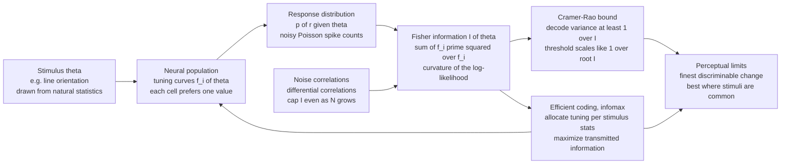

# 🧠 Information Geometry in Neuroscience and Coding

> [!abstract] TL;DR
> A population of sensory neurons is a **measuring instrument** for the world, and information geometry supplies its calibration certificate. Each neuron has a **tuning curve** $f_i(\theta)$ — a mean firing rate as a function of some stimulus feature $\theta$ (orientation, direction, sound frequency) — and on each trial fires a noisy (roughly Poisson) number of spikes. The whole population therefore defines a *response distribution* $p(\mathbf{r}\mid\theta)$, and the **Fisher information** of that distribution about the stimulus, $I(\theta)=\sum_i \left[f_i'(\theta)\right]^2/f_i(\theta)$, is *exactly* the same Fisher information that measures statistical distinguishability everywhere else in the vault. It sets a hard floor on how finely the brain can discriminate — the **Cramér-Rao bound** makes the just-noticeable change in $\theta$ scale like $1/\sqrt{I(\theta)}$. This single quantity ties together why populations beat single cells (Fisher adds across independent neurons), how tuning-curve shape, width, gain, and **allocation** control coding precision, why **efficient coding** (Barlow, Laughlin, Ganguli-Simoncelli) puts the most neurons — and hence the most Fisher information — where natural stimuli are most common, and why **noise correlations** between neurons can secretly cap the information no matter how many cells you record (Moreno-Bote, Kanitscheider). In the large-population Gaussian limit even the *mutual information* of the code collapses onto $\log$ Fisher information (Brunel-Nadal), so the geometric ruler and the Shannon bit turn out to measure the same thing.

---

## Intuition

**Analogy — the retina's impossible packing problem.** Your eye's photoreceptors face a brutal engineering task: pack the richest possible description of the visual world into a limited, unreliable stream of neural spikes. Imagine a huge committee of specialist reporters, each one an expert on a narrow slice of the world — one cares only about roughly-vertical lines, another about lines tilted 20 degrees, another about 40 degrees — and each reports in a noisy, sometimes-wrong way. No single reporter can tell you the exact orientation of the edge in front of you. But if you ask the whole committee and weigh their answers cleverly, the *ensemble* pins down the orientation with startling precision. The natural question is: **how precise, exactly?** How slightly can you rotate a line before the committee reliably notices?

That precision — the finest change in the world the population can register — is governed by **Fisher information**, the very same quantity that in statistics measures how distinguishable two nearby probability distributions are. Information geometry gives neuroscience its ruler: it quantifies how well a neural code represents the world, why certain codes are optimal, and how a population trades off precision across the space of stimuli. Where the committee assigns many sharply-tuned reporters, Fisher information is high and discrimination is exquisite; where reporters are sparse or broadly tuned, Fisher information is low and the world looks blurry. The brain's job — sculpted by evolution and development — is to **spend its finite Fisher information where the world most demands it**.

---

## How It Works

### Core mechanics

1. **A tuning curve is a coordinate on a statistical manifold.** Neuron $i$ responds to a stimulus feature $\theta$ with a mean rate $f_i(\theta)$ — often a Gaussian or von Mises bump peaked at the cell's *preferred* stimulus $\theta_i$. The population's mean-rate vector $\big(f_1(\theta),\dots,f_N(\theta)\big)$ traces a one-parameter curve through the $N$-dimensional space of firing rates as $\theta$ varies. Each stimulus value indexes a *response distribution* $p(\mathbf{r}\mid\theta)$, so the code is literally a family of distributions parameterized by the world — a **statistical manifold**, the home turf of information geometry.

2. **Spiking noise makes the code a distribution, not a lookup table.** On a single trial the spike count $r_i$ is a random draw — commonly modeled as Poisson with mean $f_i(\theta)$, so $\operatorname{Var}(r_i)=f_i(\theta)$. Two nearby stimuli $\theta$ and $\theta+d\theta$ produce *overlapping* response clouds; how separable those clouds are is what limits perception.

3. **Fisher information measures separability of the clouds.** For a population of conditionally-independent Poisson neurons the Fisher information about the stimulus is
$$
I(\theta)=\sum_{i=1}^{N}\frac{\left[f_i'(\theta)\right]^2}{f_i(\theta)}.
$$
Each neuron contributes most where its tuning curve is *steepest* (large $f_i'$) rather than where it fires hardest — the flanks of the bump, not the peak, carry the discriminative signal. Because independent neurons' Fisher informations **add**, the population floor improves in proportion to $N$: the geometric reason populations beat single cells.

4. **The Cramér-Rao bound turns Fisher into a discrimination threshold.** No unbiased decoder — biological or artificial — can estimate $\theta$ with variance below $1/I(\theta)$. So the code's best-case discrimination threshold (the just-noticeable difference) scales as
$$
\delta\theta_{\min}(\theta)\ \propto\ \frac{1}{\sqrt{I(\theta)}}.
$$
Wherever the population piles up Fisher information, perception is sharp; wherever it starves the region of information, perception is coarse. This is the estimation-theory face developed in the sibling notes *Cramer_Rao_Bound_and_Efficiency* and *The_Fisher_Information_Metric*.

5. **Tuning-curve shape, width, gain, and density are the design knobs.** Increasing the number of neurons $N$, raising the peak rate (gain) $r_{\max}$, or narrowing the tuning width $\sigma$ all *raise* Fisher information (roughly $I\propto N r_{\max}/\sigma^2$ for a well-tiled 1-D code) — but narrowing too far leaves gaps between curves and creates ripples where $I$ collapses. **Where** the preferred stimuli sit matters as much as how many there are.

6. **Efficient coding allocates Fisher information per the stimulus statistics.** Barlow's redundancy-reduction and Laughlin's information-maximization principles say sensory codes should maximize transmitted information under metabolic constraints. Ganguli & Simoncelli made this geometric: the optimal *density* of neurons (and hence the Fisher information) should track the stimulus prior $p(\theta)$, so common stimuli get more cells, higher $I(\theta)$, and finer discrimination. This predicts real perceptual biases — the "oblique effect" (cardinal orientations discriminated best) falls straight out.

7. **Noise correlations can cap the information.** Real neurons are *not* independent: their trial-to-trial fluctuations covary. Correlations aligned with the signal direction — **information-limiting** or **differential** correlations (Moreno-Bote et al.; Kanitscheider et al.) — impose a ceiling on $I(\theta)$ that *does not* vanish as $N\to\infty$. Adding neurons that share the same noise buys nothing. The full formula uses the noise covariance $\Sigma(\theta)$: $I(\theta)=\mathbf{f}'^\top\Sigma^{-1}\mathbf{f}' + \tfrac12\operatorname{Tr}\!\big[\Sigma'\Sigma^{-1}\Sigma'\Sigma^{-1}\big]$; the independent-Poisson sum is the diagonal special case.

8. **In the large-$N$ Gaussian limit, Fisher and mutual information converge.** Brunel & Nadal showed that for a large population the *mutual information* between stimulus and response is, up to constants, $\tfrac12\mathbb{E}_\theta[\log I(\theta)]$ — the Shannon bit-count of the code and the geometric Fisher ruler measure the same thing. Maximizing mutual information (infomax) and maximizing Fisher information become the same optimization.

### Flow / Architecture



---

## Key Concepts

### Secondary (intuition-level)

- **Neurons make distributions, not readouts.** Because spiking is noisy, each stimulus produces a *cloud* of possible population responses; nearby stimuli make overlapping clouds. Perception is the job of telling those clouds apart.
- **Fisher information is the "how distinguishable" ruler.** It is high where the population's tuning curves change steeply with the stimulus and where many cells contribute. More neurons, sharper tuning, and stronger firing all raise it.
- **The discrimination limit is one over the square root of Fisher.** Wherever the population concentrates Fisher information, you can spot smaller changes in the world; the just-noticeable difference shrinks like $1/\sqrt{I}$.
- **Good codes spend their information wisely.** A well-designed sense organ puts its neurons — its Fisher information — where the world's stimuli are most common and most behaviorally important, not spread evenly.

### Undergraduate (needs calculus + probability)

- **Poisson population Fisher.** For independent Poisson neurons, $I(\theta)=\sum_i [f_i'(\theta)]^2/f_i(\theta)$; the steep *flanks* of a tuning curve, not its peak, carry the discriminative information (at the peak $f_i'=0$).
- **Tuning geometry controls precision.** For $N$ Gaussian curves of width $\sigma$ and peak rate $r_{\max}$ uniformly tiling the stimulus, $I(\theta)\approx N r_{\max}/\sigma^2$ (approximately flat), so optimal RMSE $\propto \sigma/\sqrt{N r_{\max}}$ — narrower, more numerous, higher-gain neurons all help, until tiling gaps appear.
- **Cramér-Rao and the ML decoder.** The maximum-likelihood decoder is asymptotically efficient: its variance approaches $1/I(\theta)$ for large $N$, so the *estimation* limit and the *discrimination* limit coincide — see [[Fisher_Information_and_the_Cramer_Rao_Bound]] and [[Population_Coding_and_Decoding]].
- **Efficient coding as Fisher allocation.** Under an infomax objective with a fixed neuron budget, the optimal preferred-stimulus density $d(\theta)$ tracks the prior: $d(\theta)\propto p(\theta)$ gives $I(\theta)\propto p(\theta)^2$ and discrimination threshold $\propto 1/p(\theta)$ — frequent stimuli are discriminated best (Ganguli-Simoncelli).
- **Signal vs noise correlations.** Signal correlation is tuning-curve similarity; noise correlation is shared trial-to-trial fluctuation. Only noise correlations projecting onto the coding direction $\mathbf{f}'(\theta)$ limit information — the geometry of noise relative to signal is what matters, not the raw correlation magnitude.

### Graduate (system-level)

- **The full correlated Fisher.** With Gaussian noise of covariance $\Sigma(\theta)$, $I(\theta)=\mathbf{f}'^\top\Sigma^{-1}\mathbf{f}' + \tfrac12\operatorname{Tr}[(\Sigma^{-1}\Sigma')^2]$. **Information-limiting correlations** (Moreno-Bote 2014) are the component of $\Sigma$ proportional to $\mathbf{f}'\mathbf{f}'^\top$; any nonzero amount of it makes $I$ saturate at a finite value as $N\to\infty$. Kanitscheider et al. showed such correlations arise inevitably from suboptimal computation and shared input, and are hard to detect with small $N$.
- **Fisher-mutual-information duality (Brunel-Nadal 1998).** In the long-time / large-$N$ Gaussian regime the stimulus-response mutual information is $I_{\text{mut}}=H(\theta)-\tfrac12\mathbb{E}_\theta[\log(2\pi e / I(\theta))]$, i.e. it grows like $\tfrac12\mathbb{E}[\log I(\theta)]$. Infomax and Fisher-max become one optimization, linking this note to [[Joint_Conditional_Entropy_and_Mutual_Information]] and [[Channel_Capacity_and_the_Noisy_Channel_Theorem]].
- **Optimal tuning width is dimensionality-dependent (Zhang-Sejnowski).** In 1-D, narrower tuning maximizes Fisher information; in $D$ dimensions the scaling of $I$ with width $\sigma$ flips sign for $D>2$, so *broad* tuning becomes optimal for high-dimensional stimuli — a clean geometric result about how coding strategy depends on the stimulus manifold's dimension.
- **The geometry of neural representations.** Population activity across conditions traces a low-dimensional **neural manifold**; the Fisher information metric on that manifold defines local discriminability, and representational-geometry tools (RSA, the Fisher-Rao / Riemannian view) quantify how well downstream readouts can separate conditions. This is the sensory-systems instance of the metric developed in *The_Fisher_Information_Metric*.
- **Decoding and the readout geometry.** A linear decoder is efficient only if its weights align with $\Sigma^{-1}\mathbf{f}'$; the achievable readout variance is a projection of the Fisher metric onto the decoder subspace, tying "how the brain reads the code" to the same information geometry that bounds the code.
- **Bridge to the free-energy principle.** Predictive-coding and Bayesian-brain accounts recast perception as inference on a generative model; Fisher information reappears as the precision (inverse variance) weighting prediction errors, and efficient-coding allocation becomes precision-optimization — connecting to *Information_Geometry_and_Complex_Systems*, *Information_Geometry_of_Deep_Learning*, and the frontier synthesis in *The_Reach_and_Future_of_Information_Geometry*.

---

## Python Demo

```python
# Fisher information of a neural POPULATION CODE, and the efficient-coding result.
#
# Setup: a population of orientation-tuned neurons (Gaussian tuning on the circular
# variable orientation, period 180 deg) firing Poisson spikes. For independent
# Poisson neurons the population Fisher information about the stimulus theta is
#
#     I(theta) = sum_i  [ f_i'(theta) ]^2 / f_i(theta)
#
# and the Cramer-Rao bound makes the best-case discrimination threshold
#
#     delta_theta_min(theta)  proportional to  1 / sqrt( I(theta) ).
#
# (a) POPULATION + PRECISION: uniform tiling. Show how MORE and NARROWER neurons
#     raise Fisher information and lower the discrimination threshold.
# (b) EFFICIENT CODING: allocate a fixed neuron budget by the stimulus PRIOR
#     (cardinal orientations most common). Fisher information -- and hence
#     discrimination precision -- concentrates where stimuli are common, exactly
#     the infomax / Ganguli-Simoncelli optimal-coding prediction (the oblique effect).
import numpy as np
import matplotlib.pyplot as plt

L = 180.0                                   # orientation is periodic with period 180 deg
theta = np.linspace(0, L, 361, endpoint=False)   # fine stimulus grid
R_MAX = 20.0                                # peak firing rate (spikes / s)
B0    = 0.5                                 # baseline rate (keeps Fisher finite)

def circ_diff(a, b, period=L):
    """Signed circular difference a - b mapped to (-period/2, +period/2]."""
    return (a - b + period / 2) % period - period / 2

def tuning_and_deriv(grid, prefs, sigma, r_max=R_MAX, b0=B0):
    """Gaussian tuning f_i(theta) and its derivative df_i/dtheta on the grid.
       Returns arrays of shape (len(grid), N_neurons)."""
    d  = circ_diff(grid[:, None], prefs[None, :])       # (T, N)
    g  = np.exp(-0.5 * (d / sigma) ** 2)
    f  = b0 + r_max * g                                 # mean rate
    df = -r_max * g * d / sigma ** 2                    # d f / d theta
    return f, df

def population_fisher(grid, prefs, sigma):
    """Poisson population Fisher information I(theta) = sum_i (f_i')^2 / f_i."""
    f, df = tuning_and_deriv(grid, prefs, sigma)
    return np.sum(df ** 2 / f, axis=1)                  # (T,)

# ---------- (a) uniform tiling: baseline vs. more + narrower neurons ------------
prefs_base = np.linspace(0, L, 20, endpoint=False)      # 20 neurons, broad tuning
prefs_more = np.linspace(0, L, 40, endpoint=False)      # 40 neurons, narrow tuning
I_base = population_fisher(theta, prefs_base, sigma=25.0)
I_more = population_fisher(theta, prefs_more, sigma=15.0)

# discrimination threshold ~ 1 / sqrt(Fisher)  (Cramer-Rao, arbitrary common scale)
disc_base = 1.0 / np.sqrt(I_base)
disc_more = 1.0 / np.sqrt(I_more)
print("(a) uniform tiling")
print(f"    20 broad neurons : mean Fisher = {I_base.mean():7.3f}  "
      f"mean threshold = {disc_base.mean():.4f}")
print(f"    40 narrow neurons: mean Fisher = {I_more.mean():7.3f}  "
      f"mean threshold = {disc_more.mean():.4f}  (more + narrower -> sharper)")

# ---------- (b) EFFICIENT CODING: allocate neurons by the stimulus prior --------
# Natural-image orientation statistics: cardinal orientations (0, 90 deg) dominate.
prior = 1.0 + 1.5 * np.cos(4 * np.pi * theta / L)       # peaks at 0 and 90 deg
prior = np.clip(prior, 1e-6, None)
prior /= np.trapz(prior, theta)                         # normalize to a density

N_eff = 40
cdf = np.cumsum(prior); cdf /= cdf[-1]                  # empirical CDF of the prior
q = (np.arange(N_eff) + 0.5) / N_eff
prefs_eff = np.interp(q, cdf, theta)                    # dense where the prior is high
prefs_uni = np.linspace(0, L, N_eff, endpoint=False)    # uniform allocation baseline

sigma_c = 15.0
I_uni = population_fisher(theta, prefs_uni, sigma_c)
I_eff = population_fisher(theta, prefs_eff, sigma_c)
disc_uni = 1.0 / np.sqrt(I_uni)
disc_eff = 1.0 / np.sqrt(I_eff)

# where is the prior high (common stimuli) vs low (rare, oblique orientations)?
common = prior > prior.mean()
print("\n(b) efficient coding (same 40-neuron budget)")
print(f"    COMMON stimuli : uniform threshold = {disc_uni[common].mean():.4f}, "
      f"efficient = {disc_eff[common].mean():.4f}  (efficient is FINER)")
print(f"    RARE   stimuli : uniform threshold = {disc_uni[~common].mean():.4f}, "
      f"efficient = {disc_eff[~common].mean():.4f}  (efficient trades this away)")

# ------------------------------------ plots ------------------------------------
fig, ax = plt.subplots(2, 2, figsize=(13.5, 9))

# top-left: population tuning curves (uniform 20-neuron code)
f_show, _ = tuning_and_deriv(theta, prefs_base, sigma=25.0)
for i in range(len(prefs_base)):
    ax[0, 0].plot(theta, f_show[:, i], lw=1, alpha=0.6)
ax[0, 0].set(title="(a) Population tuning curves (20 orientation-tuned neurons)",
             xlabel="stimulus orientation theta (deg)", ylabel="mean firing rate (Hz)",
             xlim=(0, L))

# top-right: Fisher information across stimuli -- more + narrower raises it
ax[0, 1].plot(theta, I_base, color="steelblue", lw=2,
              label="20 broad neurons (sigma=25)")
ax[0, 1].plot(theta, I_more, color="crimson", lw=2,
              label="40 narrow neurons (sigma=15)")
ax[0, 1].set(title="(b) Fisher information of the code across stimuli",
             xlabel="stimulus orientation theta (deg)",
             ylabel="Fisher information I(theta)", xlim=(0, L))
ax[0, 1].legend()

# bottom-left: discrimination limit 1/sqrt(I) -- the Cramer-Rao floor
ax[1, 0].plot(theta, disc_base, color="steelblue", lw=2, label="20 broad neurons")
ax[1, 0].plot(theta, disc_more, color="crimson", lw=2, label="40 narrow neurons")
ax[1, 0].set(title="(c) Discrimination threshold ~ 1/sqrt(Fisher)",
             xlabel="stimulus orientation theta (deg)",
             ylabel="just-noticeable difference (a.u.)", xlim=(0, L))
ax[1, 0].legend()

# bottom-right: efficient coding -- prior, and threshold uniform vs efficient
axb = ax[1, 1]
axb.fill_between(theta, 0, prior / prior.max(), color="gold", alpha=0.35,
                 label="stimulus prior p(theta) (scaled)")
axb.plot(theta, disc_uni / disc_uni.max(), color="gray", lw=2, ls="--",
         label="uniform allocation")
axb.plot(theta, disc_eff / disc_uni.max(), color="seagreen", lw=2,
         label="efficient allocation")
for p in prefs_eff:                                    # ticks = efficient preferred oris
    axb.axvline(p, ymax=0.06, color="seagreen", lw=1)
axb.set(title="(d) Efficient coding: fine discrimination where stimuli are common",
        xlabel="stimulus orientation theta (deg)",
        ylabel="prior / threshold (scaled)", xlim=(0, L))
axb.legend(fontsize=8, loc="upper right")

plt.tight_layout()
plt.savefig("information_geometry_neuroscience_coding.png", dpi=120)
print("\nsaved information_geometry_neuroscience_coding.png")
```

**What the output shows.** Panel (a) draws the population tuning curves — overlapping Gaussian bumps whose preferred orientations tile the stimulus. Panel (b) plots the population **Fisher information** across stimuli: the narrower, more numerous code (red) sits well above the broad code (blue), the quantitative statement that packing in more, sharper neurons buys more discriminative information (the printed means confirm it). Panel (c) converts Fisher into the **Cramér-Rao discrimination threshold** $1/\sqrt{I}$ — the narrow code's just-noticeable difference is uniformly smaller: the code that carries more Fisher information *sees* smaller changes in the world. Panel (d) is the **efficient-coding** result: holding the neuron budget fixed at 40 but allocating preferred orientations by the natural-scene prior (peaked at cardinal orientations, gold), the efficient code (green) drives the discrimination threshold *down where stimuli are common* and lets it rise where stimuli are rare — the printed numbers show finer discrimination for common stimuli, coarser for rare ones. This is exactly the perceptual "oblique effect," and exactly what infomax / Fisher-maximization predicts: **spend Fisher information where the world spends its probability.**

---

## Real-World Applications

> **Sensory neuroscience and perceptual thresholds.** Fisher-information analysis of recorded populations in V1 (orientation), MT (motion direction), and A1 (frequency) predicts *behavioral* discrimination thresholds directly. The classic finding that humans discriminate near-vertical and near-horizontal lines better than oblique ones (the oblique effect) matches the measured over-representation of cardinal orientations in V1 — an efficient-coding allocation of Fisher information to the statistics of natural scenes, connecting to [[Visual_System_and_Visual_Cortex]] and [[Sensory_Systems_and_Transduction]].

> **Brain-machine interfaces.** A decoder reading a motor or visual population is only as good as the code's Fisher information allows. BMI engineers explicitly select high-Fisher, low-shared-noise neuron ensembles and align decoder weights with $\Sigma^{-1}\mathbf{f}'$ to approach the Cramér-Rao floor; understanding information-limiting correlations tells them when adding electrodes stops helping — see [[Brain_Computer_Interfaces]] and [[Population_Coding_and_Decoding]].

> **Laughlin's blowfly and metabolic efficiency.** Laughlin (1981) measured the contrast-response curve of the fly's large monopolar cells and found it matched the *cumulative distribution* of natural contrasts — the exact shape that maximizes information transmission (histogram equalization). It is the cleanest experimental confirmation that a real neuron allocates its response range, and its Fisher information, to the stimulus statistics.

> **Retinal prosthetics and sensory substitution.** Designing stimulation patterns for retinal implants is a decoding-in-reverse problem: choose electrode drives so the evoked ganglion-cell population response carries maximal Fisher information about the intended image, respecting the surviving cells' noise structure.

> **Predictive coding and the Bayesian brain.** In active-inference models the precision weighting of prediction errors *is* an inverse-variance (Fisher-like) quantity, and attention is modeled as dynamically boosting the Fisher information of behaviorally relevant channels — linking this note to [[Predictive_Processing_and_Free_Energy]], [[Bayesian_Models_of_Cognition]], and the free-energy formalism in [[The_Free_Energy_Principle_and_Active_Inference]].

---

## Common Pitfalls

- **Fisher information is a *local* (small-error, Gaussian) bound.** $I(\theta)$ and the Cramér-Rao floor describe *fine* discrimination near $\theta$ under enough spikes / large enough $N$ for the estimator to be locally Gaussian and asymptotically efficient. For coarse discrimination, few spikes, short times, or multimodal likelihoods, Fisher information can badly *over-state* the achievable precision — mutual information or the actual decoding error is the honest measure there. Always check you are in the local regime before quoting $1/\sqrt{I}$.
- **Correlations between neurons change everything.** The tidy sum $\sum_i (f_i')^2/f_i$ assumes conditional independence. Real populations have noise correlations, and the component aligned with the signal direction — **information-limiting / differential correlations** — caps $I(\theta)$ at a finite ceiling no matter how many neurons you add. "More neurons always help" is false; the geometry of $\Sigma$ relative to $\mathbf{f}'$ decides. These correlations are also notoriously hard to detect at small $N$, so naive Fisher estimates are often optimistic.
- **Fisher information is not mutual information.** They coincide only in the large-population Gaussian limit (Brunel-Nadal). Fisher bounds *local discrimination*; mutual information counts *total bits transmitted* over the whole stimulus range. A code can have high mutual information but locally poor Fisher information (coarse everywhere) or vice versa — do not report one as if it were the other.
- **Biological plausibility of the decoder.** The Cramér-Rao bound says *some* decoder could reach $1/\sqrt{I}$; it does not say the brain's downstream circuit does, nor that maximum-likelihood decoding is neurally implemented. High decodability from an area does not prove that area *causes* behavior or that its code is *read out* that way — decoding accuracy is an existence proof about information content, not about mechanism.
- **Steepness, not peak firing, carries information.** A common error is to equate a neuron's information with how hard it fires at its preferred stimulus. At the tuning peak $f_i'=0$, so that neuron contributes *zero* Fisher information there; the discriminative work is done by cells whose curves are steep at $\theta$. Efficient allocation is about placing steep flanks, not peaks, across the stimulus space.
- **Optimal tuning width depends on stimulus dimensionality.** The 1-D intuition "narrower is always better" reverses in high dimensions (Zhang-Sejnowski): for $D>2$ broad tuning maximizes Fisher information. Applying 1-D reasoning to a high-dimensional feature is a real modeling trap.

---

## Related Concepts

*Cross-vault connections (Glob-verified):*
- [[Fisher_Information_and_the_Cramer_Rao_Bound]] — the estimation-theory engine of this whole note: the population Fisher $\sum_i (f_i')^2/f_i$ and the $1/\sqrt{I}$ discrimination floor are its direct application to neural codes.
- [[Population_Coding_and_Decoding]] — the neuroscience companion: tuning curves, population-vector and maximum-likelihood decoders, and the same Poisson Fisher formula, from the readout side.
- [[Neural_Coding_and_Spike_Trains]] — how spikes encode information (rate vs timing, Poisson variability); this note quantifies *how much* stimulus information that spiking carries.
- [[Sensory_Systems_and_Transduction]] — the tuning curves and receptive fields whose shape and allocation set the code's Fisher information originate in sensory transduction.
- [[Visual_System_and_Visual_Cortex]] — V1 orientation and MT direction codes are the canonical testbeds for Fisher-information and efficient-coding predictions (the oblique effect).
- [[Hodgkin_Huxley_Model_and_Computational_Neurons]] — the biophysics that generates the spikes whose statistics ($f_i$, variability) enter the Fisher information.
- [[Brain_Computer_Interfaces]] — decoders that try to reach the Cramér-Rao floor of a recorded population; information-limiting correlations tell them when adding channels stops helping.
- [[Information_Theory_in_Biology_and_Neuroscience]] — the Shannon-information view of neural codes; Brunel-Nadal links its mutual information to the Fisher information developed here.
- [[Joint_Conditional_Entropy_and_Mutual_Information]] — the mutual-information measure that, in the large-population Gaussian limit, collapses onto $\log$ Fisher information.
- [[Channel_Capacity_and_the_Noisy_Channel_Theorem]] — infomax coding treats the neural population as a noisy channel whose capacity efficient coding maximizes.
- [[Rate_Distortion_Theory_and_Lossy_Compression]] — efficient coding under a metabolic budget is a rate-distortion problem: how much stimulus fidelity per spike.
- [[Predictive_Processing_and_Free_Energy]] — precision (inverse-variance, Fisher-like) weighting of prediction errors is the perceptual reappearance of this information geometry.
- [[Bayesian_Models_of_Cognition]] — Bayesian decoders extend the maximum-likelihood readout with priors; efficient allocation follows the same stimulus statistics.
- [[Theories_of_Perception]] — psychophysical discrimination thresholds are the behavioral shadow of the population's Fisher information.
- [[The_Free_Energy_Principle_and_Active_Inference]] — the free-energy formulation where perception is inference and precision-optimization generalizes efficient coding.
- [[The_Free_Energy_Principle_and_the_Bayesian_Brain]] — the statistical-mechanics companion account of the Bayesian brain, sharing the precision/Fisher machinery.

*Sibling notes in this vault (Information Geometry), referenced in prose: **The_Fisher_Information_Metric** (the Riemannian object whose neural instance is the population Fisher), **Cramer_Rao_Bound_and_Efficiency** (the efficiency bound turned into a discrimination threshold), **Information_Geometry_of_Deep_Learning** (the same Fisher geometry in artificial networks), **Information_Geometry_and_Complex_Systems** (sloppy/anisotropic Fisher spectra across biology), and **The_Reach_and_Future_of_Information_Geometry** (the frontier synthesis of which neural coding is one chapter).*

---

## Review Questions

1. **(Secondary)** Using the "committee of noisy specialist reporters" analogy, explain why a population of neurons can pin down a stimulus far more precisely than any single cell, and why the *steepness* of a neuron's tuning curve — not how hard it fires — is what makes it informative about a given stimulus. What does it mean, intuitively, for the discrimination threshold to scale as $1/\sqrt{I(\theta)}$?
2. **(Undergraduate)** For a population of independent Poisson neurons with Gaussian tuning curves $f_i(\theta)=r_{\max}\exp[-(\theta-\theta_i)^2/2\sigma^2]$ uniformly tiling the stimulus, write the population Fisher information $I(\theta)$ and explain why it is approximately constant in $\theta$ and scales as $N r_{\max}/\sigma^2$. Now suppose the stimulus prior $p(\theta)$ is non-uniform and you may reallocate the same $N$ neurons. Where should you place preferred stimuli to maximize transmitted information, and how does the resulting discrimination threshold depend on $p(\theta)$?
3. **(Graduate)** Two populations of 100 neurons have identical tuning curves and mean firing rates. Population A has independent noise; population B has weak noise correlations aligned with the signal direction $\mathbf{f}'(\theta)$ (differential correlations). (a) Which has higher Fisher information at $N=100$, and what happens to each as $N\to\infty$? (b) Write the correlated Fisher expression and identify the term responsible for the information ceiling. (c) State the Brunel-Nadal relationship between mutual information and Fisher information in the large-$N$ limit, and explain why it makes infomax and Fisher-maximization the same objective. (d) Under what conditions does the local Cramér-Rao / Fisher bound *fail* to predict achievable perceptual performance?

---

## Sources

- Brunel, N., & Nadal, J.-P. (1998). "Mutual Information, Fisher Information, and Population Coding." *Neural Computation* 10(7): 1731-1757. [DOI](https://doi.org/10.1162/089976698300017115)
- Seung, H. S., & Sompolinsky, H. (1993). "Simple Models for Reading Neuronal Population Codes." *PNAS* 90(22): 10749-10753. [PNAS](https://www.pnas.org/doi/10.1073/pnas.90.22.10749)
- Dayan, P., & Abbott, L. F. (2001). *Theoretical Neuroscience*, MIT Press, Chapter 3 (Neural Decoding) and Chapter 4 (Information Theory). [MIT Press](https://mitpress.mit.edu/9780262541855/theoretical-neuroscience/)
- Moreno-Bote, R., Beck, J., Kanitscheider, I., Pitkow, X., Latham, P., & Pouget, A. (2014). "Information-Limiting Correlations." *Nature Neuroscience* 17: 1410-1417. [Nature](https://www.nature.com/articles/nn.3807)
- Ganguli, D., & Simoncelli, E. P. (2014). "Efficient Sensory Encoding and Bayesian Inference with Heterogeneous Neural Populations." *Neural Computation* 26(10): 2103-2134. [DOI](https://doi.org/10.1162/NECO_a_00638)

---

#information-geometry #neuroscience #neural-coding #fisher-information #efficient-coding
