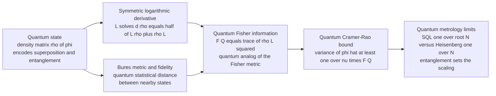

# ⚛️ Quantum Information Geometry

> [!abstract] TL;DR
> Classical information geometry curves the space of *probability distributions* with the Fisher-Rao metric. **Quantum information geometry** replaces distributions with **density matrices** $\rho$ — richer objects encoding superposition and entanglement — and asks: what is the geometry of quantum *states*? The answer is the **quantum Fisher information (QFI)**, defined through the **symmetric logarithmic derivative (SLD)** $L_\theta$ via $\partial_\theta\rho = \tfrac12(L\rho+\rho L)$ and $F_Q=\operatorname{Tr}(\rho L^2)$. Its inverse is the **quantum Cramér-Rao bound** $\operatorname{Var}(\hat\theta)\ge 1/(\nu F_Q)$ — the ultimate precision floor for estimating any parameter imprinted on a quantum system (**quantum metrology**). The corresponding distance is the **Bures metric**, the quantum analogue of Fisher-Rao, tied to state **fidelity**. The deep twist from the classical story: because operators **do not commute**, there is **no unique invariant metric** — a whole *family* of monotone quantum metrics exists (Petz's classification: SLD/Bures, Kubo-Mori, right/left), so the quantum Chentsov theorem is a theorem with *many* solutions, not one. Entanglement lets the QFI beat the standard quantum limit $1/\sqrt N$ and reach the **Heisenberg limit** $1/N$ — the physics behind atomic clocks, LIGO, and quantum sensors.

---

## Intuition

**Analogy — telling two nearly identical bells apart by listening.** Classical information geometry is like judging how easily you can distinguish two slightly different thermometers by reading them: the closer their readings, the harder to tell apart, and the "statistical distance" between them measures exactly that difficulty. But a quantum state is not a single reading. It is like the full ringing of a bell — carrying overtones, timing, and *phase* (superposition), and even correlations with other bells struck together (entanglement). To tell two nearly identical bells apart you get to **choose how to listen**: which frequency, which instant, which combination of microphones.

The **quantum Fisher information** asks: over the *best possible way to listen* — the optimal measurement — how distinguishable are two neighbouring quantum states? Its curvature is the **sharpest ruler physics allows** for that state space. Where a tiny nudge of a parameter makes the state loudly distinguishable, the quantum metric stretches and precision is high; where it barely changes the state, the ruler goes slack. This is why an atomic clock can resolve a tick a billion times finer than any classical stopwatch, and why entangling the "bells" — ringing them as one GHZ chord — sharpens the ruler quadratically, from the shot-noise $1/\sqrt N$ scaling to the Heisenberg $1/N$ limit.

---

## How It Works

### Core mechanics

The whole apparatus is the classical Fisher-Rao story with three quantum replacements: distributions $p(x;\theta)\to$ density matrices $\rho_\theta$; the score $\partial_\theta\log p\to$ the **symmetric logarithmic derivative** $L_\theta$; the expectation $\mathbb{E}[\,\cdot\,]\to$ the trace $\operatorname{Tr}(\rho\,\cdot)$.

1. **The state is a density matrix.** A quantum system is described by $\rho$: Hermitian, positive semi-definite, unit trace. Its eigenvalues are a classical probability distribution over an orthonormal basis, but the *off-diagonal* structure encodes coherence (superposition) that has no classical counterpart. A parameter $\theta$ (a phase, a field strength, a time) is imprinted as a family $\rho_\theta$, usually by unitary evolution $\rho_\theta = e^{-i\theta G}\rho_0\,e^{i\theta G}$ with a **generator** $G$ (a Hermitian observable).

2. **The SLD is the quantum score.** Since $\rho$ and $\partial_\theta\rho$ need not commute, there is no single "$\partial_\theta\log\rho$". The **symmetric** choice is the operator $L_\theta$ solving the Lyapunov equation
$$\partial_\theta\rho_\theta \;=\; \tfrac12\big(L_\theta\rho_\theta + \rho_\theta L_\theta\big).$$
In the eigenbasis $\rho=\sum_i p_i\lvert i\rangle\langle i\rvert$, its matrix elements are $L_{ij} = \dfrac{2\,\langle i\lvert\partial_\theta\rho\rvert j\rangle}{p_i+p_j}$ for $p_i+p_j>0$.

3. **The QFI is the quantum Fisher metric.** The **quantum Fisher information** is
$$F_Q(\theta) \;=\; \operatorname{Tr}\!\big(\rho_\theta L_\theta^2\big) \;=\; \operatorname{Tr}\!\big(L_\theta\,\partial_\theta\rho_\theta\big) \;=\; \sum_{i,j:\,p_i+p_j>0}\frac{2\,\lvert\langle i\lvert\partial_\theta\rho\rvert j\rangle\rvert^2}{p_i+p_j}.$$
For a **pure state** it collapses to $F_Q = 4\operatorname{Var}_{\psi}(G) = 4\big(\langle G^2\rangle-\langle G\rangle^2\big)$ — the variance of the generator. The larger the spread of the generator on the probe state, the faster the state moves under $\theta$, and the more precisely $\theta$ can be read out.

4. **The quantum Cramér-Rao bound.** For any measurement (POVM) and any locally unbiased estimator $\hat\theta$ built from $\nu$ repetitions,
$$\operatorname{Var}(\hat\theta)\;\ge\;\frac{1}{\nu\,F_C}\;\ge\;\frac{1}{\nu\,F_Q},$$
where $F_C$ is the *classical* Fisher information of the chosen measurement's outcome distribution. The QFI is the maximum of $F_C$ over **all** measurements: $F_Q=\max_{\text{POVM}}F_C$. So the QFI is the geometry after optimizing the readout, and the SLD eigenbasis is the measurement that attains it (single-parameter case).

5. **Bures metric and fidelity.** The line element $ds^2_{\text{Bures}} = \tfrac14 F_Q\,d\theta^2$ defines the **Bures distance**, the quantum analogue of the Fisher-Rao distance. It is generated by the **fidelity** $\mathcal F(\rho,\sigma)=\big(\operatorname{Tr}\sqrt{\sqrt\rho\,\sigma\,\sqrt\rho}\big)^2$ via $D_{\text{Bures}}^2 = 2\big(1-\sqrt{\mathcal F}\big)$. Nearby-state fidelity has QFI as its leading curvature — exactly as classical fidelity/Bhattacharyya curvature gives Fisher-Rao.

### The metrology advantage

Estimate a phase $\varphi$ using $N$ probes. With $N$ **independent** probes the generator is additive, $F_Q=N$, so the quantum CRB gives $\Delta\varphi\ge 1/\sqrt N$ — the **standard quantum limit** (shot noise). Prepare instead an **entangled GHZ state** $(\lvert 0\rangle^{\otimes N}+\lvert 1\rangle^{\otimes N})/\sqrt2$: the collective phase accumulates $N$ times faster, the generator variance jumps to $N^2/4$, so $F_Q=N^2$ and $\Delta\varphi\ge 1/N$ — the **Heisenberg limit**. Entanglement is metric engineering: it stretches the quantum ruler quadratically.

### Flow: from density matrix to metrology limit



---

## Key Concepts

### Secondary (intuition-level)

- **A quantum state is richer than a probability.** A density matrix carries superposition and entanglement, not just a list of outcome probabilities — so its geometry is its own subject.
- **The quantum ruler measures best-case distinguishability.** The quantum Fisher information asks how far apart two nearby states are *under the best possible measurement*, not a fixed one.
- **Precision has a hard floor.** The quantum Cramér-Rao bound caps how sharply any parameter can be estimated from a quantum system — the ultimate limit of measurement.
- **Entanglement sharpens the ruler.** Entangled probes push precision from the shot-noise $1/\sqrt N$ scaling to the Heisenberg $1/N$ limit — the core resource of quantum sensing.

### Undergraduate (needs linear algebra + quantum basics)

- **SLD as quantum score.** $L_\theta$ solves $\partial_\theta\rho=\tfrac12(L\rho+\rho L)$; in the eigenbasis $L_{ij}=2\langle i\lvert\partial_\theta\rho\rvert j\rangle/(p_i+p_j)$.
- **QFI formula.** $F_Q=\operatorname{Tr}(\rho L^2)=\sum_{p_i+p_j>0}2\lvert\langle i\lvert\partial_\theta\rho\rvert j\rangle\rvert^2/(p_i+p_j)$; for pure states $F_Q=4\operatorname{Var}(G)$.
- **Qubit QFI.** A Bloch vector of length $r$ rotated by a phase has $F_Q=r^2$ (equatorial), reaching $1$ for a pure qubit; the Bloch surface is where states become sharply distinguishable.
- **Quantum CRB.** $\operatorname{Var}(\hat\theta)\ge 1/(\nu F_Q)$; the SLD eigenbasis is the optimal single-parameter measurement.
- **Bures / fidelity.** $D_{\text{Bures}}^2=2(1-\sqrt{\mathcal F})$; the QFI is the local curvature of fidelity between neighbouring states.
- **SQL vs Heisenberg.** Separable $N$ probes give $F_Q=N$ ($\Delta\varphi\sim 1/\sqrt N$); a GHZ state gives $F_Q=N^2$ ($\Delta\varphi\sim 1/N$).

### Graduate (system-level)

- **Non-uniqueness: the Petz classification.** Unlike the classical Chentsov theorem (Fisher-Rao is *the unique* monotone metric up to scale), **non-commutativity** admits an entire *family* of monotone (contractive under CPTP maps) Riemannian metrics on quantum states, indexed by an operator-monotone function $f$. The **SLD/Bures** metric is the *smallest* ($f(x)=\tfrac{1+x}{2}$), the **RLD/right** metric the *largest*, with **Kubo-Mori/Bogoliubov** (the metric of quantum relative entropy, $f=\tfrac{x-1}{\log x}$) in between. The quantum Chentsov theorem (Petz-Sudár) is a theorem with *many* solutions.
- **Multiparameter obstruction and the Holevo bound.** For a single parameter the SLD-QCRB is attainable; for **multiple parameters** the SLDs generally do not commute, no single measurement is jointly optimal, and the matrix QCRB $\operatorname{Cov}(\hat{\boldsymbol\theta})\succeq(\nu F_Q)^{-1}$ is not tight. The tighter attainable bound is the **Holevo Cramér-Rao bound**; asymptotic attainability is governed by the imaginary part $\operatorname{Tr}(\rho[L_i,L_j])$ (the "incompatibility").
- **Fidelity susceptibility and quantum phase transitions.** Along a Hamiltonian parameter, $F_Q$ (the fidelity susceptibility) *diverges* at a quantum critical point: the ground state changes character abruptly, so nearby states become maximally distinguishable. QFI is thus an order-parameter-free detector of quantum phase transitions.
- **Quantum speed limits.** The Mandelstam-Tamm and Margolus-Levitin bounds are QFI statements: the Bures-metric speed of state evolution is set by the energy variance, so $F_Q$ caps how fast a system can traverse state space — the geometry of quantum dynamics.
- **Umegaki relative entropy.** The quantum analogue of KL divergence, $S(\rho\Vert\sigma)=\operatorname{Tr}\rho(\log\rho-\log\sigma)$, has the **Kubo-Mori** metric as its second-order expansion — the quantum echo of "Fisher = curvature of KL", but now selecting a *different* member of the monotone family than the metrology-relevant SLD/Bures.

---

## Python Demo

```python
# numpy + matplotlib only.
# QUANTUM INFORMATION GEOMETRY: quantum Fisher information (QFI) & metrology.
#
# PART A  Estimating a phase phi imprinted on qubits.
#   (A1) General QFI via the SYMMETRIC LOGARITHMIC DERIVATIVE (SLD):
#          F_Q = sum_{i,j : p_i+p_j>0}  2 |<i|d rho|j>|^2 / (p_i + p_j),
#        verified on a single mixed qubit (visibility r) where F_Q = r^2.
#   (A2) The METROLOGY ADVANTAGE (pure-state formula F_Q = 4 Var(G), G = J_z):
#          N separable qubits ->  F_Q = N    -> Standard Quantum Limit  d phi ~ 1/sqrt(N)
#          N-qubit GHZ state  ->  F_Q = N^2  -> Heisenberg Limit        d phi ~ 1/N
#        Quantum Cramer-Rao bound: Var(phi_hat) >= 1 / (nu F_Q).
#
# PART B  The Bures / quantum-Fisher METRIC on the Bloch ball.
#   For a qubit rho(r) = (I + r.sigma)/2 the QFI metric is
#          ds^2 = |dr|^2 + (r.dr)^2 / (1 - |r|^2),
#   whose RADIAL part 1/(1-r^2) blows up at the pure-state surface |r|=1:
#   pure states are "infinitely distinguishable" in purity.

import numpy as np
import matplotlib.pyplot as plt

# --- Pauli matrices -------------------------------------------------------
I2 = np.eye(2, dtype=complex)
sx = np.array([[0, 1], [1, 0]], dtype=complex)
sy = np.array([[0, -1j], [1j, 0]], dtype=complex)

# --- (A1) General QFI via the SLD ----------------------------------------
def qfi_sld(rho, drho, tol=1e-12):
    """Quantum Fisher information of a family rho(phi) via the SLD spectral formula."""
    p, V = np.linalg.eigh(rho)                 # rho Hermitian -> real eigenvalues
    D = V.conj().T @ drho @ V                  # d rho expressed in the eigenbasis
    F = 0.0
    for i in range(len(p)):
        for j in range(len(p)):
            s = p[i] + p[j]
            if s > tol:
                F += 2.0 * abs(D[i, j])**2 / s
    return float(F.real)

# Single mixed qubit: equatorial Bloch vector of length r, rotated by phi about z.
r_test, phi = 0.8, 0.5
rho  = 0.5 * (I2 + r_test * (np.cos(phi) * sx + np.sin(phi) * sy))
drho = 0.5 * r_test * (-np.sin(phi) * sx + np.cos(phi) * sy)
F_num = qfi_sld(rho, drho)
print("PART A1 -- SLD quantum Fisher information for a mixed qubit")
print(f"  visibility r = {r_test}")
print(f"  F_Q (SLD, numeric) = {F_num:.6f}   analytic r^2 = {r_test**2:.6f}")
print(f"  quantum CRB  d phi >= 1/sqrt(F_Q) = {1/np.sqrt(F_num):.4f}\n")

# --- (A2) Metrology: separable vs GHZ, QFI via pure-state 4 Var(G) --------
def jz_eigs(N):
    """Diagonal of J_z = sum_i sigma_z^(i)/2 in the computational basis."""
    b = np.arange(2**N)
    popcount = np.array([bin(k).count("1") for k in b])
    return 0.5 * (N - 2 * popcount)

def qfi_pure(psi, g_diag):
    """F_Q = 4 Var(G) for a pure state; generator G diagonal in the comp. basis."""
    pr = np.abs(psi)**2
    mean  = np.sum(pr * g_diag)
    mean2 = np.sum(pr * g_diag**2)
    return 4.0 * (mean2 - mean**2)

Ns = np.arange(1, 11)
F_sep, F_ghz = [], []
for N in Ns:
    g = jz_eigs(N)
    dim = 2**N
    psi_sep = np.ones(dim, dtype=complex) / np.sqrt(dim)   # |+>^N  (separable)
    psi_ghz = np.zeros(dim, dtype=complex)
    psi_ghz[0] = psi_ghz[-1] = 1 / np.sqrt(2)              # (|0..0> + |1..1>)/sqrt2
    F_sep.append(qfi_pure(psi_sep, g))
    F_ghz.append(qfi_pure(psi_ghz, g))
F_sep, F_ghz = np.array(F_sep), np.array(F_ghz)

print("PART A2 -- metrology advantage (QFI scaling)")
print("   N   F_Q(sep)  F_Q(GHZ)   SQL 1/sqrt(N)   Heisenberg 1/N")
for N, fs, fg in zip(Ns, F_sep, F_ghz):
    print(f"  {N:2d}     {fs:5.1f}    {fg:6.1f}       {1/np.sqrt(N):.4f}         {1/N:.4f}")

dphi_sql = 1 / np.sqrt(F_sep)   # = 1/sqrt(N)
dphi_hl  = 1 / np.sqrt(F_ghz)   # = 1/N

# --- (B) Bures / QFI metric on the Bloch ball (equatorial slice) ----------
gg = np.linspace(-0.985, 0.985, 400)
X, Y = np.meshgrid(gg, gg)
R2 = X**2 + Y**2
inside = R2 < 0.985**2
radial_factor = np.where(inside, 1.0 / (1.0 - R2), np.nan)   # 1/(1 - r^2)

# --- Plots ----------------------------------------------------------------
fig, ax = plt.subplots(1, 3, figsize=(15, 4.6))

ax[0].loglog(Ns, F_sep, "o-", color="tab:blue", label="separable  F_Q = N")
ax[0].loglog(Ns, F_ghz, "s-", color="tab:red",  label="GHZ  F_Q = N^2")
ax[0].set_xlabel("number of probes  N"); ax[0].set_ylabel("quantum Fisher information  F_Q")
ax[0].set_title("Entanglement boosts the QFI")
ax[0].grid(True, which="both", alpha=0.3); ax[0].legend(fontsize=8)

ax[1].loglog(Ns, dphi_sql, "o-", color="tab:blue", label="SQL  1/sqrt(N)  (separable)")
ax[1].loglog(Ns, dphi_hl,  "s-", color="tab:red",  label="Heisenberg  1/N  (GHZ)")
ax[1].set_xlabel("number of probes  N"); ax[1].set_ylabel("phase precision floor  d phi_min")
ax[1].set_title("Quantum Cramer-Rao bound: SQL vs Heisenberg")
ax[1].grid(True, which="both", alpha=0.3); ax[1].legend(fontsize=8)

pc = ax[2].pcolormesh(X, Y, np.log10(radial_factor), shading="auto", cmap="magma")
fig.colorbar(pc, ax=ax[2], label="log10 radial QFI metric  1/(1 - r^2)")
th = np.linspace(0, 2 * np.pi, 200)
ax[2].plot(np.cos(th), np.sin(th), "c-", lw=1.5)     # pure-state boundary |r| = 1
ax[2].set_aspect("equal"); ax[2].set_xlabel("Bloch x"); ax[2].set_ylabel("Bloch y")
ax[2].set_title("Bures metric blows up at pure states (|r| -> 1)")

plt.tight_layout()
plt.savefig("quantum_information_geometry.png", dpi=120)
plt.show()
```

**What the output shows.** Part A1 confirms the general SLD machinery: computing the quantum Fisher information of a mixed equatorial qubit straight from the symmetric logarithmic derivative returns $F_Q\approx 0.64$, exactly the analytic $r^2$ for visibility $r=0.8$, and the quantum Cramér-Rao bound reads $\Delta\varphi\ge 1/\sqrt{F_Q}\approx 1.25$. Part A2 is the metrology headline: $N$ **separable** probes give $F_Q=N$ (slope-1 line) while the **GHZ** state gives $F_Q=N^2$ (slope-2 line) — a genuinely *quadratic* boost from entanglement. Translated through the quantum CRB, the precision floor drops from the standard quantum limit $1/\sqrt N$ to the Heisenberg limit $1/N$; at $N=10$ the GHZ probe is $\sqrt{10}\approx 3.2\times$ sharper, a gap that widens with $N$. Part B maps the radial component $1/(1-r^2)$ of the Bures/QFI metric across an equatorial slice of the Bloch ball: it stays mild near the maximally-mixed centre and **blows up at the pure-state boundary** $\lvert r\rvert=1$ — pure states are "infinitely far apart in purity", the geometric statement that a coherent quantum state is a sharply resolvable resource.

---

## Real-World Applications

> **Atomic clocks and optical lattice clocks.** The frequency of a clock transition is a phase $\varphi=\omega t$ imprinted on an ensemble of atoms; the quantum Fisher information sets the fundamental stability floor. State-of-the-art clocks use spin-squeezed and entangled ensembles to push the QFI beyond the standard quantum limit, and the international redefinition of the second rides on shaving this metrological variance.

> **LIGO and gravitational-wave detection.** A gravitational wave shifts the relative phase of laser light in a kilometre-scale interferometer. LIGO injects **squeezed vacuum** states so the quantum Fisher information for the phase quadrature rises, lowering shot noise below the standard quantum limit across the detection band — a direct, working use of quantum-metrology geometry that has increased the detection rate of merging black holes.

> **Quantum sensing and imaging.** Magnetometers based on NV centres in diamond, atom interferometers for gravimetry and inertial navigation, and quantum-enhanced microscopy all quote a quantum Cramér-Rao bound as the target and engineer probe states (entangled, squeezed, N00N) to maximize $F_Q$ for the field, acceleration, or reflectance being estimated. See [[Qubits_and_the_Bloch_Sphere]].

> **Quantum phase transitions in many-body physics.** The **fidelity susceptibility** — the quantum Fisher information along a Hamiltonian parameter — diverges at a quantum critical point. Condensed-matter theorists use it as a geometric, order-parameter-free diagnostic to locate transitions in spin chains and Hubbard models where a conventional order parameter is hard to guess. See [[Quantum_Statistical_Mechanics]].

> **Quantum tomography and estimation.** Reconstructing an unknown state or channel is a parameter-estimation problem on the manifold of density matrices; the quantum Fisher information matrix quantifies how many copies are needed for a target accuracy and guides adaptive measurement design, the quantum analogue of optimal experimental design.

---

## Common Pitfalls

- **Assuming "the" quantum Fisher information is unique.** There is not one quantum metric but a whole **monotone family** (Petz classification): SLD/Bures, Kubo-Mori/Bogoliubov, RLD/right, and infinitely many between. They coincide only in the classical (commuting) limit. Metrology uses the **SLD/Bures** metric; the second-order expansion of quantum relative entropy is the **Kubo-Mori** metric — a *different* member. Quoting "the QFI" without saying which one is ambiguous.
- **Forgetting non-commutativity breaks classical uniqueness.** Chentsov's theorem makes Fisher-Rao *the* unique classical metric; its quantum analogue (Petz-Sudár) is a *classification*, not a uniqueness result, precisely because $[\rho,\partial_\theta\rho]\ne 0$. Expecting a single "correct" quantum metric imports classical intuition that does not survive.
- **Treating the quantum CRB as always attainable.** For a **single** parameter the SLD bound is saturated by measuring in the SLD eigenbasis. For **multiple** parameters the SLDs generally do not commute, no joint optimal measurement exists, and the matrix quantum CRB is *loose* — the attainable target is the tighter **Holevo bound**. Assuming per-parameter attainability overstates achievable precision.
- **Ignoring the measurement choice.** The QFI is the classical Fisher information *maximized over all POVMs*. A fixed, sub-optimal measurement realizes only $F_C\le F_Q$, so an experiment that does not implement (or adapt toward) the SLD basis will not reach the quantum bound — the geometry promises a floor only for the *best* readout.
- **Believing entanglement gives a free lunch.** The Heisenberg $1/N$ scaling assumes noiseless probes. Under realistic **decoherence** (dephasing, loss), GHZ states are fragile and the advantage typically collapses back to a constant-factor improvement over the standard quantum limit. The QFI must be computed for the *actual noisy channel*, not the ideal unitary.

---

## Related Concepts

*Cross-vault connections (Glob-verified):*

- [[Qubits_and_the_Bloch_Sphere]] — the Bloch ball is the concrete state manifold whose Bures/QFI metric this note maps; the radial blow-up at the surface is the pure-state boundary of that sphere.
- [[Entanglement_and_Bell_States]] — entanglement (the GHZ generalization of Bell states) is exactly what boosts the quantum Fisher information from the $N$-scaling standard quantum limit to the $N^2$-scaling Heisenberg limit.
- [[Measurement_and_the_No_Cloning_Theorem]] — the quantum CRB is a floor *over all measurements*; the QFI is the classical Fisher information maximized over POVMs, so measurement choice is the crux of attainability.
- [[Quantum_Fourier_Transform_and_Phase_Estimation]] — quantum phase estimation is the algorithmic sibling of quantum metrology: both extract a phase $\varphi$ from a quantum register, and both hit Heisenberg-limited $1/N$ precision.
- [[Quantum_Information_Theory]] — supplies the density-matrix formalism, quantum (Umegaki) relative entropy, and fidelity that underpin the Bures metric and the quantum divergence geometry here.
- [[Fisher_Information_and_the_Cramer_Rao_Bound]] — the classical parent: this note is its non-commutative extension, replacing distributions with density matrices and the score with the SLD.
- [[Quantum_Statistical_Mechanics]] — the density-matrix (mixed-state, thermal) machinery whose parameter geometry gives fidelity susceptibility and the detection of quantum phase transitions.
- [[Angular_Momentum_and_Spin]] — spin-$\tfrac12$ systems are the physical qubits used throughout; the collective spin operator $J_z$ is the phase generator whose variance is the pure-state QFI.
- [[Eigenvalues_and_Eigenvectors]] — the SLD and QFI are computed by diagonalizing the density matrix; the spectral formula sums over eigenvalue pairs $p_i+p_j$.
- [[Inner_Product_Spaces]] — quantum states live in a complex Hilbert space; fidelity and the Bures distance are built from its Hermitian inner product and operator geometry.

*Siblings in this Information Geometry vault, referenced in prose: this note is the quantum lift of **the Fisher information metric** (distributions become density matrices, the score becomes the SLD) and of **Cramér-Rao bound and efficiency** (the classical floor becomes the quantum CRB). The classical uniqueness of **Chentsov's uniqueness theorem** is exactly what fails here — non-commutativity yields a family of metrics, not one. The Bures distance is the quantum analogue of **the Fisher-Rao distance**, and quantum information geometry is one of the open directions surveyed in **The Reach and Future of Information Geometry**.*

---

## Review Questions

1. **(Secondary)** Using the "telling two nearly identical bells apart by listening" analogy, explain why the quantum Fisher information depends on choosing the *best* measurement, and why entangling the probes (ringing the bells as one chord) can sharpen the estimate beyond what independent probes allow.
2. **(Undergraduate)** For a pure qubit prepared as $\lvert+\rangle=(\lvert0\rangle+\lvert1\rangle)/\sqrt2$ with a phase $\varphi$ imprinted by the generator $G=\sigma_z/2$, show that $F_Q=4\operatorname{Var}(G)=1$ and hence the single-shot quantum Cramér-Rao bound is $\Delta\varphi\ge 1$. Then argue why an $N$-qubit GHZ state gives $F_Q=N^2$ and a precision floor $1/N$, while $N$ separable copies give only $1/\sqrt N$.
3. **(Graduate)** Contrast the classical Chentsov uniqueness theorem with its quantum counterpart. Why does non-commutativity produce an entire monotone family of quantum metrics (Petz classification) rather than a single one? Identify which member metrology uses and which arises as the curvature of quantum relative entropy, and explain what goes wrong with attainability of the SLD quantum Cramér-Rao bound in the *multiparameter* case.

---

## Sources

- Braunstein, S. L. & Caves, C. M. (1994). *Statistical distance and the geometry of quantum states.* Physical Review Letters, 72(22), 3439-3443. (defines the QFI/SLD and the quantum CRB geometry)
- Petz, D. (2008). *Quantum Information Theory and Quantum Statistics.* Springer. (monotone metrics, the quantum Chentsov/Petz classification)
- Amari, S. & Nagaoka, H. (2000). *Methods of Information Geometry*, Ch. 7 (quantum states, SLD, quantum CRB). AMS / Oxford University Press.
- Paris, M. G. A. (2009). *Quantum estimation for quantum technology.* International Journal of Quantum Information, 7(supp01), 125-137. (QFI, metrology, worked estimation problems)
- Giovannetti, V., Lloyd, S. & Maccone, L. (2011). *Advances in quantum metrology.* Nature Photonics, 5, 222-229. (standard quantum limit vs Heisenberg limit, entangled probes)

---

#information-geometry #quantum #quantum-fisher-information #quantum-metrology #density-matrices
