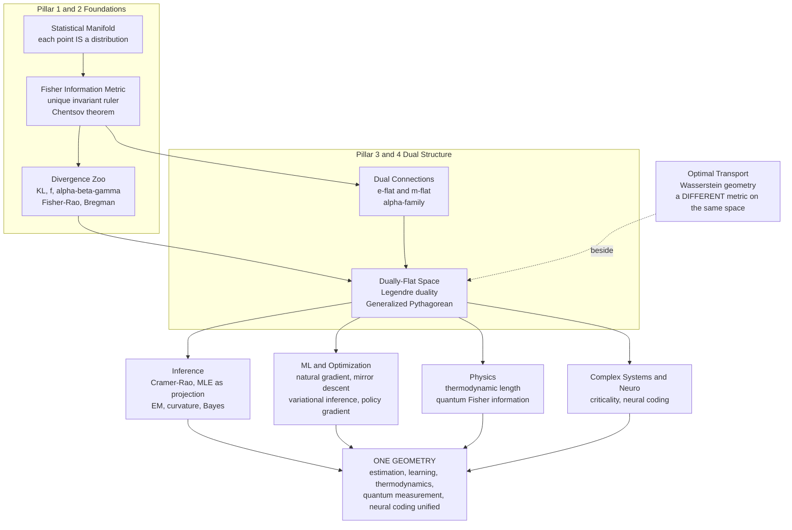

# 🧭 The Reach and Future of Information Geometry

> [!abstract] TL;DR
> This is the **capstone** of the Information Geometry vault: a synthesis of everything the field builds — the **Fisher information metric** (the unique invariant ruler on distribution-space, by Chentsov), the **dual affine connections** and **dually-flat** structure that give it the **generalized Pythagorean theorem**, the family of **divergences** (KL, $f$, $\alpha\beta\gamma$, Fisher–Rao, and Wasserstein as a *different* geometry), and the payoff across **inference, machine learning, optimization, physics, quantum measurement, and neuroscience**. The single big idea: **statistics becomes geometry** — distributions are points, models are surfaces, inference is projection, and learning is motion along a curved manifold. Seen this way, estimation, deep learning, thermodynamics, quantum metrology, and neural coding turn out to be **one geometry viewed from different angles**. This note closes the loop and looks forward: singular/overparameterized models (Watanabe), the geometry of generative AI and diffusion, the open unification of **Wasserstein and Fisher–Rao**, quantum information geometry, and geometry-aware optimization at scale.

---

## Intuition

**Analogy — Descartes' mirror.** Descartes' great idea was to turn **geometry into algebra**: he laid a coordinate grid over the plane so that points became pairs of numbers and shapes became equations. A circle stopped being a *drawing* and became $x^2 + y^2 = r^2$. That single move let algebra solve geometry and geometry illuminate algebra.

Information geometry runs the **same revolution in reverse** — it turns **statistics into geometry**. A probability distribution stops being a *formula* and becomes a **point**. A statistical model — a whole family of distributions — becomes a **curved surface**. The act of fitting a model to data stops being an optimization ritual and becomes **navigation**: you are finding the point on the surface closest to where the data lives, walking geodesics, measuring angles. Estimation becomes projection; learning becomes motion; the Cramér–Rao floor on estimator precision becomes a statement about the **curvature** of the surface.

Once you accept the landscape, an astonishing unity appears. The space of probability distributions is *one place* with a distance (Fisher–Rao), a pair of straightnesses (the dual $e$- and $m$-connections), and a curvature. And when you look closely, the **same landscape** is being walked by the statistician estimating a parameter, the deep network descending a loss, the physicist tracking a thermodynamic process near equilibrium, the experimentalist squeezing the last bit of precision from a quantum measurement, and the neuron tuning its code to a stimulus. They are all doing geometry on the manifold of distributions — they just did not know they were speaking the same language. This vault is the phrasebook; this note is its closing chapter and its forward glance.

---

## How It Works

Information geometry is not a grab-bag of tricks; it is a **layered construction** in which each floor rests on the one below and the whole tower supports a wide roof of applications. This capstone re-walks the tower top-to-bottom and then shows the single peak all the paths reach.

### The four load-bearing pillars

1. **A family of distributions becomes a manifold.** Parametrize a family $p(x;\theta)$ — Gaussians, an exponential family, or the softmax outputs of a network — and let $\theta$ be *coordinates*. The set becomes a smooth **statistical manifold** where each point *is* a distribution (the foundation laid in **Statistical Manifolds** and **Exponential Families and Their Geometry**).
2. **The Fisher metric is the one honest ruler.** Expand any reasonable divergence between nearby distributions and the leading term is a quadratic form $\tfrac12\,\Delta\theta^\top G(\theta)\,\Delta\theta$ with $G$ the **Fisher information matrix**. **Chentsov's theorem** proves this metric is *unique* up to scale among metrics invariant under sufficient statistics — the deepest reason geometry is *canonical* here, not an arbitrary overlay (see **The Fisher Information Metric**, **Chentsov Uniqueness Theorem**, **Divergences as Geometric Structure**).
3. **A pair of dual connections makes the space dually-flat.** A metric measures length; a **connection** defines "straight lines" (geodesics) and parallel transport. Amari's **$\alpha$-connections** interpolate between the **exponential ($e$-)** and **mixture ($m$-)** connections, which are *dual* with respect to the Fisher metric. On an exponential family the manifold is **dually flat**: flat under *both* connections in two Legendre-linked coordinate charts ($\theta$ natural, $\eta$ expectation). This is the **signature** of information geometry (see **Dual Affine Connections**, **The Alpha Family of Connections**, **Dually Flat Spaces**, **Legendre Transform and Convex Duality**).
4. **Dual flatness yields divergences and a Pythagorean theorem.** The dually-flat structure produces a canonical **Bregman divergence** (KL for exponential families) that behaves like a squared distance and obeys the **generalized Pythagorean theorem**: orthogonal $e$/$m$ geodesic triangles satisfy $D(P\|R)=D(P\|Q)+D(Q\|R)$. This one identity powers MLE-as-projection and the EM algorithm (see **Bregman Divergences**, **The Generalized Pythagorean Theorem**).

### The wide roof — where the pillars carry weight

From that structure, the field reaches into statistics (**Cramér-Rao Bound and Efficiency**, **Maximum Likelihood as Projection**, **The em Algorithm and Information Projection**, **Bayesian Information Geometry and Jeffreys Priors**), machine learning and optimization (natural gradient, **Mirror Descent and Bregman Optimization**, **Information Geometry of Deep Learning**, **Natural Policy Gradients in RL**), and the frontiers of physics, quantum measurement, complex systems, and neural coding. The **divergence** layer branches too: **Kullback-Leibler Divergence and Geometry**, **f_Divergences**, **The Alpha Beta Gamma Divergence Families**, and the intrinsic **Fisher-Rao Distance** live on the manifold — while **Optimal Transport and Wasserstein Geometry** sits *beside* it as a genuinely different geometry of the same distribution-space.

### The unified picture



The founders map onto the tower: **C. R. Rao** (1945) saw the Fisher metric make parameter space Riemannian; **N. N. Chentsov** proved its uniqueness through invariance; **Bradley Efron** tied statistical **curvature** to second-order efficiency; and **Shun-ichi Amari** built the dual-connection, dually-flat theory and the **natural gradient** — the backbone of the whole edifice.

---

## Key Concepts

### 🟢 Secondary (the four ideas that make the field)

- **A distribution is a point; a model is a surface.** The entire vault rests on this one relabeling. Everything statistical becomes a question about the *shape and geography* of distribution-space.
- **There is one honest ruler.** You do not get to *choose* how far apart two distributions are — the **Fisher metric** is forced on you by the demand that measurement not depend on how you happened to parametrize the model.
- **Inference is navigation.** Fitting a model is finding the nearest point on a surface; learning is walking downhill on that surface; comparing models is measuring how far apart two regions sit.
- **One geometry, many disguises.** The same curved distribution-space is being walked by statisticians, neural networks, thermodynamic processes, quantum sensors, and neurons.

### 🟡 Undergraduate (the machinery being synthesized)

- **The invariant metric.** $g_{ij}(\theta)=\mathbb{E}[\partial_i \log p\,\partial_j \log p]$ is simultaneously the Hessian of KL, the curvature of the log-likelihood, and $-\mathbb{E}[\partial_i\partial_j\log p]$. It is the object **Chentsov Uniqueness Theorem** singles out.
- **The dual-flat structure.** Exponential families carry two flat coordinate systems — natural $\theta$ and expectation $\eta=\nabla\psi(\theta)$ — linked by a **Legendre transform**. Flatness in each is what "dually flat" means, and it is *not* the same as vanishing Levi-Civita curvature.
- **The projection theorem.** Because the space is dually flat, MLE is an **$m$-projection**, MaxEnt is an **$e$-projection** onto a constraint set, and both obey a **generalized Pythagorean** identity — the geometric heart of estimation.
- **The natural gradient.** The Fisher-corrected update $\tilde\nabla L = G^{-1}\nabla L$ is the *steepest descent that respects the metric* — reparameterization-invariant and, near a minimum, second-order-like. It is information geometry's single biggest export to modern ML.
- **Two geometries, one space.** **Fisher–Rao** measures how *statistically distinguishable* distributions are; **Wasserstein / optimal transport** measures how much *mass must move* to turn one into the other. They are genuinely different — a central modern tension, not a technicality.

### 🔴 Graduate (the deep structure and open edges)

- **$\alpha$-geometry and duality.** The $\pm1$-connections are flat extremes of the $\alpha$-family; duality $\nabla^{(\alpha)}$ and $\nabla^{(-\alpha)}$ w.r.t. $g$ is the abstract engine, with $\alpha=0$ the metric connection. **Amari–Nagaoka** theory generalizes Legendre/Bregman duality to non-flat manifolds.
- **Curvature as higher-order asymptotics.** Cramér–Rao is the *flat*, first-order story; the manifold's embedding **curvature** (Efron) governs the next order — bias, information loss, and the failure of second-order efficiency for curved (non-exponential) models.
- **Singular models and algebraic geometry.** Neural networks, mixtures, and hierarchical models have **degenerate Fisher matrices** at non-identifiable points; the clean Riemannian picture breaks and is replaced by **Watanabe's singular learning theory**, where resolution of singularities and real log-canonical thresholds set the effective dimension.
- **The Wasserstein–Fisher-Rao frontier.** Unifying the *information* geometry (Fisher–Rao) with the *transport* geometry (Wasserstein) — the "Wasserstein information geometry" and the Wasserstein–Fisher–Rao / Hellinger–Kantorovich metric — is an **open program** with direct bearing on diffusion models and gradient flows.
- **Beyond exponential families.** The exact machinery (dually flat, Pythagorean, KL as canonical divergence) is *exact only* for exponential families; deformed exponential families ($q$-/Tsallis geometry), infinite-dimensional manifolds (**Ay–Jost–Lê–Schwachhöfer**), and quantum state spaces each require rebuilding the pillars with new hands.

---

## Python Demo

A single **four-panel dashboard** that captures the vault's signature ideas in one figure: (1) the **Fisher metric** making Gaussian distribution-space **curved** (information indicatrices that grow with $\sigma$); (2) the **dual $e$- and $m$-geodesics** between two categorical distributions on the 2-simplex; (3) the **generalized Pythagorean / projection** picture for the MaxEnt (information-projection) solution, verified numerically; and (4) the **natural gradient vs ordinary gradient** trajectories on the Gaussian manifold. Runnable with only `numpy` and `matplotlib`.

```python
import numpy as np
import matplotlib.pyplot as plt

rng = np.random.default_rng(0)
fig, axes = plt.subplots(2, 2, figsize=(13.5, 11))
ax1, ax2, ax3, ax4 = axes.ravel()

# ======================================================================
# PANEL 1 — Fisher metric curves distribution-space (Gaussian family)
#   G(mu, sigma) = diag(1/sigma^2, 2/sigma^2). Equal-statistical-distance
#   ellipses grow with sigma: the same parameter step covers LESS ground.
# ======================================================================
def fisher_gauss(mu, sigma):
    return np.array([[1.0 / sigma**2, 0.0], [0.0, 2.0 / sigma**2]])

def indicatrix(mu, sigma, r=0.28, n=100):
    G = fisher_gauss(mu, sigma)
    vals, vecs = np.linalg.eigh(G)
    t = np.linspace(0, 2 * np.pi, n)
    axes_pts = (r / np.sqrt(vals))[:, None] * np.stack([np.cos(t), np.sin(t)])
    pts = vecs @ axes_pts
    return mu + pts[0], sigma + pts[1]

for s in [0.4, 0.7, 1.1, 1.6, 2.2]:
    for m in np.linspace(-3, 3, 5):
        ex, ey = indicatrix(m, s)
        ax1.plot(ex, ey, color="tab:blue", lw=1.2)
        ax1.plot(m, s, ".", color="tab:red", ms=4)
ax1.set_xlabel("mean  mu"); ax1.set_ylabel("std  sigma")
ax1.set_title("1. Fisher metric makes the space CURVED\n"
              "equal-distance ellipses grow with sigma")
ax1.set_aspect("equal"); ax1.grid(alpha=0.3)

# ======================================================================
# PANEL 2 — Dual e- and m-geodesics between two categorical distributions
#   On the 2-simplex: m-geodesic = straight mixture (1-t)P + tQ,
#   e-geodesic = normalized geometric interpolation P^(1-t) Q^t.
# ======================================================================
def to_xy(p):  # embed the 3-simplex as an equilateral triangle
    p = np.asarray(p)
    x = p[..., 1] + 0.5 * p[..., 2]
    y = (np.sqrt(3) / 2) * p[..., 2]
    return x, y

P = np.array([0.70, 0.20, 0.10])
Q = np.array([0.10, 0.30, 0.60])
t = np.linspace(0, 1, 60)[:, None]

m_path = (1 - t) * P + t * Q                      # mixture geodesic
e_un = (P ** (1 - t)) * (Q ** t)                  # exponential geodesic
e_path = e_un / e_un.sum(axis=1, keepdims=True)

tri = np.array([[1, 0, 0], [0, 1, 0], [0, 0, 1], [1, 0, 0]])
tx, ty = to_xy(tri)
ax2.plot(tx, ty, color="k", lw=1)
mx, my = to_xy(m_path); ex, ey = to_xy(e_path)
ax2.plot(mx, my, color="tab:green", lw=2.5, label="m-geodesic (mixture)")
ax2.plot(ex, ey, color="tab:purple", lw=2.5, label="e-geodesic (exponential)")
for pt, name in [(P, "P"), (Q, "Q")]:
    px, py = to_xy(pt)
    ax2.plot(px, py, "o", color="tab:red", ms=8)
    ax2.annotate(name, (px, py), textcoords="offset points", xytext=(8, 6))
ax2.set_title("2. Dual geodesics on the simplex\n"
              "e-path and m-path connect the SAME two distributions")
ax2.legend(loc="upper center", fontsize=9); ax2.set_aspect("equal"); ax2.axis("off")

# ======================================================================
# PANEL 3 — Generalized Pythagorean theorem via MaxEnt (I-projection)
#   p0 = uniform on {0,1,2}. Constraint set M = { E[x] = c } is m-flat.
#   MaxEnt solution p* propto exp(lam*x) is the projection of p0 onto M.
#   Identity: KL(q||p0) = KL(q||p*) + KL(p*||p0)  for ANY q in M.
# ======================================================================
x_vals = np.array([0.0, 1.0, 2.0])
p0 = np.ones(3) / 3.0
c = 1.30

def maxent(lam):
    w = np.exp(lam * x_vals); w /= w.sum(); return w
lams = np.linspace(-5, 5, 20001)
means = np.array([maxent(l) @ x_vals for l in lams])
lam_star = lams[np.argmin(np.abs(means - c))]
p_star = maxent(lam_star)

def kl(a, b):
    return float(np.sum(a * np.log(a / b)))

# a random q also satisfying E[x] = c (solve the 2 constraints + slack)
# q = (q0, q1, q2), q0+q1+q2=1, q1+2q2 = c  ->  1-param family, pick q2 free
q2 = 0.45
q1 = c - 2 * q2
q0 = 1 - q1 - q2
q = np.array([q0, q1, q2])
lhs = kl(q, p0)
rhs = kl(q, p_star) + kl(p_star, p0)
print("PANEL 3  generalized Pythagorean check (MaxEnt I-projection)")
print(f"  lam*={lam_star:.4f}   p* = {np.round(p_star,4)}   check E[x]={p_star@x_vals:.4f}")
print(f"  KL(q||p0)                    = {lhs:.6f}")
print(f"  KL(q||p*) + KL(p*||p0)       = {rhs:.6f}")
print(f"  residual                     = {abs(lhs-rhs):.2e}  (should be ~0)\n")

# draw on the simplex
ax3.plot(tx, ty, color="k", lw=1)
# constraint line M: q1 + 2 q2 = c, sweep q2
q2s = np.linspace(max(0, (c-1)/2), min(c/2, 0.5), 50)
Mline = np.stack([1 - (c - 2*q2s) - q2s, (c - 2*q2s), q2s], axis=1)
Mx, My = to_xy(Mline)
ax3.plot(Mx, My, color="tab:orange", lw=2.5, label="constraint set M  (E[x]=c)")
p0x, p0y = to_xy(p0); psx, psy = to_xy(p_star); qx, qy = to_xy(q)
ax3.plot([p0x, psx], [p0y, psy], color="tab:purple", lw=2, label="e-geodesic p0 -> p*")
ax3.plot([psx, qx], [psy, qy], color="tab:green", lw=2, label="m-geodesic p* -> q")
for pt, name, dx in [(p0, "p0 (uniform)", 6), (p_star, "p* (MaxEnt)", 6), (q, "q", 6)]:
    ptx, pty = to_xy(pt)
    ax3.plot(ptx, pty, "o", color="tab:red", ms=7)
    ax3.annotate(name, (ptx, pty), textcoords="offset points", xytext=(dx, 6), fontsize=8)
ax3.set_title("3. Generalized Pythagorean theorem\n"
              "KL(q||p0) = KL(q||p*) + KL(p*||p0)  exactly")
ax3.legend(loc="lower center", fontsize=8); ax3.set_aspect("equal"); ax3.axis("off")

# ======================================================================
# PANEL 4 — Natural gradient vs ordinary gradient on the Gaussian manifold
#   Minimize L = KL( N(mu,sigma) || N(0,1) ). Ordinary GD uses the
#   Euclidean gradient in (mu,sigma); natural GD premultiplies by G^-1.
# ======================================================================
mu0, s0 = 0.0, 1.0  # target N(0,1)

def grad_kl(mu, s):  # d/d(mu,sigma) of KL(N(mu,s)||N(0,1))
    return np.array([(mu - mu0) / s0**2, -1.0 / s + s / s0**2])

def run(natural, lr, steps=60, start=(2.5, 2.6)):
    theta = np.array(start, float); path = [theta.copy()]
    for _ in range(steps):
        g = grad_kl(*theta)
        if natural:
            Ginv = np.diag([theta[1]**2, 0.5 * theta[1]**2])  # inverse Fisher
            step = Ginv @ g
        else:
            step = g
        theta = theta - lr * step
        theta[1] = max(theta[1], 1e-3)  # keep sigma positive
        path.append(theta.copy())
    return np.array(path)

ord_path = run(False, lr=0.15)
nat_path = run(True,  lr=0.15)
ax4.plot(ord_path[:, 0], ord_path[:, 1], "o-", color="tab:blue", ms=3,
         lw=1.4, label=f"ordinary GD ({len(ord_path)-1} steps)")
ax4.plot(nat_path[:, 0], nat_path[:, 1], "o-", color="tab:red", ms=3,
         lw=1.4, label=f"natural GD ({len(nat_path)-1} steps)")
ax4.plot(mu0, s0, "*", color="k", ms=16, label="target N(0,1)")
ax4.set_xlabel("mean  mu"); ax4.set_ylabel("std  sigma")
ax4.set_title("4. Natural vs ordinary gradient\n"
              "natural gradient respects the Fisher metric -> straighter path")
ax4.legend(fontsize=9); ax4.grid(alpha=0.3)

plt.tight_layout()
plt.savefig("information_geometry_capstone.png", dpi=120)
print("Saved information_geometry_capstone.png")
```

Reading the dashboard: **Panel 1** shows the metric is not Euclidean — the indicatrices swell with $\sigma$, so a fixed knob-twist buys less statistical distance in flat regions; the Gaussian family is intrinsically hyperbolic. **Panel 2** shows the two *dual* straight-lines between the same pair of distributions: the $m$-geodesic is a literal straight mixture, the $e$-geodesic is a log-linear (geometric) interpolation — visibly different curves, the essence of dual-flat geometry. **Panel 3** prints a **residual near $10^{-15}$**, confirming the generalized Pythagorean identity holds *exactly* for the MaxEnt projection: the $e$-geodesic $p_0\!\to\!p^\*$ meets the constraint set orthogonally in the Fisher metric. **Panel 4** shows the **natural gradient** cutting a far straighter, faster path to the target than ordinary gradient descent, because it moves along the manifold's true terrain rather than the deceptive flat map.

---

## Real-World Applications

The reach of the field is genuinely broad because the *object* — the space of probability distributions — appears everywhere.

- **Statistics and estimation.** The Cramér–Rao bound, asymptotic efficiency of the MLE, Efron's curvature corrections, and Jeffreys' invariant prior are all information-geometric statements; hypothesis testing (Chernoff/Stein exponents) is governed by divergence along geodesics.
- **Deep learning.** The **natural gradient** and its scalable approximations (K-FAC, Shampoo-style, TRPO) precondition training by the Fisher metric; the Fisher/Gauss–Newton matrix underlies second-order optimizers, Laplace approximations, continual-learning penalties (elastic weight consolidation), and the neural tangent kernel's geometry.
- **Reinforcement learning.** **Natural policy gradients**, TRPO, and PPO's trust region are Fisher-metric constraints on policy updates — the clearest large-scale success of information geometry.
- **Generative AI.** VAEs minimize a KL/free-energy on a statistical manifold; diffusion and score-based models live at the **Fisher–Rao meets optimal-transport** boundary, where score matching, probability-flow ODEs, and Wasserstein gradient flows meet.
- **Optimization.** **Mirror descent**, exponentiated gradient, and Bregman proximal methods are dually-flat algorithms; the right "mirror map" is chosen to match the geometry of the feasible set.
- **Variational inference.** The ELBO is a KL projection; message passing and natural-gradient variational inference exploit the exponential-family dual coordinates.
- **Thermodynamics and statistical physics.** **Thermodynamic length** and dissipation bounds for finite-time processes use a Fisher-type metric on equilibrium states; minimum-dissipation protocols are geodesics.
- **Quantum technologies.** The **quantum Fisher information** (Bures / SLD metric) sets the ultimate precision floor in quantum metrology, phase estimation, and sensing, and quantifies multipartite entanglement.
- **Neuroscience and coding.** Fisher information measures how precisely a neural population encodes a stimulus; information-geometric manifolds describe neural-response and coding spaces.
- **Complex systems and signal processing.** Divergence-based change-point detection, radar/sonar and covariance-matrix processing on the manifold of SPD matrices, and criticality diagnostics (a diverging Fisher metric flags a phase transition) all use the geometry directly.

---

## Common Pitfalls

An honest capstone names the field's limits as clearly as its triumphs.

- **The Fisher matrix is expensive.** Exact natural gradient needs $G^{-1}$; in modern models $G$ is enormous and often ill-conditioned. The clean theory *demands* approximation (block-diagonal, Kronecker-factored, damped), and a bad approximation can be worse than plain SGD. Geometry is not free.
- **The beautiful theorems are exponential-family theorems.** Dual flatness, KL as the *canonical* divergence, and the exact generalized Pythagorean theorem hold for exponential families. Curved and mixture models are only *locally* this nice; the elegance degrades away from the exponential case.
- **Fisher–Rao and Wasserstein are different geometries.** They answer different questions — *distinguishability* vs *cost to move mass* — and disagree (e.g. two disjoint-support distributions are infinitely far in KL but finitely far in Wasserstein). Treating them as interchangeable is a real error; unifying them is an open research program, not a solved fact.
- **Singular models break the manifold.** Neural nets, mixtures, and over-parameterized models have non-identifiable points where the Fisher matrix is **singular**, geodesics and Cramér–Rao lose meaning, and standard asymptotics fail. **Watanabe's singular learning theory** (algebraic geometry, real log-canonical thresholds) is the correct — and harder — replacement.
- **"Dually flat" is not "curvature-free."** A dually-flat space can have non-zero Levi-Civita curvature (Gaussians are dually flat yet metrically hyperbolic). Conflating the two flatnesses causes genuine confusion.
- **Geometry that only re-dresses known results.** Sometimes the geometric view yields real leverage (natural gradient, EM as alternating projection, MaxEnt duality); sometimes it is an elegant re-derivation of something classical statistics already knew. A mature practitioner asks *whether the manifold buys a new algorithm, bound, or insight* — or just a prettier proof.

---

## Related Concepts

This capstone synthesizes the whole vault; the links below are the concrete notes it draws together, section by section.

**Foundations.**
- [[Information_Geometry_Overview]] — the vault's entry point and the picture this note closes.
- [[Statistical_Manifolds]] — the object: families of distributions as smooth surfaces.
- [[The_Fisher_Information_Metric]] — the unique invariant ruler at the core of everything.
- [[Riemannian_Geometry_Primer_for_Statistics]] — the metric/connection/geodesic/curvature machinery imported from geometry.
- [[Exponential_Families_and_Their_Geometry]] — the dually-flat models where the theory is exact.
- [[Divergences_as_Geometric_Structure]] — how a divergence *generates* a metric and a pair of connections.

**Dual structure.**
- [[Dual_Affine_Connections]] — the $e$- and $m$-connections that define the two straightnesses.
- [[The_Alpha_Family_of_Connections]] — the one-parameter family joining them.
- [[Dually_Flat_Spaces]] — the signature structure of the field.
- [[Legendre_Transform_and_Convex_Duality]] — the bridge between natural and expectation coordinates.
- [[Bregman_Divergences]] — the canonical divergence of a dually-flat space.
- [[The_Generalized_Pythagorean_Theorem]] — the identity behind projection and EM (verified in Panel 3).

**Divergences and distances.**
- [[Kullback_Leibler_Divergence_and_Geometry]] — the exponential-family Bregman divergence, and its local Fisher Hessian.
- [[f_Divergences]] — the invariant family, all sharing the Fisher metric locally.
- [[The_Alpha_Beta_Gamma_Divergence_Families]] — robust and deformed divergences and their geometries.
- [[The_Fisher_Rao_Distance]] — the intrinsic geodesic distance on the manifold.
- [[Chentsov_Uniqueness_Theorem]] — why the Fisher metric is canonical, not chosen.
- [[Optimal_Transport_and_Wasserstein_Geometry]] — the *different* geometry beside Fisher–Rao, and the open unification frontier.

**Statistical inference.**
- [[Cramer_Rao_Bound_and_Efficiency]] — the flat, first-order geometry of estimation.
- [[Maximum_Likelihood_as_Projection]] — MLE as an $m$-projection onto the model.
- [[The_em_Algorithm_and_Information_Projection]] — EM as alternating $e$/$m$ projections.
- [[Bayesian_Information_Geometry_and_Jeffreys_Priors]] — the Fisher metric as an invariant prior.

**Machine learning and optimization.**
- [[Information_Geometry_of_Deep_Learning]] — Fisher/natural-gradient methods and loss-landscape geometry at scale.
- [[Mirror_Descent_and_Bregman_Optimization]] — dually-flat optimization and the right mirror map.
- [[Natural_Policy_Gradients_in_RL]] — the field's clearest modern success in reinforcement learning.

**Vault siblings still to be authored** (referenced here in prose until they exist): *Natural Gradient Descent*, *Higher-Order Asymptotics and Curvature*, *Hypothesis Testing and Divergence*, *Variational Inference and Geometry*, *Geometry of Generative Models*, *Quantum Information Geometry*, *Thermodynamic Geometry and Statistical Physics*, *Information Geometry and Complex Systems*, *Computational Information Geometry*, and *Information Geometry in Neuroscience and Coding* — the frontier chapters this capstone points toward.

**Cross-vault connections.**
- [[Fisher_Information_and_the_Cramer_Rao_Bound]] — the Information Theory vault's treatment of the same core object.
- [[Maximum_Entropy_Principle]] and [[Relative_Entropy_and_Cross_Entropy]] — the MaxEnt / KL foundations behind the projection theorem.
- [[Differential_Geometry]] — the Mathematics vault's manifolds, connections, and curvature.
- [[Diffusion_Models_as_Non_Equilibrium_Thermodynamics]] and [[Optimal_Transport_and_Schrodinger_Bridges]] — the generative-AI frontier where Fisher–Rao meets transport.
- [[Variational_Inference_the_ELBO_and_VAEs]] and [[The_Free_Energy_Principle_and_the_Bayesian_Brain]] — free-energy / KL projection across vaults.
- [[Quantum_Machine_Learning]] and [[Quantum_Information_Theory]] — the quantum Fisher information frontier.
- [[Gradient_Descent]] and [[Policy_Gradient_Methods]] — the ordinary-gradient baselines the natural gradient upgrades.
- [[Criticality_and_Phase_Transitions]] — where a diverging Fisher metric signals a phase transition.
- [[The_Reach_of_Information_Theory]] and [[The_Reach_and_Future_of_Statistical_Mechanics_and_ML]] — sibling capstones of neighboring vaults.

---

## Review Questions

### 🟢 Secondary
1. The note calls information geometry "Descartes' mirror." In one or two sentences, explain what Descartes did for geometry and what information geometry does for statistics — and why the word "mirror" fits.

### 🟡 Undergraduate
2. Panels 2 and 3 of the demo use the $e$- and $m$-geodesics. Explain in words what each geodesic is (mixture vs exponential interpolation) and why the generalized Pythagorean theorem, verified in Panel 3, makes MLE and MaxEnt into *projections*.
3. Why does the **natural gradient** (Panel 4) reach the target more directly than ordinary gradient descent? State one concrete reason it is often *not* used exactly in practice.

### 🔴 Graduate
4. Fisher–Rao and Wasserstein are both geometries on the space of distributions, yet they are "genuinely different." Give a concrete case where they disagree, explain *why* (what each one measures), and describe what a successful unification would need to provide.
5. The clean theory (dual flatness, exact Pythagorean theorem, KL as canonical divergence) is exact only for exponential families, and **breaks at singular / over-parameterized models**. Explain what fails geometrically at a singular point, and outline how Watanabe's singular learning theory replaces the Riemannian picture. When is the geometric view genuinely load-bearing versus merely re-dressing a classical result?

---

## Sources

- Amari, S. & Nagaoka, H. — *Methods of Information Geometry* (AMS/Oxford, 2000). The foundational monograph on dual connections and dually-flat manifolds.
- Amari, S. — *Information Geometry and Its Applications* (Springer, 2016). Modern, application-driven treatment: natural gradient, machine learning, neuroscience.
- Ay, N., Jost, J., Lê, H. V. & Schwachhöfer, L. — *Information Geometry* (Springer, 2017). Rigorous, measure-theoretic and infinite-dimensional foundations.
- Nielsen, F. — "The Many Faces of Information Geometry," *Notices of the AMS* 69(1):36–45 (2022); and "An Elementary Introduction to Information Geometry," *Entropy* 22(10):1100 (2020). Accessible modern surveys.
- Watanabe, S. — *Algebraic Geometry and Statistical Learning Theory* (Cambridge, 2009). The singular-model frontier where the standard manifold picture breaks.

---

#information-geometry #synthesis #differential-geometry #machine-learning #capstone
