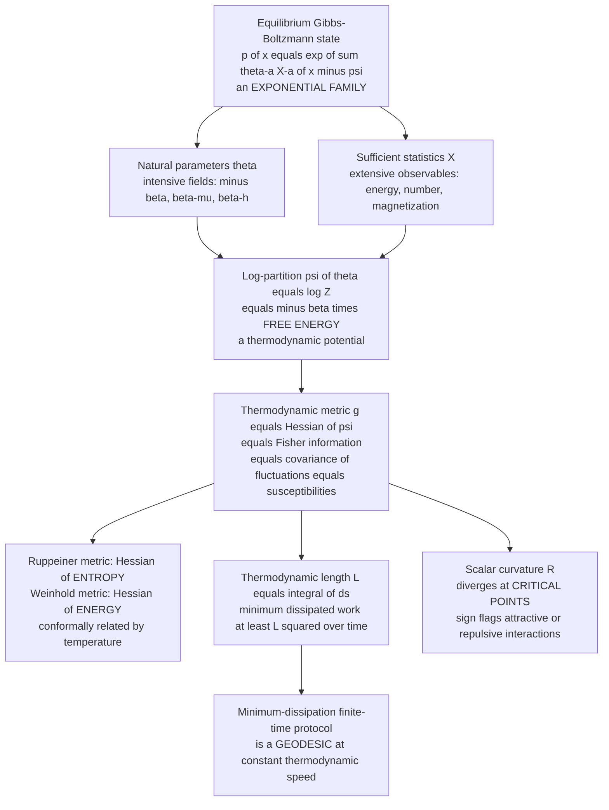

# 📐 Thermodynamic Geometry and Statistical Physics

> [!abstract] TL;DR
> Equilibrium statistical mechanics is an **exponential family in disguise**: the Gibbs-Boltzmann distribution $p(x;\theta)=\exp\!\big(\sum_a\theta_a X_a(x)-\psi(\theta)\big)$ has *intensive fields* (inverse temperature, chemical potential, magnetic field) as its **natural parameters** $\theta$, *extensive observables* (energy, particle number, magnetization) as its **sufficient statistics** $X$, and the **log-partition** $\psi(\theta)=\log Z$ as $-\beta$ times a **free energy**. The Hessian of that potential is simultaneously the **Fisher information metric**, the **covariance of thermodynamic fluctuations**, and the matrix of **susceptibilities/response functions** — so thermodynamic state space carries a *Riemannian metric*. Two classical versions coincide with it: the **Weinhold metric** (Hessian of energy) and the **Ruppeiner metric** (Hessian of entropy), which are **conformally related by temperature**, $g^{R}=g^{W}/T$. This geometry has teeth: the **length** of a driving protocol lower-bounds the **dissipated work** (Crooks; Sivak-Crooks), so **minimum-dissipation finite-time protocols are geodesics at constant thermodynamic speed**; and the **scalar curvature diverges at critical points** with a sign that flags attractive versus repulsive microscopic interactions — a purely geometric diagnostic of phase transitions.

---

## Intuition

**Analogy — the reversible pour and the wasted splash.** Pour water between two glasses infinitely slowly, tilting by a hair at a time, and you can do it with essentially zero splash — reversibly, no wasted energy. Rush the pour and you splash: energy leaves as irretrievable turbulence, dissipated forever. Now ask a strange question: *is there a literal distance between two thermodynamic states, such that the minimum amount you must waste to get from one to the other equals the geometric **length** of the path you drag the system along?* Remarkably, yes. Thermodynamics hides a **Riemannian geometry** on the space of equilibrium states.

In that geometry each equilibrium state — a temperature, a pressure, a field — is a **point**. A slow process is a **curve** through the space of states, and its **arc length** (measured with a special ruler) sets the smallest possible dissipation for traversing it in finite time. Rush along a long path and you splash a lot; the cheapest finite-time route is the **geodesic**, walked at **constant thermodynamic speed** so no stretch is hurried more than another. The ruler itself is not arbitrary: it is *exactly* the **Fisher-information metric** of the underlying Gibbs distribution — the same object that measures how *distinguishable* two nearby probability distributions are in statistics. And where that ruler stretches to infinity — where nearby states become infinitely easy to tell apart because fluctuations blow up — the geometry **curves without bound**: that is a **phase transition**. Dissipation is distance; susceptibility is curvature; criticality is a singularity in the map.

---

## How It Works

### Core Mechanics

**1. Equilibrium states are an exponential family.** The grand canonical / generalized Gibbs distribution over microstates $x$ is

$$
p(x;\theta)=\exp\!\Big(\textstyle\sum_a \theta_a\,X_a(x)-\psi(\theta)\Big),
\qquad
\psi(\theta)=\log\!\int e^{\sum_a\theta_a X_a(x)}\,dx = \log Z(\theta).
$$

This is *precisely* the canonical exponential family. The **natural parameters** $\theta_a$ are the **intensive fields** — the canonical ensemble has $\theta=-\beta$ conjugate to energy; a magnetic system adds $\theta=\beta h$ conjugate to magnetization; the grand ensemble adds $\theta=\beta\mu$ conjugate to particle number. The **sufficient statistics** $X_a$ are the **extensive observables** (energy, magnetization, number). The **log-partition** $\psi(\theta)=\log Z$ is the bridge to thermodynamics: for the canonical ensemble $\psi=-\beta F$, where $F$ is the Helmholtz free energy. This is the identical Legendre / dually-flat scaffolding developed in the sibling note *Exponential_Families_and_Their_Geometry*.

**2. The thermodynamic metric is the Hessian of the potential.** Differentiating $\psi$ once returns the **mean observables** (expectation parameters $\eta$); differentiating twice returns their **covariance**:

$$
\eta_a=\partial_a\psi=\mathbb{E}_\theta[X_a],
\qquad
g_{ab}(\theta)=\partial_a\partial_b\,\psi(\theta)=\operatorname{Cov}_\theta(X_a,X_b)=\mathbb{E}\big[\partial_a\log p\;\partial_b\log p\big].
$$

The last equality says this Hessian *is* the **Fisher information metric** (see the sibling *The_Fisher_Information_Metric*). Physically the same matrix is the set of **susceptibilities and response functions**: the energy-energy element is the heat capacity, the magnetization-magnetization element is the magnetic susceptibility, and so on. **One object wears three hats — curvature of the free energy, covariance of fluctuations, and matrix of susceptibilities.**

**3. Einstein fluctuation theory closes the loop.** Einstein inverted Boltzmann's $S=k_B\log W$ to read the *probability of a fluctuation* off the entropy: $P(\Delta X)\propto\exp\!\big(\Delta S/k_B\big)$. Expanding the entropy to second order in a fluctuation of the extensive densities gives a Gaussian whose inverse-covariance is the **Hessian of the entropy**. So the metric is literally the **fluctuation ellipsoid** of the system: big fluctuations mean a slack ruler; suppressed fluctuations mean a taut one.

**4. Weinhold vs Ruppeiner — two Hessians, conformally related.** Two classical thermodynamic metrics predate the information-geometry reading and turn out to be the same object in different coordinates:

$$
g^{W}_{ij}=\frac{\partial^2 U}{\partial X_i\,\partial X_j}\quad(\text{Weinhold, Hessian of ENERGY}),
\qquad
g^{R}_{ij}=-\frac{1}{k_B}\frac{\partial^2 S}{\partial X_i\,\partial X_j}\quad(\text{Ruppeiner, Hessian of ENTROPY}).
$$

Because energy and entropy are related by a Legendre transform with temperature as the conjugate slope, the two metrics are **conformally related**, $ds^2_R = ds^2_W/T$. In exponential-family language they are the metric read in the two Legendre-dual charts (natural $\theta$ vs expectation $\eta$): one is the covariance of fluctuations, the other its inverse. The convex-duality machinery is the sibling *Legendre_Transform_and_Convex_Duality*.

**5. Thermodynamic length bounds dissipation.** Drive the system along a path $\theta(t)$, $t\in[0,\tau]$, in state space. Its **thermodynamic length** is the metric arc length

$$
\mathcal{L}=\int_0^\tau \sqrt{\dot\theta^\top g\,\dot\theta}\;dt .
$$

In the near-equilibrium (linear-response) regime the **excess/dissipated work** obeys $\langle W_{\text{ex}}\rangle=\int_0^\tau\dot\theta^\top\zeta\,\dot\theta\,dt$ with a friction tensor $\zeta$ that reduces to the Fisher/thermodynamic metric times a relaxation time. Cauchy-Schwarz then gives the central inequality

$$
\langle W_{\text{ex}}\rangle\;\ge\;\frac{\mathcal{L}^2}{\tau},
$$

with **equality if and only if the protocol is traversed at constant thermodynamic speed** $\sqrt{\dot\theta^\top g\,\dot\theta}=\text{const}$. The cheapest finite-time path between two equilibria is therefore a **geodesic of the metric** run at uniform speed — the Salamon-Berry / Crooks / Sivak-Crooks result at the heart of **finite-time and stochastic thermodynamics**.

**6. Curvature diagnoses phase transitions.** Contract the metric into a coordinate-free **scalar curvature** $R$. Ruppeiner's programme found that $R$ carries physical meaning: near a critical point it **diverges** in step with the correlation volume, $|R|\sim\xi^{d}$, and its **sign** discriminates the character of interactions — $R<0$ for predominantly attractive systems (van der Waals gas, most fluids), $R>0$ for effectively repulsive statistics (ideal Fermi gas), and $R=0$ for the non-interacting classical ideal gas, whose thermodynamic geometry is *flat*. Curvature is thus a geometric order parameter: a scalar that spikes exactly where the system reorganizes.

**7. The information-geometry ↔ thermodynamics dictionary.** Every entry of the exponential-family toolbox has a thermodynamic name:

| Information geometry | Statistical physics |
|---|---|
| Natural parameters $\theta$ | Intensive fields ($-\beta$, $\beta\mu$, $\beta h$) |
| Sufficient statistics $X$ | Extensive observables (energy, number, magnetization) |
| Log-partition $\psi(\theta)=\log Z$ | $-\beta\times$ free energy (thermodynamic potential) |
| Expectation parameters $\eta=\nabla\psi$ | Mean observables (mean energy, mean magnetization) |
| Dual potential $\varphi(\eta)=\psi^\star$ | Negative entropy $-S/k_B$ |
| Fisher metric $g=\nabla^2\psi$ | Fluctuation covariance = susceptibilities |
| Bregman divergence $B_\psi$ | Availability / dissipated work |
| Thermodynamic length $\mathcal{L}$ | Minimum-dissipation bound |
| Scalar curvature $R$ | Correlation volume / phase-transition flag |

The nonequilibrium **fluctuation theorems** close the frame: the **Jarzynski equality** $\langle e^{-\beta W}\rangle=e^{-\beta\Delta F}$ and the **Crooks relation** $P_F(W)/P_R(-W)=e^{\beta(W-\Delta F)}$ pin *nonequilibrium work* to *equilibrium free-energy differences*, and their near-equilibrium expansion $\langle W_{\text{diss}}\rangle\approx\tfrac{\beta}{2}\operatorname{Var}(W)$ is again the metric — variance of work is thermodynamic length made local.

### Flow / Architecture



---

## Key Concepts

### Secondary (intuitive)
- **States are points, processes are paths.** Every equilibrium (a temperature, a field) is a dot on a map; slowly changing the controls draws a curve across the map.
- **Dissipation is distance.** There is a special ruler on that map such that the *shortest* path costs the *least* wasted energy when you have to move in finite time.
- **Go at a steady pace.** The cheapest route is walked at constant "thermodynamic speed" — never hurrying one stretch more than another — which is what a **geodesic** does.
- **Fluctuations set the ruler.** Where the system jitters a lot, the ruler is slack; where it is stiff and barely fluctuates, the ruler is taut.
- **Cliffs are phase transitions.** Where the ruler stretches to infinity and the map curves without bound, the material is changing phase (freezing, boiling, magnetizing).

### Undergraduate
- **Gibbs = exponential family.** $p(x;\theta)=\exp(\sum_a\theta_a X_a-\psi)$; canonical $\theta=-\beta$ and $X=$ energy; $\psi=\log Z=-\beta F$.
- **Metric = second derivative of the potential.** $g_{ab}=\partial_a\partial_b\psi=\operatorname{Cov}(X_a,X_b)$ — the Fisher information and the fluctuation covariance are the *same* matrix, equal to the susceptibilities (heat capacity, compressibility, magnetic susceptibility).
- **Weinhold and Ruppeiner.** Weinhold $g^W=\partial^2U/\partial X^2$; Ruppeiner $g^R=-\partial^2S/\partial X^2$; conformal factor is temperature, $ds^2_R=ds^2_W/T$.
- **Length bounds waste.** $\langle W_{\text{ex}}\rangle\ge\mathcal{L}^2/\tau$; optimal finite-time protocols are constant-speed geodesics.
- **Fluctuation theorems.** Jarzynski $\langle e^{-\beta W}\rangle=e^{-\beta\Delta F}$ and Crooks $P_F(W)/P_R(-W)=e^{\beta(W-\Delta F)}$; second cumulant recovers the metric, $\langle W_{\text{diss}}\rangle\approx\tfrac{\beta}{2}\operatorname{Var}(W)$.

### Graduate
- **Dually flat thermodynamics.** $(\theta,\eta)$ are Legendre-dual affine coordinates for the e-/m-connection pair sharing $g=\nabla^2\psi$; the availability (dissipated work between equilibria) is the **Bregman divergence** $B_\psi(\theta_1,\theta_2)=D_{\mathrm{KL}}$, and the quasi-static / finite-time split is the local (metric) versus global (divergence) reading of the same potential.
- **Friction tensor.** Sivak-Crooks generalize the near-equilibrium metric to $\zeta_{ab}(\theta)=\beta\int_0^\infty\langle\delta X_a(0)\,\delta X_b(t)\rangle_\theta\,dt$, a time-integrated force covariance; $\langle W_{\text{ex}}\rangle=\int\dot\theta^\top\zeta\dot\theta\,dt$ and geodesics of $\zeta$ minimize dissipation. In the slow limit $\zeta\propto g\times\tau_{\text{relax}}$.
- **Ruppeiner curvature.** $R$ is built from $g^R$ by the standard Levi-Civita construction; $R=0$ characterizes the classical ideal gas (no interactions), $\operatorname{sgn}R$ tracks the effective interaction (attractive/repulsive), and $R\sim\xi^d$ diverges at criticality with the correlation length — a covariant, coordinate-free order parameter.
- **Legendre-transform structure of ensembles.** Switching ensembles (canonical $\leftrightarrow$ grand canonical $\leftrightarrow$ enthalpy representation) is a Legendre transform of $\psi$; the metric transforms as a tensor, and the conformal Weinhold/Ruppeiner relation is the transformation between the energy and entropy representations of the fundamental relation.
- **Black-hole thermodynamics.** Applying Ruppeiner/Weinhold geometry to $S(M,J,Q)$ of black holes turns curvature singularities into thermodynamic instabilities and Davies-point transitions — a live research frontier discussed in the sibling *Information_Geometry_and_Complex_Systems*.

---

## Python Demo

```python
# Thermodynamic geometry, computed and visualized end to end.
# ---------------------------------------------------------------------------
# PART A  A single Ising spin  s in {-1,+1},  energy E = -h s,  natural param
#         theta = beta*h.  The Boltzmann law p(s) = exp(theta*s)/Z is an
#         EXPONENTIAL FAMILY with:
#             log-partition   psi(theta) = log(2 cosh theta)      ( = -beta F )
#             mean magnetiz.   m = psi'(theta) = tanh(theta)       ( = eta )
#             THERMO METRIC    g(theta) = psi''(theta) = sech^2 theta
#                             = Var(s) = magnetic susceptibility  ( = Fisher info )
#         -> the metric is fluctuations = susceptibility = curvature of free energy.
#
# PART B  Thermodynamic LENGTH and the minimum-dissipation GEODESIC.
#         Drive theta from theta_A to theta_B in unit time.  Dissipation cost is
#         proportional to  integral of (thermodynamic speed)^2 dt.  Cauchy-Schwarz:
#             cost >= L^2   with equality iff speed is CONSTANT (the geodesic).
#
# PART C  A phase transition: the mean-field (Curie-Weiss) Ising magnet has
#         susceptibility chi(T,h) that DIVERGES at the critical point T_c = J.
#         chi is the thermodynamic metric component g_hh -> the metric blows up
#         at criticality, the geometric signature of a phase transition.
import numpy as np
import matplotlib.pyplot as plt

rng = np.random.default_rng(0)
hfd = 1e-4  # finite-difference step

# ================= PART A : the single-spin thermodynamic metric ============
def psi(theta):                      # log-partition = log(2 cosh theta)
    return np.log(2.0) + np.logaddexp(theta, -theta) - np.log(2.0)  # = log(2 cosh)
theta = np.linspace(-3.0, 3.0, 400)
g_analytic = 1.0 / np.cosh(theta)**2                          # sech^2 = Var(s)
g_numeric  = (psi(theta + hfd) - 2*psi(theta) + psi(theta - hfd)) / hfd**2
# Monte-Carlo variance of s: p(s=+1) = sigmoid(2 theta)
mc_theta = np.linspace(-3, 3, 13)
p_plus = 1.0 / (1.0 + np.exp(-2*mc_theta))
mc_var = [(np.where(rng.random(200_000) < pp, 1.0, -1.0)).var() for pp in p_plus]
print(f"[A] max |psi'' - sech^2|            = {np.max(np.abs(g_numeric - g_analytic)):.2e}")
print(f"    metric g > 0 everywhere         : {np.all(g_analytic > 0)}  (positive-definite)")

# ================= PART B : thermodynamic length & geodesic =================
thA, thB = -2.5, 2.5
sqrt_g = lambda th: 1.0 / np.cosh(th)                          # sqrt(sech^2) = sech
# closed-form arc length coordinate u(theta) = gudermannian = arctan(sinh theta)
u = lambda th: np.arctan(np.sinh(th))
uA, uB = u(thA), u(thB)
L = uB - uA                                                   # thermodynamic length
L_quad = np.trapz(sqrt_g(np.linspace(thA, thB, 20000)), np.linspace(thA, thB, 20000))
print(f"[B] thermodynamic length L (closed) = {L:.6f}")
print(f"    thermodynamic length L (quad)   = {L_quad:.6f}")

t = np.linspace(0.0, 1.0, 2000)                               # unit-time protocol
# naive protocol: theta linear in time
th_naive = thA + (thB - thA) * t
v_naive = sqrt_g(th_naive) * np.abs(np.gradient(th_naive, t))
cost_naive = np.trapz(v_naive**2, t)
# geodesic protocol: arc-length coordinate linear in time -> constant speed
u_t = uA + (uB - uA) * t
th_geo = np.arcsinh(np.tan(u_t))                             # invert u = arctan(sinh)
v_geo = sqrt_g(th_geo) * np.abs(np.gradient(th_geo, t))
cost_geo = np.trapz(v_geo**2, t)
print(f"    dissipation (naive protocol)    = {cost_naive:.5f}")
print(f"    dissipation (geodesic protocol) = {cost_geo:.5f}   ideal L^2 = {L**2:.5f}")
print(f"    geodesic speed constant?  std/mean = {v_geo.std()/v_geo.mean():.2e}")

# ================= PART C : Curie-Weiss metric divergence at T_c =============
J = 1.0                                                       # so T_c = J = 1
Tg = np.linspace(0.55, 2.0, 200)
hg = np.linspace(-0.5, 0.5, 200)
T, H = np.meshgrid(Tg, hg)
beta = 1.0 / T
M = 0.01 * np.sign(H + 1e-9)                                  # seed on the +/- branch
for _ in range(4000):                                        # damped fixed point
    M = 0.5 * M + 0.5 * np.tanh(beta * (J * M + H))          # m = tanh(beta(Jm+h))
denom = 1.0 - beta * J * (1.0 - M**2)
chi = beta * (1.0 - M**2) / np.where(np.abs(denom) < 1e-4, 1e-4, denom)  # g_hh
chi = np.clip(np.abs(chi), 1e-3, 1e3)
# metric along the critical line h = 0 (paramagnetic branch): chi = beta/(1-beta J)
Tline = np.linspace(1.02, 2.0, 400)
chi_line = (1.0 / Tline) / (1.0 - J / Tline)
print(f"[C] critical temperature T_c        = {J:.3f}")
print(f"    chi at T=1.05 (near T_c)         = {(1/1.05)/(1-J/1.05):.2f}  (diverging)")

# ============================ FIGURE ========================================
fig, ax = plt.subplots(2, 2, figsize=(13.5, 9.5))

# (a) single-spin thermodynamic metric three ways
ax[0, 0].plot(theta, g_analytic, color="#c0392b", lw=3, label="analytic  sech^2(theta)")
ax[0, 0].plot(theta, g_numeric, "k--", lw=1.4, label="numeric  psi''(theta)")
ax[0, 0].plot(mc_theta, mc_var, "o", ms=7, color="#e67e22", label="Monte-Carlo Var(s)")
ax[0, 0].set_title("(a) thermodynamic metric = Fisher info = Var(s) = susceptibility")
ax[0, 0].set_xlabel("natural parameter  theta = beta*h"); ax[0, 0].set_ylabel("g(theta)")
ax[0, 0].legend(fontsize=8)

# (b) thermodynamic speed: geodesic is flat, naive is peaked
ax[0, 1].plot(t, v_naive, color="#2980b9", lw=2.5,
              label=f"naive protocol   cost={cost_naive:.3f}")
ax[0, 1].plot(t, v_geo, color="#27ae60", lw=2.5,
              label=f"geodesic         cost={cost_geo:.3f} = L^2")
ax[0, 1].axhline(L, ls=":", color="#7f8c8d", lw=1.2, label=f"constant speed L={L:.3f}")
ax[0, 1].set_title("(b) minimum-dissipation protocol = constant-speed GEODESIC")
ax[0, 1].set_xlabel("time  t / tau"); ax[0, 1].set_ylabel("thermodynamic speed")
ax[0, 1].legend(fontsize=8)

# (c) Curie-Weiss metric g_hh = susceptibility over (T,h): diverges at T_c
im = ax[1, 0].pcolormesh(T, H, np.log10(chi), shading="auto", cmap="inferno")
ax[1, 0].axvline(J, ls="--", color="cyan", lw=1.5, label="critical T_c = J")
ax[1, 0].set_title("(c) thermodynamic metric log10(chi) over state space (T,h)")
ax[1, 0].set_xlabel("temperature T"); ax[1, 0].set_ylabel("field h")
ax[1, 0].legend(fontsize=8, loc="upper right")
fig.colorbar(im, ax=ax[1, 0], label="log10 metric component")

# (d) metric divergence along the critical line h = 0
ax[1, 1].plot(Tline, chi_line, color="#8e44ad", lw=3, label="chi = beta / (1 - beta J)")
ax[1, 1].axvline(J, ls="--", color="#c0392b", lw=1.5, label="T_c = J")
ax[1, 1].set_yscale("log")
ax[1, 1].set_title("(d) metric / curvature DIVERGES at the phase transition")
ax[1, 1].set_xlabel("temperature T  (at h = 0)"); ax[1, 1].set_ylabel("metric component chi")
ax[1, 1].legend(fontsize=8)

plt.tight_layout(); plt.show()
```

**What you should see.** **(a)** The single-spin thermodynamic metric $g(\theta)=\operatorname{sech}^2\theta$ computed three independent ways — analytic curvature of the log-partition, numeric second derivative of $\psi$, and Monte-Carlo variance of the spin — lie on top of one another: the metric *is* the fluctuation/susceptibility. **(b)** The naive protocol (linear in $\theta$) sprints through the high-metric region near $\theta=0$ and its thermodynamic *speed* is peaked, so it wastes more; the geodesic holds speed constant at $\mathcal{L}$ and its dissipation cost equals the Cauchy-Schwarz floor $\mathcal{L}^2$ — the printed numbers confirm `cost_geo < cost_naive` with `cost_geo == L^2`. **(c)** The Curie-Weiss metric component $\chi(T,h)$ lights up into a bright ridge as $T\to T_c=J$: the ruler stretches toward infinity. **(d)** Along the critical line $h=0$ the metric $\chi=\beta/(1-\beta J)$ diverges at $T_c$ — the geometric fingerprint of a phase transition.

*(Note: `np.trapz` is available across NumPy versions; on very new builds substitute `np.trapezoid`.)*

---

## Real-World Applications

> **Example (optimal finite-time control of a driven bit / molecular machine):** In single-molecule pulling experiments and in the erasure of a physical bit, an external protocol drags the system's control parameter (trap position, field) between two equilibria in *finite* time, paying dissipation. Sivak and Crooks showed the optimal schedule is the **geodesic of the friction-tensor metric traversed at constant thermodynamic speed** — slow down where the metric (fluctuations) is large, speed up where it is small. This turns "how do I erase a bit near the Landauer limit with least waste?" into a **shortest-path problem on a Riemannian manifold**, and the same recipe now designs low-dissipation protocols for optical-trap experiments, quantum annealers, and nanoscale heat engines.

- **Finite-time thermodynamics and engine design.** Endoreversible engines and optimal heating/cooling cycles are laid out as geodesic problems in thermodynamic length; minimizing $\mathcal{L}$ minimizes lost availability per cycle.
- **Free-energy estimation.** The Jarzynski and Crooks relations underlie MBAR / thermodynamic-integration estimators; choosing intermediate states *equally spaced in thermodynamic length* minimizes the variance of the free-energy estimate — an information-geometric experimental-design principle used in computational chemistry.
- **Critical-phenomena diagnostics.** Ruppeiner curvature $R$ is used as a scalar probe of criticality and effective interaction sign in fluids, spin systems, and quantum gases, complementing susceptibility measurements with a coordinate-free signal.
- **Black-hole thermodynamics.** Weinhold/Ruppeiner geometry of black-hole entropy $S(M,J,Q)$ maps curvature singularities to thermodynamic phase transitions and instabilities, an active bridge between gravity and information geometry.
- **Machine learning training dynamics.** Because training energy-based models is exponential-family moment matching, the same metric governs natural-gradient learning and low-dissipation "annealing" schedules — the connection made explicit in [[Partition_Functions_and_Free_Energy_in_ML]] and [[Temperature_and_Annealing_in_Learning]].

---

## Common Pitfalls

- **Confusing the Ruppeiner and Weinhold metrics.** They are *not* equal — they are **conformally related by temperature**, $ds^2_R=ds^2_W/T$ (Ruppeiner = Hessian of *entropy*, Weinhold = Hessian of *energy*). They agree only up to the $1/T$ factor; quoting a curvature or a length without stating which metric (and which thermodynamic representation) you used is ambiguous.
- **Curvature-sign convention chaos.** The physical meaning of $\operatorname{sgn}R$ (attractive vs repulsive) is convention-dependent: authors differ on the sign of the metric definition and the Riemann tensor. Always fix the ideal classical gas as the $R=0$ reference and state your sign convention before interpreting a "positive" or "negative" curvature.
- **Forgetting the equilibrium assumption.** The metric is defined on the manifold of *equilibrium* states via fluctuation theory. Off equilibrium there is no unique metric; the friction tensor $\zeta$ is the correct object, and it equals the Fisher/thermodynamic metric only in the **slow, linear-response regime**. Using the equilibrium metric for fast driving overestimates how cheap a protocol is.
- **Misreading the length bound's regime.** $\langle W_{\text{ex}}\rangle\ge\mathcal{L}^2/\tau$ is a **near-equilibrium, large-$\tau$** result. For genuinely fast or far-from-equilibrium driving the geodesic recipe is only a leading-order guide; the exact optimum requires the full stochastic-thermodynamics control problem.
- **Treating a diverging metric as a numerical bug.** Near a critical point the metric *should* blow up — that is the physics, not an error. Clip only for plotting, and remember that finite-size systems round off the true divergence; the sharp singularity is a thermodynamic-limit statement.
- **Ensemble/representation mixing.** The metric transforms as a tensor under Legendre transforms between ensembles (canonical, grand canonical, enthalpy). Comparing lengths or curvatures computed in different representations without transforming the metric gives meaningless numbers.

---

## Related Concepts

- [[Maximum_Entropy_and_Exponential_Families]] — the Gibbs distribution *is* the maximum-entropy exponential family; this note reads its geometry thermodynamically.
- [[Partition_Functions_and_Free_Energy_in_ML]] — the log-partition here is the ML partition function; its Hessian is the metric, and its intractability is the practical obstacle.
- [[Fisher_Information_and_the_Cramer_Rao_Bound]] — the thermodynamic metric is literally this Fisher information; fluctuations play the role of estimator variance.
- [[Fluctuation_Theorems_and_the_Jarzynski_Equality]] — Jarzynski/Crooks tie nonequilibrium work to $\Delta F$; the second cumulant of work recovers the thermodynamic metric and length.
- [[Classical_Statistical_Mechanics]] — supplies the ensembles, Boltzmann weights, and partition functions on which this geometry is built.
- [[Thermodynamic_Potentials]] — the free energies whose Hessians are the Weinhold/Ruppeiner metrics; Legendre transforms among them move between ensembles.
- [[Entropy_and_Second_Law]] — Einstein fluctuation theory reads the metric off the entropy Hessian; the length bound is a finite-time refinement of the second law.
- [[The_Boltzmann_Distribution_in_Learning]] — the same Boltzmann-Gibbs form appears in energy-based learning, where temperature and fields become training knobs.
- [[Phase_Transitions_in_Learning_and_Inference]] — the curvature-diverges-at-criticality story recurs in learning dynamics and inference thresholds.
- [[Differential_Geometry]] — the Riemannian-metric, geodesic, and scalar-curvature machinery this note specializes to thermodynamic state space.

Developed in sibling notes of this vault (prose references, no links): *Exponential_Families_and_Their_Geometry* (the natural/expectation-parameter scaffolding), *Legendre_Transform_and_Convex_Duality* (the energy↔entropy conjugation behind Weinhold↔Ruppeiner), *The_Fisher_Information_Metric* (the metric as a Riemannian structure), *Information_Geometry_and_Complex_Systems* (curvature as a criticality diagnostic across systems), and *The_Reach_and_Future_of_Information_Geometry* (the broader physics↔statistics program).

---

## Review Questions

1. **(Secondary)** Explain, without equations, why dragging a thermodynamic system quickly along a "long" path wastes more energy than dragging it along a "short" one, and what it means to move at *constant thermodynamic speed*. Why is the cheapest finite-time route called a geodesic?
2. **(Undergraduate)** For the single Ising spin with $\psi(\theta)=\log(2\cosh\theta)$ and $\theta=\beta h$, compute the mean magnetization $m=\psi'(\theta)$ and the thermodynamic metric $g(\theta)=\psi''(\theta)$. Show explicitly that $g$ equals the variance of the spin and identify it as a susceptibility. Then set up the thermodynamic length integral between $\theta_A$ and $\theta_B$ and state the condition on the protocol that minimizes dissipation.
3. **(Graduate)** Derive the conformal relation $ds^2_R=ds^2_W/T$ between the Ruppeiner (entropy-Hessian) and Weinhold (energy-Hessian) metrics from the Legendre structure of the fundamental relation. Then explain (a) why the metric equals both the Fisher information and the fluctuation covariance, (b) why the scalar curvature $R$ diverges at a critical point and what its sign encodes, and (c) precisely where the near-equilibrium length bound $\langle W_{\text{ex}}\rangle\ge\mathcal{L}^2/\tau$ breaks down and what replaces the metric there.

---

## Sources

- Ruppeiner, G. (1979). "Thermodynamics: A Riemannian geometric model." *Physical Review A* 20(4), 1608. And Ruppeiner, G. (1995). "Riemannian geometry in thermodynamic fluctuation theory." *Reviews of Modern Physics* 67(3), 605.
- Weinhold, F. (1975). "Metric geometry of equilibrium thermodynamics." *Journal of Chemical Physics* 63(6), 2479.
- Crooks, G. E. (2007). "Measuring thermodynamic length." *Physical Review Letters* 99(10), 100602.
- Sivak, D. A., & Crooks, G. E. (2012). "Thermodynamic metrics and optimal paths." *Physical Review Letters* 108(19), 190602.
- Salamon, P., & Berry, R. S. (1983). "Thermodynamic length and dissipated availability." *Physical Review Letters* 51(13), 1127.

---

#information-geometry #thermodynamic-geometry #statistical-physics #thermodynamic-length #phase-transitions
