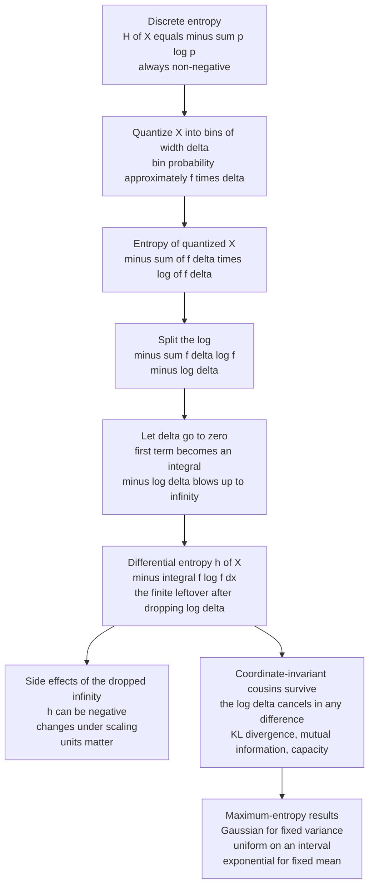

# 🌫️ Differential Entropy and Continuous Variables

> [!abstract] TL;DR
> Differential entropy $h(X) = -\int f(x)\log f(x)\,dx$ is the continuous analogue of Shannon entropy — but it is **not** the naive limit of the discrete version. Fine-quantizing a continuous variable gives discrete entropy that diverges to infinity; differential entropy is what remains after throwing away an infinite constant. That missing infinity has consequences: $h(X)$ can be **negative**, it **changes** when you rescale or re-coordinate the variable, and it depends on your choice of units. Yet the quantities that actually matter — **KL divergence, mutual information, and channel capacity** — stay finite and coordinate-invariant. And among all densities with a fixed variance, the **Gaussian uniquely maximizes** $h$, which is the deep reason Gaussian noise is the worst-case adversary in the Gaussian channel.

---

## Intuition

**Analogy:** Imagine a dart lands on an infinitely fine ruler. For a *discrete* source you count the equally likely outcomes and take a logarithm — six faces of a die give $\log 6$ bits. But the dart's exact position is a real number: pinning it down to full precision ("3.14159265... cm, forever") would take *infinitely many digits* and therefore infinite information. There is no finite count of outcomes to take the log of. So we change the question. Instead of "how many outcomes?" we ask **"how wide is the region the probability density spreads over, measured against a unit ruler?"** Differential entropy is essentially the *log-width* of that spread.

Two quirks fall straight out of the analogy. First, if you swap your ruler from centimetres to millimetres, the same dart now spreads over ten times as many tick-marks — the number changes even though nothing physical did. That is why differential entropy is **not invariant under rescaling**. Second, if the dart is glued to a tiny sub-millimetre region, its spread is *smaller than one unit*, so its log-width is **negative** — a continuous variable can have less "spread" than the reference measure, which never happens when you are honestly counting discrete outcomes.

---

## How It Works

### Core Mechanics

**1. Start from discrete entropy under quantization.** Take a continuous variable $X$ with density $f$. Chop the real line into bins of width $\Delta$. By the mean-value theorem, the probability of bin $i$ is $p_i \approx f(x_i)\,\Delta$. Now write the ordinary Shannon entropy of the *quantized* variable $X^\Delta$:

$$
H(X^\Delta) = -\sum_i p_i \log p_i \approx -\sum_i f(x_i)\Delta \,\log\!\big(f(x_i)\Delta\big).
$$

**2. Split the logarithm.** Using $\log(f\Delta) = \log f + \log \Delta$:

$$
H(X^\Delta) \approx \underbrace{-\sum_i f(x_i)\log f(x_i)\,\Delta}_{\to\; -\int f\log f\,dx} \;-\; \log\Delta\underbrace{\sum_i f(x_i)\Delta}_{\to\;1}.
$$

**3. Take the limit $\Delta \to 0$.** The first term converges to the integral $-\int f\log f\,dx$. The second term is $-\log\Delta$, which **diverges to $+\infty$** as bins shrink. This is the mathematical statement that a continuous value carries infinite information to specify exactly:

$$
H(X^\Delta) \;\approx\; \underbrace{h(X)}_{\text{finite leftover}} \;-\; \log\Delta \;\xrightarrow[\Delta\to 0]{}\; +\infty .
$$

**4. Differential entropy is the finite leftover.** We *define*

$$
\boxed{\,h(X) = -\int_{-\infty}^{\infty} f(x)\log f(x)\,dx\,}
$$

by simply dropping the infinite $-\log\Delta$ term. This is why $h(X)$ is **not** the continuous version of Shannon entropy — it is Shannon entropy *minus an infinite constant*. Everything strange about $h$ traces back to that discarded infinity.

**5. The consequences of the dropped constant.**
- **It can be negative.** For a density concentrated in a region narrower than one unit, $-\int f\log f\,dx < 0$. Example: uniform on $[0, \tfrac12]$ has $h = \log\tfrac12 = -0.69$ nats.
- **It is not invariant under change of variables.** Under scaling $Y = aX$, $\;h(Y) = h(X) + \log|a|$. Under an invertible map $Y = g(X)$, $\;h(Y) = h(X) + \mathbb{E}[\log|g'(X)|]$. Rescale the axis and the number moves — because the reference measure (the "unit ruler") moved too.
- **Units matter.** Measuring in metres versus millimetres shifts $h$ by a constant $\log(1000)$.

**6. What stays well-behaved.** The infinite $-\log\Delta$ term is *the same* for any density on the same space, so it **cancels** in any *difference* of differential entropies. Therefore these remain finite, meaningful, and coordinate-invariant:
- **Relative entropy / KL:** $D(f\,\|\,g) = \int f\log\frac{f}{g}\,dx \ge 0$ — a ratio of densities, so the $\Delta$'s cancel.
- **Mutual information:** $I(X;Y) = h(X) - h(X\mid Y) = h(X)+h(Y)-h(X,Y) \ge 0$ — a difference, invariant under invertible transforms of $X$ and $Y$ separately.
- **Channel capacity:** $C = \max I(X;Y)$ — built from mutual information, so fully well-defined for continuous channels.

**7. The maximum-entropy distributions.** With the right constraints, maximizing $h$ subject to Lagrange multipliers always yields an exponential-family form $f \propto \exp(\sum_k \lambda_k T_k(x))$ (Jaynes' maximum-entropy principle):
- Fixed support $[a,b]$, no other constraint $\Rightarrow$ **Uniform**, $h = \log(b-a)$.
- Fixed mean on $[0,\infty)$ $\Rightarrow$ **Exponential**, $h = 1 - \log\lambda$.
- Fixed variance on $\mathbb{R}$ $\Rightarrow$ **Gaussian**, $h = \tfrac12\log(2\pi e\,\sigma^2)$.

The Gaussian result is the load-bearing one: **among all densities with a given variance, the Gaussian has the largest differential entropy.** That is precisely why Gaussian noise is the "worst case" for a power-limited channel — it injects the most uncertainty per unit of power.

### Flow / Architecture



---

## Key Concepts

### Secondary (intuitive)
- **Spread, not count:** for continuous variables you cannot count outcomes, so entropy measures how widely the probability density is spread out, relative to a unit ruler.
- **Negative entropy is normal here:** a very peaked density (a needle pinned to a tiny region) can have *negative* differential entropy — surprising, but it just means "narrower than one unit."
- **Units and scale change the number:** measuring the same quantity in metres versus millimetres shifts the differential entropy; discrete entropy never has this problem.
- **The Gaussian is the "most spread out" for a given variance:** if all you fix is the variance, the bell curve is the least-committal, maximum-uncertainty choice.

### Undergraduate
- **Definition:** $h(X) = -\int f\log f\,dx = \mathbb{E}[-\log f(X)]$, in nats (natural log) or bits (log base 2).
- **Closed forms (nats):**
  - Uniform on $[a,b]$: $h = \log(b-a)$.
  - Gaussian $\mathcal{N}(\mu,\sigma^2)$: $h = \tfrac12\log(2\pi e\,\sigma^2)$ — depends on $\sigma$, not $\mu$ (translation-invariant).
  - Exponential (rate $\lambda$): $h = 1 - \log\lambda$.
  - Laplace (scale $b$): $h = 1 + \log(2b)$.
  - Multivariate Gaussian $\mathcal{N}(\boldsymbol\mu,\Sigma)$ in $n$ dims: $h = \tfrac12\log\big((2\pi e)^n\det\Sigma\big)$.
- **Transformation rules:** $h(X+c)=h(X)$ (translation-invariant); $h(aX)=h(X)+\log|a|$; $h(AX)=h(X)+\log|\det A|$. These non-invariances are the defining difference from discrete $H$.
- **Maximum-entropy theorems:** uniform maximizes $h$ on a bounded interval; exponential maximizes $h$ for a fixed mean on $[0,\infty)$; Gaussian maximizes $h$ for a fixed variance on $\mathbb{R}$.
- **What is still safe:** KL divergence $D(f\|g)$, mutual information $I(X;Y)$, and capacity $C=\max I(X;Y)$ are all finite and invariant even though $h$ is not. (KL and MI are the *continuous-safe* workhorses — see the planned sibling notes on relative entropy and mutual information.)

### Graduate
- **Differential entropy as a relative quantity in disguise:** $h(X) = -D(f \,\|\, \text{Lebesgue}) $ (up to sign/normalization) — it is really the KL "distance" to the Lebesgue reference measure, which is *not* a probability measure. Because the reference measure is not invariant under coordinate change, neither is $h$; genuine KL between two probability densities has no such defect.
- **The Gaussian maximum-entropy proof:** for fixed second moment, $D(f\,\|\,\phi) \ge 0$ where $\phi$ is the Gaussian with the same variance; expanding gives $h(f) \le h(\phi) = \tfrac12\log(2\pi e\sigma^2)$, with equality iff $f=\phi$. The one-line KL argument is the cleanest route to the result.
- **Entropy power:** $N(X) = \dfrac{1}{2\pi e}\,e^{2h(X)}$ is the variance of the Gaussian with the same differential entropy — a way to compare any distribution's "effective spread" to a Gaussian. For a Gaussian, $N(X)=\sigma^2$.
- **Entropy-Power Inequality (Shannon/Stam):** for independent $X,Y$, $\;N(X+Y) \ge N(X) + N(Y)$, with equality iff both are Gaussian. It is the entropy analogue of the fact that variances add, and underpins converse proofs for the Gaussian channel and the Gaussian broadcast channel.
- **Gaussian channel capacity:** $Y = X + Z$ with power constraint $\mathbb{E}[X^2]\le P$ and $Z\sim\mathcal N(0,N)$ gives $C = \tfrac12\log\!\big(1 + \tfrac{P}{N}\big)$ per use. The proof uses $I(X;Y)=h(Y)-h(Y\mid X)=h(Y)-h(Z)$ and maximizes $h(Y)$ by making $Y$ (hence $X$) Gaussian — a direct payoff of the maximum-entropy property. Dually, Gaussian *noise* minimizes capacity for a given noise power, making it the worst-case (least-favorable) noise. (This feeds the planned sibling note on channel coding and the Gaussian channel.)
- **Continuous AEP:** the asymptotic equipartition property carries over; the "typical set" has volume $\approx 2^{nh(X)}$, giving $h$ an operational meaning as the log-volume per dimension of the effective support.
- **de Bruijn's identity:** $\frac{d}{dt}h(X+\sqrt{t}\,Z) = \tfrac12 J(X+\sqrt t Z)$ links differential entropy to **Fisher information** $J$, connecting information theory to estimation (Cramér-Rao) and to the heat equation.
- **In continuous ML:** differential entropy appears as the entropy term in the **variational ELBO** and in maximum-entropy / minimum-cross-entropy modeling; entropy regularizers in RL and in normalizing-flow density estimation are differential entropies, and the change-of-variables term $\log|\det J|$ in flows *is* the transformation rule above.

---

## Python Demo

```python
# Differential entropy of continuous variables (numpy + matplotlib only).
#   (1) At a FIXED variance, compute h for Uniform, Laplace, Gaussian and
#       show the Gaussian achieves the MAXIMUM  -> maximum-entropy property.
#   (2) Plot h of a Gaussian vs its variance:  h = 0.5 * ln(2 pi e sigma^2),
#       and show it goes NEGATIVE for narrow (small-variance) distributions.
# All entropies are in nats (natural log).

import numpy as np
import matplotlib.pyplot as plt


def differential_entropy_numeric(pdf, grid):
    """h(X) = -integral f ln f dx, evaluated numerically on a fine grid."""
    f = np.clip(pdf(grid), 1e-300, None)
    integrand = np.where(f > 1e-300, -f * np.log(f), 0.0)
    return np.trapz(integrand, grid)


# ---- (1) same variance -> Gaussian wins --------------------------------------
var   = 1.0                       # common variance for a fair comparison
b_lap = np.sqrt(var / 2.0)        # Laplace scale b from variance = 2 b^2
w     = np.sqrt(12.0 * var)       # uniform width w from variance = w^2 / 12

# closed-form differential entropies (nats)
h_gauss_cf   = 0.5 * np.log(2 * np.pi * np.e * var)   # 0.5 ln(2 pi e sigma^2)
h_laplace_cf = 1.0 + np.log(2 * b_lap)                # 1 + ln(2b)
h_uniform_cf = np.log(w)                              # ln(width) = 0.5 ln(12 var)

# matching pdfs (all with variance = 1)
gauss   = lambda x: np.exp(-x**2 / (2 * var)) / np.sqrt(2 * np.pi * var)
laplace = lambda x: np.exp(-np.abs(x) / b_lap) / (2 * b_lap)
uniform = lambda x: np.where(np.abs(x) <= w / 2, 1.0 / w, 0.0)

grid = np.linspace(-14, 14, 400001)
h_gauss_num   = differential_entropy_numeric(gauss,   grid)
h_laplace_num = differential_entropy_numeric(laplace, grid)
h_uniform_num = differential_entropy_numeric(uniform, grid)

print("Differential entropy at variance = 1  (nats):")
print(f"  Gaussian : closed {h_gauss_cf:6.4f}   numeric {h_gauss_num:6.4f}")
print(f"  Laplace  : closed {h_laplace_cf:6.4f}   numeric {h_laplace_num:6.4f}")
print(f"  Uniform  : closed {h_uniform_cf:6.4f}   numeric {h_uniform_num:6.4f}")
print("  => Gaussian is the maximum-entropy distribution for a fixed variance.\n")

# ---- (2) h of a Gaussian vs its variance, and its NEGATIVE region ------------
variances   = np.linspace(0.005, 3.0, 600)
h_of_var    = 0.5 * np.log(2 * np.pi * np.e * variances)
sigma2_zero = 1.0 / (2 * np.pi * np.e)        # h = 0 exactly here

narrow_var  = 0.01                            # a very peaked Gaussian
h_narrow    = 0.5 * np.log(2 * np.pi * np.e * narrow_var)
print(f"Narrow Gaussian, variance = {narrow_var}:  h = {h_narrow:.4f} nats  (NEGATIVE)")
print(f"h(Gaussian) crosses zero at variance = 1/(2 pi e) = {sigma2_zero:.4f}")

# ---- figure ------------------------------------------------------------------
fig, ax = plt.subplots(1, 2, figsize=(12, 4.6))

names  = ["Uniform", "Laplace", "Gaussian"]
vals   = [h_uniform_cf, h_laplace_cf, h_gauss_cf]
colors = ["#7b86c9", "#4fa574", "#cc5252"]
ax[0].bar(names, vals, color=colors)
ax[0].axhline(h_gauss_cf, ls="--", color="crimson",
              label=f"Gaussian max = {h_gauss_cf:.3f} nats")
ax[0].set_ylabel("differential entropy h  [nats]")
ax[0].set_title("Same variance -> Gaussian has the max h")
ax[0].legend()

ax[1].plot(variances, h_of_var, color="crimson", lw=2)
ax[1].axhline(0.0, ls=":", color="gray")
ax[1].axvline(sigma2_zero, ls="--", color="steelblue",
              label=f"h = 0 at var = {sigma2_zero:.3f}")
ax[1].fill_between(variances, h_of_var, 0, where=(h_of_var < 0),
                   color="crimson", alpha=0.15, label="h < 0  (negative)")
ax[1].set_xlabel("variance  sigma^2")
ax[1].set_ylabel("h of Gaussian  [nats]")
ax[1].set_title("h = 0.5 ln(2 pi e sigma^2) can go negative")
ax[1].legend()

plt.tight_layout()
plt.show()
```

Expected output: the closed-form and numerically integrated entropies agree to ~4 decimals, and the ranking is **Gaussian (1.419) > Laplace (1.347) > Uniform (1.242)** nats at variance 1 — a concrete demonstration that the Gaussian maximizes differential entropy for a fixed variance. The right panel shows $h = \tfrac12\log(2\pi e\,\sigma^2)$ rising with variance but dipping **below zero** for $\sigma^2 < 1/(2\pi e)\approx 0.0585$, confirming that differential entropy can be negative — something Shannon entropy of a discrete source can never be.

---

## Real-World Applications

> **Example (the Gaussian channel):** The single most important use of the Gaussian's maximum-entropy property is Shannon's capacity formula for the additive white Gaussian noise channel, $C = \tfrac12\log_2(1 + P/N)$ bits per use — the theoretical ceiling behind Wi-Fi, LTE/5G, DSL, and deep-space links. The proof hinges on two differential-entropy facts: a Gaussian *input* maximizes the output entropy (achieving capacity), while Gaussian *noise* minimizes capacity for a given power, making it the worst-case adversary a communication engineer must design against.

- **Machine learning — variational inference:** the ELBO objective contains a differential entropy term $h(q)$ of the approximate posterior; maximizing it keeps the posterior from collapsing. Normalizing flows compute exact densities via the change-of-variables term $\log|\det J|$, which is precisely the differential-entropy transformation rule.
- **Maximum-entropy modeling (Jaynes):** climate reconstruction, natural-language MaxEnt / logistic models, species-distribution modeling (MaxEnt/Maxent software), and statistical mechanics all pick the least-biased distribution consistent with measured constraints — which is always an exponential-family, maximum-differential-entropy density.
- **Independent Component Analysis (ICA):** algorithms like Infomax and FastICA maximize non-Gaussianity (equivalently, minimize differential entropy / maximize negentropy $J(X)=h(\phi)-h(X)$) to separate mixed source signals — the entropy-power gap from a Gaussian is the separation signal.
- **Estimation theory:** de Bruijn's identity ties differential entropy to Fisher information, linking entropy-power inequalities to Cramér-Rao lower bounds on estimator variance.
- **Reinforcement learning:** maximum-entropy RL (e.g., Soft Actor-Critic) adds a differential-entropy bonus on the continuous action distribution to encourage exploration and robustness.

---

## Common Pitfalls

- **Treating $h(X)$ like Shannon entropy.** It is *not* the continuous version of $H$ — it is $H$ minus an infinite quantization constant. Expecting $h \ge 0$ or expecting it to be unit-free is the root error behind most confusions.
- **Comparing $h$ across different variables or units.** Because $h$ shifts by $\log|a|$ under scaling, comparing the differential entropy of, say, a length in metres against a mass in kilograms is meaningless. Compare **KL divergence** or **mutual information** instead — those are invariant.
- **Being alarmed by negative values.** Negative $h$ is not a bug; a density can be narrower than the unit reference measure. Only *differences* of differential entropies (which cancel the reference) carry absolute meaning.
- **Forgetting the log base.** Nats (natural log) versus bits (log base 2) differ by a factor $\log 2 \approx 0.693$. Mixing them silently corrupts every capacity and entropy number downstream.
- **Assuming maximum entropy means "uniform."** Uniform maximizes $h$ only on a *bounded* interval. On the whole real line with fixed variance the maximizer is Gaussian; on the positive half-line with fixed mean it is exponential. The constraints determine the answer.
- **Estimating $h$ from finite samples naively.** Plug-in / histogram estimators are badly biased in more than a couple of dimensions. Use k-nearest-neighbour (Kozachenko-Leonenko) estimators, and never report a differential-entropy estimate without a sensitivity check on bin width or $k$.
- **Mishandling degenerate distributions.** If a continuous variable is confined to a lower-dimensional manifold (a singular covariance), its differential entropy is $-\infty$; you must work in the intrinsic coordinates or use the pseudo-determinant.

---

## Related Concepts

- [[Information_Theory]] — the discrete-entropy toolkit (Shannon entropy, cross-entropy, KL, mutual information) that differential entropy extends and, in its safe quantities, inherits.
- [[Information_and_Entropy_in_Systems]] — the complex-systems view of Shannon entropy; explicitly flags that differential entropy is coordinate-dependent and can be negative, which this note develops in full.
- [[Common_Probability_Distributions]] — the Gaussian, uniform, exponential, and Laplace densities whose closed-form differential entropies and maximum-entropy roles appear here.
- [[Random_Variables]] — continuous random variables, probability density functions, and expectation, on which $h(X)=\mathbb{E}[-\log f(X)]$ is built.
- [[Measure_Theory]] — the reference-measure subtlety (differential entropy is really a relative quantity against Lebesgue measure) that explains why $h$ is not coordinate-invariant.

> Planned sibling notes in this section — not yet created, so intentionally left as plain text: **Entropy and Information Content** (discrete $H$ and surprise), **Relative Entropy and Cross Entropy** (the coordinate-safe KL), **Joint, Conditional Entropy and Mutual Information** (the invariant $I(X;Y)$), and **Channel Coding / the Gaussian channel** (capacity $C=\tfrac12\log(1+P/N)$). Wire wikilinks to these once they exist.

---

## Review Questions

1. **(Secondary)** A colleague is shocked that your calculation gives a *negative* entropy for a sensor whose readings are tightly clustered in a millimetre-wide band. Explain, using the ruler-and-dart picture, why negative differential entropy is expected here and does not mean anything has gone wrong.
2. **(Undergraduate)** Two engineers model the same noise source: one uses a Gaussian, the other a Laplace distribution, and both fit the same measured variance. Which model assigns the larger differential entropy, and what general principle guarantees the answer before you compute anything? Then state how $h$ would change if the second engineer had measured the signal in millivolts instead of volts.
3. **(Graduate)** In deriving the capacity of the additive Gaussian noise channel you write $I(X;Y) = h(Y) - h(Z)$. Explain (a) why the conditional term reduces to $h(Z)$, (b) why maximizing $I$ forces $Y$, and hence the input $X$, to be Gaussian, and (c) using the entropy-power inequality, why Gaussian noise is simultaneously the *worst-case* noise for a fixed noise power.

---

## Sources

- Cover, T. M., & Thomas, J. A. (2006). *Elements of Information Theory* (2nd ed.), Chapters 8 (Differential Entropy) and 9 (The Gaussian Channel). Wiley-Interscience.
- Shannon, C. E. (1948). "A Mathematical Theory of Communication." *Bell System Technical Journal* 27, 379-423 and 623-656.
- Jaynes, E. T. (1957). "Information Theory and Statistical Mechanics." *Physical Review* 106, 620-630. (The maximum-entropy principle.)
- MacKay, D. J. C. (2003). *Information Theory, Inference, and Learning Algorithms*, Chapters 8 and 11. Cambridge University Press. (Free online.)
- Dembo, A., Cover, T. M., & Thomas, J. A. (1991). "Information Theoretic Inequalities." *IEEE Transactions on Information Theory* 37(6), 1501-1518. (Entropy power inequality and de Bruijn's identity.)

---

#information-theory #differential-entropy #gaussian #continuous-distributions #maximum-entropy
