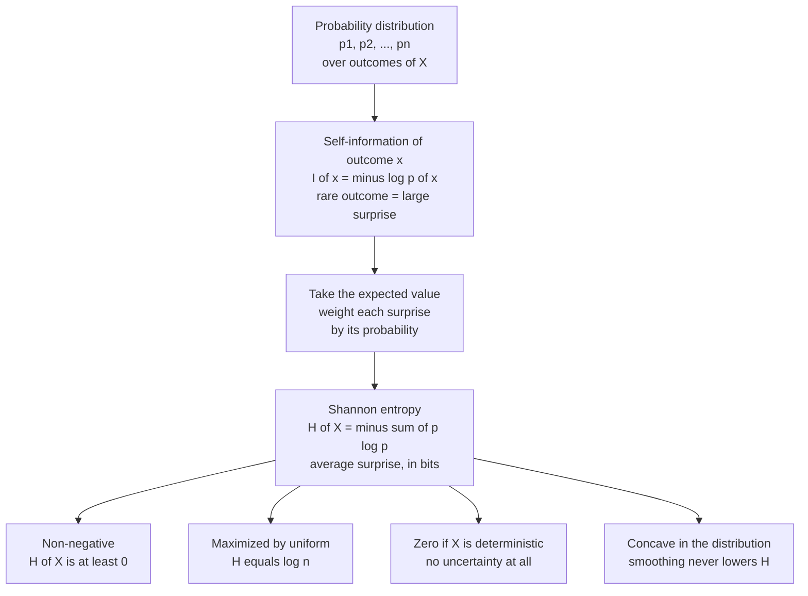

# 📏 Entropy and Information Content

> [!abstract] TL;DR
> **Self-information** measures how surprised you should be by a single outcome: $I(x) = -\log p(x)$. Rare events carry more information than common ones, and the logarithm makes information from independent events simply *add up*. **Shannon entropy** $H(X) = -\sum_x p(x)\log p(x)$ is the *average* self-information — the expected surprise of a random variable, and equivalently the minimum average number of bits needed to describe its outcomes. Entropy is non-negative, zero for a certain outcome, and maximal for a uniform distribution. It is the foundational quantity from which nearly all of information theory is built.

---

## Intuition

**Analogy — surprise as information.** Imagine a friend who narrates the world to you. If they say *"the sun rose this morning,"* they have told you essentially nothing — you already knew it with certainty. If instead they say *"a meteor landed in your backyard,"* that single sentence carries an enormous amount of information, precisely because it was so unlikely. **Information is surprise.** A certain event ($p = 1$) is worth zero bits; an impossible event ($p = 0$) would be infinitely surprising.

Now imagine your friend narrates thousands of events over a year. Some days are boring, some are shocking. **Entropy is your *average* surprise per event** — how much information you receive on a typical day. A friend who only ever reports the obvious has low entropy; a friend whose reports are genuinely unpredictable has high entropy. Entropy measures the intrinsic *unpredictability* of the source, not the meaning of any one message.

That single shift — from "how meaningful is this message?" to "how surprised am I, on average?" — is the entire conceptual leap that Claude Shannon made in 1948, and it turned communication into a quantitative science.

---

## How It Works

### 1. Self-information (surprisal) of one outcome

For an outcome $x$ with probability $p(x)$, its **self-information** (or **surprisal**) is:

$$I(x) = -\log p(x) = \log \frac{1}{p(x)}$$

Three demands pin down this form:

- **Monotonic in rarity.** Smaller $p(x)$ must give larger $I(x)$. The reciprocal $1/p(x)$ does that.
- **Certain event carries no information.** $p(x) = 1 \Rightarrow I(x) = 0$. The log of 1 is 0. ✓
- **Additivity for independent events.** If two independent things happen, the total surprise should be the *sum* of the individual surprises. Since independent probabilities *multiply* ($p(x,y) = p(x)p(y)$), we need a function that turns products into sums — and the logarithm is exactly that function: $-\log[p(x)p(y)] = -\log p(x) - \log p(y)$.

**The base of the logarithm chooses the unit:**

| Base | Unit | Meaning |
|------|------|---------|
| 2 | **bit** (binary digit) | number of yes/no questions |
| $e$ | **nat** (natural unit) | convenient for calculus and physics |
| 10 | **hartley** / dit | number of decimal digits |

They differ only by a constant factor ($1\ \text{nat} = 1/\ln 2 \approx 1.443$ bits), so the choice is cosmetic. We use base 2 throughout, giving answers in **bits**.

### 2. Shannon entropy — the average self-information

A source does not emit one fixed outcome; it emits outcomes according to a distribution. The **entropy** of a random variable $X$ is the *expected* self-information:

$$H(X) = \mathbb{E}[I(X)] = -\sum_{x} p(x)\log_2 p(x)$$

Three equivalent readings, all correct:

1. **Average surprise** — the mean number of bits of surprise per outcome.
2. **Average uncertainty** — how unsure you are, on average, before seeing the outcome.
3. **Compression limit** — the minimum average number of bits needed to encode outcomes of $X$ (Shannon's source coding theorem; see the redundancy discussion below).

By convention $0 \log 0 = 0$ (an impossible outcome contributes nothing), which is justified by the limit $\lim_{p\to 0^+} p\log p = 0$.

### 3. Worked intuition

- **Fair coin:** two equally likely outcomes, $H = -2 \cdot \tfrac{1}{2}\log_2 \tfrac{1}{2} = 1$ bit. One yes/no question suffices.
- **Fair die:** six equally likely faces, $H = \log_2 6 \approx 2.585$ bits.
- **Biased coin** ($p = 0.9$ heads): $H \approx 0.47$ bits — the outcome is largely predictable, so it carries less than half a bit of information on average.
- **Two-headed coin:** $H = 0$ bits — no uncertainty, no information.

### 4. Axiomatic uniqueness

Shannon asked: what is the *only* function $H$ that satisfies these natural requirements?

1. **Continuity** — $H$ varies smoothly as the probabilities change.
2. **Monotonicity** — for $n$ *equally likely* outcomes, $H$ increases with $n$ (more choices ⇒ more uncertainty).
3. **Additivity / grouping** — if a choice is broken into successive sub-choices, the total entropy is the weighted sum of the parts.

Up to the choice of logarithm base (an overall multiplicative constant), the **only** function satisfying all three is $H(X) = -k\sum p(x)\log p(x)$. Entropy is not an arbitrary definition — it is forced by the axioms.

### 5. Key properties

- **Non-negativity:** $H(X) \ge 0$, since $0 \le p(x) \le 1 \Rightarrow -\log p(x) \ge 0$.
- **Maximum at uniform:** for $n$ outcomes, $H(X) \le \log_2 n$, with equality *iff* the distribution is uniform. Maximum uncertainty = all outcomes equally likely.
- **Zero for determinism:** $H(X) = 0$ *iff* one outcome has probability 1.
- **Concavity:** $H$ is a concave function of the distribution — mixing (smoothing) distributions never decreases entropy. This underpins Jensen-based bounds throughout information theory.

### 6. The binary entropy function

For a single yes/no variable with $P(1) = p$:

$$H(p) = -p\log_2 p - (1-p)\log_2(1-p)$$

Its graph is a symmetric hump: **zero at $p=0$ and $p=1$** (a rigged coin tells you nothing) and a **maximum of exactly 1 bit at $p = 0.5$** (a fair coin is maximally uncertain). This single curve is the most-used shape in all of information theory.

### Flow: distribution → surprisal → entropy → properties



---

## Key Concepts

### Secondary (intuitive level)
- **Information = surprise.** Unlikely events are informative; certain events are not.
- A **bit** is the information in one fair yes/no question.
- **Entropy** is the average surprise, i.e. how unpredictable a source is. A fair coin has 1 bit of entropy; a two-headed coin has 0.
- More equally likely options ⇒ more entropy; a rigged, predictable source ⇒ less.

### Undergraduate (working level)
- **Self-information:** $I(x) = -\log_2 p(x)$; the log makes independent surprises additive.
- **Entropy as expectation:** $H(X) = \mathbb{E}[-\log_2 p(X)] = -\sum p(x)\log_2 p(x)$.
- **Bounds:** $0 \le H(X) \le \log_2 n$; uniform maximizes, deterministic minimizes.
- **Binary entropy function** $H(p)$ and its shape; fair die $= \log_2 6$.
- **Units:** bits (base 2), nats (base $e$), hartleys (base 10) — convertible by a constant.
- **Compressibility:** entropy is the lower bound on the average bits per symbol for lossless coding.

### Graduate (theoretical level)
- **Axiomatic characterization** (continuity, monotonicity, additivity) uniquely determines $H$ up to scale — the Shannon–Khinchin axioms.
- **Concavity of $H$** in the probability simplex; consequences via Jensen's inequality and the log-sum inequality.
- **Asymptotic Equipartition Property (AEP):** for i.i.d. sequences, the probability of a typical length-$n$ sequence is about $2^{-nH}$; there are roughly $2^{nH}$ typical sequences. Entropy is the exponent of the typical set — this is what makes it *the* compression rate.
- **Maximum-entropy principle (Jaynes):** given constraints (e.g. fixed mean/variance), the least-biased distribution is the one maximizing $H$ — recovering the uniform, exponential, and Gaussian as max-entropy distributions.
- **Differential entropy** $h(X) = -\int f(x)\log f(x)\,dx$ for continuous variables — useful but *not* coordinate-invariant and can be negative (contrast with discrete $H$).
- **Bridge to physics:** Gibbs entropy $S = -k_B\sum p_i \ln p_i$ is *identical in form*; Shannon entropy is its dimensionless, information-theoretic sibling.

---

## Python Demo

```python
# Entropy and information content, in bits (log base 2).
# Demonstrates: (1) the binary entropy function H(p) peaking at p=0.5,
#               (2) self-information -log2(p) — rare events carry more info,
#               (3) uniform maximizes entropy vs a skewed distribution.
import numpy as np
import matplotlib.pyplot as plt


def entropy(p, base=2):
    """Shannon entropy of a discrete distribution p (1D array summing to 1)."""
    p = np.asarray(p, dtype=float)
    p = p[p > 0]                               # 0*log0 := 0, so drop zero probs
    return -np.sum(p * (np.log(p) / np.log(base)))


def binary_entropy(p):
    """H(p) for a Bernoulli variable with P(1)=p, in bits."""
    p = np.clip(p, 1e-12, 1 - 1e-12)           # avoid log(0) at the endpoints
    return -(p * np.log2(p) + (1 - p) * np.log2(1 - p))


# --- 1. Binary entropy function over p in [0, 1] --------------------
p = np.linspace(0.0, 1.0, 500)
Hb = binary_entropy(p)

# --- 2. Self-information (surprisal) vs probability -----------------
prob = np.linspace(1e-3, 1.0, 500)
surprisal = -np.log2(prob)

# --- 3. Entropy of example distributions ---------------------------
uniform = np.array([0.25, 0.25, 0.25, 0.25])
skewed  = np.array([0.97, 0.01, 0.01, 0.01])
print(f"Fair coin        H = {entropy([0.5, 0.5]):.3f} bits")
print(f"Fair 6-sided die H = {entropy([1/6]*6):.3f} bits  (log2 6 = {np.log2(6):.3f})")
print(f"Biased coin 0.9  H = {entropy([0.9, 0.1]):.3f} bits")
print(f"Uniform 4-outcome H = {entropy(uniform):.3f} bits  (max = log2 4 = 2.000)")
print(f"Skewed  4-outcome H = {entropy(skewed):.3f} bits  (near-certain => low)")

# --- Plots ---------------------------------------------------------
fig, ax = plt.subplots(1, 2, figsize=(11, 4))

ax[0].plot(p, Hb, color="#2563eb", lw=2)
ax[0].axvline(0.5, ls="--", color="gray")
ax[0].scatter([0.5], [1.0], color="red", zorder=5, label="max = 1 bit at p = 0.5")
ax[0].set_title("Binary entropy function H(p)")
ax[0].set_xlabel("p = P(X = 1)")
ax[0].set_ylabel("entropy (bits)")
ax[0].legend()

ax[1].plot(prob, surprisal, color="#16a34a", lw=2)
ax[1].set_title("Self-information  I(x) = -log2 p(x)")
ax[1].set_xlabel("probability of outcome")
ax[1].set_ylabel("surprise (bits)")
ax[1].annotate("rare -> high surprise",
               xy=(0.05, -np.log2(0.05)), xytext=(0.35, 4.0),
               arrowprops=dict(arrowstyle="->"))

plt.tight_layout()
plt.show()

# Expected output:
# Fair coin        H = 1.000 bits
# Fair 6-sided die H = 2.585 bits  (log2 6 = 2.585)
# Biased coin 0.9  H = 0.469 bits
# Uniform 4-outcome H = 2.000 bits  (max = log2 4 = 2.000)
# Skewed  4-outcome H = 0.242 bits  (near-certain => low)
```

The printout makes the core theorem concrete: among all four-outcome distributions, the **uniform** one attains the maximum ($2.000$ bits $= \log_2 4$), while the **skewed** one — almost always producing the same symbol — carries only $0.242$ bits.

---

## Real-World Applications

- **Data compression.** Entropy is the hard floor on lossless compression: you cannot, on average, represent a source in fewer than $H(X)$ bits per symbol. Huffman coding, arithmetic coding, and the entropy stage of ZIP / PNG / JPEG all chase this bound. English text, at roughly **1–1.5 bits per character** (Shannon's own estimate) versus the 8 bits of raw ASCII, is enormously **redundant** — which is exactly why text compresses so well and why you can still read a sentnce wth mssng lttrs.
- **Machine learning.** **Cross-entropy loss** and **KL divergence** — the workhorses of classification and generative models — are direct offspring of Shannon entropy. Decision trees split on **information gain**, the entropy reduction achieved by a feature.
- **Cryptography and passwords.** Password and key strength are quantified in **bits of entropy**; a truly random 128-bit key has 128 bits of entropy, meaning $2^{128}$ equally likely possibilities.
- **Communications.** Channel capacity, error-correcting codes, and modem design all rest on entropy and its conditional cousins.
- **Physics.** **Boltzmann/Gibbs entropy** ($S = -k_B\sum p_i \ln p_i$) shares the *exact functional form*; Landauer's principle ties erasing one bit of information to a minimum heat dissipation of $k_B T \ln 2$ — literally connecting information bits to thermodynamic joules. See [[Entropy_and_Second_Law]].

---

## Common Pitfalls

- **Confusing entropy with "amount of data."** Entropy measures *unpredictability*, not file size or message length. A 1 GB file of all zeros has almost zero entropy; a 1 KB file of random bytes has high entropy per byte. Compression exploits exactly this gap.
- **Forgetting the log base.** Bits, nats, and hartleys differ by constant factors. Mixing $\ln$ and $\log_2$ silently rescales every result. Pick a base and state it.
- **Mishandling $p = 0$.** Naively computing $0 \cdot \log 0$ yields `nan` in code. Use the convention $0\log 0 = 0$ (drop zero-probability terms), as the demo does.
- **Assuming higher entropy means "more information content in the useful sense."** Entropy is maximized by *pure randomness*. White noise has maximal entropy but conveys no meaning — entropy quantifies uncertainty, not semantic value or usefulness.
- **Confusing entropy with variance.** Both measure "spread," but variance depends on the numeric *magnitudes* and *scale* of outcomes, while entropy depends only on the *probabilities* and is invariant to relabeling outcomes. A variable taking values $\{1, 2\}$ and one taking $\{1, 10^6\}$ with the same probabilities have identical entropy but wildly different variance.
- **Treating differential (continuous) entropy like discrete entropy.** Differential entropy can be negative and changes under a change of variables — it is not a limit of discrete entropy. Do not expect $h(X) \ge 0$.

---

## Related Concepts

- [[Probability_Theory]] — entropy is defined over a probability distribution; the axioms of probability underlie every sum $\sum p(x)$.
- [[Random_Variables]] — entropy is an **expectation**, $H(X) = \mathbb{E}[-\log p(X)]$; contrast it with variance as a competing measure of spread.
- [[Exponential_and_Logarithmic_Functions]] — the logarithm's product-to-sum property is precisely *why* self-information is additive for independent events.
- [[Entropy_and_Second_Law]] — thermodynamic (Boltzmann/Gibbs) entropy has the identical functional form $S = -k_B\sum p_i\ln p_i$; the informational and physical concepts are two faces of the same idea.
- [[Classical_Statistical_Mechanics]] — the maximum-entropy principle recovers equilibrium ensembles, linking Shannon's $H$ directly to statistical physics.

---

## Review Questions

**Tier 1 — Conceptual (explain to a peer):**
1. Why does a *certain* event carry zero information while a rare event carries a lot? Explain using the surprise analogy, then in one sentence tie it to $I(x) = -\log p(x)$.
2. What is the entropy of a fair coin, a two-headed coin, and a fair six-sided die, and why do these three answers make intuitive sense?

**Tier 2 — Applied (compute / reason):**
3. Why must the information measure be a *logarithm* rather than, say, $1/p(x)$? Show what property breaks if you drop the log.
4. A source emits symbol A with probability 0.5, B with 0.25, and C and D with 0.125 each. Compute $H$ in bits. What is the shortest average code length you could hope to achieve, and can you design a code that reaches it?

**Tier 3 — Theoretical (deep understanding):**
5. Prove (or argue carefully) that among all distributions over $n$ outcomes, the uniform distribution maximizes entropy, giving $H = \log_2 n$. Which inequality does the proof rely on, and where does concavity enter?
6. Two random variables have the same entropy but very different variances. Construct such a pair explicitly and explain what this reveals about the difference between "uncertainty" (entropy) and "spread" (variance).

---

## Sources

- Shannon, C. E. (1948). *A Mathematical Theory of Communication.* Bell System Technical Journal, 27, 379–423 & 623–656. [PDF](https://people.math.harvard.edu/~ctm/home/text/others/shannon/entropy/entropy.pdf)
- Cover, T. M. & Thomas, J. A. (2006). *Elements of Information Theory* (2nd ed.). Wiley. Chapter 2, "Entropy, Relative Entropy, and Mutual Information."
- MacKay, D. J. C. (2003). *Information Theory, Inference, and Learning Algorithms.* Cambridge University Press. [Free online](https://www.inference.org.uk/mackay/itila/)
- Shannon, C. E. (1951). *Prediction and Entropy of Printed English.* Bell System Technical Journal, 30, 50–64. (source of the ~1 bit/character estimate for English)
- Jaynes, E. T. (1957). *Information Theory and Statistical Mechanics.* Physical Review, 106(4), 620–630. (the maximum-entropy principle linking Shannon and thermodynamic entropy)

---

#information-theory #entropy #shannon-entropy #self-information #bits
