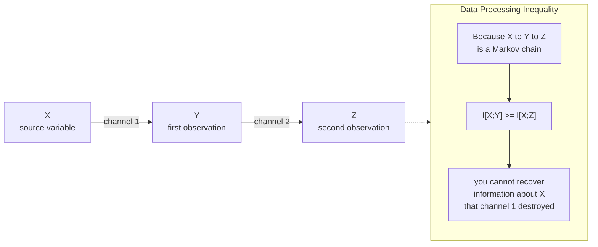

# 🧮 Information Inequalities and the Data Processing Inequality

> [!abstract] TL;DR
> Information theory turns into a *proof machine* through a small family of inequalities — Jensen's inequality, non-negativity of KL divergence (Gibbs), "conditioning reduces entropy," subadditivity, the **Data Processing Inequality** (post-processing a signal can never increase information about the source), and **Fano's inequality** (error probability is lower-bounded by conditional entropy). Together they prove the *converses* to the coding theorems and the *impossibility* results that tell us what no algorithm, code, or estimator can ever do.

---

## Intuition

**Analogy:** You are handed a blurry photocopy of a document. You can enhance the contrast, run OCR, crop, sharpen, and reformat all day long — but no amount of *processing the copy* will bring back a word that the original blur already smeared out. Every transformation you apply is a function of the copy, not of the original, so at best it *preserves* what survived and at worst it *destroys* more. There is no post-processing that manufactures information about the source that was not already present.

That single fact — you cannot create information by processing — is the **Data Processing Inequality (DPI)**. When a signal $X$ is observed as $Y$ and then $Y$ is transformed into $Z$ (a Markov chain $X \rightarrow Y \rightarrow Z$), the information $Z$ carries about $X$ can only be less than or equal to what $Y$ carried: $I(X;Z) \le I(X;Y)$. Everything else in this note is the toolkit — convexity, KL non-negativity, entropy monotonicity — that proves this and its cousins rigorously.

---

## How It Works

### The chain of dependency

Every one of these inequalities is a corollary of **convexity**. Jensen's inequality is the workhorse; from it you get Gibbs' inequality ($D(p\|q)\ge 0$), and from that you get "conditioning reduces entropy," subadditivity, the DPI, and Fano's bound. The logical skeleton:

1. **Jensen's inequality** — for a convex function $f$ and random variable $X$: $f(\mathbb{E}[X]) \le \mathbb{E}[f(X)]$. This is the probabilistic face of convexity (see [[Jensen_and_Inequalities]] and [[Convex_Functions]]).
2. **Gibbs' inequality / KL non-negativity** — apply Jensen to the convex function $-\log$:
$$D(p\|q) = \sum_x p(x)\log\frac{p(x)}{q(x)} \ge 0, \quad \text{equality iff } p=q.$$
This is *the* master inequality: nearly every other bound is $D(\cdot\|\cdot)\ge 0$ in disguise.
3. **Mutual information is non-negative** — because $I(X;Y) = D\big(p(x,y)\,\big\|\,p(x)p(y)\big) \ge 0$. Two variables can never carry *negative* shared information.
4. **Conditioning reduces entropy** — $H(X\mid Y) \le H(X)$, since $H(X) - H(X\mid Y) = I(X;Y) \ge 0$. On average, observing $Y$ never increases your uncertainty about $X$.
5. **Subadditivity** — $H(X_1,\dots,X_n) \le \sum_i H(X_i)$, with equality iff the variables are independent. Correlation compresses.

### The Data Processing Inequality

For a **Markov chain** $X \rightarrow Y \rightarrow Z$ (meaning $Z$ depends on $X$ only through $Y$, i.e. $p(z\mid x,y)=p(z\mid y)$):
$$I(X;Y) \ge I(X;Z).$$

**Proof sketch.** Expand the mutual information between $X$ and the pair $(Y,Z)$ two ways using the chain rule:
$$I(X;Y,Z) = I(X;Y) + I(X;Z\mid Y) = I(X;Z) + I(X;Y\mid Z).$$
The Markov condition makes $I(X;Z\mid Y)=0$ ($Z$ is independent of $X$ given $Y$). Since $I(X;Y\mid Z)\ge 0$, we get $I(X;Y) \ge I(X;Z)$. **Equality holds iff $Y$ is a sufficient statistic for $X$** — that is, $I(X;Y\mid Z)=0$, so no information about $X$ was lost in going from $Y$ to $Z$.

### Fano's inequality

If you try to guess $X$ from $Y$ with an estimator $\hat X = g(Y)$, the error probability $P_e = \Pr[\hat X \ne X]$ is *lower*-bounded by the residual uncertainty:
$$H(X\mid Y) \le H_b(P_e) + P_e \log\big(|\mathcal{X}| - 1\big),$$
where $H_b$ is the binary entropy function. Rearranged, a large $H(X\mid Y)$ *forces* a large error probability — you cannot decode reliably if uncertainty remains. This is the engine of every **converse** (impossibility) theorem.

### Flow / Architecture



---

## Key Concepts

### Secondary (intuitive level)
- **No free lunch in post-processing.** Editing a copy can never add facts that the original did not contain. Processing preserves-or-destroys, never creates.
- **On average, information helps.** Extra observations, on average, reduce your uncertainty — they never make you more confused *on average* (the "on average" caveat is crucial — see pitfalls).
- **Errors need uncertainty.** If two possibilities remain equally likely after you observe your data, you must sometimes guess wrong — that is Fano's idea in plain words.

### Undergraduate
- **Jensen's inequality** $f(\mathbb{E}[X]) \le \mathbb{E}[f(X)]$ for convex $f$ — the source of almost everything here ([[Jensen_and_Inequalities]]).
- **Gibbs' inequality:** $D(p\|q)\ge 0$, equality iff $p=q$; equivalently cross-entropy $\ge$ entropy, which is why cross-entropy is a valid loss.
- **Conditioning reduces entropy:** $H(X\mid Y)\le H(X)$; equality iff $X \perp Y$.
- **Subadditivity:** $H(X_1,\dots,X_n)\le \sum_i H(X_i)$.
- **Data Processing Inequality:** $X\rightarrow Y\rightarrow Z \implies I(X;Y)\ge I(X;Z)$, and also $I(X;Z)\le I(Y;Z)$.
- **Fano's inequality:** $H(X\mid Y)\le H_b(P_e)+P_e\log(|\mathcal X|-1)$.

### Graduate
- **Equality in DPI = sufficient statistics.** $I(X;Z)=I(X;Y)$ iff $Y \rightarrow Z$ loses nothing, i.e. $Z$ is itself a sufficient statistic for $X$. This is the information-theoretic definition of sufficiency (Kullback).
- **Log-sum inequality:** for non-negative $a_i,b_i$,
$$\sum_i a_i \log\frac{a_i}{b_i} \ge \Big(\sum_i a_i\Big)\log\frac{\sum_i a_i}{\sum_i b_i},$$
which directly proves convexity of KL divergence, the DPI for relative entropy, and Gibbs' inequality in one stroke.
- **DPI for KL divergence:** applying any channel (stochastic map) $W$ to both $p$ and $q$ can only shrink their divergence: $D(Wp\,\|\,Wq)\le D(p\|q)$. **Strong Data Processing Inequalities (SDPIs)** sharpen this to $D(Wp\|Wq)\le \eta\, D(p\|q)$ with a contraction coefficient $\eta<1$, giving quantitative decay rates.
- **Fano as the converse to channel coding.** For a code of rate $R$ above capacity $C$, Fano forces $P_e$ bounded away from zero — this is the converse half of Shannon's Channel Coding Theorem ($R>C \Rightarrow$ reliable communication impossible).
- **Entropy Power Inequality (EPI):** for independent continuous $X,Y$, $e^{2h(X+Y)/n}\ge e^{2h(X)/n}+e^{2h(Y)/n}$ — the continuous-domain analogue that underlies Gaussian-channel converses and additive-noise limits.
- **Information Bottleneck:** DPI applied to a representation $T$ of input $X$ predicting label $Y$ ($Y\rightarrow X\rightarrow T$) bounds $I(T;Y)\le I(X;Y)$ — no learned feature can extract more label information than the raw input holds ([[Information_Theory]]).
- **Minimax lower bounds:** Fano's inequality (and its continuous Le Cam / Assouad variants) yields information-theoretic *lower* bounds on the risk of *any* estimator in statistics and learning theory ([[Statistical_Inference]]).

---

## Python Demo

```python
# Data Processing Inequality demo.
# A single source bit X is passed through k identical binary symmetric
# channels (BSCs) in series, forming the Markov chain X -> Y1 -> Y2 -> ... -> Yk.
# We compute the mutual information I(X; Yk) at every stage and show it can
# ONLY decrease with k -- information lost in an early channel is gone for good.

import numpy as np
import matplotlib.pyplot as plt


def bsc_matrix(p):
    # W[x, y] = P(Y = y | X = x) for a binary symmetric channel (crossover p)
    return np.array([[1 - p, p],
                     [p,     1 - p]])


def mutual_information_bits(P_xy):
    # I(X;Y) = sum P(x,y) * log2[ P(x,y) / (P(x) P(y)) ]   in bits
    Px = P_xy.sum(axis=1, keepdims=True)      # marginal of X
    Py = P_xy.sum(axis=0, keepdims=True)      # marginal of Y
    with np.errstate(divide="ignore", invalid="ignore"):
        terms = P_xy * np.log2(P_xy / (Px * Py))
    terms[P_xy <= 0] = 0.0                     # convention 0*log0 = 0
    return terms.sum()


Px = np.array([0.5, 0.5])                      # uniform source bit
K = 12                                         # number of chained channels

plt.figure(figsize=(8, 5))
for p in (0.05, 0.15, 0.30):
    W = bsc_matrix(p)
    mi = []
    Wk = np.eye(2)                             # W^0 = identity
    for k in range(1, K + 1):
        Wk = Wk @ W                            # P(Yk | X) = W^k
        P_xyk = np.diag(Px) @ Wk               # joint P(X, Yk)
        mi.append(mutual_information_bits(P_xyk))
    mi = np.array(mi)

    # DPI check: mutual information is non-increasing along the chain
    assert np.all(np.diff(mi) <= 1e-12), "DPI violated -- should be impossible"
    print(f"p={p}:  I(X;Y1)={mi[0]:.4f}   I(X;Y2)={mi[1]:.4f}   ...   "
          f"I(X;Y{K})={mi[-1]:.4f} bits")

    plt.plot(range(1, K + 1), mi, marker="o", label=f"BSC crossover p={p}")

plt.axhline(0.0, color="gray", lw=0.8, ls="--")
plt.title("Data Processing Inequality: information about X can only decay")
plt.xlabel("number of processing stages k   (X -> Y1 -> ... -> Yk)")
plt.ylabel("mutual information I(X; Yk)   [bits]")
plt.legend()
plt.grid(alpha=0.3)
plt.tight_layout()
plt.savefig("dpi_decay.png", dpi=120)
plt.show()

# Typical output:
#   p=0.05:  I(X;Y1)=0.7136   I(X;Y2)=0.5361   ...   I(X;Y12)=0.0117 bits
#   p=0.15:  I(X;Y1)=0.3900   I(X;Y2)=0.1731   ...   I(X;Y12)=0.0000 bits
#   p=0.30:  I(X;Y1)=0.1187   I(X;Y2)=0.0325   ...   I(X;Y12)=0.0000 bits
# Every curve is monotonically non-increasing: each extra noisy stage strips
# more information about X, and no downstream stage can ever restore it.
```

The composition of two identical BSCs with crossover $p$ is itself a BSC with crossover $2p(1-p)>p$, so the effective channel degrades toward pure noise ($p_\text{eff}\to 0.5$) and $I(X;Y_k)\to 0$. The `assert` makes the DPI *fail loudly* if it were ever violated — it never is.

---

## Real-World Applications

> **Example — Shannon's Channel Coding converse.** Fano's inequality is *how we prove you cannot beat capacity*. For any code transmitting at rate $R > C$ over a noisy channel, $H(X\mid Y)$ stays large, so Fano lower-bounds the block-error probability away from zero. This impossibility half of the coding theorem is pure information inequality — no construction, just DPI + Fano.

- **Machine learning / representation quality.** With the Markov chain label $\rightarrow$ input $\rightarrow$ feature ($Y\rightarrow X\rightarrow T$), the DPI gives $I(T;Y)\le I(X;Y)$: **no feature extractor, however deep, can carry more information about the label than the raw input contains.** The **Information Bottleneck** frames training as trading off compression $I(X;T)$ against relevance $I(T;Y)$ ([[Information_Theory]]).
- **Cryptography impossibility.** DPI shows that a ciphertext produced from a key and message cannot leak more about the plaintext after any adversary post-processing than it already did — bounding side-channel and eavesdropper advantage.
- **Statistics and estimation lower bounds.** Fano (and Le Cam / Assouad) convert a hypothesis-testing gap into an unbeatable **minimax risk lower bound**, telling you the best possible estimation error for *any* algorithm given $n$ samples ([[Statistical_Inference]]).
- **Privacy and differential privacy.** SDPIs quantify how much a privatizing mechanism must contract the divergence between neighboring databases, linking privacy budgets to information contraction.
- **Sensor fusion and pipelines.** Any multi-stage data pipeline (raw $\rightarrow$ features $\rightarrow$ summary) obeys the DPI: aggressive early lossy compression permanently caps everything downstream.

---

## Common Pitfalls

- **"Conditioning reduces entropy" is only true on average.** $H(X\mid Y)\le H(X)$ holds for the *averaged* conditional entropy, but for a *specific* value $H(X\mid Y=y)$ can be **larger** than $H(X)$ — a particular observation can genuinely increase uncertainty (an ambiguous clue). Never claim $H(X\mid Y=y)\le H(X)$ pointwise.
- **Forgetting the Markov condition in DPI.** $I(X;Z)\le I(X;Y)$ requires $X\rightarrow Y\rightarrow Z$. If $Z$ sees $X$ directly (a side channel), the inequality can fail — $Z$ is no longer a mere function of $Y$.
- **Thinking a clever transform recovers lost information.** Deconvolution, super-resolution, and "AI enhancement" cannot exceed the DPI ceiling; they *hallucinate plausible* detail, they do not recover destroyed information about the source.
- **Mixing up KL's arguments.** $D(p\|q)\ne D(q\|p)$; Gibbs guarantees only non-negativity, not symmetry. Applying the wrong order corrupts every downstream bound.
- **Applying Jensen in the wrong direction.** Convex $f$ gives $f(\mathbb E[X])\le \mathbb E[f(X)]$; for concave $f$ (like $\log$) it reverses. The single most common source of sign errors in information-theory proofs.
- **Reading equality in DPI as "no processing happened."** Equality $I(X;Z)=I(X;Y)$ means $Y$ (equivalently the map to $Z$) is a **sufficient statistic** — information is preserved even though the representation changed. Loss of *bits* and loss of *information* are different things.

---

## Related Concepts

- [[Jensen_and_Inequalities]] — the convexity workhorse behind Gibbs' inequality, KL non-negativity, and the log-sum inequality that power every bound here
- [[Convex_Functions]] — DPI and Fano ultimately rest on the convexity of $-\log$ and of KL divergence
- [[Information_Theory]] — entropy, conditional entropy, mutual information, and the Information Bottleneck that DPI constrains in machine learning
- [[Probability_Theory]] — Markov chains, conditional independence, and the chain rule used throughout the DPI proof
- [[Statistical_Inference]] — Fano's inequality yields minimax lower bounds on estimator risk and sample complexity
- [[Information_and_Entropy_in_Systems]] — the thermodynamic/complexity view of entropy monotonicity and information loss

---

## Review Questions

1. **(Conceptual)** State the Data Processing Inequality for a Markov chain $X\rightarrow Y\rightarrow Z$ and prove it using the chain rule for mutual information. Under exactly what condition does equality hold, and what does that condition mean statistically?
2. **(Scenario)** A junior engineer proposes a "denoiser" network $Z=g(Y)$ that takes a noisy image $Y$ (itself a corrupted version of a clean scene $X$) and claims it *recovers information* about $X$ so that $I(X;Z)>I(X;Y)$. Using the DPI, explain precisely why this claim is impossible, and clarify what the denoiser is actually doing that makes its output *look* more informative.
3. **(Trade-off / bounds)** Fano's inequality and the DPI both give *lower* bounds (impossibility results) rather than *upper* bounds (achievability). Explain why converse theorems in communication and minimax lower bounds in statistics both rely on this family of inequalities, and what a matching *upper* bound would additionally require to prove a result tight.

---

## Sources

- Cover, T. M. & Thomas, J. A. — *Elements of Information Theory*, 2nd ed. (2006), Chapters 2 and 7 (mutual information, DPI, Fano).
- MacKay, D. J. C. — *Information Theory, Inference, and Learning Algorithms* (2003), Chapters 8 and 10.
- Csiszár, I. & Körner, J. — *Information Theory: Coding Theorems for Discrete Memoryless Systems*, 2nd ed. (2011).
- Polyanskiy, Y. & Wu, Y. — *Information Theory: From Coding to Learning* (2023), chapters on data processing and strong data processing inequalities.
- Tishby, N., Pereira, F. & Bialek, W. — "The Information Bottleneck Method" (1999), arXiv:physics/0004057.

---

#information-theory #data-processing-inequality #jensen #fano #inequalities
