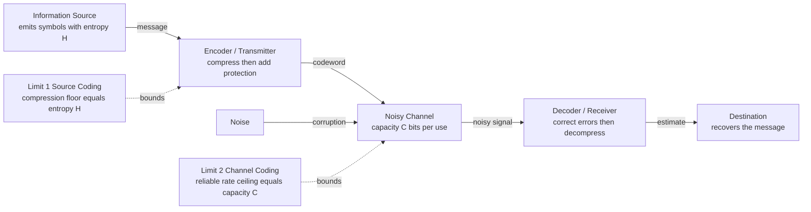

# 📡 Information Theory Overview

> [!abstract] TL;DR
> Information theory is the mathematical study of quantifying, storing, and communicating information, founded by Claude Shannon's 1948 paper *A Mathematical Theory of Communication*. Its central insight is that **information is the resolution of uncertainty**, measured in **bits** — the rarer an event, the more information it carries. Two theorems anchor the entire field: the **source coding theorem** says entropy is the ultimate limit of lossless compression, and the **noisy channel coding theorem** says a channel's capacity is the ultimate limit of reliable communication. Together they underpin every ZIP file, hard drive, deep-space probe, cryptosystem, and cross-entropy loss in machine learning.

---

## Intuition

**Analogy — the game of 20 Questions.** You are trying to identify a secret object by asking yes/no questions. If the object is drawn uniformly from 16 possibilities, a smart player splits the remaining candidates in half each time and always wins in exactly **4 questions** — because 16 equals 2 to the power 4. Each well-chosen yes/no answer removes half your uncertainty: that "one halving of uncertainty" is exactly **one bit** of information.

Now change the game. Suppose the secret is "sunny" 90% of the time and "rainy", "snowy", or "foggy" only rarely. Learning that it is *sunny* barely surprises you, so it carries little information — you would not waste a full question on it. Learning that it is *snowy* is a shock, so it is worth more. A message is worth more the more surprised you are to receive it. The average surprise across all outcomes, measured in bits, is the **entropy** — and it turns out to be exactly the average number of yes/no questions an optimal player needs.

That is the whole seed of the field: **information = reduced uncertainty**, and uncertainty can be measured, priced, compressed, and transmitted like any physical quantity.

---

## How It Works

### Core Mechanics

**1. Information is tied to improbability.** Shannon defined the information content of an event `x` with probability `p(x)` as the *self-information*:

$$I(x) = \log_2 \frac{1}{p(x)} = -\log_2 p(x) \quad \text{bits}$$

A certain event (`p = 1`) carries 0 bits — no surprise. A one-in-a-million event carries about 20 bits. The logarithm makes information **additive**: two independent events carry the sum of their individual information, matching the intuition that surprises stack up. (Developed fully in the planned note [[Entropy_and_Information_Content]].)

**2. Entropy is average information.** The **entropy** of a source `X` is the expected self-information — the average surprise per symbol:

$$H(X) = -\sum_x p(x)\,\log_2 p(x) \quad \text{bits per symbol}$$

Entropy is maximized by a uniform distribution (maximum uncertainty) and is zero when one outcome is certain. It is the number of yes/no questions, on average, needed to pin down an outcome — the bridge between 20 Questions and physics.

**3. Shannon separated information from meaning.** Shannon's radical abstraction was to model *any* communication — telegraph, DNA, a phone call, a hard drive read — with the same five-part pipeline, and to declare that **the meaning of a message is irrelevant to the engineering problem of reproducing it.** What matters is only the statistics of the source and the channel. This is why the same math compresses text and corrects errors on Mars.

**4. Two fundamental limits bound everything.**
- **Source Coding Theorem (compression limit).** You cannot losslessly compress a source below its entropy `H` bits per symbol on average; and you can get arbitrarily close. Entropy is the incompressible core of the data. (See the planned [[Source_Coding_Overview]] section.)
- **Noisy Channel Coding Theorem (communication limit).** Every channel has a **capacity** `C` bits per use. Shannon proved the shocking, counterintuitive result that you can communicate at **any rate below `C` with arbitrarily small error probability** — even over a noisy channel — by using long, cleverly structured codes. Above `C`, reliable communication is impossible. (See the planned [[Channel_Coding_Overview]] section.)

**5. The key quantities.** Four measures, all built from probability, do the heavy lifting across the field:

| Quantity | Meaning | Formula |
|----------|---------|---------|
| Entropy `H(X)` | Uncertainty of a source | `-Σ p log p` |
| Mutual information `I(X;Y)` | Uncertainty about `X` removed by knowing `Y` | `H(X) - H(X\|Y)` |
| Relative entropy `D(P‖Q)` | Extra cost of using code for `Q` on data from `P` | `Σ P log(P/Q)` |
| Channel capacity `C` | Max reliable rate over a channel | `max_{p(x)} I(X;Y)` |

Mutual information and KL divergence are formalized in the planned S01 notes [[Mutual_Information]] and [[Relative_Entropy_KL_Divergence]]; capacity in [[Channel_Capacity]].

### Flow / Architecture

Shannon's communication system and the two limits that bound it:



The two limits are complementary: source coding **removes** the redundancy the source contains; channel coding **adds back** structured redundancy so noise can be undone. Good system design squeezes out natural redundancy, then reinserts exactly the right kind.

---

## Key Concepts

### Secondary Level
- **Information as surprise** — a message is more informative the less you expected it; certain events tell you nothing.
- **The bit** — one bit is one yes/no answer, one halving of uncertainty. 16 equally likely options need 4 bits; 256 need 8 bits.
- **Entropy as average surprise** — the average number of yes/no questions to identify an outcome. A fair coin has 1 bit; a nearly-always-heads coin has almost 0.
- **Compression** — predictable data has low entropy and squashes well; random data has high entropy and barely compresses. This is why a text file zips to a fraction of its size but an already-compressed JPEG barely shrinks.

### Undergraduate Level
- **Self-information and entropy** — `I(x) = -log2 p(x)`; `H(X) = E[I(X)]`. Units: bits (log base 2), nats (log base e), dits (log base 10).
- **Joint, conditional entropy, and the chain rule** — `H(X,Y) = H(X) + H(Y|X)`.
- **Mutual information** — `I(X;Y) = H(X) - H(X|Y) = H(Y) - H(Y|X)`; symmetric, non-negative, zero iff `X` and `Y` are independent.
- **Relative entropy / KL divergence** — `D(P‖Q) = Σ P log(P/Q) ≥ 0`; measures the penalty for encoding data from `P` with a code built for `Q`. It is **not** symmetric and **not** a metric.
- **Source Coding Theorem** — optimal lossless codes achieve average length in the range `[H, H+1)` per symbol; Huffman and arithmetic coding realize this.
- **Channel capacity and the Noisy Channel Coding Theorem** — `C = max I(X;Y)`; reliable communication is possible for any rate below `C`. For the additive Gaussian channel, `C = (1/2) log2(1 + S/N)` bits per use (Shannon–Hartley).

### Graduate Level
- **Asymptotic Equipartition Property (AEP)** — long sequences fall almost surely into a "typical set" of about `2^{nH}` roughly-equiprobable sequences; this single idea proves both coding theorems.
- **Rate–distortion theory** — the lossy generalization of source coding: minimum bits per symbol `R(D)` to reconstruct a source within distortion `D` (the theory behind JPEG and MP3).
- **Differential entropy and the Gaussian channel** — continuous-alphabet information; water-filling power allocation across parallel channels.
- **Network information theory** — multi-user problems: broadcast, multiple-access, and relay channels; Slepian–Wolf distributed source coding.
- **Kolmogorov complexity** — the algorithmic (single-object) counterpart to Shannon's statistical (ensemble) entropy; ties information to computability and Occam's razor / MDL.
- **Maximum-entropy inference (Jaynes)** — choosing the least-committal distribution consistent with known constraints; the principled bridge from thermodynamic to informational entropy.
- **Quantum information** — von Neumann entropy `S(ρ) = -Tr(ρ log ρ)`, qubits, and Holevo's bound generalize Shannon's framework.

---

## Python Demo

This demo makes the central claim concrete: **the entropy of a distribution (in bits) equals the average number of optimal yes/no questions needed to identify an outcome** — which is exactly the average codeword length of an optimal (Huffman) source code. We sweep distributions from uniform to sharply peaked and watch the two curves track each other, always obeying the source coding bound `H ≤ L < H + 1`.

```python
# Information = reduced uncertainty:
# entropy (bits) == average number of optimal yes/no questions == Huffman code length.
import numpy as np
import heapq
import matplotlib.pyplot as plt


def entropy_bits(p):
    """Shannon entropy in bits."""
    p = np.asarray(p, dtype=float)
    p = p[p > 0]                      # drop zeros to avoid log(0)
    return float(-np.sum(p * np.log2(p)))


def huffman_code_lengths(probs):
    """Optimal-code length (number of yes/no questions) for each symbol.
    Each Huffman merge deepens every leaf in both merged subtrees by one edge,
    i.e. adds one more yes/no question to reach those symbols."""
    probs = list(probs)
    n = len(probs)
    if n == 1:
        return [1]                    # still need one bit to name a single symbol
    lengths = [0] * n
    heap = [(p, i, [i]) for i, p in enumerate(probs)]   # (prob, tiebreak, leaves)
    heapq.heapify(heap)
    counter = n
    while len(heap) > 1:
        p1, _, leaves1 = heapq.heappop(heap)
        p2, _, leaves2 = heapq.heappop(heap)
        for idx in leaves1 + leaves2:
            lengths[idx] += 1          # one extra question for every symbol below
        heapq.heappush(heap, (p1 + p2, counter, leaves1 + leaves2))
        counter += 1
    return lengths


def avg_questions(probs):
    """Expected number of yes/no questions under the optimal code."""
    lengths = huffman_code_lengths(probs)
    return float(np.dot(probs, lengths))


# --- Sanity check: uniform over 16 objects -> exactly 4 questions (20-Questions) ---
uniform16 = np.full(16, 1 / 16)
print(f"Uniform over 16: entropy = {entropy_bits(uniform16):.3f} bits, "
      f"avg questions = {avg_questions(uniform16):.3f}")   # both 4.000

# --- Sweep skew: 0 = uniform, 1 = sharply peaked ---
K = 8
skews = np.linspace(0.0, 1.0, 25)
entropies, questions = [], []
for s in skews:
    ratio = 1.0 - 0.95 * s                  # geometric decay factor
    w = ratio ** np.arange(K)
    p = w / w.sum()                         # normalized distribution over K symbols
    entropies.append(entropy_bits(p))
    questions.append(avg_questions(p))

entropies = np.array(entropies)
questions = np.array(questions)

# The source coding theorem in action: H <= L < H + 1, always.
print(f"Max gap L - H over sweep: {np.max(questions - entropies):.3f} bits "
      f"(theory guarantees < 1)")

# --- Plot ---
plt.figure(figsize=(8, 5))
plt.plot(skews, entropies, 'o-', label="Entropy H (bits) - theoretical minimum")
plt.plot(skews, questions, 's--', label="Avg yes/no questions (Huffman code length)")
plt.plot(skews, entropies + 1, ':', color='gray', label="H + 1 bound")
plt.fill_between(skews, entropies, entropies + 1, color='gray', alpha=0.08)
plt.xlabel("Skew of distribution (0 = uniform, 1 = peaked)")
plt.ylabel("Bits")
plt.title("Entropy = average optimal yes/no questions = compression limit")
plt.legend()
plt.tight_layout()
plt.show()
```

**What you see:** the Huffman "average questions" curve hugs the entropy curve from above, never crossing `H` (you cannot beat entropy) and never reaching `H + 1` (Huffman is optimal). As the distribution grows more skewed, both fall together: predictable sources need fewer questions and compress harder. This *is* the source coding theorem — entropy is simultaneously the minimum yes/no questions and the minimum bits per symbol.

---

## Real-World Applications

- **Data compression** — ZIP/gzip (DEFLATE = LZ77 + Huffman), PNG, and FLAC are lossless coders chasing the entropy limit; JPEG, MP3, AAC, and H.264/H.265 video are **lossy** coders governed by rate–distortion theory, throwing away perceptually irrelevant information to beat the lossless floor.
- **Error correction everywhere** — Reed–Solomon codes protect QR codes, CDs, DVDs, and RAID arrays; LDPC and turbo codes (operating within a fraction of a decibel of the Shannon limit) power 5G, Wi-Fi 6, and satellite links; every modern SSD/HDD and flash controller uses LDPC to read data back correctly.
- **Deep-space communication** — the Voyager probes, Mars rovers, and the Cassini mission used concatenated and turbo codes to send images across billions of kilometers over vanishingly weak, noisy channels — a direct application of the noisy channel coding theorem.
- **Cryptography and secrecy** — Shannon founded modern cryptography in 1949; **perfect secrecy** (the one-time pad) requires key entropy at least equal to message entropy, and password/key strength is literally measured in bits of entropy (see [[Symmetric_Encryption]], [[Hash_Functions_and_MACs]]).
- **Machine learning** — cross-entropy is the standard classification loss, KL divergence regularizes VAEs and diffusion models, mutual information drives contrastive learning and feature selection, and the **information bottleneck** frames representation learning as compressing input while preserving label-relevant information (see [[Information_Theory]], [[Loss_Functions]]).
- **Statistics and inference** — the Minimum Description Length (MDL) principle and AIC/BIC recast model selection as compression: the best model is the one that most compresses the data plus itself.
- **Physics** — Shannon entropy and Boltzmann/Gibbs thermodynamic entropy are the *same* quantity up to Boltzmann's constant; **Landauer's principle** sets the minimum energy `kT ln 2` to erase one bit, and **Maxwell's demon** is exorcised by accounting for the information it stores (see [[Entropy_and_Second_Law]], [[Classical_Statistical_Mechanics]]).
- **Biology and neuroscience** — information theory quantifies the coding capacity of DNA, the efficiency of neural spike trains, and the channel capacity of sensory systems.

---

## Common Pitfalls

- **Confusing information with meaning** — Shannon's "information" measures statistical surprise, *not* semantic content or usefulness. A page of random noise has maximal Shannon information but zero meaning. The theory deliberately excludes semantics; that abstraction is its strength, not an oversight.
- **Conflating the unit "bit" with a stored bit** — an information bit (one halving of uncertainty) and a storage bit (a memory cell) coincide only for uniform sources. A biased coin's outcome can carry far less than one bit of information even though it takes one bit to store naively — which is exactly why compression is possible.
- **Believing capacity means zero-error at any speed** — the noisy channel coding theorem promises arbitrarily low error *only for rates below capacity* and *only in the limit of long codewords*, which costs latency and complexity. Push above `C` and reliable communication becomes impossible, full stop.
- **Treating KL divergence as a distance** — relative entropy `D(P‖Q)` is asymmetric and violates the triangle inequality, so it is not a metric. Swapping the arguments changes the answer and the behavior (mass-covering vs mode-seeking).
- **Mixing log bases** — entropy in bits (log base 2) and nats (log base e) differ by a factor of `ln 2 ≈ 0.693`. Report the unit, and never compare a bits figure to a nats figure directly.
- **Misusing differential entropy** — the continuous analog of entropy can be negative and is not invariant under a change of variables, so it does not directly measure "number of bits." Use it only for *differences* (like mutual information), where the coordinate dependence cancels.

---

## Related Concepts

- [[Entropy_and_Second_Law]] — the physics of entropy; Shannon's `H` and Boltzmann's `S = k ln Ω` are the same quantity, linked by Landauer's principle and Maxwell's demon.
- [[Classical_Statistical_Mechanics]] — the maximum-entropy principle derives the Boltzmann distribution, the deepest bridge between thermodynamics and information.
- [[Probability_Theory]] — entropy, mutual information, and KL divergence are all functionals of probability distributions; information theory is applied probability.
- [[Random_Variables]] — sources and channels are modeled as random variables; expectation and distributions are the raw material of every information measure.
- [[Information_Theory]] — the AI-ML companion note: how cross-entropy loss, KL regularization, and mutual information show up in modern deep learning.
- [[Loss_Functions]] — cross-entropy, the standard classification loss, is literally the coding cost of the true labels under the model's predicted distribution.
- [[Fourier_Transform]] — spectral analysis underlies channel bandwidth and the Shannon–Hartley capacity formula for band-limited channels.
- [[Sampling_Theorem]] — Nyquist–Shannon sampling sets how many independent samples per second a band-limited channel provides, feeding directly into capacity.
- [[DFT_and_FFT]] — the computational engine for the spectral and transform coding used in practical compression systems.
- [[Symmetric_Encryption]] — Shannon's notion of perfect secrecy defines the security target the one-time pad achieves.
- [[Hash_Functions_and_MACs]] — hash security and password strength are quantified in bits of entropy.

---

## Roadmap of the Information Theory Vault

Six sections build from foundations to applications:

1. **01 Foundations of Information Theory** (this section) — self-information, entropy, joint/conditional entropy, mutual information, KL divergence, and channel capacity. Core siblings: [[Entropy_and_Information_Content]], [[Mutual_Information]], [[Relative_Entropy_KL_Divergence]], [[Channel_Capacity]].
2. **02 Source Coding and Data Compression** — the source coding theorem, Huffman and arithmetic coding, Lempel–Ziv, and rate–distortion theory (lossy compression). Entry: [[Source_Coding_Overview]].
3. **03 Channel Coding and Error Correction** — the noisy channel coding theorem, block and convolutional codes, Reed–Solomon, LDPC, turbo, and polar codes. Entry: [[Channel_Coding_Overview]].
4. **04 Continuous and Network Information Theory** — differential entropy, the Gaussian/AWGN channel, water-filling, and multi-user (broadcast, multiple-access) information theory.
5. **05 Information Theory and Physics** — thermodynamic vs Shannon entropy, Maxwell's demon, Landauer's principle, and an introduction to quantum information and von Neumann entropy.
6. **06 Applications: ML, Cryptography, and Biology** — cross-entropy and the information bottleneck, MDL and model selection, perfect secrecy and key entropy, and neural/genetic coding.

---

## Review Questions

**Secondary**
1. A friend picks a card uniformly at random from a standard 52-card deck. Using only yes/no questions, roughly how many questions do you need to identify it, and why is the answer close to `log2(52) ≈ 5.7`? Explain what "one bit" bought you in each question.

**Undergraduate**
2. A source emits one of four symbols with probabilities `[1/2, 1/4, 1/8, 1/8]`. Compute its entropy in bits, design an optimal (Huffman) code, and show the average codeword length equals the entropy exactly. Why does this source hit the source coding bound with no gap, whereas a source with probabilities `[0.4, 0.3, 0.2, 0.1]` does not?

**Graduate**
3. The noisy channel coding theorem promises reliable communication at any rate below capacity `C`, yet real systems always operate with some margin below `C` and with finite block length. Using the ideas of the typical set / AEP and the fact that Shannon's proof is asymptotic in block length, explain *why* the theorem is an existence result rather than a construction, and what practical price (latency, complexity) codes like LDPC and turbo pay to approach `C`.

---

## Sources

- [Shannon, C. E. — A Mathematical Theory of Communication (1948)](https://people.math.harvard.edu/~ctm/home/text/others/shannon/entropy/entropy.pdf)
- [Cover, T. & Thomas, J. — Elements of Information Theory (2nd ed.)](https://onlinelibrary.wiley.com/doi/book/10.1002/047174882X)
- [MacKay, D. — Information Theory, Inference, and Learning Algorithms (free PDF)](https://www.inference.org.uk/mackay/itila/book.html)
- [Chris Olah — Visual Information Theory](https://colah.github.io/posts/2015-09-Visual-Information/)
- [Stone, J. V. — Information Theory: A Tutorial Introduction](https://jamesstone.sites.sheffield.ac.uk/books/information-theory)

---

#information-theory #entropy #shannon #communication #overview
