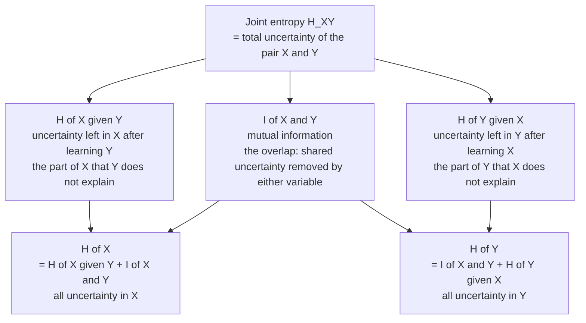

# 🔗 Joint Entropy, Conditional Entropy and Mutual Information

> [!abstract] TL;DR
> When two random variables interact, **joint entropy** H(X,Y) measures the total uncertainty of the pair, **conditional entropy** H(Y|X) measures the uncertainty left in Y once X is known, and **mutual information** I(X;Y) measures how much learning one variable reduces uncertainty about the other. Mutual information is symmetric, non-negative, zero exactly when the variables are independent, and — unlike correlation — captures *any* dependence, linear or nonlinear. It is the central quantity behind channel capacity, feature selection, and neural coding.

---

## Intuition

**Analogy:** Picture the uncertainty in X as one soap bubble and the uncertainty in Y as a second soap bubble. If the two variables have nothing to do with each other, the bubbles float apart and never touch — knowing X tells you nothing about Y. But if they are related, the bubbles overlap. That overlap is **mutual information**: the amount of "surprise" that is shared, so that resolving one bubble also shrinks the other. The part of the X-bubble sticking out on its own is H(X|Y) — surprise about X that Y cannot explain. The union of both bubbles is the **joint entropy** H(X,Y): the total surprise of watching the pair together.

Formally, each variable carries a quantity of uncertainty (its [[Entropy_and_Information_Content|entropy]]). Two dependent variables *duplicate* some of that uncertainty, and mutual information is exactly the size of the duplicated, shared region — the overlap in the Venn diagram of surprise.

---

## How It Works

### Core Mechanics

Start from single-variable entropy H(X), the average surprise of a distribution, and extend it to a **pair** of variables with a joint distribution p(x,y).

1. **Joint entropy** — the total uncertainty of the pair, treating (X,Y) as one combined outcome:
$$H(X,Y) = -\sum_{x,y} p(x,y)\,\log p(x,y)$$
It ranges from max(H(X), H(Y)) when one variable fully determines the other, up to H(X)+H(Y) when they are independent.

2. **Conditional entropy** — the uncertainty remaining in Y *after* X is revealed, averaged over all values of X:
$$H(Y\mid X) = \sum_x p(x)\,H(Y\mid X=x) = -\sum_{x,y} p(x,y)\,\log p(y\mid x)$$
Knowing X can only help, never hurt: 0 ≤ H(Y|X) ≤ H(Y).

3. **Chain rule of entropy** — the joint uncertainty decomposes into "uncertainty of the first, plus leftover uncertainty of the second":
$$H(X,Y) = H(X) + H(Y\mid X) = H(Y) + H(X\mid Y)$$

4. **Mutual information** — the reduction in uncertainty about one variable from knowing the other. It is the overlap that the chain rule leaves behind:
$$I(X;Y) = H(X) - H(X\mid Y) = H(Y) - H(Y\mid X) = H(X) + H(Y) - H(X,Y)$$
All three expressions are equal — algebraically rearranged forms of the chain rule.

**Three defining properties.**
- **Symmetric:** I(X;Y) = I(Y;X). The information X gives about Y equals the information Y gives about X.
- **Non-negative:** I(X;Y) ≥ 0. Learning something never *increases* your uncertainty on average (though a single outcome can).
- **Zero iff independent:** I(X;Y) = 0 exactly when p(x,y) = p(x)p(y) for all x,y. Non-zero MI is a certificate of dependence.

**Mutual information as a KL divergence.** Substituting the definitions shows that MI is the [[Relative_Entropy_and_Cross_Entropy|relative entropy]] between the true joint distribution and the product of the marginals — i.e. how far the pair is from being independent:
$$I(X;Y) = D_{KL}\big(p(x,y)\;\|\;p(x)\,p(y)\big)$$
This single identity explains *why* MI is non-negative (KL is always ≥ 0) and *why* it is zero only under independence (KL is zero only when the two distributions match).

**Dependence beyond correlation.** Pearson correlation only detects *linear* co-movement; a variable pair related by Y = X² on symmetric X has zero correlation yet obvious dependence. Mutual information sees it, because it compares full distributions rather than second moments. The cost of this generality is that MI requires estimating a *joint distribution*, which is hard from finite samples in high dimensions.

### The Entropy Venn Diagram



---

## Key Concepts

### Secondary (intuitive)
- Uncertainty about two things can **overlap**. Mutual information is the size of that overlap — how much learning one thing tells you about the other.
- If two variables are **unrelated**, their overlap is zero; if one **perfectly determines** the other, the overlap is the whole smaller bubble.
- The **joint entropy** is the total surprise of watching both together; **conditional entropy** is the surprise that is left over once you already know one of them.

### Undergraduate (formal)
- **Definitions:** joint entropy H(X,Y), conditional entropy H(Y|X), and the three equivalent formulas for I(X;Y). Units are bits (log base 2) or nats (natural log).
- **Chain rule:** H(X,Y) = H(X) + H(Y|X); generalizes to H(X₁,…,Xₙ) = Σᵢ H(Xᵢ | X₁,…,Xᵢ₋₁).
- **Key inequalities:** conditioning reduces entropy, H(Y|X) ≤ H(Y); subadditivity, H(X,Y) ≤ H(X)+H(Y), with equality iff independent.
- **MI = KL between joint and product of marginals**, giving non-negativity via Gibbs' inequality and the "zero iff independent" characterization.
- **MI vs correlation:** MI detects arbitrary (nonlinear) dependence; correlation detects only linear dependence.

### Graduate (advanced)
- **Chain rule for mutual information:** I(X₁,…,Xₙ ; Y) = Σᵢ I(Xᵢ ; Y | X₁,…,Xᵢ₋₁).
- **Conditional mutual information:** I(X;Y|Z) = H(X|Z) − H(X|Y,Z); dependence between X and Y once Z is held fixed.
- **Interaction information:** I(X;Y;Z) = I(X;Y) − I(X;Y|Z) can be **negative** (synergy) or positive (redundancy) — unlike pairwise MI, three-way information has no fixed sign.
- **Data processing inequality:** if X → Y → Z is a Markov chain, then I(X;Z) ≤ I(X;Y): post-processing cannot create information.
- **Channel capacity:** C = maxₚ₍ₓ₎ I(X;Y) — the largest mutual information achievable by choosing the input distribution (see [[Information_Theory_Overview]]).
- **Differential caveats:** for continuous variables, differential entropy can be negative and is not coordinate-invariant, but **mutual information remains well-defined, non-negative, and invariant under smooth reparametrization**.
- **Estimation:** histogram/plug-in estimators are biased upward and suffer the curse of dimensionality; k-nearest-neighbour estimators (Kraskov–Stögbauer–Grassberger) and neural estimators (MINE, InfoNCE) scale better.

---

## Python Demo

```python
# Compute joint/marginal/conditional entropies and mutual information from a
# 2-D joint distribution, verify the MI identities, then sweep a coupling
# parameter to watch I(X;Y) grow from 0 (independent) to min(H(X),H(Y)).
import numpy as np
import matplotlib.pyplot as plt

# ---------- entropy helpers (all in bits) ----------
def entropy(p):
    """Shannon entropy H(p) of a 1-D distribution, in bits."""
    p = np.asarray(p, dtype=float)
    p = p[p > 0]                      # drop zeros so log2 is finite
    return -np.sum(p * np.log2(p))

def joint_entropy(P):
    """H(X,Y) from a 2-D joint distribution P[x, y]."""
    p = P[P > 0]
    return -np.sum(p * np.log2(p))

def mutual_information(P):
    """I(X;Y) = sum P(x,y) * log2( P(x,y) / (P(x) P(y)) ) = KL(joint || product)."""
    P  = np.asarray(P, dtype=float)
    Px = P.sum(axis=1, keepdims=True)         # marginal of X (row sums)
    Py = P.sum(axis=0, keepdims=True)         # marginal of Y (column sums)
    outer = Px @ Py                           # independent reference P(x)P(y)
    m = P > 0
    return np.sum(P[m] * np.log2(P[m] / outer[m]))

# ---------- 1. one concrete joint table ----------
P = np.array([[0.30, 0.05, 0.05],
              [0.05, 0.25, 0.05],
              [0.05, 0.05, 0.15]])
P = P / P.sum()                                # normalise to a valid distribution

Px = P.sum(axis=1)                             # marginal over X
Py = P.sum(axis=0)                             # marginal over Y

HX   = entropy(Px)
HY   = entropy(Py)
HXY  = joint_entropy(P)
HX_g_Y = HXY - HY                              # chain rule: H(X,Y) = H(Y) + H(X|Y)
HY_g_X = HXY - HX                              # chain rule: H(X,Y) = H(X) + H(Y|X)
I    = mutual_information(P)

print(f"H(X)   = {HX:.4f} bits")
print(f"H(Y)   = {HY:.4f} bits")
print(f"H(X,Y) = {HXY:.4f} bits")
print(f"H(X|Y) = {HX_g_Y:.4f} bits")
print(f"H(Y|X) = {HY_g_X:.4f} bits")
print(f"I(X;Y) = {I:.4f} bits")

print("\nVerifying the mutual-information identities (all equal I):")
print(f"  H(X) - H(X|Y)        = {HX - HX_g_Y:.4f}")
print(f"  H(Y) - H(Y|X)        = {HY - HY_g_X:.4f}")
print(f"  H(X) + H(Y) - H(X,Y) = {HX + HY - HXY:.4f}")

# ---------- 2. sweep coupling: independent -> fully dependent ----------
n       = 4
uniform = np.full(n, 1.0 / n)
indep   = np.outer(uniform, uniform)          # P(x,y) = P(x)P(y)  ->  I = 0
diag    = np.diag(uniform)                     # Y = X exactly      ->  I = H(X) = log2(n)

alphas = np.linspace(0.0, 1.0, 101)
MIs, HXs = [], []
for a in alphas:
    Pa = (1 - a) * indep + a * diag            # marginals stay uniform for all a
    MIs.append(mutual_information(Pa))
    HXs.append(entropy(Pa.sum(axis=1)))
MIs, HXs = np.array(MIs), np.array(HXs)

ceiling = np.log2(n)                            # min(H(X),H(Y)) since marginals uniform

plt.figure(figsize=(7, 4.5))
plt.plot(alphas, MIs, lw=2, label="I(X;Y)  mutual information")
plt.plot(alphas, HXs, "--", label="H(X) = H(Y)  (constant)")
plt.axhline(ceiling, color="red", ls=":", label="min(H(X),H(Y)) = log2(n)")
plt.xlabel("coupling  alpha   (0 = independent, 1 = fully dependent)")
plt.ylabel("bits")
plt.title("Mutual information: from 0 (no overlap) to min(H(X),H(Y)) (full overlap)")
plt.legend()
plt.tight_layout()
plt.show()

# At alpha = 0 the bubbles are disjoint  -> I(X;Y) = 0.
# At alpha = 1 they coincide  -> I(X;Y) = H(X) = H(Y) = 2 bits for n = 4.
```

Running this prints matching values for all three MI identities (confirming I(X;Y) = H(X) − H(X|Y) = H(X) + H(Y) − H(X,Y)) and plots a curve that climbs monotonically from 0 to the 2-bit ceiling as the two variables become locked together — the entropy Venn diagram measured numerically.

---

## Real-World Applications

- **Channel capacity (communication):** Shannon defined the capacity of a noisy channel as C = max I(X;Y) over input distributions. Every modem, Wi-Fi link, and deep-space probe budget is derived from this maximization of mutual information (see [[Information_Theory_Overview]]).
- **Feature selection in ML:** ranking or filtering features by I(feature ; label) keeps predictors that share information with the target while discarding noise — the basis of mRMR and information-gain splits in decision trees (see [[Feature_Selection]]).
- **The information bottleneck:** representation learning frames a good encoding T of input X as one that maximizes I(T;Y) (keep task-relevant information) while minimizing I(T;X) (compress everything else) — a lens on why deep networks generalize.
- **Neural coding:** neuroscientists quantify how much a neuron's spike train tells them about a stimulus as I(stimulus ; spikes) in bits per second — the standard measure of a neuron's information rate (see [[Neural_Coding_and_Spike_Trains]] and [[Population_Coding_and_Decoding]]).
- **Independent component analysis (ICA):** un-mixing signals by *minimizing* mutual information between recovered components, which makes them as statistically independent as possible.
- **Data science / dependence testing:** MI (and normalized variants) detects nonlinear associations between variables that Pearson correlation would miss entirely.

---

## Common Pitfalls

- **Estimation bias from finite samples** — plug-in/histogram MI estimators are systematically biased *upward*: with too few samples per bin, spurious structure looks like shared information, so even independent variables show I > 0. Use bias corrections or kNN/neural estimators, and always compare against a shuffled-label baseline.
- **The curse of dimensionality** — estimating the joint distribution needed for MI becomes exponentially data-hungry as dimensions grow. High-dimensional MI estimates are often unreliable without strong structural assumptions.
- **Binning sensitivity** — for continuous data, the estimated MI depends heavily on the number and placement of histogram bins; report the binning scheme and check robustness.
- **Confusing "zero correlation" with "independent"** — zero correlation only rules out linear dependence. Never conclude independence from ρ = 0; check MI (or a proper independence test).
- **MI has no upper bound of 1** — unlike correlation, I(X;Y) is measured in bits and is capped only by min(H(X),H(Y)). To compare across variable pairs, use a *normalized* MI.
- **Interaction information sign errors** — three-way information I(X;Y;Z) can be negative (synergy). Do not assume "more variables always add information"; conditioning can *increase* the dependence between two others.
- **Differential entropy traps** — for continuous variables, entropy terms can be negative and units-dependent, but MI stays finite and non-negative; compute MI directly rather than differencing raw differential entropies.

---

## Related Concepts

- [[Entropy_and_Information_Content]] — single-variable entropy is the building block; joint and conditional entropy extend it to pairs, and MI is a difference of entropies.
- [[Relative_Entropy_and_Cross_Entropy]] — mutual information *is* the KL divergence between the joint distribution and the product of marginals; that identity gives MI its non-negativity.
- [[Information_Theory_Overview]] — situates entropy, MI, and channel capacity within Shannon's framework.
- [[Probability_Theory]] — joint, marginal, and conditional distributions are the raw material of every quantity on this page.
- [[Regression_and_Correlation]] — correlation captures linear dependence only; MI is the general, nonlinear-aware alternative.
- [[Feature_Selection]] — mutual information between a feature and the label is a standard model-free relevance score.
- [[Neural_Coding_and_Spike_Trains]] — I(stimulus ; spikes) measures how many bits a neuron transmits about the world.
- [[Population_Coding_and_Decoding]] — MI quantifies how much a neural population's joint activity reveals about the encoded variable.
- [[Contrastive_Learning]] — the InfoNCE objective is a tractable lower bound on mutual information between views.
- [[Variational_Autoencoders]] — the rate term in the ELBO controls I(X ; latent), tying generative models to the information bottleneck.

---

## Review Questions

1. **Conceptual:** Starting from the chain rule H(X,Y) = H(X) + H(Y|X), derive all three equivalent expressions for I(X;Y) and explain, in words, why they must all give the same number.
2. **Scenario:** You measure Pearson correlation ρ = 0 between two variables but suspect a relationship. What could be going on, and how would mutual information help you decide? Give a concrete distribution where ρ = 0 yet I(X;Y) > 0.
3. **Trade-off:** You want to rank 10,000 features by their mutual information with a binary label using only 500 training examples. What estimation problems will you face, why does small-sample MI tend to overestimate dependence, and what safeguards would you put in place?

---

## Sources

- [Cover & Thomas — *Elements of Information Theory*, Chapter 2 (Entropy, Relative Entropy, and Mutual Information)](https://onlinelibrary.wiley.com/doi/book/10.1002/047174882X)
- [Shannon — *A Mathematical Theory of Communication* (1948)](https://people.math.harvard.edu/~ctm/home/text/others/shannon/entropy/entropy.pdf)
- [MacKay — *Information Theory, Inference, and Learning Algorithms* (free online), Chapter 8](http://www.inference.org.uk/mackay/itila/)
- [Kraskov, Stögbauer & Grassberger — *Estimating Mutual Information*, Phys. Rev. E 69, 066138 (2004)](https://arxiv.org/abs/cond-mat/0305641)
- [Tishby, Pereira & Bialek — *The Information Bottleneck Method* (1999)](https://arxiv.org/abs/physics/0004057)

---

#information-theory #mutual-information #conditional-entropy #joint-entropy #dependence
