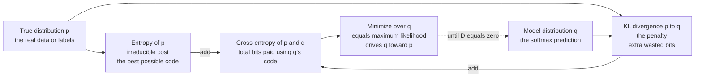

# 📏 Relative Entropy and Cross-Entropy

> [!abstract] TL;DR
> **Relative entropy** (KL divergence) $D(p\|q)$ measures the *extra* bits you waste when you compress data drawn from the true distribution $p$ using a code optimized for a wrong model $q$ — it is the penalty for being wrong, always non-negative, and zero only when $q=p$. **Cross-entropy** $H(p,q)$ is the *total* bill for that mismatched code, and it splits cleanly as $H(p,q)=H(p)+D(p\|q)$: the irreducible entropy plus the KL penalty. Because $H(p)$ is fixed, minimizing cross-entropy loss is exactly minimizing KL from your model to the data — which is maximum likelihood, the reason cross-entropy is *the* loss for classification.

---

## Intuition

**Analogy — the cost of a bad codebook.** Imagine you run a telegraph office and want to send tomorrow's weather using as few dots and dashes as possible. The optimal trick (from [[Entropy_and_Information_Content]]) is to give short codes to common outcomes and long codes to rare ones. If it is sunny 90% of the time, "sunny" gets a 1-bit code and "snow in July" gets a 20-bit code. That optimal code length is the **entropy** $H(p)$ — the irreducible minimum.

Now suppose you *guessed wrong* about the weather. You built your codebook believing rain was common (model $q$), but reality is mostly sunny (true $p$). Every message you send is a little too long, because your short codes went to the wrong outcomes. Averaged over many days, the length you actually pay is the **cross-entropy** $H(p,q)$. The gap between what you pay and the best-possible $H(p)$ — the pure waste caused by trusting a bad model — is the **KL divergence** $D(p\|q)$.

That is the entire story in one line:

$$\underbrace{H(p,q)}_{\text{what you pay}} \;=\; \underbrace{H(p)}_{\text{unavoidable}} \;+\; \underbrace{D(p\|q)}_{\text{penalty for a wrong model}}$$

In machine learning the true distribution $p$ is the labels, the model $q$ is your network's softmax output, and *training is the act of shrinking the penalty* $D(p\|q)$ down toward zero.

---

## How It Works

### The two quantities

**Relative entropy / KL divergence.** For distributions $p$ and $q$ over the same outcomes,

$$D(p\|q) \;=\; \sum_{x} p(x)\,\log\frac{p(x)}{q(x)} \;=\; \mathbb{E}_{x\sim p}\!\left[\log\frac{p(x)}{q(x)}\right].$$

It is the *expected* log-likelihood ratio — how strongly, on average, samples from $p$ argue against the hypothesis that they came from $q$. Read operationally: it is the number of extra nats (or bits, if $\log_2$) per symbol needed to encode $p$ with a code built for $q$.

**Cross-entropy.** The total expected code length under the wrong code:

$$H(p,q) \;=\; -\sum_x p(x)\log q(x) \;=\; \mathbb{E}_{x\sim p}[-\log q(x)].$$

### Three properties that matter

1. **Non-negativity (Gibbs' inequality).** $D(p\|q)\ge 0$, with equality **iff** $p=q$ everywhere. This follows from Jensen's inequality applied to the convex function $-\log$ — see the proof in [[Jensen_and_Inequalities]]. It is what guarantees that cross-entropy loss is *bounded below by the entropy* and cannot be driven lower by cheating.
2. **The decomposition.** $H(p,q)=H(p)+D(p\|q)$. Since $H(p)$ depends only on the fixed labels, $\min_q H(p,q) \iff \min_q D(p\|q)$, achieved uniquely at $q=p$.
3. **It is NOT a metric.** $D(p\|q)\neq D(q\|p)$ in general (asymmetric) and it violates the triangle inequality. "KL distance" is a misnomer; it is a *divergence*, not a distance. If you truly need a symmetric, bounded quantity, use Jensen–Shannon divergence or a Wasserstein distance instead.

### Two directions, two personalities

The asymmetry is not a defect — it encodes a modeling choice.

- **Forward KL** $D(p\|q)$ (data-to-model): the expectation is over the *true* $p$. Wherever $p$ has mass, $q$ must not vanish, or the ratio explodes. Result: $q$ is pushed to **cover all modes** of $p$ — *mass-covering / mean-seeking*. This is what maximum-likelihood training minimizes.
- **Reverse KL** $D(q\|p)$ (model-to-data): the expectation is over $q$. $q$ is punished only where *it* puts mass, so it can safely ignore modes of $p$ and lock onto one. Result: **mode-seeking**. This is the direction used in variational inference and VAEs (see [[Variational_Autoencoders]]), and it is why a VAE posterior can collapse onto a single mode.

### Diagram — cross-entropy = entropy + KL



---

## Key Concepts

### Secondary (intuition-level)

- **Entropy** = the shortest average message length if you *know* the odds.
- **Cross-entropy** = the average length you actually pay when your codebook is built on *guessed* odds.
- **KL divergence** = the wasted length = cross-entropy minus entropy. It can never be negative (you cannot beat the perfect code), and it is zero only when your guess matches reality exactly.
- Lower cross-entropy loss during training means your model's guessed odds are getting closer to the truth.

### Undergraduate (needs probability + a little CS)

- **Definitions.** $D(p\|q)=\sum_x p\log(p/q)$; $H(p,q)=-\sum_x p\log q$; and the identity $H(p,q)=H(p)+D(p\|q)$.
- **Gibbs' inequality.** $D(p\|q)\ge 0$ by Jensen on $-\log$; equality iff $p=q$. This is the mathematical reason a classifier's loss cannot fall below the label entropy.
- **MLE equivalence.** With $N$ i.i.d. samples, the empirical distribution is $\hat p$. Minimizing cross-entropy $H(\hat p, q_\theta)$ over parameters $\theta$ is *identical* to maximizing the average log-likelihood $\frac{1}{N}\sum_i \log q_\theta(x_i)$. Cross-entropy loss **is** negative log-likelihood.
- **The softmax + cross-entropy pairing.** Softmax turns logits $z$ into a distribution $q$; cross-entropy against a one-hot label $y$ collapses to $-\log q_{\text{true}}$. Their gradient is beautifully simple: $\partial\mathcal{L}/\partial z = q - y$. That clean, non-saturating gradient is why this pair, not MSE, is standard for classification (see [[Loss_Functions]], [[Logistic_Regression]]).
- **Not a metric.** Memorize the two failures: asymmetry and no triangle inequality.
- **Perplexity.** For language models, $\text{PPL}=\exp\,H(p,q)$ — the effective number of equally likely choices per token.

### Graduate (system-level)

- **Variational inference and the ELBO.** To approximate an intractable posterior $p(z\mid x)$ with a tractable $q_\phi(z)$, minimize the **reverse** KL $D(q_\phi\|p)$. Since $\log p(x)=\text{ELBO}(\phi)+D(q_\phi\|p(\cdot\mid x))$ and KL $\ge 0$, the ELBO is a rigorous lower bound on the log-evidence; tightening it minimizes the KL gap. This is the engine inside VAEs and [[Bayesian_Statistics]].
- **Mutual information is a KL divergence.** $I(X;Y)=D\big(p(x,y)\,\|\,p(x)p(y)\big)$ — the divergence between the joint and the product of marginals, quantifying dependence (see [[Joint_Conditional_Entropy_and_Mutual_Information]]).
- **Information geometry / Bregman view.** KL is the **Bregman divergence** generated by the negative-entropy convex function. Locally, $D(p\|p+d p)\approx \tfrac12\, dp^\top F\, dp$ where $F$ is the Fisher information matrix — KL is the squared statistical distance to second order, linking it to natural gradient and the convex-conjugate machinery of [[Duality_Theory]].
- **f-divergences.** KL is one member of the family $D_f(p\|q)=\sum_x q(x)\,f\!\big(p(x)/q(x)\big)$ with $f(t)=t\log t$. Others (total variation, $\chi^2$, Hellinger, Jensen–Shannon) trade off different sensitivities; GAN training and domain adaptation exploit this family.
- **Maximum entropy principle (Jaynes).** Given only moment constraints, pick the distribution of **maximum entropy** — equivalently the one of **minimum KL from the uniform (or a chosen prior)**. This is the least-committal choice consistent with what you know, and it yields the exponential family (Gaussian from mean+variance, Boltzmann from energy).
- **Hypothesis testing.** In Stein's lemma, the exponent of the type-II error in distinguishing $p$ from $q$ is exactly $D(p\|q)$; Chernoff information governs the symmetric Bayesian error exponent. KL is the *operational* notion of statistical distinguishability.
- **Estimation instability.** From finite samples KL estimators are high-variance and biased in high dimensions, and $D(p\|q)=\infty$ the instant $q$ assigns zero mass where $p$ does not. Clipping, smoothing, or a bounded surrogate (JS, MMD) is often required.

---

## Python Demo

```python
# numpy + matplotlib only.
# Goal: show that cross-entropy H(p,q) is minimized (and equals the
# entropy H(p)) exactly when the model q matches the true p, so that
# minimizing cross-entropy loss drives the model toward the truth.
# Also demonstrate that KL is asymmetric: D(p||q) != D(q||p).

import numpy as np
import matplotlib.pyplot as plt

def entropy(p, eps=1e-12):
    p = np.asarray(p, float)
    return -np.sum(p * np.log(p + eps))

def cross_entropy(p, q, eps=1e-12):
    p, q = np.asarray(p, float), np.asarray(q, float)
    return -np.sum(p * np.log(q + eps))

def kl(p, q, eps=1e-12):
    p, q = np.asarray(p, float), np.asarray(q, float)
    return np.sum(p * np.log((p + eps) / (q + eps)))

# --- True Bernoulli distribution: P(class 1) = 0.7 ---------------------------
p1 = 0.7
p  = np.array([p1, 1 - p1])
H_p = entropy(p)

# --- Model q = [theta, 1 - theta] as theta sweeps (0, 1) ---------------------
thetas = np.linspace(0.001, 0.999, 500)
CE = np.array([cross_entropy(p, [t, 1 - t]) for t in thetas])
KL = np.array([kl(p,           [t, 1 - t]) for t in thetas])

theta_star = thetas[np.argmin(CE)]
print(f"Entropy   H(p)        = {H_p:.4f} nats  (irreducible floor)")
print(f"Min cross-entropy     = {CE.min():.4f} nats at theta = {theta_star:.3f}")
print(f"KL at that minimum    = {KL.min():.6f}   -> q has reached p")
print(f"Identity check H(p,q) = H(p) + D(p||q): "
      f"{cross_entropy(p,[0.4,0.6]):.4f} == "
      f"{H_p + kl(p,[0.4,0.6]):.4f}")

# --- Asymmetry of KL: two distinct 3-outcome distributions -------------------
a = np.array([0.10, 0.30, 0.60])
b = np.array([0.50, 0.30, 0.20])
print(f"\nD(a||b) = {kl(a, b):.4f} nats")
print(f"D(b||a) = {kl(b, a):.4f} nats   <- not equal: KL is asymmetric")

# --- Plots -------------------------------------------------------------------
fig, (ax1, ax2) = plt.subplots(1, 2, figsize=(11, 4.2))

ax1.plot(thetas, CE, lw=2, label="Cross-entropy  H(p, q)")
ax1.plot(thetas, KL, lw=2, label="KL divergence  D(p||q)")
ax1.axhline(H_p, ls="--", color="gray",
            label=f"Entropy  H(p) = {H_p:.2f}")
ax1.axvline(p1, ls=":", color="red",
            label=f"q = p at theta = {p1}")
ax1.set_xlabel("model parameter theta   (q = [theta, 1 - theta])")
ax1.set_ylabel("nats")
ax1.set_title("CE bottoms out at H(p), exactly where q = p")
ax1.legend(fontsize=8)

ax2.bar(["D(a||b)", "D(b||a)"], [kl(a, b), kl(b, a)],
        color=["steelblue", "indianred"])
ax2.set_ylabel("nats")
ax2.set_title("KL is asymmetric:  D(a||b) != D(b||a)")

plt.tight_layout()
plt.savefig("kl_cross_entropy.png", dpi=120)
plt.show()
```

**What the output shows.** The cross-entropy curve dips to a minimum that *coincides with the dashed entropy line* $H(p)$, and that minimum sits exactly at $\theta=0.7$ where the KL curve simultaneously touches zero. Because $H(p,q)=H(p)+D(p\|q)$, the model cannot do better than the label entropy, and it reaches that floor only by becoming the truth. The right panel confirms $D(a\|b)\neq D(b\|a)$ — swapping the arguments changes the number, so KL is a directed divergence, never a symmetric distance.

---

## Real-World Applications

> **Every classifier and every LLM.** Softmax + cross-entropy is *the* training objective. An ImageNet CNN or a GPT-style language model minimizes $-\log q(\text{correct class or next token})$ per example — literally negative log-likelihood, i.e. minimizing $D(p\|q)$ from model to data. Language models are then scored by **perplexity** $=\exp(\text{cross-entropy})$, the effective branching factor per token.

> **Variational autoencoders and Bayesian inference.** The VAE loss is reconstruction error **plus** $\beta\,D\big(q_\phi(z\mid x)\,\|\,p(z)\big)$: a reverse-KL term that pins the learned latent posterior to a standard-Gaussian prior, keeping the latent space smooth and sampleable. The same reverse-KL-as-regularizer idea underlies all mean-field variational inference and the ELBO.

> **RLHF and DPO alignment.** When fine-tuning an LLM with human feedback, the objective adds a **KL penalty** $\beta\,D(\pi_\theta\|\pi_{\text{ref}})$ that keeps the updated policy close to the original reference model, preventing reward-hacking and catastrophic drift. See [[RLHF]] — Direct Preference Optimization ([[DPO]]) reparameterizes exactly this KL-constrained objective in closed form.

> **Knowledge distillation.** A small "student" network is trained to match a large "teacher's" softened output distribution by minimizing KL divergence to the teacher's soft labels — transferring the teacher's dark knowledge (its relative confidences across classes), which one-hot hard labels throw away.

> **Anomaly detection and coding.** Because $D(p\|q)$ is the operational cost of using the wrong code, monitoring the cross-entropy of live traffic against a baseline model flags distribution shift; in hypothesis testing, Stein's lemma makes $D(p\|q)$ the error exponent that sets how many samples you need to tell two sources apart.

---

## Common Pitfalls

- **Support mismatch / log(0) blow-up.** $D(p\|q)=\infty$ the moment $q(x)=0$ where $p(x)>0$. Empirical estimates then spike or NaN. Fix with additive smoothing, an $\epsilon$ floor, or a bounded surrogate (Jensen–Shannon, MMD). Never estimate KL naively from sparse histograms in high dimensions — it is badly biased.
- **Choosing the wrong KL direction.** Forward KL $D(p\|q)$ is mass-covering; reverse KL $D(q\|p)$ is mode-seeking. Using reverse KL in a variational model is *why* it can collapse to one mode of a multimodal target. Match the direction to the behavior you want, not by accident.
- **Treating KL as a distance.** It is asymmetric and breaks the triangle inequality. Do not average $D(p\|q)$ and $D(q\|p)$ hoping for a metric; use JS divergence or Wasserstein if a true metric is required (e.g., comparing generative models).
- **Feeding probabilities to a cross-entropy loss that expects logits.** Frameworks like PyTorch's `CrossEntropyLoss` apply log-softmax internally; passing already-softmaxed probabilities double-applies it and silently corrupts gradients. Know whether your loss wants logits or log-probs.
- **Confusing entropy with cross-entropy.** $H(p)$ is a fixed property of the true labels — it is the *floor* your loss approaches, not something you optimize. $H(p,q)$ is what you minimize. If your training loss sits stubbornly above zero, that residual is often just $H(p)$ from label noise, not a bug.
- **Mixing bits and nats.** $\log_2$ gives bits, $\ln$ gives nats ($1$ nat $\approx 1.44$ bits). Perplexity, cross-entropy, and KL numbers are only comparable under the same base.

---

## Related Concepts

*Section siblings (Information Theory / Foundations):*
- [[Entropy_and_Information_Content]] — the entropy $H(p)$ is the irreducible term that cross-entropy decomposes into; KL is what sits on top of it.
- [[Joint_Conditional_Entropy_and_Mutual_Information]] — mutual information $I(X;Y)=D\big(p(x,y)\|p(x)p(y)\big)$ is itself a KL divergence.
- [[Information_Theory_Overview]] — where relative entropy fits in the wider map of source coding, channels, and inference.

*Cross-vault connections (verified):*
- [[Information_Theory]] — the AI-ML companion note tying entropy, cross-entropy, and KL to ML losses.
- [[Loss_Functions]] — cross-entropy loss in practice: BCE, categorical CE, label smoothing, focal loss.
- [[Logistic_Regression]] — binary cross-entropy is the negative log-likelihood of a Bernoulli; minimizing it is MLE.
- [[Variational_Autoencoders]] — the ELBO uses reverse KL $D(q\|p)$ as its latent-space regularizer.
- [[RLHF]] and [[DPO]] — a KL penalty keeps the aligned policy anchored to the reference model.
- [[Jensen_and_Inequalities]] — Gibbs' inequality $D(p\|q)\ge 0$ is proved via Jensen on $-\log$.
- [[Duality_Theory]] — the information-geometry view: KL as a Bregman divergence from negative entropy.
- [[Bayesian_Statistics]] — variational inference approximates intractable posteriors by minimizing KL.

---

## Review Questions

1. **(Secondary)** In one sentence each, explain what entropy, cross-entropy, and KL divergence measure using the "telegraph codebook" picture. Why can KL divergence never be negative?
2. **(Undergraduate)** Show explicitly that minimizing the cross-entropy $H(\hat p, q_\theta)$ between the empirical label distribution and a model is the same as maximum-likelihood estimation. Then, using $H(p,q)=H(p)+D(p\|q)$, argue why the training loss cannot drop below the label entropy $H(p)$.
3. **(Graduate)** A variational autoencoder minimizes the **reverse** KL $D(q_\phi\|p)$ while maximum-likelihood training minimizes the **forward** KL $D(p\|q_\theta)$. For a bimodal target distribution, describe the qualitatively different failure mode each direction produces (mode-seeking vs. mass-covering), and explain which you would prefer for (a) a generative sampler and (b) a well-calibrated density estimator.

---

## Sources

- Kullback, S. & Leibler, R. A. (1951). *On Information and Sufficiency.* Annals of Mathematical Statistics, 22(1), 79–86. (original definition of relative entropy)
- Cover, T. M. & Thomas, J. A. (2006). *Elements of Information Theory* (2nd ed.), Ch. 2 (relative entropy, mutual information) and Ch. 11 (information theory and statistics).
- MacKay, D. J. C. (2003). *Information Theory, Inference, and Learning Algorithms.* Cambridge University Press.
- Goodfellow, I., Bengio, Y. & Courville, A. (2016). *Deep Learning*, Section 3.13 (information theory) and Ch. 19 (variational inference). MIT Press.
- Bishop, C. M. (2006). *Pattern Recognition and Machine Learning*, Section 1.6 (information theory) and Ch. 10 (variational methods). Springer.

---

#information-theory #kl-divergence #cross-entropy #relative-entropy #machine-learning
