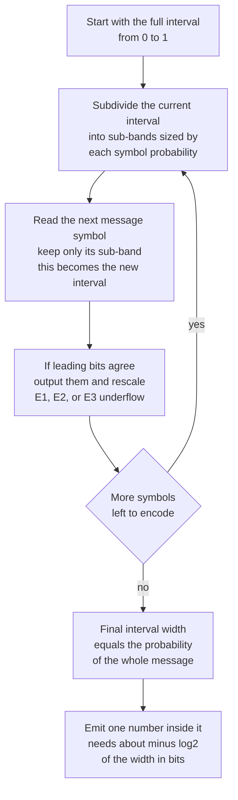

# 🔢 Arithmetic and Range Coding

> [!abstract] TL;DR
> **Arithmetic coding** encodes an *entire message* as a single high-precision number — a point in the interval $[0,1)$. Starting from $[0,1)$, each successive symbol narrows the interval to one of its sub-intervals, sized in proportion to the symbol's probability. The final interval's **width equals the probability of the whole message**, so the number of bits needed to name a point inside it is $-\log_2 P(\text{message})$ — *exactly* the message's information content. This escapes Huffman's rigid "at least one whole bit per symbol" rule, letting a symbol of probability $0.9$ cost only $\approx 0.15$ bits instead of a full bit. Because it turns *any* probability model into near-optimal bits, arithmetic coding cleanly **separates modeling from coding**, making it the entropy backend of context-modeling compressors, JPEG2000, and H.264/H.265 **CABAC**. **Range coding** is its integer/byte-oriented twin, and **Asymmetric Numeral Systems (ANS)** is the modern successor that keeps the compression ratio while running at Huffman-like speeds (Zstandard, LZFSE, JPEG XL).

---

## Intuition

**Analogy — narrowing down a spot on a ruler.** Imagine a ruler marked from $0$ to $1$. You and a friend agree in advance how to slice it: the most common symbol gets the biggest slice, rare symbols get slivers. To send a message, you *don't* transmit symbol by symbol. Instead you repeatedly **zoom in**: the first symbol tells you which slice of the ruler to keep; you then re-slice *that* slice by the same proportions and the next symbol picks a sub-slice; and so on. After the whole message, you are left with one tiny sub-sub-…-slice. You transmit a **single number** that falls inside it. Your friend, re-slicing the ruler with the same agreed proportions, watches which slice your number lands in at each level and thereby replays your exact message.

The magic is in the arithmetic of widths. A likely symbol barely shrinks the interval, so it costs almost nothing; an unlikely symbol shrinks it a lot, so it costs more. The final width is the *product* of all the slice fractions — which is precisely the probability of that message — and a number needs about $-\log_2(\text{width})$ bits of precision to pin down. Where [[Huffman_Coding]] must round every symbol up to a whole number of bits, arithmetic coding spends **fractional bits per symbol**, hitting the theoretical [[Entropy_and_Information_Content|entropy]] floor almost exactly.

---

## How It Works

### Core mechanics — narrowing the interval

Fix a model that assigns probability $p(s)$ to each symbol $s$, and lay the symbols out on $[0,1)$ using the **cumulative distribution**: symbol $s$ owns the sub-interval $[\,C(s),\ C(s)+p(s)\,)$ where $C(s)$ is the total probability of all symbols before it. Maintain a current interval $[\text{low}, \text{high})$, initialised to $[0,1)$. For each symbol $x$ of the message:

1. Let $\text{span} = \text{high} - \text{low}$.
2. $\text{high} \leftarrow \text{low} + \text{span}\cdot\big(C(x)+p(x)\big)$.
3. $\text{low} \phantom{h} \leftarrow \text{low} + \text{span}\cdot C(x)$.

After the last symbol, transmit **any** number in $[\text{low}, \text{high})$ (the midpoint, or the shortest binary fraction inside — see below). To **decode**, the receiver replays the same process: at each step it asks *which symbol's sub-interval currently contains the transmitted number*, emits that symbol, and narrows its own interval identically.

### The central identity — width is the message probability

Because each step multiplies the span by the chosen symbol's probability, after $n$ symbols the interval width is

$$W = \prod_{i=1}^{n} p(x_i) = P(x_1 x_2 \dots x_n).$$

Naming a point to within a window of width $W$ takes about $-\log_2 W$ bits, so the code length is

$$L = -\log_2 P(\text{message}) = \sum_{i=1}^{n} \big(-\log_2 p(x_i)\big) = \sum_{i=1}^{n} I(x_i).$$

That is the **sum of the symbols' self-informations** — the message's total information content. The only overhead is a small constant (at most $\approx 2$ bits) to specify a terminating number, spread over the *whole* message. Compare that with Huffman, whose rounding costs **up to 1 extra bit per symbol**.

### Why it beats Huffman

Huffman assigns each symbol an integer number of bits, so it can never spend fewer than **1 bit** on a symbol, no matter how likely. Consider a symbol with $p = 0.9$: its true information content is $-\log_2 0.9 \approx 0.152$ bits, yet Huffman must pay a whole bit — nearly a $7\times$ overhead on that symbol. Arithmetic coding charges the honest $0.152$ bits. The gap is largest exactly where it hurts most:

- **Highly skewed distributions** (one dominant symbol), where the frequent symbol's ideal cost is a small fraction of a bit.
- **Small alphabets**, especially the **binary** case, where Huffman is stuck at 1 bit per symbol and can encode *nothing* below that — the regime of bit-plane and binary-model coders like CABAC.

Huffman only ties arithmetic coding when every probability happens to be a power of $\tfrac{1}{2}$ (so integer bits are already optimal).

### Finite precision and renormalization

Real machines cannot hold an interval that shrinks toward zero forever. The fix is **renormalization**: as soon as the leading bits of `low` and `high` agree, that bit is settled — output it and **rescale** the interval by doubling, keeping only the still-undecided low-order part. The three canonical rescaling cases (for a $[0,1)$ interval with midpoint $\tfrac12$):

- **E1 — interval sits entirely in the lower half** $[0,\tfrac12)$: the next bit is `0`. Output `0`, then map $[\text{low},\text{high}) \to [2\,\text{low},\ 2\,\text{high})$.
- **E2 — interval sits entirely in the upper half** $[\tfrac12,1)$: the next bit is `1`. Output `1`, then map $[\text{low},\text{high}) \to [2(\text{low}-\tfrac12),\ 2(\text{high}-\tfrac12))$.
- **E3 — the "straddle"/underflow case**, interval inside $[\tfrac14,\tfrac34)$ around the midpoint: no bit can be settled yet. Increment an **underflow counter**, rescale about the midpoint $[\text{low},\text{high}) \to [2(\text{low}-\tfrac14),\ 2(\text{high}-\tfrac14))$, and remember to emit the *complement* bits later. This is the **carry handling** that prevents precision loss.

When the next real bit is finally output, you flush the pending underflow bits as its complement. Done correctly, this yields exact, incremental output using only fixed-width integer registers.

### Range coding — the practical integer variant

**Range coding** is arithmetic coding reworked around an integer `[low, range)` register and **byte-wise** (rather than bit-wise) renormalization: it emits a whole byte whenever the top byte of `low` and `low + range` agree. Mathematically identical to arithmetic coding, it is faster, sidesteps some historical patents, and is the form found in most real codecs. The residual differences are engineering (carry propagation, when to renormalize), not information-theoretic.

### Separation of modeling and coding

The single most important architectural idea: **arithmetic/range coding is a perfect "coder" that converts any stream of probabilities into near-optimal bits.** The *model* — which supplies $p(x_i)$ at each step — is a completely separate concern. Swap in a better model and you compress better, with the coder untouched. This is why arithmetic coding is the entropy backend of the strongest compressors (PPM, context-mixing PAQ/CM) and of video's **CABAC**, all of which pour their effort into *predicting the next symbol* and let the coder cash in the prediction.

### Adaptive arithmetic coding — compression is prediction

The model need not be fixed. In **adaptive** arithmetic coding, both encoder and decoder update the symbol probabilities *as they go*, using only past (already-decoded) symbols — so they stay in sync with no side information. The better the running prediction, the narrower each correct symbol's interval, the fewer bits spent. This is the formal statement that **compression = prediction**: a model that assigns higher probability to what actually comes next produces shorter codes. It is the exact bridge to modern machine learning — a [[Language_Model_Basics|language model]] *is* a next-symbol probability model, and coupling it to an arithmetic coder turns "predict the next token well" into "compress the text well." See [[Information_Theory|cross-entropy]]: the expected arithmetic code length of data drawn from $P$ but coded with model $Q$ is exactly the cross-entropy $H(P,Q)$.

### Flow / architecture



---

## Key Concepts

### Secondary (intuitive level)
- The whole message becomes **one number** on a ruler from $0$ to $1$; each symbol zooms into a slice sized by how common that symbol is.
- Common symbols barely shrink the interval, so they are **cheap**; rare symbols shrink it a lot, so they cost more.
- Unlike a code that spends a fixed whole bit per symbol, this spends **fractional bits**, so it can be smaller.

### Undergraduate (working level)
- **Interval update:** with cumulative probability $C(x)$, do $\text{high}\leftarrow\text{low}+\text{span}\cdot(C(x)+p(x))$ and $\text{low}\leftarrow\text{low}+\text{span}\cdot C(x)$.
- **Code length:** final width $W=\prod p(x_i)=P(\text{message})$, so $L=-\log_2 P(\text{message})=\sum I(x_i)$ — the message's information content, within $\approx 2$ bits total overhead.
- **Versus Huffman:** Huffman rounds each symbol to an integer bit count ($\le 1$ bit of waste per symbol); arithmetic coding wastes essentially nothing, and the two coincide only when all probabilities are powers of $\tfrac12$.
- **Finite precision:** incremental output with **E1/E2/E3 renormalization** and an underflow counter for the straddle case; **range coding** is the byte-oriented integer variant.
- **Adaptive coding:** update the model from past symbols so encoder and decoder stay synced with no side channel.

### Graduate (theoretical level)
- **Optimality:** for an i.i.d. or well-modeled source, per-symbol redundancy $\to 0$ as message length grows; total overhead is $O(1)$, versus Huffman's $\Theta(n)$ worst-case redundancy (up to $1$ bit each). It attains the [[Entropy_and_Information_Content|Shannon]] bound in the limit.
- **Modeling/coding separation:** the coder realizes the cross-entropy $H(P,Q)=-\sum P\log_2 Q$ as an achievable expected code length; all remaining gains live entirely in the model $Q$. This is the theoretical foundation of PPM and context-mixing (PAQ/CM) compressors.
- **CABAC:** H.264/H.265 binarize syntax elements and drive a **context-adaptive binary arithmetic coder**, choosing among hundreds of adaptive contexts — the binary alphabet is precisely where Huffman is helpless.
- **ANS (Asymmetric Numeral Systems, Duda 2009):** encodes state transitions on a single natural number so that the state's bit-length grows by $\approx -\log_2 p(s)$ per symbol, achieving arithmetic-coding compression with table-driven, branch-light speed; deployed as **tANS/FSE** in Zstandard and LZFSE and as an entropy stage in JPEG XL.
- **Carry propagation** and finite-precision bias are the subtle correctness pitfalls; a mismatch of even one ulp between encoder and decoder desynchronizes the stream irrecoverably.

---

## Python Demo

```python
# Arithmetic coding from first principles on a skewed 3-symbol source.
# Demonstrates: (1) narrowing [low, high) by cumulative probabilities,
#               (2) emitting ONE number inside the final interval,
#               (3) decoding it back exactly,
#               (4) code length = -log2(final width) = -log2 P(message),
#                   which matches the entropy and BEATS Huffman on skew,
#               (5) a visual of the shrinking interval and the [0,1) partition.
import numpy as np
import matplotlib.pyplot as plt

# --- Model: one dominant symbol (heavy skew) -----------------------
symbols = ["a", "b", "c"]
probs   = {"a": 0.90, "b": 0.08, "c": 0.02}

def cumulative(probs, symbols):
    """Assign each symbol a [low, high) sub-band of [0,1) via the CDF."""
    lo, table = 0.0, {}
    for s in symbols:
        table[s] = (lo, lo + probs[s])   # symbol s owns [lo, lo+p(s))
        lo += probs[s]
    return table

cdf = cumulative(probs, symbols)

# --- Encoder: narrow [low, high) over the whole message ------------
def encode(message, cdf):
    low, high = 0.0, 1.0
    history = [(low, high)]
    for s in message:
        span = high - low
        s_low, s_high = cdf[s]
        high = low + span * s_high
        low  = low + span * s_low
        history.append((low, high))
    code = (low + high) / 2.0            # any point in [low, high) works
    return code, low, high, history

# --- Decoder: replay the same narrowing to recover the symbols -----
def decode(code, cdf, length):
    out, low, high = [], 0.0, 1.0
    for _ in range(length):
        span  = high - low
        value = (code - low) / span      # where does the code sit now?
        for s, (s_low, s_high) in cdf.items():
            if s_low <= value < s_high:
                out.append(s)
                high = low + span * s_high
                low  = low + span * s_low
                break
    return "".join(out)

message = "aaaaaaaaba"                    # 9x 'a', 1x 'b' -- very skewed
code, low, high, history = encode(message, cdf)
decoded = decode(code, cdf, len(message))

# --- Bit accounting ------------------------------------------------
width         = high - low
bits_arith    = -np.log2(width)                       # = -log2 P(message)
bits_entropy  = sum(-np.log2(probs[s]) for s in message)  # info content
# Optimal Huffman lengths for p=[0.90,0.08,0.02]: a->1 bit, b->2, c->2.
huff_len      = {"a": 1, "b": 2, "c": 2}
bits_huffman  = sum(huff_len[s] for s in message)
src_entropy   = -sum(p * np.log2(p) for p in probs.values())  # bits/symbol

print(f"message            : {message}")
print(f"encoded number     : {code:.12f}")
print(f"decoded message    : {decoded}   match = {decoded == message}")
print(f"final interval     : [{low:.4e}, {high:.4e})  width = {width:.4e}")
print("-" * 48)
print(f"arithmetic  bits   : {bits_arith:6.3f}")
print(f"entropy     bits   : {bits_entropy:6.3f}   (message info content)")
print(f"Huffman     bits   : {bits_huffman:6.3f}   (integer bits/symbol)")
print("-" * 48)
print(f"arithmetic /symbol : {bits_arith/len(message):.3f} bits")
print(f"Huffman    /symbol : {bits_huffman/len(message):.3f} bits")
print(f"source entropy     : {src_entropy:.3f} bits/symbol (theoretical floor)")

# --- Visualize: interval funnel + the model partition of [0,1) -----
fig, ax = plt.subplots(1, 2, figsize=(12, 4.5))

steps = np.arange(len(history))
lows  = np.array([h[0] for h in history])
highs = np.array([h[1] for h in history])
ax[0].fill_between(steps, lows, highs, color="#93c5fd", alpha=0.7,
                   label="current interval [low, high)")
ax[0].plot(steps, lows,  color="#1d4ed8", lw=1)
ax[0].plot(steps, highs, color="#1d4ed8", lw=1)
ax[0].axhline(code, color="red", ls="--", lw=1, label=f"code = {code:.4f}")
ax[0].set_title("Interval narrows as each symbol arrives")
ax[0].set_xlabel("symbols processed")
ax[0].set_ylabel("position in [0, 1)")
ax[0].set_xticks(steps)
ax[0].set_xticklabels(["start"] + list(message))
ax[0].legend(loc="upper right", fontsize=8)

colors = {"a": "#22c55e", "b": "#f59e0b", "c": "#ef4444"}
for s in symbols:
    lo, hi = cdf[s]
    ax[1].barh(0, hi - lo, left=lo, color=colors[s], edgecolor="white")
    ax[1].text((lo + hi) / 2, 0, f"{s}\n{probs[s]:.2f}",
               ha="center", va="center", fontsize=9)
ax[1].set_title("Model partitions [0, 1) by probability (the CDF)")
ax[1].set_xlabel("position in [0, 1)")
ax[1].set_yticks([])
ax[1].set_xlim(0, 1)

plt.tight_layout()
plt.show()

# Expected output (values rounded):
# decoded message    : aaaaaaaaba   match = True
# final interval width ~ 3.10e-02
# arithmetic  bits   :  5.012
# entropy     bits   :  5.012   (message info content -- IDENTICAL)
# Huffman     bits   : 11.000   (forced to >= 1 bit per symbol)
# arithmetic /symbol :  0.501 bits   vs   Huffman /symbol : 1.100 bits
# source entropy     :  0.541 bits/symbol
```

The punchline is in the numbers: on this skewed message arithmetic coding spends **5.01 bits — exactly the message's information content — with no per-symbol rounding**, while Huffman is forced to **11 bits** because it must pay a whole bit for each near-certain `a` whose honest cost is only $-\log_2 0.9 \approx 0.15$ bits. The decoded string matches the original bit-for-bit.

---

## Real-World Applications

- **H.264/AVC and H.265/HEVC video — CABAC.** Context-Adaptive Binary Arithmetic Coding is the higher-efficiency entropy backend of modern video: syntax elements are binarized and coded with adaptive binary contexts, typically **10–20% smaller** than the alternative table-based mode. The binary alphabet is exactly where Huffman cannot compete.
- **JPEG2000 and JBIG2.** Wavelet coefficient bit-planes are entropy-coded with the MQ arithmetic coder; JBIG2 uses arithmetic coding for bi-level (fax/scan) images.
- **Zstandard, LZFSE, JPEG XL — ANS.** The modern **Asymmetric Numeral Systems** entropy stage (tANS/FSE) delivers arithmetic-coding compression at Huffman-like decode speed; it is the reason Zstd matches or beats older coders while staying fast enough for real-time use.
- **Top-tier context-modeling compressors (PPM, PAQ/CM).** These win benchmark leaderboards by pairing sophisticated next-symbol *models* with an arithmetic coder — the clean modeling/coding split in action.
- **Neural / LLM-based compression.** Coupling a strong sequence model with an arithmetic coder gives state-of-the-art lossless text compression (e.g. cmix, and LLM-driven schemes), the literal realization of "compression = prediction." See [[Scaling_Laws|scaling laws]], which are frequently phrased in bits-per-byte.

---

## Common Pitfalls

- **Naive infinite-precision floats.** The textbook `[low, high)` narrowing over a long message underflows the mantissa and desynchronizes decoding. Real coders must use **integer registers with renormalization** (E1/E2/E3) — the float version in the demo is illustrative only and works because the message is short.
- **Botched carry / underflow (E3) handling.** Forgetting the straddle case, or mishandling carry propagation when a low-order increment ripples upward, corrupts the stream. A single off-by-one-ulp mismatch between encoder and decoder is unrecoverable.
- **No end-of-message signal.** Since the output is one number, the decoder needs to know *when to stop*: either transmit the length or reserve an explicit **end-of-stream symbol** with tiny probability. Omit it and decoding runs off the end.
- **Model/coder desync in adaptive mode.** The decoder must update its probabilities using *only* already-decoded symbols, in the exact same order as the encoder. Updating from the current (not-yet-known) symbol, or in a different order, breaks synchronization.
- **Zero-probability symbols.** If the model ever assigns $p=0$ to a symbol that then occurs, its interval has zero width and it cannot be coded. Use smoothing (e.g. add-one / escape mechanisms) so every possible symbol keeps a nonzero slice.
- **Expecting gains on power-of-two distributions.** When all probabilities are $\tfrac{1}{2},\tfrac{1}{4},\dots$, Huffman is already optimal and arithmetic coding buys you nothing but overhead — the payoff is on *skewed*, *small-alphabet*, or *non-dyadic* distributions.

---

## Related Concepts

- [[Huffman_Coding]] — the integer-bit predecessor; arithmetic coding removes its up-to-1-bit-per-symbol penalty and matches it only when all probabilities are powers of $\tfrac12$.
- [[Entropy_and_Information_Content]] — arithmetic coding's cost is $-\log_2 P(\text{message})=\sum I(x_i)$, so it reaches the Shannon entropy floor that entropy defines.
- [[Information_Theory]] — the expected arithmetic code length of data from $P$ coded with model $Q$ is exactly the **cross-entropy** $H(P,Q)$; KL divergence is the resulting redundancy.
- [[Language_Model_Basics]] — a language model is a next-symbol probability model; wiring it to an arithmetic coder is the concrete meaning of "compression = prediction," and better models compress better.
- [[Scaling_Laws]] — often expressed in bits-per-byte / compression terms, capturing how a better predictor becomes a better compressor as models scale.

---

## Review Questions

**Tier 1 — Conceptual (explain to a peer):**
1. Using the ruler-and-slices analogy, explain why a *common* symbol makes a message cheaper to encode while a *rare* symbol makes it more expensive. Tie your answer to what happens to the interval width.
2. Why can Huffman never spend fewer than one bit on a symbol, and why does that make it a poor fit for a source where one symbol has probability $0.95$? What does arithmetic coding do instead?

**Tier 2 — Applied (compute / reason):**
3. A model has $p(\text{a})=0.5,\ p(\text{b})=0.25,\ p(\text{c})=0.25$. Encode the message `ab` by hand: give the final $[\text{low},\text{high})$ interval and the code length in bits. In this special case, does arithmetic coding beat Huffman? Explain why or why not.
4. Explain each of the E1, E2, and E3 renormalization cases: what condition triggers it, what (if anything) is output, and how the interval is rescaled. Why is a pending-bit counter needed for E3?

**Tier 3 — Theoretical (deep understanding):**
5. Show that for a message of $n$ symbols the total arithmetic-coding overhead above the ideal $-\log_2 P(\text{message})$ is $O(1)$, whereas Huffman's redundancy can grow as $\Theta(n)$. What does this imply about their asymptotic per-symbol rates?
6. Explain precisely why arithmetic coding realizes the cross-entropy $H(P,Q)$ as an achievable expected code length, and how this justifies the claim that "all remaining compression gains live in the model." Then describe how ANS attains the same rate while avoiding per-symbol arithmetic.

---

## Sources

- Witten, I. H., Neal, R. M., & Cleary, J. G. (1987). *Arithmetic Coding for Data Compression.* Communications of the ACM, 30(6), 520–540. [PDF](https://web.stanford.edu/class/ee398a/handouts/papers/WittenACM87ArithmCoding.pdf)
- Cover, T. M. & Thomas, J. A. (2006). *Elements of Information Theory* (2nd ed.). Wiley. §5.9–5.10 (arithmetic coding and the Shannon–Fano–Elias code).
- MacKay, D. J. C. (2003). *Information Theory, Inference, and Learning Algorithms.* Cambridge University Press. Chapter 6, "Stream Codes" (arithmetic coding and its link to prediction). [Free online](https://www.inference.org.uk/mackay/itila/)
- Duda, J. (2013). *Asymmetric numeral systems: entropy coding combining speed of Huffman coding with compression rate of arithmetic coding.* arXiv:1311.2540. [arXiv](https://arxiv.org/abs/1311.2540)
- Marpe, D., Schwarz, H., & Wiegand, T. (2003). *Context-Based Adaptive Binary Arithmetic Coding in the H.264/AVC Video Compression Standard.* IEEE Transactions on Circuits and Systems for Video Technology, 13(7), 620–636. [PDF](https://iphome.hhi.de/marpe/download/csvt03_cabac.pdf)

---

#information-theory #arithmetic-coding #range-coding #compression #entropy-coding
