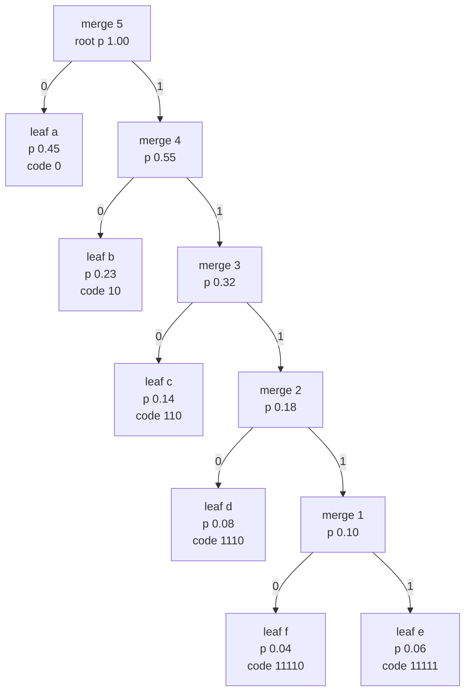

# 🗜️ Huffman Coding

> [!abstract] TL;DR
> **Huffman coding** (David Huffman, 1952) is the provably *optimal* symbol-by-symbol **prefix code**: it assigns the shortest codewords to the most frequent symbols. It is built by a **greedy** rule — repeatedly merge the two lowest-probability nodes into a parent until a single root remains — and reading the root-to-leaf path (0 for left, 1 for right) gives each symbol's codeword. Its average length $L$ satisfies $H(X) \le L < H(X) + 1$, hitting the entropy $H$ *exactly* when every probability is a negative power of two. It runs in $O(n\log n)$ with a min-heap and is the entropy-coding backend of DEFLATE / ZIP / gzip / PNG, JPEG, and MP3.

---

## Intuition

**Analogy — Morse code, done optimally.** In Morse code the letter **E** — the most common letter in English — is a single dot, while a rare letter like **Q** is four long symbols. That is the whole idea of a variable-length code: *spend few bits on what happens often, spend many bits on what happens rarely.* Samuel Morse chose his lengths by hand, by eyeballing how many pieces of type a printer kept in each bin. Huffman's contribution was to find the **provably shortest-on-average** such assignment, mechanically, for *any* set of symbol frequencies.

The trick that makes it optimal is a piece of upside-down thinking. Instead of asking "which symbol deserves the shortest code?", Huffman asks "which two symbols are so rare that they should sit at the very *bottom* of the tree?" — the two least-frequent symbols. He merges them into a single imaginary "super-symbol" whose probability is their sum, then repeats. Building the tree **bottom-up from the rarest symbols** guarantees the frequent ones float to the top and get the short codes for free.

---

## How It Works

### 1. Setup — a code is a binary tree

Any **prefix code** (no codeword is a prefix of another, so decoding never needs look-ahead) corresponds to a binary tree in which every symbol is a **leaf**. The codeword for a symbol is the sequence of edge labels from the root to its leaf: `0` for a left edge, `1` for a right edge. Because symbols live only at leaves, no codeword can be a prefix of another — the tree *structurally enforces* the prefix property. The depth of a leaf is its codeword length, so the average code length is

$$L = \sum_{i} p_i \, \ell_i = \sum_i p_i \, \text{depth}(i).$$

Huffman's goal is to build the leaf-tree that **minimizes $L$**.

### 2. The greedy construction

1. Create one leaf node per symbol, each holding its probability (or raw frequency). Put them all in a **min-priority-queue** keyed by probability.
2. While more than one node remains:
   - **Pop** the two nodes with the *lowest* probability, call them `lo` and `hi`.
   - Create a new **internal node** whose probability is `lo.prob + hi.prob`, with `lo` and `hi` as its two children.
   - **Push** the new internal node back into the queue.
3. The last remaining node is the **root**. Walk it (left = `0`, right = `1`) to read off every codeword.

Each internal node is literally a *merge event*; the tree records the entire greedy history. With $n$ symbols there are exactly $n-1$ merges, and a binary heap makes each merge $O(\log n)$, for **$O(n\log n)$** total.

### 3. Why it is optimal — the exchange argument

Two lemmas, combined by induction, prove no prefix code beats Huffman:

- **Sibling lemma.** In *some* optimal tree the two least-frequent symbols are siblings at the *maximum* depth. Suppose an optimal tree put a more-frequent symbol deeper than one of the two rarest. Swapping them cannot increase $L$: moving a *small* probability to a deeper (longer) code and a *large* probability to a shallower (shorter) code can only lower or preserve the weighted sum $\sum p_i \ell_i$. So we may assume the two rarest are deepest siblings — exactly what merging them first accomplishes.
- **Optimal-substructure / induction.** Replace those two siblings by their merged parent (a smaller alphabet of size $n-1$). By induction Huffman is optimal on the smaller problem; expanding the merged node back out preserves optimality on the original. Hence Huffman is optimal for all $n$.

This is the canonical **greedy-with-exchange-argument** proof — see [[Greedy_Fundamentals]].

### 4. How good is it? The $H \le L < H+1$ bound

The entropy $H(X) = -\sum_i p_i \log_2 p_i$ (see [[Entropy_and_Information_Content]]) is the hard floor: *no* uniquely decodable code can beat it on average (the **source coding theorem**, a consequence of the **Kraft inequality** $\sum 2^{-\ell_i} \le 1$). Huffman gets remarkably close:

$$H(X) \;\le\; L_{\text{Huffman}} \;<\; H(X) + 1.$$

- **Lower bound** $H \le L$: no prefix code can do better than entropy.
- **Upper bound** $L < H+1$: assigning $\ell_i = \lceil -\log_2 p_i \rceil$ (Shannon–Fano lengths) already satisfies Kraft and costs $< H+1$; Huffman, being optimal, is at least as good.
- **Equality $L = H$** happens *iff* every probability is a **negative power of two** ($p_i = 2^{-\ell_i}$), so the ideal length $-\log_2 p_i$ is already a whole number and no rounding is wasted.

The "up to 1 extra bit **per symbol**" is Huffman's Achilles heel: it is largest when the alphabet is tiny or one symbol has $p > 0.5$ (Huffman must still spend a whole bit on it though its ideal length is $< 1$). That waste is what motivates **arithmetic coding** and **ANS**, which encode whole sequences and reach fractional bits per symbol.

### Mermaid — bottom-up merge of the two lowest-probability nodes



Each internal node is one merge. Merge 1 joins the two rarest symbols, e and f; every later merge folds the next-rarest node in, so the frequent symbol a ends up one edge from the root with the shortest code.

---

## Key Concepts

### Secondary (intuitive level)
- **Frequent = short, rare = long.** Huffman gives the most common symbol the fewest bits, like Morse giving "E" a single dot.
- **Prefix-free.** No codeword is the start of another, so a stream of bits decodes with no ambiguity and no separators.
- **Greedy build.** Keep gluing the two rarest items together until one blob remains; that blob is the code tree.
- **Better than fixed-length.** Where plain 8-bit ASCII spends the same on every character, Huffman spends bits in proportion to how often characters actually appear.

### Undergraduate (working level)
- **Algorithm & cost.** Min-heap of leaves, $n-1$ extract-min-pairs-and-insert merges, $O(n\log n)$ time, $O(n)$ space.
- **Optimality proof.** Exchange argument (two rarest are deepest siblings) plus induction on a shrunk alphabet — the model greedy correctness proof.
- **Performance bound.** $H \le L < H + 1$; equality iff all $p_i = 2^{-\ell_i}$ (dyadic).
- **Decoding.** Walk the tree bit by bit from the root; on reaching a leaf, emit the symbol and reset to the root.
- **You must ship the code.** Encoder and decoder must agree on the tree; either transmit the frequency table / tree, or use a fixed/adaptive scheme.
- **Relation to Kraft.** Huffman's leaf depths satisfy the Kraft inequality with equality for a full binary tree; entropy is the unbeatable floor $L \ge H$.

### Graduate (theoretical level)
- **Canonical Huffman codes.** Given only the *lengths* $\ell_i$, a canonical rule assigns codewords in a fixed order so the decoder needs to store just the length per symbol, not the full tree — the compact representation used by DEFLATE and JPEG.
- **Adaptive / dynamic Huffman** (FGK, Vitter). Encoder and decoder update the tree symbol-by-symbol from the data seen so far, so no table is transmitted and the code tracks non-stationary sources; the tree is kept valid via the *sibling property*.
- **Block / extended Huffman.** Code $k$ symbols at a time over the product alphabet: the per-symbol overhead shrinks from $<1$ bit to $<1/k$ bit, at the cost of an alphabet that grows as $\lvert\Sigma\rvert^k$. This is how symbol-coding converges to $H$.
- **The 1-bit tax and its cure.** Overhead is worst for skewed sources ($p>0.5$) and tiny alphabets. **Arithmetic / range coding** and **ANS** (asymmetric numeral systems, used in Zstandard and modern JPEG/AV1 stacks) attain fractional bits per symbol and effectively remove the tax; Huffman survives because it is faster and simpler.
- **Weighted-path-length equivalence.** Building a Huffman tree is exactly the problem of merging $n$ ordered lists / stones with minimum total merge cost, and (for equal weights) relates to optimal alphabetic and mergeable-heap structures.
- **Two-queue $O(n)$ variant.** If probabilities are pre-sorted, Huffman needs no heap: one queue of leaves and one of merged nodes, each dequeued in sorted order, gives linear time after the sort.

---

## Python Demo

```python
# Huffman coding from scratch: a greedy bottom-up merge of the two lowest-probability
# nodes using a min-heap. We build the code tree, read off the codewords, then compare
# the average code length L against the Shannon entropy H and against fixed-length coding.
# Demonstrates the theorem  H <= L < H + 1, with equality L = H when every probability
# is a negative power of two.
import heapq
import numpy as np
import matplotlib.pyplot as plt


class Node:
    """A Huffman tree node. Leaves carry a symbol; internal nodes carry None."""
    def __init__(self, prob, symbol=None, left=None, right=None):
        self.prob = prob
        self.symbol = symbol
        self.left = left
        self.right = right

    def __lt__(self, other):          # so heapq orders by probability, never by symbol
        return self.prob < other.prob


def build_tree(symbols, probs):
    """Greedy merge: repeatedly pop the two lowest-probability nodes, push their parent."""
    heap = [Node(p, s) for s, p in zip(symbols, probs)]
    heapq.heapify(heap)                                 # O(n)
    while len(heap) > 1:                                # n-1 merges, O(log n) each
        lo = heapq.heappop(heap)                        # lowest probability -> left
        hi = heapq.heappop(heap)                        # second lowest      -> right
        heapq.heappush(heap, Node(lo.prob + hi.prob, left=lo, right=hi))
    return heap[0]                                      # the root


def assign_codes(node, prefix="", table=None):
    """Walk the tree: left edge = '0', right edge = '1'. Codeword = root-to-leaf path."""
    if table is None:
        table = {}
    if node.symbol is not None:                         # leaf
        table[node.symbol] = prefix or "0"             # lone-symbol edge case
    else:
        assign_codes(node.left,  prefix + "0", table)
        assign_codes(node.right, prefix + "1", table)
    return table


def entropy(probs):
    p = np.asarray(probs, dtype=float)
    p = p[p > 0]                                        # 0*log0 := 0
    return float(-np.sum(p * np.log2(p)))


def avg_code_length(codes, symbols, probs):
    return float(sum(pr * len(codes[s]) for s, pr in zip(symbols, probs)))


# --- Case A: probabilities that are exact powers of two -> Huffman meets entropy ---
symsA  = ["a", "b", "c", "d"]
probsA = [0.5, 0.25, 0.125, 0.125]
codesA = assign_codes(build_tree(symsA, probsA))
H_A, L_A = entropy(probsA), avg_code_length(codesA, symsA, probsA)
print("Case A (dyadic probabilities, all p = 2^-k):")
for s, p in zip(symsA, probsA):
    print(f"  {s}: p={p:<6} code={codesA[s]}")
print(f"  entropy H    = {H_A:.4f} bits/symbol")
print(f"  Huffman L    = {L_A:.4f} bits/symbol   (L == H exactly)")
print(f"  fixed-length = {np.ceil(np.log2(len(symsA))):.0f} bits/symbol\n")

# --- Case B: a skewed, non-dyadic source -> Huffman is within 1 bit of entropy ---
symsB  = list("abcdef")
probsB = [0.45, 0.23, 0.14, 0.08, 0.06, 0.04]          # sums to 1.0
codesB = assign_codes(build_tree(symsB, probsB))
H_B, L_B = entropy(probsB), avg_code_length(codesB, symsB, probsB)
print("Case B (skewed non-dyadic source):")
for s, p in zip(symsB, probsB):
    print(f"  {s}: p={p:<6} code={codesB[s]}")
print(f"  entropy H      = {H_B:.4f} bits/symbol")
print(f"  Huffman L      = {L_B:.4f} bits/symbol")
print(f"  fixed-length   = {np.ceil(np.log2(len(symsB))):.0f} bits/symbol")
print(f"  overhead L - H = {L_B - H_B:.4f} bits  (guaranteed < 1)")
assert H_B <= L_B < H_B + 1, "Huffman must satisfy H <= L < H+1"

# --- Visualize the Case B code tree + per-symbol code lengths ------------------
rootB = build_tree(symsB, probsB)
positions, next_leaf_x = {}, [0]

def layout(node, depth=0):
    """Tidy layout: leaves get consecutive x in DFS order, parents sit above their kids."""
    if node.symbol is not None:
        x = next_leaf_x[0]; next_leaf_x[0] += 1
    else:
        xl = layout(node.left,  depth + 1)
        xr = layout(node.right, depth + 1)
        x = (xl + xr) / 2.0
    positions[id(node)] = (x, -depth, node)
    return x

layout(rootB)

fig, ax = plt.subplots(1, 2, figsize=(12, 5))

def draw_edges(node):
    x, y, _ = positions[id(node)]
    if node.symbol is None:
        for child, bit in ((node.left, "0"), (node.right, "1")):
            cx, cy, _ = positions[id(child)]
            ax[0].plot([x, cx], [y, cy], "-", color="#94a3b8", zorder=1)
            ax[0].text((x + cx) / 2, (y + cy) / 2, bit, fontsize=9, color="#dc2626",
                       ha="center", va="center",
                       bbox=dict(boxstyle="round,pad=0.1", fc="white", ec="none"))
            draw_edges(child)

draw_edges(rootB)
for x, y, node in positions.values():
    if node.symbol is not None:
        ax[0].scatter([x], [y], s=650, color="#2563eb", zorder=2)
        ax[0].text(x, y, f"{node.symbol}\n{codesB[node.symbol]}", color="white",
                   ha="center", va="center", fontsize=8)
    else:
        ax[0].scatter([x], [y], s=280, color="#64748b", zorder=2)
        ax[0].text(x, y, f"{node.prob:.2f}", color="white",
                   ha="center", va="center", fontsize=7)
ax[0].set_title("Huffman code tree (Case B)")
ax[0].axis("off")

lengths = [len(codesB[s]) for s in symsB]
ideal   = [-np.log2(p) for p in probsB]          # ideal length = self-information
xpos = np.arange(len(symsB))
ax[1].bar(xpos - 0.2, lengths, width=0.4, label="Huffman length", color="#2563eb")
ax[1].bar(xpos + 0.2, ideal,   width=0.4, label="ideal -log2 p", color="#16a34a")
ax[1].set_xticks(xpos); ax[1].set_xticklabels(symsB)
ax[1].set_xlabel("symbol"); ax[1].set_ylabel("bits")
ax[1].set_title("Code length vs information content")
ax[1].legend()

plt.tight_layout()
plt.show()

# Expected output (approximately):
# Case A: H = 1.7500, Huffman L = 1.7500 (exact), fixed-length = 2
# Case B: H = 2.1240, Huffman L = 2.1500, overhead = 0.0260 bits, fixed-length = 3
```

The two cases make the theorem tangible. In **Case A** every probability is $2^{-k}$, so each ideal length $-\log_2 p_i$ is already an integer and Huffman lands *exactly* on the entropy ($L = H = 1.75$). In **Case B** the probabilities are not dyadic, so Huffman must round to whole bits and pays a tiny overhead of $\approx 0.026$ bits/symbol — well inside the guaranteed $< 1$ bit, and far better than the 3 bits/symbol a fixed-length code would spend.

---

## Real-World Applications

- **DEFLATE (ZIP / gzip / PNG / zlib).** DEFLATE = LZ77 match-finding followed by a **Huffman entropy stage**. It stores two Huffman trees per block (one for literals+lengths, one for distances) as **canonical Huffman** code-length tables, which are themselves Huffman-coded — extremely compact.
- **JPEG.** After the DCT and quantization, the run-length symbols of the zig-zag-ordered coefficients are Huffman-coded in baseline JPEG (the standard also defines an arithmetic-coding mode that is rarely used for patent reasons).
- **MP3 / AAC audio.** Quantized frequency-line values are compressed with a set of predefined Huffman tables chosen per granule — a fixed, standardized codebook so no tree needs to be transmitted.
- **Fax (ITU-T T.4/T.6), and many container formats.** Modified Huffman codes tuned to the statistics of black/white run lengths on scanned pages.
- **Where it is being replaced.** Zstandard and Brotli still use Huffman for speed, but modern high-ratio coders lean on **ANS** and **arithmetic coding** to shave the sub-bit overhead Huffman cannot reach.

---

## Common Pitfalls

- **Forgetting the single-symbol case.** An alphabet of one symbol yields a tree with no edges, so the root-to-leaf path is empty. Assign the codeword `"0"` explicitly, or the encoder emits zero bits and the decoder loops forever.
- **Undefined heap comparison on ties.** When two nodes share a probability, a language's priority queue may try to compare the *payloads*. Define an ordering on probability only (as `__lt__` does here), or attach a tie-breaking counter, or comparison raises an error.
- **Assuming a unique tree.** Ties in probability, and the free choice of which child is `0` vs `1`, mean many *different* trees are all equally optimal. Never assert your codewords match someone else's bit-for-bit; assert that $L$ matches.
- **Expecting to beat entropy.** No prefix code can go below $H$. If your measured $L < H$, you have a bug (usually a probability table that does not sum to 1, or a non-prefix code that is silently ambiguous).
- **Ignoring the cost of the table.** Huffman's $L$ counts only the payload. For short messages the transmitted **tree / frequency table** can dwarf the savings; canonical or adaptive Huffman exists precisely to shrink or eliminate that overhead.
- **Using Huffman on a skewed binary source.** With $p > 0.5$ a symbol *should* cost $< 1$ bit, but Huffman must spend a whole bit, wasting up to $1 - H$ per symbol. Block the symbols together, or switch to arithmetic / range coding.
- **Confusing "optimal" scopes.** Huffman is optimal only among codes that map *one symbol to a whole number of bits*. It is not optimal over blocks (use extended Huffman) nor over fractional-bit coders (use arithmetic/ANS).

---

## Related Concepts

- [[Entropy_and_Information_Content]] — the entropy $H(X)$ is the floor Huffman approaches; the whole point of $H \le L < H+1$ is measured against it.
- [[Greedy_Fundamentals]] — Huffman is the textbook greedy algorithm; its correctness is proved by the exact exchange-argument this note sketches.
- [[Greedy_Patterns]] — the "repeatedly merge the two cheapest items" pattern (also LeetCode "Minimum Cost to Connect Sticks") is Huffman in disguise.
- [[Binary_Heap]] — the min-heap that supplies the two lowest-probability nodes each step, giving the $O(n\log n)$ running time.
- [[Priority_Queue]] — the abstract data type (repeated extract-min plus insert) the construction is built on.

---

## Review Questions

**Tier 1 — Conceptual (explain to a peer):**
1. Why does Huffman build its tree *bottom-up starting from the two rarest symbols* rather than top-down from the most frequent? What property does merging the rarest first guarantee about their final code lengths?
2. What does "prefix-free" mean, and why does making every symbol a *leaf* of a binary tree automatically produce a prefix-free code?

**Tier 2 — Applied (compute / reason):**
3. A source emits A, B, C, D with probabilities 0.5, 0.25, 0.125, 0.125. Build the Huffman tree by hand, list the codewords, compute $L$ and $H$, and explain why they are equal here but would differ for probabilities 0.4, 0.3, 0.2, 0.1.
4. You must compress a binary source where symbol `1` has probability 0.9. What is $H$? What average length does plain Huffman achieve, and why is it wasteful? Name one technique that fixes this and explain how.

**Tier 3 — Theoretical (deep understanding):**
5. Prove the sibling lemma: in some optimal prefix-code tree the two least-probable symbols are siblings at maximum depth. Where exactly does the exchange step use the fact that they are the *least* probable?
6. Show that Huffman's average length obeys $L < H + 1$ by first constructing a code with lengths $\ell_i = \lceil -\log_2 p_i \rceil$, verifying it satisfies the Kraft inequality, bounding its length, and then invoking Huffman's optimality. When is the bound tight?

---

## Sources

- Huffman, D. A. (1952). *A Method for the Construction of Minimum-Redundancy Codes.* Proceedings of the IRE, 40(9), 1098–1101.
- Cover, T. M. & Thomas, J. A. (2006). *Elements of Information Theory* (2nd ed.), Chapter 5, "Data Compression." Wiley.
- MacKay, D. J. C. (2003). *Information Theory, Inference, and Learning Algorithms*, Chapter 5. Cambridge University Press. [Free online](https://www.inference.org.uk/mackay/itila/)
- Cormen, Leiserson, Rivest & Stein (2009). *Introduction to Algorithms* (3rd ed.), Section 16.3, "Huffman codes." MIT Press.
- Deutsch, P. (1996). *DEFLATE Compressed Data Format Specification v1.3.* [RFC 1951](https://www.rfc-editor.org/rfc/rfc1951) (canonical Huffman as used in ZIP/gzip/PNG).

---

#information-theory #huffman-coding #compression #greedy-algorithm #prefix-codes
