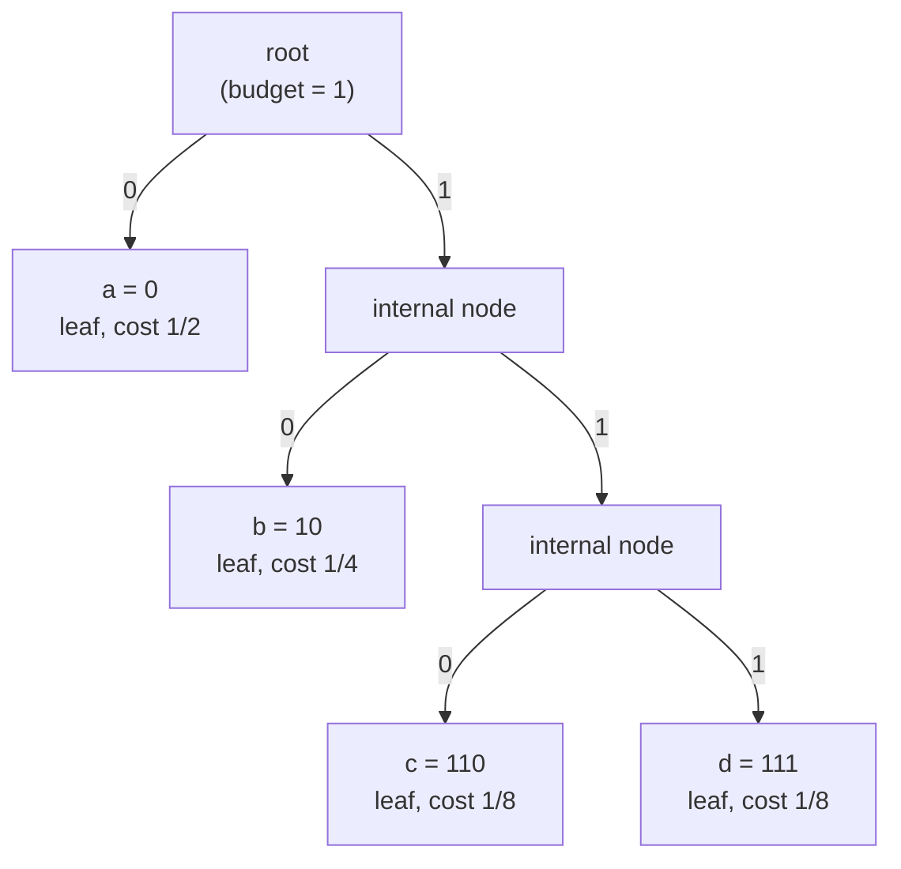

# 🌲 Prefix Codes and the Kraft Inequality

> [!abstract] TL;DR
> A **prefix code** is a variable-length code in which no codeword is the start of another, so a decoder knows the instant a codeword ends — no separators, no lookahead. The **Kraft inequality** says such a code with lengths `l_i` over a `D`-symbol alphabet exists **iff** `Σ D^(-l_i) ≤ 1`. The **Kraft-McMillan theorem** extends the same bound to *every* uniquely decodable code, proving prefix codes give up nothing. Choosing `l_i = -log_D p_i` drives expected length to the entropy `H`, and integer rounding forces the famous `H ≤ L < H + 1` gap that Huffman minimizes and arithmetic coding nearly erases.

---

## Intuition

**Analogy — phone numbers with no overlaps.** Imagine a small country where phone numbers have different lengths. Emergency is `9`. A common business line is `21`. A rare private line is `2350`. The rule that makes this workable: **no number is the beginning of any other number.** Because `9` is a full number, nothing else may *start* with `9`. Because `21` is a full number, nothing else may start with `21`.

Now dial digits into a stream with no pauses: `9212350`. You read left to right. The moment the digits so far exactly match a valid number, you *know* the call is complete — there is no longer number it could still be turning into. So `9` fires immediately, then `21`, then `2350`. You decoded a run-together stream with **no commas and no lookahead**. That "no number is the prefix of another" rule is exactly the **prefix property**, and "you always know when a codeword ends" is why prefix codes are also called **instantaneous** or **self-punctuating** codes.

The catch: short numbers are precious. Once you spend `9` as a one-digit number, you have burned every possible number starting with `9`. Handing out short codewords greedily exhausts the space fast. That budget — how much of the "number space" each codeword consumes — is precisely what the Kraft inequality measures.

---

## How It Works

### The decodability hierarchy

Not every code is safe to stream. Codes form a strict nesting, each level stronger than the last:

1. **Non-singular** — every symbol maps to a *distinct* codeword. Enough to identify one symbol in isolation, but concatenations can be ambiguous. Example over `{a,b,c}`: `a=0, b=1, c=01`. The stream `01` could be `c` or `ab`. Non-singular, but useless for a stream.
2. **Uniquely decodable (UD)** — *every* finite concatenation of codewords has exactly one parse. Safe to stream, but you may need to read arbitrarily far ahead before committing to the first symbol.
3. **Prefix-free / instantaneous** — no codeword is a prefix of another. UD *and* decodable symbol-by-symbol with **zero lookahead**: as soon as the bits read match a codeword, emit it and reset.

```
non-singular  ⊃  uniquely decodable  ⊃  prefix-free (instantaneous)
```

We want prefix-free codes because they decode in real time, self-synchronize the bitstream, and — as Kraft-McMillan proves below — cost nothing extra in length compared to the broader UD class.

### Prefix-free codes are binary trees

Build a `D`-ary tree (binary for `D = 2`): each edge from a node is labeled with one alphabet symbol (`0` = left, `1` = right), and each codeword is the sequence of edge labels on the path from the root to a node.

- A codeword is a **prefix** of another exactly when its node is an **ancestor** of the other's node.
- Therefore **prefix-free ⟺ every codeword sits at a leaf** (no codeword-node is an ancestor of another codeword-node).

Placing a codeword at a leaf at depth `l` **claims the entire subtree** below that leaf — none of those descendant strings can be used. In a full binary tree of depth `L_max`, that leaf swallows `2^(L_max - l)` of the `2^(L_max)` deepest nodes, i.e. a fraction `2^(-l)` of the whole space. The subtrees of distinct leaves are disjoint, so the claimed fractions cannot exceed the whole tree:

```
Σ_i 2^(-l_i) ≤ 1        (Kraft inequality, binary case)
Σ_i D^(-l_i) ≤ 1        (D-ary case)
```

This is the whole geometric content: **each codeword spends a `D^(-l)` slice of a unit budget, and the slices must fit inside 1.**

### Mermaid — a prefix-free code tree



Codewords `{a=0, b=10, c=110, d=111}` all sit at leaves, so no codeword is an ancestor (prefix) of another. Kraft sum `= 1/2 + 1/4 + 1/8 + 1/8 = 1`: the budget is fully spent, so this is a **complete** code — every leaf is used and no shorter code with these symbols exists.

### The Kraft-McMillan theorem — prefix codes lose nothing

Kraft's inequality is a statement about prefix codes. **McMillan (1956)** proved the striking converse: *every uniquely decodable code also satisfies `Σ D^(-l_i) ≤ 1`.*

Proof sketch (the counting trick): raise the Kraft sum to the `n`-th power,
```
( Σ_i D^(-l_i) )^n  =  Σ over length-n messages  D^(-(total length)).
```
Group terms by total length `m`. Because the code is uniquely decodable, at most `D^m` distinct `n`-symbol messages can share total length `m` (else two messages would collide on the same bitstring). Each contributes `D^(-m)`, so the coefficient of each `m` is `≤ D^m · D^(-m) = 1`. With messages of total length from `n·l_min` to `n·l_max`, the whole sum is `≤ n·l_max`. Hence `(Kraft sum)^n ≤ n·l_max` for all `n`; taking `n → ∞` forces `Kraft sum ≤ 1`.

**Consequence:** any length profile achievable by a clever look-ahead UD code is *also* achievable by an instantaneous prefix code (Kraft builds one from the same lengths). So there is no compression penalty for insisting on instantaneous decoding — you may as well always use a prefix code.

### From lengths to optimal lengths

Given source probabilities `p_i`, minimize expected length `L = Σ p_i l_i` subject to Kraft `Σ D^(-l_i) ≤ 1`. Relaxing `l_i` to real numbers and using a Lagrange multiplier yields the **ideal codeword length**
```
l_i* = -log_D p_i ,
```
at which `L = Σ p_i (-log_D p_i) = H_D(X)` — the entropy. This is the **converse to the source coding theorem**: no uniquely decodable code can have `L < H`, because Kraft-McMillan + Gibbs' inequality bound it from below. Entropy is a hard floor.

But `-log_D p_i` is an integer only when every `p_i` is a power of `1/D` (a *dyadic* source). Otherwise you must round. The **Shannon code** takes `l_i = ⌈-log_D p_i⌉`, which always satisfies Kraft (rounding *up* only shrinks the sum) and yields the universal bound
```
H(X) ≤ L < H(X) + 1.
```
The `+1` is pure integer-rounding waste — at most one extra bit per symbol. **Huffman coding** finds the *optimal* integer lengths (never worse than Shannon, usually better), and **arithmetic / range coding** encodes whole sequences at once so the fixed `+1` is amortized across many symbols, pushing `L/n → H` with per-symbol overhead → 0.

---

## Key Concepts

### Secondary (the core idea)
- **Prefix property:** no codeword begins another codeword. That single rule lets a decoder read a run-together bitstream and know exactly where each codeword ends — no separators needed.
- **Variable length pays off:** give short codewords to frequent symbols and long ones to rare symbols, so the *average* length drops below fixed-width encoding.
- **The trade:** short codewords are scarce. Using one blocks a whole family of longer codewords, so you cannot make everything short.

### Undergraduate (the mechanics)
- **Code tree:** a prefix code = a `D`-ary tree with codewords at the leaves; a codeword is a prefix of another iff its node is an ancestor. Prefix-free ⟺ all codewords are leaves.
- **Kraft inequality:** a prefix code with lengths `l_i` exists **iff** `Σ D^(-l_i) ≤ 1`. Equality means a *complete* code (no wasted leaves).
- **Decodability hierarchy:** non-singular ⊃ uniquely decodable ⊃ prefix-free. Only the last two are stream-safe; only prefix-free needs zero lookahead.
- **Ideal lengths & entropy:** `l_i = -log_D p_i` gives `L = H`. Integer rounding (Shannon code `⌈-log_D p_i⌉`) gives `H ≤ L < H + 1`.

### Graduate (the deep results)
- **Kraft-McMillan theorem:** the inequality holds for *all* uniquely decodable codes, not just prefix codes (proof by the `n`-th-power counting argument). Corollary: prefix codes are never suboptimal in length — instantaneous decoding is free.
- **Converse source coding bound:** combining Kraft-McMillan with Gibbs' inequality proves `L ≥ H` for every UD code; entropy is the information-theoretic floor on lossless compression.
- **Shannon-Fano vs Shannon vs Huffman:** Shannon-Fano codes split the sorted probability mass top-down (near-optimal, not always optimal); Shannon codes use `⌈-log p_i⌉` lengths; Huffman is provably optimal among symbol-wise prefix codes (bottom-up merge).
- **Closing the `+1`:** block coding `n` symbols at once divides the per-symbol penalty by `n` (`H ≤ L_n/n < H + 1/n`); arithmetic/range coding realizes this without an exponential code table, approaching `H` to within `O(1/n)` bits total.
- **`D`-ary generalization & incomplete trees:** for `D > 2` the tree is `D`-ary; when Kraft sum `< 1` the tree has unused leaves (an *incomplete*, redundant code) — you can always shorten some codeword.

---

## Python Demo

```python
"""
Prefix codes and the Kraft inequality (numpy + matplotlib only).

Demonstrates:
  1. Kraft test: a prefix code with given lengths exists iff  sum 2^(-l_i) <= 1.
  2. Constructing a valid prefix code from lengths, and a set of lengths that
     is IMPOSSIBLE because it overspends the unit budget.
  3. Optimal lengths l_i = -log2(p_i) drive expected length to the entropy H.
  4. Integer rounding (Shannon code) forces the  H <= L < H + 1  gap.
  5. Visualising the code tree and the entropy lower bound.
"""
import numpy as np
import matplotlib.pyplot as plt


# ── 1. Kraft sum: does a binary prefix code with these lengths exist? ─────────
def kraft_sum(lengths, D=2):
    """Sum of D^(-l_i). A prefix code with these lengths exists iff sum <= 1."""
    return sum(D ** (-l) for l in lengths)


valid_lengths      = [1, 2, 3, 3]   # -> a=0, b=10, c=110, d=111  (complete)
impossible_lengths = [1, 1, 2, 2]   # two length-1 words already fill the tree

for name, L in [("valid", valid_lengths), ("impossible", impossible_lengths)]:
    K = kraft_sum(L, D=2)
    verdict = "EXISTS" if K <= 1 + 1e-12 else "IMPOSSIBLE (Kraft sum > 1)"
    print(f"{name:11s} lengths={L}  Kraft sum={K:.4f}  ->  prefix code {verdict}")


# ── 2. Build a canonical prefix code from lengths (works iff Kraft <= 1) ──────
def canonical_prefix_code(lengths):
    """Assign codewords by the canonical construction that Kraft's proof uses."""
    order = sorted(range(len(lengths)), key=lambda i: (lengths[i], i))
    codes = [None] * len(lengths)
    code, prev_len = 0, lengths[order[0]]
    for idx in order:
        code <<= (lengths[idx] - prev_len)         # left-shift when depth grows
        codes[idx] = format(code, "0{}b".format(lengths[idx]))
        code += 1
        prev_len = lengths[idx]
    return codes


def is_prefix_free(codes):
    return not any(i != j and b.startswith(a)
                   for i, a in enumerate(codes)
                   for j, b in enumerate(codes))


codes = canonical_prefix_code(valid_lengths)
print(f"\nCanonical code for {valid_lengths}: {codes}")
print(f"Prefix-free? {is_prefix_free(codes)}")


# ── 3. Ideal lengths l_i = -log2(p_i) achieve the entropy (dyadic source) ─────
p = np.array([0.5, 0.25, 0.125, 0.125])
ideal_lengths = -np.log2(p)                        # exactly [1, 2, 3, 3]
H = -np.sum(p * np.log2(p))                         # entropy in bits
L_ideal = np.sum(p * ideal_lengths)                # expected length
print(f"\nDyadic source p = {p}")
print(f"  Entropy H(X)        = {H:.4f} bits")
print(f"  E[L] with -log2(p)  = {L_ideal:.4f} bits  (equals H exactly)")
print(f"  Kraft sum of ideal  = {kraft_sum(ideal_lengths):.4f}")


# ── 4. Non-dyadic source: integer rounding gives the H <= L < H+1 gap ─────────
p2 = np.array([0.45, 0.25, 0.20, 0.10])
H2 = -np.sum(p2 * np.log2(p2))
shannon_lengths = np.ceil(-np.log2(p2)).astype(int)  # Shannon code lengths
L2 = np.sum(p2 * shannon_lengths)
print(f"\nNon-dyadic source p = {p2}")
print(f"  Entropy              = {H2:.4f} bits")
print(f"  Shannon-code E[L]    = {L2:.4f} bits")
print(f"  Kraft sum            = {kraft_sum(shannon_lengths):.4f}  (<= 1, code exists)")
print(f"  Bound  H <= L < H+1 : {H2:.4f} <= {L2:.4f} < {H2 + 1:.4f}")


# ── 5. Visualise the prefix-code tree and the entropy lower bound ─────────────
def plot_code_tree(codes, labels, ax):
    """Draw a binary prefix-code tree; codewords sit at the green leaves."""
    nodes = {""}
    for c in codes:
        nodes |= {c[:k] for k in range(len(c) + 1)}

    def xpos(path):                                  # spread nodes by bit-path
        return sum((int(b) - 0.5) / (2 ** i) for i, b in enumerate(path))

    pos = {n: (xpos(n), -len(n)) for n in nodes}
    code_to_label = {c: labels[i] for i, c in enumerate(codes)}

    for n in nodes:                                  # edges + edge labels
        if n == "":
            continue
        x0, y0 = pos[n[:-1]]
        x1, y1 = pos[n]
        ax.plot([x0, x1], [y0, y1], "k-", lw=1.2, zorder=1)
        ax.text((x0 + x1) / 2, (y0 + y1) / 2, n[-1], fontsize=10,
                color="tab:blue", ha="center", va="center",
                bbox=dict(boxstyle="round,pad=0.1", fc="white", ec="none"))

    for n in nodes:                                  # nodes
        x, y = pos[n]
        if n in code_to_label:
            ax.scatter([x], [y], s=520, c="tab:green", zorder=2)
            ax.text(x, y, "{}\n{}".format(code_to_label[n], n),
                    ha="center", va="center", fontsize=8)
        else:
            ax.scatter([x], [y], s=180, c="lightgray", zorder=2)
    ax.set_title("Prefix-code tree (codewords at leaves)")
    ax.axis("off")


fig, axes = plt.subplots(1, 2, figsize=(12, 5))
plot_code_tree(codes, ["a", "b", "c", "d"], axes[0])

axes[1].bar(["H(X)", "E[L] Shannon"], [H2, L2], color=["tab:orange", "tab:blue"])
axes[1].axhline(H2 + 1, ls="--", c="red", label="H + 1 upper bound")
axes[1].set_ylabel("bits / symbol")
axes[1].set_title("Entropy floor vs achieved code length")
axes[1].legend()
plt.tight_layout()
plt.savefig("prefix_code_kraft.png", dpi=110)
print("\nSaved figure -> prefix_code_kraft.png")
```

**What it shows.** The impossible length set `[1,1,2,2]` has Kraft sum `1.25 > 1`, so no prefix code can exist — you cannot place two length-1 codewords (which alone spend the whole budget) *and* two more. For the dyadic source, `-log2(p)` is already integer and `E[L]` hits the entropy exactly. For the non-dyadic source, rounding up leaves `L` strictly between `H` and `H+1` — the residual gap that Huffman minimizes and arithmetic coding amortizes toward zero. This is the theoretical spine under all practical source coders.

---

## Real-World Applications

- **DEFLATE / gzip / zlib / PNG / HTTP `Content-Encoding: gzip`:** the literal/length and distance streams are entropy-coded with **canonical Huffman prefix codes**. The compressor ships only the codeword *lengths*; the decoder rebuilds the exact codewords via the Kraft canonical construction (Section 2 in the demo), which is why length tables alone suffice.
- **JPEG, MP3, AAC:** after transform + quantization, coefficients are packed with Huffman prefix-code tables. The prefix property lets the decoder walk the bitstream one codeword at a time with no delimiters between symbols.
- **H.264 / H.265 video:** headers and CAVLC use **Exp-Golomb codes**, an infinite prefix-code family, so a decoder can parse variable-length syntax elements instantaneously from a packed bitstream.
- **UTF-8:** the leading-byte patterns (`0xxxxxxx`, `110xxxxx`, `1110xxxx`, `11110xxx`) form a prefix code over byte values. That is exactly why UTF-8 is **self-synchronizing** — you can jump into the middle of a stream and re-find character boundaries.
- **Fax Group 3/4:** modified-Huffman run-length prefix codes compress scanned black/white runs.
- **Brotli, Zstandard:** modern coders combine prefix (Huffman) codes with FSE/range coding; the prefix stage handles symbols where the `+1` overhead is negligible, and the range-coded stage chases the entropy on the rest.

The unifying reason streaming and file formats favor prefix codes: they are **instantaneous and self-punctuating**, so a hardware or software decoder needs no buffering-for-lookahead and can emit symbols the moment their bits arrive.

---

## Common Pitfalls

- **"Kraft ≤ 1" ≠ "my assignment is prefix-free."** The inequality only guarantees that *some* prefix code with those lengths exists. A specific codeword assignment can satisfy Kraft yet still violate the prefix property (e.g. `{0, 01}` has Kraft `0.75 ≤ 1` but `0` prefixes `01`). Use the canonical construction to actually *get* a prefix-free assignment.
- **Thinking Kraft must equal 1.** Only `≤ 1` is required. Equality means a *complete* code (no wasted leaves); `< 1` is a valid but redundant code — you can always shorten a codeword and still satisfy Kraft.
- **Believing a clever UD code can beat prefix codes.** Kraft-McMillan proves the same length bound governs all uniquely decodable codes. Look-ahead buys you nothing in expected length; it only costs you decode latency.
- **Forgetting the integer constraint.** `l_i = -log_D p_i` is generally fractional. You must round to a valid tree depth, which is the entire source of the `+1` penalty. This is *not* an inefficiency of a particular algorithm — it is intrinsic to per-symbol integer-length coding, and only block/arithmetic coding escapes it.
- **Rounding down.** Use `⌈-log_D p_i⌉` for a Shannon code. Flooring can push the Kraft sum above 1, making the code impossible; ceiling only shrinks the sum, so it is always safe.
- **Using `log_2` for a non-binary alphabet.** For a `D`-symbol code alphabet the budget is `Σ D^(-l_i) ≤ 1` and ideal lengths are `-log_D p_i`. Mixing bases silently breaks both the Kraft test and the entropy bound.
- **Confusing non-singularity with stream-safety.** A non-singular code can be hopelessly ambiguous over concatenations (`a=0, b=1, c=01`). Distinct codewords are necessary but nowhere near sufficient — you need unique decodability, and in practice you want the prefix property.

---

## Related Concepts

- [[Huffman_Coding]] — the constructive optimum: given source probabilities, Huffman's bottom-up merge finds the integer codeword lengths that minimize `L` while satisfying Kraft; this note supplies the existence theorem and lower bound that Huffman achieves.
- [[Information_Theory]] — entropy, cross-entropy, and KL divergence; the `l_i = -log p_i` optimal-length result is why entropy is the compression floor and why cross-entropy is a *coding cost*.
- [[Binary_Tree_Fundamentals]] — a prefix code *is* a binary tree with codewords at the leaves; ancestor/descendant relationships are exactly the prefix relationships.
- [[Tree_Traversals]] — assigning codewords is a root-to-leaf path enumeration (left edge `0`, right edge `1`); decoding is a repeated root-to-leaf walk driven by the bitstream.

---

## Review Questions

1. **(Secondary — conceptual):** Why can a decoder read the run-together bitstream `010110111` for the code `{a=0, b=10, c=110, d=111}` and recover `a, b, c, d` with no separators and no lookahead? Point to the exact property that makes each codeword boundary unambiguous, and give one two-symbol code that fails this.
2. **(Undergraduate — applied):** You need a binary prefix code for five symbols with lengths `{1, 2, 3, 3, 3}`. Does one exist? Compute the Kraft sum, decide, and if it exists, produce a valid codeword assignment. If the last length were `2` instead of `3`, what changes and why?
3. **(Graduate — proof / trade-off):** State and prove (sketch) the Kraft-McMillan theorem, then use it to argue that no uniquely decodable code can achieve expected length below the entropy `H`. Given this floor, explain *precisely* where the `H ≤ L < H + 1` gap comes from for an optimal symbol-wise code, and how block coding or arithmetic coding shrinks it toward zero.

---

## Sources

- Cover, T. M., & Thomas, J. A. (2006). *Elements of Information Theory* (2nd ed.), Chapter 5: *Data Compression* (Kraft inequality, Kraft-McMillan, Shannon codes). Wiley.
- Shannon, C. E. (1948). *A Mathematical Theory of Communication.* Bell System Technical Journal, 27, 379–423 & 623–656.
- McMillan, B. (1956). *Two Inequalities Implied by Unique Decipherability.* IRE Transactions on Information Theory, 2(4), 115–116.
- MacKay, D. J. C. (2003). *Information Theory, Inference, and Learning Algorithms*, Chapter 5: *Symbol Codes.* Cambridge University Press.
- Kraft, L. G. (1949). *A Device for Quantizing, Grouping, and Coding Amplitude-Modulated Pulses* (S.M. thesis). MIT.

---

#information-theory #prefix-codes #kraft-inequality #uniquely-decodable #coding
