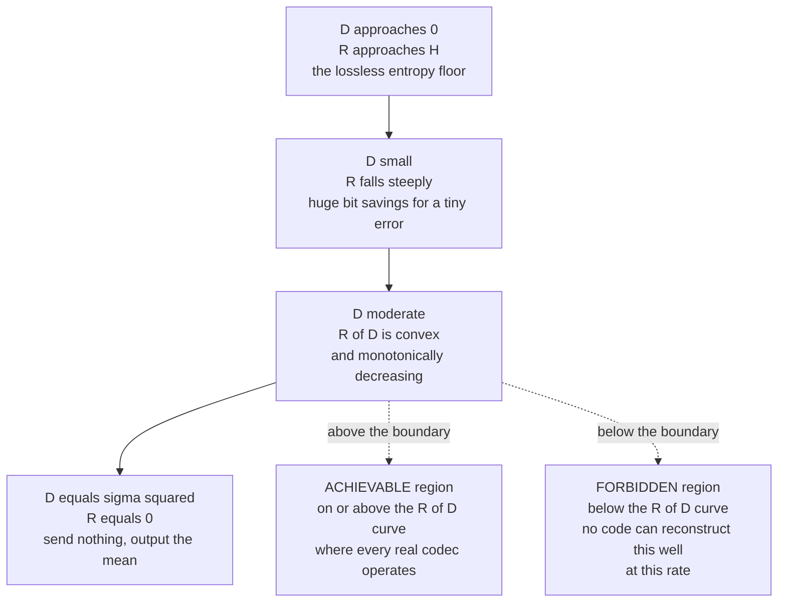

# 🗜️ Rate-Distortion Theory and Lossy Compression

> [!abstract] TL;DR
> **Lossless** compression cannot beat the entropy $H(X)$ — but if you are willing to accept a *controlled amount of error*, you can compress **far** below entropy. **Rate-distortion theory** is Shannon's framework for the fundamental tradeoff: the **rate-distortion function** $R(D)$ gives the *minimum* bits per symbol needed to reconstruct a source within an average distortion $D$, defined as $R(D) = \min_{p(\hat x \mid x)\,:\,\mathbb{E}[d(X,\hat X)] \le D} I(X; \hat X)$. For a Gaussian source with variance $\sigma^2$ under squared error, it has the beautifully clean form $R(D) = \tfrac{1}{2}\log_2\!\frac{\sigma^2}{D}$. **Quantization** is the practical primitive that realizes lossy coding; **transform coding** (JPEG, MP3) and **perceptual coding** are the engineering recipes that get real codecs close to the $R(D)$ bound.

---

## Intuition

**Analogy — how few decimals can you keep?** Suppose you are copying a table of measurements by hand and you are in a hurry. The raw numbers read `3.14159265`, `2.71828183`, `1.41421356`. Writing every digit is *lossless* — a perfect copy — but exhausting. If the reader only needs three decimals, `3.142`, `2.718`, `1.414` are *almost* as good and take a third of the ink. You have thrown away detail that *does not matter for the purpose*, and in exchange you paid far fewer "bits." Round to two decimals and you save more ink but introduce more error. Round to the nearest integer and you save almost everything — at the cost of a large, obvious error.

That dial — **how much error will you tolerate in exchange for how few bits?** — is exactly the rate-distortion tradeoff. Lossy media compression does the same thing, just cleverly: it throws away the specific detail that *the eye or the ear cannot perceive anyway*. The high-frequency texture your visual system smooths over, the quiet tone masked by a loud one right next to it — these are the "trailing decimals" of an image or a sound. Rate-distortion theory tells you the hard mathematical floor: for a given tolerable error $D$, no scheme in the universe can use fewer than $R(D)$ bits.

---

## How It Works

### 1. Lossless vs lossy — why we drop below entropy

The [[Entropy_and_Information_Content|entropy]] $H(X)$ is the hard floor for **lossless** coding (the source coding theorem): you cannot, on average, describe $X$ in fewer than $H(X)$ bits *and still recover it exactly*. Lossy compression sidesteps this floor by **not requiring exact recovery**. Once you permit the reconstruction $\hat X$ to differ from $X$ by a bounded average amount, the required rate can collapse — often by 10x, 100x, or more for images, audio, and video. The price is irreversible: the discarded information is gone forever.

### 2. The rate-distortion function $R(D)$

We first fix a **distortion measure** $d(x, \hat x) \ge 0$ that scores how bad a reconstruction is (e.g. squared error $d(x,\hat x) = (x-\hat x)^2$). A code achieves average distortion $D$ if $\mathbb{E}[d(X,\hat X)] \le D$. Shannon's definition of the minimum achievable rate is a **minimization of mutual information** over all conditional distributions (test channels) $p(\hat x \mid x)$ that meet the distortion budget:

$$R(D) \;=\; \min_{\,p(\hat x \mid x)\,:\,\mathbb{E}[d(X,\hat X)]\,\le\, D\,} \; I(X; \hat X)$$

The intuition behind using **mutual information** $I(X;\hat X)$: it measures how many bits of $X$ the reconstruction $\hat X$ actually pins down. We search for the *cheapest* possible statistical relationship between source and reconstruction that still keeps the average error under $D$. The **rate-distortion theorem** proves this quantity is not just a lower bound but is *asymptotically achievable* with long block codes — so $R(D)$ is the exact operational limit.

Key shape properties: $R(D)$ is **non-increasing** and **convex** in $D$. At $D = 0$ it recovers the lossless rate; it hits $R(D) = 0$ at $D = D_{\max}$, the distortion you get by outputting the best constant guess (for a zero-mean source under MSE, $D_{\max} = \sigma^2$ — send nothing, always reconstruct the mean).

### 3. The distortion measure and its limits

The choice of $d(\cdot,\cdot)$ *is the model of what matters*. **Mean-squared error (MSE)** is mathematically convenient (it gives closed forms and is tied to signal energy), but it is a **poor model of human perception**: two images with identical MSE can look wildly different — one blurry, one blocky, one with imperceptible noise. This mismatch motivates **perceptual distortion measures** (SSIM for images, PEAQ / masking-based metrics for audio) and, in modern learned codecs, the **rate-distortion-perception tradeoff**: you can optimize for low distortion *or* for outputs that look statistically realistic, and these are *not the same objective*. Pushing realism (matching the true data distribution) costs extra rate or distortion — a genuine three-way frontier.

### 4. The Gaussian source — the cleanest result

For a memoryless Gaussian source $X \sim \mathcal{N}(0,\sigma^2)$ under squared-error distortion, the minimization has a closed form:

$$R(D) = \begin{cases} \dfrac{1}{2}\log_2 \dfrac{\sigma^2}{D}, & 0 \le D \le \sigma^2 \\[2mm] 0, & D > \sigma^2 \end{cases}$$

Read it directly: **each halving of the tolerable distortion $D$ costs exactly $\tfrac{1}{2}\log_2 2 = 0.5$ bit per symbol.** The Gaussian is the *hardest* source to compress at a given variance (it is the max-entropy distribution for fixed variance), so $\tfrac{1}{2}\log_2(\sigma^2/D)$ is an upper bound on $R(D)$ for *any* source of the same variance — a useful worst-case.

**Reverse water-filling** generalizes this to a vector of independent Gaussian components with variances $\sigma_1^2, \dots, \sigma_n^2$ (e.g. transform coefficients). Pick a common threshold $\theta$ and allocate:

$$D_i = \min(\theta, \sigma_i^2), \qquad R_i = \max\!\left(0,\; \tfrac{1}{2}\log_2 \tfrac{\sigma_i^2}{\theta}\right)$$

You **spend bits where the variance is highest** and *give zero bits* to any component whose variance falls below $\theta$ (it is simply discarded). Raising $\theta$ lowers total rate and raises total distortion. This is the theoretical justification for why transform codecs quantize high-energy coefficients finely and throw low-energy ones away entirely.

### 5. Quantization — the practical lossy primitive

Theory says $R(D)$ is achievable; **quantization** is how real systems approximate it. A **scalar quantizer** maps each sample to one of $2^R$ reconstruction levels; a **vector quantizer (VQ)** maps blocks of samples jointly and can get strictly closer to $R(D)$ by exploiting correlation and the geometry of high-dimensional space. For a well-loaded uniform quantizer, distortion is $\approx \Delta^2/12$ where $\Delta$ is the step size; halving $\Delta$ (adding one bit) *quarters* the MSE — the famous **6 dB per bit rule** (signal-to-quantization-noise ratio $\text{SQNR} \approx 6.02\,R + \text{const}$, the backbone of PCM audio; see [[Digital_Audio_Fundamentals]]). **Lloyd-Max** quantizers place levels optimally for a *non-uniform* source (denser levels where the density is high), minimizing MSE for a fixed number of levels. Quantization is the **amplitude-axis** cousin of sampling on the time axis (see [[Sampling_Theorem]]).

### 6. Transform coding — the JPEG / MP3 recipe

Real codecs almost never quantize raw samples. They follow a three-stage recipe:

1. **Transform** to a domain where energy *concentrates* into a few coefficients — the **DCT** (a real-valued relative of the [[DFT_and_FFT|DFT]]) for JPEG/MPEG, **wavelets** for JPEG 2000. Natural images and audio have most of their energy in low frequencies, so this decorrelates and compacts them.
2. **Quantize** coarsely, applying reverse-water-filling logic: keep the big low-frequency coefficients precisely, crush the perceptually-unimportant high-frequency ones (often to zero). This step is where the loss happens.
3. **Entropy-code** the quantized coefficients losslessly (Huffman / arithmetic / run-length) to squeeze out the remaining redundancy down toward the entropy of the quantized stream.

### 7. Perceptual coding — exploiting human limits

The genius of consumer codecs is choosing the distortion so the discarded bits are the ones *you cannot perceive*:

- **Psychoacoustic masking (MP3, AAC):** a loud tone renders nearby quieter frequencies inaudible, and a loud sound masks quiet sounds just before and after it. The encoder allocates *zero or few bits* to masked components.
- **Chroma subsampling (JPEG, video):** the eye resolves brightness far better than color, so codecs convert to a luma/chroma space (YCbCr) and store color at half or quarter resolution (`4:2:0`). See [[Image_Representations]] for the color-space mechanics that make this possible.

### 8. Learned / neural lossy compression

Modern codecs replace the fixed DCT with a **learned nonlinear transform**: an **autoencoder** whose bottleneck is quantized and entropy-coded. Training minimizes a Lagrangian $\mathcal{L} = R + \lambda D$ — literally rate plus $\lambda$ times distortion — which sweeps out the $R(D)$ curve as $\lambda$ varies. This is exactly the structure of the **VAE** objective (the ELBO): the KL term *is* a rate (bits to describe the latent), and the reconstruction term *is* a distortion. See [[Variational_Autoencoders]]. Learned codecs (Ballé et al., HiFiC) now beat JPEG and rival HEVC by optimizing perceptual distortion end-to-end.

### 9. The achievable region — why you cannot beat $R(D)$

Plot rate against distortion. The convex curve $R(D)$ divides the plane: **on or above** the curve is the *achievable region* (real codecs live here); **below** it is *forbidden* — the converse of the rate-distortion theorem proves no code, however clever, can reconstruct within distortion $D$ using fewer than $R(D)$ bits. Every codec improvement is a race *toward* this curve, never past it.



---

## Key Concepts

### Secondary (intuitive level)
- **Lossy = keep fewer decimals.** You accept a little error to save a lot of space.
- **Rate** = bits you spend; **distortion** = how much error you accept. They trade off.
- **You cannot get both to zero.** Zero error means lossless (expensive); zero bits means you send nothing (maximum error).
- Codecs like JPEG and MP3 throw away detail *the eye or ear misses anyway*.

### Undergraduate (working level)
- **Rate-distortion function:** $R(D) = \min_{p(\hat x\mid x):\,\mathbb{E}[d]\le D} I(X;\hat X)$ — minimum bits/symbol for average distortion $\le D$; convex and non-increasing.
- **Gaussian result:** $R(D) = \tfrac{1}{2}\log_2(\sigma^2/D)$ for $0 \le D \le \sigma^2$; each 0.5 bit halves the distortion.
- **Distortion measure matters:** MSE is convenient but perceptually weak; SSIM/psychoacoustic metrics model human perception.
- **Quantization:** scalar vs vector; uniform quantizer MSE $\approx \Delta^2/12$; the **6 dB per bit** SQNR rule; Lloyd-Max optimal placement.
- **Transform coding pipeline:** transform (DCT/wavelet) → quantize → entropy-code.
- **Perceptual coding:** masking (audio), chroma subsampling (image).

### Graduate (theoretical level)
- **Rate-distortion theorem (achievability + converse):** $R(D)$ is the exact operational limit; achievability via random coding on the test channel, converse via the data-processing and convexity arguments.
- **Reverse water-filling:** optimal bit allocation for parallel Gaussian sources; $D_i = \min(\theta, \sigma_i^2)$, discarding sub-threshold components — the theory behind transform bit allocation.
- **Shannon lower bound** and the ~1.53 dB / ~0.25-bit gap of optimal scalar quantization from $R(D)$; VQ closes it via space-filling and shaping gains (asymptotic $\tfrac{1}{2}\log_2(2\pi e/12)$ shaping loss).
- **Source-channel separation** and the role of the test channel $p(\hat x\mid x)$ as a "reverse channel."
- **Rate-distortion-perception tradeoff** (Blau & Michaeli): adding a distribution-matching (realism) constraint strictly enlarges the achievable rate/distortion — a genuine 3-D frontier, central to generative/neural compression.
- **Continuous sources:** $R(D)$ built on differential entropy; the Gaussian maximizes $R(D)$ among fixed-variance sources.

---

## Python Demo

```python
# Rate-distortion of a Gaussian source vs a real scalar quantizer.
# Part 1: plot the closed-form bound R(D) = 0.5*log2(sigma^2 / D).
# Part 2: quantize Gaussian samples at 1..8 bits, measure MSE, and show
#         (a) the operating points sit ABOVE the R(D) bound (you pay a
#             gap), and (b) each extra bit ~quarters the MSE => 6 dB/bit,
#             i.e. diminishing returns. Connects to signal quantization.
import numpy as np
import matplotlib.pyplot as plt

rng = np.random.default_rng(0)

# ---- Part 1: rate-distortion function of a Gaussian source ----------
sigma2 = 1.0                                        # source variance
D = np.linspace(1e-3, sigma2, 500)                  # allowed MSE distortion
R_gauss = np.maximum(0.5 * np.log2(sigma2 / D), 0.0)  # R(D) in bits/symbol

# ---- Part 2: uniform scalar quantization of the Gaussian signal -----
N = 200_000
x = rng.normal(0.0, np.sqrt(sigma2), size=N)        # the "signal" to compress
clip = 4.0 * np.sqrt(sigma2)                        # loader range +-4 sigma

def uniform_quantize(sig, bits, clip):
    """Mid-rise uniform quantizer with 2**bits reconstruction levels."""
    levels = 2 ** bits
    step = 2 * clip / levels
    xc = np.clip(sig, -clip, clip)
    idx = np.clip(np.floor((xc + clip) / step), 0, levels - 1)
    return -clip + (idx + 0.5) * step               # reconstruct at bin center

bit_depths = np.arange(1, 9)
mse_q = np.array([np.mean((x - uniform_quantize(x, b, clip)) ** 2)
                  for b in bit_depths])
sqnr_db = 10 * np.log10(sigma2 / mse_q)             # signal-to-quant-noise ratio

print("bits |    MSE     | SQNR dB | R(D) bound at that MSE")
for b, d, s in zip(bit_depths, mse_q, sqnr_db):
    rd = max(0.5 * np.log2(sigma2 / d), 0.0)
    print(f"{b:4d} | {d:.6f} | {s:6.2f}  | {rd:.3f} bits")

# Empirical dB-per-bit slope (should land near the 6.02 dB/bit rule)
slope = np.polyfit(bit_depths, sqnr_db, 1)[0]
print(f"\nMeasured SQNR slope = {slope:.2f} dB per bit  (theory ~ 6.02)")

# ---- Plots ----------------------------------------------------------
fig, ax = plt.subplots(1, 2, figsize=(12, 4.5))

# Left: R(D) bound + achievable region + quantizer operating points
ax[0].plot(D, R_gauss, color="#2563eb", lw=2,
           label="R(D) = 0.5 log2(sigma^2 / D)")
ax[0].fill_between(D, R_gauss, 9, color="#2563eb", alpha=0.06,
                   label="achievable region")
ax[0].scatter(mse_q, bit_depths, color="red", zorder=5,
              label="uniform quantizer (real)")
ax[0].set_xlabel("distortion D  (mean-squared error)")
ax[0].set_ylabel("rate R  (bits per symbol)")
ax[0].set_title("Rate-distortion bound vs a real quantizer")
ax[0].set_ylim(0, 8.5)
ax[0].set_xlim(0, sigma2)
ax[0].legend()

# Right: diminishing returns -- MSE vs rate on a log axis
ax[1].semilogy(bit_depths, mse_q, "o-", color="red", label="quantizer MSE")
ax[1].set_xlabel("rate R  (bits per sample)")
ax[1].set_ylabel("distortion D  (MSE, log scale)")
ax[1].set_title("Each bit ~quarters the MSE  (the 6 dB / bit rule)")
ax[1].grid(True, which="both", ls=":")
ax[1].legend()

plt.tight_layout()
plt.show()

# Expected (approx):
# - MSE drops ~4x per added bit; SQNR rises ~6 dB per bit.
# - The red operating points lie ABOVE the blue R(D) curve: a simple
#   uniform scalar quantizer needs ~1 extra bit vs the theoretical bound.
#   Lloyd-Max and vector quantization shrink that gap toward R(D).
```

The left panel makes the **achievable region** concrete: the blue $R(D)$ curve is the wall, and every real quantizer point sits strictly *above and to the right* of it — you always pay a rate penalty for using a practical scheme. The right panel shows the **diminishing returns**: on a log axis the MSE falls in equal steps per bit (a straight line), the signal-processing statement of "6 dB per bit." Going from 2 to 3 bits buys a huge visible improvement; going from 14 to 15 bits is imperceptible — which is precisely why audio stops at 16-bit and images at 8-bit per channel.

---

## Real-World Applications

- **JPEG / JPEG 2000 (images):** 8x8 block DCT (or wavelets), a quantization table tuned to human contrast sensitivity, chroma subsampling in YCbCr, then Huffman/arithmetic coding. A 10:1 ratio is usually visually lossless. See [[Image_Representations]] and [[DFT_and_FFT]].
- **MP3 / AAC / Opus (audio):** filter banks plus a **psychoacoustic model** that computes a masking threshold and allocates bits only to audible components — a direct implementation of "spend bits where they are perceived." Ties to PCM quantization in [[Digital_Audio_Fundamentals]].
- **H.264 / H.265 / AV1 (video):** motion-compensated prediction + transform coding + rate control that dynamically walks the $R(D)$ curve to hit a target bitrate. Rate-distortion optimization (RDO) is literally minimizing $D + \lambda R$ per coding decision.
- **Neural image/video codecs (Ballé 2018, HiFiC):** learned analysis/synthesis transforms with a quantized, entropy-modeled latent, trained on $R + \lambda D$; now competitive with or better than HEVC on perceptual metrics.
- **Model compression / VQ-VAE:** vector-quantized latents in generative models (VQ-VAE, tokenizers for image/audio LLMs) are rate-distortion codebooks — a bridge from classic quantization to modern deep learning.

---

## Common Pitfalls

- **Thinking MSE equals perceptual quality.** Two reconstructions with identical MSE can look/sound completely different. Optimizing MSE alone yields blurry images; codecs and neural models add perceptual or adversarial terms. MSE is a proxy, not the goal.
- **Confusing quantization noise with channel noise.** Quantization error is *deterministic and signal-dependent* (it correlates with the signal, especially at low bit depths), not additive white noise — the "$\Delta^2/12$, uncorrelated" model only holds for well-loaded, high-resolution quantizers.
- **Mis-loading the quantizer.** Clip too tight and you get overload (clipping) distortion; clip too loose and granular steps are coarse. Both push you *away* from the $R(D)$ bound. Loading factor is a real tuning knob (dithering helps).
- **Ignoring the transform's job.** Quantizing raw pixels/samples directly is far from optimal — the *decorrelating transform* is what makes coarse quantization survivable. Skipping it wastes most of the available gain.
- **Assuming you can beat $R(D)$ with a smarter codec.** You cannot. The converse theorem is a hard floor. Gains come from better *perceptual* distortion models (changing what "$D$" means), not from breaking the bound.
- **Forgetting that lossy is irreversible.** Re-encoding a JPEG repeatedly ("generation loss") compounds distortion each pass — unlike lossless re-zipping, which is idempotent.

---

## Related Concepts

- [[Entropy_and_Information_Content]] — entropy $H(X)$ is the **lossless** floor; rate-distortion is the theory of what happens when you deliberately drop below it by tolerating error.
- [[Sampling_Theorem]] — sampling discretizes the *time* axis; quantization discretizes the *amplitude* axis. Together they define analog-to-digital conversion, and quantization is the lossy half.
- [[Digital_Audio_Fundamentals]] — PCM bit depth, the 6 dB-per-bit / dynamic-range rule, and the practical face of scalar quantization in audio.
- [[DFT_and_FFT]] — the DCT used in JPEG/MPEG is a real-valued relative of the DFT; the frequency transform is stage one of transform coding.
- [[Fourier_Transform]] — provides the energy-compaction basis that makes coarse quantization of high-frequency coefficients acceptable.
- [[Fourier_Applications]] — JPEG's DCT and the Gibbs-ringing artifacts that appear when high-frequency coefficients are quantized away.
- [[Image_Representations]] — the YCbCr luma/chroma split that enables chroma subsampling, a perceptual-coding trick.
- [[Autoencoders]] — a learned nonlinear transform with a bottleneck; quantizing that bottleneck turns an autoencoder into a lossy codec.
- [[Variational_Autoencoders]] — the ELBO is literally rate (the KL term) plus distortion (the reconstruction term); a VAE is a rate-distortion optimizer.

---

## Review Questions

**Tier 1 — Conceptual (explain to a peer):**
1. Using the "keep fewer decimals" analogy, explain why lossy compression can beat the entropy $H(X)$ while lossless compression cannot. What is the price you pay?
2. In one sentence each, define *rate* and *distortion*, and describe what the two endpoints of the $R(D)$ curve ($D \to 0$ and $D \to \sigma^2$) mean physically.

**Tier 2 — Applied (compute / reason):**
3. A zero-mean Gaussian source has variance $\sigma^2 = 4$. Using $R(D) = \tfrac{1}{2}\log_2(\sigma^2/D)$, how many bits per symbol are needed for $D = 1$? For $D = 0.25$? How many extra bits did halving-then-quartering the distortion cost, and why is that increment constant?
4. You have three transform coefficients with variances $9, 1, 0.1$ and a water-filling threshold $\theta = 1$. Which coefficients receive bits, how much distortion does each incur, and what is the total rate? Explain the "spend bits where the variance is highest" principle.

**Tier 3 — Theoretical (deep understanding):**
5. The rate-distortion function is defined as a *minimization of mutual information* over conditional distributions $p(\hat x \mid x)$. Explain why mutual information is the right quantity to minimize, and what the converse theorem guarantees about points below the $R(D)$ curve.
6. MSE-optimal reconstructions are often perceptually poor. Explain the rate-distortion-*perception* tradeoff: why does forcing the output distribution to match the source distribution (realism) cost additional rate or distortion, and how does this reframe the design of neural codecs and VQ-VAE tokenizers?

---

## Sources

- Shannon, C. E. (1959). *Coding Theorems for a Discrete Source with a Fidelity Criterion.* IRE Nat. Conv. Rec., Part 4, 142–163. (the founding paper of rate-distortion theory)
- Cover, T. M. & Thomas, J. A. (2006). *Elements of Information Theory* (2nd ed.), Wiley. Chapter 10, "Rate Distortion Theory" (includes the Gaussian result and reverse water-filling).
- Berger, T. (1971). *Rate Distortion Theory: A Mathematical Basis for Data Compression.* Prentice-Hall.
- Gersho, A. & Gray, R. M. (1992). *Vector Quantization and Signal Compression.* Kluwer. (scalar/vector quantization, Lloyd-Max, the 6 dB/bit rule).
- Blau, Y. & Michaeli, T. (2019). *Rethinking Lossy Compression: The Rate-Distortion-Perception Tradeoff.* ICML. [arXiv:1901.07821](https://arxiv.org/abs/1901.07821)
- Ballé, J., Minnen, D., Singh, S., Hwang, S. J. & Johnston, N. (2018). *Variational Image Compression with a Scale Hyperprior.* ICLR. [arXiv:1802.01436](https://arxiv.org/abs/1802.01436)

---

#information-theory #rate-distortion #lossy-compression #quantization #jpeg
