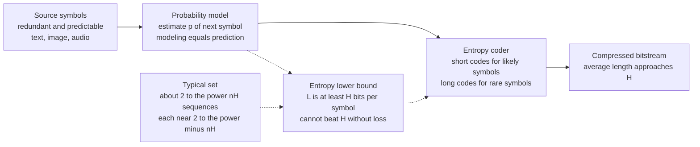

# 🗜️ Source Coding Theorem and Data Compression

> [!abstract] TL;DR
> **Shannon's source coding theorem** (the noiseless coding theorem) says the **entropy `H` of a source is the hard floor on lossless compression**: no code can represent the source in fewer than `H` bits per symbol on average, and codes exist that get arbitrarily close to `H`. Compression works because real data is **redundant** — text, images, and audio are far from random — and every practical compressor is really two stages: a **model** that predicts symbol probabilities plus an **entropy coder** (Huffman, arithmetic, range) that spends short codes on likely symbols. Better prediction means better compression, which is why modern compressors and large language models are the same idea wearing different hats.

---

## Intuition

**Analogy:** Suppose you text a friend the result of a daily event and pay per character. If you report a **fair coin flip**, "H" or "T" is genuine news every time — you cannot shorten it. If you report a coin that **always lands heads**, you could agree in advance "no message means heads," and send almost nothing. Now imagine reporting the weather in a desert where it is sunny 95 days out of 100: you invent a scheme where "sunny" costs a fraction of a character and the rare "rain" costs several. **Compression is the art of spending few bits on the things that happen often and more bits on the things that rarely happen** — and the average cost you can achieve is pinned by exactly how predictable the source is.

That predictability has a precise measure: **entropy**. A page of the letter "A" repeated a million times is trivially describable ("A times a million"). A page of English prose is compressible but not free — its letters, words, and phrases follow statistical patterns. A page of true random noise is **incompressible** — there is no pattern to exploit, so the best you can do is copy it verbatim. Entropy is the line that separates "there is still redundancy to squeeze out" from "you are already at the floor." You can push a compressed file down toward that floor, but you can never punch through it without throwing information away.

---

## How It Works

### The source coding problem

A **source** emits symbols `x_1, x_2, ...` from an alphabet according to some probability distribution. The **lossless source coding problem** is to map each possible message to a binary string (a **codeword**) so that: the mapping is invertible (you can perfectly reconstruct the original), and the **average number of bits per symbol** is as small as possible. "Lossless" means the decompressor recovers the input **exactly**, bit for bit — the requirement behind ZIP, PNG, and FLAC.

### Shannon's source coding theorem

For a source with entropy `H` bits per symbol, the optimal expected codeword length `L*` satisfies:

```
H  <=  L*  <  H + 1        (single-symbol coding)
```

Coding **blocks** of `n` symbols at a time shrinks the overhead:

```
H  <=  L*_n / n  <  H + 1/n     ->   L*_n / n  ->  H   as  n -> infinity
```

The theorem has **two halves**, and both matter:

1. **Achievability (the easy direction to believe):** you *can* build codes whose average length approaches `H`. Shannon–Fano, Huffman, and arithmetic codes all get within one bit of `H` per symbol, and block/arithmetic coding drives the per-symbol overhead to zero.
2. **Converse (the deep direction):** you *cannot* beat `H`. Any uniquely decodable code has average length at least `H`. This is not an engineering limitation — it is a mathematical wall. The proof rests on the Kraft inequality plus the fact that `L - H` equals a **KL divergence**, which is never negative.

### Why the floor is exactly `H` — the Asymptotic Equipartition Property

The reason entropy is *the* limit, not just *a* limit, is the **Asymptotic Equipartition Property (AEP)** — the law of large numbers applied to information. Take long sequences of length `n` from the source. The AEP says almost all the probability concentrates on a **typical set** of roughly `2^(nH)` sequences, each with probability about `2^(-nH)`. Everything else is vanishingly unlikely.

If there are only about `2^(nH)` sequences worth caring about, you can just **number them**: an index into a list of `2^(nH)` items needs about `nH` bits, i.e. `H` bits per symbol. You cannot do better, because there genuinely are that many roughly-equiprobable outcomes to distinguish. This is the intuitive heart of the converse: entropy counts the effective number of things the source can say, and you need `log2` of that many bits to name them.

### Redundancy: why compression is possible at all

The **redundancy** of a source is the gap between the bits it *uses* and the bits it *needs*: raw ASCII spends 8 bits per English character, but English text has an entropy of roughly 1–1.5 bits per character. That 6-plus-bit gap is what every text compressor harvests. Natural data is redundant because it is **predictable**: given "the quick brown f", the next character is almost certainly "o". Compression is the act of not paying full price for what you could have guessed.

### The universal pipeline: modeling + coding

Every real compressor factors into two stages:

- **Model** — assign a probability `p(symbol | context)` to what comes next. Better models = more accurate predictions = more compression.
- **Entropy coder** — given the model's probabilities, emit a bitstream whose length approaches `-log2 p` per symbol. This is where [[Huffman_Coding]] and arithmetic/range coding live.

This split is the single most important idea in the field: **compression = prediction**. Improving the model is the whole game; the entropy coder is a near-solved commodity that gets you to within a fraction of a bit of the model's own entropy. That is precisely why a good language model *is* a good compressor — see [[Language_Model_Basics]].

### Flow / Architecture



---

## Key Concepts

### Secondary (intuitive)
- **Lossless vs lossy:** lossless compression reconstructs the input exactly (ZIP, PNG, FLAC); lossy compression throws away detail you will not miss for smaller files (JPEG, MP3).
- **Redundancy:** the part of a message you could have guessed. Compression removes it; entropy is what remains.
- **Short codes for common things:** the core trick — like Morse code giving "E" a single dot and "Q" a long dash-dash-dot-dash.
- **You can't compress randomness:** a file of true noise (or an already-zipped file) has no pattern left, so squeezing it again does nothing — often it grows slightly.
- **Entropy is the floor:** there is a smallest average size below which lossless compression is mathematically impossible.

### Undergraduate
- **Entropy of a source:** `H(X) = minus sum p(x) log2 p(x)` bits per symbol; the average surprise, and the compression floor.
- **The theorem's bounds:** `H <= L* < H + 1` for symbol codes; `H <= L*_n / n < H + 1/n` for block codes, so per-symbol overhead vanishes as block length grows.
- **Fixed-length vs variable-length codes:** fixed-length codes give every symbol the same number of bits (simple, seekable, but wasteful unless symbols are near-uniform); variable-length codes (Huffman, arithmetic) match code length to `-log2 p` and approach `H`.
- **Why `L >= H`:** for any prefix code with lengths `l(x)`, average length minus entropy equals the KL divergence between the true distribution and the "implied" distribution `2^(-l(x))`, which is `>= 0`. Equality needs `l(x) = -log2 p(x)`, generally non-integer — the source of the sub-one-bit gap.
- **Prefix (prefix-free) codes and Kraft:** no codeword is a prefix of another, so decoding is instantaneous; achievable lengths are exactly those satisfying the Kraft inequality `sum 2^(-l(x)) <= 1`.
- **Adaptive vs static models:** static models fix probabilities up front (needs a header or a shared table); adaptive models update the probability estimate as they read, so no separate table is transmitted.

### Graduate
- **Asymptotic Equipartition Property:** `minus (1/n) log2 p(X_1..X_n) -> H` almost surely (a consequence of the law of large numbers). Formalizes the typical set `A_epsilon` of size between `(1 - epsilon) 2^(n(H - epsilon))` and `2^(n(H + epsilon))`, giving both halves of the theorem.
- **Universal source coding:** codes like **Lempel–Ziv (LZ77, LZ78, LZW)** achieve the entropy rate **without knowing the source distribution** in advance, by building a dictionary of repeated substrings on the fly — asymptotically optimal for stationary ergodic sources.
- **Entropy rate of a process:** for sources with memory, the relevant floor is the entropy *rate* `H(X) = lim (1/n) H(X_1..X_n)`, not the single-symbol entropy; Markov and context models exploit the gap between the two.
- **Arithmetic and range coding:** encode an entire message as a single number in an interval subdivided by cumulative probabilities, achieving within a couple of bits of `-log2 p` **for the whole sequence** — sidestepping Huffman's one-bit-per-symbol integer-length penalty. This is where the model's real-valued probabilities are cashed in.
- **The pigeonhole / counting limit:** **no lossless algorithm can compress every input.** There are `2^n` strings of length `n` but only `2^n - 1` shorter strings; by counting, at least one input of each length cannot be shortened, and most cannot be shortened at all. Any compressor that shrinks some inputs must expand others. "Compress any file by X%" schemes are therefore impossible.
- **Kolmogorov complexity `K(x)`:** the length of the shortest program that outputs the individual string `x` — the ultimate, *distribution-free* limit for a single sequence, versus Shannon entropy's *average over a distribution*. For strings drawn from a source, `E[K(x^n)]/n -> H`. `K` is **uncomputable** (a corollary of the halting problem), so practical compressors are computable upper bounds on it. See [[Information_and_Entropy_in_Systems]].
- **The physical connection:** the `H` that floors compression is the same `H` (up to `k_B ln 2`) that Landauer says costs energy to erase — information theory and thermodynamics meet at the bit. See [[Entropy_and_Second_Law]].

---

## Python Demo

```python
# Shannon's source coding theorem, demonstrated empirically.
#
# Claim: the entropy H of a source is a HARD FLOOR on lossless
#        compression, and BLOCK CODING approaches H per symbol as
#        the block length grows (the asymptotic-equipartition idea).
#
# We use a Bernoulli(p) source. Key twist: symbol-by-symbol coding of a
# BINARY source is stuck at 1 bit/symbol no matter what p is (you can't
# assign a fraction of a bit to a single symbol). Grouping symbols into
# blocks of length n and optimally coding the 2^n blocks lets the
# per-symbol length fall toward H(p) -- the theorem in action.
#
# numpy + matplotlib only.

import numpy as np
import matplotlib.pyplot as plt


def binary_entropy(p):
    """Entropy H(p) in bits of a Bernoulli(p) source."""
    if p <= 0.0 or p >= 1.0:
        return 0.0
    return -(p * np.log2(p) + (1 - p) * np.log2(1 - p))


def binom_coeffs(n):
    """Row n of Pascal's triangle, C(n,0..n), as integers (pure numpy)."""
    c = np.ones(n + 1)
    for i in range(1, n + 1):
        c[i] = c[i - 1] * (n - i + 1) / i          # multiplicative recurrence
    return np.round(c).astype(np.int64)


def block_probs_bernoulli(p, n):
    """
    Multiset of probabilities of all 2^n length-n blocks from Bernoulli(p).
    A block with k ones has probability p**k * (1-p)**(n-k) and there are
    C(n,k) such blocks.
    """
    ks = np.arange(n + 1)
    pattern_prob = p ** ks * (1 - p) ** (n - ks)   # prob of one k-ones pattern
    counts = binom_coeffs(n)                        # how many such patterns
    return np.repeat(pattern_prob, counts)          # length 2**n, sums to 1


def huffman_expected_length(probs):
    """
    Expected codeword length (bits) of the OPTIMAL prefix code for a discrete
    source, without building an explicit tree.

    Identity: the expected length of a Huffman code equals the sum of the
    probabilities of every internal (merged) node created while repeatedly
    merging the two smallest weights. Because inputs are sorted, the merged
    sums come out non-decreasing, so two ascending pointers give it in O(m).
    """
    p = np.sort(np.asarray(probs, dtype=float))
    p = p[p > 0]
    m = len(p)
    if m <= 1:
        return 1.0                                  # one message still needs 1 bit

    leaves = p.tolist()
    merged = []
    i = j = 0
    total = 0.0

    def next_min():
        nonlocal i, j
        take_leaf = i < len(leaves) and (
            j >= len(merged) or leaves[i] <= merged[j]
        )
        if take_leaf:
            v = leaves[i]; i += 1
        else:
            v = merged[j]; j += 1
        return v

    for _ in range(m - 1):                          # m-1 merges build the tree
        s = next_min() + next_min()
        total += s                                  # accumulate internal weight
        merged.append(s)
    return total


# --------------------------------------------------------------------------
# (1) Block coding: per-symbol length falls toward H(p) as block length grows
# --------------------------------------------------------------------------
p_source = 0.2
H = binary_entropy(p_source)                        # ~0.7219 bits/symbol
block_sizes = [1, 2, 3, 4, 6, 8, 10, 12]
per_symbol_len = []
for n in block_sizes:
    L_block = huffman_expected_length(block_probs_bernoulli(p_source, n))
    per_symbol_len.append(L_block / n)
per_symbol_len = np.array(per_symbol_len)

# --------------------------------------------------------------------------
# (2) AEP: -1/n log2 P(sequence) concentrates on H as n grows (typical set)
# --------------------------------------------------------------------------
rng = np.random.default_rng(0)
N = 20000
aep_lengths = [5, 50, 500]
aep_samples = {}
for n in aep_lengths:
    k = rng.binomial(n, p_source, size=N)           # number of ones in a block
    # per-symbol code length the source model would spend on that sequence
    surprise = -(k * np.log2(p_source)
                 + (n - k) * np.log2(1 - p_source)) / n
    aep_samples[n] = surprise

# --------------------------------------------------------------------------
# (3) Entropy is the floor: achievable rate vs H across many sources
# --------------------------------------------------------------------------
ps = np.linspace(0.02, 0.5, 25)
Hs = np.array([binary_entropy(p) for p in ps])
n_blk = 10
achievable = np.array([
    huffman_expected_length(block_probs_bernoulli(p, n_blk)) / n_blk
    for p in ps
])

# --------------------------------------------------------------------------
# Plot
# --------------------------------------------------------------------------
fig, ax = plt.subplots(1, 3, figsize=(16, 4.4))

ax[0].plot(block_sizes, per_symbol_len, "o-", color="steelblue",
           label="optimal per-symbol length  L*_n / n")
ax[0].axhline(H, ls="--", color="crimson",
              label=f"entropy floor H = {H:.3f} bits")
ax[0].axhline(1.0, ls=":", color="gray",
              label="naive 1 bit/symbol (n = 1)")
ax[0].set_xlabel("block length n")
ax[0].set_ylabel("bits per symbol")
ax[0].set_title("Block coding approaches the entropy floor")
ax[0].legend()

colors = ["#f4a582", "#d6604d", "#7b3294"]
for n, col in zip(aep_lengths, colors):
    ax[1].hist(aep_samples[n], bins=40, density=True, alpha=0.55,
               color=col, label=f"n = {n}")
ax[1].axvline(H, ls="--", color="black",
              label=f"H = {H:.3f}")
ax[1].set_xlabel("minus (1/n) log2 P(sequence)   [bits/symbol]")
ax[1].set_ylabel("density")
ax[1].set_title("AEP: information rate concentrates on H")
ax[1].legend()

ax[2].plot(Hs, achievable, "o", color="seagreen",
           label=f"achievable rate (block n = {n_blk})")
lim = [0, 1.05]
ax[2].plot(lim, lim, "--", color="crimson", label="entropy floor  L = H")
ax[2].axhline(1.0, ls=":", color="gray", label="naive 1 bit/symbol")
ax[2].set_xlim(lim); ax[2].set_ylim(0, 1.15)
ax[2].set_xlabel("source entropy H  [bits/symbol]")
ax[2].set_ylabel("best achievable rate  [bits/symbol]")
ax[2].set_title("Entropy is the floor (points sit on/above L = H)")
ax[2].legend()

plt.tight_layout()
plt.show()

# --------------------------------------------------------------------------
# Console summary
# --------------------------------------------------------------------------
print(f"Source: Bernoulli(p = {p_source}),  H = {H:.4f} bits/symbol\n")
print(f"{'block n':>8} | {'L*_n/n':>9} | {'gap to H':>9}")
print("-" * 32)
for n, L in zip(block_sizes, per_symbol_len):
    print(f"{n:>8} | {L:>9.4f} | {L - H:>9.4f}")
print("\nAEP: std of -1/n log2 P(seq) shrinks as n grows (concentration on H)")
for n in aep_lengths:
    s = aep_samples[n]
    print(f"  n = {n:>3}:  mean = {s.mean():.4f}  std = {s.std():.4f}")
```

**What the three panels show.** Panel 1 is the source coding theorem made visible: symbol-by-symbol coding of a binary source is stuck at `1` bit/symbol, but as the block length `n` grows the optimal per-symbol length slides down and hugs the entropy floor `H = 0.722` bits — the per-symbol overhead `< 1/n` vanishing exactly as the theorem promises. Panel 2 is the AEP: the quantity `-1/n log2 P(sequence)` is broadly spread for short sequences but **concentrates sharply on `H`** as `n` grows, which is *why* only about `2^(nH)` sequences carry the probability and *why* `H` bits per symbol suffice. Panel 3 sweeps many sources and plots the best achievable rate against each source's entropy: every point lands **on or just above the line `L = H`** and well below the naive `1` bit/symbol line — you can approach the floor, never cross it. The floor is entropy; see [[Information_Theory]] for the underlying entropy and KL-divergence machinery.

---

## Real-World Applications

> **Example (the ZIP / DEFLATE pipeline):** DEFLATE — the engine inside **ZIP, gzip, and PNG** — is a textbook model-plus-coder. First **LZ77** replaces repeated byte sequences with (distance, length) back-references, a *universal* model that discovers redundancy without knowing the data's statistics. Then **[[Huffman_Coding]]** entropy-codes the literals and the back-reference tokens, spending short bit patterns on frequent symbols. The LZ stage removes long-range redundancy; the Huffman stage cashes in the remaining per-symbol redundancy — together they chase the source's entropy rate.

- **PNG (lossless images):** a **prediction filter** (each pixel predicted from its neighbors — the "model") turns smooth gradients into near-zero residuals, then DEFLATE entropy-codes them. Better prediction directly means smaller PNGs, a perfect illustration of compression = modeling.
- **FLAC (lossless audio):** fits a short **linear predictor** to each frame, stores only the residual, then Rice/Golomb entropy-codes it — recovering the waveform bit-exact at roughly half the size of raw PCM.
- **Entropy coding inside lossy formats:** **JPEG** and **MP3/AAC** are lossy in their *transform-and-quantize* front end, but the final stage is pure lossless entropy coding — Huffman in baseline JPEG, arithmetic coding in JPEG2000 and modern video codecs (H.264/H.265 CABAC). The source coding theorem governs that back end even when the overall pipeline discards information.
- **Large language models as compressors:** an LLM is a spectacularly good **probability model** `p(next token | context)`; paired with an arithmetic coder it compresses text below general-purpose tools because its predictions are better. This is the "compression = prediction" thesis taken to its logical end — see [[Language_Model_Basics]].
- **Databases and columnar stores (Parquet, ORC):** dictionary encoding, run-length encoding, and bit-packing model the low entropy of columnar data (few distinct values, sorted runs) before an entropy coder, slashing storage and I/O.

---

## Common Pitfalls

- **Believing you can compress anything by X%.** The counting/pigeonhole argument forbids it: with `2^n` inputs and fewer than `2^n` shorter outputs, any lossless compressor that shrinks some files must **expand** others. "Recompress a ZIP to make it smaller" fails because a good compressor's output already looks random.
- **Confusing the entropy floor with an algorithm's floor.** `H` bounds the *average* over the source distribution. A specific file may compress far better (Kolmogorov-small, like a billion zeros) or hit the wall of its own randomness. Entropy is a statement about the *source*, not any single string.
- **Ignoring the model, tuning only the coder.** Huffman vs arithmetic buys you at most about one bit per symbol. The order-of-magnitude wins come from a **better model** (context mixing, LZ dictionaries, neural predictors). People obsess over the entropy coder and leave the real gains on the table in the model.
- **Huffman's integer-length penalty.** Huffman must assign a whole number of bits per symbol, so when the ideal `-log2 p` is fractional it overshoots — costly for skewed distributions (one symbol with `p = 0.9` "wants" `0.15` bits). Arithmetic/range coding avoids this by coding the whole sequence at once.
- **Forgetting the model must reach the decoder.** A static model needs its probability table shipped in the header; for small inputs that overhead can dwarf the savings. Adaptive models sidestep it by learning the same statistics on both ends as they stream.
- **Using single-symbol entropy for sources with memory.** Text is not i.i.d.; the real floor is the **entropy rate**, much lower than per-character entropy because context is predictive. Compressors that model context (PPM, LZ, transformers) beat any memoryless bound.
- **Treating Kolmogorov complexity as something you can compute.** `K(x)` is the true individual-sequence limit but is **uncomputable**; every real compressor is only an upper bound on it. You can never prove a file is "maximally compressed."

---

## Related Concepts

- [[Information_Theory]] — the foundational note on entropy, cross-entropy, and KL divergence; the `L - H = D_KL >= 0` identity is exactly why entropy is the floor.
- [[Huffman_Coding]] — the classic optimal *symbol* entropy coder that sits at the back of the compression pipeline; the concrete achiever of `L < H + 1`.
- [[Language_Model_Basics]] — makes the "compression = prediction" link explicit: a better next-token model is a better compressor, and cross-entropy loss *is* expected code length.
- [[Information_and_Entropy_in_Systems]] — Shannon entropy, the typical set, and **Kolmogorov complexity** as the ultimate distribution-free limit for individual sequences.
- [[Entropy_and_Second_Law]] — the physics side: the same `H` that floors compression sets Landauer's energy cost to erase a bit, tying information theory to thermodynamics.

> Planned sibling notes in this vault (not yet created, so intentionally unlinked): *Entropy and Information Content*, *Prefix Codes and the Kraft Inequality*, *Arithmetic and Range Coding*, and *Rate–Distortion Theory and Lossy Compression* — the last extends this note from lossless to the lossy regime where you deliberately trade fidelity for size.

---

## Review Questions

1. **(Secondary)** A friend claims to have written a program that shrinks *any* file by at least 10% without losing information, and by running it repeatedly you could compress anything down to one byte. Using only a counting argument about how many short files exist, explain why this is impossible.
2. **(Undergraduate)** A binary source is very biased, say `p = 0.9` for "0". A Huffman code applied to single symbols still spends exactly 1 bit per symbol, yet the entropy is only about `0.47` bits. Explain *why* symbol-by-symbol Huffman is stuck at 1 bit here, and describe concretely how coding blocks of length `n` lets the average per-symbol length fall toward the entropy.
3. **(Graduate)** State the asymptotic equipartition property and explain how the size of the typical set (`~2^(nH)`) delivers *both* halves of Shannon's source coding theorem — achievability (a code near `H` exists) and the converse (no code beats `H`). Then contrast the Shannon entropy limit (average over a distribution) with the Kolmogorov complexity limit (a single individual string), and explain why the latter is uncomputable while the former is not.

---

## Sources

- Shannon, C. E. (1948). "A Mathematical Theory of Communication." *Bell System Technical Journal*, 27, 379–423 and 623–656. (The original source coding theorem.)
- Cover, T. M., & Thomas, J. A. (2006). *Elements of Information Theory* (2nd ed.), Chapters 3 (AEP), 4 (entropy rates), and 5 (data compression). Wiley-Interscience.
- MacKay, D. J. C. (2003). *Information Theory, Inference, and Learning Algorithms*, Chapters 4–6. Cambridge University Press. (Free online.)
- Ziv, J., & Lempel, A. (1977). "A Universal Algorithm for Sequential Data Compression." *IEEE Transactions on Information Theory*, 23(3), 337–343.
- Li, M., & Vitányi, P. (2008). *An Introduction to Kolmogorov Complexity and Its Applications* (3rd ed.). Springer. (The individual-sequence limit.)

---

#information-theory #source-coding #data-compression #entropy #shannon
