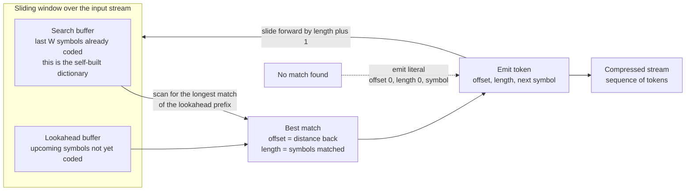

# 🗜️ Universal Compression and Lempel-Ziv

> [!abstract] TL;DR
> **Universal compression** squeezes data *without knowing its statistics in advance* — it learns the structure of the source as it reads. This is the opposite of **Huffman** or **arithmetic coding**, which first demand a probability model. The **Lempel-Ziv (LZ)** family is the dominant universal method: it replaces repeated substrings with short *back-references*, building its own dictionary on the fly. **LZ77** (1977) uses a *sliding window* — a search buffer of recently seen text plus a lookahead buffer — and emits tokens of the form *offset, length, next-symbol* that point back to the longest previous match. **LZ78/LZW** build an explicit growing dictionary of phrases instead. Remarkably, LZ is *asymptotically optimal*: it approaches the entropy rate of **any** stationary ergodic source, though it was never told what that source was. Nearly every general-purpose compressor you use — gzip, PNG, ZIP, Zstandard, 7-Zip, Brotli — is LZ at its core.

---

## Intuition

**Analogy — "the thing I said 40 characters ago."** Imagine you are transcribing a long speech, and the speaker keeps repeating whole phrases. Instead of writing *"ladies and gentlemen"* out in full every time, after the first occurrence you invent a shorthand: *"repeat the 20-letter chunk I wrote 300 words back."* You are not compressing because you studied a dictionary of English beforehand — you are compressing because you *noticed a repeat while writing* and pointed backward at it. The dictionary of useful phrases builds itself out of the text you have already seen.

That backward pointer is the whole idea of Lempel-Ziv. When the encoder is about to emit some text, it first asks: *have I seen this run of symbols before, recently?* If yes, rather than spelling it out, it emits a tiny reference — *"go back `offset` symbols and copy `length` of them"* — followed by the one new symbol that broke the match. Crucially, the decoder can replay this perfectly, because it has already reconstructed the exact same past. Compression happens by **exploiting repetition**, and repetition is discovered *adaptively*, with **zero prior knowledge of the symbol probabilities**.

This is why LZ is called **universal**: it works on English, DNA, machine code, or JSON with no retuning, because "find and reuse repeats" is a statistics-agnostic strategy. Where [[Entropy_and_Information_Content|entropy coding]] needs you to *hand it a model*, LZ *discovers the model* — and discovering repeated structure turns out to be the same thing as learning the source.

---

## How It Works

### 1. Two philosophies of lossless compression

| Approach | What it needs up front | Example |
|---|---|---|
| **Statistical / entropy coding** | A probability model $p(x)$ for symbols | Huffman, arithmetic / range coding |
| **Dictionary / universal coding** | *Nothing* — it learns as it reads | LZ77, LZ78, LZW |

Entropy coders assign short codes to probable symbols and long codes to rare ones — but you must *know or estimate the probabilities first*, and they compress symbol-by-symbol. LZ instead attacks **repetition across many symbols at once**, and needs no model. In practice the two are complementary and get **stacked** (see §6).

### 2. LZ77 — the sliding window (Ziv & Lempel, 1977)

LZ77 keeps a fixed-size window sliding over the input, split into two regions:

- **Search buffer** — the last $W$ symbols already encoded. This *is* the dictionary: everything you might point back to.
- **Lookahead buffer** — the next few symbols, not yet encoded, which you are trying to match.

The core loop:

1. Take the current position. Look at the prefix of the **lookahead buffer**.
2. Scan the **search buffer** for the **longest match** of that prefix.
3. Emit a token: `(offset, length, next-symbol)` where `offset` = how far back the match starts, `length` = how many symbols matched, and `next-symbol` = the first symbol that *broke* the match.
4. Slide the window forward by `length + 1` and repeat.

If there is no match, you emit `(0, 0, symbol)` — a literal. Including the `next-symbol` in every token guarantees forward progress even when nothing matches. A neat subtlety: a match may **overlap into the lookahead** — the token `(1, 4, ...)` on `aaaa…` copies a symbol that is itself being produced, giving run-length behavior for free.

The decoder is trivially fast and needs *no dictionary of its own*: it has already rebuilt the identical past, so "go back `offset`, copy `length`" always resolves.

### 3. LZ sliding-window diagram



### 4. LZ78 and LZW — the explicit dictionary

Instead of a sliding window of raw text, **LZ78** (Ziv & Lempel, 1978) maintains an **explicit dictionary of phrases** that grows as it reads. Each output token is `(index, next-symbol)`: point at a dictionary entry, then add one new symbol — and that *concatenation* becomes a brand-new dictionary entry. The dictionary naturally accumulates longer and longer phrases.

**LZW** (Welch, 1984) is the polished, patent-famous variant: it *pre-seeds* the dictionary with all single symbols and emits **only indices** (no explicit next-symbol), inferring new entries from context. It is simple, fast, and was everywhere in the late 1980s — **GIF**, the UNIX `compress` utility, and **TIFF** all use LZW. Its Unisys/IBM **patents** (expired by 2004) triggered the "GIF licensing" controversy and directly motivated the creation of the royalty-free **PNG** format, which uses patent-free DEFLATE instead.

### 5. Why it is *universal* (the deep guarantee)

The stunning theoretical result: **LZ compressors are asymptotically optimal.** For *any* stationary ergodic source, the number of bits per symbol produced by LZ78/LZW converges to the source's **entropy rate** $H(\mathcal{X})$ — the true information content per symbol — **as the input length grows to infinity, without the algorithm ever being told the source distribution.**

$$\lim_{n\to\infty} \frac{1}{n}\,\ell_{\text{LZ}}(x_1^n) = H(\mathcal{X}) \quad \text{(a.s., for stationary ergodic sources)}$$

Compare this to [[Entropy_and_Information_Content|Shannon's source coding theorem]], which says $H$ is the *floor* but assumes you *know* the distribution to build the optimal code. LZ *reaches the same floor while learning the distribution from the data itself*. That is what "universal" means, and it is why a single unmodified algorithm compresses text, images, and genomes near-optimally.

### 6. Modern compressors stack LZ with entropy coding

Real-world compressors combine the two philosophies — LZ to kill repetition, then an entropy coder to squeeze the residual token stream:

| Compressor | Recipe | Where you meet it |
|---|---|---|
| **DEFLATE** | LZ77 + Huffman coding | ZIP, gzip, **PNG**, zlib, HTTP `Content-Encoding: gzip` |
| **Zstandard (zstd)** | LZ + **ANS/FSE** entropy coding + large windows + dictionaries | Facebook/Meta; Linux kernel, btrfs, many CDNs |
| **LZMA / 7-Zip** | LZ77 with huge windows + range coding + context modeling | `.7z`, `.xz` |
| **Brotli** | LZ77 + Huffman + a built-in static dictionary of web strings | Web fonts, HTTP compression in browsers |
| **bzip2** | **BWT** (Burrows-Wheeler) + move-to-front + Huffman — *not* LZ | `.bz2` |

DEFLATE's design — "LZ77 finds the repeats, Huffman shortens the tokens" — has been the workhorse of the internet for 30 years. Note that **bzip2 is the odd one out**: it uses the **Burrows-Wheeler Transform**, a block-sorting alternative that clusters similar contexts, then entropy-codes; it often beats DEFLATE on ratio but is slower and non-streaming.

### 7. The knobs — window size, dictionary size, speed

Every LZ compressor trades three quantities:

- **Window / dictionary size** — a bigger search buffer finds matches that are *further apart*, raising the ratio, but each search costs more time and memory. LZMA uses windows up to gigabytes; gzip's is a modest 32 KB.
- **Match search effort** — finding the *longest* match is the expensive step. Fast modes use hash chains and give up early ("greedy"); slow modes do "optimal parsing" for a better ratio.
- **Compression vs decompression asymmetry** — LZ *decompression is always cheap* (just follow pointers), which is why it dominates read-heavy workloads: you compress a package once and decompress it a million times.

---

## Key Concepts

### Secondary (intuitive level)
- **Compression = removing repetition.** LZ replaces a repeated chunk with a short "copy the thing I saw earlier" pointer.
- **It learns as it goes.** Unlike a code that needs a frequency table first, LZ builds its own dictionary out of the text it has already read — that is what **universal** means.
- **You use it constantly.** Every ZIP file, PNG image, and gzipped web page is Lempel-Ziv under the hood.

### Undergraduate (working level)
- **LZ77 token:** `(offset, length, next-symbol)` — a back-reference into a **sliding window** (search buffer + lookahead buffer). No match ⇒ a literal `(0, 0, symbol)`.
- **LZ78/LZW:** build an **explicit growing dictionary** of phrases; emit `(index, next-symbol)` or bare indices (LZW). Used in GIF, `compress`, TIFF.
- **Greedy longest-match parsing** and its cost; overlapping matches give run-length encoding for free.
- **DEFLATE = LZ77 + Huffman.** The residual tokens still have skewed statistics, so an entropy coder finishes the job.
- **The window is the dictionary.** Bigger window ⇒ better ratio, more time/memory.

### Graduate (theoretical level)
- **Universality theorem:** LZ78/LZW achieve the **entropy rate** $H(\mathcal{X}) = \lim_n \tfrac{1}{n}H(X_1,\dots,X_n)$ of any **stationary ergodic** source, almost surely, without prior knowledge of the distribution — the individual-sequence and probabilistic optimality results of Ziv & Lempel and Wyner–Ziv.
- **Parsing as phrase counting:** LZ78 partitions the string into *distinct* phrases; the number of phrases $c(n)$ bounds the code length, and $\tfrac{c(n)\log c(n)}{n}\to H$.
- **Connection to Kolmogorov complexity:** the shortest description of a string is its algorithmic complexity $K(x)$; LZ is a *computable, one-pass approximation* to incompressibility. A string LZ cannot shrink is, empirically, "random-looking."
- **Compression as prediction/learning:** by the source coding theorem, an optimal code length is $-\log_2 p(x)$; therefore *a good compressor is a good predictor and vice versa*. Modern language models make this literal — an LLM's next-token distribution defines an arithmetic code, and "bits-per-character" is just log-loss. LZ's dictionary is a crude, non-parametric version of the same idea.
- **Alternatives on the frontier:** **grammar-based codes** (e.g. Sequitur, Re-Pair) infer a context-free grammar whose only derivation is the string; **BWT** (bzip2) achieves compression by block-sorting rotations rather than referencing.

---

## Python Demo

```python
# A minimal LZ77 encoder + decoder, demonstrating UNIVERSAL compression:
# it exploits repetition WITHOUT knowing symbol probabilities in advance.
# We (1) encode a repetitive string into (offset, length, next-char) tokens,
# (2) verify lossless round-trip, (3) measure the compression ratio, and
# (4) plot how the ratio grows as the input becomes more redundant.
import numpy as np
import matplotlib.pyplot as plt


def lz77_encode(text, window=256, lookahead=15):
    """Greedy LZ77. Returns a list of (offset, length, next_char) tokens.

    offset = distance back into the search buffer where the match starts,
    length = number of matched symbols, next_char = the symbol that broke it.
    A literal is (0, 0, char). No probability model is used anywhere."""
    tokens, i, n = [], 0, len(text)
    while i < n:
        best_len, best_off = 0, 0
        start = max(0, i - window)
        max_len = min(lookahead, n - i)          # cannot match past the input
        for j in range(start, i):                # scan the search buffer
            length = 0
            # allow the match to overlap into the lookahead (run-length trick)
            while length < max_len and text[j + length] == text[i + length]:
                length += 1
            if length > best_len:
                best_len, best_off = length, i - j
        nxt = text[i + best_len] if i + best_len < n else ""   # trailing symbol
        tokens.append((best_off, best_len, nxt))
        i += best_len + 1
    return tokens


def lz77_decode(tokens):
    """Reconstruct the original string from LZ77 tokens (proves it is lossless)."""
    out = []
    for off, length, nxt in tokens:
        start = len(out) - off
        for k in range(length):                  # copy symbol-by-symbol so
            out.append(out[start + k])            # overlapping copies work
        if nxt:
            out.append(nxt)
    return "".join(out)


def compressed_bits(tokens, window=256, lookahead=15):
    """Fixed-width token cost: bits for offset + bits for length + 8-bit char."""
    off_bits = max(1, int(np.ceil(np.log2(window + 1))))
    len_bits = max(1, int(np.ceil(np.log2(lookahead + 1))))
    return len(tokens) * (off_bits + len_bits + 8)


# --- 1. Encode a repetitive string and show it is lossless -----------------
sample = "abracadabra_abracadabra_abracadabra_abracadabra"
toks = lz77_encode(sample)
assert lz77_decode(toks) == sample, "round-trip must be lossless"

orig_bits = len(sample) * 8
comp_bits = compressed_bits(toks)
print(f"input                : {sample!r}")
print(f"length               : {len(sample)} chars = {orig_bits} bits")
print(f"tokens ({len(toks)})          : {toks[:6]} ...")
print(f"compressed           : {comp_bits} bits")
print(f"compression ratio    : {orig_bits / comp_bits:.2f}x  "
      f"(and it never saw the letter frequencies)")


# --- 2. Compression ratio vs input redundancy ------------------------------
def make_string(n, redundancy, block_len=8, alphabet=4, seed=0):
    """Build a length-n string whose repetitiveness is controlled by
    `redundancy` in [0,1]: a random motif is tiled, then a fraction
    (1 - redundancy) of positions is overwritten with fresh random noise."""
    rng = np.random.default_rng(seed)
    alpha = np.array(list("ACGT"))[:alphabet]
    motif = rng.integers(0, alphabet, block_len)
    tiled = np.tile(motif, n // block_len + 1)[:n]
    s = alpha[tiled].copy()
    noise_mask = rng.random(n) > redundancy          # keep with prob=redundancy
    noise = alpha[rng.integers(0, alphabet, n)]
    s[noise_mask] = noise[noise_mask]
    return "".join(s)


redundancies = np.linspace(0.0, 1.0, 11)
ratios = []
for r in redundancies:
    s = make_string(600, r)
    t = lz77_encode(s)
    ratios.append((len(s) * 8) / compressed_bits(t))

fig, ax = plt.subplots(1, 2, figsize=(11, 4))

ax[0].plot(redundancies, ratios, "o-", color="#2563eb", lw=2)
ax[0].axhline(1.0, ls="--", color="gray", label="break-even (ratio = 1)")
ax[0].set_title("LZ77 exploits redundancy it discovers on its own")
ax[0].set_xlabel("input redundancy (0 = random, 1 = pure repetition)")
ax[0].set_ylabel("compression ratio (higher = smaller file)")
ax[0].legend()

# token count shrinks as redundancy rises: fewer, longer matches
counts = [len(lz77_encode(make_string(600, r))) for r in redundancies]
ax[1].plot(redundancies, counts, "s-", color="#16a34a", lw=2)
ax[1].set_title("Fewer tokens as matches get longer")
ax[1].set_xlabel("input redundancy")
ax[1].set_ylabel("number of LZ77 tokens for 600 chars")

plt.tight_layout()
plt.show()

# Expected (approx):
# - random data (r=0): ratio < 1  -> LZ can even EXPAND incompressible input
# - pure repetition (r=1): ratio climbs sharply as one token covers many chars
```

The demo makes the universality point tangible: `lz77_encode` contains **no frequency table, no training, no probabilities** — yet as `redundancy` rises, the ratio climbs because matches grow longer and the token count collapses. On truly random input (`r = 0`) the ratio dips *below 1*: with nothing to reference, the token overhead makes the output *larger* — a concrete reminder that no compressor beats entropy.

---

## Real-World Applications

- **The entire ZIP / gzip ecosystem.** DEFLATE (LZ77 + Huffman) powers `.zip`, `gzip`, zlib, HTTP response compression, and the compressed data chunks inside **PNG**. It has been the internet's default lossless codec for three decades.
- **PNG vs GIF — a compression history lesson.** GIF used **LZW**, which was patent-encumbered by Unisys/IBM; the resulting licensing furor in the mid-1990s directly spurred the creation of **PNG**, built on patent-free DEFLATE. TIFF and the old UNIX `compress` also rode on LZW.
- **Zstandard everywhere.** Meta's **zstd** (LZ + ANS entropy coding + large windows + trained dictionaries) now compresses the Linux kernel, `btrfs`/`zfs` filesystems, package managers, and countless CDNs, hitting gzip-beating ratios at far higher speed.
- **Archivers and packages.** **LZMA / 7-Zip** (`.7z`, `.xz`) use enormous LZ windows plus range coding for maximum ratio on software distribution; **Brotli** ships a static dictionary of common web strings for fast font and asset delivery in browsers.
- **Genomics and logs.** Because LZ is *universal*, the same tools compress DNA (`ACGT` streams), server logs, and telemetry with no retuning — highly repetitive machine-generated data is exactly where back-references shine.
- **LLMs as compressors.** The prediction–compression equivalence is now literal: research (e.g. DeepMind's "Language Modeling Is Compression") shows large models turned into arithmetic coders **beat gzip and PNG** on their own modalities, because a better next-symbol predictor is a better compressor. See [[Language_Model_Basics]] and [[GPT_Family]].

---

## Common Pitfalls

- **"LZ needs a probability model."** It does not — that is the whole point. Confusing it with Huffman/arithmetic coding (which *do*) misses the universal, adaptive nature of dictionary coding.
- **Expecting compression on random or already-compressed data.** LZ can only exploit repetition. Feeding it encrypted, random, or already-gzipped bytes yields ratio ≤ 1 and often *expansion* from token overhead. Double-zipping a ZIP saves nothing.
- **Ignoring the window/dictionary limit.** LZ77 can only reference matches *inside the window*. Repeats farther apart than the window (e.g. 32 KB in gzip) are invisible — which is exactly why LZMA and zstd offer much larger windows for big, long-range-redundant files.
- **Forgetting the entropy-coding stage.** Raw LZ tokens are *not* the final bytes in real formats. DEFLATE, zstd, and LZMA all follow LZ with Huffman/ANS/range coding; comparing "just LZ77" against gzip is unfair.
- **Mishandling overlapping matches in a decoder.** A token like `(1, 5, ...)` copies symbols that are *still being written*. Decoding must copy **one symbol at a time**, not `memcpy` a fixed block, or run-length matches corrupt.
- **Assuming LZ is always the ratio champion.** For some data, **BWT** (bzip2) or grammar-based codes compress better; LZ wins on the *speed–ratio–simplicity* balance and on cheap decompression, not on maximal ratio alone.

---

## Related Concepts

- [[Entropy_and_Information_Content]] — defines the **entropy** (and entropy rate) that LZ provably converges to; the theoretical floor that universal compression reaches *without knowing the distribution*.
- [[Suffix_Tree]] — the data structure that finds **longest repeated substrings** in linear time; conceptually, LZ's "longest previous match" search is exactly a suffix-structure query, and suffix automata are used to *speed up* LZ parsing.
- [[Suffix_Array]] — a compact alternative to the suffix tree used inside optimal-parsing LZ compressors to locate matches quickly.
- [[Trie]] — LZ78/LZW's growing phrase dictionary is naturally stored as a trie, one node per dictionary entry.
- [[String_Matching_Overview]] — LZ's inner loop is a longest-match string-search problem; the same match-finding machinery (hashing, automata) reappears here.
- [[Language_Model_Basics]] — makes the compression-is-prediction equivalence concrete: cross-entropy loss *is* bits-per-symbol, so a better predictor is a better compressor.
- [[GPT_Family]] — large autoregressive models are, formally, near-optimal universal compressors when paired with arithmetic coding.

---

## Review Questions

**Tier 1 — Conceptual (explain to a peer):**
1. In one or two sentences, what does it mean for a compressor to be *universal*, and why is Lempel-Ziv universal while Huffman coding is not?
2. Walk through what the three fields of an LZ77 token — `offset`, `length`, `next-symbol` — each mean, and explain why the `next-symbol` is always included even after a long match.

**Tier 2 — Applied (compute / reason):**
3. Encode the string `"aaaaaa"` by hand with LZ77 (assume an empty initial search buffer). Show the tokens and explain how an *overlapping* match lets a single token cover most of the string. What would gzip's downstream Huffman stage add on top?
4. You must compress 10 GB of server logs where identical error messages recur megabytes apart. gzip (32 KB window) gives a poor ratio. Explain *mechanically* why, and which knob in LZMA or zstd fixes it — and what you pay for it.

**Tier 3 — Theoretical (deep understanding):**
5. State the universality theorem for LZ78 precisely (what class of sources, what quantity it converges to). How does this relate to, yet crucially differ from, Shannon's source coding theorem, which also names the entropy rate as the limit?
6. Explain the claim "a good compressor is a good predictor, and vice versa." Derive the link through the code length $-\log_2 p(x)$, and use it to argue why a large language model can outperform gzip as a *lossless* compressor. How does this connect LZ to Kolmogorov complexity?

---

## Sources

- Ziv, J. & Lempel, A. (1977). *A Universal Algorithm for Sequential Data Compression.* IEEE Transactions on Information Theory, 23(3), 337–343. (LZ77)
- Ziv, J. & Lempel, A. (1978). *Compression of Individual Sequences via Variable-Rate Coding.* IEEE Transactions on Information Theory, 24(5), 530–536. (LZ78, universality)
- Welch, T. A. (1984). *A Technique for High-Performance Data Compression.* IEEE Computer, 17(6), 8–19. (LZW)
- Cover, T. M. & Thomas, J. A. (2006). *Elements of Information Theory* (2nd ed.), Wiley. Chapter 13, "Universal Source Coding."
- Deutsch, P. (1996). *DEFLATE Compressed Data Format Specification v1.3.* RFC 1951. [ietf.org/rfc/rfc1951](https://www.rfc-editor.org/rfc/rfc1951)
- Delétang, G. et al. (2024). *Language Modeling Is Compression.* ICLR. [arXiv:2309.10668](https://arxiv.org/abs/2309.10668)

---

#information-theory #lempel-ziv #lz77 #universal-compression #dictionary-coding
