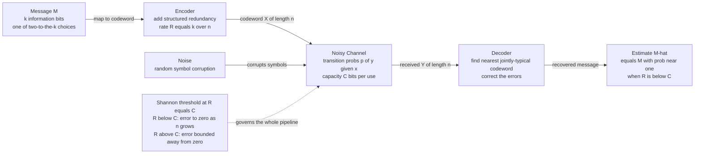

# 📶 Channel Capacity and the Noisy Channel Coding Theorem

> [!abstract] TL;DR
> Every noisy communication channel has a single number — its **capacity** $C = \max_{p(x)} I(X;Y)$ bits per use — that acts as a hard speed limit for *reliable* communication. Shannon's **noisy channel coding theorem** (1948) makes the shocking claim that this limit is achievable: for **any** rate $R < C$ there exist codes whose error probability can be driven **arbitrarily close to zero** as the block length grows, while for **any** rate $R > C$ the error probability is bounded away from zero no matter what you do. Reliable communication over an *unreliable* channel is possible without slowing to zero rate — you just add the right redundancy. The catch: Shannon proved good codes *exist* but not how to build them, launching a 50-year search that ended with LDPC, turbo, and polar codes now operating within a fraction of a decibel of the limit in every modem, Wi-Fi radio, 5G phone, SSD, and deep-space probe.

---

## Intuition

**Analogy — talking across a noisy room.** You are at a loud party trying to tell a friend a phone number across the room. Shout each digit once and the din will garble some of them — your friend hears noise. So you do what everyone does instinctively: you *repeat* yourself, spell things out ("five, as in five-five-five"), and speak slowly. Each of those tricks is **redundancy** — extra structure that lets the listener reconstruct what you meant even when parts are lost. Speak slowly enough and add enough redundancy, and your friend can recover the number essentially *perfectly*, despite the noise.

Shannon's stunning discovery was that this everyday intuition has a **precise, hard limit**. There is a maximum *information rate* — call it the room's **capacity** — at which you can talk. As long as your true information rate stays **below** that limit, clever enough redundancy lets your friend understand you with essentially **zero** errors. But push your rate **above** the limit — try to cram in more information per second than the noisy room allows — and no amount of cleverness can save you; a stubborn fraction of your message will always be lost.

The counterintuitive part is the sharpness. It is not a gentle "the noisier it gets, the more errors you make." It is a **cliff**: below the limit, arbitrarily reliable; above it, hopeless. And crucially, the limit is *not* zero — a noisy channel still carries a healthy positive rate of perfect information. That single insight turned "fighting noise" from a hopeless analog struggle into a solvable digital engineering problem.

---

## How It Works

### 1. The central problem of reliable communication

Every physical link — a copper wire, a fiber, free-space radio, a magnetic platter, a flash cell — corrupts what you send. The engineering question Shannon posed in *A Mathematical Theory of Communication* (see [[Information_Theory_Overview]]) is: **how fast can we send information over such a link with an error rate we can make as small as we like?** The naive answer before 1948 was "repeat everything many times and slow down toward zero rate." Shannon proved that answer is wrong — you can hold a **fixed positive rate** and still make errors vanish.

### 2. The channel model — a probabilistic map

A **discrete memoryless channel (DMC)** is defined by an input alphabet $\mathcal{X}$, an output alphabet $\mathcal{Y}$, and a set of **transition probabilities** $p(y \mid x)$ — the probability of receiving symbol $y$ given that symbol $x$ was sent. "Memoryless" means each use of the channel is corrupted independently. The channel is *the noise*, expressed as a conditional distribution; the sender controls only the input distribution $p(x)$.

Two canonical channels do most of the pedagogical work (developed fully in the forthcoming sibling *Discrete Channels and the Binary Symmetric Channel*):

- **Binary Symmetric Channel (BSC)** with crossover probability $p$: each transmitted bit is independently flipped with probability $p$. Transition matrix: $p(0\mid 1) = p(1\mid 0) = p$, and $p(0\mid 0)=p(1\mid 1)=1-p$. Its capacity is $\boxed{C = 1 - H(p)}$ bits per use, where $H(p) = -p\log_2 p - (1-p)\log_2(1-p)$ is the binary entropy function from [[Entropy_and_Information_Content]].
- **Binary Erasure Channel (BEC)** with erasure probability $\varepsilon$: each bit either arrives intact or is replaced by an "erasure" symbol `?` (with probability $\varepsilon$), but is **never flipped**. Because the receiver *knows which* symbols were lost, this channel is far friendlier: $\boxed{C = 1 - \varepsilon}$ bits per use.

The BSC and BEC bracket intuition: a flip is worse than an erasure, because a flip is an error you do not know you made.

### 3. Channel capacity — the maximum mutual information

**Mutual information** $I(X;Y) = H(X) - H(X\mid Y) = H(Y) - H(Y\mid X)$ measures how much uncertainty about the input $X$ is *removed* by observing the output $Y$ — the information that actually survives the crossing (see the forthcoming sibling *Joint, Conditional Entropy, and Mutual Information*). It depends on **both** the channel $p(y\mid x)$ (fixed by physics) **and** the input distribution $p(x)$ (chosen by the engineer). The **channel capacity** is the best you can do by optimizing the input:

$$C \;=\; \max_{p(x)} \, I(X;Y) \qquad \text{bits per channel use.}$$

For a symmetric channel like the BSC, the optimizing input is uniform ($p(0)=p(1)=\tfrac12$), giving $C = 1 - H(p)$. Capacity has two faces:

- **Information-theoretic definition:** the maximum mutual information (above).
- **Operational meaning:** the maximum **rate** — information bits per channel use — at which reliable communication is possible.

Shannon's theorem is precisely the astonishing statement that these two numbers, defined so differently, are **equal**.

### 4. Rate, codes, and block length

A **block code** of length $n$ and rate $R$ maps each of $2^{nR}$ possible messages to a distinct length-$n$ **codeword** drawn from $\mathcal{X}^n$. The **rate** $R = \tfrac{k}{n}$ (information bits $k$ per channel symbol $n$) measures efficiency — how much of each transmitted symbol is payload versus redundancy. A rate-$\tfrac12$ code spends one redundant symbol for every information symbol. The decoder observes the noisy length-$n$ output and guesses which message was sent; a **block error** occurs when it guesses wrong.

### 5. The Noisy Channel Coding Theorem

> **Theorem (Shannon, 1948).** For a discrete memoryless channel with capacity $C$:
> - **(Achievability)** For every rate $R < C$ and every $\epsilon > 0$, there exists a block length $n$ and a rate-$R$ code whose average block-error probability is below $\epsilon$. As $n \to \infty$, the error probability can be made to vanish.
> - **(Converse)** For every rate $R > C$, the block-error probability is bounded away from zero for *all* codes; it cannot be made arbitrarily small. (The **strong converse** goes further: for $R > C$ the error probability actually tends to **1** as $n \to \infty$.)

This is a **sharp threshold** — a phase transition at $R = C$. Below the line, arbitrarily reliable; above it, hopeless. The practical payoff is exactly the party analogy made rigorous: noise does **not** force your rate to zero. It only caps it at $C$.

### 6. Why it is true — the proof ideas

**Achievability (random coding + joint typicality).** Shannon's genius was to *not design a clever code at all*. Instead he analyzed the **average** performance of a code whose $2^{nR}$ codewords are chosen **completely at random**. The Asymptotic Equipartition Property (AEP) says a transmitted codeword and its noisy output are, with overwhelming probability, **jointly typical** — they land in a small, structured region of size about $2^{nH(X,Y)}$. A decoder that simply looks for the *unique* codeword jointly typical with what it received fails only if some *other* random codeword also happens to look typical with the output. The number of output-typical sequences is about $2^{nH(Y)}$, and each wrong codeword is jointly typical with the output with probability about $2^{-nI(X;Y)}$. Union-bounding over the $2^{nR}$ codewords, the total confusion probability is about $2^{nR} \cdot 2^{-nI(X;Y)} = 2^{-n(I(X;Y) - R)}$, which $\to 0$ exactly when $R < I(X;Y) \le C$. Since the *average* random code is this good, at least one *specific* good code must exist.

**Converse (Fano's inequality).** The impossibility half rests on **Fano's inequality**, a cornerstone bound (developed in the forthcoming sibling *Information Inequalities and the Data Processing Inequality*). Fano quantifies the intuition that *you cannot recover more information than the channel let through*: if the decoder's error probability is $P_e$, then the residual uncertainty about the message obeys $H(\text{message} \mid \text{output}) \le 1 + P_e \cdot nR$. Chaining this with the data-processing inequality forces $R \le C + \tfrac{1}{n} + P_e R$. As $n \to \infty$, if $R > C$ then $P_e$ **cannot** go to zero — the algebra simply forbids it.

Notice the asymmetry of the proof: achievability is a **non-constructive existence** argument (random codes work *on average*), while the converse is a hard information-theoretic **impossibility**. This gap is the whole story of the next 50 years.

### 7. Flow / architecture



The encoder **adds** redundancy; the channel **destroys** some of it with noise; the decoder **uses** the surviving structure to undo the damage. Everything hinges on which side of $C$ your rate $R$ sits.

### 8. The gap between existence and practice

Shannon told engineers that near-perfect codes *exist* for any $R < C$ — but his proof used random codes of astronomical block length with brute-force decoding that is computationally infeasible (checking $2^{nR}$ candidates). For decades practical codes (Hamming, Reed–Muller, BCH, Reed–Solomon, convolutional) sat a discouraging **several decibels** away from the Shannon limit. The gap only closed in the 1990s–2000s with **turbo codes** (Berrou et al., 1993) and the rediscovery of **LDPC codes** (Gallager 1962, revived by MacKay–Neal), whose sparse graph structure admits near-linear-time iterative "belief propagation" decoding — reaching within ~0.1 dB of capacity. **Polar codes** (Arıkan, 2009) were the first *provably* capacity-achieving construction with an explicit, low-complexity decoder. This is the subject of the forthcoming sibling *Modern Codes: LDPC, Turbo, and Polar*.

### 9. Block length, latency, and feedback

- **Block length is the price of reliability.** The error probability vanishes only as $n \to \infty$; finite-length codes (quantified by *channel dispersion* and the normal approximation, Polyanskiy–Poor–Verdú 2010) pay a rate penalty and add **latency** — you must wait for a whole block before decoding. Rate, reliability, and delay form an irreducible three-way trade-off.
- **Feedback does not raise capacity** (for a memoryless channel). Even if the transmitter perfectly observes every received symbol, the capacity of a DMC stays exactly $C = \max_{p(x)} I(X;Y)$. Feedback can dramatically **simplify coding** and improve the finite-length error exponent, but it cannot buy you a single extra bit of asymptotic rate. This surprising result underscores that capacity is a property of the channel, not of the protocol.

---

## Key Concepts

### Secondary (intuitive level)
- **Redundancy beats noise.** Repeating and spelling out a message lets a listener recover it despite a noisy room — that is what a code does.
- **Capacity is a speed limit.** Each noisy channel has a top *information* speed. Stay under it and you can be understood almost perfectly; go over it and errors are unavoidable.
- **The limit is a cliff, not a slope.** Just below capacity: essentially error-free. Just above: hopeless. The change is sharp.
- **Noise does not mean zero speed.** A noisy channel still carries a positive, useful rate of perfect information.

### Undergraduate (working level)
- **Channel model:** a DMC is a conditional distribution $p(y\mid x)$ with transition probabilities; memoryless = each use independent.
- **Capacity:** $C = \max_{p(x)} I(X;Y)$ bits per use; for the BSC, $C = 1 - H(p)$; for the BEC, $C = 1 - \varepsilon$.
- **Rate:** $R = k/n$; a rate-$R$ block code has $2^{nR}$ codewords of length $n$.
- **The theorem:** reliable communication is possible iff $R < C$; the error probability $\to 0$ (below $C$) or is bounded away from $0$ (above $C$).
- **Two meanings of $C$** — maximum mutual information *and* maximum reliable rate — are equal (this equality *is* the theorem).
- **Existence vs construction:** Shannon proved good codes exist (random coding) but not how to build efficiently decodable ones.

### Graduate (theoretical level)
- **Achievability via joint typicality and the AEP:** average error over random codebooks $\to 0$ when $R < I(X;Y)$; maximize input distribution to reach $C$.
- **Converse via Fano's inequality + data-processing:** $nR \le nC + 1 + P_e nR$ forces $P_e \not\to 0$ for $R > C$; the **strong converse** gives $P_e \to 1$.
- **Random coding error exponent** $E_r(R) = \max_{0\le\rho\le1}[E_0(\rho) - \rho R]$ (Gallager), with $P_e \le 2^{-nE_r(R)}$; $E_r(R) > 0 \iff R < C$, quantifying how fast reliability improves with $n$.
- **Finite blocklength regime:** channel dispersion $V$ and the normal approximation $\log_2 M \approx nC - \sqrt{nV}\,Q^{-1}(\epsilon)$ (Polyanskiy–Poor–Verdú) refine the asymptotic threshold.
- **Feedback capacity:** equals $C$ for a DMC; can strictly help only with memory or in multi-user settings.
- **Continuous channels:** the AWGN channel gives $C = \tfrac12\log_2(1 + \mathrm{SNR})$ and, band-limited, the Shannon–Hartley formula $C = B\log_2(1 + S/N)$ — see the forthcoming sibling *The Gaussian Channel and Shannon–Hartley*.
- **Network information theory:** capacity generalizes to *regions* (multiple-access, broadcast, relay), where single-letter formulas and converses become far subtler.

---

## Python Demo

```python
# The noisy-channel coding theorem as a PHASE TRANSITION at R = C.
# Binary Symmetric Channel (BSC) with crossover probability p:
#   capacity  C = 1 - H(p)   bits per channel use.
# We show two things with numpy/matplotlib only:
#   (1) Capacity C(p) vs noise level p  -> the V-shaped speed limit.
#   (2) Best achievable block-error probability vs code rate R, for growing
#       block length n, using Gallager's random-coding error exponent E_r(R):
#           P_e_bound(n, R) = min(1, 2^(-n * E_r(R))).
#       Below C the curves plunge to ~0 as n grows; at/above C, E_r = 0 so the
#       bound pins at 1 (matching the strong converse P_e -> 1). That cliff
#       at R = C IS Shannon's threshold.
import numpy as np
import matplotlib.pyplot as plt


def Hb(p):
    """Binary entropy function in bits (0*log0 := 0 at the endpoints)."""
    p = np.clip(p, 1e-12, 1 - 1e-12)
    return -(p * np.log2(p) + (1 - p) * np.log2(1 - p))


def capacity_bsc(p):
    """BSC capacity: C = 1 - H(p) bits per use."""
    return 1.0 - Hb(p)


def E0(rho, p):
    """Gallager's E0(rho) for a BSC with the optimal (uniform) input, in bits."""
    a = (1 - p) ** (1.0 / (1 + rho)) + p ** (1.0 / (1 + rho))
    return rho - (1 + rho) * np.log2(a)


# Random-coding exponent E_r(R) = max_{rho in [0,1]} [E0(rho) - rho*R], clipped at 0.
rho_grid = np.linspace(1e-6, 1.0, 400)


def Er(R, p, E0_grid):
    return max(0.0, float(np.max(E0_grid - rho_grid * R)))


# ---- Pick a channel: p = 0.11 gives capacity almost exactly 0.5 bits/use ----
p = 0.11
C = capacity_bsc(p)
E0_grid = E0(rho_grid, p)
print(f"BSC crossover p = {p} -> capacity C = 1 - H(p) = {C:.4f} bits/use")

# (1) Capacity vs noise level p over the full range [0, 1].
p_axis = np.linspace(0.0, 1.0, 400)
C_axis = capacity_bsc(p_axis)

# (2) Achievable error probability vs rate R, for several block lengths n.
R_axis = np.linspace(0.01, 0.99, 300)
Er_axis = np.array([Er(R, p, E0_grid) for R in R_axis])
block_lengths = [16, 64, 256, 1024]

# Report the sharpening cliff at two rates straddling capacity.
for R_test in (0.40, 0.60):
    tag = "below C" if R_test < C else "above C"
    pe = min(1.0, 2.0 ** (-1024 * Er(R_test, p, E0_grid)))
    print(f"R = {R_test} ({tag}): P_e bound at n=1024 = {pe:.2e}")

# ---- Plots ----
fig, ax = plt.subplots(1, 2, figsize=(12, 4.5))

# Left: the capacity speed limit, symmetric V with a floor of 0 at p = 0.5.
ax[0].plot(p_axis, C_axis, color="#2563eb", lw=2)
ax[0].axvline(0.5, ls="--", color="gray")
ax[0].scatter([0.5], [0.0], color="red", zorder=5, label="useless channel: C = 0 at p = 0.5")
ax[0].scatter([p], [C], color="green", zorder=5, label=f"p = {p}: C = {C:.2f}")
ax[0].set_title("BSC capacity  C = 1 - H(p)  vs noise level")
ax[0].set_xlabel("crossover probability p")
ax[0].set_ylabel("capacity C (bits/use)")
ax[0].legend()

# Right: the phase transition -- error waterfall sharpens toward the cliff at R = C.
for n in block_lengths:
    Pe = np.minimum(1.0, 2.0 ** (-n * Er_axis))
    ax[1].plot(R_axis, Pe, lw=2, label=f"n = {n}")
ax[1].axvline(C, ls="--", color="black")
ax[1].text(C + 0.01, 0.55, "capacity C", rotation=90, va="center")
ax[1].axvspan(C, 1.0, color="red", alpha=0.08)
ax[1].text((C + 1) / 2, 0.9, "R > C\nreliable comm.\nimpossible",
           ha="center", va="center", fontsize=9)
ax[1].set_title("Error probability vs rate: the threshold at R = C")
ax[1].set_xlabel("code rate R (bits/use)")
ax[1].set_ylabel("achievable block-error probability")
ax[1].legend(title="block length")

plt.tight_layout()
plt.show()

# Expected output (approximately):
# BSC crossover p = 0.11 -> capacity C = 1 - H(p) = 0.5000 bits/use
# R = 0.4 (below C): P_e bound at n=1024 = 0.00e+00   (errors crushed to ~0)
# R = 0.6 (above C): P_e bound at n=1024 = 1.00e+00   (errors bounded away from 0)
```

**What you see.** *Left:* capacity is a symmetric "V" in the noise level — perfect at $p=0$ (or $p=1$, a channel that reliably flips), and **zero at $p=0.5$**, where the output is a pure coin toss independent of the input and the channel carries no information at all. *Right:* for the fixed channel ($C = 0.5$), the achievable error probability is a **waterfall** that gets **steeper as the block length $n$ grows**, converging to a step at $R = C$. Below the cliff, longer codes crush the error to zero; above it, the exponent is $0$ and the error stays pinned near $1$. That razor-sharp step *is* the noisy channel coding theorem.

---

## Real-World Applications

- **Modems and DSL.** Every voiceband and DSL modem measures its line's signal-to-noise ratio, estimates the channel capacity, and adapts its constellation and code rate to squeeze bits as close to the Shannon limit as the line allows — "bit loading" is literally capacity chasing per subcarrier.
- **Wi-Fi and 5G.** Modern radios use rate-adaptive LDPC codes (Wi-Fi 6/802.11ax, 5G data channel) and polar codes (5G control channel) that operate within a fraction of a dB of capacity, with the modulation-and-coding-scheme (MCS) index chosen on the fly to track $C$ as conditions change (see [[Cellular_4G_5G]], [[WiFi_Standards_802_11]], [[Physical_Layer]]).
- **Deep-space communication.** NASA's Voyager, Cassini, and Mars missions transmit across billions of kilometers over vanishingly weak, noisy links; concatenated Reed–Solomon + convolutional codes and later turbo codes let them approach the theoretical limit where every fraction of a dB translates into more science data returned.
- **Storage — SSDs, HDDs, QR codes.** Flash memory wears out and leaks charge, so every modern SSD controller runs LDPC decoding to read data back correctly; hard drives, CDs/DVDs/Blu-ray, and QR codes all embed Reed–Solomon redundancy to stay below their effective "channel's" error threshold.
- **Satellite and optical links.** DVB-S2 satellite TV and high-speed optical transport use LDPC and staircase codes engineered explicitly against a capacity target for the link budget.

---

## Common Pitfalls

- **"Capacity means zero errors at any speed."** No — reliability near zero error is guaranteed *only* for rates **below** $C$ and *only* in the limit of long codewords. Push above $C$ and reliable communication is flatly impossible (strong converse: error $\to 1$).
- **Confusing capacity (the limit) with a code (the achiever).** $C = \max I(X;Y)$ is an existence statement about a *number*. Building an efficiently decodable code that approaches it is a separate, much harder problem that took 50 years (turbo/LDPC/polar).
- **Ignoring the block-length / latency cost.** The theorem is asymptotic in $n$. Approaching capacity needs long codes, which add decoding latency and complexity. Real systems trade rate, reliability, and delay; there is no free lunch at finite $n$.
- **Assuming feedback raises capacity.** For a memoryless channel it does **not** — feedback can simplify coding and help at finite length, but the asymptotic capacity stays $\max_{p(x)} I(X;Y)$.
- **Mixing up flips and erasures.** A BSC flip (you do not know which bit is wrong) is far more damaging than a BEC erasure (you know exactly which symbol is missing). Their capacities, $1 - H(p)$ vs $1 - \varepsilon$, reflect this — do not treat them interchangeably.
- **Optimizing mutual information over the channel instead of the input.** Capacity maximizes $I(X;Y)$ over the *input distribution* $p(x)$; the transition probabilities $p(y\mid x)$ are fixed by the physical channel and are **not** yours to change.
- **Forgetting that $C=0$ at $p=0.5$ but $C=1$ at $p=1$.** A channel that flips *every* bit deterministically is perfectly reliable (just invert at the receiver); maximum confusion is at $p=0.5$, where output and input are independent.

---

## Related Concepts

- [[Information_Theory_Overview]] — the parent survey; the noisy channel coding theorem is one of its two anchoring results (the other being source coding).
- [[Entropy_and_Information_Content]] — supplies the binary entropy function $H(p)$ that appears directly in the BSC capacity $C = 1 - H(p)$.
- [[Information_Theory]] — the AI/ML companion note; mutual information (the quantity capacity maximizes) also drives representation learning and the information bottleneck.
- [[Cellular_4G_5G]] — 5G's LDPC and polar codes are direct engineering realizations of capacity-approaching coding.
- [[WiFi_Standards_802_11]] — Wi-Fi 6 uses rate-adaptive LDPC codes chosen to track the channel's capacity.
- [[Physical_Layer]] — the OSI layer where modulation and channel coding physically live; capacity bounds what this layer can deliver.
- [[Sampling_Theorem]] — Nyquist–Shannon sampling fixes how many independent channel uses per second a band-limited link provides, feeding straight into the capacity-per-second budget.
- [[Fourier_Transform]] — bandwidth, defined spectrally, is the $B$ in the Shannon–Hartley capacity of a band-limited channel.
- [[Frequency_Spectrum]] — the spectral view of bandwidth that, with SNR, determines a continuous channel's capacity.

*Forthcoming siblings in this section (not yet written): Joint, Conditional Entropy, and Mutual Information; Discrete Channels and the Binary Symmetric Channel; Information Inequalities and the Data Processing Inequality; The Gaussian Channel and Shannon–Hartley; Modern Codes — LDPC, Turbo, and Polar.*

---

## Review Questions

**Tier 1 — Conceptual (explain to a peer):**
1. Using the noisy-room analogy, explain why a *noisy* channel still has a *positive* capacity, and what "operating below capacity" buys you in terms of error rate.
2. A binary symmetric channel has crossover probability $p = 0.5$. What is its capacity, and why is a channel that flips *every* bit ($p = 1$) actually perfectly reliable while $p = 0.5$ is useless?

**Tier 2 — Applied (compute / reason):**
3. A BSC has crossover probability $p = 0.11$, giving $C \approx 0.5$ bits/use. You need to send a 1000-bit message. Roughly how many channel uses does an ideal capacity-achieving code require, and what fundamentally goes wrong if you try to use a rate-$0.6$ code on this channel?
4. Compare the BSC ($C = 1 - H(p)$) and BEC ($C = 1 - \varepsilon$) at "noise level" $0.2$. Which channel has higher capacity, and give the intuitive reason in terms of what the receiver knows about *where* the damage occurred.

**Tier 3 — Theoretical (deep understanding):**
5. Shannon's achievability proof uses *random* codes yet concludes that a *specific* good code exists. Walk through the "average over the ensemble" argument and explain why the joint-typicality decoder's error probability behaves like $2^{-n(I(X;Y) - R)}$, and why that pins the threshold exactly at $R = C$.
6. State Fano's inequality and sketch how, combined with the data-processing inequality, it yields the converse ($R > C \Rightarrow P_e \not\to 0$). Why is the theorem an *existence* result on one side and an *impossibility* result on the other, and how does that asymmetry explain the 50-year gap before practical capacity-approaching codes appeared?

---

## Sources

- Shannon, C. E. (1948). *A Mathematical Theory of Communication.* Bell System Technical Journal, 27, 379–423 & 623–656. [PDF](https://people.math.harvard.edu/~ctm/home/text/others/shannon/entropy/entropy.pdf) — the original statement and proof of the noisy channel coding theorem.
- Cover, T. M. & Thomas, J. A. (2006). *Elements of Information Theory* (2nd ed.). Wiley. Chapters 7–8, "Channel Capacity" and "The Gaussian Channel."
- MacKay, D. J. C. (2003). *Information Theory, Inference, and Learning Algorithms.* Cambridge University Press. [Free online](https://www.inference.org.uk/mackay/itila/) — Parts II–VI on channels and capacity-approaching codes.
- Gallager, R. G. (1968). *Information Theory and Reliable Communication.* Wiley. — the random-coding error exponent $E_r(R)$ used in the demo.
- Polyanskiy, Y., Poor, H. V. & Verdú, S. (2010). *Channel Coding Rate in the Finite Blocklength Regime.* IEEE Transactions on Information Theory, 56(5), 2307–2359. — the modern finite-length refinement of the threshold.

---

#information-theory #channel-capacity #shannon-theorem #reliable-communication #coding
