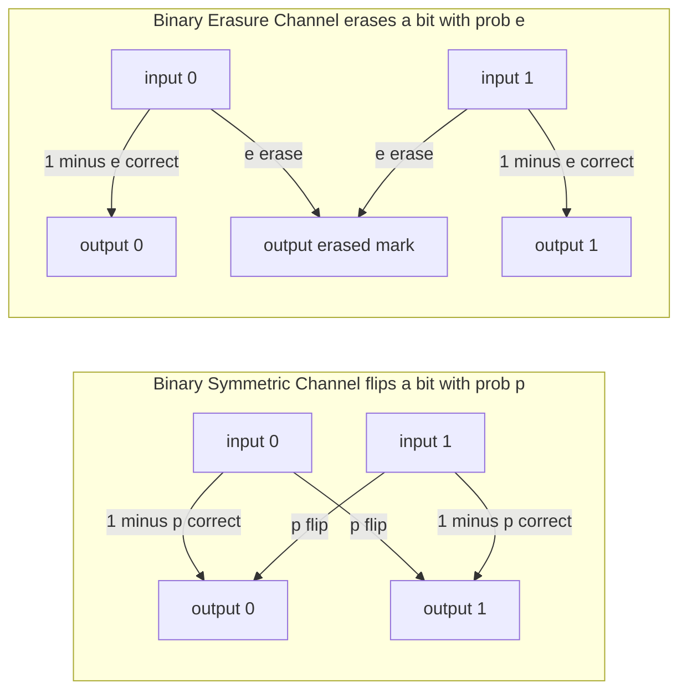

# 📡 Discrete Channels and the Binary Symmetric Channel

> [!abstract] TL;DR
> A **discrete memoryless channel (DMC)** is the workhorse model of communication: an input alphabet, an output alphabet, and a **transition probability matrix** `p(y|x)` that says how likely each output is for each input — with "memoryless" meaning every use is statistically independent. The two canonical examples are the **binary symmetric channel (BSC)**, which flips each bit with crossover probability `p` and has capacity **C = 1 − H(p)** bits per use (useless at `p = 0.5`), and the **binary erasure channel (BEC)**, which erases each bit with probability `e` and has capacity **C = 1 − e**. Erasures are easier to handle than flips because you know *where* the loss happened. These abstractions turn messy physical noise into clean math you can optimize codes against.

---

## Intuition

**Analogy — the channel as a rigged lottery box.** You drop a symbol into a box, someone shakes it, and a symbol falls out the other side — but not always the one you put in. The box is *rigged with known odds*: for every symbol you insert, there is a fixed, published probability table for what comes out. That table is the whole channel. You cannot change the odds; you can only choose *which symbols to send and how often* to make the output as informative as possible about the input.

The simplest such box is a **coin that flips your bit**. Send a `0` and with probability `1 − p` a `0` falls out, but with probability `p` the coin flips it to a `1`. Send a `1` and the same coin flips it to a `0` with probability `p`. That is the **binary symmetric channel**. A slightly kinder box sometimes returns a blank tile marked "?" instead of flipping — you have *lost* the bit but at least you *know you lost it*. That is the **binary erasure channel**, and that single difference — knowing *where* the damage is — makes it dramatically easier to correct.

---

## How It Works

### Core Mechanics

**1. The discrete memoryless channel.** A DMC is a triple: an input alphabet `𝒳`, an output alphabet `𝒴`, and a set of conditional probabilities `p(y|x)` arranged as a **transition matrix** whose rows sum to 1. Row `x` is the probability distribution of what you receive given that you sent `x`. "Memoryless" is a strong, simplifying promise: the output of the `n`-th use depends only on the `n`-th input, never on past inputs or past noise, so the channel over a block of length `n` factorizes as `p(y₁…yₙ | x₁…xₙ) = ∏ᵢ p(yᵢ | xᵢ)`.

**2. Capacity is a maximization over how you *use* the box.** The channel fixes `p(y|x)`, but *you* choose the input distribution `p(x)`. Shannon defined the **capacity** as the largest mutual information you can squeeze out:
$$C = \max_{p(x)}\; I(X;Y) = \max_{p(x)}\;\big[\,H(Y) - H(Y\mid X)\,\big]$$
`I(X;Y)` measures how many bits the output reveals about the input (see [[Joint_Conditional_Entropy_and_Mutual_Information]]). Capacity is the peak of that quantity over all input strategies — the ceiling on reliable bits per channel use.

**3. The binary symmetric channel.** `𝒳 = 𝒴 = {0,1}`; each bit is flipped with **crossover probability** `p`. Its transition matrix is:

| send \\ receive | 0 | 1 |
|---|---|---|
| **0** | 1 − p | p |
| **1** | p | 1 − p |

Because the channel treats `0` and `1` identically (it is **symmetric**), the noise term is constant: `H(Y|X) = H(p)`, the [[Entropy_and_Information_Content|binary entropy]] of the crossover, *regardless of the input distribution*. So maximizing `I(X;Y)` reduces to maximizing `H(Y)`, and a **uniform input** `p(0) = p(1) = 0.5` makes the output uniform, giving `H(Y) = 1` bit. Therefore:
$$C_{\text{BSC}} = 1 - H(p),\qquad H(p) = -p\log_2 p - (1-p)\log_2(1-p)$$
This is maximal (`C = 1`) at `p = 0` (perfect channel) *and* at `p = 1` (perfectly inverting channel — just relabel the outputs). It hits **zero at `p = 0.5`**: when a bit is equally likely to arrive right or wrong, the output is statistically independent of the input and the box transmits nothing.

**4. The binary erasure channel.** `𝒳 = {0,1}`, `𝒴 = {0, 1, ?}`. Each bit is delivered intact with probability `1 − e` or replaced by an **erasure** `?` with probability `e`; crucially, a `0` never turns into a `1`. Erasures never introduce a *wrong* bit — they only announce a missing one. A short derivation with uniform input gives:
$$C_{\text{BEC}} = 1 - e$$
Intuitively, a fraction `e` of your bits vanish but the survivors are perfect, so you retain `1 − e` bits per use. Capacity is zero only at `e = 1` (everything erased). Compare `1 − e` against `1 − H(e)`: because `H(e) ≥ e`, the erasure channel *always has at least as much capacity* as a BSC with the same failure probability — the payoff of knowing the error locations.

**5. Two more canonical channels.** The **noiseless binary channel** (`p = 0`) has `C = 1` bit per use — the trivial ceiling. The **Z-channel** is *asymmetric*: a `0` is always received correctly, but a `1` is flipped to `0` with some probability (a model for media where only one kind of error occurs, e.g. optical marks that can fade but not appear). Its capacity requires a *non-uniform* optimal input, illustrating that symmetry — not luck — is what makes the uniform input optimal.

**6. Computing capacity in general.** For **symmetric** channels the uniform input is optimal and capacity has a closed form. For arbitrary DMCs, `C = maxₚ₍ₓ₎ I(X;Y)` is a concave maximization over the probability simplex with no general closed form; the **Blahut–Arimoto algorithm** solves it by iteratively alternating between the input distribution and the induced reverse channel, converging to the capacity-achieving `p(x)`.

**7. From physics to the box.** Real channels are *continuous* — voltages, radio waves, light. The underlying model is the **additive white Gaussian noise (AWGN) channel**, where a real-valued signal is corrupted by Gaussian noise. When the receiver makes a **hard decision** (round each noisy sample to the nearest of two symbols *before* decoding), that continuous channel collapses into a BSC whose crossover `p` is the probability that noise pushes a symbol past the decision threshold. The BSC is thus an *abstraction of hard-decision demodulation*; keeping the soft (real-valued) outputs instead retains more information and yields better codes.

### Flow — BSC and BEC transition diagrams



---

## Key Concepts

### Secondary (intuitive)
- A **channel** is a box with known odds: put a symbol in, get a possibly-different symbol out. You cannot change the odds, only what you send.
- The **binary symmetric channel** is a coin that flips your bit with probability `p`. At `p = 0.5` it is useless — the output tells you nothing.
- The **binary erasure channel** sometimes replaces your bit with a "?" instead of flipping it. Knowing *where* a bit went missing is much easier to fix than a silent wrong bit.
- **Capacity** is the maximum number of reliable bits you can push through per use of the box.

### Undergraduate (formal)
- **DMC definition:** input alphabet `𝒳`, output alphabet `𝒴`, transition matrix `p(y|x)` with rows summing to 1; **memoryless** means block factorization `∏ᵢ p(yᵢ|xᵢ)`.
- **Capacity as an optimization:** `C = maxₚ₍ₓ₎ I(X;Y) = maxₚ₍ₓ₎ [H(Y) − H(Y|X)]`, in bits per channel use.
- **BSC:** `H(Y|X) = H(p)` for any input, so `C = 1 − H(p)`; symmetry makes the uniform input optimal; `C = 0` at `p = 0.5`.
- **BEC:** `C = 1 − e`; erasures preserve the survivors intact, so `C_BEC ≥ C_BSC` at equal failure probability because `H(e) ≥ e`.
- **Binary entropy function** `H(p)` is symmetric about `p = 0.5`, where it peaks at 1 bit, and is 0 at the endpoints — this is what shapes the capacity curves.

### Graduate (advanced)
- **Symmetric channels:** if the rows of `p(y|x)` are permutations of one another and the columns are permutations of one another, the uniform input is capacity-achieving and `C = log|𝒴| − H(row)`.
- **Blahut–Arimoto algorithm:** alternating maximization over `p(x)` and the reverse conditional `q(x|y)`; monotonically converges to `C` for any DMC, with computable upper/lower bounds each iteration.
- **Z-channel and asymmetry:** breaks the symmetry assumption, so the optimal input is skewed (not 0.5); demonstrates why closed-form capacity is a *consequence of symmetry*, not a universal fact.
- **Achievability vs converse:** capacity is not just a definition — the noisy-channel coding theorem proves rates below `C` are achievable with vanishing error (random coding) and rates above `C` are not (Fano's inequality). The DMC is the setting where these proofs are cleanest.
- **Channels with memory:** real links have *burst errors* (Gilbert–Elliott two-state model) and **inter-symbol interference (ISI)**, violating the memoryless assumption; interleaving is used to *scatter* bursts so a memoryless-channel code can cope.
- **Hard vs soft decision:** collapsing an AWGN channel to a BSC via hard decisions throws away roughly 2 dB of coding gain; soft-decision decoding operates on the continuous likelihoods directly.

---

## Python Demo

```python
# Capacity of the two canonical discrete channels, plus a Monte-Carlo BSC.
#   BSC: C = 1 - H(p)   (max 1 at p=0 or p=1, min 0 at p=0.5 -> useless channel)
#   BEC: C = 1 - e      (min 0 at e=1 -> everything erased)
# We also push random bits through a real BSC and measure the error rate.
import numpy as np
import matplotlib.pyplot as plt

# ---------- binary entropy function H(p) in bits ----------
def binary_entropy(p):
    """H(p) = -p log2 p - (1-p) log2(1-p), with H(0) = H(1) = 0."""
    p = np.asarray(p, dtype=float)
    out = np.zeros_like(p)
    m = (p > 0.0) & (p < 1.0)                  # endpoints contribute 0
    pm = p[m]
    out[m] = -pm * np.log2(pm) - (1 - pm) * np.log2(1 - pm)
    return out

# ---------- 1. capacity curves of the two channels ----------
p = np.linspace(0.0, 1.0, 501)
C_bsc = 1.0 - binary_entropy(p)                # bits per channel use
e = np.linspace(0.0, 1.0, 501)
C_bec = 1.0 - e                                # bits per channel use

# ---------- 2. Monte-Carlo: transmit bits through an actual BSC ----------
def simulate_bsc(crossover, n=200000, seed=0):
    """Send n uniform bits through a BSC and return the empirical error rate."""
    rng = np.random.default_rng(seed)
    tx = rng.integers(0, 2, size=n)            # uniform input bits
    flip = rng.random(n) < crossover           # which uses flip the bit
    rx = tx ^ flip.astype(int)                 # XOR applies the flip
    return np.mean(rx != tx)                    # fraction of received errors

print("BSC Monte-Carlo (200k bits): measured error vs theoretical capacity")
for pc in [0.0, 0.10, 0.25, 0.50]:
    err = simulate_bsc(pc)
    cap = float(1.0 - binary_entropy(np.array([pc]))[0])
    print(f"  p={pc:4.2f} -> measured error={err:6.4f} | capacity={cap:6.4f} bits/use")

# ---------- 3. plot both capacity curves ----------
fig, ax = plt.subplots(1, 2, figsize=(11, 4.2))

ax[0].plot(p, C_bsc, lw=2)
ax[0].axvline(0.5, color="red", ls=":", label="p = 0.5  ->  C = 0")
ax[0].scatter([0.0, 1.0], [1.0, 1.0], color="green", zorder=5, label="C = 1 at p=0 and p=1")
ax[0].set_title("BSC capacity   C = 1 - H(p)")
ax[0].set_xlabel("crossover probability p")
ax[0].set_ylabel("capacity  [bits per use]")
ax[0].legend()

ax[1].plot(e, C_bec, lw=2, color="darkgreen")
ax[1].axvline(1.0, color="red", ls=":", label="e = 1  ->  C = 0")
ax[1].set_title("BEC capacity   C = 1 - e")
ax[1].set_xlabel("erasure probability e")
ax[1].set_ylabel("capacity  [bits per use]")
ax[1].legend()

plt.tight_layout()
plt.show()

# Reading the curves:
#   BSC bottoms out at p = 0.5 because a 50/50 flip makes output independent of
#   input: I(X;Y) = 0, so no coding scheme can carry information.
#   BEC bottoms out only at e = 1 because as long as any bit survives (e < 1) it
#   arrives perfectly and you know exactly which positions were lost.
```

Running it prints Monte-Carlo error rates that track the crossover `p` almost exactly (about 0.10 measured at `p = 0.10`, about 0.50 at `p = 0.50`) and draws the two capacity curves: the BSC's smooth "U" dipping to zero at `p = 0.5`, and the BEC's straight line `1 − e` reaching zero only at `e = 1`. The BEC line sits *above* the BSC curve everywhere between the endpoints — the quantitative price of not knowing where your errors are.

---

## Real-World Applications

- **The internet as a giant erasure channel.** Packet loss on IP networks is a BEC: a datagram either arrives intact (checksum passes) or is dropped/marked bad — it is *erased*, not silently corrupted. This is exactly why **[[TCP_Protocol|TCP]]** can recover with retransmission (it knows which sequence numbers are missing) and why erasure/fountain codes (LT, Raptor) power reliable multicast and streaming without any feedback.
- **Storage and memory hard-decision reads.** Flash and DRAM cells are read by thresholding an analog voltage, collapsing physics into a BSC (or a Z-channel when errors are one-sided); the crossover `p` sets how strong the ECC must be.
- **Deep-space and mobile links.** Modems model the AWGN channel; a hard-decision receiver yields a BSC whose `p` follows from the signal-to-noise ratio, and the code rate is chosen to sit just below `C = 1 − H(p)`.
- **QR codes and optical media.** Marks that can fade but not spontaneously appear are Z-channel-like; scratches that obliterate a region are erasures handled by Reed–Solomon.
- **Benchmarking codes.** Every LDPC, turbo, and polar code is first characterized on the BSC/BEC because their capacities give the exact yardstick for "how close to optimal is this code?"

---

## Common Pitfalls

- **Assuming uniform input is *always* optimal.** It is optimal only for **symmetric** channels (BSC, BEC). For the Z-channel and other asymmetric DMCs the capacity-achieving input is skewed — reaching for `p(x)=0.5` reflexively undershoots capacity.
- **Confusing crossover `p` with capacity.** `p` is a channel parameter; capacity is `1 − H(p)`. Doubling `p` does *not* halve capacity, and `p = 0.5` — not `p = 1` — is the worst case for a BSC.
- **Thinking `p = 1` is a bad channel.** A BSC that flips *every* bit is perfectly reliable: just invert the output. Capacity is symmetric about `p = 0.5`; the useless point is the *middle*, not the end.
- **Treating erasures like errors.** Erasures carry a *location*; flips do not. Designing a BEC system with an error-correcting (rather than erasure-filling) code wastes redundancy — `1 − e` beats `1 − H(e)` for a reason.
- **Forgetting "memoryless" is an assumption.** Real links have burst errors and ISI. Feeding bursty data straight into a code designed for a memoryless channel fails; **interleaving** first spreads the burst out so the memoryless model applies.
- **Discarding soft information too early.** Hard-decision demodulation (making the channel a BSC) is convenient but throws away ~2 dB of gain versus soft-decision decoding on the underlying AWGN channel.
- **Mislabeling capacity units.** Capacity is bits *per channel use* (per symbol), not per second — multiply by the symbol rate to get a data rate.

---

## Related Concepts

- [[Joint_Conditional_Entropy_and_Mutual_Information]] — capacity is `C = maxₚ₍ₓ₎ I(X;Y)`; the BSC/BEC formulas are just this maximization made explicit via `H(Y) − H(Y|X)`.
- [[Entropy_and_Information_Content]] — the binary entropy function `H(p)` is the noise term `H(Y|X)` of the BSC and the shape of its capacity curve.
- [[Information_Theory_Overview]] — situates channel models inside Shannon's noisy-channel coding theorem, the ultimate limit these channels bound.
- [[TCP_Protocol]] — internet packet loss is a binary erasure channel; TCP's retransmission works precisely because erasures reveal *which* packets are missing.

---

## Review Questions

1. **Conceptual (undergraduate).** Starting from `C = maxₚ₍ₓ₎ [H(Y) − H(Y|X)]`, derive `C_BSC = 1 − H(p)`. Explain specifically why `H(Y|X)` does not depend on the input distribution for a BSC, and why the uniform input maximizes `H(Y)`.
2. **Scenario (applied).** You run a lossy wireless link. Measurements show 12% of transmitted bits are received *wrong* with no indication which ones, versus a redesign where 12% are *dropped but flagged*. Which channel model applies to each, what is the capacity of each, and which link would you rather build a code for — and why?
3. **Trade-off (graduate).** A designer collapses an AWGN channel into a BSC using hard decisions to simplify the decoder. What is gained and what is lost? Under what conditions (SNR regime, code type, latency budget) would you keep soft information instead, and how does the Blahut–Arimoto algorithm fit into analyzing a channel that is *not* symmetric?

---

## Sources

- [Cover & Thomas — *Elements of Information Theory*, Chapter 7 (Channel Capacity)](https://onlinelibrary.wiley.com/doi/book/10.1002/047174882X)
- [MacKay — *Information Theory, Inference, and Learning Algorithms*, Chapters 9–10 (Noisy Channels, The Noisy-Channel Coding Theorem)](http://www.inference.org.uk/mackay/itila/)
- [Shannon — *A Mathematical Theory of Communication* (1948)](https://people.math.harvard.edu/~ctm/home/text/others/shannon/entropy/entropy.pdf)
- [Blahut — *Computation of Channel Capacity and Rate-Distortion Functions*, IEEE Trans. Inf. Theory (1972)](https://ieeexplore.ieee.org/document/1054855)
- [Gallager — *Information Theory and Reliable Communication* (1968)](https://www.wiley.com/en-us/Information+Theory+and+Reliable+Communication-p-9780471290483)

---

#information-theory #binary-symmetric-channel #channel-models #capacity #erasure-channel
