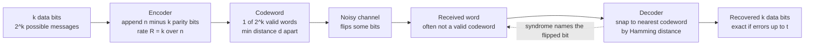

# 🛡️ Error-Correcting Codes: Fundamentals

> [!abstract] TL;DR
> **Forward error correction (FEC)** adds *structured* redundancy to a message so the receiver can detect and repair bit errors on its own — no retransmission needed. A code maps `k` data bits to `n > k` coded bits (rate `R = k/n`), using only `2^k` of the `2^n` possible words as valid **codewords**, deliberately spaced apart in **Hamming distance**. The **minimum distance** `d` sets the code's power: it detects up to `d − 1` errors and corrects up to `⌊(d − 1)/2⌋`. This is the practical machinery that realizes Shannon's promise of reliable communication below channel capacity, and it lives inside every SSD, QR code, Wi-Fi link, and deep-space probe.

---

## Intuition

**Analogy:** When you read a credit-card number over a noisy phone line, you don't just say "B" — you say **"Bravo"**. The NATO phonetic alphabet spreads each letter across a whole distinctive word, so if a single syllable gets garbled, the listener still recovers the letter: "Bravo" misheard as "Brabo" is still unmistakably *B*, because no other code word sounds anything like it. The redundancy ("-ravo" tacked onto "B") is what makes the message survive corruption. Crucially, the words were *chosen to sound far apart* — "Bravo," "Charlie," "Delta" differ in many sounds at once, so one slip never turns one into another.

Error-correcting codes do exactly this with bits. Instead of transmitting the raw 4-bit chunk `1011`, you transmit a longer 7-bit **codeword** that is designed to look very different from every other valid codeword. If the channel flips one bit, the received 7 bits no longer match *any* codeword exactly — but they still lie closest to the one you sent, so the decoder snaps them back. The extra 3 bits are the "-ravo": pure redundancy whose only job is to keep the valid words far apart.

---

## How It Works

### From message to codeword

An `(n, k)` **block code** takes a block of `k` data bits and produces `n` coded bits. The ratio `R = k/n` is the **code rate** — the fraction of the transmission that carries real information (the rest is overhead). Out of the `2^n` possible `n`-bit strings, only `2^k` are declared **valid codewords**; the other `2^n − 2^k` strings are "impossible" and their appearance is a dead giveaway that an error occurred.

The whole trick is *where* you place those `2^k` codewords in the `n`-dimensional cube of binary strings. Scatter them as far apart as possible and a few bit-flips can never carry one codeword across the gap to another.

### Hamming distance and minimum distance

The **Hamming distance** between two strings is the number of bit positions in which they differ (`10110` vs `10011` differ in positions 3 and 4 → distance 2). The **minimum distance** `d` of a code is the smallest Hamming distance between *any two distinct codewords*. This single number determines everything:

- **Detection:** any error pattern of weight up to `d − 1` moves a codeword to a non-codeword, so it is *detected*.
- **Correction:** an error of weight up to `t = ⌊(d − 1)/2⌋` still leaves the received word strictly closer to the original codeword than to any other, so nearest-codeword decoding *corrects* it.

**The sphere picture.** Imagine a ball of radius `t` around every codeword. If `d ≥ 2t + 1`, those balls never overlap, so any received word inside a ball unambiguously "belongs" to its center. Correction = "find which ball you landed in." Detection alone just asks "did I leave the center?"

### Detection versus correction

A single **parity bit** (or a **checksum**/**CRC**, as in the Ethernet frame's CRC-32) gives `d = 2`: it flags any single error but cannot say *where* it is, so it can only request a resend. To *locate and fix* an error you need more redundancy — enough that the surviving bits point to the culprit. That pointer is the **syndrome**.

### Hamming codes: the classic single-error correctors

The Hamming(7,4) code encodes 4 data bits into 7 using 3 parity bits, achieving `d = 3`, so `t = 1`: it corrects any single-bit error. Its magic is a **parity-check matrix** `H` whose 7 columns are exactly the 7 nonzero 3-bit patterns. For a received word `r`, the **syndrome** `s = H · rᵀ (mod 2)`:

- `s = 000` → no (detectable) error.
- `s = anything else` → `s` *equals the binary address of the flipped bit*. Flip that bit; done.

The syndrome literally reads out the position of the error. Because the radius-1 balls around the 16 codewords perfectly tile all 128 seven-bit words with no gaps and no overlaps, Hamming(7,4) is a **perfect code** — it wastes not a single bit of its correction budget.

### The fundamental trade-off: rate vs distance vs length

You cannot make `R`, `d`, and short `n` all large at once. Three classic bounds fence in the possibilities (see the graduate tier for statements): the **Singleton bound** (an upper limit `d ≤ n − k + 1`), the **Hamming / sphere-packing bound** (the balls must fit inside the cube), and the **Gilbert–Varshamov bound** (a *guarantee* that good codes exist). Coding theory is the art of navigating this triangle.



---

## Key Concepts

### Secondary (intuitive)
- **Redundancy with a purpose.** Sending extra bits is not waste — it is what keeps the valid messages far apart so noise cannot turn one into another.
- **Spacing is power.** The further apart the codewords, the more damage a message can absorb and still be read correctly. Distance 3 fixes one error; distance 5 fixes two.
- **Detect is cheap, correct is dear.** Spotting *that* something broke (a parity bit) costs almost nothing; figuring out *what* broke and fixing it costs more redundancy.
- **Repetition is the dumb version.** "Send every bit three times, take the majority" corrects one error — but at rate `1/3`. Real codes get the same protection for far less overhead.

### Undergraduate (formal)
- **Parameters** `(n, k, d)`: length, dimension, minimum distance; rate `R = k/n`. A code with these is often written `[n, k, d]`.
- **Guarantees:** detect `≤ d − 1` errors; correct `t = ⌊(d − 1)/2⌋` errors; or trade off (e.g. correct `e` and detect `f` with `e + f + 1 ≤ d`, `f ≥ e`).
- **Linear codes:** the codewords form a `k`-dimensional subspace over `GF(2)`. Encoding is `c = m·G` (generator matrix); checking is `s = H·rᵀ` (parity-check matrix), with `G·Hᵀ = 0`.
- **Syndrome decoding:** the syndrome depends only on the error, not the message, so a lookup table maps each syndrome to its most likely (coset-leader) error pattern.
- **Hamming(7,4):** `[7, 4, 3]`, rate `4/7 ≈ 0.57`, single-error-correcting, **perfect**. Extended to `[8, 4, 4]` (SECDED) it also *detects* double errors.
- **Coding gain:** the reduction in required signal power (or channel error rate) to hit a target output error rate, versus sending uncoded.

### Graduate (advanced)
- **Singleton bound:** `d ≤ n − k + 1`. Codes meeting it with equality are **MDS** (maximum distance separable) — e.g. Reed–Solomon.
- **Hamming (sphere-packing) bound:** `2^k · Σ_{i=0}^{t} C(n, i) ≤ 2^n`. Codes meeting it are **perfect** (Hamming and Golay codes).
- **Gilbert–Varshamov bound:** a code with `2^k · Σ_{i=0}^{d-2} C(n-1, i) < 2^n` is guaranteed to exist — an *existence* result driving random-coding arguments.
- **Block vs convolutional:** block codes act on fixed `k`-bit chunks; **convolutional codes** slide a filter over an infinite bit stream with memory, decoded optimally by the **Viterbi** algorithm.
- **Hard vs soft decision:** hard-decision decoding sees only received bits (0/1); **soft-decision** decoding keeps the analog confidence (log-likelihood ratios) per bit, buying roughly **2 dB** of extra coding gain. Modern LDPC and Turbo codes are inherently soft-decision.
- **Finite-field algebra:** non-binary codes (Reed–Solomon) work over `GF(2^m)`, treating bytes as field elements; correction becomes polynomial root-finding (Berlekamp–Massey, Chien search).
- **Approaching capacity:** the Shannon limit `C = max I(X;Y)` says reliable rates up to `C` are possible; classic algebraic codes fell short, but iteratively-decoded **Turbo (1993)** and rediscovered **LDPC** codes get within a fraction of a dB of `C`, finally cashing Shannon's 1948 cheque.

---

## Python Demo

```python
# Hamming(7,4): encode 4 data bits -> 7 bits (3 parity), corrupt one bit,
# read the syndrome, correct it. Then verify EVERY single-bit error is fixed,
# and plot the coded-vs-uncoded bit-error-rate over a Binary Symmetric Channel
# to expose the coding gain -- and the crossover where coding starts to HURT.
import numpy as np
import matplotlib.pyplot as plt

# ---- systematic Hamming(7,4): codeword = [d1 d2 d3 d4 | p1 p2 p3] ----
# G = [I4 | P],  H = [P^T | I3];  guarantees G @ H^T = 0 (mod 2).
G = np.array([
    [1, 0, 0, 0, 1, 1, 0],
    [0, 1, 0, 0, 1, 0, 1],
    [0, 0, 1, 0, 0, 1, 1],
    [0, 0, 0, 1, 1, 1, 1],
], dtype=int)

H = np.array([
    [1, 1, 0, 1, 1, 0, 0],
    [1, 0, 1, 1, 0, 1, 0],
    [0, 1, 1, 1, 0, 0, 1],
], dtype=int)

# Map each syndrome (as an integer) to the bit position it accuses.
# Column j of H, read as a 3-bit number, IS the address of an error in bit j.
SYN_TO_POS = {}
for j in range(7):
    col = H[:, j]
    SYN_TO_POS[int(col[0]) * 4 + int(col[1]) * 2 + int(col[2])] = j


def hamming_encode(m):
    """4 data bits -> 7-bit codeword."""
    return (m @ G) % 2


def hamming_decode(r):
    """Return (recovered 4 data bits, syndrome int). Corrects one flipped bit."""
    r = r.copy()
    s = (H @ r) % 2
    s_int = int(s[0]) * 4 + int(s[1]) * 2 + int(s[2])
    if s_int != 0:                       # nonzero syndrome names the error site
        r[SYN_TO_POS[s_int]] ^= 1        # flip that bit back
    return r[:4], s_int


all_messages = np.array([[(i >> 3) & 1, (i >> 2) & 1, (i >> 1) & 1, i & 1]
                         for i in range(16)])

# ---- 1. one concrete correction ----
m = np.array([1, 0, 1, 1])
c = hamming_encode(m)
r = c.copy()
r[2] ^= 1                                # corrupt data bit d3
m_hat, syn = hamming_decode(r)
print("message   :", m)
print("codeword  :", c)
print("received  :", r, "(bit 2 flipped)")
print(f"syndrome  : {syn:03b} -> error at position {SYN_TO_POS[syn]}")
print("recovered :", m_hat, "-> OK" if np.array_equal(m_hat, m) else "-> FAIL")

# ---- 2. verify it corrects ALL single-bit errors (16 messages x 7 positions) ----
fixed = 0
for msg in all_messages:
    cw = hamming_encode(msg)
    for bit in range(7):
        rx = cw.copy()
        rx[bit] ^= 1
        dec, _ = hamming_decode(rx)
        fixed += int(np.array_equal(dec, msg))
print(f"\nSingle-bit errors corrected: {fixed} / {16 * 7}  ->",
      "PASS" if fixed == 16 * 7 else "FAIL")


# ---- 3. exact post-decoding BER over a BSC, coded vs uncoded ----
# Enumerate all 16 messages x all 128 error patterns; weight each pattern by
# its BSC probability p^w (1-p)^(7-w). This is EXACT, not Monte Carlo.
error_patterns = np.array([[(e >> i) & 1 for i in range(7)] for e in range(128)])
weights = error_patterns.sum(axis=1)


def coded_ber(p):
    probs = (p ** weights) * ((1 - p) ** (7 - weights))
    total_bit_errors = 0.0
    for msg in all_messages:
        cw = hamming_encode(msg)
        for e, pr in zip(error_patterns, probs):
            dec, _ = hamming_decode(cw ^ e)
            total_bit_errors += pr * np.count_nonzero(dec != msg)
    return total_bit_errors / (16 * 4)   # average over messages and 4 data bits


ps = np.logspace(-3, np.log10(0.5), 160)
coded = np.array([coded_ber(p) for p in ps])
uncoded = ps                              # a raw BSC just delivers BER = p

# locate the crossover where coded stops beating uncoded
diff = coded - uncoded
cross_idx = np.where(np.diff(np.sign(diff)) > 0)[0]
p_star = ps[cross_idx[0]] if len(cross_idx) else np.nan
print(f"\nCrossover: coding HELPS for p < {p_star:.3f}, HURTS above it.")

plt.figure(figsize=(8, 5.5))
plt.loglog(ps, uncoded, 'k--', label="Uncoded BSC  (BER = p)")
plt.loglog(ps, coded, 'b-', lw=2, label="Hamming(7,4) hard-decision")
plt.loglog(ps, 9 * ps ** 2, 'g:', label="low-p asymptote  9 p^2")
if not np.isnan(p_star):
    plt.axvline(p_star, color="red", ls=":")
    plt.annotate(f"crossover p* ~ {p_star:.2f}\ncoding helps to the left",
                 xy=(p_star, p_star), xytext=(p_star * 0.12, 0.06),
                 arrowprops=dict(arrowstyle="->"))
plt.xlabel("channel crossover probability  p")
plt.ylabel("post-decoding message BER")
plt.title("Coding gain of Hamming(7,4) over a BSC")
plt.legend()
plt.grid(True, which="both", alpha=0.3)
plt.tight_layout()
plt.show()

# Takeaways:
#  * At p = 1e-2 the coded BER ~ 9e-4: roughly an order-of-magnitude gain.
#  * The coded curve has slope ~2 on log-log (BER ~ 9 p^2) -- errors are
#    squared away because it takes 2 flips to fool a distance-3 code.
#  * Near p ~ 0.21 the curves cross: once flips are so common that most 7-bit
#    blocks carry >= 2 errors, the decoder MISCORRECTS and coding makes it worse.
```

Running it prints a clean single-error correction, confirms all 112 single-bit patterns are fixed, and plots the tell-tale FEC curve: far below the uncoded line at low `p` (the coding gain, `BER ≈ 9p²`), then crossing it near `p ≈ 0.21` where too many simultaneous errors overwhelm a distance-3 code and the decoder's guesses backfire.

---

## Real-World Applications

> **Example — NAND flash SSDs and the read path.** Every flash page stores extra "spare" bytes holding **BCH** or **LDPC** parity. As cells wear out and leak charge, raw bit-error rates climb past `10⁻³`; the controller's ECC engine silently corrects tens of bit-errors per 4 KB sector on every single read. Without FEC, modern high-density (TLC/QLC) flash would be unusable — the physics is too noisy to store raw bits reliably.

- **Optical discs (CD/DVD/Blu-ray):** cross-interleaved **Reed–Solomon** codes correct burst errors from scratches and dust — a scratch destroys a stripe of consecutive bits, but interleaving spreads them across many codewords so each sees only a few.
- **QR codes:** carry Reed–Solomon parity at four selectable levels (L/M/Q/H), letting a code stay scannable with up to ~30% of its area occluded by a logo or damage.
- **RAM ECC (SECDED):** server DIMMs add Hamming-derived check bits — 8 bits per 64-bit word — to correct single-bit flips (from cosmic rays or `[[DRAM_Architecture|DRAM]]` disturbance) and detect doubles. This is Hamming(7,4)'s idea scaled up.
- **Wi-Fi, 5G, DVB:** convolutional, Turbo, and **LDPC** codes are mandatory in the PHY layer; combined with soft-decision decoding they push data rates close to the Shannon limit for a given signal-to-noise ratio.
- **Deep-space telemetry:** the Voyager probes used convolutional + Reed–Solomon concatenation; today NASA/CCSDS missions use Turbo and LDPC. With a whisper-faint signal from billions of kilometres away, coding gain is the difference between images and static.

---

## Common Pitfalls

- **Confusing detection with correction.** A CRC or checksum (like Ethernet's CRC-32) has `d = 2` and can only *flag* errors, not fix them — it needs a retransmission path. If your channel is one-way or latency-critical (broadcast, storage read-back, deep space), you must budget the extra redundancy for *correction* up front.
- **Assuming more parity always helps.** As the demo shows, a code has a **crossover**: past a channel error rate around `p ≈ 0.21` for Hamming(7,4), miscorrection makes things *worse* than sending raw bits. FEC is a tool for the low-to-moderate error regime, not a cure for a broken link.
- **Ignoring burst errors.** Random-error codes assume independent bit-flips. Real channels produce *bursts* (a scratch, a fading dropout). Feeding a burst straight into a `t = 1` code overwhelms it — you must **interleave** first so consecutive channel bits land in different codewords.
- **Miscounting the rate cost.** Redundancy is not free: rate `4/7` means you transmit 75% more bits. On a power- or bandwidth-limited link, the fair comparison is at equal *information* throughput, where weak codes can lose their apparent advantage.
- **Throwing away soft information.** Slicing each received symbol to a hard 0/1 *before* decoding discards the decoder's most useful clue — how confident each bit is. Soft-decision decoding recovers roughly 2 dB of gain for free; hard-slicing wastes it.
- **Forgetting undetected-error escape.** When more than `d − 1` errors strike, a received word can land *exactly* on a wrong codeword. The decoder then "corrects" confidently to garbage with no warning — the dangerous silent-failure mode of any FEC scheme.

---

## Related Concepts

- [[Information_Theory_Overview]] — error-correcting codes are the *constructive* side of Shannon's theory; capacity says reliable communication is possible, codes are how you achieve it.
- [[Joint_Conditional_Entropy_and_Mutual_Information]] — channel capacity `C = max I(X;Y)` is the ceiling every code operates under; FEC lets you transmit reliably at any rate `R < C`.
- [[Entropy_and_Information_Content]] — entropy measures the irreducible information content; coding adds *controlled* redundancy on top of it (the opposite of source compression, which removes redundancy).
- [[Data_Link_Layer]] — the Ethernet frame's CRC-32 FCS is pure error *detection* (`d = 2`); this note is about the extra redundancy that also *corrects*.
- [[Fields_and_Field_Extensions]] — linear codes are subspaces over `GF(2)`, and Reed–Solomon codes live over `GF(2^m)`; finite-field arithmetic is the algebra of coding theory.
- [[Matrices_and_Determinants]] — encoding `c = m·G` and checking `s = H·rᵀ` are matrix operations over `GF(2)`; the generator and parity-check matrices *are* the code.
- [[Vectors_and_Vector_Spaces]] — the `2^k` codewords of a linear code form a `k`-dimensional subspace; minimum distance equals the minimum weight of a nonzero codeword.
- [[DRAM_Architecture]] — SECDED ECC memory implements exactly the Hamming syndrome scheme described here, scaled to 64-bit words with 8 check bits.

---

## Review Questions

1. **Conceptual:** A code has minimum distance `d = 5`. How many errors can it *detect*, and how many can it *correct*? Draw the sphere-packing picture that explains why the correction limit is `⌊(d − 1)/2⌋` and not `d − 1`.
2. **Scenario:** You are designing storage for a channel with a raw bit-error rate of `10⁻³` that occasionally produces *bursts* of ~20 consecutive flipped bits. Would a Hamming(7,4) code alone suffice? What two techniques would you combine, and why does the order in which you apply them matter?
3. **Trade-off:** The demo shows Hamming(7,4) coding *hurts* once the channel error rate exceeds ~0.21. Explain the mechanism (what the decoder does with a 7-bit block carrying two errors), and argue why *any* fixed-rate code must have such a crossover rather than helping at every error rate.

---

## Sources

- [Claude E. Shannon — *A Mathematical Theory of Communication* (Bell System Technical Journal, 1948)](https://people.math.harvard.edu/~ctm/home/text/others/shannon/entropy/entropy.pdf)
- [Richard W. Hamming — *Error Detecting and Error Correcting Codes* (Bell System Technical Journal, 1950)](https://signallake.com/innovation/hamming.pdf)
- [Cover & Thomas — *Elements of Information Theory*, Ch. 7 (Channel Capacity) & related coding material](https://onlinelibrary.wiley.com/doi/book/10.1002/047174882X)
- [David MacKay — *Information Theory, Inference, and Learning Algorithms* (free online), Chapters 1, 11, 47](http://www.inference.org.uk/mackay/itila/)
- [Lin & Costello — *Error Control Coding*, 2nd ed. (standard reference on block, cyclic, and convolutional codes)](https://www.pearson.com/en-us/subject-catalog/p/error-control-coding/P200000003404)

---

#information-theory #error-correction #hamming-code #hamming-distance #coding-theory
