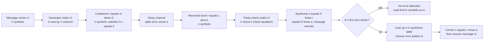

# 🛡️ Linear Block Codes and Reed-Solomon

> [!abstract] TL;DR
> A **linear block code** is a set of codewords that forms a vector subspace over a finite field: the sum of any two codewords is a codeword, so encoding is one matrix multiply by a **generator matrix G** and error-checking is one matrix multiply by a **parity-check matrix H**. Because the **syndrome** `H·rᵀ` depends only on the error and never on the message, decoding reduces to a lookup. **Reed-Solomon** codes are the industrial workhorse of this family: they treat data as a polynomial over `GF(2^m)`, ship extra evaluations of that polynomial, and let a receiver rebuild the data from *any k of n* symbols. This is why CDs survive scratches, QR codes survive logos, Voyager reached the edge of the solar system, and RAID-6 and cloud storage survive disk failures.

---

## Intuition

**Analogy — a curve through dots.** Two points determine a straight line; three points determine a parabola; in general, **any `k` points uniquely determine a polynomial of degree `k-1`**. Now suppose you want to send `k` numbers. Instead of shipping them raw, treat them as a polynomial and mail `n > k` points sampled from that curve. A friend who receives *any `k`* of those `n` points can redraw the exact same curve and read off your numbers — even if the other `n-k` points were smudged, lost, or scribbled over. The extra points are pure insurance: the more you send, the more damage the message can absorb.

That is literally why a CD keeps playing through a scratch and a QR code still scans with a logo stamped over its middle. The data is stored as evaluations of a polynomial over a finite field, with spare evaluations baked in, and the reader reconstructs the polynomial from the survivors. **Reed-Solomon** is this idea made exact and efficient; **linear block codes** are the broader algebraic family it belongs to, where the "curve through points" generalizes to "a vector inside a carefully chosen subspace."

---

## How It Works

### Core Mechanics

**1. From messages to a vector space.** Fix a finite field `GF(q)`. Messages are length-`k` vectors and codewords are length-`n` vectors. A linear block code is a **`k`-dimensional subspace of `GF(q)^n`**: the set of valid codewords is closed under addition and scalar multiplication, so the sum of any two codewords is again a codeword and the all-zero word is always a codeword. This single property — linearity — is what makes everything tractable. Instead of storing a lookup table of `q^k` codewords, you store one `k × n` matrix (see [[Vectors_and_Vector_Spaces]]).

**2. Encoding with the generator matrix G.** Pick a basis for the subspace and stack it as the rows of a `k × n` **generator matrix G**. Encoding is one matrix multiply: `c = m·G`. In **systematic form** `G = [I_k | P]`, the first `k` symbols of the codeword *are* the message itself and the remaining `n-k` are **parity symbols** — so reading a clean codeword is free, you just take the front `k` symbols.

**3. Checking with the parity-check matrix H.** The same subspace can be described as the null space of an `(n-k) × n` **parity-check matrix H**, built so that `H·cᵀ = 0` for every codeword `c` (equivalently `G·Hᵀ = 0`). `H` is the code's "law": a received word is legal only if it satisfies these `n-k` linear check equations.

**4. Syndrome decoding.** Suppose the channel turns codeword `c` into `r = c + e`, where `e` is the error vector. Multiply by `H`:

$$s = H\,r^{\mathsf T} = H(c+e)^{\mathsf T} = H\,c^{\mathsf T} + H\,e^{\mathsf T} = H\,e^{\mathsf T}$$

The **syndrome `s` depends only on the error pattern, never on the transmitted message.** So the decoder precomputes, for each correctable error, its syndrome; on reception it computes `s`, looks up the matching error `e`, and subtracts it: `c = r − e`. A zero syndrome means "no detectable error."

**5. Minimum distance from H.** The code's power is its **minimum distance `d`** — the fewest positions in which two distinct codewords differ, which for a linear code equals the minimum Hamming weight of any nonzero codeword. The key algebraic fact: **`d` equals the smallest number of columns of `H` that are linearly dependent.** A code with distance `d` **detects** up to `d−1` errors and **corrects** up to `⌊(d−1)/2⌋`. The **Singleton bound** caps this: `d ≤ n − k + 1`.

**6. Cyclic codes and polynomials.** Impose extra structure: require that any cyclic shift of a codeword is also a codeword. Then codewords correspond to **polynomials modulo `x^n − 1`**, and the whole code is generated by one **generator polynomial `g(x)`** that divides `x^n − 1` (this is an ideal in the ring `GF(q)[x]/(x^n − 1)`, see [[Rings_and_Ideals]] and [[Polynomial_Rings_and_Factorization]]). Encoding and checking become polynomial multiplication and division, implementable with a handful of shift registers and XOR gates — cheap enough for 1970s hardware. Cyclic codes are the family behind **CRCs** ([[Data_Link_Layer]]), **BCH codes**, and **Reed-Solomon**.

**7. BCH and Reed-Solomon.** **BCH codes** choose `g(x)` to have a run of consecutive powers of a primitive element as roots, which forces a guaranteed ("designed") minimum distance and lets them correct many errors. **Reed-Solomon** is the special case where the symbols themselves live in a large field `GF(2^m)` — one symbol is a byte when `m = 8`. Two equivalent views:

- **Evaluation view:** the `k` message symbols are the coefficients of a degree-`<k` polynomial, and the codeword is that polynomial evaluated at `n` distinct field points — the "curve through dots" picture from the intuition.
- **Generator-polynomial view:** the cyclic-code description with `g(x)` having consecutive roots.

RS is **MDS** (Maximum Distance Separable): it *hits* the Singleton bound with `d = n − k + 1`, so `RS(n, k)` corrects up to `⌊(n−k)/2⌋` symbol errors, or `n−k` erasures — the theoretical maximum for its redundancy. Because a whole corrupted byte counts as a **single symbol error**, RS shrugs off the **burst errors** that would defeat a bit-oriented code.

**8. Decoding in practice.** Real RS decoders do not use a giant syndrome table. They compute syndromes, solve for an **error-locator polynomial** using **Berlekamp-Massey** (or the **Euclidean / Sugiyama** algorithm), find its roots with a **Chien search** to locate errors, and compute error magnitudes with **Forney's formula** — all in time polynomial in `n`.

### Flow / Architecture



---

## Key Concepts

### Secondary Level
- **Redundancy for reliability** — add spare check symbols so a scratched or garbled message can still be read, the way spelling a word phonetically ("Bravo-Alpha-Tango") survives a bad phone line.
- **Block code** — chop data into fixed `k`-symbol blocks and expand each block to `n` symbols; the `n−k` extra symbols are the safety margin.
- **Minimum distance** — the fewest symbol positions in which two valid codewords differ; a larger distance means more damage can be undone before one codeword is mistaken for another.
- **Detect vs correct** — you can *detect* more errors than you can *correct*, because detecting only needs "this is not a legal codeword," while correcting needs "and here is the exact legal codeword nearest to it."

### Undergraduate Level
- **Code as a subspace** — a linear `[n, k, d]` code over `GF(q)` is a `k`-dimensional subspace; `q^k` codewords, closed under addition, minimum distance `d`.
- **Generator matrix `G`** (`k × n`) — encodes by `c = m·G`; systematic form `[I_k | P]` puts the message up front plus parity.
- **Parity-check matrix `H`** (`(n−k) × n`) — defines the code by `H·cᵀ = 0`; related to `G` by `G·Hᵀ = 0`; systematic pair is `G = [I_k | P]`, `H = [Pᵀ | I_{n−k}]`.
- **Syndrome decoding** — `s = H·rᵀ = H·eᵀ`; the syndrome identifies the error's **coset**, and the minimum-weight member (the **coset leader**) is the most likely error.
- **Distance from `H`** — `d` = smallest number of linearly dependent columns of `H`; obey the **Singleton bound** `d ≤ n−k+1`.
- **Hamming `(7, 4, 3)` code** — the canonical single-error-correcting perfect code; `H` has all seven nonzero 3-bit columns, so every single-bit error has a unique nonzero syndrome.
- **Cyclic codes** — closed under cyclic shift; codewords are polynomials mod `x^n − 1` generated by `g(x)`; shift-register encoders; the algebraic basis of **CRC** error detection.

### Graduate Level
- **BCH codes** — cyclic codes whose generator polynomial has `2t` consecutive roots in `GF(2^m)`, guaranteeing a designed distance `≥ 2t+1` and correction of `t` errors.
- **Reed-Solomon as evaluation / BCH over `GF(2^m)`** — MDS codes with `d = n−k+1`; correct `⌊(n−k)/2⌋` symbol errors *or* `n−k` erasures; symbols are field elements (bytes for `m = 8`).
- **Burst-error advantage** — one corrupted byte is a *single* symbol error regardless of how many bits flipped inside it, so RS plus **interleaving** neutralizes long bursts (a scratch, a fading radio dropout).
- **Algebraic decoding pipeline** — syndromes → error-locator polynomial via **Berlekamp-Massey** or **Euclidean/Sugiyama** → roots via **Chien search** → magnitudes via **Forney**; classical Peterson-Gorenstein-Zierler for small `t`.
- **Concatenated codes** — RS outer code plus a convolutional inner code (Voyager, CCSDS); the inner code cleans random errors, the outer RS mops up residual bursts.
- **List decoding** — Guruswami-Sudan decodes RS *beyond* half the minimum distance by returning a short list of candidates, trading uniqueness for reach.
- **Duality and MDS geometry** — the dual code `C⊥` swaps the roles of `G` and `H`; the dual of an RS code is another RS/GRS code, and MDS codes correspond to arcs in projective geometry.

---

## Python Demo

Two experiments, NumPy only. First a full `(7,4)` Hamming **linear block code over `GF(2)`**: build `G` and `H`, encode all messages, confirm `H·cᵀ = 0`, measure the minimum distance, build a **syndrome-decoding table**, and correct a single-bit error. Second, the **Reed-Solomon polynomial-evaluation idea** over a small prime field, showing *any `k` of `n`* symbols reconstruct the whole codeword (the erasure-coding property).

```python
# Linear block codes + the Reed-Solomon "any k of n" idea, NumPy only.
import numpy as np

# ======================================================================
# PART 1 — (7,4) Hamming linear block code over GF(2)
# Systematic form: G = [I_k | P],  H = [P^T | I_(n-k)]
# ======================================================================
P = np.array([[1, 1, 0],
              [1, 0, 1],
              [0, 1, 1],
              [1, 1, 1]], dtype=int)          # 4 x 3 parity sub-matrix

k, r = P.shape                                # k = 4 message bits, r = 3 parity bits
n = k + r                                     # n = 7 codeword length

G = np.hstack([np.eye(k, dtype=int), P])                 # 4 x 7 generator
H = np.hstack([P.T, np.eye(r, dtype=int)])               # 3 x 7 parity-check

# Fundamental identity of a systematic linear code: G . H^T = 0 (mod 2)
assert np.all((G @ H.T) % 2 == 0)

# --- Encode every message and verify H . c^T = 0 for all codewords ---
messages  = np.array([[(i >> b) & 1 for b in range(k)] for i in range(2**k)])
codewords = (messages @ G) % 2
assert np.all((codewords @ H.T) % 2 == 0)    # every valid codeword has zero syndrome

# --- Minimum distance = min Hamming weight of a nonzero codeword ---
weights = codewords[1:].sum(axis=1)          # skip the all-zero codeword
d = int(weights.min())
print(f"Linear block code parameters: (n, k, d) = ({n}, {k}, {d})")
print(f"  detects up to {d-1} errors, corrects up to {(d-1)//2} error(s)")

# --- Build the syndrome-decoding table (coset leaders = single-bit errors) ---
syndrome_table = {(0, 0, 0): np.zeros(n, dtype=int)}     # zero syndrome -> no error
for i in range(n):
    e = np.zeros(n, dtype=int); e[i] = 1                 # single-bit error at position i
    s = tuple((H @ e) % 2)
    syndrome_table[s] = e
print(f"  syndrome table has {len(syndrome_table)} entries "
      f"(1 zero + {n} single-bit errors)")

def decode(recv):
    s = tuple((H @ recv) % 2)                            # syndrome depends only on error
    e = syndrome_table.get(s, np.zeros(n, dtype=int))    # look up the error pattern
    corrected = (recv + e) % 2
    return corrected, s

# --- Simulate: send a message, flip one bit in transit, correct it ---
m = np.array([1, 0, 1, 1])
c = (m @ G) % 2
received = c.copy(); received[2] ^= 1                    # channel flips bit index 2
corrected, syn = decode(received)
print(f"\nsent codeword    : {c}")
print(f"received (1 flip): {received}   syndrome = {syn}")
print(f"corrected        : {corrected}")
print(f"recovered message: {corrected[:k]}  (matches sent: {np.array_equal(corrected[:k], m)})")

# ======================================================================
# PART 2 — Reed-Solomon flavor: any k of n via polynomial evaluation
# Message symbols = polynomial coefficients over GF(p); codeword = evaluations.
# Any k survivors reconstruct the whole codeword (MDS / erasure coding).
# ======================================================================
p, K, N = 97, 3, 6                            # prime field GF(97), k=3 data, n=6 total
xs = list(range(1, N + 1))                    # n distinct nonzero evaluation points

def poly_eval(coeffs, x):                     # Horner's method mod p
    y = 0
    for a in reversed(coeffs):
        y = (y * x + a) % p
    return y

def lagrange_value(points, at):               # interpolate polynomial value at 'at' mod p
    total = 0
    for i, (xi, yi) in enumerate(points):
        num = den = 1
        for j, (xj, _) in enumerate(points):
            if i == j:
                continue
            num = (num * ((at - xj) % p)) % p
            den = (den * ((xi - xj) % p)) % p
        total = (total + yi * num * pow(den, p - 2, p)) % p   # Fermat inverse, p prime
    return total

msg  = [5, 11, 2]                             # k=3 message symbols = poly coefficients
code = [poly_eval(msg, x) for x in xs]        # n=6 codeword symbols = evaluations
print(f"\nReed-Solomon RS({N},{K}) over GF({p}): d = {N-K+1} "
      f"(corrects {(N-K)//2} errors or {N-K} erasures)")
print(f"  message  : {msg}")
print(f"  codeword : {code}")

# Erase 3 of 6 symbols; keep any k=3 survivors and rebuild the entire codeword.
survivors = [(xs[0], code[0]), (xs[3], code[3]), (xs[5], code[5])]
rebuilt = [lagrange_value(survivors, x) for x in xs]
print(f"  survivors (any 3): {survivors}")
print(f"  rebuilt codeword : {rebuilt}  (matches original: {rebuilt == code})")
```

Running it prints `(n, k, d) = (7, 4, 3)`, confirms every codeword has zero syndrome, corrects the flipped bit, and — for the RS part — rebuilds all six symbols from any three survivors, the exact "any `k` of `n`" property that erasure coding relies on.

---

## Real-World Applications

- **Optical media** — CDs use **CIRC** (Cross-Interleaved Reed-Solomon Code), two interleaved RS codes over `GF(256)`; interleaving spreads a scratch across many codewords so each sees only a few symbol errors. DVDs (RS-PC) and Blu-ray extend the same idea.
- **QR codes and 2D barcodes** — Reed-Solomon over `GF(256)` with four error-correction levels (L/M/Q/H); level H recovers roughly 30% of the code, which is why a logo can be stamped over the center. PDF417 and Data Matrix likewise use RS.
- **Deep-space communication** — Voyager, Galileo, Cassini, and the Mars missions use the CCSDS standard **`RS(255, 223)` over `GF(256)` concatenated with a convolutional inner code**; RS mops up the bursts left by the inner Viterbi decoder, enabling images from billions of kilometers away — a direct payoff of the noisy-channel coding theorem (see [[Information_Theory_Overview]]).
- **RAID-6 and distributed storage** — RAID-6 and cloud/erasure-coded stores (HDFS `RS(6,3)`, Amazon S3, Backblaze, Ceph, Azure) apply RS so that any `k` of `n` shards reconstruct the object, cutting storage overhead from 3× replication to about 1.5× while surviving multiple disk failures (see [[Distributed_File_Systems]]).
- **Broadcast and broadband** — DVB (digital TV), ADSL/DSL, WiMAX, and CCSDS telemetry all specify RS; older flash/SSD controllers used BCH before migrating to LDPC.
- **Error detection everywhere** — the cyclic-code cousin of RS, the **CRC**, guards Ethernet frames (FCS/CRC-32), ZIP archives, and network packets; it detects rather than corrects (see [[Data_Link_Layer]]).

---

## Common Pitfalls

- **Confusing detection and correction limits** — distance `d` detects `d−1` errors but corrects only `⌊(d−1)/2⌋`. You cannot do both to the full amount at once: reserving distance to *correct* errors leaves less margin to *detect* the ones you cannot fix.
- **Assuming "linear" means binary** — linear codes live over any `GF(q)`. Reed-Solomon is linear *over `GF(2^m)`* and is byte-oriented, not bit-oriented; treating it as a `GF(2)` code is a category error.
- **Wrong error model** — RS is superb against **bursts** (one bad byte = one symbol) but not optimal for independent random *bit* flips, where LDPC/turbo win. Without **interleaving**, a burst longer than a symbol boundary can still overwhelm a single codeword.
- **Non-systematic surprise** — an RS or generic linear codeword does not contain the message verbatim unless you use *systematic* encoding. Do not assume the first `k` symbols are the data.
- **Field / primitive-polynomial mismatch** — encoder and decoder must agree on the exact `GF(2^m)` and primitive polynomial. A mismatch produces valid-looking but wrong symbols with no warning.
- **Silent miscorrection** — feed a decoder more errors than `t` and it may "correct" to the *wrong* valid codeword and report success. Production systems add an outer CRC or checksum to catch decoder overreach.
- **Expecting Singleton for free** — `d ≤ n−k+1` is an upper bound; only **MDS** codes (like RS) reach it. A random linear code usually falls short, so do not assume maximum distance from the parameters alone.

---

## Related Concepts

- [[Information_Theory_Overview]] — channel coding is the reliability half of Shannon's framework; linear/RS codes are how the noisy-channel coding theorem is realized in hardware.
- [[Entropy_and_Information_Content]] — source coding *removes* redundancy to reach entropy; channel coding *adds back* structured redundancy so noise can be undone.
- [[Vectors_and_Vector_Spaces]] — a linear `[n, k]` code is literally a `k`-dimensional subspace of `GF(q)^n`; `G`'s rows are a basis.
- [[Matrices_and_Determinants]] — `G` and `H` are the matrices that encode and check; rank and null space give `k` and `n−k`.
- [[Fields_and_Field_Extensions]] — Reed-Solomon symbols are elements of the extension field `GF(2^m)`; field structure guarantees unique interpolation.
- [[Galois_Theory]] — the theory of finite (Galois) fields underpins symbol arithmetic and the choice of primitive elements.
- [[Rings_and_Ideals]] — cyclic codes are ideals in the quotient ring `GF(q)[x]/(x^n − 1)`; the generator polynomial generates the ideal.
- [[Polynomial_Rings_and_Factorization]] — factoring `x^n − 1` yields the generator polynomials of cyclic/BCH/RS codes; roots define the designed distance.
- [[Modular_Arithmetic]] — arithmetic modulo a prime is the simplest finite field and the setting for the Python RS demo.
- [[Groups_and_Subgroups]] — under addition a linear code is an abelian subgroup of `GF(q)^n`; cosets are exactly the syndrome classes used in decoding.
- [[Data_Link_Layer]] — Ethernet's CRC-32 is a cyclic code (the detection-only cousin of BCH/RS) computed with the same shift-register machinery.
- [[Symmetric_Encryption]] — AES uses the same `GF(2^8)` byte arithmetic as Reed-Solomon, a shared finite-field foundation.
- [[Distributed_File_Systems]] — HDFS/S3/Ceph erasure coding is Reed-Solomon's "any `k` of `n`" property applied to disks instead of radio symbols.

---

## Review Questions

**Secondary**
1. A QR code still scans after a coffee stain covers part of it, and a music CD plays through a fingernail scratch. In terms of "extra check symbols," explain why adding redundancy lets the reader recover the missing data — and what physically limits how large a stain or scratch the code can survive.

**Undergraduate**
2. The `(7, 4)` Hamming code has a parity-check matrix `H` whose columns are all seven distinct nonzero 3-bit patterns. (a) Argue why this forces the minimum distance to be exactly 3, using the "smallest number of linearly dependent columns of `H`" characterization. (b) You receive a word `r` whose syndrome `s = H·rᵀ` equals the 4th column of `H`. Which single bit do you flip, and why does the syndrome not depend on *which* codeword was originally sent?

**Graduate**
3. Reed-Solomon `RS(255, 223)` over `GF(256)` is a CCSDS deep-space standard. (a) How many symbol errors and how many erasures can it correct, and how do both follow from `d = n − k + 1`? (b) Explain why RS is far better suited to burst errors than to independent random bit errors, and how concatenation with an inner convolutional code plus interleaving handles both regimes. (c) RS is an MDS code — what does the Singleton bound say it achieves, and what is the corresponding price paid in code rate `k/n`?

---

## Sources

- [Reed, I. S. & Solomon, G. (1960). *Polynomial Codes Over Certain Finite Fields*. J. SIAM 8(2), 300–304](https://epubs.siam.org/doi/10.1137/0108018)
- [Lin, S. & Costello, D. J. — *Error Control Coding* (2nd ed.), Pearson](https://www.pearson.com/en-us/subject-catalog/p/error-control-coding/P200000003417)
- [MacKay, D. — *Information Theory, Inference, and Learning Algorithms* (free PDF; chs. on codes)](https://www.inference.org.uk/mackay/itila/book.html)
- [Plank, J. S. — *A Tutorial on Reed-Solomon Coding for Fault-Tolerance in RAID-like Systems*](https://web.eecs.utk.edu/~jplank/plank/papers/CS-96-332.html)
- [Wikipedia — *Reed-Solomon error correction*](https://en.wikipedia.org/wiki/Reed%E2%80%93Solomon_error_correction)

---

#information-theory #linear-codes #reed-solomon #error-correction #finite-fields
