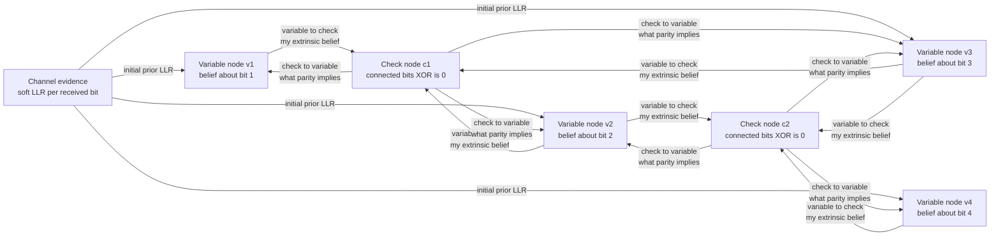

# 📶 Modern Capacity-Approaching Codes: LDPC, Turbo, and Polar

> [!abstract] TL;DR
> In 1948 Shannon **proved** that codes exist which push the error rate to zero at any rate below channel capacity — but his proof was pure existence, and for nearly 50 years no *practical* code came close. The gap finally collapsed in the 1990s: **turbo codes** (Berrou, 1993) got within about **0.5 dB of the Shannon limit** using two convolutional decoders that trade "soft" probabilistic guesses back and forth; **LDPC codes** (Gallager, 1962, rediscovered in the 1990s) did the same with a sparse parity-check matrix decoded by **belief propagation** on a graph; and **polar codes** (Arıkan, 2009) became the first to *provably* achieve capacity with low complexity. All three are iterative, soft-decision codes, and LDPC/turbo decoding is literally the **same sum-product message-passing algorithm** used for Bayesian inference in probabilistic graphical models. These codes now run in Wi-Fi, 5G, DVB-S2, 10 Gigabit Ethernet, SSDs, and deep-space links — Shannon's 1948 promise is now essentially cashed in.

---

## Intuition

**Analogy — a giant Sudoku solved by gossip.** Imagine a huge Sudoku-like puzzle: thousands of cells (the message bits), tied together by thousands of overlapping "must-sum-correctly" rules (the parity checks). The channel hands you a smudged, partly-wrong copy of the answers. No single rule can fix a cell on its own, but each rule can *whisper a hint*: "given the other cells I touch, I think this cell is probably a 0." Every cell listens to all the rules it belongs to, forms an updated opinion, and whispers its new belief back. Round after round, confident hints reinforce each other and drown out the noise, until every rule is satisfied at once and the whole puzzle snaps into a consistent solution.

That whispering-until-consensus process is **belief propagation** (a.k.a. message passing / the sum-product algorithm). The magic of good modern codes is that they define a puzzle where these local, overlapping constraints, iterated a few dozen times, reconstruct the *exact* transmitted message even when a large fraction of the received symbols are wrong — right up to the theoretical noise level Shannon said was survivable. The **turbo principle** is the same idea with two solvers instead of a graph: two decoders each solve their half of the puzzle, then swap their confidence levels, each using the other's output as a better starting guess.

---

## How It Works

### Why it took 50 years

Shannon's noisy-channel coding theorem is an **existence proof** built on random codes and the asymptotic-equipartition property: *almost all* long random codes are good, so a good one must exist. But a random code has no structure — decoding it optimally means comparing the received word against all `2^k` codewords, which is astronomically expensive. The entire quest of coding theory from 1948 to the 1990s was to find codes with (a) enough structure to decode cheaply and (b) enough randomness to be good. Algebraic codes (Hamming, BCH, Reed–Solomon) gave cheap decoding but stalled several dB short of capacity. The 1990s breakthrough was to abandon algebra for **pseudo-random, graph-defined codes decoded iteratively** — trading exact optimal decoding for near-optimal decoding that is cheap because it is *local*.

### LDPC codes: a sparse parity-check graph

An **LDPC (low-density parity-check) code** is defined entirely by a sparse `m × n` parity-check matrix `H`: a codeword is any bit vector `x` with `H x = 0` over GF(2). "Low-density" means each row and column of `H` has only a handful of ones (constant weight, e.g. 3 and 6), so the code is described by a **Tanner graph** — a bipartite graph with:

1. **Variable nodes** (one per code bit) holding the channel's soft evidence about that bit.
2. **Check nodes** (one per parity row) enforcing that the connected bits XOR to zero.
3. **Edges** wherever `H` has a one.

Decoding runs **belief propagation** on this graph, exchanging *log-likelihood ratios* (LLRs), `L = log( P[bit is 0] / P[bit is 1] )`:

1. **Initialise** each variable node with the channel LLR for its bit (positive means "probably 0").
2. **Variable → check:** each variable sends each neighboring check its current belief, *excluding* that check's own previous message (the "extrinsic" rule that keeps information from feeding back on itself).
3. **Check → variable:** each check computes, for each connected bit, what the *other* connected bits imply that bit must be, using the parity constraint (a `tanh`/`min-sum` combination of incoming LLRs).
4. **Update & decide:** each variable sums the channel LLR plus all incoming check messages, hard-decides the sign, and checks whether `H x = 0`. If yes, stop — a valid codeword is found. If not, iterate (typically 10–50 rounds).

Because the graph is sparse and has few short cycles, these local updates behave *almost* like exact inference and converge to the right codeword whenever the noise is below the code's threshold.

### Turbo codes: two decoders and the turbo principle

A **turbo code** is a *parallel concatenation* of two simple convolutional encoders separated by an **interleaver** (a pseudo-random bit permutation). The same information bits are encoded twice — once in natural order, once scrambled — so the two encoders see different "views" of the data. Decoding uses two **soft-in / soft-out (SISO)** decoders (BCJR/MAP), one per constituent code:

- Decoder 1 produces a soft estimate (an LLR) for each bit, keeping only the **extrinsic** part (what *it* learned, minus what it was told).
- That extrinsic information is de/interleaved and fed to Decoder 2 as an improved *prior*.
- Decoder 2 does the same and passes *its* extrinsic information back to Decoder 1.
- Repeat. Each pass sharpens the beliefs; after ~4–10 iterations the estimates lock onto the transmitted word.

This exchange of extrinsic soft information between component decoders is the **turbo principle**, and it is exactly belief propagation on the code's factor graph — turbo codes are just LDPC-like codes with a particular graph structure.

### The factor-graph unification

The deep punchline: **LDPC decoding, turbo decoding, the BCJR algorithm, Kalman filtering, hidden-Markov-model inference, and Bayesian belief propagation are all the same algorithm** — the sum-product algorithm running on a factor graph. A factor graph draws the global probability `P(x | received)` as a product of local factors (checks / constraints), and sum-product passes messages that marginalize out variables locally. Coding theory and machine-learning inference rediscovered the same tool independently; recognizing them as one unlocked both fields (see [[Naive_Bayes]] for the simplest Bayesian-inference cousin). This is why an LDPC decoder and a graphical-model inference engine share code structure, and why "neural belief propagation" (unrolling BP as a trainable network) is an active research bridge.

### Polar codes: channel polarization

**Polar codes** (Arıkan, 2009) reach capacity by a completely different, provable route. Combine `N` copies of a channel with a simple recursive transform, and the copies **polarize**: as `N` grows, each synthetic sub-channel becomes either *almost noiseless* or *almost useless*. You then send information bits only through the good sub-channels and freeze the bad ones to known values. As `N → ∞` the fraction of good channels approaches the capacity `C` exactly, and decoding (successive cancellation, or SC-list) is `O(N log N)`. Polar codes are the first explicit, low-complexity codes with a *proof* of capacity achievement, which is why 5G adopted them for control channels.

### Tanner / factor graph and message passing



The bidirectional edges between variable and check nodes are the iterated message exchange; convergence is reached when every check node sees its connected bits XOR to zero simultaneously.

---

## Key Concepts

### Secondary Level
- **Redundancy that votes** — the code sends extra parity bits so that many overlapping checks constrain each data bit; the decoder lets the checks "vote" until they agree, fixing errors the channel introduced.
- **Soft vs hard decisions** — instead of forcing each received symbol to 0 or 1 immediately, modern decoders keep a *confidence* ("probably 0, but only 70% sure") and combine confidences, which recovers far more information.
- **Iterate to consensus** — the answer emerges over many rounds of hint-passing, not in one shot; more iterations (up to a point) mean fewer residual errors.

### Undergraduate Level
- **Parity-check matrix and Tanner graph** — `H x = 0` over GF(2) defines the code; a sparse `H` becomes a bipartite graph of variable nodes and check nodes, and the code rate is `R = k/n = 1 − m/n` (if `H` is full rank).
- **Log-likelihood ratio (LLR)** — `L = log(P[0]/P[1])`; sign gives the decision, magnitude gives confidence. LLRs make Bayes' rule *additive*, so combining evidence is just summation.
- **Belief propagation / sum-product** — variable nodes sum incoming LLRs; check nodes combine them through a `tanh` rule (or its `min-sum` approximation). **Extrinsic information** (never echo a message back to its sender) is the rule that makes it work.
- **The turbo principle** — two SISO decoders exchange extrinsic LLRs across an interleaver; convergence is visualized with an **EXIT chart** (extrinsic information transfer), whose "open tunnel" predicts successful decoding.
- **Waterfall and error floor** — bit-error-rate versus signal-to-noise ratio drops almost vertically (the *waterfall*) once past the threshold, then flattens into an *error floor* caused by small structural weaknesses (low-weight codewords, trapping sets).

### Graduate Level
- **Density evolution** — tracks the probability distribution of the messages through iterations on an infinite cycle-free graph; it computes the exact **decoding threshold** (the worst channel the code family can survive) and enables threshold-optimal *irregular* degree-distribution design that approaches capacity within thousandths of a dB.
- **Factor graphs and the sum-product algorithm** — the unifying framework (Kschischang–Frey–Loeliger): LDPC/turbo decoding, BCJR, Kalman filtering, HMM forward–backward, and Bayesian belief propagation are one algorithm; on graphs with cycles it becomes *loopy* BP, exact only on trees but empirically excellent on good sparse graphs.
- **Channel polarization** — Arıkan's recursive `[[1,0],[1,1]]` Kronecker transform makes synthetic sub-channels' capacities converge to 0 or 1; the frozen-set design and successive-cancellation-list + CRC decoding make polar codes provably capacity-achieving at `O(N log N)`.
- **Trapping sets, absorbing sets, and error floors** — combinatorial substructures in the Tanner graph that BP cannot resolve; girth optimization, protographs (QC-LDPC), and post-processing suppress the floor for storage-grade reliability (BER below 1e-15).
- **Finite-blocklength gap** — capacity is asymptotic; the Polyanskiy–Poor–Verdú normal approximation quantifies the unavoidable penalty at practical block lengths, which is why real systems sit a small margin below `C`.

---

## Python Demo

This builds a small **regular LDPC code** as a sparse parity-check matrix (a Tanner graph), derives its codewords from the null space of `H` over GF(2), transmits over a **binary symmetric channel (BSC)**, and decodes with the classic **Gallager bit-flipping** message-passing algorithm. Two experiments: (A) watch the bit-error-rate collapse over decoding iterations, and (B) sweep the channel noise to reveal the sharp **waterfall** where decoding success plunges as the noise crosses the code's threshold — the practical shadow of Shannon's capacity limit. `numpy` + `matplotlib` only.

```python
# Small LDPC code + bit-flipping (message-passing) decoder over a BSC.
# Shows (A) error rate dropping over iterations and
#       (B) the "waterfall": decoding success vs channel noise.
import numpy as np
import matplotlib.pyplot as plt

rng = np.random.default_rng(7)

# --- 1. Build a regular LDPC parity-check matrix H (the Tanner graph) ---
# n variable nodes (bits), m check nodes; column weight dv, row weight dc.
# Sparse => "low-density". Built by random pairing of edge stubs (Gallager style).
def make_ldpc(n, dv, dc, rng):
    m = n * dv // dc
    for _ in range(500):
        var_stubs = np.repeat(np.arange(n), dv)
        chk_stubs = np.repeat(np.arange(m), dc)
        chk_stubs = chk_stubs[rng.permutation(chk_stubs.size)]
        H = np.zeros((m, n), dtype=np.uint8)
        ok = True
        for v, c in zip(var_stubs, chk_stubs):
            if H[c, v]:          # duplicate edge -> reject and retry
                ok = False
                break
            H[c, v] = 1
        if ok:
            return H
    raise RuntimeError("could not build a simple LDPC graph")

# --- 2. GF(2) linear algebra to get codewords from the null space of H ---
def gf2_rref(H):
    A = (H.copy() % 2).astype(np.uint8)
    m, n = A.shape
    pivots, r = [], 0
    for c in range(n):
        rows = np.where(A[r:, c])[0]
        if rows.size == 0:
            continue
        pr = r + rows[0]
        A[[r, pr]] = A[[pr, r]]                       # swap pivot row up
        for rr in range(m):
            if rr != r and A[rr, c]:
                A[rr] ^= A[r]                          # eliminate elsewhere
        pivots.append(c)
        r += 1
        if r == m:
            break
    return A, pivots

def gf2_nullspace(H):
    A, piv_cols = gf2_rref(H)                          # RREF over GF(2)
    n = H.shape[1]
    piv_set = set(piv_cols)
    free_cols = [c for c in range(n) if c not in piv_set]
    piv_row = {c: i for i, c in enumerate(piv_cols)}   # pivot col -> its row
    G = np.zeros((len(free_cols), n), dtype=np.uint8)  # k codeword-basis rows
    for b, f in enumerate(free_cols):
        G[b, f] = 1
        for c in piv_cols:                             # back-substitute
            G[b, c] = A[piv_row[c], f]
    return G

# --- 3. Bit-flipping decoder (hard-decision message passing) ---
def bitflip_decode(H, y, max_iter=20):
    x = y.astype(np.uint8).copy()
    trace = [x.copy()]
    for _ in range(max_iter):
        syndrome = H.dot(x.astype(int)) % 2            # unsatisfied checks = 1
        if not syndrome.any():
            break                                      # valid codeword found
        votes = H.T.dot(syndrome)                      # failed checks touching each bit
        flip = np.where(votes == votes.max())[0]       # flip the most-suspect bits
        x = x.copy()
        x[flip] ^= 1
        trace.append(x.copy())
    return x, np.array(trace)

# --- Build the code ---
n, dv, dc = 96, 3, 6                                   # rate ~ 1/2 LDPC
H = make_ldpc(n, dv, dc, rng)
G = gf2_nullspace(H)                                   # rows are codewords
k = G.shape[0]
R = k / n
assert np.all((G.astype(int) @ H.T.astype(int)) % 2 == 0)   # G rows satisfy H
print(f"LDPC code: n={n}, k={k}, rate={R:.3f}, checks m={H.shape[0]}")

def random_codeword():
    u = rng.integers(0, 2, size=k)
    return (u @ G.astype(int)) % 2                     # k-bit message -> n-bit codeword

def bsc(cw, p):
    return (cw ^ (rng.random(cw.size) < p)).astype(np.uint8)

# --- Experiment A: error rate vs decoding iteration (fixed moderate noise) ---
p_demo, T, max_iter = 0.04, 400, 20
ber_curve = np.zeros(max_iter + 1)
for _ in range(T):
    cw = random_codeword()
    y = bsc(cw, p_demo)
    _, trace = bitflip_decode(H, y, max_iter)
    if trace.shape[0] < max_iter + 1:                  # pad with converged state
        pad = np.repeat(trace[-1:], max_iter + 1 - trace.shape[0], axis=0)
        trace = np.vstack([trace, pad])
    ber_curve += np.mean(trace != cw, axis=1)          # cw used only to measure
ber_curve /= T

# --- Experiment B: waterfall — decoding success vs channel crossover p ---
ps = np.linspace(0.0, 0.12, 25)
T2 = 400
success = np.zeros(ps.size)
for i, p in enumerate(ps):
    ok = 0
    for _ in range(T2):
        cw = random_codeword()
        x, _ = bitflip_decode(H, bsc(cw, p), max_iter)
        ok += int(np.array_equal(x, cw))
    success[i] = ok / T2

# --- Shannon limit for the BSC at this rate: 1 - H_b(p*) = R ---
def hb(p):
    p = np.clip(p, 1e-12, 1 - 1e-12)
    return -p * np.log2(p) - (1 - p) * np.log2(1 - p)
grid = np.linspace(1e-4, 0.5, 200000)
p_star = grid[np.argmin(np.abs(1 - hb(grid) - R))]     # capacity threshold
print(f"Shannon limit for rate {R:.2f}: p* = {p_star:.3f} "
      f"(reliable below this p in principle)")

# --- Plots ---
fig, (ax1, ax2) = plt.subplots(1, 2, figsize=(13, 5))

ax1.plot(range(max_iter + 1), ber_curve, "o-")
ax1.set_xlabel("belief-propagation iteration")
ax1.set_ylabel("bit-error rate")
ax1.set_title(f"(A) Errors decay over iterations  (BSC p={p_demo})")
ax1.grid(alpha=0.3)

ax2.plot(ps, success, "s-", label="bit-flipping LDPC decoder")
ax2.axvline(p_star, color="red", ls="--",
            label=f"Shannon limit  p*={p_star:.3f}")
ax2.set_xlabel("channel crossover probability p")
ax2.set_ylabel("decoding success rate")
ax2.set_title("(B) The waterfall: success collapses past the threshold")
ax2.legend()
ax2.grid(alpha=0.3)

plt.tight_layout()
plt.show()
```

**What you see.** Panel (A): starting from the noisy received word, each message-passing round drives the bit-error rate down toward zero as the checks "vote" the flipped bits back into place. Panel (B): a **waterfall** — near-certain decoding at low noise, a steep collapse over a narrow band of `p`, and near-zero success beyond it. The simple bit-flipping decoder's cliff sits well to the *left* of the red Shannon line because hard-decision decoding is deliberately crude; swapping the vote rule for **soft LLR sum-product belief propagation** shifts the entire waterfall rightward, hugging the capacity limit — which is exactly how production LDPC codes get within a fraction of a dB of Shannon.

---

## Real-World Applications

- **Wi-Fi** — LDPC codes are an option in **802.11n** and mandatory-grade in **802.11ac / 802.11ax (Wi-Fi 6)** for high-throughput modes (see [[WiFi_Standards_802_11]] and the [[Physical_Layer]] where coding lives).
- **Cellular** — **3G/4G (UMTS, LTE)** data channels use **turbo codes**; **5G NR** switched to **LDPC for the data (shared) channels** and **polar codes for the control channels** (see [[Cellular_4G_5G]]). This split — LDPC where throughput dominates, polar where short, ultra-reliable control messages dominate — is a direct consequence of each code's strengths.
- **Satellite and broadcast** — **DVB-S2 / DVB-S2X** digital satellite TV uses LDPC concatenated with BCH, operating within roughly 1 dB of capacity across a wide range of rates.
- **Wired high-speed links** — **10 Gigabit Ethernet (10GBASE-T)** uses LDPC; many optical and backplane standards follow.
- **Storage** — modern **NAND flash SSD and HDD controllers** rely on LDPC to read data back correctly as cells wear out and noise grows; error floors below 1e-15 are engineered via QC-LDPC and post-processing.
- **Deep space** — the **CCSDS** standards used by NASA/ESA specify turbo and LDPC codes; earlier missions (Voyager, Cassini, Mars rovers) used concatenated and turbo codes to claw signals out of extreme noise across billions of kilometers.
- **The bottom line** — for long block lengths the **gap to capacity is now essentially closed**; the 50-year engineering quest opened by Shannon's 1948 existence proof is, for practical purposes, finished.

---

## Common Pitfalls

- **Confusing existence with construction** — Shannon proved good codes *exist*; he gave no way to build or decode one. Treating the 1948 theorem as if it handed engineers usable codes erases the entire 50-year story that turbo/LDPC/polar completed.
- **Hard-decisions thrown away too early** — quantizing each received symbol to 0/1 before decoding discards the confidence information that gives iterative decoders most of their gain. Soft LLR input is worth on the order of 2 dB versus hard input.
- **Forgetting the extrinsic rule** — in both LDPC and turbo decoding, a node must *never* send a message back that includes what it was just told by the recipient. Echoing intrinsic information creates positive feedback loops that make BP overconfident and diverge.
- **Ignoring the error floor** — waterfall performance is only half the story; below a certain BER the curve flattens due to trapping sets / low-weight codewords. Storage and optical systems that need BER 1e-15 must design `H` for girth and remove absorbing sets, not just chase the waterfall.
- **Assuming loopy BP is exact** — belief propagation is exact only on cycle-free graphs. LDPC Tanner graphs have cycles, so decoding is *approximate*; it works because good codes have large girth and few short cycles, not because BP is optimal.
- **Believing capacity is reachable at any block length** — capacity is asymptotic in `n`. Short-blocklength systems (5G control, IoT) pay a real finite-length penalty, which is one reason polar codes (strong at short lengths) were chosen there over LDPC.
- **Treating turbo and LDPC as unrelated** — they are both sum-product on a factor graph; the "turbo principle" and "belief propagation" are the same idea, and conflating them as different tricks hides the unifying theory.

---

## Related Concepts

- [[Information_Theory_Overview]] — the parent survey; the noisy-channel coding theorem it describes is the promise these codes finally deliver on in practice.
- [[Joint_Conditional_Entropy_and_Mutual_Information]] — channel capacity is the maximum mutual information `max I(X;Y)`; it is the exact target rate these codes approach.
- [[Entropy_and_Information_Content]] — the binary entropy function `H_b(p)` sets the BSC capacity `1 − H_b(p)` and hence the Shannon threshold marked in the demo.
- [[Naive_Bayes]] — the simplest Bayesian-inference cousin of belief propagation; LDPC/turbo decoding is the same sum-product message passing applied to a code's factor graph.
- [[WiFi_Standards_802_11]] — 802.11n/ac/ax deploy LDPC in their high-throughput physical-layer modes.
- [[Cellular_4G_5G]] — turbo codes in 3G/4G data, LDPC in 5G data channels, polar in 5G control channels.
- [[Physical_Layer]] — channel coding and modulation live in the PHY layer where these codes are implemented.

---

## Review Questions

**Secondary**
1. A modern code adds "parity" bits so that many overlapping checks each constrain the same data bit. In plain terms, why can a decoder that lets these checks repeatedly "vote" fix errors that no single check could fix alone? What does keeping a *confidence* ("probably 0, 80% sure") buy you over immediately deciding 0 or 1?

**Undergraduate**
2. Explain why turbo decoding (two SISO decoders exchanging extrinsic LLRs across an interleaver) and LDPC decoding (belief propagation on a Tanner graph) are considered instances of the *same* algorithm. What is the "extrinsic information" rule, and what goes wrong if a node echoes back the message it just received? Sketch how the LLR representation makes combining evidence a simple sum.

**Graduate**
3. Shannon's 1948 theorem is an asymptotic existence result. (a) Using density evolution and the notion of a decoding threshold, explain how one designs an irregular LDPC degree distribution that provably approaches capacity as block length grows, and why loopy belief propagation is nonetheless only approximate. (b) Contrast this with polar codes' *provable* capacity achievement via channel polarization. (c) Given the finite-blocklength penalty, justify why 5G uses LDPC for data channels but polar codes for short control messages.

---

## Sources

- [Shannon, C. E. — A Mathematical Theory of Communication (1948)](https://people.math.harvard.edu/~ctm/home/text/others/shannon/entropy/entropy.pdf)
- [Berrou, Glavieux & Thitimajshima — Near Shannon Limit Error-Correcting Coding: Turbo Codes (ICC 1993)](https://ieeexplore.ieee.org/document/397441)
- [Gallager, R. — Low-Density Parity-Check Codes (1962 / 1963 thesis)](https://web.mit.edu/gallager/www/pages/ldpc.pdf)
- [Arıkan, E. — Channel Polarization: Capacity-Achieving Codes (IEEE Trans. IT, 2009)](https://ieeexplore.ieee.org/document/5075875)
- [MacKay, D. — Information Theory, Inference, and Learning Algorithms (free PDF; Ch. 47–48 on LDPC and message passing)](https://www.inference.org.uk/mackay/itila/book.html)
- [Kschischang, Frey & Loeliger — Factor Graphs and the Sum-Product Algorithm (IEEE Trans. IT, 2001)](https://ieeexplore.ieee.org/document/910572)

---

#information-theory #ldpc #turbo-codes #belief-propagation #capacity-approaching
