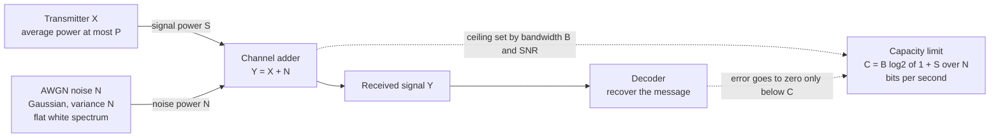

# 📶 The Gaussian Channel and the Shannon-Hartley Theorem

> [!abstract] TL;DR
> The **additive white Gaussian noise (AWGN) channel**, `Y = X + N`, is the fundamental model for almost every physical link — radio, copper, coax, and optical fiber. Under a signal-power budget, its capacity is `C = ½·log₂(1 + P/N)` bits **per channel use**; in a band of width `B` hertz this becomes the **Shannon-Hartley theorem**, `C = B·log₂(1 + S/N)` bits **per second** — arguably the single most important formula in communications. Bandwidth and signal-to-noise ratio (SNR) trade off, and pushing bandwidth to infinity reveals an absolute floor: no system can communicate reliably below **`Eb/N0 = ln 2 ≈ -1.59 dB`** of energy per bit. Modern LDPC and turbo codes now operate within a fraction of a decibel of this limit.

---

## Intuition

**Analogy — the width of a pipe and the clarity of a voice.** Imagine shouting a message across a noisy factory. Two things set how fast you can reliably get words across. First, the **range of pitches** your voice can use — a wider vocal range lets you pack more distinguishable sounds into each second; that is **bandwidth** `B`. Second, **how much louder your voice is than the machine hum** — if you barely rise above the din, the listener must ask you to repeat words, but if you drown out the noise, every word lands; that is the **signal-to-noise ratio** `S/N`. Shannon's formula turns this common sense into an exact number: given a pipe of width `B` and a loudness advantage `S/N`, there is a precise **maximum bits per second** you can push through error-free, and not one bit more.

The deep and surprising part is the word *reliable*. You might expect that as you approach the limit, errors creep up gradually. Shannon proved the opposite: **below** the limit you can drive the error rate to *zero* with clever coding, and **above** it, no scheme on Earth can keep errors down. The Shannon-Hartley formula is the speed limit painted on the wire and the airwave — it does not describe any particular modem, it bounds *every possible* modem.

---

## How It Works

### The channel model

A **continuous-input, continuous-output** channel sends a real number `X` and receives `Y` corrupted by additive noise:

$$Y = X + N, \qquad N \sim \mathcal{N}(0,\,\nu)$$

The noise `N` is **Gaussian** (the central limit theorem makes thermal noise from countless electrons approximately Gaussian), **white** (flat power spectrum, so successive noise samples are independent), and **additive** (independent of the signal). This AWGN model is the continuous counterpart of the discrete channels covered in the sibling note on the binary symmetric channel *(planned)*; the continuous-information machinery it needs — differential entropy — comes from the foundations note on continuous variables *(planned)*.

Without a constraint the answer is trivial: space your input symbols infinitely far apart and noise never confuses them, giving infinite capacity. The physics that makes the problem interesting is a **power constraint**:

$$\mathbb{E}[X^2] \le P$$

You have a limited energy budget. The question becomes: given power `P` and noise power `\nu`, how many *distinguishable* signal levels can you reliably pack in?

### Capacity per channel use

Capacity is the maximum mutual information over all input distributions obeying the power budget:

$$C = \max_{\,p(x):\,\mathbb{E}[X^2]\le P}\; I(X;Y)$$

Using `I(X;Y) = h(Y) - h(Y\mid X) = h(Y) - h(N)`, the noise term `h(N)` is fixed. So we maximize `h(Y)`. The received signal has power `\mathbb{E}[Y^2] = P + \nu`, and among **all** distributions of a given power, the **Gaussian maximizes differential entropy**:

$$h(Y) \le \tfrac{1}{2}\log_2\!\big(2\pi e (P+\nu)\big), \qquad h(N) = \tfrac{1}{2}\log_2\!\big(2\pi e\,\nu\big)$$

Subtracting gives the celebrated result, achieved by choosing a **Gaussian input** `X`:

$$\boxed{\,C = \tfrac{1}{2}\log_2\!\Big(1 + \tfrac{P}{\nu}\Big)\ \text{bits per channel use}\,}$$

Two profound facts fall out. **(1) Gaussian input is optimal** because it is the maximum-entropy distribution for a given power — it "looks the most like noise" and therefore carries the most information. **(2) Gaussian noise is the worst case**: for a fixed noise power, Gaussian noise *minimizes* capacity (a minimax / saddle-point property). So the AWGN capacity is a pessimistic, safe design target — real channels with structured noise can only do better.

### From channel uses to bits per second: Shannon-Hartley

A channel band-limited to `B` hertz supplies, by the [[Sampling_Theorem|Nyquist-Shannon sampling theorem]], `2B` independent samples per second. If the noise has one-sided power spectral density `N₀`, each sample carries noise power `\nu = N₀ B` within the band, and the in-band signal power is `S = P`. Multiplying the per-use capacity by `2B` uses per second:

$$C = 2B \cdot \tfrac{1}{2}\log_2\!\Big(1 + \tfrac{S}{N₀ B}\Big) = \boxed{\,B\,\log_2\!\Big(1 + \tfrac{S}{N}\Big)\ \text{bits per second}\,}$$

with `N = N₀ B` the total in-band noise power and `S/N` the **signal-to-noise ratio**. This is the **Shannon-Hartley theorem**. The quantity `C/B` (bits per second per hertz) is the **spectral efficiency**.

### The bandwidth-power tradeoff and two regimes

- **Bandwidth-limited (high SNR).** When `S/N ≫ 1`, `C ≈ B·log₂(S/N)`. Capacity grows **linearly** with bandwidth but only **logarithmically** with power. Here every extra **3 dB** of SNR (a doubling of power) buys about **one more bit/s/Hz**. Wi-Fi and wired links live here.
- **Power-limited (low SNR).** When `S/N ≪ 1`, `log₂(1+x) ≈ x/\ln 2`, so `C ≈ (1/\ln 2)\,(S/N₀)` — **independent of bandwidth**. Widening the band no longer helps; only raw power (or energy per bit) matters. Deep-space probes like Voyager live here.

### The ultimate limit: the Shannon bound on energy per bit

Write signal power as energy-per-bit times bit rate, `S = E_b\,C`, and let `\eta = C/B` be the spectral efficiency. Substituting into Shannon-Hartley:

$$\eta = \log_2\!\Big(1 + \tfrac{E_b}{N₀}\,\eta\Big) \quad\Longrightarrow\quad \frac{E_b}{N₀} = \frac{2^{\eta}-1}{\eta}$$

As bandwidth grows without bound, `\eta \to 0`, and this ratio approaches its minimum:

$$\lim_{\eta\to 0}\frac{2^{\eta}-1}{\eta} = \ln 2 \approx 0.693 = \boxed{-1.59\ \text{dB}}$$

**No system can communicate reliably with less than `\ln 2` joules of energy per bit per unit of noise density.** This `-1.59 dB` floor is *the* Shannon limit that modern codes chase.

### Flow / Architecture



---

## Key Concepts

### Secondary Level
- **Every link has a speed limit.** A wire or radio channel can only carry so many bits per second, set by two things: how wide a band of frequencies it uses and how much stronger the signal is than the noise.
- **Bandwidth `B`** — the width of the frequency band, in hertz. A wider band is a wider pipe.
- **Signal-to-noise ratio `S/N`** — how loud the signal is compared with the background hiss. Usually quoted in **decibels**: `SNR_dB = 10·log₁₀(S/N)`.
- **More bandwidth or more power means faster** — but power has **diminishing returns**: doubling power adds only a little speed, while the noise floor never goes away.

### Undergraduate Level
- **AWGN channel** — `Y = X + N`, `N` Gaussian, white, additive; the model for radio, copper, coax, and optical links.
- **Capacity per use** — `C = ½·log₂(1 + P/N)` bits per channel use, under the power constraint `E[X²] ≤ P`.
- **Shannon-Hartley** — `C = B·log₂(1 + S/N)` bits per second; `C/B` is spectral efficiency in bits/s/Hz.
- **Two regimes** — *bandwidth-limited* (high SNR: capacity linear in `B`, log in power) vs *power-limited* (low SNR: capacity independent of `B`, set by energy per bit).
- **Decibel rules** — `+3 dB` is a doubling of power; `+6 dB` is a quadrupling of power (or a doubling of amplitude, since `20·log₁₀ 2 ≈ 6`). At high SNR, `+3 dB ⇒ +1 bit/s/Hz`.
- **Energy per bit** — `E_b/N₀` is the fair way to compare systems of different rate and bandwidth; `S/N = (E_b/N₀)·(C/B)`.

### Graduate Level
- **Why Gaussian input is optimal** — the Gaussian maximizes differential entropy `h(X)` for a fixed variance; since `I(X;Y) = h(Y) - h(N)` and `h(N)` is fixed, maximizing `h(Y)` forces a Gaussian `Y`, hence a Gaussian `X`.
- **Why Gaussian noise is worst-case** — for fixed noise power, Gaussian noise minimizes capacity (the Gaussian saddle point / entropy-power inequality). AWGN capacity is therefore a conservative lower bound on real channels.
- **The `-1.59 dB` derivation** — from `E_b/N₀ = (2^η − 1)/η`, take `η → 0` (infinite bandwidth) to get `ln 2`.
- **Water-filling** — for `k` parallel Gaussian channels with noise powers `\nu_i`, the capacity-achieving allocation pours a total power `P` so that `P_i = (\mu - \nu_i)^+`, where the level `\mu` satisfies `Σ_i (\mu - \nu_i)^+ = P`. You **spend power where the noise is lowest** and abandon subchannels whose noise exceeds `\mu`. For frequency-selective channels this becomes water-filling over the spectrum (the basis of DSL bit-loading and OFDM/OFDMA power allocation).
- **MIMO** — with `N_t` transmit and `N_r` receive antennas, the channel splits into up to `min(N_t, N_r)` parallel spatial "eigenchannels", multiplying capacity roughly by that factor — beating the single-antenna Shannon-Hartley limit **without** extra bandwidth or power, purely through spatial multiplexing.
- **Sphere-packing intuition** — over `n` uses, received vectors lie in a ball of radius `√(n(P+ν))`, each codeword surrounded by a noise ball of radius `√(nν)`; the number of non-overlapping noise balls is about `(1+P/ν)^{n/2}`, recovering `½·log₂(1+P/ν)` bits per use geometrically.
- **Gap to capacity** — Shannon-Hartley assumes Gaussian signalling and infinite block length. Practical QAM constellations lose about **1.53 dB** (shaping gap) and finite block length adds a further penalty (channel dispersion / normal approximation), which strong codes plus constellation shaping recover.

---

## Python Demo

```python
# Shannon-Hartley capacity C = B * log2(1 + SNR): the two regimes, the
# bandwidth-power tradeoff, the capacity surface, and the -1.59 dB floor.
# numpy + matplotlib only.
import numpy as np
import matplotlib.pyplot as plt

# ---- Panel A: spectral efficiency C/B vs SNR (dB), fixed bandwidth ----
snr_db = np.linspace(-20, 40, 500)
snr = 10 ** (snr_db / 10.0)               # linear SNR = S/N (must NOT use dB in the formula)
eta = np.log2(1 + snr)                     # bits/s/Hz  (this is C/B)
eta_high = np.log2(snr)                    # high-SNR asymptote: log2(SNR)
eta_low = snr / np.log(2)                  # low-SNR asymptote:  SNR / ln2

# ---- Panel B: capacity vs bandwidth, fixed signal power S and noise PSD N0 ----
S = 1.0                                     # signal power (watts)
N0 = 1e-3                                    # noise power spectral density (watts/Hz)
B = np.linspace(1.0, 20000.0, 500)          # bandwidth (Hz)
N = N0 * B                                   # in-band noise power grows with B
C_of_B = B * np.log2(1 + S / N)             # bits/s
C_inf = S / (N0 * np.log(2))                # infinite-bandwidth saturation limit

# ---- Panel C: capacity surface C(B, SNR) ----
B_grid = np.linspace(1e3, 1e5, 200)         # Hz
snr_db_grid = np.linspace(-10, 30, 200)     # dB
BB, SS = np.meshgrid(B_grid, snr_db_grid)
C_surface = BB * np.log2(1 + 10 ** (SS / 10.0))   # bits/s

# ---- Panel D: the Shannon bound  Eb/N0 = (2^eta - 1)/eta ----
eta_axis = np.linspace(0.01, 8.0, 500)
ebn0 = (2 ** eta_axis - 1) / eta_axis       # required Eb/N0 (linear)
ebn0_db = 10 * np.log10(ebn0)
shannon_limit_db = 10 * np.log10(np.log(2))  # the ultimate floor as eta -> 0

print(f"Ultimate Shannon limit: Eb/N0 = ln2 = {np.log(2):.4f} = {shannon_limit_db:.2f} dB")
print(f"Infinite-bandwidth capacity: C_inf = S/(N0*ln2) = {C_inf:,.1f} bits/s")

fig, ax = plt.subplots(2, 2, figsize=(13, 10))

# A
ax[0, 0].plot(snr_db, eta, "b", lw=2, label="C/B = log2(1 + SNR)")
ax[0, 0].plot(snr_db, eta_high, "r--", label="high-SNR: log2(SNR)  [bandwidth-limited]")
ax[0, 0].plot(snr_db, eta_low, "g--", label="low-SNR: SNR/ln2  [power-limited]")
ax[0, 0].set_ylim(0, 14)
ax[0, 0].set_xlabel("SNR (dB)")
ax[0, 0].set_ylabel("Spectral efficiency (bits/s/Hz)")
ax[0, 0].set_title("Capacity vs SNR: +3 dB adds ~1 bit/s/Hz at high SNR")
ax[0, 0].legend(fontsize=8)
ax[0, 0].grid(alpha=0.3)

# B
ax[0, 1].plot(B / 1e3, C_of_B / 1e3, "b", lw=2, label="C = B log2(1 + S/(N0 B))")
ax[0, 1].axhline(C_inf / 1e3, color="r", ls="--",
                 label=f"C_inf = S/(N0 ln2) = {C_inf/1e3:.1f} kbit/s")
ax[0, 1].set_xlabel("Bandwidth B (kHz)")
ax[0, 1].set_ylabel("Capacity C (kbit/s)")
ax[0, 1].set_title("Bandwidth-power tradeoff: capacity saturates, never linear")
ax[0, 1].legend(fontsize=8)
ax[0, 1].grid(alpha=0.3)

# C
cs = ax[1, 0].contourf(BB / 1e3, SS, C_surface / 1e3, levels=20, cmap="viridis")
fig.colorbar(cs, ax=ax[1, 0], label="Capacity C (kbit/s)")
ax[1, 0].set_xlabel("Bandwidth B (kHz)")
ax[1, 0].set_ylabel("SNR (dB)")
ax[1, 0].set_title("Capacity surface C(B, SNR)")

# D
ax[1, 1].plot(ebn0_db, eta_axis, "b", lw=2, label="Shannon bound: Eb/N0 = (2^eta - 1)/eta")
ax[1, 1].axvline(shannon_limit_db, color="r", ls="--",
                 label=f"limit = {shannon_limit_db:.2f} dB (= 10 log10 ln2)")
ax[1, 1].fill_betweenx(eta_axis, -5, shannon_limit_db, color="r", alpha=0.1)
ax[1, 1].text(-4.0, 4.0, "impossible:\nno reliable\ncommunication", color="r", fontsize=9)
ax[1, 1].set_xlim(-5, 25)
ax[1, 1].set_xlabel("Eb/N0 (dB)")
ax[1, 1].set_ylabel("Spectral efficiency (bits/s/Hz)")
ax[1, 1].set_title("The ultimate limit: the -1.59 dB floor")
ax[1, 1].legend(fontsize=8)
ax[1, 1].grid(alpha=0.3)

plt.tight_layout()
plt.show()
```

**What you see.** *(A)* The spectral-efficiency curve hugs the **linear** low-SNR asymptote below ~0 dB (power-limited: every bit is expensive) and the **logarithmic** high-SNR asymptote above (bandwidth-limited: `+3 dB ⇒ +1 bit/s/Hz`). *(B)* Feeding a fixed signal power into ever more bandwidth does **not** buy unbounded speed — capacity **saturates** at `C_inf = S/(N₀ ln 2)`, because widening the band lets in proportionally more noise. *(C)* The capacity surface makes concrete that both knobs help, but with very different curvature. *(D)* Plotting required `E_b/N₀` versus spectral efficiency draws the famous Shannon-limit curve; the red wall at `-1.59 dB` is the region **no** code can enter, and modern LDPC/turbo systems sit just to its right.

---

## Real-World Applications

> **Example — the Voyager deep-space link.** At billions of kilometres, the received signal is astronomically weak, so Voyager operates deep in the **power-limited** regime (SNR far below 0 dB) with generous bandwidth. NASA squeezed reliability from this near-hopeless channel with a **concatenated Reed-Solomon + convolutional code**, later upgraded to **turbo codes**, closing to within roughly **1-2 dB** of the Shannon-Hartley limit — a textbook demonstration that you can trade bandwidth for the last scraps of power efficiency.

- **Every modem and cellular standard.** The theoretical peak rate of GSM, LTE, 5G NR, DOCSIS cable, and satellite links is computed straight from `C = B·log₂(1 + S/N)`; link budgets are engineered in decibels to hit a target SNR.
- **DSL / ADSL / VDSL.** The copper telephone line is **frequency-selective** (attenuation rises with frequency). DSL uses **discrete multitone (DMT / OFDM)** and performs **water-filling bit-loading** — loading more bits onto low-noise subcarriers and fewer (or none) onto noisy ones. See [[Fourier_Transform|the spectral view]] and [[Frequency_Spectrum|the frequency spectrum]].
- **Wi-Fi and cellular ([[WiFi_Standards_802_11]], [[Cellular_4G_5G]]).** Wi-Fi 6/7 and 5G NR use **LDPC and polar codes** to approach capacity, plus **MIMO** to multiply it: multiple antennas create parallel spatial channels, so aggregate capacity scales with `min(N_t, N_r)` without extra bandwidth.
- **Optical fiber.** Long-haul coherent optical systems apply the same AWGN capacity analysis (with a nonlinear twist) to plan symbol rates and constellation sizes.
- **The [[Physical_Layer|physical layer]] of every network** — the Shannon-Hartley formula is the theoretical ceiling that all physical-layer engineering, from equalizers to error-correcting codes, is trying to reach.

---

## Common Pitfalls

- **Mixing bits-per-use with bits-per-second.** `C = ½·log₂(1 + P/N)` is **per channel use**; `C = B·log₂(1 + S/N)` is **per second**. The factor of `B` (and the `2B` samples/s from Nyquist) is what converts between them — dropping it is the most common error.
- **Plugging SNR in decibels into the formula.** The `S/N` inside `log₂` is a **linear ratio**, not decibels. Convert first: `SNR_lin = 10^(SNR_dB/10)`. A "30 dB" channel means `S/N = 1000`, not `30`.
- **Believing infinite bandwidth gives infinite capacity.** It does not — capacity **saturates** at `S/(N₀ ln 2)` because wider bands admit proportionally more noise. At low SNR, **power (energy per bit), not bandwidth, is the binding constraint.**
- **Thinking a clever code can beat `-1.59 dB`.** The `E_b/N₀ = ln 2` floor is an information-theoretic wall. No modulation, code, or antenna trick communicates reliably below it. Codes can only *approach* it.
- **Forgetting the assumptions.** Shannon-Hartley assumes **AWGN**, a **Gaussian (capacity-achieving) input**, and **infinite block length**. Real QAM loses ~1.53 dB (shaping gap) and finite block length costs more — so practical systems sit a measurable gap above the ideal curve.
- **Confusing one-sided vs two-sided noise density.** `N₀` (one-sided) and `N₀/2` (two-sided) conventions differ by a factor of 2 and quietly corrupt link-budget arithmetic if mixed.
- **Assuming MIMO "breaks" Shannon.** It does not. MIMO creates several **parallel** Gaussian channels, each individually obeying Shannon-Hartley; capacity multiplies because there are more channels, not because any one exceeds its limit.

---

## Related Concepts

- [[Information_Theory_Overview]] — the parent survey; introduces channel capacity `C = max I(X;Y)` and lists Shannon-Hartley as the continuous-channel case.
- [[Joint_Conditional_Entropy_and_Mutual_Information]] — capacity is a maximization of **mutual information**; the AWGN derivation `I(X;Y) = h(Y) − h(N)` builds directly on it.
- [[Entropy_and_Information_Content]] — the discrete entropy whose continuous analogue (differential entropy) makes the Gaussian the maximum-entropy, capacity-achieving input.
- [[Sampling_Theorem]] — Nyquist-Shannon sampling supplies the `2B` independent uses per second that turn per-use capacity into bits per second.
- [[Fourier_Transform]] — bandwidth `B` is a statement about the signal's spectrum; the frequency-domain view underlies water-filling and OFDM.
- [[Frequency_Spectrum]] — frequency-selective channels (like DSL copper) motivate spending power where the spectral noise is lowest.
- [[WiFi_Standards_802_11]] — Wi-Fi rate tables and MIMO streams are Shannon-Hartley plus modern codes in practice.
- [[Cellular_4G_5G]] — LTE/5G link budgets, LDPC/polar coding, and massive MIMO are direct applications of this capacity theory.
- [[Physical_Layer]] — the OSI layer whose ultimate performance ceiling this theorem sets.

**Planned siblings (same section, not yet written):** *Channel_Capacity_and_the_Noisy_Channel_Theorem* (the discrete parent theorem), *Discrete_Channels_and_the_Binary_Symmetric_Channel* (the discrete counterpart), *Differential_Entropy_and_Continuous_Variables* (the continuous-information background), and *Modern_Codes_LDPC_and_Turbo* (how real codes close the gap to this limit).

---

## Review Questions

**Secondary**
1. A Wi-Fi channel is 20 MHz wide with an SNR of 30 dB. Using `C = B·log₂(1 + S/N)`, estimate the maximum data rate. (Hint: convert 30 dB to a linear ratio first.) At this SNR, which helps more — doubling the bandwidth, or adding 3 dB of power — and why?

**Undergraduate**
2. Starting from `C = B·log₂(1 + S/N)` with `N = N₀B`, derive both the high-SNR (`C ≈ B·log₂(S/N)`) and low-SNR (`C ≈ (1/\ln 2)(S/N₀)`) approximations. Explain why a deep-space probe is "power-limited" and why widening its bandwidth eventually stops helping, even though its SNR is far below 0 dB. Show algebraically that at high SNR, `+3 dB` of SNR adds one bit/s/Hz.

**Graduate**
3. (a) Prove that the Gaussian input maximizes `I(X;Y)` for the power-constrained AWGN channel by showing `I(X;Y) = h(Y) − h(N)` and invoking the maximum-entropy property of the Gaussian, arriving at `C = ½·log₂(1 + P/N)`. (b) From `E_b/N₀ = (2^η − 1)/η`, take the limit `η → 0` to derive the `\ln 2 = -1.59 dB` floor, and explain physically why infinite bandwidth cannot buy communication below it. (c) For two parallel Gaussian subchannels with noise powers `\nu_1 < \nu_2` and total power `P`, write the water-filling solution and describe when the noisier subchannel is switched off entirely.

---

## Sources

- [Shannon, C. E. — A Mathematical Theory of Communication (1948), Part III: continuous channels](https://people.math.harvard.edu/~ctm/home/text/others/shannon/entropy/entropy.pdf)
- [Cover, T. & Thomas, J. — Elements of Information Theory (2nd ed.), Ch. 9 "The Gaussian Channel"](https://onlinelibrary.wiley.com/doi/book/10.1002/047174882X)
- [MacKay, D. — Information Theory, Inference, and Learning Algorithms (free PDF), Ch. 11](https://www.inference.org.uk/mackay/itila/book.html)
- [Wikipedia — Shannon-Hartley theorem](https://en.wikipedia.org/wiki/Shannon%E2%80%93Hartley_theorem)
- [Proakis, J. & Salehi, M. — Digital Communications (5th ed.), channel capacity and the Shannon limit](https://www.mheducation.com/highered/product/digital-communications-proakis-salehi/M9780072957167.html)

---

#information-theory #gaussian-channel #shannon-hartley #snr #bandwidth
