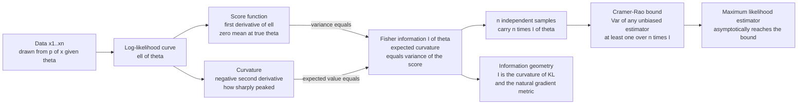

# 🎯 Fisher Information and the Cramer-Rao Bound

> [!abstract] TL;DR
> **Fisher information** $I(\theta)$ measures how sharply the likelihood peaks around the true parameter — the expected curvature of the log-likelihood, equivalently the variance of the score. It answers "how much does one data point tell me about $\theta$?" The **Cramer-Rao bound** turns that into a hard limit: the variance of *any* unbiased estimator is at least $1/(nI(\theta))$. It is the estimation-theory analog of channel capacity — a fundamental floor on precision that no cleverness can beat. Information is additive over independent samples ($n$ points carry $nI$), which is exactly why estimator variance falls like $1/n$, and the maximum-likelihood estimator asymptotically *reaches* this floor. Locally, $I(\theta)$ is the curvature of the KL divergence between nearby distributions, making it the Riemannian metric of information geometry and the engine behind the natural gradient.

---

## Intuition

**Analogy — reading a dial with a fuzzy needle.** Imagine estimating a hidden value by watching a measurement dial. If the needle snaps to a razor-sharp position that swings wildly the moment the hidden value nudges, one glance pins the value down precisely — the reading is *informative*. If instead the needle drifts lazily and barely moves when the hidden value changes, you learn almost nothing from a single glance; you need many readings to average out the sloppiness. **Fisher information is exactly this sensitivity** — how strongly the data's likelihood reacts to a small change in the parameter.

Now picture the **log-likelihood curve** $\ell(\theta)$ plotted against the parameter after you have seen the data. A tall, narrow spike means the data is loudly consistent with one value of $\theta$ and loudly rejects the rest — *high information, precise estimate*. A broad, flat plateau means many values of $\theta$ explain the data almost equally well — *low information, fuzzy estimate*. Fisher information is the **curvature at the peak**: how fast the curve falls away as you leave the best-fit value. The sharper it curves, the harder the data constrains $\theta$, and the smaller the variance any estimator can possibly achieve. The Cramer-Rao bound is the theorem that makes this picture exact.

---

## How It Works

### The score function

Let $p(x;\theta)$ be a statistical model with parameter $\theta$. The **score** is the derivative of the log-likelihood with respect to the parameter:

$$s(x;\theta) \;=\; \frac{\partial}{\partial\theta}\,\log p(x;\theta).$$

The score points in the direction you would nudge $\theta$ to make the observed data more likely. Its first crucial property is that, evaluated at the *true* parameter and averaged over data drawn from that true model, **it has zero mean**:

$$\mathbb{E}_{x\sim p(\cdot;\theta)}\!\left[s(x;\theta)\right] \;=\; \int \frac{\partial_\theta p(x;\theta)}{p(x;\theta)}\, p(x;\theta)\,dx \;=\; \partial_\theta \!\int p(x;\theta)\,dx \;=\; \partial_\theta 1 \;=\; 0.$$

On average the log-likelihood is already at its peak at the true value, so the average slope is zero. Because the mean is zero, the *spread* of the score around zero is what carries the signal.

### Fisher information — two equivalent definitions

**Fisher information** is the variance of the score:

$$I(\theta) \;=\; \mathbb{E}\!\left[\,s(x;\theta)^2\,\right] \;=\; \operatorname{Var}\!\big(s(x;\theta)\big).$$

Under mild regularity conditions (the model is smooth in $\theta$ and you may swap differentiation and integration), this equals the **negative expected second derivative** of the log-likelihood — the expected curvature:

$$I(\theta) \;=\; -\,\mathbb{E}\!\left[\frac{\partial^2}{\partial\theta^2}\,\log p(x;\theta)\right].$$

These are the same number seen two ways: a *wide* score distribution (data reacts strongly to $\theta$) is the same as a *sharply curved* log-likelihood (peak falls off fast). Both say the parameter is well-determined.

### Additivity over independent samples

For $n$ i.i.d. observations the log-likelihood is a **sum**, so its curvature is a sum, and information adds:

$$I_n(\theta) \;=\; n\,I(\theta).$$

Every independent data point contributes the same increment of information. This single fact is why estimator variance shrinks like $1/n$ and standard errors like $1/\sqrt{n}$: doubling the data doubles the Fisher information and halves the achievable variance.

### The Cramer-Rao lower bound

Here is the payoff. For *any* unbiased estimator $\hat\theta(x)$ of $\theta$ built from $n$ i.i.d. samples,

$$\boxed{\;\operatorname{Var}(\hat\theta) \;\ge\; \frac{1}{n\,I(\theta)}\;}$$

No unbiased estimator — however clever, however computationally expensive — can have variance below $1/(nI)$. This is a fundamental limit on measurement precision, the estimation-theory sibling of Shannon's channel-capacity limit on communication. The proof is a one-line consequence of the Cauchy-Schwarz inequality applied to the covariance between $\hat\theta$ and the score.

An estimator that *attains* the bound with equality is called **efficient**; its variance is the smallest physically possible. The ratio $\text{eff} = [1/(nI)] / \operatorname{Var}(\hat\theta) \in (0,1]$ measures how close an estimator gets. The **maximum-likelihood estimator** is *asymptotically efficient*: as $n\to\infty$ it becomes unbiased and its variance converges to the Cramer-Rao floor, with $\sqrt{n}(\hat\theta_{\text{MLE}}-\theta)\to\mathcal{N}\!\big(0,\,I(\theta)^{-1}\big)$. For some models (the mean of a Gaussian, the bias of a coin) the MLE hits the bound *exactly* at every $n$.

### The multi-parameter case: the Fisher information matrix

With a parameter vector $\boldsymbol\theta\in\mathbb{R}^k$, the score is a gradient and Fisher information becomes a $k\times k$ **Fisher information matrix**:

$$F_{ij}(\boldsymbol\theta) \;=\; \mathbb{E}\!\left[\partial_{\theta_i}\log p \cdot \partial_{\theta_j}\log p\right] \;=\; -\,\mathbb{E}\!\left[\partial_{\theta_i}\partial_{\theta_j}\log p\right].$$

The Cramer-Rao bound generalizes to a matrix inequality: $\operatorname{Cov}(\hat{\boldsymbol\theta}) \succeq \big(n F\big)^{-1}$, meaning the difference is positive semi-definite. The diagonal of $F^{-1}$ lower-bounds each parameter's variance; off-diagonal entries encode how estimating one parameter degrades another (parameter coupling).

### The bridge to KL divergence and information geometry

Fisher information is the **local, infinitesimal curvature of the KL divergence** between nearby distributions. Expanding the divergence between $p(\cdot;\theta)$ and a slightly perturbed $p(\cdot;\theta+d\theta)$ to second order:

$$D\big(p_\theta \,\|\, p_{\theta+d\theta}\big) \;\approx\; \tfrac{1}{2}\, d\theta^\top F(\theta)\, d\theta.$$

KL divergence is *flat* to first order (its gradient vanishes because divergence is minimized at $d\theta=0$) and its **second-order term is precisely the Fisher information matrix**. This makes $F(\theta)$ a **Riemannian metric** on the manifold of probability distributions — the foundation of information geometry. Distances measured with this metric are invariant to how you parameterize the model, which is why the **natural gradient** $F^{-1}\nabla\mathcal{L}$ — steepest descent in distribution space rather than raw parameter space — is reparameterization-invariant and often converges faster than ordinary gradient descent.

### Flow: from likelihood curvature to the precision floor



---

## Key Concepts

### Secondary (intuition-level)

- **Sharp peak, precise estimate.** A tall narrow likelihood spike means the data strongly pins down the parameter; a flat one means you barely know it.
- **Fisher information = the sharpness of that peak.** More information means a smaller unavoidable error.
- **The Cramer-Rao bound is a speed limit for accuracy.** No matter how you crunch the numbers, an unbiased estimate cannot be more precise than $1/(nI)$.
- **More data helps predictably.** Each independent sample adds the same chunk of information, so your uncertainty shrinks like one over the square root of the sample size.

### Undergraduate (needs probability + calculus)

- **Score.** $s(x;\theta)=\partial_\theta\log p(x;\theta)$; it has **zero mean** at the true $\theta$ (differentiate the normalization $\int p\,dx = 1$).
- **Two faces of $I(\theta)$.** Variance of the score $=$ negative expected second derivative of the log-likelihood. Use whichever is easier to compute for a given model.
- **Worked example — Gaussian mean.** For $X\sim\mathcal{N}(\mu,\sigma^2)$ with known $\sigma$: $\log p = -\tfrac{(x-\mu)^2}{2\sigma^2}+\text{const}$, score $=(x-\mu)/\sigma^2$, and $I(\mu)=1/\sigma^2$. Then CRB $=\sigma^2/n$, exactly the variance of the sample mean — the MLE is efficient.
- **Worked example — coin bias.** For Bernoulli$(p)$: $I(p)=1/[p(1-p)]$, so CRB $=p(1-p)/n$, again matched by the sample proportion.
- **Additivity.** $I_n(\theta)=nI(\theta)$; this is *why* variances scale as $1/n$.
- **Efficiency.** An estimator is efficient if $\operatorname{Var}=1/(nI)$. The MLE achieves this as $n\to\infty$.

### Graduate (system-level)

- **Regularity conditions matter.** The bound assumes the support of $p(x;\theta)$ does not depend on $\theta$ and that differentiation under the integral is valid. The uniform distribution on $[0,\theta]$ *violates* this — its MLE has variance $O(1/n^2)$, seemingly "beating" a naively computed CRB, because the bound simply does not apply.
- **Biased estimators.** The general Cramer-Rao bound reads $\operatorname{Var}(\hat\theta)\ge (1+b'(\theta))^2/(nI(\theta))$ where $b(\theta)$ is the bias. Deliberately biased estimators (ridge regression, James-Stein) can have lower *mean-squared error* than any unbiased one — the bias-variance trade-off lives here.
- **Fisher information matrix and coupling.** $\operatorname{Cov}(\hat{\boldsymbol\theta})\succeq (nF)^{-1}$. A near-singular $F$ signals a poorly identifiable parameter combination (a flat direction in the likelihood); its inverse blows up, warning of unstable estimates.
- **KL curvature / information geometry.** $D(p_\theta\|p_{\theta+d\theta})\approx\tfrac12 d\theta^\top F\, d\theta$. $F$ is the Fisher-Rao Riemannian metric; the geodesic distance is the reparameterization-invariant "statistical distance" between models.
- **Natural gradient.** Amari's natural gradient $\tilde\nabla\mathcal{L}=F^{-1}\nabla\mathcal{L}$ is steepest descent under the Fisher metric; K-FAC and second-order optimizers approximate $F$ to accelerate deep-net training.
- **Jeffreys prior.** The prior $\pi(\theta)\propto\sqrt{\det F(\theta)}$ is invariant under reparameterization — the unique "uninformative" prior that assigns equal mass to equally-distinguishable regions of model space.
- **Cramer-Rao vs the Bayesian world.** The van Trees inequality (Bayesian Cramer-Rao bound) extends the floor to random parameters, adding the prior's Fisher information to the data's.

---

## Python Demo

```python
# numpy + matplotlib only.
# Goal: for the mean of a Gaussian (known variance) we (1) show the log-likelihood
# gets sharper -- more Fisher information -- as n grows, and (2) run a Monte Carlo
# simulation of the MLE (the sample mean) to show its empirical variance rides the
# Cramer-Rao lower bound  CRB = 1/(n*I) = sigma^2/n, the fundamental precision floor.

import numpy as np
import matplotlib.pyplot as plt

rng = np.random.default_rng(0)

# --- True model:  X ~ Normal(mu_true, sigma^2), sigma known ------------------
mu_true = 2.0
sigma   = 1.5

# Fisher information for the Gaussian mean (per sample):
#   log p(x; mu) = -(x - mu)^2 / (2 sigma^2) + const
#   score  s = d/dmu log p = (x - mu) / sigma^2         -> mean zero at mu_true
#   -d^2/dmu^2 log p = 1 / sigma^2                       -> I(mu) = 1/sigma^2
I_single = 1.0 / sigma**2
print(f"Fisher information per sample  I(mu) = 1/sigma^2 = {I_single:.4f}")
print(f"Additivity: n samples carry n * I(mu), so CRB = 1/(n*I) = sigma^2/n\n")

fig, (ax1, ax2) = plt.subplots(1, 2, figsize=(11, 4.3))

# --- Part 1: likelihood sharpens (curvature grows) as data accumulates -------
mu_grid = np.linspace(mu_true - 2, mu_true + 2, 400)
for n in [2, 10, 50]:
    x  = rng.normal(mu_true, sigma, size=n)
    ll = -0.5 * np.sum((x[:, None] - mu_grid[None, :])**2, axis=0) / sigma**2
    ll -= ll.max()                      # shift peak to 0 for comparison
    ax1.plot(mu_grid, ll, lw=2, label=f"n = {n}")
ax1.axvline(mu_true, ls=":", color="k", label="true mu")
ax1.set_xlabel("parameter mu")
ax1.set_ylabel("log-likelihood  (peak shifted to 0)")
ax1.set_title("More data -> sharper peak -> more Fisher information")
ax1.legend(fontsize=8)

# --- Part 2: Monte Carlo MLE variance vs the Cramer-Rao bound ----------------
ns     = np.unique(np.logspace(0.7, 3.3, 18).astype(int))   # ~5 .. ~2000
trials = 4000
emp_var = np.empty(len(ns))
for k, n in enumerate(ns):
    samples    = rng.normal(mu_true, sigma, size=(trials, n))
    mle        = samples.mean(axis=1)   # MLE of the Gaussian mean = sample mean
    emp_var[k] = mle.var(ddof=1)
crb = sigma**2 / ns                     # 1 / (n * I)

ax2.loglog(ns, emp_var, "o", ms=6, label="empirical Var of the MLE")
ax2.loglog(ns, crb, "-", lw=2, label="Cramer-Rao bound  sigma^2 / n")
ax2.set_xlabel("sample size n")
ax2.set_ylabel("estimator variance")
ax2.set_title("MLE variance rides the Cramer-Rao floor")
ax2.legend(fontsize=8)

plt.tight_layout()
plt.savefig("fisher_cramer_rao.png", dpi=120)
plt.show()

# --- Numerical check at a single sample size ---------------------------------
n = 100
mle_100 = rng.normal(mu_true, sigma, size=(20000, n)).mean(axis=1)
crb_100 = sigma**2 / n
emp_100 = mle_100.var(ddof=1)
print(f"At n = {n}:")
print(f"  Cramer-Rao bound  sigma^2/n      = {crb_100:.5f}")
print(f"  empirical Var(MLE)               = {emp_100:.5f}")
print(f"  efficiency = CRB / empirical Var = {crb_100/emp_100:.3f}  (1.0 = efficient)")
```

**What the output shows.** Left panel: with only $n=2$ points the log-likelihood is a broad, gently curved hump — many values of $\mu$ are almost equally plausible (low Fisher information). By $n=50$ it is a tight spike whose curvature is $25\times$ steeper, pinning $\mu$ down precisely. Right panel: on log-log axes the Monte Carlo variance of the MLE (dots) lands *directly on* the Cramer-Rao line $\sigma^2/n$ (solid) across three decades of $n$, both falling with slope $-1$. The estimator is riding the fundamental precision floor at every sample size — the printed efficiency comes out at essentially $1.0$, confirming the sample mean is an efficient estimator that no unbiased method can beat.

---

## Real-World Applications

> **GPS and radar ranging.** A receiver estimates time-of-arrival (hence distance) from a noisy signal. The Cramer-Rao bound sets the best achievable positioning variance, and it grows steep with signal bandwidth: wider-band signals produce a more sharply peaked correlation likelihood (higher Fisher information), which is precisely why high-precision GNSS and radar use wideband waveforms. Engineers design waveforms to *maximize* Fisher information for the parameter they care about.

> **Optimal experimental design.** In A/B tests, clinical trials, and sensor placement, "D-optimal" and "A-optimal" designs choose measurement conditions to **maximize the determinant or trace of the Fisher information matrix**, minimizing the volume of the parameter confidence ellipsoid. You are literally buying the most information per experiment.

> **The standard quantum limit in metrology.** In interferometry and atomic clocks, the classical CRB gives a $1/\sqrt{N}$ scaling of phase precision with photon or atom number. The **quantum Cramer-Rao bound** (using the quantum Fisher information) shows entangled states can reach the $1/N$ Heisenberg limit — the theoretical foundation of gravitational-wave detector and precision-clock design.

> **Natural-gradient optimization in ML.** Amari's natural gradient and its practical approximations (K-FAC, TRPO's trust region) precondition parameter updates by the inverse Fisher information matrix, taking steepest-descent steps in *distribution* space rather than raw weight space. This makes training invariant to reparameterization and often speeds convergence for deep networks and policy-gradient reinforcement learning. See [[Optimizers]] and [[Newtons_Method]].

> **Confidence intervals everywhere in statistics.** The standard errors reported by essentially every fitting routine — logistic regression, generalized linear models, structural equation models — come from inverting the observed Fisher information at the MLE. The $\hat\theta \pm 1.96\sqrt{[F^{-1}]_{jj}/n}$ interval *is* the Cramer-Rao bound made practical.

---

## Common Pitfalls

- **Applying the bound where regularity fails.** The Cramer-Rao bound requires the support of the distribution to be independent of $\theta$ and the likelihood to be smooth. For the uniform on $[0,\theta]$, the max-order statistic estimates $\theta$ with variance $O(1/n^2)$, apparently smashing the naive bound — because the bound simply does not hold there. Always check regularity before quoting a CRB.
- **Forgetting the bound is for *unbiased* estimators.** A biased estimator can legitimately have smaller variance (and smaller MSE) than $1/(nI)$. Shrinkage estimators (ridge, James-Stein) exploit exactly this. Compare MSE, not variance, when bias is in play.
- **Confusing observed and expected information.** Fisher information $I(\theta)$ is an *expectation* over data; the **observed** information $-\ell''(\hat\theta)$ evaluated at the MLE from one dataset is a random approximation to it. Standard errors often use observed information — fine asymptotically, but they are not the same object.
- **Treating asymptotic efficiency as finite-sample optimality.** The MLE reaches the CRB *as $n\to\infty$*. For small $n$ it can be badly biased and above the bound (e.g. the MLE of a variance, or of an exponential rate $1/\bar x$). Do not assume the MLE is optimal at $n=10$.
- **Parameterization confusion.** Fisher information is *not* invariant to reparameterization — it transforms by the Jacobian squared, $I_\phi=(d\theta/d\phi)^2 I_\theta$. Report which parameterization you used. Jeffreys prior and the natural gradient exist precisely to restore invariance.
- **Singular or ill-conditioned $F$.** A near-singular Fisher matrix means a flat direction in the likelihood — some parameter combination is barely identifiable. Inverting it yields exploding, unstable variances; this is a modeling signal, not a numerical nuisance to be regularized away silently.

---

## Related Concepts

*Section siblings (Information Theory / Inference):*
- [[Relative_Entropy_and_Cross_Entropy]] — Fisher information is the second-order (local) curvature of the KL divergence between nearby distributions; it is the Bregman/Hessian that makes KL a squared statistical distance.
- [[Entropy_and_Information_Content]] — Shannon information counts bits in a *distribution*; Fisher information counts precision about a *parameter*. Same word, complementary notions.
- [[Differential_Entropy_and_Continuous_Variables]] — the de Bruijn identity and the entropy-power inequality tie differential entropy directly to Fisher information under Gaussian perturbation.

*Cross-vault connections (verified):*
- [[Statistical_Inference]] — the maximum-likelihood estimator is asymptotically efficient: it attains the Cramer-Rao floor as $n\to\infty$; this note grounds the estimation setting.
- [[Bayesian_Statistics]] — the Jeffreys prior $\pi(\theta)\propto\sqrt{\det F(\theta)}$ is the reparameterization-invariant "uninformative" prior built from Fisher information.
- [[Common_Probability_Distributions]] — the Gaussian, Bernoulli, and exponential worked examples of $I(\theta)$ live here; the Gaussian mean is the canonical efficient case.
- [[Newtons_Method]] — the Fisher information matrix plays the role of an expected Hessian; the natural gradient is a Newton-like second-order step in distribution space.
- [[Optimizers]] — natural-gradient and K-FAC optimizers precondition updates by the inverse Fisher matrix for reparameterization-invariant, faster training.
- [[Calculus_for_ML]] — the score is a gradient of the log-likelihood and Fisher information a curvature; the machinery is the same differential calculus used in backprop.

---

## Review Questions

1. **(Secondary)** Using the "fuzzy dial" picture, explain why a sharply peaked likelihood corresponds to high Fisher information and a precise estimate, while a flat likelihood corresponds to low information. Why does collecting more independent data always tighten your estimate, and at what rate?
2. **(Undergraduate)** For a Bernoulli$(p)$ coin, derive the score, show it has zero mean at the true $p$, and compute the Fisher information $I(p)=1/[p(1-p)]$. Write down the Cramer-Rao bound for $n$ flips and verify that the sample proportion $\hat p=\bar x$ attains it exactly. For which value of $p$ is estimation hardest, and why does that match intuition?
3. **(Graduate)** Explain in what precise sense the Fisher information matrix is the curvature of the KL divergence, and how this makes it a Riemannian metric on the space of distributions. Then explain why the natural gradient $F^{-1}\nabla\mathcal{L}$ is invariant to reparameterization whereas ordinary gradient descent is not. Finally, give one model where the plain Cramer-Rao bound fails and state exactly which regularity condition is violated.

---

## Sources

- Cover, T. M. & Thomas, J. A. (2006). *Elements of Information Theory* (2nd ed.), Ch. 11 (information theory and statistics; Fisher information and the Cramer-Rao bound). Wiley.
- Rao, C. R. (1945). *Information and the accuracy attainable in the estimation of statistical parameters.* Bulletin of the Calcutta Mathematical Society, 37, 81-91. (original Cramer-Rao result)
- Amari, S. (2016). *Information Geometry and Its Applications.* Springer. (Fisher metric, natural gradient)
- Lehmann, E. L. & Casella, G. (1998). *Theory of Point Estimation* (2nd ed.), Ch. 2 (Cramer-Rao bound, efficiency, asymptotics of the MLE). Springer.
- Kay, S. M. (1993). *Fundamentals of Statistical Signal Processing: Estimation Theory*, Vol. 1, Ch. 3 (Cramer-Rao lower bound in signal processing). Prentice Hall.

---

#information-theory #fisher-information #cramer-rao #estimation #information-geometry
