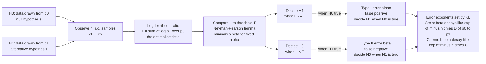

# 🔎 Hypothesis Testing and Information

> [!abstract] TL;DR
> Deciding whether your data came from distribution $p_0$ or $p_1$ is a coding problem in disguise. The **Neyman–Pearson lemma** says the optimal decision rule is the **log-likelihood ratio test**, and information theory tells you exactly how *good* that test can be: as you collect more samples $n$, the error probability decays **exponentially**, and the decay rate — the *error exponent* — is a **KL divergence**. **Stein's lemma** pins the Type-II exponent at $D(p_0\|p_1)$; **Chernoff information** gives the best exponent when both errors shrink together. In one line: KL divergence *is* the statistical distinguishability between two hypotheses, and $1/D$ is the number of samples you need to tell them apart.

---

## Intuition

**Analogy — telling two nearly-identical coins apart.** Someone hands you a coin that is either fair ($p_0$: heads with probability $0.5$) or very slightly biased ($p_1$: heads with probability $0.51$). You flip it and must decide which. After one flip you have essentially no idea. After a thousand flips you can start to guess. After a *million* flips you can be almost certain. Now imagine instead the biased coin lands heads $90\%$ of the time — you would need only a handful of flips to be sure. The gap between "a million flips" and "a handful" is set by *how different the two distributions are*, and information theory names that gap precisely: it is the **KL divergence** $D(p_0\|p_1)$.

The more the two candidate distributions diverge, the more each sample *screams* which hypothesis is true, and the fewer samples you need before the evidence is overwhelming. Distinguishability is not vague — it is a number of nats per sample, and that number is a relative entropy (see [[Relative_Entropy_and_Cross_Entropy]]). Every sample you draw contributes, on average, $D(p_0\|p_1)$ nats of evidence against the wrong hypothesis, so the probability of still being fooled after $n$ samples falls off like $e^{-nD}$.

---

## How It Works

### The binary decision and its two errors

You observe i.i.d. data $x_1,\dots,x_n$ and must choose between two hypotheses:

- $H_0$ (**null**): the data came from $p_0$.
- $H_1$ (**alternative**): the data came from $p_1$.

A decision rule partitions the sample space into an "accept $H_0$" region and an "accept $H_1$" region. Two things can go wrong:

- **Type I error** (false positive), rate $\alpha = \Pr[\text{decide } H_1 \mid H_0 \text{ true}]$ — the *significance level*.
- **Type II error** (false negative), rate $\beta = \Pr[\text{decide } H_0 \mid H_1 \text{ true}]$. Its complement $1-\beta$ is the *power*.

You cannot drive both to zero at once with finite data; there is a fundamental trade-off, and the question is how to spend a fixed $\alpha$ budget to make $\beta$ as small as possible.

### The Neyman–Pearson lemma: the likelihood ratio test is optimal

Among *all* tests with Type-I error at most $\alpha$, the one that **minimizes** $\beta$ is the **likelihood ratio test (LRT)**: decide $H_1$ when

$$\Lambda(x^n) \;=\; \frac{p_1(x_1,\dots,x_n)}{p_0(x_1,\dots,x_n)} \;\ge\; \tau,$$

for a threshold $\tau$ chosen to hit the desired $\alpha$. Taking logs and using independence, the optimal statistic is the **summed log-likelihood ratio**:

$$L(x^n) \;=\; \sum_{i=1}^{n} \log\frac{p_1(x_i)}{p_0(x_i)}.$$

This is the quantity that maximum-likelihood reasoning also produces (see [[Maximum_Likelihood_Estimation]]): each sample casts a vote of $\log\frac{p_1(x_i)}{p_0(x_i)}$ nats, and you accumulate votes until the total crosses a threshold. Under $H_0$ the average vote per sample is $-D(p_0\|p_1)$; under $H_1$ it is $+D(p_1\|p_0)$. The two hypotheses push $L$ in opposite directions at rates given by KL divergences — which is exactly why the error probabilities decay at KL-controlled rates.

### Error exponents: Stein's lemma and Chernoff information

As $n$ grows, both error probabilities decay exponentially, and the *exponents* are the payoff of the whole theory.

**Stein's lemma (asymmetric setting).** Fix the Type-I error at any level $\alpha < 1$ and let $n\to\infty$. The smallest achievable Type-II error obeys

$$\beta_n \;\doteq\; e^{-n\,D(p_0\|p_1)},$$

i.e. $\lim_{n\to\infty} -\tfrac{1}{n}\log \beta_n = D(p_0\|p_1)$, independent of the fixed $\alpha$. The Type-II error decays at a rate equal to the KL divergence from $p_0$ to $p_1$ — relative entropy *is* the operational currency of distinguishability.

**Chernoff information (symmetric setting).** If instead you weight both hypotheses (equal priors) and minimize the overall Bayesian error $P_e = \tfrac12(\alpha_n + \beta_n)$, then

$$P_e \;\doteq\; e^{-n\,C(p_0,p_1)}, \qquad C(p_0,p_1) = -\min_{0\le s\le 1}\log \sum_x p_0(x)^{1-s} p_1(x)^{s}.$$

$C(p_0,p_1)$ is the **Chernoff information**, the best exponent when *both* errors must vanish. It is symmetric, and it is always no larger than either one-sided KL. The family $\sum_x p_0^{1-s}p_1^{s}$ traces the Rényi/Chernoff bound, and the optimal $s^\star$ picks the tilted distribution that both hypotheses find equally atypical.

### Sanov's theorem and the method of types

Why are the exponents KL divergences at all? Because of a deep large-deviations fact. The empirical distribution (the "type") $\hat p$ of $n$ i.i.d. samples concentrates on the true distribution, and the probability of seeing an *atypical* empirical distribution $q$ decays as

$$\Pr[\hat p \approx q] \;\doteq\; e^{-n\,D(q\|p)} \qquad \text{(Sanov's theorem)}.$$

Hypothesis testing errors are precisely the probability that the data "looks like it came from the other hypothesis," i.e. that the type strays into the wrong decision region. Optimizing the exponent over that region yields Stein's $D(p_0\|p_1)$ and Chernoff's $C$. This is the bridge between **information theory and large-deviation theory**: KL divergence is the rate function of empirical measures.

### Flow / Architecture



---

## Key Concepts

### Secondary (intuition level)

- **A test is a decision rule.** Look at the data, then pick $H_0$ or $H_1$. There is no rule that is always right with finite data.
- **Two ways to be wrong.** A false positive ("cried wolf": chose $H_1$ but $H_0$ was true) and a false negative ("missed it": chose $H_0$ but $H_1$ was true). You trade one against the other.
- **More separation, fewer samples.** The more the two candidate distributions differ, the faster the evidence piles up and the sooner you can be confident. That "difference" is measured by KL divergence.
- **Errors shrink fast.** Each extra sample multiplies your chance of being fooled by a constant factor less than one, so the error probability falls off exponentially — plotted on a log scale it is a straight line with slope set by the KL divergence.

### Undergraduate (needs probability)

- **Neyman–Pearson lemma.** For fixed $\alpha$, the likelihood ratio test $\Lambda \ge \tau$ is the *most powerful* test — no other rule achieves a smaller $\beta$ at that $\alpha$. Optimality of the LRT is the cornerstone result.
- **Log-likelihood ratio as sufficient statistic.** $L(x^n)=\sum_i \log\frac{p_1(x_i)}{p_0(x_i)}$ carries all the discriminative information; the threshold slides along the $\alpha$–$\beta$ trade-off (the ROC curve).
- **Stein's lemma.** Hold $\alpha$ fixed; then $-\tfrac1n\log\beta_n \to D(p_0\|p_1)$. The Type-II error exponent is a KL divergence.
- **Sample complexity from KL.** To reach a target Type-II error $\beta$, you need about $n \approx \frac{\ln(1/\beta)}{D(p_0\|p_1)}$ samples. Distinguishing "close" hypotheses (small $D$) is expensive; distinguishing "far" ones is cheap.
- **Composite hypotheses.** When $H_1$ (or $H_0$) is a *family* of distributions rather than a single one, replace the likelihood with the maximized likelihood: the **generalized likelihood ratio test (GLRT)** uses $\max_{\theta\in\Theta_1} p_\theta / \max_{\theta\in\Theta_0} p_\theta$.

### Graduate (system level)

- **Chernoff information.** The symmetric Bayesian error exponent $C(p_0,p_1)=-\min_{s\in[0,1]}\log\sum_x p_0^{1-s}p_1^{s}$. At the optimal $s^\star$, both tilted error exponents coincide; $C$ equals the KL divergence from either endpoint to the "midpoint" tilted distribution $p_{s^\star}$.
- **Sanov and the method of types.** There are only polynomially many types among $n$ samples, each with probability $\doteq e^{-nD(\text{type}\,\|\,p)}$. Summing over a decision region, the dominant exponent is the *closest* type in KL — the "information projection." This is the machinery behind both Stein and Chernoff.
- **Connection to channel coding converses.** Hypothesis-testing lower bounds *are* the converse machinery of communication. **Fano's inequality** and the **data processing inequality** ([[Information_Inequalities_and_the_Data_Processing_Inequality]]) convert an error requirement into a KL/mutual-information bound; meta-converses (Polyanskiy–Poor–Verdú) express channel-coding limits directly as binary hypothesis tests between the true channel output and a reference.
- **Fisher information as local KL.** For nearby hypotheses $p_\theta$ and $p_{\theta+d\theta}$, $D(p_\theta\|p_{\theta+d\theta})\approx \tfrac12\, d\theta^\top F(\theta)\, d\theta$, where $F$ is the **Fisher information** matrix. So the Cramér–Rao bound and hypothesis-testing exponents are the same geometry viewed globally (KL) versus infinitesimally (Fisher) — distinguishability *is* curvature of the KL landscape.
- **Minimax lower bounds in statistics.** Le Cam's two-point method, Assouad's lemma, and Fano's method all reduce estimation lower bounds to *how hard it is to test* between cleverly chosen hypotheses. Small KL between planted alternatives means no estimator can separate them, yielding an unbeatable risk floor for *every* algorithm (see [[Statistical_Inference]]).
- **Multiple hypotheses.** With $M$ candidates, the error exponent is governed by the *minimum* pairwise Chernoff information $\min_{i\ne j} C(p_i,p_j)$ — the closest pair is the bottleneck, exactly as minimum distance governs a code.

---

## Python Demo

```python
# numpy + matplotlib only.
# Binary hypothesis testing between two unit-variance Gaussians:
#   H0: x ~ N(0, 1)     vs     H1: x ~ N(d, 1)
# The optimal Neyman-Pearson / Bayes rule on n i.i.d. samples is the
# log-likelihood ratio test, which here reduces to comparing the sample
# mean to the midpoint d/2 (threshold 0 for equal priors).
#
# We Monte-Carlo the Bayes error P_err vs sample size n for three
# separations d, and show:
#   (1) P_err decays EXPONENTIALLY in n  (straight lines on a log axis),
#   (2) the slope equals the Chernoff information C = d^2 / 8,
#   (3) larger KL = d^2 / 2  =>  steeper slope  =>  fewer samples needed.

import numpy as np
import matplotlib.pyplot as plt

rng = np.random.default_rng(0)

separations = [0.5, 1.0, 1.5]      # larger d  ->  more distinguishable
n_values = np.arange(2, 41)        # sample sizes
trials = 400_000                   # Monte Carlo repetitions per (d, n)

def kl_gaussian(d):        # D(N(0,1) || N(d,1)) = d^2 / 2   [nats]
    return d ** 2 / 2.0

def chernoff_gaussian(d):  # Chernoff info between N(0,1) and N(d,1) = d^2 / 8
    return d ** 2 / 8.0

plt.figure(figsize=(8.5, 5.5))
colors = ["tab:blue", "tab:orange", "tab:red"]

for d, col in zip(separations, colors):
    C = chernoff_gaussian(d)
    p_err = []
    for n in n_values:
        # sample-mean statistic under each hypothesis (variance shrinks as 1/n)
        m0 = rng.standard_normal(trials) / np.sqrt(n)          # ~ N(0,   1/n)
        m1 = d + rng.standard_normal(trials) / np.sqrt(n)      # ~ N(d,   1/n)
        err0 = np.mean(m0 >= d / 2)    # false positive: decide H1 under H0
        err1 = np.mean(m1 <  d / 2)    # false negative: decide H0 under H1
        p_err.append(0.5 * (err0 + err1))
    p_err = np.array(p_err)

    # keep only reliably estimated points (enough error events to trust)
    ok = p_err * trials >= 15
    plt.semilogy(n_values[ok], p_err[ok], "o", color=col, ms=4,
                 label=f"d={d}:  KL={kl_gaussian(d):.3f},  Chernoff={C:.3f}")

    # theoretical error-exponent line:  P_err ~ A * exp(-n * C)
    A = p_err[ok][0] / np.exp(-C * n_values[ok][0])
    plt.semilogy(n_values, A * np.exp(-C * n_values), "--", color=col, lw=1)

    # sample complexity to reach a target error, straight from the exponent
    target = 1e-4
    n_needed = np.log(1.0 / target) / C
    print(f"d={d}:  KL(p0||p1)={kl_gaussian(d):.3f} nats, "
          f"Chernoff C={C:.3f} nats  ->  "
          f"~{n_needed:.0f} samples for P_err <= {target:g}")

plt.xlabel("number of samples n")
plt.ylabel("Bayes error probability  P_err  [log scale]")
plt.title("Error decays as exp(-n * Chernoff); "
          "larger KL => steeper slope => fewer samples")
plt.legend(fontsize=8)
plt.grid(alpha=0.3, which="both")
plt.tight_layout()
plt.savefig("hypothesis_testing_error_exponent.png", dpi=120)
plt.show()

# Typical printed output:
#   d=0.5:  KL(p0||p1)=0.125 nats, Chernoff C=0.031 nats  ->  ~295 samples ...
#   d=1.0:  KL(p0||p1)=0.500 nats, Chernoff C=0.125 nats  ->  ~74 samples  ...
#   d=1.5:  KL(p0||p1)=1.125 nats, Chernoff C=0.281 nats  ->  ~33 samples  ...
```

**What the output shows.** On the log-scaled $y$-axis the Monte-Carlo error points fall along **straight lines** — the signature of exponential decay $P_e \doteq e^{-nC}$ — and each dashed line, drawn using only the closed-form Chernoff exponent $C=d^2/8$, tracks its markers. The three slopes fan out: the well-separated pair ($d=1.5$, KL $=1.125$ nats) plunges roughly nine times faster than the barely-separated pair ($d=0.5$, KL $=0.125$ nats). The printout makes the sample-complexity link concrete: reaching a $10^{-4}$ error needs about $295$ samples for the close hypotheses but only $\sim 33$ for the far ones — the required $n$ scales as $1/D$, exactly Stein's lemma read backwards.

---

## Real-World Applications

> **Radar and signal detection.** Deciding "target present" ($H_1$) versus "noise only" ($H_0$) from a received waveform is textbook binary hypothesis testing. The optimal detector is the **matched filter**, which is precisely the log-likelihood ratio for a known signal in Gaussian noise; the detection/false-alarm trade-off is the ROC curve, and the achievable performance at range is governed by the KL divergence (deflection/SNR) between the two hypotheses.

> **A/B testing and sample-size planning.** "Does variant B change the conversion rate?" is $H_0: p_A=p_B$ vs $H_1: p_A\ne p_B$. The required number of users to detect an effect at a chosen power scales inversely with the KL divergence (equivalently the squared effect size divided by variance) between the two rate hypotheses — this is why detecting a $0.1\%$ lift needs orders of magnitude more traffic than a $5\%$ lift.

> **Anomaly and change detection.** Monitoring a data stream for a shift from a baseline $p_0$ to an anomalous $p_1$ is sequential hypothesis testing; the **CUSUM** and Shiryaev–Roberts procedures accumulate the log-likelihood ratio and alarm when it crosses a threshold. The expected detection delay is inversely proportional to $D(p_1\|p_0)$ — a bigger distributional shift is caught faster.

> **Minimax lower bounds in machine learning.** To prove that *no* algorithm can estimate a parameter below some error with $n$ samples, statisticians plant two (or many) hypotheses with small KL and invoke Le Cam/Fano: if the hypotheses are information-theoretically hard to test apart, they are impossible to estimate apart. This turns hypothesis testing into the universal tool for impossibility results in learning theory.

> **Channel coding converses.** The tightest finite-blocklength communication limits (the meta-converse) are stated as a binary hypothesis test between the actual channel and an auxiliary one — the same $\alpha$–$\beta$ trade-off that governs radar governs the ultimate rate of a modem (see [[Discrete_Channels_and_the_Binary_Symmetric_Channel]]).

---

## Common Pitfalls

- **Confusing the two KL directions.** Stein's Type-II exponent is $D(p_0\|p_1)$ — divergence *from the null to the alternative*. Swap the arguments and you get the exponent for the *other* fixed-error convention. Because KL is asymmetric, $D(p_0\|p_1)\ne D(p_1\|p_0)$, and using the wrong one mis-predicts your sample size.
- **Expecting Chernoff to equal a one-sided KL.** The symmetric Bayesian exponent $C$ is generally *strictly smaller* than either $D(p_0\|p_1)$ or $D(p_1\|p_0)$; it lives at the tilted midpoint. Do not report the KL divergence as the two-sided error exponent.
- **Ignoring that exponents are asymptotic.** $\doteq$ hides polynomial prefactors and lower-order terms. For small $n$ the true error can differ substantially from $e^{-nD}$; the exponent is the *slope*, not the whole curve. Finite-blocklength corrections matter when data is scarce.
- **Treating a non-rejected null as "proven."** Failing to reject $H_0$ only means the evidence was insufficient at your $\alpha$; with small KL and small $n$, $\beta$ can be enormous. Absence of evidence is not evidence of absence — report power, not just significance.
- **p-hacking and multiple comparisons.** Running many tests inflates the family-wise false-positive rate; each test spends $\alpha$, and the chance that *some* test fires by luck grows fast. The information view: you are implicitly testing many hypotheses, and the closest-pair Chernoff information bounds what any single decision can guarantee.
- **Assuming i.i.d. when data is correlated.** The exponents $nD$ and $nC$ assume independent samples. Correlation reduces the *effective* sample size, so real error decays slower than the i.i.d. formula predicts — a classic cause of overconfident A/B and anomaly-detection results.
- **Zero-probability support blow-up.** If $p_1(x)=0$ where $p_0(x)>0$, the log-likelihood ratio and $D(p_0\|p_1)$ become infinite — a single "impossible" sample decides the test outright. Real detectors need smoothing or robust likelihoods to avoid brittle, over-certain decisions.

---

## Related Concepts

*Section siblings (Information Theory):*
- [[Relative_Entropy_and_Cross_Entropy]] — the KL divergence $D(p_0\|p_1)$ that appears as the Type-II error exponent; distinguishability made precise.
- [[Information_Inequalities_and_the_Data_Processing_Inequality]] — Fano's inequality and the DPI convert testing bounds into the converses of coding and the minimax lower bounds of statistics.
- [[Entropy_and_Information_Content]] — the per-sample information content whose average differences drive the log-likelihood ratio.
- [[Joint_Conditional_Entropy_and_Mutual_Information]] — mutual information is itself a KL divergence, tying detection to channel capacity.
- [[Discrete_Channels_and_the_Binary_Symmetric_Channel]] — decoding is multiple hypothesis testing; the meta-converse states channel limits as a binary test.
- [[Information_Theory_Overview]] — where inference sits in the wider map of source coding, channels, and estimation.

*Cross-vault connections (verified):*
- [[Maximum_Likelihood_Estimation]] — the log-likelihood ratio is the difference of two log-likelihoods; the LRT is MLE's decision-theoretic sibling.
- [[Statistical_Inference]] — the classical $\alpha$/$\beta$, power, and Neyman–Pearson framework this note re-reads through information.
- [[Hypothesis_Testing]] — the applied ML/statistics view of significance testing, p-values, and test selection.
- [[Statistical_Inference_and_Hypothesis_Testing]] — the reasoning-and-logic angle on inductive tests and evidence.
- [[Bayesian_Statistics]] — the Bayesian error and Chernoff information arise from equal-prior posterior decisions.

---

## Review Questions

1. **(Secondary)** Two coins are either fair or biased. Explain, without formulas, why you need far fewer flips to tell a fair coin from a $90\%$-heads coin than from a $51\%$-heads coin. Which single quantity captures this "ease of telling apart"?
2. **(Undergraduate)** State the Neyman–Pearson lemma and write the optimal statistic for $n$ i.i.d. samples. Then use Stein's lemma to estimate how many samples you need to push the Type-II error below $10^{-3}$ when $D(p_0\|p_1)=0.2$ nats, holding the Type-I error fixed. Show your reasoning for the $n \approx \ln(1/\beta)/D$ estimate.
3. **(Graduate)** Contrast Stein's lemma with Chernoff information: which fixes one error and which lets both decay, and why is the Chernoff exponent generally smaller than either one-sided KL? Then explain how Sanov's theorem and the method of types produce *both* exponents from the same "closest type in KL" argument, and connect this to why minimax lower bounds in statistics reduce to hypothesis testing between planted alternatives.

---

## Sources

- Cover, T. M. & Thomas, J. A. (2006). *Elements of Information Theory*, 2nd ed., Chapter 11 ("Information Theory and Statistics": Sanov's theorem, Stein's lemma, Chernoff information). Wiley.
- Kullback, S. (1959). *Information Theory and Statistics.* Wiley. (The original synthesis of KL divergence and testing.)
- Lehmann, E. L. & Romano, J. P. (2005). *Testing Statistical Hypotheses*, 3rd ed. Springer. (Neyman–Pearson lemma, GLRT, composite hypotheses.)
- Polyanskiy, Y. & Wu, Y. (2023). *Information Theory: From Coding to Learning*, chapters on binary hypothesis testing, error exponents, and the meta-converse. Cambridge University Press.
- Van Trees, H. L. (2001). *Detection, Estimation, and Modulation Theory, Part I.* Wiley. (Matched filters, ROC curves, and detection in noise.)

---

#information-theory #hypothesis-testing #kl-divergence #stein-lemma #chernoff
