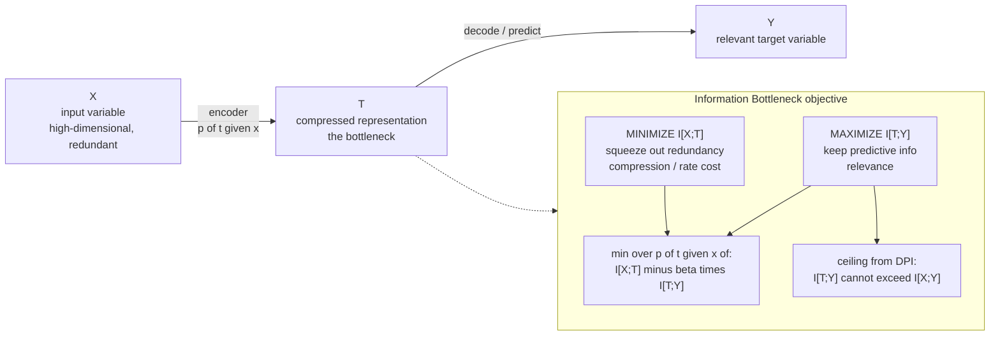

# 🍾 The Information Bottleneck and Sufficient Statistics

> [!abstract] TL;DR
> The **Information Bottleneck (IB)** — Tishby, Pereira & Bialek (1999) — is a principled recipe for **relevant compression**: given an input $X$ and a target $Y$ you care about, find a compressed representation $T$ that throws away as much of $X$ as possible (minimize $I(X;T)$) while keeping as much information about $Y$ as possible (maximize $I(T;Y)$). The tradeoff is the Lagrangian $\min_{p(t\mid x)}\; I(X;T) - \beta\, I(T;Y)$. This reframes a classical statistics idea: a **sufficient statistic** $T(X)$ loses *no* relevant information, $I(T;Y)=I(X;Y)$, and a **minimal sufficient statistic** does so at the smallest possible $I(X;T)$ — it is the "ideal" representation. IB is **rate-distortion theory with a relevance-based distortion**, and it became a controversial-but-influential lens on deep learning: hidden layers as successive bottlenecks that extract minimal sufficient statistics of the label.

---

## Intuition

**Analogy — squeezing water through a narrow pipe, keeping only what matters.** Imagine you must summarize a person's entire medical record ($X$) into a single index card ($T$) that a triage nurse will use to predict one thing: whether they need the ICU ($Y$). The card is a **narrow pipe** — it physically cannot carry everything. So what do you write? Not their favorite color, not their middle name, not the exact minute they were admitted — all of that is *information about $X$* that is *irrelevant to $Y$*. You write blood pressure, oxygen saturation, age. You are deliberately **compressing the input as hard as you can while preserving everything that predicts the outcome**. Squeeze too little and the card is a useless photocopy of the whole record; squeeze too much and you have crushed out the vital signs along with the noise. The Information Bottleneck is the mathematics of finding *exactly* that sweet spot.

Technically, $T$ is a (possibly stochastic) function of $X$ that sits *between* $X$ and $Y$ in a Markov chain $Y \rightarrow X \rightarrow T$. The pipe's width is measured by $I(X;T)$ — how many bits of $X$ the representation retains — and the usefulness of what survives is measured by $I(T;Y)$. The whole game is to push $I(X;T)$ down without letting $I(T;Y)$ fall.

---

## How It Works

### 1. The setup — a relevance variable changes everything

Ordinary compression ([[Rate_Distortion_Theory_and_Lossy_Compression|rate-distortion]]) asks: reconstruct $X$ itself within some distortion. But often we do **not** care about $X$ per se — we care about a *relevance variable* $Y$ (the label, the future, the cause). The IB replaces "reconstruct $X$ faithfully" with "**preserve what $X$ tells you about $Y$**." Formally we have a fixed joint distribution $p(x,y)$, and we seek an encoder $p(t\mid x)$ producing a bottleneck variable $T$ that forms the Markov chain

$$Y \;\longrightarrow\; X \;\longrightarrow\; T, \qquad\text{i.e. } T \perp Y \mid X.$$

$T$ sees $Y$ *only through* $X$. By the [[Information_Inequalities_and_the_Data_Processing_Inequality|Data Processing Inequality]], this immediately caps how good $T$ can be: $I(T;Y) \le I(X;Y)$. **You can never squeeze more relevance out of the summary than the raw data contained.** Compression can only lose relevant information — never create it.

### 2. Sufficient statistics, from an information view

A statistic $T = T(X)$ is **sufficient for $Y$** when it hits that DPI ceiling with equality:

$$I(T;Y) \;=\; I(X;Y).$$

That is the information-theoretic restatement of the classical Fisher–Neyman definition ($p(x\mid t,y)=p(x\mid t)$, so $Y\rightarrow T \rightarrow X$ *also* forms a Markov chain). Intuitively: **you can throw $X$ away and keep only $T$ without losing a single bit about $Y$.** The sample mean of Gaussian data, the count of heads for a coin — these are sufficient statistics because knowing them makes the raw data irrelevant for inference about the parameter (this is exactly the sufficiency lens in [[Maximum_Likelihood_and_Information]]).

A **minimal sufficient statistic** is a sufficient statistic that is a function of *every other* sufficient statistic — the *maximally compressed* one. In IB language it is the point that achieves $I(T;Y)=I(X;Y)$ at the **smallest possible $I(X;T)$**. Two data points that produce identical likelihoods for $Y$ are *redundant*; a minimal sufficient statistic merges them. This is the exact target the IB reaches for: **the most compressed representation that is still lossless about $Y$.**

### 3. The IB objective — the Lagrangian tradeoff

We cannot always achieve zero loss, so IB introduces a knob. Minimize a functional over encoders $p(t\mid x)$:

$$\mathcal{L}_{\text{IB}}[\,p(t\mid x)\,] \;=\; I(X;T) \;-\; \beta\, I(T;Y).$$

- $I(X;T)$ is the **rate / complexity** term — pushing it down *compresses* (narrows the pipe).
- $I(T;Y)$ is the **relevance** term — pushing it up *preserves prediction*.
- $\beta \ge 0$ is the tradeoff temperature. At $\beta \to 0$ the optimum is the trivial $T$ that ignores $X$ entirely (max compression, zero relevance). At $\beta \to \infty$ the optimum keeps everything predictive — it converges to the (minimal) sufficient statistic. Sweeping $\beta$ traces the whole **IB curve**.

### 4. The self-consistent equations and deterministic annealing

Setting the variational derivative of $\mathcal{L}_{\text{IB}}$ to zero yields three coupled **self-consistent equations** that the optimal $\{p(t\mid x),\,p(t),\,p(y\mid t)\}$ must satisfy:

$$
p(t\mid x) = \frac{p(t)}{Z(x,\beta)}\exp\!\big(-\beta\, D_{\mathrm{KL}}[\,p(y\mid x)\,\|\,p(y\mid t)\,]\big),
\quad
p(t) = \sum_x p(x)\,p(t\mid x),
\quad
p(y\mid t) = \frac{1}{p(t)}\sum_x p(y\mid x)\,p(x)\,p(t\mid x).
$$

Read the first equation: **each input $x$ is assigned to representations $t$ whose predictive profile $p(y\mid t)$ is close (in KL divergence) to $x$'s own profile $p(y\mid x)$.** The temperature $\beta$ controls how sharp that assignment is. Iterating these three equations to a fixed point is a **Blahut–Arimoto-style** algorithm. Because the objective is non-convex, one uses **deterministic annealing**: start at small $\beta$ (one blurry cluster) and slowly raise it; representations *split* at critical $\beta$ values, like a phase transition, revealing progressively finer relevant structure — a soft, information-theoretic hierarchical clustering.

### 5. Rate-distortion as a special case

IB *is* [[Rate_Distortion_Theory_and_Lossy_Compression|rate-distortion]] where the distortion measure is not fixed by hand but **emerges from the relevance variable**. In standard rate-distortion you pick $d(x,\hat x)$; in IB the effective distortion between $x$ and cluster $t$ is $d_{\text{IB}}(x,t) = D_{\mathrm{KL}}[\,p(y\mid x)\,\|\,p(y\mid t)\,]$ — two inputs are "close" if they *predict $Y$ the same way*. Minimizing $I(X;T)$ subject to a floor on $I(T;Y)$ is precisely a rate-distortion problem with this self-consistent, relevance-based distortion. The IB curve is the rate-distortion curve of this induced problem.

### 6. The information plane

Plot every candidate representation as a point $\big(I(X;T),\,I(T;Y)\big)$. This is the **information plane**. The **IB curve** is the *upper frontier*: for each budget of complexity $I(X;T)$, the maximum achievable relevance $I(T;Y)$. Points below the curve are suboptimal (wasting bits); points above it are *forbidden* (they would violate the DPI ceiling). The curve is concave and monotonic, pinned between the origin $(0,0)$ — the constant, useless $T$ — and $(H(X),\,I(X;Y))$ — the trivial $T=X$. The **minimal sufficient statistic** sits at the leftmost point of the plateau where $I(T;Y)$ first reaches $I(X;Y)$.

### Flow / Architecture



---

## Key Concepts

### Secondary (intuitive level)
- **Narrow pipe.** $T$ is a summary of $X$ that must fit through a small opening — it cannot carry everything.
- **Keep what predicts $Y$, drop the rest.** Relevant compression, not faithful compression.
- **Sufficient statistic = lossless summary** *for your question*: you can bin the raw data and lose nothing about $Y$.
- **Two dials:** how hard you squeeze ($I(X;T)$) versus how much prediction you keep ($I(T;Y)$).

### Undergraduate (working level)
- **Markov chain** $Y\rightarrow X\rightarrow T$; the **Data Processing Inequality** gives the hard ceiling $I(T;Y)\le I(X;Y)$.
- **Sufficiency:** $T$ sufficient $\iff I(T;Y)=I(X;Y)$; **minimal sufficient** $\iff$ that equality at minimal $I(X;T)$.
- **IB objective:** $\min I(X;T)-\beta\,I(T;Y)$; $\beta$ sweeps from "compress everything away" to "keep all relevance."
- **Information plane:** points $(I(X;T),I(T;Y))$; the IB curve is the achievable upper frontier, concave and monotone.
- **Rate-distortion connection:** IB = rate-distortion with induced distortion $D_{\mathrm{KL}}[p(y\mid x)\,\|\,p(y\mid t)]$.

### Graduate (theoretical level)
- **Self-consistent equations** and their fixed-point (Blahut–Arimoto) solution; non-convexity handled by **deterministic annealing**, with representation **bifurcations** at critical $\beta$ (a phase-transition structure).
- **Variational IB (VIB)** — Alemi et al. (2017): a tractable *upper* bound on $I(X;T)$ (a KL to a prior, exactly the VAE rate term) and a *lower* bound on $I(T;Y)$ (a decoder cross-entropy), optimized by the reparameterization trick. Deep-learning-native IB.
- **IB theory of deep learning** — Shwartz-Ziv & Tishby (2017): each hidden layer is a point in the information plane; training exhibits a fast **fitting/ERM phase** (both $I(X;T)$ and $I(T;Y)$ rise) then a long **compression/diffusion phase** ($I(X;T)$ *shrinks* while $I(T;Y)$ holds) — layers becoming approximate minimal sufficient statistics of the label. **Contested:** Saxe et al. (2018) show the compression phase is not universal (it depends on saturating nonlinearities like tanh, and MI estimation in deterministic nets is fraught).
- **Estimator pathology:** in a deterministic network $I(X;T)$ is technically infinite/ill-defined for continuous $T$; measured "compression" depends on binning/noise assumptions — a core critique.
- **Deep Variational IB / IB-as-regularizer:** the $\beta$ knob controls a genuine complexity–accuracy tradeoff and links to **generalization** bounds (compressed representations generalize because they encode fewer bits about the training inputs).

---

## Python Demo

```python
# ------------------------------------------------------------------
# Information Bottleneck via AGGLOMERATIVE IB (Slonim & Tishby, 2000).
# Build a joint p(x, y), then GREEDILY merge X-states into clusters T,
# each step merging the pair that loses the LEAST relevant info I(T;Y).
# Tracing (I(X;T), I(T;Y)) after every merge sweeps the INFORMATION PLANE.
#
# Design trick: X-states {0,1}, {2,3}, {4,5} share IDENTICAL p(y|x)
# profiles => they are REDUNDANT. Merging within a group costs ZERO
# relevant information, so the 3-cluster partition is a MINIMAL
# SUFFICIENT STATISTIC: maximal I(T;Y) = I(X;Y) at the smallest I(X;T).
# numpy + matplotlib only.
# ------------------------------------------------------------------
import numpy as np
import matplotlib.pyplot as plt

# p(y | x): rows indexed by x (6 states), cols by y (3 states)
profiles = np.array([
    [0.8, 0.1, 0.1],   # x = 0  \  identical profile
    [0.8, 0.1, 0.1],   # x = 1  /  -> redundant pair
    [0.1, 0.8, 0.1],   # x = 2  \
    [0.1, 0.8, 0.1],   # x = 3  /  -> redundant pair
    [0.1, 0.1, 0.8],   # x = 4  \
    [0.1, 0.1, 0.8],   # x = 5  /  -> redundant pair
])
px = np.full(6, 1 / 6)                 # uniform prior over X
py = px @ profiles                     # marginal p(y)  (= uniform here)

def kl(p, q):
    m = p > 0
    return np.sum(p[m] * np.log2(p[m] / q[m]))

def evaluate(partition):
    """Return I(X;T), I(T;Y) for a hard partition of X into clusters T."""
    I_XT = 0.0   # = H(T), since T is a deterministic function of X
    I_TY = 0.0
    for cluster in partition:
        pt = px[cluster].sum()                                    # p(t)
        pygt = (px[cluster][:, None] * profiles[cluster]).sum(0) / pt  # p(y|t)
        I_XT += -pt * np.log2(pt)
        I_TY += pt * kl(pygt, py)
    return I_XT, I_TY

# Start: every x is its own cluster  (T = X, the trivial sufficient stat)
partition = [[i] for i in range(6)]
curve = [evaluate(partition) + (len(partition),)]

# Greedy agglomeration: merge the pair whose merge KEEPS the most I(T;Y)
while len(partition) > 1:
    best = None
    for i in range(len(partition)):
        for j in range(i + 1, len(partition)):
            trial = [c for k, c in enumerate(partition) if k not in (i, j)]
            trial.append(partition[i] + partition[j])
            I_XT, I_TY = evaluate(trial)
            if best is None or I_TY > best[1]:      # least loss of relevance
                best = (I_XT, I_TY, trial)
    partition = best[2]
    curve.append((best[0], best[1], len(partition)))

curve = curve[::-1]                                 # most-compressed first
I_XT_vals = [c[0] for c in curve]
I_TY_vals = [c[1] for c in curve]
sizes     = [c[2] for c in curve]

I_XY = px @ np.array([kl(profiles[x], py) for x in range(6)])  # DPI ceiling

print(f"I(X;Y) = {I_XY:.4f} bits   (ceiling on relevant information)\n")
print(" |T| |  I(X;T) |  I(T;Y) | note")
for I_XT, I_TY, k in curve:
    note = ""
    if abs(I_TY - I_XY) < 1e-9 and k < 6:
        note = "sufficient (all relevant info kept)"
    if k == 3:
        note = "MINIMAL sufficient statistic (max compression, no loss)"
    print(f" {k:2d} | {I_XT:7.4f} | {I_TY:7.4f} | {note}")

# ------------------------------------------------------------ plot
plt.figure(figsize=(7.6, 5.6))
plt.plot(I_XT_vals, I_TY_vals, "o-", color="#2563eb", lw=2,
         label="IB frontier (agglomerative)")
plt.axhline(I_XY, ls="--", color="gray",
            label="I(X;Y) ceiling  =  data-processing limit")

idx3 = sizes.index(3)                                # minimal sufficient stat
plt.scatter([I_XT_vals[idx3]], [I_TY_vals[idx3]], s=170, color="red", zorder=5,
            label="minimal sufficient statistic")

for I_XT, I_TY, k in curve:
    plt.annotate(f"|T|={k}", (I_XT, I_TY),
                 textcoords="offset points", xytext=(6, -13), fontsize=8)

plt.xlabel("I(X;T)   compression / complexity  (bits)  -->")
plt.ylabel("I(T;Y)   relevant information kept  (bits)")
plt.title("The Information Plane: max relevance for a given compression")
plt.legend(loc="lower right")
plt.grid(True, ls=":")
plt.tight_layout()
plt.show()

# Expected:
# - The curve is FLAT along the top from |T|=6 down to |T|=3: merging the
#   three redundant pairs costs ZERO relevant info -> pure compression for
#   free. The red point (|T|=3) is the MINIMAL SUFFICIENT STATISTIC:
#   I(T;Y) still equals I(X;Y) but at the smallest I(X;T)=log2(3).
# - Below |T|=3 every merge crosses profiles and I(T;Y) drops sharply;
#   at |T|=1 the representation is useless: (I(X;T), I(T;Y)) = (0, 0).
```

The plateau along the top is the whole point: **the segment from $|T|=6$ to $|T|=3$ moves left at constant height** — you are draining redundant bits of $X$ out of the pipe *without spilling a drop of relevance about $Y$*. The red marker at $|T|=3$ is the **minimal sufficient statistic**: the smallest $I(X;T)$ that still touches the $I(X;Y)$ ceiling. Past it, each merge forces two *different* predictive profiles together, and $I(T;Y)$ falls — you have started crushing signal, not just noise. That descending arm is the genuine IB tradeoff; the plateau is where sufficiency and compression coexist for free.

---

## Real-World Applications

- **Document / word clustering (the original killer app).** Slonim & Tishby clustered words by the documents they appear in (or vice versa), using $Y$ = topic. Agglomerative IB produces clusters that are *minimal sufficient statistics for the topic*, outperforming plain feature grouping. The same machinery underlies distributional clustering in NLP.
- **Representation learning / self-supervised learning.** The IB principle — keep only label-relevant (or task-relevant) information — is a stated design goal for learned embeddings. The **InfoMax vs. IB** distinction matters: contrastive methods maximize $I(T;Y)$-like terms while implicitly bounding nuisance information. See [[Self_Supervised_Learning]].
- **Variational Information Bottleneck (VIB).** Alemi et al. bolt the IB objective onto a neural net: an encoder $p(t\mid x)$, a KL-to-prior *rate* term bounding $I(X;T)$, and a decoder cross-entropy *relevance* term bounding $I(T;Y)$. This is architecturally a **supervised [[Variational_Autoencoders|VAE]]** and yields models that are more **robust to adversarial perturbations** and better calibrated, because the bottleneck discards input detail irrelevant to the label.
- **Model interpretability & feature attribution.** IB-style objectives select the *minimal* subset of input features (pixels, tokens) that preserves the prediction — "keep the smallest sufficient explanation" — powering saliency and rationale-extraction methods.
- **Theory of generalization.** The compression term $I(X;T)$ upper-bounds how much a representation memorizes about the training inputs; smaller $I(X;T)$ links to tighter generalization bounds, framing "why deep nets generalize" as "they compress toward sufficiency." See [[Bias_Variance_Tradeoff]].

---

## Common Pitfalls

- **Confusing IB with an autoencoder.** A plain [[Autoencoders|autoencoder]] compresses $X$ to reconstruct $X$ — it preserves *everything* it can, including nuisance. IB compresses $X$ to preserve $Y$, deliberately *destroying* $X$-detail that does not predict $Y$. Different objective, different optimum.
- **Treating $I(X;T)$ as measurable in a deterministic net.** For a deterministic continuous encoder, $T$ is a function of $X$ and $I(X;T)$ is formally infinite. Reported "compression" curves depend entirely on binning, added noise, or the estimator — the central methodological critique of the IB-deep-learning story.
- **Believing the compression phase is universal.** Saxe et al. showed the "fitting then compression" two-phase picture is an artifact of *saturating* nonlinearities (tanh, sigmoid); ReLU networks often show no compression phase, yet still generalize. Do not overclaim.
- **Over-squeezing ($\beta$ too small).** Push compression too hard and $T$ collapses to a near-constant, discarding relevant bits — the representation is stable but useless. The $\beta$ knob is a genuine bias–variance-like dial, not a "bigger is better."
- **Assuming a sufficient statistic is unique or small.** Sufficient statistics are not unique ($X$ itself is trivially sufficient). Only the *minimal* one is maximally compressed; agglomerative/annealed IB is how you *find* it rather than assuming it.
- **Ignoring the DPI ceiling.** No representation can achieve $I(T;Y) > I(X;Y)$. If a pipeline seems to "gain" relevance downstream, information is leaking in from outside $X$ (label leakage, extra features) — a data-hygiene bug, not a triumph.

---

## Related Concepts

- [[Joint_Conditional_Entropy_and_Mutual_Information]] — supplies the two currencies of IB: $I(X;T)$ (compression) and $I(T;Y)$ (relevance); everything here is bookkeeping on mutual information.
- [[Information_Inequalities_and_the_Data_Processing_Inequality]] — the DPI is the load-bearing theorem: $I(T;Y)\le I(X;Y)$, with equality *iff* $T$ is sufficient. IB is the search for that equality at minimal cost.
- [[Rate_Distortion_Theory_and_Lossy_Compression]] — IB is rate-distortion with a *relevance-based* distortion $D_{\mathrm{KL}}[p(y\mid x)\,\|\,p(y\mid t)]$; the IB curve is the induced $R(D)$ curve.
- [[Maximum_Likelihood_and_Information]] — sufficiency is the shared bridge: MLE's classical sufficient statistics (exponential-family moments) are exactly the lossless summaries the IB seeks, viewed as the equality case of the DPI.
- [[Variational_Autoencoders]] — the VAE ELBO is a rate (KL) plus a distortion; the **Variational IB** is the supervised analogue where the "distortion" is label prediction.
- [[Autoencoders]] — the foil to IB: reconstruct-$X$ compression versus predict-$Y$ compression.
- [[Self_Supervised_Learning]] — modern representation learning that operationalizes "keep task-relevant, drop nuisance," an IB-flavored objective.
- [[Entropy_and_Information_Content]] — for a deterministic $T$, the compression term reduces to $I(X;T)=H(T)$; entropy is the ruler for the pipe's width.
- [[Relative_Entropy_and_Cross_Entropy]] — the KL divergence in the self-consistent equations *is* the effective IB distortion between an input and a cluster's predictive profile.
- [[Feature_Selection]] — mutual-information feature selection is a discrete cousin of IB: pick the feature subset $T$ maximizing $I(T;Y)$ under a size budget.
- [[Bias_Variance_Tradeoff]] — the $\beta$ knob is a complexity dial; compressing $I(X;T)$ trades fit for generalization.

---

## Review Questions

**Tier 1 — Conceptual (explain to a peer):**
1. Using the "index card for the triage nurse" analogy, explain the difference between compressing $X$ to *reconstruct $X$* and compressing $X$ to *predict $Y$*. Which one is the Information Bottleneck, and what does it deliberately throw away?
2. In one sentence each, state what $I(X;T)$ and $I(T;Y)$ measure, and describe what the two endpoints of the IB curve — $(0,0)$ and $(H(X),\,I(X;Y))$ — represent physically.

**Tier 2 — Applied (compute / reason):**
3. In the demo, six input states collapse to a 3-cluster minimal sufficient statistic with *no* loss of $I(T;Y)$. Explain, in terms of the profiles $p(y\mid x)$, exactly *why* those merges are free, and why merging below three clusters is not. What geometric feature of the information plane does this create?
4. You are told a representation $T$ achieves $I(X;T)=1.2$ bits and $I(T;Y)=0.9$ bits, while $I(X;Y)=0.66$ bits. Something is wrong. What law is being violated, and what real-world data problem most likely caused it?

**Tier 3 — Theoretical (deep understanding):**
5. Show how the IB Lagrangian $\min I(X;T)-\beta\,I(T;Y)$ reduces to a rate-distortion problem, identifying the induced distortion measure. Why is this distortion *self-consistent* (i.e. it depends on the solution it is helping to define), and how does deterministic annealing exploit that?
6. State the "fitting then compression" claim of the IB theory of deep learning and give two concrete reasons the compression phase may fail to appear (or fail to be measurable). What would you need to add to a deterministic ReLU network to make $I(X;T)$ well-defined and finite?

---

## Sources

- Tishby, N., Pereira, F. C., & Bialek, W. (1999). *The Information Bottleneck Method.* Proc. 37th Allerton Conf. on Communication, Control and Computing. [arXiv:physics/0004057](https://arxiv.org/abs/physics/0004057)
- Slonim, N., & Tishby, N. (2000). *Agglomerative Information Bottleneck.* NIPS 12. (the algorithm behind this note's demo)
- Shwartz-Ziv, R., & Tishby, N. (2017). *Opening the Black Box of Deep Neural Networks via Information.* [arXiv:1703.00810](https://arxiv.org/abs/1703.00810)
- Saxe, A. M. et al. (2018). *On the Information Bottleneck Theory of Deep Learning.* ICLR. [OpenReview](https://openreview.net/forum?id=ry_WPG-A-) (the principal critique)
- Alemi, A. A., Fischer, I., Dillon, J. V., & Murphy, K. (2017). *Deep Variational Information Bottleneck.* ICLR. [arXiv:1612.00410](https://arxiv.org/abs/1612.00410)
- Cover, T. M., & Thomas, J. A. (2006). *Elements of Information Theory* (2nd ed.), Wiley. (sufficiency, DPI, and rate-distortion background)

---

#information-theory #information-bottleneck #sufficient-statistics #representation-learning #deep-learning
