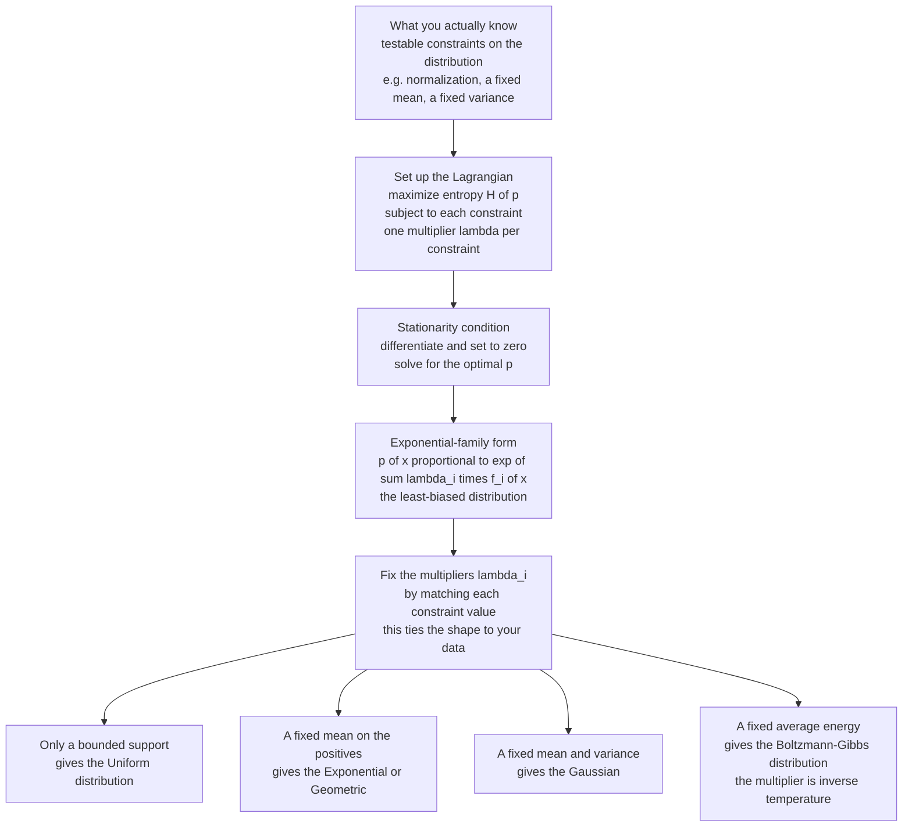

# 🎯 Maximum Entropy Principle

> [!abstract] TL;DR
> When you must choose a probability distribution but only know a few facts about it (its support, a measured mean, a variance), **infinitely many distributions fit** — so which do you pick? Jaynes' **maximum-entropy principle** says: pick the one with the **largest entropy** consistent with what you know. That distribution is the **least biased** possible — it encodes exactly your constraints and *nothing more*, smuggling in no hidden assumptions. Solving "maximize $H$ subject to moment constraints" with Lagrange multipliers always yields the **exponential family** $p(x) \propto \exp\!\big(\sum_i \lambda_i f_i(x)\big)$, and the multipliers are fixed by the constraints. This one recipe reproduces the **uniform** (support only), **exponential/geometric** (fixed mean), **Gaussian** (fixed variance), and **Boltzmann-Gibbs** (fixed average energy) distributions — revealing that our most common distributions are not arbitrary but are the *maximally honest* answers to natural questions.

---

## Intuition

**Analogy:** You are betting on a horse race with $N$ horses and you know *nothing* about the field. What odds do you quote? Any answer that favors one horse over another is a lie — you'd be claiming knowledge you don't have. The only honest bet is **equal odds on every horse**: the uniform distribution. Now suppose a tipster tells you one fact — say, "the average finishing position is 3." You should update as *little as possible*: keep spreading your belief as evenly as you can while respecting that single fact, and add no other structure. The resulting distribution is the flattest, most non-committal, most "spread out" one that still honors the constraint. That, formalized, is the maximum-entropy distribution.

Entropy is precisely the mathematical measure of "how spread out / non-committal" a distribution is (see [[Entropy_and_Information_Content]]). So "assume as little as possible beyond what you know" becomes the sharp, computable instruction: **maximize entropy subject to your constraints.** Every distribution with higher entropy than the MaxEnt answer must violate one of your facts; every distribution obeying your facts but with lower entropy has secretly assumed extra structure you cannot justify.

---

## How It Works

### Core Mechanics

**1. The inference problem.** You want $p(x)$ over outcomes $x$, but the data give you only $m$ *expectation constraints* — testable numbers like $\mathbb{E}[f_i(X)] = F_i$ (e.g. $f_1(x)=x$ pins the mean, $f_2(x)=x^2$ pins the variance), plus normalization $\sum_x p(x) = 1$. This is **underdetermined**: for anything past one or two constraints, infinitely many distributions satisfy them. You need a *selection rule*.

**2. Jaynes' rule.** Among all feasible distributions, choose the one maximizing the Shannon entropy $H(p) = -\sum_x p(x)\log p(x)$. Rationale: entropy is (by Shannon's axioms) the *unique* consistent measure of the "amount of uncertainty" in a distribution. Maximizing it means **committing to the least** — any distribution with less entropy encodes more information than your data warrant, i.e. it has assumed something. This generalizes Laplace's **principle of insufficient reason** ("with no reason to prefer one outcome, treat them equally") from the no-information case (→ uniform) to the partial-information case.

**3. Method of Lagrange multipliers.** Maximize $H(p)$ subject to the constraints by forming the Lagrangian
$$
\mathcal{L} = -\sum_x p(x)\log p(x) \;-\; (\lambda_0 - 1)\Big(\sum_x p(x) - 1\Big) \;-\; \sum_{i=1}^{m}\lambda_i\Big(\sum_x p(x) f_i(x) - F_i\Big).
$$
Setting $\partial \mathcal{L}/\partial p(x) = 0$ gives $-\log p(x) - \lambda_0 - \sum_i \lambda_i f_i(x) = 0$, so

$$
\boxed{\,p(x) = \frac{1}{Z(\boldsymbol\lambda)}\exp\!\Big(\sum_{i=1}^{m} \lambda_i\, f_i(x)\Big),\qquad Z(\boldsymbol\lambda) = \sum_x \exp\!\Big(\sum_i \lambda_i f_i(x)\Big).\,}
$$

The MaxEnt distribution is *always* of **exponential-family** form. The normalizer $Z$ is the **partition function**; the multipliers $\lambda_i$ are **not free** — they are tuned so that $\mathbb{E}[f_i(X)] = F_i$, i.e. by matching each constraint. Conveniently $\dfrac{\partial \log Z}{\partial \lambda_i} = \mathbb{E}[f_i(X)]$, so fitting the $\lambda$'s is a convex problem.

**4. The canonical results** (each is just the recipe with different constraints):

| Constraints | MaxEnt distribution | Multiplier meaning |
|---|---|---|
| Support only (finite) | **Uniform** $p(x)=1/N$ | all $\lambda_i = 0$ |
| Fixed mean, on $\{0,1,2,\dots\}$ | **Geometric** $p(k)\propto e^{-\lambda k}$ | $\lambda$ sets the mean |
| Fixed mean, on $[0,\infty)$ | **Exponential** $p(x)\propto e^{-\lambda x}$ | $\lambda$ = rate |
| Fixed mean & variance, on $\mathbb{R}$ | **Gaussian** $p(x)\propto e^{-\lambda_1 x-\lambda_2 x^2}$ | $\lambda_2$ = $1/2\sigma^2$ |
| Fixed average energy $\langle E\rangle$ | **Boltzmann-Gibbs** $p_i\propto e^{-\beta E_i}$ | $\lambda = -\beta = -1/kT$ |

The last row is the punchline that stunned physics: the canonical ensemble of [[Classical_Statistical_Mechanics]] — $p_i \propto e^{-\beta E_i}$ with its partition function $Z=\sum_i e^{-\beta E_i}$ — *is* the maximum-entropy distribution given only the average energy. Statistical mechanics is MaxEnt inference; temperature is a Lagrange multiplier.

**5. The concentration / combinatorial justification.** Why is "maximize entropy" not just aesthetically nice but *correct*? Because of counting. Distribute $n$ trials over outcomes; the number of microscopic sequences realizing an empirical distribution $\hat p$ is the multinomial coefficient, and $\frac{1}{n}\log(\text{count}) \to H(\hat p)$. So the distribution with the **highest entropy is realized by exponentially more microstates** than any other feasible one — as $n\to\infty$ it is the overwhelmingly most probable macrostate, and the fraction of feasible outcomes that deviate appreciably from it vanishes (a concentration theorem). This is exactly Boltzmann's argument for thermodynamic equilibrium, now read as a theorem about inference.

**6. The relative-entropy (minimum-KL) formulation.** Maximizing $H$ is the special case of **minimizing KL divergence to a reference measure** $q$ (see [[Relative_Entropy_and_Cross_Entropy]]): choose $p$ to minimize $D(p\,\|\,q)$ subject to the constraints. When $q$ is uniform, $D(p\|q) = \log N - H(p)$, so minimizing KL = maximizing entropy. The general form is Kullback's **minimum discrimination information** / **minimum cross-entropy** principle, and it fixes the coordinate-dependence problem of continuous differential entropy (see [[Differential_Entropy_and_Continuous_Variables]]): the base measure $q$ is what makes the answer invariant and well-defined on continuous spaces.

**7. MaxEnt–MaxLik duality.** Fitting the multipliers $\boldsymbol\lambda$ of a MaxEnt model to observed averages is **mathematically identical** to fitting an exponential-family model by maximum likelihood (see [[Maximum_Likelihood_and_Information]]). The MaxEnt-optimal $\boldsymbol\lambda$ (matching constraints) equals the maximum-likelihood $\boldsymbol\lambda$ (maximizing data probability). Two philosophically opposite programs — "assume the least" vs. "explain the data best" — converge on the same exponential family. This duality is why the "maximum-entropy classifier" in NLP is literally multinomial [[Logistic_Regression]].

### Flow / Architecture



---

## Key Concepts

### Secondary (intuitive)
- **Least-biased choice:** MaxEnt picks the flattest, most spread-out distribution consistent with your facts — it never sneaks in structure you didn't measure.
- **No information → uniform:** with only a list of possible outcomes and nothing else, the honest answer is "all equally likely." MaxEnt is the disciplined generalization of that instinct.
- **One fact changes the answer:** add a constraint (a known mean, say) and the flattest-consistent distribution stops being uniform and tilts just enough to obey the fact.
- **Familiar bells and curves are not arbitrary:** the Gaussian, the exponential, the uniform are the *maximally honest* distributions for the constraints "known variance," "known mean," "known range."

### Undergraduate
- **The variational problem:** maximize $H(p) = -\sum p\log p$ subject to $\sum p = 1$ and $\mathbb{E}[f_i(X)] = F_i$. Convex objective, linear constraints → unique solution.
- **Exponential-family solution:** $p(x) = \exp\!\big(\sum_i \lambda_i f_i(x)\big)/Z(\boldsymbol\lambda)$; the sufficient statistics are exactly the constrained functions $f_i$.
- **Partition function bookkeeping:** $\log Z$ is the cumulant generating function; $\partial \log Z/\partial\lambda_i = \mathbb{E}[f_i]$ and $\partial^2\log Z/\partial\lambda_i\partial\lambda_j = \operatorname{Cov}(f_i,f_j)$. Fitting the $\lambda$'s is convex.
- **Standard derivations to know cold:** uniform (support only), geometric (mean on $\mathbb{N}_0$), exponential (mean on $\mathbb{R}_+$), Gaussian (mean + variance on $\mathbb{R}$), Laplace (mean absolute deviation), Bernoulli/categorical (from indicator constraints).
- **Continuous version:** replace sums by integrals and maximize *relative* entropy $-\int p\log(p/q)\,dx$ against a base measure $q$; this is the well-posed continuous form and avoids the pitfalls of raw differential entropy.

### Graduate
- **MaxEnt = minimum relative entropy (I-projection):** the MaxEnt distribution is the information projection of the reference $q$ onto the linear family of constraint-satisfying distributions; it is the closest point in KL divergence, and the Pythagorean identity $D(p\|q)=D(p\|p^\star)+D(p^\star\|q)$ holds for any feasible $p$.
- **Convex duality with maximum likelihood:** the MaxEnt primal (maximize entropy over the constraint set) and the maximum-likelihood dual (fit exponential-family parameters) are Fenchel duals; strong duality gives the equality of optimal $\boldsymbol\lambda$. This is the theoretical basis of "maximum-entropy" logistic/softmax classifiers.
- **Concentration theorem (Jaynes/Csiszár):** the number of length-$n$ sequences with empirical distribution in an $\epsilon$-shell of a feasible $p$ scales as $e^{nH(p)}$; hence types far from the MaxEnt distribution are exponentially rare — the rigorous justification, via the **method of types** and Sanov's theorem, for why equilibrium *is* the MaxEnt state.
- **Statistical mechanics as inference:** the canonical ensemble $p_i \propto e^{-\beta E_i}$ maximizes entropy at fixed $\langle E\rangle$; $\beta$ is a Lagrange multiplier, $\log Z$ is (minus $\beta$ times) the Helmholtz free energy, and thermodynamic identities are cumulant relations of $\log Z$. Adding a particle-number constraint yields the grand canonical ensemble with a second multiplier (the chemical potential). See [[Classical_Statistical_Mechanics]] and [[Entropy_and_Second_Law]].
- **Choice of base measure and constraints is the modeling act:** MaxEnt is only "assumption-free" *given* the sufficient statistics $f_i$ and the reference $q$. Different constraint sets give different answers; the principle formalizes inference but does not choose the constraints for you (the central critique — see Pitfalls).
- **Transformation-group priors:** for the continuous case Jaynes derived "uninformative" priors (e.g. the $1/\sigma$ scale prior) from invariance/MaxEnt arguments, connecting MaxEnt to the Bayesian search for objective priors — though the results depend on the assumed symmetry group.

---

## Python Demo

```python
# The maximum-entropy principle in action  (numpy + matplotlib only).
# For three natural constraints we build the MaxEnt distribution from the
# exponential-family form  p(x) ~ exp( sum_i lambda_i f_i(x) )  and confirm
# it has the LARGEST entropy among distributions that ALSO satisfy the same
# constraint. This shows familiar distributions ARE the max-entropy answers:
#     (a) only a bounded support     -> Uniform
#     (b) a fixed mean on 0,1,2,...   -> Geometric
#     (c) a fixed mean and variance   -> Gaussian
from math import lgamma
import numpy as np
import matplotlib.pyplot as plt

rng = np.random.default_rng(0)

def H_discrete(p):                       # Shannon entropy, nats
    p = np.clip(p, 1e-300, None)
    return float(-np.sum(p * np.log(p)))

def h_continuous(f, x):                  # differential entropy, nats
    f = np.clip(f, 1e-300, None)
    return float(-np.trapz(f * np.log(f), x))

# ---- (a) only a bounded support -> UNIFORM ----------------------------------
N = 12
p_uniform = np.ones(N) / N                        # MaxEnt: p ~ exp(0) = const
H_uni = H_discrete(p_uniform)                     # = ln N
H_rand = np.array([H_discrete(rng.dirichlet(np.ones(N))) for _ in range(30000)])
print("(a) support only  -> Uniform")
print(f"    H(uniform) = ln N = {H_uni:.4f} nats;  "
      f"best of 30000 random dists = {H_rand.max():.4f}  (never beats ln N)\n")

# ---- (b) fixed mean on {0,1,2,...} -> GEOMETRIC -----------------------------
mu, K = 3.0, 80
k = np.arange(K)
lam = np.log((1.0 + mu) / mu)                     # Lagrange multiplier for E[x]=mu
w = np.exp(-lam * k); p_geom = w / w.sum()        # p_k ~ exp(-lam k) = geometric
logp = -mu + k * np.log(mu) - np.array([lgamma(i + 1) for i in k])
p_pois = np.exp(logp); p_pois /= p_pois.sum()     # Poisson, same mean, other shape
hi = int(round(2 * mu))                           # uniform on {0..2mu} has mean mu
p_unif_b = np.where(k <= hi, 1.0 / (hi + 1), 0.0)
print("(b) fixed mean = 3  -> Geometric")
for name, p in [("Geometric (MaxEnt)", p_geom), ("Poisson", p_pois),
                ("Uniform 0..6", p_unif_b)]:
    print(f"    {name:20s} mean={(k*p).sum():.3f}  H={H_discrete(p):.4f} nats")
print()

# ---- (c) fixed mean and variance -> GAUSSIAN --------------------------------
sig2 = 1.0
x = np.linspace(-12, 12, 400001)
lam2 = 1.0 / (2.0 * sig2)                          # multiplier for E[x^2]=sig2
g = np.exp(-lam2 * x**2); f_gauss = g / np.trapz(g, x)   # p ~ exp(-lam2 x^2)
b = np.sqrt(sig2 / 2.0)                            # Laplace scale, var=2b^2=sig2
f_lap = np.exp(-np.abs(x) / b) / (2.0 * b)
wid = np.sqrt(12.0 * sig2)                         # uniform width, var=w^2/12=sig2
f_unif = np.where(np.abs(x) <= wid / 2, 1.0 / wid, 0.0)
print("(c) fixed mean=0, variance=1  -> Gaussian")
for name, f in [("Gaussian (MaxEnt)", f_gauss), ("Laplace", f_lap),
                ("Uniform", f_unif)]:
    print(f"    {name:18s} var={np.trapz(f*x**2, x):.3f}  h={h_continuous(f, x):.4f} nats")

# ---- figure -----------------------------------------------------------------
fig, ax = plt.subplots(1, 3, figsize=(15, 4.4))

ax[0].hist(H_rand, bins=60, color="#8892d6", alpha=0.85)
ax[0].axvline(H_uni, color="crimson", lw=2, label=f"Uniform = ln N = {H_uni:.3f}")
ax[0].set_title("(a) support only: Uniform is the ceiling")
ax[0].set_xlabel("entropy of random dists  [nats]"); ax[0].legend()

ax[1].plot(k, p_geom, "o-", color="crimson",  ms=4, label=f"Geometric  H={H_discrete(p_geom):.2f}")
ax[1].plot(k, p_pois, "s-", color="#4fa574", ms=4, label=f"Poisson    H={H_discrete(p_pois):.2f}")
ax[1].plot(k, p_unif_b, "^-", color="#c9a227", ms=4, label=f"Uniform    H={H_discrete(p_unif_b):.2f}")
ax[1].set_xlim(-0.5, 15); ax[1].set_title("(b) fixed mean=3: Geometric wins")
ax[1].set_xlabel("k"); ax[1].set_ylabel("P(k)"); ax[1].legend()

ax[2].plot(x, f_gauss, color="crimson",  lw=2, label=f"Gaussian h={h_continuous(f_gauss,x):.2f}")
ax[2].plot(x, f_lap,   color="#4fa574", lw=2, label=f"Laplace  h={h_continuous(f_lap,x):.2f}")
ax[2].plot(x, f_unif,  color="#c9a227", lw=2, label=f"Uniform  h={h_continuous(f_unif,x):.2f}")
ax[2].set_xlim(-5, 5); ax[2].set_title("(c) fixed variance=1: Gaussian wins")
ax[2].set_xlabel("x"); ax[2].set_ylabel("f(x)"); ax[2].legend()

plt.tight_layout(); plt.show()
```

Expected output: **(a)** the uniform hits $\ln 12 \approx 2.485$ nats and no random distribution on the same 12 outcomes ever exceeds it — the ceiling is the MaxEnt answer. **(b)** three distributions on $\{0,1,2,\dots\}$ all with mean 3 rank Geometric $\approx 2.25 >$ Uniform $\approx 1.95 >$ Poisson $\approx 1.82$ nats: the geometric (the exponential-family form $e^{-\lambda k}$) is the max-entropy winner. **(c)** three densities all with variance 1 rank Gaussian $\approx 1.42 >$ Laplace $\approx 1.35 >$ Uniform $\approx 1.24$ nats: the Gaussian (the form $e^{-\lambda_2 x^2}$) wins. In every panel the distribution built from the exponential-family recipe is the entropy maximizer, confirming that these everyday distributions *are* the MaxEnt distributions for their natural constraints.

---

## Real-World Applications

> **Example (statistical mechanics — the founding case):** The Boltzmann-Gibbs distribution $p_i \propto e^{-\beta E_i}$ and its partition function $Z=\sum_i e^{-\beta E_i}$ — the entire machinery of the canonical ensemble in [[Classical_Statistical_Mechanics]] — is *exactly* the maximum-entropy distribution given one constraint: the average energy $\langle E\rangle$. Jaynes' 1957 papers showed thermodynamics is not a separate physical postulate but a corollary of honest statistical inference; temperature $1/kT$ is the Lagrange multiplier on energy, and free energy is $-kT\log Z$.

- **NLP maximum-entropy models:** the "MaxEnt classifier" for part-of-speech tagging, text classification, and language modeling picks the distribution of maximum entropy consistent with observed feature-expectation constraints. By the MaxEnt–MaxLik duality this is precisely multinomial/softmax [[Logistic_Regression]] — the workhorse behind pre-neural NLP and still the output layer of most neural classifiers.
- **Species distribution modeling (ecology):** MaxEnt/Maxent software estimates a species' geographic distribution from presence-only records by finding the max-entropy distribution over the landscape subject to environmental-feature averages matching the observations — one of the most cited tools in quantitative ecology.
- **Spectral estimation and signal processing:** the maximum-entropy (Burg) method estimates a power spectrum as the most non-committal one consistent with a finite set of measured autocorrelation lags, yielding the sharpest resolution justifiable from limited data.
- **Image reconstruction:** MaxEnt deconvolution reconstructs astronomical and medical images by choosing, among all images consistent with the noisy measurements, the one of maximum entropy — the smoothest that does not overfit the noise. It was central to early radio-astronomy and interferometric imaging.
- **Bayesian priors:** MaxEnt (and its transformation-group refinements) supplies "uninformative" or reference priors — the uniform, the $1/\sigma$ scale prior — as the least-committal starting beliefs before data arrive.

---

## Common Pitfalls

- **Thinking MaxEnt is assumption-free.** It is only least-biased *relative to the constraints and base measure you chose*. Selecting which averages $f_i$ to constrain is a real modeling decision that MaxEnt does not make for you — garbage constraints give garbage distributions.
- **Ignoring the base measure on continuous spaces.** Raw differential entropy is coordinate-dependent (see [[Differential_Entropy_and_Continuous_Variables]]); "maximize entropy" is ill-posed until you fix a reference measure $q$. Use the minimum-relative-entropy form $-\int p\log(p/q)$, or your "uninformative" answer will change under a change of variables.
- **Assuming MaxEnt always means uniform.** Uniform is MaxEnt only when the *sole* constraint is a bounded support. Add a mean and you get exponential/geometric; add a variance and you get Gaussian. The constraints determine the shape.
- **Forgetting the multipliers are pinned by the data.** The $\lambda_i$ are not free parameters to taste — they are solved so the model's expectations match the measured $F_i$. Leaving them unfit gives a distribution that does not actually satisfy your constraints.
- **Over-constraining until entropy is meaningless.** Impose enough moment constraints and the feasible set collapses to a single distribution; MaxEnt then adds nothing and you have simply fit a saturated model, often overfitting noise (a real risk in MaxEnt image/spectral reconstruction).
- **Confusing "maximum entropy" with "maximum ignorance about reality."** MaxEnt maximizes uncertainty in your *description* given your constraints; it is a statement about honest inference, not a claim that nature is maximally disordered.
- **Assuming a solution always exists.** If the constraints are infeasible or a moment is unbounded (e.g. demanding a finite mean on an unbounded support with no decay), the MaxEnt program may have no normalizable solution.

---

## Related Concepts

- [[Entropy_and_Information_Content]] — Shannon entropy $H = -\sum p\log p$ is the exact objective MaxEnt maximizes; "assume the least" means "maximize this quantity."
- [[Differential_Entropy_and_Continuous_Variables]] — the continuous case, where MaxEnt yields uniform / exponential / Gaussian for support / mean / variance constraints, and where the base-measure subtlety must be handled.
- [[Relative_Entropy_and_Cross_Entropy]] — MaxEnt is the special case of minimum-KL to a uniform reference; the general minimum-cross-entropy form fixes continuous-space well-posedness and reveals the MaxLik duality.
- [[Maximum_Likelihood_and_Information]] — the dual view: fitting an exponential-family model by maximum likelihood recovers the *same* parameters as MaxEnt constraint-matching; two opposite programs, one answer.
- [[Classical_Statistical_Mechanics]] — the canonical ensemble $p_i\propto e^{-\beta E_i}$ and partition function $Z$ are the MaxEnt distribution at fixed average energy; temperature is a Lagrange multiplier.
- [[Entropy_and_Second_Law]] — the thermodynamic entropy whose maximization at equilibrium is the physical face of the MaxEnt concentration argument.
- [[Logistic_Regression]] — the multinomial/softmax classifier is exactly the maximum-entropy model under feature-expectation constraints (MaxEnt = MaxLik duality).

---

## Review Questions

1. **(Secondary)** You are told a six-sided die is loaded so that its average roll is 4.5 (a fair die averages 3.5), and nothing else. Explain, without equations, why quoting a uniform distribution over $\{1,\dots,6\}$ would now be dishonest, and describe qualitatively how the maximum-entropy distribution should look instead.
2. **(Undergraduate)** Derive, via Lagrange multipliers, the maximum-entropy distribution on $\mathbb{R}$ subject to a fixed mean $\mu$ and variance $\sigma^2$, and show it is Gaussian. Identify what each Lagrange multiplier controls, and state which single constraint you would drop to instead obtain (a) the exponential distribution and (b) the uniform distribution.
3. **(Graduate)** Explain the sense in which "statistical mechanics is maximum-entropy inference." Specifically: (a) which constraint yields the canonical ensemble $p_i\propto e^{-\beta E_i}$; (b) what $\beta$ and $\log Z$ correspond to thermodynamically; and (c) using the concentration/method-of-types argument, why the maximum-entropy macrostate is not merely a convenient choice but the overwhelmingly most probable one as the number of particles grows.

---

## Sources

- Jaynes, E. T. (1957). "Information Theory and Statistical Mechanics." *Physical Review* 106, 620-630; and Part II, *Physical Review* 108, 171-190. (The founding papers of the maximum-entropy principle.)
- Jaynes, E. T. (2003). *Probability Theory: The Logic of Science*. Cambridge University Press. (Chapters 11-12 on MaxEnt inference, concentration, and priors.)
- Cover, T. M., & Thomas, J. A. (2006). *Elements of Information Theory* (2nd ed.), Chapter 12 (Maximum Entropy). Wiley-Interscience.
- MacKay, D. J. C. (2003). *Information Theory, Inference, and Learning Algorithms*, Chapters 22-23. Cambridge University Press. (Free online.)
- Berger, A. L., Della Pietra, S. A., & Della Pietra, V. J. (1996). "A Maximum Entropy Approach to Natural Language Processing." *Computational Linguistics* 22(1), 39-71.

---

#information-theory #maximum-entropy #jaynes #exponential-family #inference
