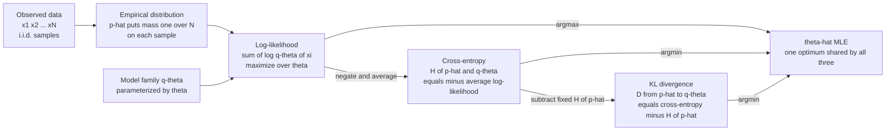

# 🎯 Maximum Likelihood and Information

> [!abstract] TL;DR
> **Maximum likelihood estimation (MLE)** picks the parameters $\theta$ that make your observed data least surprising — that maximize $\sum_i \log q_\theta(x_i)$. Divide by $N$ and negate and this is *exactly* the **cross-entropy** $H(\hat p, q_\theta)$ between the empirical data distribution $\hat p$ and your model, which by $H(\hat p, q_\theta)=H(\hat p)+D(\hat p\|q_\theta)$ is *exactly* the **KL divergence** from data to model plus a constant. So **maximizing likelihood = minimizing KL = minimizing cross-entropy loss**. Every logistic regression, GLM, and neural-network-with-cross-entropy is doing maximum likelihood, and as data grows the MLE converges to the model in your family that is *closest in KL* to the truth — even when the family is wrong.

---

## Intuition

**Analogy — betting on the weather with a codebook.** You are a forecaster who must publish, every morning, a probability for tomorrow's weather. At year's end you are graded not on being "right" but on how *surprised* you were: each day you pay a fine equal to $-\log$ of the probability you assigned to what actually happened. Assign 0.9 to "sunny" and it is sunny — tiny fine. Assign 0.01 to "sunny" and it is sunny — enormous fine. **Maximum likelihood is the choice of forecasting model that minimizes your total surprise over the whole year.**

Now notice the deeper truth. Your fine per day is the **cross-entropy** between what actually happened (the empirical frequencies of the year) and what you predicted. From [[Relative_Entropy_and_Cross_Entropy]], that cross-entropy splits into two pieces: an *irreducible* part — the true entropy of the weather, which no forecaster can beat — and an *extra* part, the **KL divergence** between reality and your model, which is the pure penalty for your model being wrong. The irreducible part does not depend on you. So minimizing your surprise is *identical* to minimizing the KL gap between your model and reality — you are hunting for the model that wastes the fewest extra bits describing the data. That is the entire information-theoretic content of MLE: **fit the model that makes the data least surprising, which is the model that wastes the fewest bits.**

---

## How It Works

### Core mechanics: likelihood, log-likelihood, negative log-likelihood

Given $N$ i.i.d. observations $x_1,\dots,x_N$ and a model family $q_\theta$, the **likelihood** is the probability the model assigns to exactly this dataset:

$$L(\theta) = \prod_{i=1}^{N} q_\theta(x_i).$$

Products of many small numbers underflow and are awkward to differentiate, so we take logs. The **log-likelihood** is

$$\ell(\theta) = \sum_{i=1}^{N} \log q_\theta(x_i),$$

and MLE is $\hat\theta_{\text{MLE}} = \arg\max_\theta \ell(\theta)$. Optimizers minimize, so in practice we minimize the **negative log-likelihood (NLL)** $-\ell(\theta)$. Read term by term, $-\log q_\theta(x_i)$ is the **surprise** (in nats) of outcome $x_i$ under the model — the ideal code length you would pay to transmit it. NLL is *total surprise over the dataset*; MLE minimizes it.

### The empirical distribution is the bridge

The **empirical distribution** $\hat p$ puts mass $1/N$ on each observed sample: $\hat p(x) = \frac{1}{N}\sum_i \mathbb{1}[x_i = x]$. It is the "distribution of the data as it actually landed." Rewrite the *average* NLL as an expectation under $\hat p$:

$$-\frac{1}{N}\ell(\theta) = -\frac{1}{N}\sum_i \log q_\theta(x_i) = -\sum_x \hat p(x)\,\log q_\theta(x) = H(\hat p, q_\theta).$$

The average negative log-likelihood **is** the cross-entropy between the empirical distribution and the model. This is not an analogy — it is an algebraic identity.

### The deep equivalence

Using the decomposition from [[Relative_Entropy_and_Cross_Entropy]], cross-entropy is entropy plus KL:

$$H(\hat p, q_\theta) = \underbrace{H(\hat p)}_{\text{fixed, no }\theta} + \underbrace{D(\hat p \,\|\, q_\theta)}_{\text{depends on }\theta}.$$

Because $H(\hat p)$ is a property of the data alone and does not contain $\theta$, minimizing over $\theta$ leaves the KL term as the only moving part:

$$\arg\max_\theta \ell(\theta) \;=\; \arg\min_\theta H(\hat p, q_\theta) \;=\; \arg\min_\theta D(\hat p \,\|\, q_\theta).$$

**Three names, one optimum: maximum likelihood, minimum cross-entropy, minimum KL from empirical data to model.** This is why cross-entropy loss is the default objective in machine learning — and why "training a classifier" and "doing maximum likelihood" are the same sentence.

### Flow: data to likelihood to the equivalence



### Consistency and the misspecified case

As $N\to\infty$, the empirical distribution $\hat p$ converges to the true data-generating distribution $p^\ast$ (law of large numbers). Two regimes follow:

- **Well-specified** — if the truth $p^\ast = q_{\theta^\ast}$ lies inside your family, the MLE is **consistent**: $\hat\theta_{\text{MLE}}\to\theta^\ast$, and it is asymptotically efficient (it attains the Cramér–Rao lower bound, so no unbiased estimator has smaller variance). It is also asymptotically normal with covariance equal to the inverse Fisher information.
- **Misspecified** — if the truth is *not* in your family (the usual reality), the MLE still converges, but to the **KL projection** of the truth onto your family: $\hat\theta_{\text{MLE}}\to \arg\min_\theta D(p^\ast\|q_\theta)$. This is White's quasi-MLE result. The information view makes this obvious: MLE always minimizes KL to the empirical distribution, so in the limit it minimizes KL to the truth over whatever models you allow. Your fitted model is the *information-theoretically closest* member of a possibly-wrong family.

### Score, Fisher information, and curvature

The **score** is the gradient of the log-likelihood, $s(\theta) = \nabla_\theta \log q_\theta(x)$. At the truth its expectation is zero, and its covariance is the **Fisher information** $I(\theta) = \mathbb{E}[s\,s^\top] = -\mathbb{E}[\nabla^2_\theta \log q_\theta]$ — the *curvature* of the log-likelihood surface at its peak. Sharp curvature (large Fisher information) means the peak is a narrow spike, so the data pin down $\theta$ tightly and the estimator has small variance; a flat ridge means many parameter values explain the data almost equally well. Fisher information is also the local, second-order approximation to KL: $D(q_\theta\|q_{\theta+d\theta})\approx \tfrac12\, d\theta^\top I(\theta)\, d\theta$. The **Cramér–Rao bound** $\operatorname{Var}(\hat\theta)\ge I(\theta)^{-1}$ then reads as "you cannot estimate a parameter better than its log-likelihood curvature allows." (Deep dive planned in a sibling note on Fisher information and the Cramér–Rao bound.)

### Sufficient statistics and the exponential family

A statistic $T(x)$ is **sufficient** for $\theta$ if it captures *all* the information the data carry about $\theta$ — once you know $T$, the raw data tell you nothing more. The **Fisher–Neyman factorization** makes this checkable: $T$ is sufficient iff the likelihood factors as $q_\theta(x)=g\big(T(x),\theta\big)\,h(x)$, so $\theta$ touches the data only through $T$. The information-theoretic reading is the **data processing inequality** from [[Information_Inequalities_and_the_Data_Processing_Inequality]]: since $\theta\to x\to T(x)$ is a Markov chain, processing can never *increase* information, so $I(\theta;T)\le I(\theta;x)$ always — and sufficiency is precisely the *equality* case where the compression $x\to T$ loses nothing.

The **exponential family** — $q_\theta(x)=h(x)\exp\!\big(\eta(\theta)^\top T(x) - A(\theta)\big)$ — is exactly the class with fixed-dimension sufficient statistics $T(x)$ no matter how much data you collect (Pitman–Koopman–Darmois). It is also the family that the **maximum entropy principle** selects: the least-committal distribution matching prescribed moment constraints is always exponential-family, with the constrained moments as its sufficient statistics. Gaussian (mean and variance), Bernoulli, Poisson, categorical/softmax, and Gamma are all members — which is why so much of statistics and ML lives here. (Maximum entropy gets its own sibling note.)

### Bayesian view and regularization as description length

Frequentist MLE maximizes $\log q_\theta(\text{data})$. The **Bayesian** adds a prior $p(\theta)$ and looks at the posterior $p(\theta\mid\text{data})\propto q_\theta(\text{data})\,p(\theta)$. Maximizing it (the MAP estimate) gives

$$\hat\theta_{\text{MAP}} = \arg\max_\theta \big[\underbrace{\log q_\theta(\text{data})}_{\text{fit}} + \underbrace{\log p(\theta)}_{\text{prior}}\big].$$

The prior term is a **regularizer**. A Gaussian prior yields an $L_2$ (ridge) penalty; a Laplace prior yields $L_1$ (lasso). The **minimum description length (MDL)** view unifies this: the total cost is the bits to encode the model plus the bits to encode the data given the model, $L(\theta)+L(\text{data}\mid\theta)$. The prior is a *code for the parameters* — simpler models get shorter codes — and MAP/regularized estimation is minimizing total description length. MLE is the special case of a flat prior (an improper, uniform code): pure fit, no simplicity penalty, hence prone to overfitting. (MDL and priors are developed in a dedicated sibling note.)

---

## Key Concepts

### Secondary (intuition-level)

- **Likelihood** = how probable your model thinks the data you actually saw is. Bigger is better.
- **Maximum likelihood** = tune the knobs so the model is *least surprised* by the data.
- **Surprise** of an outcome is $-\log$ of its probability; a model that is often very surprised is a bad model.
- Minimizing "cross-entropy loss" that you see in every deep-learning tutorial *is* maximum likelihood — same thing, different vocabulary.

### Undergraduate (probability + a little CS)

- **Definitions.** Log-likelihood $\ell(\theta)=\sum_i\log q_\theta(x_i)$; NLL $=-\ell(\theta)$; average NLL $=H(\hat p,q_\theta)$.
- **The master identity.** $H(\hat p,q_\theta)=H(\hat p)+D(\hat p\|q_\theta)$, so $\arg\max_\theta\ell=\arg\min_\theta D(\hat p\|q_\theta)$. Memorize this — it is the whole note.
- **Worked cases.** For a Bernoulli, MLE of $p$ is the sample proportion $k/N$. For a Gaussian, MLE of the mean is the sample mean and of the variance is the (biased) sample variance. For logistic regression, the NLL is the binary cross-entropy and has no closed form, so you use gradient descent (see [[Logistic_Regression]]).
- **Softmax = categorical MLE.** A neural net's softmax output is a categorical $q_\theta$; cross-entropy against the one-hot label is $-\log q_\theta(\text{true class})$, and its gradient with respect to the logits is the clean $q-y$ (see [[Loss_Functions]]).
- **Sufficient statistic.** A summary that loses nothing: for a Gaussian, the sample mean and sum of squares are sufficient — you can throw away the raw data and estimate just as well.

### Graduate (system-level)

- **Consistency and efficiency.** Under regularity, $\hat\theta_{\text{MLE}}\to\theta^\ast$ and $\sqrt{N}(\hat\theta-\theta^\ast)\to\mathcal N\big(0, I(\theta^\ast)^{-1}\big)$; MLE is asymptotically efficient (attains Cramér–Rao). The asymptotic covariance is literally inverse Fisher information — inverse log-likelihood curvature.
- **Misspecification (White, 1982).** Off-family, $\hat\theta_{\text{MLE}}\to\arg\min_\theta D(p^\ast\|q_\theta)$ and the sandwich covariance $I^{-1}JI^{-1}$ (with $J$ the score covariance) replaces plain $I^{-1}$. MLE is the KL-projection estimator, full stop.
- **AIC as expected KL.** Akaike showed that the model minimizing expected out-of-sample KL is estimated by $\text{AIC}=2k-2\ell(\hat\theta)$ — the log-likelihood penalized by parameter count $k$. Model selection is KL minimization with a bias correction; BIC is its Bayesian/MDL cousin.
- **Exponential family duality.** For exponential families the log-partition $A(\theta)$ is convex, its gradient is the mean of the sufficient statistic, and **MLE is moment matching**: set model moments equal to empirical moments. The natural parameters and mean parameters are Legendre-dual, and KL between two members is a Bregman divergence — the information-geometry backbone.
- **EM as a KL/likelihood surrogate.** With latent variables the likelihood is intractable; Expectation–Maximization maximizes an evidence lower bound (ELBO) whose slack is a KL divergence — the E-step tightens it, the M-step raises it. This is the same forward/reverse-KL machinery as variational inference and [[Bayesian_Statistics]].
- **Language models are MLE.** Next-token training minimizes token-level cross-entropy — i.e. maximizes the likelihood of the corpus under the autoregressive factorization $q_\theta(x)=\prod_t q_\theta(x_t\mid x_{<t})$. Perplexity $=\exp(\text{cross-entropy})$ is just $\exp$ of the average NLL.

---

## Python Demo

```python
# numpy + matplotlib only.
# GOAL: demonstrate that maximum likelihood estimation is identical to
# minimum-KL / minimum-cross-entropy estimation.
#
# We sample biased-coin data, then sweep a single model parameter theta
# and compute, at each theta:
#   (a) the average log-likelihood of the data       -> we MAXIMIZE this
#   (b) the KL divergence D(p_hat || q_theta)         -> we MINIMIZE this
#   (c) the cross-entropy H(p_hat, q_theta)           -> equals -avg log-lik
# and show all three share the SAME optimum: theta = k/N = sample mean.
# This is exactly why "cross-entropy loss" is maximum likelihood.

import numpy as np
import matplotlib.pyplot as plt

rng = np.random.default_rng(0)

# --- Ground truth: a biased coin, P(heads) = 0.70 ---------------------------
p_true = 0.70
N = 400
data = rng.random(N) < p_true          # boolean array of coin flips
k = data.sum()                          # number of heads observed
p_hat = np.array([k / N, 1 - k / N])    # empirical distribution [heads, tails]
print(f"Observed {k} heads in {N} flips  ->  empirical p_hat(heads) = {k/N:.4f}")

# --- Helper functions --------------------------------------------------------
eps = 1e-12
def entropy(p):
    return -np.sum(p * np.log(p + eps))

def cross_entropy(p, q):
    return -np.sum(p * np.log(q + eps))

def kl(p, q):
    return np.sum(p * np.log((p + eps) / (q + eps)))

# --- Sweep the model parameter theta over (0, 1) -----------------------------
thetas = np.linspace(0.001, 0.999, 1000)

# (a) average log-likelihood per sample, as a function of theta
#     avg loglik = (k*log(theta) + (N-k)*log(1-theta)) / N
avg_loglik = (k * np.log(thetas) + (N - k) * np.log(1 - thetas)) / N

# (b) KL from empirical to model, and (c) cross-entropy
KL = np.array([kl(p_hat, [t, 1 - t]) for t in thetas])
CE = np.array([cross_entropy(p_hat, [t, 1 - t]) for t in thetas])
H_phat = entropy(p_hat)

# --- Read off the three estimates -------------------------------------------
theta_mle_ll = thetas[np.argmax(avg_loglik)]   # argmax of log-likelihood
theta_mle_kl = thetas[np.argmin(KL)]           # argmin of KL divergence
theta_mle_ce = thetas[np.argmin(CE)]           # argmin of cross-entropy
print(f"theta maximizing log-likelihood = {theta_mle_ll:.4f}")
print(f"theta minimizing KL divergence  = {theta_mle_kl:.4f}")
print(f"theta minimizing cross-entropy  = {theta_mle_ce:.4f}")
print(f"closed-form MLE  k/N            = {k/N:.4f}   (all four agree)")

# Verify the identity  cross_entropy = entropy + KL = -avg_loglik ------------
i = 300  # any theta index
print(f"\nIdentity check at theta = {thetas[i]:.3f}:")
print(f"  cross-entropy      = {CE[i]:.5f}")
print(f"  entropy + KL       = {H_phat + KL[i]:.5f}")
print(f"  negative avg loglik= {-avg_loglik[i]:.5f}   (all equal)")

# --- Plot: max of log-likelihood coincides with min of KL / cross-entropy ---
fig, ax = plt.subplots(figsize=(8.5, 5))
ax.plot(thetas, avg_loglik, lw=2, color="seagreen",
        label="avg log-likelihood  (MAXIMIZE)")
ax.plot(thetas, -KL, lw=2, ls="--", color="indianred",
        label="negative KL  D(p_hat || q_theta)")
ax.plot(thetas, -CE, lw=2, ls=":", color="slateblue",
        label="negative cross-entropy  = avg log-likelihood")
ax.axvline(k / N, color="black", lw=1,
           label=f"shared optimum theta = k/N = {k/N:.3f}")
ax.axvline(p_true, color="gray", ls=":", lw=1,
           label=f"true theta = {p_true}")
ax.set_xlabel("model parameter theta   (q = [theta, 1 - theta])")
ax.set_ylabel("nats")
ax.set_title("MLE = min-KL = min-cross-entropy: one shared optimum")
ax.legend(fontsize=9, loc="lower center")
plt.tight_layout()
plt.savefig("mle_equals_min_kl.png", dpi=120)
plt.show()
```

**What the output shows.** The log-likelihood curve peaks at exactly the value where the KL and cross-entropy curves bottom out — plotted as their negatives, all three land on the *same* $\theta = k/N$, the sample proportion. The printed identity confirms `cross_entropy = entropy + KL = -avg_loglik` term-for-term. Because $H(\hat p)$ is a constant that only shifts the curve vertically, the location of the optimum is untouched: maximizing likelihood, minimizing KL, and minimizing cross-entropy loss are literally the same optimization. Swap this Bernoulli for a softmax over classes and you have described training a neural classifier.

---

## Real-World Applications

> **Logistic regression and GLMs.** Fitting a logistic regression *is* maximizing the Bernoulli likelihood of the labels — equivalently minimizing binary cross-entropy. Every generalized linear model (Poisson regression, gamma regression, softmax regression) is MLE within an exponential family, solved by iteratively reweighted least squares, which is Newton's method on the log-likelihood using Fisher information as the curvature. See [[Logistic_Regression]].

> **Neural network training.** A classifier trained with cross-entropy loss is doing maximum likelihood on a categorical model; a regressor trained with mean-squared error is doing MLE under a Gaussian-noise assumption (MSE is the Gaussian NLL up to constants). The choice of loss is really a choice of probabilistic model. See [[Loss_Functions]].

> **Large language models.** Pretraining minimizes next-token cross-entropy over trillions of tokens — maximum likelihood under the autoregressive factorization of the corpus. Models are compared by **perplexity**, which is $\exp$ of that cross-entropy: the effective number of equally likely next tokens. Lower perplexity is literally higher likelihood.

> **Naive Bayes and generative classifiers.** Class-conditional densities and priors are set by MLE (counts and sample statistics), and the exponential-family structure gives closed-form sufficient statistics, so training is a single pass that just tallies moments. See [[Naive_Bayes]].

> **Regularized estimation everywhere.** Ridge and lasso are MAP estimation with Gaussian and Laplace priors on the weights — MLE plus a description-length penalty. Weight decay in deep learning is the same Gaussian-prior term. See [[Regularization]].

---

## Common Pitfalls

- **MLE overfits without a prior.** Pure maximum likelihood fits the *empirical* distribution, including its noise. With few samples $\hat p$ is a poor stand-in for $p^\ast$, so the KL-closest model chases sampling artifacts. Add a prior/regularizer (MAP, MDL penalty) or the estimate memorizes the data.
- **Zero-probability blow-ups.** If the model assigns probability zero to an observed outcome, its NLL is $+\infty$ and the KL from data to model is infinite — the exact log(0) pathology from [[Relative_Entropy_and_Cross_Entropy]]. Unseen categories (a word never in training) trigger this; fix with Laplace/additive smoothing or a nonzero floor.
- **Forgetting the KL direction.** MLE minimizes the **forward** KL $D(\hat p\|q_\theta)$ (data-to-model), which is *mass-covering*: the model is punished for putting low probability where data exists, so it spreads to cover all modes. Variational methods minimize **reverse** KL and behave differently (mode-seeking). Do not assume "minimizing KL" means one fixed thing.
- **Assuming the model is correct.** Confidence intervals from plain inverse Fisher information are only valid when the family is well-specified. Under misspecification you need the sandwich (robust/Huber–White) covariance, or the reported standard errors are wrong.
- **Confusing the likelihood with a probability of $\theta$.** $L(\theta)$ is the probability of the *data* given $\theta$, not the probability of $\theta$. Treating it as a distribution over $\theta$ (integrating it, reading it as a posterior) is the frequentist–Bayesian confusion; you need a prior to talk about $p(\theta\mid\text{data})$.
- **Biased variance MLE.** The MLE of a Gaussian variance divides by $N$, not $N-1$, so it underestimates. MLEs are consistent but not always unbiased in finite samples — a routine gotcha.

---

## Related Concepts

*Section siblings (Information Theory / Inference) and Foundations:*
- [[Relative_Entropy_and_Cross_Entropy]] — the master identity $H(\hat p,q)=H(\hat p)+D(\hat p\|q)$ is what makes MLE, min-KL, and min-cross-entropy the same optimization.
- [[Information_Inequalities_and_the_Data_Processing_Inequality]] — sufficiency is the equality case of the DPI: a sufficient statistic is the one compression $x\to T(x)$ that loses no information about $\theta$.
- [[Entropy_and_Information_Content]] — the irreducible term $H(\hat p)$ that MLE cannot beat, and the source of the "surprise" unit ($-\log q$).
- [[Joint_Conditional_Entropy_and_Mutual_Information]] — mutual information frames how much a statistic tells you about a parameter.
- [[Differential_Entropy_and_Continuous_Variables]] — the continuous analog needed when the model $q_\theta$ is a density (Gaussian MLE, etc.).
- [[Information_Theory_Overview]] — where estimation sits in the wider map of coding, channels, and inference.

*Cross-vault connections (verified):*
- [[Loss_Functions]] — cross-entropy loss is the average negative log-likelihood; MSE is the Gaussian NLL. The loss *is* the probabilistic model.
- [[Logistic_Regression]] — the canonical MLE-with-no-closed-form: binary cross-entropy minimized by gradient descent.
- [[Naive_Bayes]] — generative classifier whose parameters are set by MLE counts / moments in an exponential family.
- [[Regularization]] — ridge/lasso/weight-decay are MAP = MLE plus a prior / description-length penalty.
- [[Statistical_Inference]] — the broader frequentist estimation framework (estimators, bias, variance, consistency) that MLE lives in.
- [[Bayesian_Statistics]] — the posterior view: MLE is MAP with a flat prior; EM and variational inference reuse the same KL/likelihood machinery.
- [[Information_Theory]] — the AI-ML companion note tying entropy and cross-entropy to ML losses.

> Note: dedicated sibling notes on **Fisher information and the Cramér–Rao bound**, the **maximum entropy principle**, and **minimum description length** belong in this section (`04_Information_Theory_and_Inference`) and should be linked here once created.

---

## Review Questions

1. **(Secondary)** Using the "forecaster paying a fine of $-\log$ probability" picture, explain in words why the maximum-likelihood model is the one that is "least surprised" by the data, and why that is the same as making the smallest total forecasting error.
2. **(Undergraduate)** Starting from the average negative log-likelihood, derive the identity $-\frac{1}{N}\ell(\theta)=H(\hat p,q_\theta)=H(\hat p)+D(\hat p\|q_\theta)$, and use it to prove that $\arg\max_\theta\ell(\theta)=\arg\min_\theta D(\hat p\|q_\theta)$. Why does the term $H(\hat p)$ not affect the optimum?
3. **(Graduate)** Your model family does *not* contain the true distribution (misspecification). State precisely what the MLE converges to as $N\to\infty$ and justify it from the "MLE minimizes KL to the empirical distribution" viewpoint. Then explain (a) how the standard-error formula must change from inverse Fisher information to the sandwich covariance, and (b) how AIC uses the log-likelihood to estimate expected out-of-sample KL.

---

## Sources

- Cover, T. M. & Thomas, J. A. (2006). *Elements of Information Theory* (2nd ed.), Ch. 11 "Information Theory and Statistics" (types, the method of types, and the KL view of estimation). Wiley.
- Wasserman, L. (2004). *All of Statistics*, Ch. 9 "Parametric Inference" (maximum likelihood, consistency, asymptotic normality, Fisher information). Springer.
- White, H. (1982). "Maximum Likelihood Estimation of Misspecified Models." *Econometrica*, 50(1), 1–25. (MLE as KL projection; sandwich covariance.)
- Akaike, H. (1974). "A New Look at the Statistical Model Identification." *IEEE Transactions on Automatic Control*, 19(6), 716–723. (AIC as an estimate of expected KL divergence.)
- MacKay, D. J. C. (2003). *Information Theory, Inference, and Learning Algorithms*, Chs. 2–3 and 22. Cambridge University Press.
- Bishop, C. M. (2006). *Pattern Recognition and Machine Learning*, Sections 1.2.5 and 2.3–2.4 (MLE, exponential family, sufficient statistics). Springer.

---

#information-theory #maximum-likelihood #cross-entropy #inference #statistics
