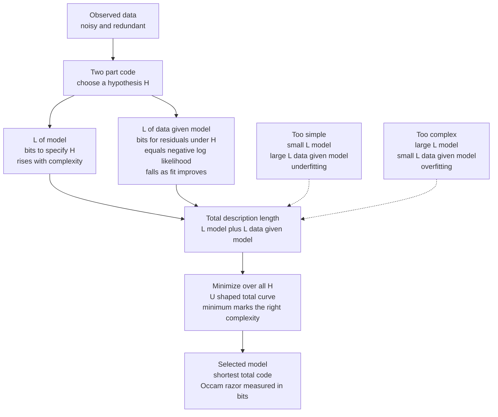

# 🪒 Minimum Description Length and Model Selection

> [!abstract] TL;DR
> The **Minimum Description Length (MDL) principle** (Rissanen, 1978) says the best model of some data is the one that lets you **describe the data in the fewest total bits**. You pay a **two-part code**: `L(model)` bits to write down the hypothesis, plus `L(data | model)` bits to encode the leftover residuals using it. A model too simple leaves big residuals (large `L(data | model)`); a model too complex is expensive to specify (large `L(model)`). The minimum of their sum is the **sweet spot** — a rigorous, information-theoretic version of **Occam's razor** that penalizes overfitting *automatically*, with no separate validation set. "Learning is compression": whatever squeezes the data smallest has found the most real structure in it, which is exactly what lets it predict.

---

## Intuition

**Analogy:** A physics teacher writes 10,000 measured positions of a falling ball on the board. A lazy student copies all 10,000 numbers into their notes — a perfect but useless record. A smart student writes down **one formula**, `s = ½ g t²`, plus the handful of tiny measurement errors the formula does not explain. The smart student's notes are **far shorter** than the raw table, and that shortness is the whole point: the formula *is* the compression, and the errors it leaves behind are the incompressible noise. A rival student who fits a wild degree-50 curve through every single point writes down *zero* errors — but their "formula" needs 51 coefficients to 15 decimal places, so their notes are actually **longer** than the honest cubic. The best theory is the one whose formula-plus-leftovers is the shortest description of the data overall.

That is MDL in a sentence: **a good theory plus the data's residuals should take fewer total bits than the raw data.** Any regularity you find — a trend, a symmetry, a repeated motif — lets you spend fewer bits, because a regularity is exactly a rule that predicts part of the data from the rest. Randomness is what is left when every regularity has been squeezed out; you cannot compress it, and you should not try to model it. Occam's razor stops being a vague aesthetic preference for "simplicity" and becomes a **measurable quantity in bits**.

---

## How It Works

### The two-part code

MDL formalizes model selection as a **communication game**. You must transmit the data `D` to a receiver over a wire that charges per bit. You are allowed to first send a **model** `H`, then send the data *encoded using that model*. Your total bill is:

```
L(D)  =  L(H)  +  L(D | H)
        \____/    \_______/
       describe   encode the data
       the model  given the model
```

- **`L(H)` — the cost of the hypothesis.** Bits to write down which model you chose: its structure and its parameter values. A straight line is cheap (2 numbers); a degree-20 polynomial is expensive (21 numbers, each to some precision). Complexity has a **price tag**.
- **`L(D | H)` — the cost of the residuals.** Bits to encode the data *given* that the receiver already knows `H`. Shannon's [[Source_Coding_Theorem_and_Data_Compression]] says the ideal codelength of an outcome with probability `p` is `-log2 p` bits, so `L(D | H) = -log2 P(D | H)` — the **negative log-likelihood in bits**. A model that fits well assigns high probability to the observed data, so the residuals are cheap to send.

The MDL principle: **pick the `H` that minimizes the total `L(H) + L(D | H)`.**

### Why this penalizes overfitting for free

The two terms pull in opposite directions, which is the entire mechanism:

1. **Too simple** (a flat line through curved data): `L(H)` is tiny, but the model explains little, so the residuals are large and `L(D | H)` is huge. **Underfitting** shows up as an expensive residual code.
2. **Too complex** (a wiggly curve threading every noisy point): `L(D | H)` shrinks toward zero because the fit is near-perfect, but `L(H)` explodes because you must transmit many high-precision parameters. **Overfitting** shows up as an expensive model code.
3. **Just right:** the sum is **U-shaped** in complexity, and its minimum sits where added complexity stops buying enough residual savings to pay for itself. Crucially, this trade-off is computed **on the training data alone** — MDL needs no held-out validation set, because the model-cost term *is* the penalty that [[Cross_Validation]] estimates empirically.

The deep reason overfitting is punished: fitting the noise cannot be compressed. Noise is by definition incompressible ([[Source_Coding_Theorem_and_Data_Compression]]), so any bits you "save" on residuals by chasing noise are paid straight back — with interest — in the model description. The books always balance.

### The parameter-precision insight

How many bits does one continuous parameter cost? Rissanen's key result: you should **not** encode parameters to infinite precision. With `n` data points, a parameter is only pinned down to about `±1/√n` (its standard error), so encoding it more finely than that wastes bits describing digits the data cannot justify. The optimal precision costs about `½ log2(n)` bits **per parameter**. A model with `k` parameters therefore carries a complexity penalty of roughly:

```
L(H)  ≈  (k / 2) · log2(n)  bits
```

This is *exactly* the **BIC penalty** (Schwarz, 1978) up to the base of the logarithm — which is why the classical Bayesian Information Criterion is essentially a two-part MDL code.

### Flow / Architecture



---

## Key Concepts

### Secondary (intuitive)
- **Learning is compression.** Finding a pattern means finding a shorter way to write the data. The better you compress it, the more real structure you have understood.
- **Occam's razor, made precise.** "Prefer the simpler explanation" becomes "prefer the explanation that yields the shortest total description in bits." Simplicity is now a number, not a slogan. See [[Inductive_Logic]].
- **Two parts to every description.** The rule (the model) plus the exceptions (the residuals). A good rule is short *and* leaves few exceptions; the total of both is what you minimize.
- **You cannot compress noise.** Chasing every wiggle in noisy data makes the residual code shorter but the model code longer by more — so overfitting always loses on the total bill.

### Undergraduate
- **Residual code = negative log-likelihood.** By Shannon coding, `L(D | H) = -log2 P(D | H)`. For Gaussian residuals this becomes `(n/2) log2(RSS/n)` up to constants, so **better fit = smaller residual code**. This ties MDL to maximum likelihood: the data-fit term is just the log-likelihood wearing a bit-counting costume. *(See the planned sibling note* Maximum_Likelihood_and_Information*, not yet in this vault.)*
- **Model code = complexity penalty ≈ `(k/2) log2 n`.** Each of the `k` parameters costs about `½ log2 n` bits at optimal precision. Complexity is taxed in proportion to the number of free parameters and the log of the sample size.
- **BIC is two-part MDL.** `BIC = n ln(RSS/n) + k ln(n)`. Divide by `2 ln 2` and it *is* the two-part description length in bits. Minimizing BIC and minimizing the two-part code are the same act.
- **AIC vs BIC vs MDL.** `AIC = n ln(RSS/n) + 2k` uses a *constant* `2` per parameter (derived from predictive risk / KL divergence, not codelength); `BIC`/MDL use `ln(n)` per parameter, which grows with data. Consequence: **AIC picks more complex models** and is not consistent (it can over-select as `n → ∞`), while **BIC/MDL are consistent** — they recover the true model with probability 1 as `n → ∞` if it is in the candidate set. AIC optimizes prediction; BIC/MDL optimize model identification.
- **No validation set required.** Unlike [[Cross_Validation]], MDL derives the complexity penalty analytically from the training data, so it is cheap and needs no data splitting — at the cost of relying on the model-code assumptions being reasonable.

### Graduate
- **Refined (one-part) MDL and the Normalized Maximum Likelihood.** The crude two-part code is arbitrary — it depends on how you choose to encode parameters. Rissanen's refined MDL uses the **Normalized Maximum Likelihood (NML)** distribution, whose codelength is the **stochastic complexity**: `-log2 P_hat(D) + log2 C_n`, where `C_n = Σ_D' P(D' | θ_hat(D'))` is the **parametric complexity** — the sum of maximized likelihoods over *all* possible datasets. `C_n` measures how well the model class can fit *arbitrary* data, capturing "flexibility" far more accurately than a bare parameter count. Two models with the same `k` can have very different parametric complexity.
- **The Bayesian connection.** The Bayesian **marginal likelihood** (evidence) `P(D) = ∫ P(D | θ) P(θ) dθ` has codelength `-log2 P(D)`, which is itself a valid one-part description length. A **Laplace / BIC approximation** of this integral yields `-log2 P(D | θ_hat) + (k/2) log2 n + O(1)` — recovering the two-part code, with the prior `P(θ)` playing the role of `L(H)`. This is MacKay's **Occam factor**: the evidence automatically penalizes flexible models because they spread their prior probability thinly. MDL and Bayes are, at this level, the same theory in different dialects. See [[Bayesian_Reasoning]] and [[Relative_Entropy_and_Cross_Entropy]].
- **Kolmogorov complexity as the ideal limit.** The *ultimate* description length of a string `x` is its **Kolmogorov complexity** `K(x)` — the length of the shortest program that outputs it. MDL is a **practical, computable stand-in** for `K`, which is itself **uncomputable** (a corollary of the halting problem). MDL restricts the "programs" to a chosen, tractable model class instead of all Turing machines, trading universality for computability. *(A dedicated* Kolmogorov_Complexity *note is planned but not yet in this vault.)*
- **Consistency and rate.** Under regularity conditions MDL/BIC selection is **consistent**; the two-part code's redundancy over the best model in the class is `(k/2) log n + O(1)`, matching Rissanen's lower bound on the achievable per-model regret — you cannot do asymptotically better.
- **Prequential / predictive MDL.** An equivalent formulation encodes the data **sequentially**, each point coded using a model fit to the points before it; the accumulated codelength is a *prequential* description length that connects MDL to online learning and to universal prediction ([[Universal_Compression_and_Lempel_Ziv]]).

---

## Python Demo

```python
# Minimum Description Length as an automatic Occam's razor.
#
# We fit polynomials of increasing degree to noisy data generated by a
# CUBIC. For each degree we compute a two-part DESCRIPTION LENGTH in bits:
#
#     total = L(data | model) + L(model)
#           = bits to encode the residuals  +  bits to encode the params
#
#   * L(data | model) FALLS as the polynomial fits better (fewer residual bits)
#   * L(model)        RISES as we add parameters (each costs ~0.5*log2(n) bits)
#   * their SUM is U-SHAPED, with a minimum at the "right" complexity.
#
# We overlay AIC, BIC, and train/test error to show they all agree:
# MDL penalizes overfitting WITHOUT a validation set. numpy + matplotlib only.

import numpy as np
import matplotlib.pyplot as plt

rng = np.random.default_rng(1)

# ---- true generating process: a cubic + Gaussian noise ----
def true_f(x):
    return 0.5 - 1.2 * x + 2.0 * x**2 - 1.5 * x**3      # degree 3

n = 60
x = np.sort(rng.uniform(-1.0, 1.0, n))
noise_sigma = 0.15
y = true_f(x) + rng.normal(0.0, noise_sigma, n)

# ---- train / test split (test set only used to VALIDATE MDL's choice) ----
idx = rng.permutation(n)
tr, te = idx[:40], idx[40:]
x_tr, y_tr, x_te, y_te = x[tr], y[tr], x[te], y[te]
m = len(x_tr)

# quantization resolution for the residual code (keeps "bits" non-negative)
delta = 0.01

degrees = np.arange(0, 11)
L_model, L_data, mdl = [], [], []
aic, bic = [], []
rmse_tr, rmse_te = [], []

for d in degrees:
    coeffs = np.polyfit(x_tr, y_tr, d)          # k = d + 1 parameters
    k = d + 1
    r_tr = y_tr - np.polyval(coeffs, x_tr)
    r_te = y_te - np.polyval(coeffs, x_te)
    rss = max(np.sum(r_tr**2), 1e-12)           # floor avoids log(0)
    sigma2 = rss / m                            # MLE residual variance

    # --- two-part code, in BITS ---
    # L(data|model): Gaussian codelength for m residuals at resolution delta
    Ld = 0.5 * m * np.log2(2 * np.pi * np.e * sigma2 / delta**2)
    # L(model): each of k params to precision ~1/sqrt(m) costs 0.5*log2(m) bits
    Lm = 0.5 * k * np.log2(m)
    L_data.append(Ld)
    L_model.append(Lm)
    mdl.append(Ld + Lm)

    # --- classical criteria, standard RSS forms (in nats) ---
    aic.append(m * np.log(sigma2) + 2 * k)
    bic.append(m * np.log(sigma2) + k * np.log(m))

    rmse_tr.append(np.sqrt(np.mean(r_tr**2)))
    rmse_te.append(np.sqrt(np.mean(r_te**2)))

L_data = np.array(L_data); L_model = np.array(L_model); mdl = np.array(mdl)
aic = np.array(aic); bic = np.array(bic)
rmse_tr = np.array(rmse_tr); rmse_te = np.array(rmse_te)

def argmin_deg(v):
    return degrees[int(np.argmin(v))]

print(f"True degree = 3,  n_train = {m}\n")
print(f"{'deg':>3} | {'L(data|H)':>10} {'L(H)':>7} {'MDL total':>10} "
      f"| {'AIC':>8} {'BIC':>8} | {'RMSE_te':>8}")
print("-" * 74)
for i, d in enumerate(degrees):
    print(f"{d:>3} | {L_data[i]:>10.1f} {L_model[i]:>7.1f} {mdl[i]:>10.1f} "
          f"| {aic[i]:>8.2f} {bic[i]:>8.2f} | {rmse_te[i]:>8.4f}")
print(f"\nMDL picks degree {argmin_deg(mdl)},  BIC picks {argmin_deg(bic)}, "
      f"AIC picks {argmin_deg(aic)},  test-RMSE picks {argmin_deg(rmse_te)}")

# ---- plots ----
fig, ax = plt.subplots(1, 2, figsize=(14, 5))

# Panel 1: the two competing terms and their U-shaped sum
ax[0].plot(degrees, L_data, "o-", color="steelblue",
           label="L(data | model)  residual bits  (falls)")
ax[0].plot(degrees, L_model, "s-", color="seagreen",
           label="L(model)  parameter bits  (rises)")
ax[0].plot(degrees, mdl, "^-", color="crimson", lw=2.4,
           label="total description length  (U-shaped)")
ax[0].axvline(argmin_deg(mdl), ls="--", color="crimson", alpha=0.6)
ax[0].axvline(3, ls=":", color="gray", label="true degree = 3")
ax[0].set_xlabel("polynomial degree  (model complexity)")
ax[0].set_ylabel("description length  [bits]")
ax[0].set_title("MDL two-part code: complexity vs fit")
ax[0].legend(fontsize=8)

# Panel 2: MDL / AIC / BIC (each shifted to its own min) + train/test error
axL = ax[1]
axL.plot(degrees, mdl - mdl.min(), "^-", color="crimson", label="MDL (shifted)")
axL.plot(degrees, aic - aic.min(), "o-", color="darkorange", label="AIC (shifted)")
axL.plot(degrees, bic - bic.min(), "s-", color="purple", label="BIC (shifted)")
axL.axvline(3, ls=":", color="gray")
axL.set_xlabel("polynomial degree  (model complexity)")
axL.set_ylabel("criterion, shifted to its minimum")
axL.set_title("MDL, AIC, BIC and generalization all agree")

axR = axL.twinx()
axR.plot(degrees, rmse_tr, "--", color="steelblue", label="train RMSE")
axR.plot(degrees, rmse_te, "-", color="black", lw=2, label="test RMSE")
axR.set_ylabel("RMSE")

lh = axL.get_legend_handles_labels()[0] + axR.get_legend_handles_labels()[0]
ll = axL.get_legend_handles_labels()[1] + axR.get_legend_handles_labels()[1]
axL.legend(lh, ll, fontsize=8, loc="upper center")

plt.tight_layout()
plt.show()
```

**What the two panels show.** Panel 1 is MDL made visible: the residual code `L(data | model)` slides *down* as the polynomial gains flexibility (better fit, fewer residual bits), the parameter code `L(model)` climbs *up* in a straight line (each degree adds `½ log2 n` bits), and their **sum is a clean U** whose minimum lands at the true cubic degree 3. Increasing complexity past 3 keeps shrinking residuals — but only by fitting noise, so the model-code tax now outweighs the savings and the total rises. Panel 2 is the payoff: MDL, AIC, and BIC (each shifted to its own minimum) trace nearly the same U, and their minima coincide with the **test-set RMSE** minimum — while **train RMSE** falls monotonically to zero, the classic overfitting signature. MDL reproduces what a held-out test set would tell you, using the training data alone: the complexity penalty *is* the generalization gap, predicted from bits instead of measured from a validation split. That is Occam's razor doing the [[Bias_Variance_Tradeoff]] arithmetic for you.

---

## Real-World Applications

> **Example (order selection in time series and signal processing):** Choosing the order `p` of an **autoregressive (AR) model** — how many past samples to regress on — is the textbook MDL/BIC job. Speech codecs, econometric forecasters, and spectral estimators all fit AR models of several orders and pick the one minimizing `n ln(RSS/n) + p ln(n)`. Too low an order misses structure (large residual code); too high fits noise and forecasts badly (large model code). Rissanen invented MDL partly to solve exactly this problem.

- **Feature / variable selection.** Deciding *which* predictors to include is a description-length contest: each added feature costs model bits and must repay them in residual bits. MDL and BIC give a principled stopping rule that resists spurious features far better than raw goodness-of-fit. See [[Feature_Selection]].
- **Decision-tree pruning.** A tree that splits until every leaf is pure has memorized the noise. MDL-based pruning encodes the *tree structure plus split thresholds* as `L(H)` and the *misclassified points* as `L(D | H)`, then prunes back to the subtree with the shortest total code — a cost-complexity criterion in disguise. See [[Decision_Trees]].
- **Choosing the number of clusters.** "How many clusters?" is notoriously ill-posed; MDL turns it into "which `k` compresses the points best?" — the cluster centroids and assignments are the model, the within-cluster deviations are the residuals. This underlies the X-means / BIC-based extensions of [[KMeans]] and Gaussian-mixture model selection.
- **Changepoint and segmentation detection.** Where does a signal's regime change? Each candidate segmentation pays model bits for the changepoint locations and residual bits for the fit within each segment; MDL selects the segmentation with the shortest total code, avoiding both over- and under-segmentation.
- **Histogram bin-width and density estimation.** The number of bins is a model-complexity choice: more bins fit the sample better but cost more to specify. MDL-optimal histograms pick the resolution justified by the data.
- **Large language models as compressors.** An LLM is a superb probability model `p(next token | context)`; paired with an arithmetic coder it compresses text below general-purpose tools. Under the "compression = understanding = prediction" thesis, minimizing description length over sequence data *is* what pretraining does — the model that predicts (compresses) best has learned the most structure. See [[Language_Model_Basics]].

---

## Common Pitfalls

- **Counting parameters instead of measuring flexibility.** The crude `(k/2) log n` penalty assumes all parameters are equally powerful. Two models with the same `k` can differ wildly in how much arbitrary data they can fit — that is what refined MDL's **parametric complexity** captures. A high-degree polynomial and a Fourier model with the same parameter count are *not* equally complex.
- **Forgetting that `L(H)` needs a code too.** You cannot minimize `L(H) + L(D | H)` unless you have actually *specified* how the model is encoded. Different encodings give different two-part codes; the crude version is arbitrary, which is precisely why NML/refined MDL exists. Report your coding assumptions.
- **Letting residuals go to zero unpunished.** If you only track goodness-of-fit, complexity always "wins" because a flexible model drives `L(D | H)` toward zero. The whole safeguard is the `L(H)` term; drop it and MDL collapses into overfitting. This is the same trap as maximizing likelihood without regularization — see [[Regularization]].
- **Assuming MDL and cross-validation must match exactly.** MDL predicts the generalization penalty *analytically* under model assumptions; [[Cross_Validation]] estimates it *empirically*. When the noise is non-Gaussian or the model class is misspecified, they can diverge. MDL is cheaper and needs no split, but it trusts its coding assumptions.
- **Confusing MDL with Kolmogorov complexity.** MDL is a *computable restriction* of the ideal Kolmogorov complexity to a chosen model class. It cannot find regularities outside that class, and it is not "the shortest possible description" — only the shortest within the hypotheses you offered it.
- **Using AIC where BIC/MDL is appropriate (and vice versa).** AIC targets *predictive accuracy* and is not consistent; BIC/MDL target *recovering the true model* and can under-fit small samples. Picking the criterion is itself a modeling decision about your goal, not a detail.
- **Ignoring the base of the logarithm and constants.** MDL is in bits (`log2`), AIC/BIC in nats (`ln`) times 2; comparing raw numbers across formulas without aligning units or the additive constants leads to nonsense. Only *differences* between models on the *same* criterion are meaningful.

---

## Related Concepts

- [[Source_Coding_Theorem_and_Data_Compression]] — supplies the core identity: the ideal codelength of an outcome is `-log2 p`, so `L(D | H)` is the negative log-likelihood in bits and "learning = compression" is literal.
- [[Information_Theory_Overview]] — the foundational entropy / KL-divergence machinery MDL rests on; description length is expected code length made concrete.
- [[Relative_Entropy_and_Cross_Entropy]] — the residual code `L(D | H)` is a cross-entropy; the gap between a model and the truth is a KL divergence, which is the redundancy MDL tries to minimize.
- [[Bias_Variance_Tradeoff]] — MDL's U-shaped total is the information-theoretic twin of the bias–variance curve; the model-code term plays the role of variance.
- [[Regularization]] — `L(H)` acts as a complexity penalty exactly like an L1/L2 regularizer or a Bayesian prior; MDL derives the penalty from coding first principles rather than a tuning knob.
- [[Cross_Validation]] — the empirical alternative to MDL's analytic penalty; both estimate generalization, one by data-splitting, the other by bit-counting.
- [[Feature_Selection]] — a direct MDL application: each feature must repay its model-code cost in residual savings.
- [[Decision_Trees]] — MDL-based pruning encodes tree structure as `L(H)` and misclassifications as `L(D | H)`.
- [[KMeans]] — "how many clusters?" becomes "which `k` compresses the points best?" under an MDL/BIC criterion.
- [[Bayesian_Reasoning]] — MDL and Bayesian model selection are deeply related; `-log2` of the marginal likelihood is a valid one-part description length, and the BIC penalty is a Laplace approximation of the evidence (the Occam factor).
- [[Inductive_Logic]] — MDL is a formal, quantitative statement of Occam's razor and a modern answer to the problem of induction: prefer the hypothesis that most compresses experience.
- [[Abductive_Reasoning_and_Inference_to_Best_Explanation]] — "shortest description" is a precise criterion for what makes one explanation *better* than another.
- [[Scientific_Reasoning_and_Method]] — casts parsimony and theory choice in bits, giving philosophy of science a computable simplicity measure.
- [[Language_Model_Basics]] — the "compression = prediction = understanding" thesis; pretraining minimizes description length over text.

> Planned sibling notes in this vault (not yet created, so intentionally unlinked): *Maximum Likelihood and Information* — makes the `L(D | H) = -log2 P(D | H)` link exact — and *Kolmogorov Complexity*, the uncomputable ideal description length for which MDL is the practical stand-in.

---

## Review Questions

1. **(Secondary)** You have 1,000 noisy measurements of an object cooling over time. One colleague records all 1,000 raw numbers; another writes down a simple exponential-decay law plus the small errors it leaves; a third fits a curve that passes exactly through all 1,000 points. Using only the idea of "total bits to describe the data," explain which colleague has best understood the cooling process and why the third has *not*.
2. **(Undergraduate)** Write out the two-part code `L(H) + L(D | H)` for fitting a degree-`d` polynomial to `n` points. Explain, term by term, what happens to each part as `d` increases from 0 to `n − 1`, why the total is U-shaped, and how this reproduces the behavior you would see from a held-out test set — *without ever splitting the data*.
3. **(Graduate)** BIC's penalty is `(k/2) ln n` while AIC's is `2k`. (a) Derive BIC's penalty as the parameter-precision cost of a two-part MDL code. (b) Explain why BIC/MDL are *consistent* but AIC is not, and when you would nonetheless prefer AIC. (c) Sketch how the Normalized Maximum Likelihood / parametric-complexity term of refined MDL improves on a bare parameter count, and relate the whole construction to the Bayesian marginal likelihood and the Occam factor.

---

## Sources

- Rissanen, J. (1978). "Modeling by shortest data description." *Automatica*, 14(5), 465–471. (The founding MDL paper.)
- Grünwald, P. D. (2007). *The Minimum Description Length Principle*. MIT Press. (The comprehensive modern reference, including NML and refined MDL.)
- Hansen, M. H., & Yu, B. (2001). "Model Selection and the Principle of Minimum Description Length." *Journal of the American Statistical Association*, 96(454), 746–774.
- Schwarz, G. (1978). "Estimating the Dimension of a Model." *Annals of Statistics*, 6(2), 461–464. (The BIC / two-part-code penalty.)
- MacKay, D. J. C. (2003). *Information Theory, Inference, and Learning Algorithms*, Chapter 28 (model comparison and Occam's razor). Cambridge University Press. (Free online.)

---

#information-theory #mdl #model-selection #occams-razor #overfitting
