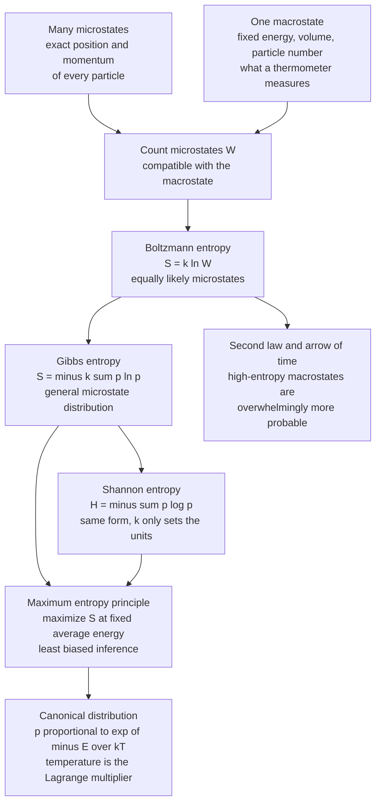

# 🔥 Entropy in Thermodynamics and Statistical Mechanics

> [!abstract] TL;DR
> Physical entropy and information entropy are **not analogies — they are the same quantity**. Boltzmann's $S = k_B\ln W$ and Gibbs's $S = -k_B\sum_i p_i\ln p_i$ are exactly Shannon's $H = -\sum_i p_i\log p_i$, differing only by Boltzmann's constant $k_B$, which merely converts *bits of missing information about the microstate* into *joules per kelvin*. Entropy counts how many microscopic arrangements (microstates) look identical at the macroscopic level (a macrostate) — i.e. your ignorance about the exact state of the system. From this single idea, Jaynes showed you can **derive** equilibrium statistical mechanics: the Boltzmann distribution $p_i \propto e^{-E_i/k_BT}$ is just the **maximum-entropy distribution** given a fixed average energy, with temperature as a Lagrange multiplier. The second law then becomes a statement about probability, and free energy $F = E - TS$ becomes an information budget.

---

## Intuition

**Analogy — the shuffled deck and the tidy room.** Take a brand-new deck of cards in perfect suit-and-rank order. There is exactly **one** arrangement that counts as "sorted." Now shuffle it. There are $52! \approx 8\times10^{67}$ possible orderings, and essentially all of them look like "a shuffled deck" to you. When you say the deck is "shuffled," you are naming a **macrostate** — a description so coarse that astronomically many distinct **microstates** (exact orderings) satisfy it. When you say it is "sorted," you are naming a macrostate with a single microstate. **Entropy is just the (log of the) number of microstates hiding behind the label you can actually see.**

This is why the deck never spontaneously sorts itself and why a teenager's room never spontaneously tidies: there are overwhelmingly more messy arrangements than tidy ones, so random rearrangement almost surely lands you in a high-entropy macrostate. No force pushes toward disorder — only counting does.

Now here is the payoff. In information theory, entropy measures **your average surprise / missing information** about which outcome a source produced (see [[Entropy_and_Information_Content]]). In physics, entropy measures **your missing information about which exact microstate** a gas is in, given only its temperature, pressure, and volume. These are the *same sentence*. A thermometer reading is a lossy summary of $\sim 10^{23}$ molecular positions and velocities; entropy quantifies exactly how much you *don't* know once you've read the thermometer. Physics is information theory applied to atoms.

---

## How It Works

### The three (really four) faces of entropy

Entropy was discovered three times, from three directions, and each time it turned out to be the same thing.

**1. Clausius (1865) — the thermodynamic face.** Entropy entered physics as a bookkeeping quantity for heat engines. For a reversible heat exchange $\delta Q$ at temperature $T$:

$$dS = \frac{\delta Q_{\text{rev}}}{T}$$

This defines *changes* in entropy operationally, with no mention of atoms. It is measurable in a lab with a thermometer and a calorimeter, and it makes entropy a **state function** — $\Delta S$ depends only on the endpoints, not the path.

**2. Boltzmann (1877) — the counting face.** Boltzmann gave entropy a microscopic meaning. For a macrostate with $W$ equally probable accessible microstates:

$$S = k_B \ln W$$

carved on his gravestone in Vienna. Here $k_B = 1.380649\times10^{-23}$ J/K is **Boltzmann's constant**. This formula *explains* Clausius: heating a gas increases the phase-space volume it can occupy, so $W$ grows, so $S$ grows.

**3. Gibbs (1902) — the distribution face.** When microstates are *not* equally likely (e.g. a system in contact with a heat bath), Boltzmann's uniform count generalizes to a probability-weighted sum over microstates $i$ with probabilities $p_i$:

$$S = -k_B \sum_i p_i \ln p_i$$

When all $W$ accessible states are equally likely ($p_i = 1/W$), this collapses back to $S = k_B\ln W$. Gibbs entropy is the master formula.

**4. Shannon (1948) — the information face.** Compare Gibbs to Shannon:

$$\underbrace{S = -k_B \sum_i p_i \ln p_i}_{\text{Gibbs, physics}} \qquad\Longleftrightarrow\qquad \underbrace{H = -\sum_i p_i \log_2 p_i}_{\text{Shannon, information}}$$

They are the **identical functional form**. The only differences are cosmetic:
- **$k_B$** converts nats into joules-per-kelvin. Set $k_B = 1$ and physical entropy is measured in nats.
- **The log base** converts nats to bits: $H_{\text{bits}} = S_{\text{nats}} / \ln 2$.

So $1$ bit of Shannon information $= k_B\ln 2 \approx 9.57\times10^{-24}$ J/K of thermodynamic entropy. This is not a metaphor — Landauer's principle and Maxwell's-demon experiments turn this exchange rate into measurable heat (see *Real-World Applications*).

### Microstate vs macrostate — entropy as missing information

A **macrostate** is what you can measure: $(E, V, N)$ — energy, volume, particle count, plus maybe pressure and temperature. A **microstate** is the full specification: every particle's position and momentum. Countless microstates map to the same macrostate.

Entropy is the amount of information you would still need to pin down the *exact* microstate once you already know the macrostate. This is **Jaynes's information-theoretic reading of statistical mechanics** (1957): entropy is not a property of the gas alone but of the gas *plus your description of it*. The gas is always in exactly one microstate; entropy measures your ignorance of which one.

### The maximum-entropy principle derives equilibrium

Here is the deepest consequence. Suppose all you know about a system is its **average energy** $\langle E\rangle$ (because it sits in a heat bath at temperature $T$). Which probability distribution $p_i$ over microstates should you assign? Jaynes's answer: **the one that maximizes entropy subject to what you know** — being maximally noncommittal about everything you do *not* know, so you inject no unjustified assumptions.

Maximize $S = -k_B\sum_i p_i\ln p_i$ subject to two constraints:

$$\sum_i p_i = 1 \quad\text{(normalization)}, \qquad \sum_i p_i E_i = \langle E\rangle \quad\text{(known average energy)}.$$

Introduce Lagrange multipliers $\alpha$ and $\beta$ and set the derivative to zero. The solution is the **Boltzmann / canonical distribution**:

$$\boxed{\,p_i = \frac{e^{-\beta E_i}}{Z}, \qquad Z = \sum_i e^{-\beta E_i}\,}$$

where $Z$ is the **partition function** (it normalizes the distribution and encodes all thermodynamics) and the multiplier $\beta$ turns out to be $\beta = 1/(k_B T)$. **Temperature is literally the Lagrange multiplier on energy** — a measure of how strongly the "fixed average energy" constraint bites. Equilibrium statistical mechanics is thus *derived*, not postulated: it is the least-biased inference given the average energy. The maximum-entropy principle recovers the uniform distribution (microcanonical), the exponential (canonical), and the Gaussian as the max-entropy answers under different constraints.

### The second law as probability, and free energy as an information budget

The **second law** — total entropy never decreases — stops being mysterious once entropy is a count. A system drifts toward the macrostate backed by the most microstates simply because that macrostate is overwhelmingly more probable. Gas fills the box because "spread out" is realized by vastly more arrangements than "bunched in one corner." The **arrow of time** is the universe sliding from an improbable low-entropy past to ever-more-probable high-entropy futures. It is a law of large numbers, not a force.

**Free energy** ties it together. The Helmholtz free energy is

$$F = E - TS = -k_B T \ln Z.$$

Minimizing $F$ at fixed temperature is *exactly the same* variational problem as maximizing entropy at fixed average energy — the $-TS$ term is the entropy (information) reward, the $E$ term is the energy cost, and $T$ sets the exchange rate. Free energy is the accounting ledger between energy and information; this variational structure is the seed of energy-based models in machine learning and of the free-energy principle in neuroscience.

### Flow: microstates to the maxent bridge



---

## Key Concepts

### Secondary (intuitive level)
- **Entropy counts arrangements.** A macrostate you can see (a "shuffled" deck, a "warm" gas) is backed by many hidden microstates. Entropy is the log of that number.
- **Entropy = your ignorance.** It measures how much you *don't* know about the exact state once you know the coarse description.
- **Physical and information entropy are the same idea.** Boltzmann/Gibbs entropy and Shannon entropy have the identical formula; $k_B$ only changes the units from bits to joules per kelvin.
- **The second law is just probability.** Systems drift toward disorder because disordered macrostates vastly outnumber ordered ones — not because of any force. This is the arrow of time.

### Undergraduate (working level)
- **Three definitions, one quantity:** Clausius $dS = \delta Q_{\text{rev}}/T$ (operational), Boltzmann $S = k_B\ln W$ (counting equally likely states), Gibbs $S = -k_B\sum p_i\ln p_i$ (weighted, reduces to Boltzmann when $p_i = 1/W$).
- **Canonical ensemble:** a system in a heat bath at temperature $T$ has microstate probabilities $p_i = e^{-\beta E_i}/Z$ with $\beta = 1/(k_B T)$.
- **Partition function** $Z = \sum_i e^{-\beta E_i}$ generates thermodynamics: $\langle E\rangle = -\partial\ln Z/\partial\beta$, $F = -k_B T\ln Z$, and $S = -\partial F/\partial T$.
- **High- and low-$T$ limits:** as $T\to 0$ the system freezes into the ground state and $S\to 0$ (third law); as $T\to\infty$ all states become equally likely and $S\to k_B\ln(\text{number of states})$ — the uniform, maximum-entropy limit.
- **Units bridge:** $S_{\text{nats}} = k_B^{-1} S_{\text{physical}}$; $H_{\text{bits}} = S_{\text{nats}}/\ln 2$; one bit $= k_B\ln 2$ J/K.

### Graduate (theoretical level)
- **Jaynes's derivation:** statistical mechanics is inference. The equilibrium distribution is the maximum-entropy distribution consistent with the measured constraints; $\beta$ is the Lagrange multiplier conjugate to energy, so **temperature is a multiplier**, not a primitive.
- **Free energy as a variational functional:** minimizing $F = E - TS$ over distributions is the Legendre-dual of maximizing entropy at fixed energy; $F = -k_B T\ln Z$. This variational free energy reappears in ML (energy-based models, Boltzmann machines) and in Friston's free-energy principle for the brain.
- **Gibbs paradox and indistinguishability:** the naive classical entropy of mixing is non-extensive; dividing phase-space volume by $N!$ (quantum indistinguishability of identical particles) restores extensivity and yields the Sackur–Tetrode formula. The "paradox" is really about what counts as a *distinct* microstate — an information/labeling question.
- **Objectivity vs subjectivity debate:** if entropy is missing information, whose information? Jaynes: it depends on the chosen macro-variables, so entropy is partly epistemic. Critics: measured $\Delta S$ (heat/$T$) is objective and reproducible. Resolution: the *constraints* (which macrostate) are a modeling choice, but given them, entropy is fixed.
- **Physics of computation:** Landauer's principle ($k_B T\ln 2$ minimum heat per bit erased) and the exorcism of Maxwell's demon show that the information–entropy identity has real thermodynamic teeth; the demon's memory must be erased, paying back the entropy it seemed to defeat.

---

## Python Demo

```python
# Numerical proof that thermodynamic (Gibbs) entropy IS Shannon entropy,
# and that the Boltzmann distribution is literally the maximum-entropy
# distribution at a fixed average energy.
#
# Plan:
#   1. Define a small system with discrete energy levels.
#   2. Build the Boltzmann distribution p_i = exp(-E_i/kT)/Z at many temperatures.
#   3. Compute its Gibbs/Shannon entropy S = -k sum p ln p; plot S(T):
#      it rises from 0 at T->0 to ln(number of states) at T->infinity.
#   4. Verify the max-entropy principle: among all distributions with the SAME
#      average energy, the Boltzmann one has the highest entropy.
import numpy as np
import matplotlib.pyplot as plt

kB = 1.0  # natural units: entropy comes out in nats and equals Shannon H (nats).

# --- 1. A tiny system: five equally spaced energy levels ------------------
E = np.array([0.0, 1.0, 2.0, 3.0, 4.0])   # energy levels (arbitrary units)
n_states = E.size
S_max = np.log(n_states)                    # high-T (uniform) entropy limit


def boltzmann(E, T):
    """Canonical / Boltzmann distribution p_i = exp(-E_i / kT) / Z."""
    beta = 1.0 / (kB * T)
    w = np.exp(-beta * (E - E.min()))       # shift by E.min() for stability; cancels in Z
    return w / w.sum()


def gibbs_entropy(p):
    """Gibbs entropy S = -k sum p ln p. With kB=1 this equals Shannon H (nats)."""
    p = p[p > 0]                            # 0*ln0 := 0
    return -kB * np.sum(p * np.log(p))


# --- 2 & 3. Entropy vs temperature ---------------------------------------
temps = np.linspace(0.05, 60.0, 500)
S_of_T = np.array([gibbs_entropy(boltzmann(E, T)) for T in temps])

print("Gibbs entropy S(T) sampled at a few temperatures (nats):")
for T in [0.1, 1.0, 5.0, 60.0]:
    p = boltzmann(E, T)
    print(f"  T = {T:5.1f}:  <E> = {np.dot(p, E):5.3f}   "
          f"S = {gibbs_entropy(p):5.3f}   H_bits = {gibbs_entropy(p)/np.log(2):5.3f}")
print(f"High-T limit  ln({n_states}) = {S_max:.3f} nats "
      f"= {S_max/np.log(2):.3f} bits  (uniform distribution)\n")

# --- 4. Max-entropy verification -----------------------------------------
# Fix a reference temperature; its Boltzmann distribution has some <E>.
# Generate many OTHER distributions with the exact same <E> (and same total 1),
# and show none beats the Boltzmann entropy.
T_ref = 2.0
p_star = boltzmann(E, T_ref)
E_avg = np.dot(p_star, E)
S_star = gibbs_entropy(p_star)

# Constraints preserved: sum(p) = 1 and sum(E*p) = E_avg.
# Perturbations delta must satisfy sum(delta) = 0 and sum(E*delta) = 0,
# i.e. delta lives in the null space of A = [[1..1], [E1..En]].
A = np.vstack([np.ones_like(E), E])
_, _, vt = np.linalg.svd(A)
null_dim = n_states - np.linalg.matrix_rank(A)   # here 5 - 2 = 3
null_basis = vt[-null_dim:].T                    # columns span the constrained directions

rng = np.random.default_rng(0)
S_samples = []
for _ in range(6000):
    delta = null_basis @ rng.normal(scale=0.06, size=null_dim)
    p = p_star + delta
    if np.all(p > 0):                            # keep it a valid distribution
        # sanity: same mean energy and same normalization by construction
        assert abs(p.sum() - 1) < 1e-9 and abs(np.dot(p, E) - E_avg) < 1e-9
        S_samples.append(gibbs_entropy(p))
S_samples = np.array(S_samples)

print(f"Max-entropy check at T_ref = {T_ref} (fixed <E> = {E_avg:.3f}):")
print(f"  Boltzmann entropy      S* = {S_star:.4f} nats")
print(f"  Best random competitor    = {S_samples.max():.4f} nats  (must be <= S*)")
print(f"  => Boltzmann wins for all {len(S_samples)} same-energy distributions: "
      f"{np.all(S_samples <= S_star + 1e-9)}")

# --- Plots ---------------------------------------------------------------
fig, ax = plt.subplots(1, 3, figsize=(15, 4.2))

# (a) Boltzmann distributions at three temperatures
for T, c in [(0.4, "#1d4ed8"), (2.0, "#059669"), (40.0, "#dc2626")]:
    ax[0].plot(E, boltzmann(E, T), "o-", color=c, label=f"T = {T}")
ax[0].set_title("Boltzmann distribution  p ~ exp(-E/kT)")
ax[0].set_xlabel("energy level E")
ax[0].set_ylabel("probability p(E)")
ax[0].legend()

# (b) Entropy vs temperature
ax[1].plot(temps, S_of_T, color="#7c3aed", lw=2)
ax[1].axhline(S_max, ls="--", color="gray", label=f"ln {n_states} = {S_max:.3f}")
ax[1].set_title("Gibbs = Shannon entropy vs temperature")
ax[1].set_xlabel("temperature T")
ax[1].set_ylabel("entropy S (nats)")
ax[1].legend()

# (c) Max-entropy: Boltzmann sits at the right edge of the entropy histogram
ax[2].hist(S_samples, bins=40, color="#94a3b8", edgecolor="white")
ax[2].axvline(S_star, color="#dc2626", lw=2,
              label=f"Boltzmann S* = {S_star:.3f}")
ax[2].set_title("Same <E> distributions: none beats Boltzmann")
ax[2].set_xlabel("entropy S (nats)")
ax[2].set_ylabel("count")
ax[2].legend()

plt.tight_layout()
plt.show()

# Expected output (approx):
#   T =   0.1:  <E> = 0.000   S = 0.000   H_bits = 0.000   (frozen ground state)
#   T =  60.0:  <E> = 1.983   S ~ 1.609   H_bits ~ 2.322   (near-uniform)
#   High-T limit ln(5) = 1.609 nats = 2.322 bits
#   Boltzmann entropy S* is the maximum among all same-energy distributions.
```

The three panels make the identity concrete. **Panel (a)**: cold temperatures crush the distribution onto the ground state, hot temperatures flatten it toward uniform. **Panel (b)**: the entropy rises smoothly from $0$ at $T\to 0$ (perfect knowledge — the system is in its ground state) to $\ln 5 \approx 1.609$ nats $= 2.322$ bits at $T\to\infty$ (maximum ignorance — every level equally likely). **Panel (c)**: among the thousands of distributions sharing the Boltzmann distribution's exact average energy, **none** has higher entropy — this *is* the maximum-entropy principle, and it *is* why nature picks the Boltzmann distribution at equilibrium.

---

## Real-World Applications

- **Chemistry and materials — reaction equilibria.** The Boltzmann factor $e^{-\Delta E/k_B T}$ sets reaction rates (Arrhenius law), population of excited states (lasers, spectroscopy), and defect concentrations in crystals. Every equilibrium constant is a ratio of partition functions.
- **The physics of computation — Landauer's principle.** Erasing one bit of information dissipates at least $k_B T\ln 2$ of heat (about $2.9\times10^{-21}$ J at room temperature), experimentally confirmed by Bérut et al. (2012). This is the information–entropy identity made thermodynamically real and sets a hard floor on the energy efficiency of all irreversible computers.
- **Maxwell's demon and information engines.** A "demon" that sorts fast and slow molecules seems to lower entropy for free, violating the second law. The resolution — the demon must *store and eventually erase* the measurement information, paying back exactly the entropy it gained — shows information is physical. Modern "information engines" (Szilárd engine, single-electron demons) extract work from information in the lab.
- **Machine learning — energy-based models.** Boltzmann machines, restricted Boltzmann machines, and diffusion/score models assign probabilities via $p(x)\propto e^{-E(x)/T}$ and train by (approximately) minimizing a free energy. Softmax with "temperature," simulated annealing, and the log-partition function all descend directly from the canonical ensemble.
- **Cosmology and black holes.** The Bekenstein–Hawking entropy $S = k_B A/(4\ell_P^2)$ makes a black hole's entropy proportional to its horizon *area*, hinting that a region's information content is bounded by its boundary (the holographic principle). Entropy governs the thermodynamic arrow of the whole universe.

---

## Common Pitfalls

- **"Entropy is disorder."** A convenient slogan, but misleading — oil and water *separating* can *increase* total entropy, and some ordered crystals form because ordering releases enough heat to raise the surroundings' entropy more. Entropy is the log count of microstates (missing information), not a tidiness score.
- **Confusing microstate and macrostate.** Entropy is not a property of a single microstate (the gas is always in exactly one) — it is a property of the *macrostate*, i.e. of the whole set of microstates compatible with your coarse description. Change what you choose to measure and the entropy changes.
- **Thinking $k_B$ makes physical entropy "different" from information entropy.** It does not. $k_B$ is a unit conversion (joules-per-kelvin per nat), a historical accident of defining temperature before we knew about atoms. Set $k_B = 1$ and thermodynamic entropy is just Shannon entropy in nats.
- **Applying the second law to open systems.** Local entropy *can* decrease — refrigerators, crystals, and living cells do it constantly — by exporting more entropy to their surroundings. Only the entropy of an *isolated* system (or the universe) is forbidden from decreasing.
- **Forgetting the constraints in maxent.** "Maximize entropy" alone gives the uniform distribution. The Boltzmann distribution appears only *because* you also fix the average energy. Different constraints yield different max-entropy distributions (Gaussian for fixed variance, exponential for fixed mean). The constraints are the physics; maxent is the inference engine.
- **Mishandling $p_i = 0$ or $T = 0$ in code.** Use the convention $0\ln 0 = 0$ (drop zero-probability terms), and never divide by $T = 0$ directly — the ground-state limit must be taken carefully, as the demo does by sweeping $T$ from a small positive value.

---

## Related Concepts

- [[Entropy_and_Information_Content]] — the information-theoretic parent: Shannon's $H = -\sum p\log p$ is the *identical* functional form to Gibbs entropy; this note supplies the $k_B$ that turns bits into joules per kelvin.
- [[Entropy_and_Second_Law]] — the physics-side companion: Clausius $dS = \delta Q/T$, the arrow of time, and the second law as statistical inevitability.
- [[Classical_Statistical_Mechanics]] — the partition function $Z$, canonical ensemble, and Gibbs entropy in their native habitat; the maxent derivation of the Boltzmann distribution.
- [[Laws_of_Thermodynamics]] — where the operational, macroscopic entropy of Clausius lives; the third law explains why $S\to 0$ as $T\to 0$ in the demo.
- [[Quantum_Statistical_Mechanics]] — counting *quantum* microstates (indistinguishable particles) resolves the Gibbs paradox and yields the correct extensive entropy.
- [[Relative_Entropy_and_Cross_Entropy]] — KL divergence is the information-geometry cousin: free-energy differences and non-equilibrium entropy production are relative entropies between distributions.

> **Forthcoming siblings (not yet in the vault):** *Maximum Entropy Principle* (Jaynes's inference engine), *Maxwell's Demon and the Physics of Information*, *Landauer's Principle and the Thermodynamics of Computation*, and *The Free-Energy Principle*. These extend the payoff bridge introduced here.

---

## Review Questions

**Tier 1 — Conceptual (explain to a peer):**
1. Using the shuffled-deck analogy, explain why entropy "counts microstates" and why a system spontaneously moves toward higher entropy without any force acting on it. Then say in one sentence how this is the same idea as "missing information."
2. Boltzmann's $S = k_B\ln W$ and Shannon's $H = -\sum p\log p$ look different. Show that Boltzmann is the special case of Gibbs entropy when all $W$ microstates are equally likely, and explain what role $k_B$ plays.

**Tier 2 — Applied (compute / reason):**
3. A three-level system has energies $\{0, \epsilon, \epsilon\}$ (the top level is doubly degenerate). Write down the partition function $Z(T)$, the probabilities $p_i(T)$, and the entropy in the limits $T\to 0$ and $T\to\infty$. What are the high- and low-temperature entropy values, and why?
4. Starting from $S = -k_B\sum_i p_i\ln p_i$ with constraints $\sum_i p_i = 1$ and $\sum_i p_i E_i = \langle E\rangle$, use Lagrange multipliers to derive $p_i = e^{-\beta E_i}/Z$. Identify $\beta$ physically and explain the sentence "temperature is the Lagrange multiplier on energy."

**Tier 3 — Theoretical (deep understanding):**
5. Free energy is $F = E - TS = -k_B T\ln Z$. Show that minimizing $F$ over distributions at fixed $T$ is equivalent to maximizing entropy at fixed average energy. Then explain how this variational structure previews (a) energy-based models in machine learning and (b) the free-energy principle in neuroscience.
6. Jaynes argued entropy is "missing information" and therefore partly subjective (it depends on which macro-variables you track), yet lab-measured $\Delta S = \int \delta Q/T$ is objective and reproducible. Reconcile these two positions. Use the Gibbs paradox (mixing identical vs distinguishable gases) as your worked example.

---

## Sources

- Jaynes, E. T. (1957). *Information Theory and Statistical Mechanics.* Physical Review, 106(4), 620–630. [PDF](https://bayes.wustl.edu/etj/articles/theory.1.pdf) — the foundational derivation of statistical mechanics from maximum entropy.
- Shannon, C. E. (1948). *A Mathematical Theory of Communication.* Bell System Technical Journal, 27, 379–423 & 623–656.
- Landauer, R. (1961). *Irreversibility and Heat Generation in the Computing Process.* IBM Journal of Research and Development, 5(3), 183–191.
- Bérut, A. et al. (2012). *Experimental verification of Landauer's principle linking information and thermodynamics.* Nature, 483, 187–189.
- Callen, H. B. (1985). *Thermodynamics and an Introduction to Thermostatistics* (2nd ed.). Wiley — Chs. 15–17 on statistical mechanics and the canonical ensemble.
- MacKay, D. J. C. (2003). *Information Theory, Inference, and Learning Algorithms.* Cambridge University Press. [Free online](https://www.inference.org.uk/mackay/itila/) — Ch. 4 on the maximum-entropy connection.

---

#information-theory #entropy #statistical-mechanics #boltzmann #gibbs
