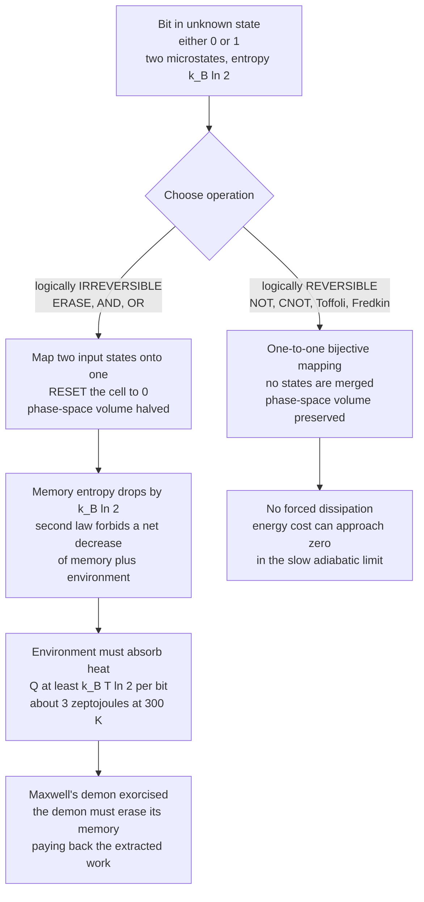

# 🔥 Landauer's Principle and the Thermodynamics of Computation

> [!abstract] TL;DR
> **Landauer's principle** (Rolf Landauer, IBM, 1961) states that *erasing* one bit of information is not free: it must dissipate at least $k_B T \ln 2$ of energy as heat — about **3 zeptojoules** ($2.9\times10^{-21}$ J) at room temperature. The reason is **logical irreversibility**: erasing maps two distinct memory states onto one, compressing the phase space and lowering the memory's entropy, so by the second law that entropy must be exported to the environment as heat. Crucially, only information-*losing* operations pay this toll — logically **reversible** operations (NOT, CNOT, Toffoli) can in principle run with arbitrarily little energy. This single insight makes "information is physical" quantitative, resolves **Maxwell's demon**, launches **reversible and quantum computing**, and defines the ultimate thermodynamic floor beneath every chip ever built — a floor today's processors still miss by four to six orders of magnitude.

---

## Intuition

**Analogy — clearing a whiteboard costs work.** Writing on a whiteboard is cheap and reversible-ish; the expensive, irreversible act is **wiping it clean**. Once you erase, you can never recover what was there — many possible boards (covered in different scribbles) all collapse into the *same* blank board. That "many-to-one" collapse is the signature of information destruction, and Landauer's insight is that **nature charges you for it in heat**.

Think of a bit as a single molecule trapped in a two-chamber box, free to be on the *left* (call it 0) or the *right* (1). If you don't know which side it is on, it carries one bit. **Erasing** that bit means forcing the molecule to a known side — say, always the left — no matter where it started. You have compressed a two-chamber volume down to one chamber. Compressing a gas requires pushing a piston, and pushing that piston does work that comes out as heat. **Forgetting is physical work.** The minimum price is exactly $k_B T \ln 2$ per bit — the same $k_B \ln 2$ of entropy that separates "could be either side" from "definitely one side," multiplied by the temperature $T$ at which the heat is dumped.

This is the deep punchline: **information cannot be divorced from thermodynamics.** A bit is not an abstract mathematical token floating free of physics — it lives in a physical medium, and destroying it obeys the second law.

---

## How It Works

### Core Mechanics

1. **A bit is a set of microstates.** A memory cell storing an *unknown* bit occupies one of two macroscopically distinct states (0 or 1). Statistically it has entropy $S = k_B \ln 2$ — the Boltzmann entropy of two equally likely microstates, $S = k_B \ln \Omega$ with $\Omega = 2$. This is the physical twin of the one **bit** of Shannon information in an unknown fair coin (see [[Entropy_and_Information_Content]]).

2. **Erasure compresses phase space.** "Erase to 0" (a **RESET**) maps *both* input states, 0 and 1, onto the single output state 0. Two microstates become one; $\Omega$ halves; the memory's entropy **falls** by $\Delta S_{mem} = -k_B \ln 2$. This is a genuine, macroscopic reduction of entropy inside the device.

3. **The second law forces the payment.** The total entropy of memory *plus* environment can never decrease (see [[Entropy_and_Second_Law]]). If the memory's entropy drops by $k_B \ln 2$, the environment's entropy must rise by *at least* $k_B \ln 2$. Entropy exported to a bath at temperature $T$ arrives as heat, $\Delta S_{env} = Q / T$, so:

$$Q \;\ge\; T \,\Delta S_{env} \;\ge\; k_B T \ln 2$$

   At $T = 300\,\text{K}$: $Q_{\min} = k_B T \ln 2 \approx 2.87 \times 10^{-21}\,\text{J} \approx 0.018\,\text{eV} \approx 3\,\text{zJ}$. Tiny — but strictly positive, and unavoidable, for *any* physical implementation.

4. **Only logical irreversibility is charged.** The cost attaches to operations that **lose information** — those whose output does not determine the input. **ERASE**, **AND**, and **OR** are logically irreversible: given `AND(a,b)=0` you cannot recover `(a,b)`. **NOT** and **controlled-NOT (CNOT)** are one-to-one (bijective) — no states merge, no phase-space compression, so *no lower bound on dissipation*. In the slow, quasi-static (adiabatic) limit their energy cost approaches zero.

5. **The bound is on erasure, not on "computing" per se.** Rolf Landauer, and later **Charles Bennett** (1973), showed that a computation only *needs* to dissipate energy where it *discards* information. Keep every intermediate bit — the "garbage" — and the whole computation becomes logically reversible and, in principle, dissipation-free.

### Logical vs Physical Reversibility

- **Logical reversibility** — the *function* is bijective; the input is recoverable from the output. This is what Landauer's bound cares about.
- **Physical reversibility** — the *dynamics* run quasi-statically with no friction, staying near equilibrium the whole time. Needed to actually *reach* the $k_B T \ln 2$ floor; real fast switching overshoots it enormously.
- A logically reversible gate run irreversibly (fast, dissipatively) still wastes energy — reversibility is *necessary but not sufficient* for zero dissipation.

### Reversible Computing and the Universal Gates

Bennett's construction makes *any* computation reversible: run it forward keeping all garbage bits, **copy out** the answer (copying is reversible), then run the computation *backward* to clean the garbage, leaving only inputs and answer. No erasure, no forced heat.

Two gate sets are **universal for reversible computation**:

- **Toffoli gate (CCNOT)** — controlled-controlled-NOT; flips a target bit only if two control bits are both 1. It is reversible (it is its own inverse) yet can simulate AND and NOT, so it is computationally universal.
- **Fredkin gate (CSWAP)** — controlled-swap; conserves the number of 1s ("conservative logic"). Also reversible and universal.

Because they never merge states, a machine built entirely from Toffoli/Fredkin gates has **no logical need to dissipate** — its energy budget is bounded only by engineering imperfections, not by the second law. This is the theoretical promise of **ultra-low-power computing**. The practical difficulty: reversible circuits must store or uncompute all that garbage, trading energy for **space and time**, and any coupling to a noisy environment reintroduces dissipation.

### The Quantum Connection

**Quantum computation is inherently reversible.** Every quantum gate is a **unitary** operator, and unitaries are bijective (invertible) by definition — the Toffoli and Fredkin gates are, in fact, standard building blocks of quantum circuits. Landauer's toll is paid only at **measurement/erasure**, when a superposition is collapsed and information is discarded to record a classical outcome. This is one reason the physics of information sits at the crossroads of thermodynamics, classical computing, and quantum computing.

### Resolving Maxwell's Demon

Maxwell's demon is a hypothetical being that sorts fast and slow molecules to build a temperature difference "for free," seemingly beating the second law. For over a century the demon defied exorcism. **Landauer and Bennett gave the resolution:** the demon must *measure* and *remember* which molecules to let through, filling up its finite memory. To keep operating in a cycle, it must eventually **erase** that memory — and *that* erasure costs $k_B T \ln 2$ per bit, exactly repaying (or exceeding) the work the demon extracted. **The bill is not paid at measurement; it is paid at forgetting.** The second law is safe because information storage is physical and information erasure is thermodynamically expensive. (Szilard's single-molecule engine is the cleanest version of this accounting.)

### Flow / Architecture



---

## Key Concepts

### Secondary (intuitive level)
- **Forgetting is physical work.** Erasing a bit — collapsing "could be either" into "known" — must release a minimum amount of heat.
- The floor is **$k_B T \ln 2$** per erased bit, about **3 zeptojoules** at room temperature: unimaginably small, but never zero.
- **Copying and flipping are cheap; erasing is expensive.** Only operations that *destroy* information are taxed.
- Real chips waste **hundreds of thousands of times** more than this floor, so the limit is not what stops today's computers — but it is the ultimate wall.

### Undergraduate (working level)
- **Statement:** $Q_{\text{erase}} \ge k_B T \ln 2$ per bit; equivalently the work to reset a bit is $W \ge k_B T \ln 2$.
- **Derivation:** erasure halves accessible microstates, so $\Delta S_{mem} = -k_B \ln 2$; second law $\Delta S_{mem} + \Delta S_{env} \ge 0$ with $\Delta S_{env} = Q/T$ gives $Q \ge k_B T \ln 2$.
- **Logical irreversibility** = non-injective truth table (ERASE, AND, OR). **Logical reversibility** = bijective (NOT, CNOT, Toffoli, Fredkin).
- **Bennett's theorem:** any computation can be embedded in a logically reversible one by retaining garbage and uncomputing it.
- **Numbers to know:** $k_B = 1.381\times10^{-23}\,\text{J/K}$; $k_B T \ln 2 \approx 2.87\times10^{-21}\,\text{J} \approx 0.018\,\text{eV}$ at 300 K; compare $k_B T \approx 0.026\,\text{eV}$ (thermal noise floor).

### Graduate (theoretical level)
- **Landauer as a special case of the second law** applied to the joint system (memory + heat bath), rigorously formalized via the **Jarzynski equality** and stochastic thermodynamics; the bound is the equality limit for a quasi-static, error-free reset.
- **Sagawa–Ueda generalized second law:** with feedback control (a demon), $\langle W_{ext}\rangle \le k_B T \,I$, where $I$ is the mutual information acquired; the extractable work is bounded by the information gathered, and erasing that information restores the ordinary bound. This is the modern, quantitative exorcism of Maxwell's demon.
- **Conservative / ballistic logic:** Fredkin–Toffoli conservative logic, Bennett's reversible Turing machine, and adiabatic CMOS ("charge-recovery" logic) as physical routes toward the bound.
- **Quantum Landauer:** in the quantum setting, erasure of a subsystem in the presence of correlations (negative conditional entropy) can *extract* work rather than cost it — the **Landauer erasure with quantum side information** result (del Rio et al., 2011), tying computation cost directly to conditional von Neumann entropy.
- **Distinction from the Margolus–Levitin / Bremermann bounds**, which limit *speed* (operations per second per joule) rather than *dissipation per erasure* — the thermodynamic and the dynamical limits of computation are different ceilings.

---

## Python Demo

```python
# Landauer's principle, made quantitative.
# (1) The erasure floor kT ln2 as a function of temperature.
# (2) A Koomey's-law-style history of energy-per-operation in real
#     computers, plunging over the decades but still hovering many
#     orders of magnitude ABOVE the Landauer floor.
# numpy + matplotlib only.
import numpy as np
import matplotlib.pyplot as plt

kB  = 1.380649e-23          # Boltzmann constant, J/K
ln2 = np.log(2.0)

def landauer_limit(T):
    """Minimum heat to erase ONE bit at temperature T (kelvin), in joules."""
    return kB * T * ln2

# --- Reference numbers -------------------------------------------------
T_room = 300.0
E_room = landauer_limit(T_room)
print(f"Landauer limit at {T_room:.0f} K : {E_room:.3e} J  "
      f"= {E_room/1e-21:.2f} zJ = {E_room/1.602e-19:.4f} eV")
print(f"Thermal energy kT at 300 K   : {kB*T_room/1.602e-19:.4f} eV "
      f"(the noise floor a bit must beat)")

# --- (1) Landauer floor vs temperature ---------------------------------
T = np.linspace(1.0, 1000.0, 500)          # 1 K (cryogenic) to 1000 K
E_floor = landauer_limit(T)                # linear in T

# --- (2) Koomey's-law-style energy-per-operation history ---------------
# Illustrative trend: computing energy efficiency has historically
# improved by ~2x every ~1.57 years (Koomey's law). We model energy
# per operation as an exponential decline and anchor it to a modern
# ~1 fJ/op switching energy, then compare to the Landauer floor.
years   = np.arange(1950, 2026, 1)
E_2020  = 1e-15                            # ~1 fJ per operation, ~2020 CMOS
halflife_years = 1.57                      # Koomey doubling time
E_op = E_2020 * 2.0 ** ((2020 - years) / halflife_years)

floor_room = landauer_limit(T_room)        # flat thermodynamic floor
headroom_now = E_op[years == 2020][0] / floor_room
print(f"\nModern chip energy/op ~ {E_2020:.1e} J")
print(f"Headroom above Landauer floor: {headroom_now:.2e}x "
      f"(~{np.log10(headroom_now):.1f} orders of magnitude)")

# Extrapolate: when would the naive trend cross the floor?
cross_year = 2020 + halflife_years * np.log2(E_2020 / floor_room)
print(f"Naive extrapolation hits the Landauer floor around year "
      f"{cross_year:.0f} (Koomey's law has since SLOWED, so later).")

# --- Plots -------------------------------------------------------------
fig, ax = plt.subplots(1, 2, figsize=(12, 4.5))

ax[0].plot(T, E_floor / 1e-21, color="#c026d3", lw=2)
ax[0].scatter([T_room], [E_room / 1e-21], color="red", zorder=5,
              label=f"300 K -> {E_room/1e-21:.2f} zJ")
ax[0].set_title("Landauer floor  kT ln2  per erased bit")
ax[0].set_xlabel("temperature T  (kelvin)")
ax[0].set_ylabel("minimum erase energy  (zeptojoules)")
ax[0].legend()
ax[0].grid(alpha=0.3)

ax[1].semilogy(years, E_op, color="#2563eb", lw=2,
               label="energy / operation (Koomey trend)")
ax[1].axhline(floor_room, ls="--", color="#c026d3", lw=2,
              label="Landauer floor at 300 K")
ax[1].fill_between(years, floor_room, E_op, color="#93c5fd", alpha=0.35,
                   label="remaining headroom")
ax[1].set_title("Real computers vs the thermodynamic floor")
ax[1].set_xlabel("year")
ax[1].set_ylabel("energy per operation  (joules, log scale)")
ax[1].legend(loc="upper right", fontsize=8)
ax[1].grid(alpha=0.3, which="both")

plt.tight_layout()
plt.show()

# Expected console output (approximately):
# Landauer limit at 300 K : 2.871e-21 J  = 2.87 zJ = 0.0179 eV
# Thermal energy kT at 300 K   : 0.0259 eV (the noise floor a bit must beat)
# Modern chip energy/op ~ 1.0e-15 J
# Headroom above Landauer floor: 3.48e+05x (~5.5 orders of magnitude)
# Naive extrapolation hits the Landauer floor around year 2049 ...
```

The left panel shows the floor rising **linearly with temperature** — cryogenic computing (low $T$) genuinely lowers the ultimate cost, one motivation for cold-running superconducting and quantum hardware. The right panel is the sobering one: even after seventy years of exponential efficiency gains (Koomey's law), a modern switching operation still burns roughly $10^{5}$–$10^{6}$ times the Landauer minimum. The **shaded headroom** is where all future efficiency lives — and it is finite. Once it closes, no amount of cleverness in *irreversible* logic can help; the only escape is **reversible computation**, which sidesteps the floor entirely by refusing to erase.

---

## Real-World Applications

> **Example — the data-center energy wall.** With the end of **Dennard scaling** around 2005, shrinking transistors stopped getting proportionally more power-efficient, and clock speeds stalled near a few GHz. Energy, not transistor count, became the binding constraint on computing — the era of "dark silicon" (chips too power-hungry to switch on all their transistors at once) and of hyperscale data centers whose budgets are dominated by electricity and cooling. Landauer's principle sets the immovable floor beneath all of this: it tells us the $10^{5}$–$10^{6}$$\times$ gap that engineers are still racing to close, and that beyond it lies a hard thermodynamic wall reachable only by abandoning irreversible logic.

- **Reversible & adiabatic logic.** Charge-recovery / adiabatic CMOS families recycle switching charge instead of dumping it to ground, chasing sub-$k_BT$ operation for ultra-low-power and energy-harvesting devices.
- **Superconducting and cryogenic computing.** Running logic at millikelvin temperatures slashes $k_B T \ln 2$ directly (left panel of the demo) — a driver behind superconducting single-flux-quantum logic and the control electronics for quantum computers.
- **Quantum computing.** Being unitary, it is inherently reversible; the physics of information tells us that dissipation is concentrated at **measurement and error correction**, not at the gates themselves.
- **Nanomagnetic and spintronic memory.** Landauer analyses set the theoretical energy floor for writing/erasing magnetic bits, guiding MRAM and beyond-CMOS memory research.
- **Foundations of physics.** The principle underpins black-hole information debates and the generalized second law, where information, entropy, and energy are treated as a single currency.

---

## Common Pitfalls

- **"Every logic operation costs $k_B T \ln 2$."** No — only **information-erasing** (logically irreversible) operations do. A NOT or a CNOT merges no states and has *no* thermodynamic lower bound on its dissipation. The cost is tied to bits *destroyed*, not gates *executed*.
- **Confusing the bound with reality.** $k_B T \ln 2 \approx 3$ zJ is the *ideal minimum*. Real chips miss it by 4–6 orders of magnitude because they switch fast and far from equilibrium (physical irreversibility). Landauer is a floor, not a spec sheet.
- **Thinking measurement pays the demon's bill.** In the Maxwell's-demon resolution, *measurement* can be done reversibly; the unavoidable cost is at **erasure** of the demon's memory when it resets for the next cycle. Getting this backward is the classic error.
- **Assuming reversible logic is automatically free.** Logical reversibility is *necessary* but not *sufficient*. A reversible gate switched quickly still dissipates; reaching the floor also demands quasi-static, near-equilibrium (physically reversible) dynamics — and storing/uncomputing garbage costs space and time.
- **Ignoring temperature.** The bound scales linearly with $T$. Quoting "3 zeptojoules" as universal is wrong; it is the room-temperature value. Cryogenic operation genuinely lowers the floor.
- **Treating information as non-physical.** The whole point is the opposite: a bit always lives in a physical medium, and its erasure obeys thermodynamics. "Information is physical" is not a slogan — it is the theorem.

---

## Related Concepts

- [[Entropy_and_Information_Content]] — the one Shannon **bit** of an unknown fair coin is the exact informational twin of the $k_B \ln 2$ of Boltzmann entropy that erasure must expel; Landauer is the bridge that converts bits into joules.
- [[Entropy_and_Second_Law]] — Landauer's principle *is* the second law applied to a memory coupled to a heat bath; erasing lowers memory entropy, so the environment's entropy (and heat) must rise. That note explicitly flags the Landauer connection.
- [[Laws_of_Thermodynamics]] — the inequality $Q \ge T\,\Delta S$ that yields $k_B T \ln 2$ is a direct consequence of the second law's entropy accounting.
- [[Classical_Statistical_Mechanics]] — Boltzmann's $S = k_B \ln \Omega$ and the microstate-counting picture are what make "erasing halves the phase space" a precise, calculable statement.
- [[Boolean_Algebra_and_Logic_Gates]] — AND/OR/NAND are logically **irreversible** (many-to-one truth tables) and so carry the Landauer cost; contrast them with reversible Toffoli and Fredkin gates built from the same primitives.

---

## Review Questions

**Tier 1 — Conceptual (explain to a peer):**
1. Using the two-chamber "molecule in a box" picture, explain why *erasing* a bit must release heat while *copying* or *flipping* one need not. What is special about the many-to-one map?
2. Why is the Landauer limit at room temperature ($\approx 3$ zeptojoules) *not* the reason your laptop gets warm? What actually dominates a real chip's energy budget, and by roughly how many orders of magnitude?

**Tier 2 — Applied (compute / reason):**
3. Derive $Q \ge k_B T \ln 2$ from the statement that erasure lowers the memory's entropy by $k_B \ln 2$ and that total entropy cannot decrease. At $T = 4\,\text{K}$ (liquid-helium temperature), what is the minimum erase energy, and why might a data center care?
4. Bennett showed any computation can be made logically reversible. Sketch the "compute — copy answer — uncompute garbage" procedure. What resource does this trade energy *for*, and why does that matter in practice?

**Tier 3 — Theoretical (deep understanding):**
5. Explain precisely how Landauer's principle exorcises Maxwell's demon. Where in the demon's operating cycle is the second law's bill actually paid, and why can't the demon evade it by never erasing? Reference the mutual-information bound $\langle W\rangle \le k_B T\, I$.
6. Quantum gates are unitary and therefore reversible, yet quantum computers still dissipate energy. Where does the dissipation live, and how does "Landauer erasure with quantum side information" (negative conditional entropy) let erasure sometimes *extract* work rather than cost it?

---

## Sources

- Landauer, R. (1961). *Irreversibility and Heat Generation in the Computing Process.* IBM Journal of Research and Development, 5(3), 183–191. [DOI](https://doi.org/10.1147/rd.53.0183)
- Bennett, C. H. (1973). *Logical Reversibility of Computation.* IBM Journal of Research and Development, 17(6), 525–532. [DOI](https://doi.org/10.1147/rd.176.0525)
- Bennett, C. H. (1982). *The Thermodynamics of Computation — a Review.* International Journal of Theoretical Physics, 21(12), 905–940. [DOI](https://doi.org/10.1007/BF02084158)
- Bérut, A., Arakelyan, A., Petrosyan, A., Ciliberto, S., Dillenschneider, R., & Lutz, E. (2012). *Experimental verification of Landauer's principle linking information and thermodynamics.* Nature, 483, 187–189. [DOI](https://doi.org/10.1038/nature10872)
- Koomey, J., Berard, S., Sanchez, M., & Wong, H. (2011). *Implications of Historical Trends in the Electrical Efficiency of Computing.* IEEE Annals of the History of Computing, 33(3), 46–54. [DOI](https://doi.org/10.1109/MAHC.2010.28)

---

#information-theory #landauer-principle #reversible-computing #thermodynamics-of-computation #energy
