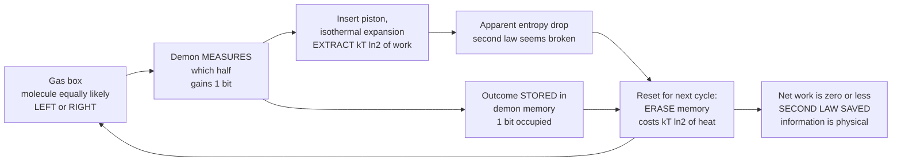

# 😈 Maxwell's Demon and the Physics of Information

> [!abstract] TL;DR
> **Maxwell's demon** (1867) is a thought experiment: a tiny intelligent being sorts fast and slow molecules between two chambers, seemingly creating a temperature difference — and thus usable energy — from nothing, apparently violating the **second law of thermodynamics**. The **Szilard engine** (1929) sharpened it to a single molecule and showed that exactly **one bit of information** about which side the molecule is on can be converted into exactly $k_B T \ln 2$ of work — the first quantitative link between information and thermodynamics. The paradox stood for over a century until **Landauer's principle** and **Bennett's** resolution: the demon can measure reversibly, but it must *store* the result in memory, and eventually *erasing* that memory to reset for the next cycle costs at least $k_B T \ln 2$ per bit — exactly repaying the extracted work and saving the second law. The deep lesson: **information is physical**. Acquiring, storing, and erasing it has real thermodynamic consequences.

---

## Intuition

**Analogy — the ultimate insider trader.** Imagine a doorman standing at a gate between two rooms full of air. He does nothing to the air — no pushing, no heating. He only *watches* and opens the door at the right instant: every fast molecule he lets pass into the left room, every slow one into the right. He touches nothing, spends (seemingly) no energy, yet after a while the left room is hot and the right room is cold. You could now run a heat engine off that difference and extract free work — forever. The doorman has apparently manufactured energy purely out of **knowledge**. That is Maxwell's demon, and it seems to break the most ironclad law in physics.

The escape from the paradox is the same one that ruins every real insider trader: **the information is not free**. Watching, remembering, and — crucially — *forgetting* to make room for the next observation all have a cost. When you add up the thermodynamic price of the demon's *memory*, it exactly cancels the free lunch. The century-long chase to find where the cost hides is the story of how physics discovered that **a bit of information is a physical thing with an entropy of its own**.

---

## How It Works

### 1. Maxwell's original demon (1867)

A gas at uniform temperature $T$ fills a box split by a wall with a tiny frictionless door. A microscopic being watches the molecules approaching the door and opens it selectively — fast molecules to the left, slow molecules to the right. Temperature is just average molecular speed, so the left side heats up and the right cools down **without any work being done on the gas**. Entropy has *decreased* in an isolated system, and the resulting temperature gradient can drive an engine. This is a flat contradiction of the Clausius/Kelvin statements of the **second law** (see [[Entropy_and_Second_Law]] and [[Laws_of_Thermodynamics]]). Maxwell's point was not that the law is false, but that it is **statistical** — true for bulk matter but breachable, in principle, by a being that tracks individual molecules ([[Kinetic_Theory_of_Gases]]).

### 2. The Szilard engine (1929) — one bit = $k_B T \ln 2$

Leó Szilard stripped the paradox to its skeleton: **a single molecule** in a box of volume $V$ at temperature $T$. One cycle:

1. **Measure.** Insert a thin partition at the middle. The molecule is now trapped on the **left** or the **right**, each with probability $\tfrac{1}{2}$. The demon observes which — acquiring exactly **1 bit** of information.
2. **Exploit.** Attach a weight to the partition on the *occupied* side and let the molecule, battering the partition, push it isothermally and quasi-statically until it expands from $V/2$ back to $V$. The extractable work is

$$W = \int_{V/2}^{V} P\,dV = \int_{V/2}^{V} \frac{k_B T}{V'}\,dV' = k_B T \ln\frac{V}{V/2} = k_B T \ln 2.$$

3. **Repeat.** Remove the partition; the molecule again fills the box, ready for another cycle.

Each cycle draws heat $k_B T \ln 2$ from the single reservoir and turns it entirely into work — a perpetual-motion machine of the second kind, *powered by information*. Szilard's result is the birth of the **physics of information**: it says $1\text{ bit} \leftrightarrow k_B T \ln 2$ of free energy, a full **19 years before Shannon**.

### 3. Where the cost hides — the successive resolutions

- **Brillouin / Gabor (1950s):** blamed the **measurement**. To "see" a molecule you must scatter a photon off it, and at temperature $T$ that photon must be energetic enough to stand out from the thermal background, dissipating $\gtrsim k_B T \ln 2$. Plausible, but it turned out to be the *wrong* location of the cost — measurement can be done arbitrarily cheaply.
- **Landauer (1961) + Bennett (1982) — the modern resolution.** Landauer proved that **logically irreversible** operations have a thermodynamic price: **erasing** one bit of memory in a thermal environment dissipates at least $k_B T \ln 2$ of heat (**Landauer's principle**). Bennett showed the demon's *measurement* and even its computation can in principle be made **thermodynamically reversible and free** — but the demon still has to **store** the outcome. Its memory fills up. To run a *cycle*, the demon must **reset** its memory to a blank state, and that erasure is exactly the irreversible step. Erasing the 1 bit acquired each cycle costs $\ge k_B T \ln 2$, **precisely repaying the $k_B T \ln 2$ extracted**. Net work over a true cycle is $\le 0$. **The second law is saved — the bookkeeping just had to include the demon's memory as a physical entropy.**

The punchline: the demon's memory is not an abstraction sitting outside physics. **Its entropy is real entropy**, and once you count it, the ledger balances.

### Flow / Architecture



---

## Key Concepts

**Secondary (intuition level).**
- The second law says heat flows hot to cold and entropy of an isolated system never decreases; Maxwell's demon *seems* to beat it by using knowledge instead of force.
- The trick fails because keeping and clearing that knowledge is itself a physical process that produces entropy — so nature stays in the black.
- One bit of information is "worth" a fixed amount of energy at a given temperature: $k_B T \ln 2$ (about $2.9 \times 10^{-21}$ J at room temperature).

**Undergraduate (mechanistic level).**
- **Szilard engine:** isothermal quasi-static expansion of a one-molecule gas from $V/2$ to $V$ yields $W = k_B T \ln 2$; the $\ln 2$ comes from a two-fold volume ratio, i.e. from resolving **one bit**.
- **Landauer's principle:** erasing one bit (mapping two logical states to one) reduces the memory's phase-space volume by half, so it must dump $\ge k_B T \ln 2$ of heat; erasure — not measurement — is the irreversible step.
- **Cycle bookkeeping:** $W_\text{extracted} \le k_B T \ln 2$ per bit, $Q_\text{erase} \ge k_B T \ln 2$ per bit, hence $W_\text{net} \le 0$. The demon is a heat engine whose "fuel" is the low-entropy blank memory it starts with.
- The mutual information the demon holds about the gas plays the role of a thermodynamic resource (see [[Joint_Conditional_Entropy_and_Mutual_Information]]).

**Graduate (formal level).**
- **Generalized second law with feedback (Sagawa–Ueda):** with a measurement giving outcome $M$ about system state $X$, the extractable work obeys $\langle W \rangle \le -\Delta F + k_B T\, I(X;M)$, where $I(X;M)$ is the **mutual information** (in nats). Information is a genuine free-energy resource; the ordinary bound is recovered when $I=0$.
- **Landauer bound as a special case:** resetting a memory correlated with the system destroys $I(X;M)$, costing $\ge k_B T\, I(X;M)$ — closing the feedback loop and enforcing $\oint dS \ge 0$ over the full cycle.
- **Fluctuation theorems with information:** integral relations such as $\langle e^{-\beta(W-\Delta F) - I} \rangle = 1$ (a Jarzynski-type equality generalized to include the measured information $I$) make the second-law-with-information an exact identity, not just an inequality.
- **Stochastic thermodynamics** treats the demon as a feedback controller on a Langevin/Markov system; entropy production is defined trajectory-by-trajectory, and information flow (transfer entropy) appears as a term in the local second law.

---

## Python Demo

```python
# Szilard engine: one bit of information -> exactly kT ln2 of work,
# and Landauer erasure exactly pays it back, saving the second law.
# numpy + matplotlib only.
import numpy as np
import matplotlib.pyplot as plt

# --- Physical constants ---
kB  = 1.380649e-23      # Boltzmann constant [J/K]
T   = 300.0             # room temperature [K]
kT  = kB * T
ln2 = np.log(2.0)
W_bit = kT * ln2        # work per bit / Landauer erasure cost [J]

print(f"kT ln2 at {T:.0f} K = {W_bit:.3e} J")
print(f"In units of kT     = {W_bit/kT:.4f}   (should equal ln2 = {ln2:.4f})")

# --- Part 1: Monte-Carlo of the ideal Szilard engine ---
# Each cycle: molecule lands LEFT(0) or RIGHT(1) at random; the demon
# measures perfectly, adapts the piston, and extracts exactly kT ln2.
rng   = np.random.default_rng(0)
N     = 2000
side  = rng.integers(0, 2, size=N)      # true position (the randomness)
memory = side.copy()                    # perfect measurement stored in memory
correct = (memory == side)              # demon always right when info is perfect
work_cycle = np.where(correct, W_bit, -W_bit)   # +kT ln2 each cycle

bits_acquired = np.arange(1, N + 1)             # exactly 1 bit stored per cycle
work_extracted = np.cumsum(work_cycle)          # cumulative work OUT of the gas
erase_cost     = W_bit * bits_acquired          # Landauer: kT ln2 per bit ERASED
net_work       = work_extracted - erase_cost    # what the demon actually nets

print(f"\nAfter {N} cycles:")
print(f"  Work extracted    = {work_extracted[-1]:.3e} J")
print(f"  Erasure cost       = {erase_cost[-1]:.3e} J")
print(f"  NET work           = {net_work[-1]:.3e} J  -> second law saved")

# --- Part 2: information-work equivalence with NOISY measurements ---
# If the demon's measurement is a binary symmetric channel with error e,
# the mutual information it holds is I = 1 - H2(e) bits, and the maximum
# extractable work is exactly kT ln2 * I  (Sagawa-Ueda generalized 2nd law).
def H2(p):                              # binary entropy in bits
    p = np.clip(p, 1e-12, 1 - 1e-12)
    return -p*np.log2(p) - (1-p)*np.log2(1-p)

e   = np.linspace(0.0, 0.5, 200)        # measurement error rate
I   = 1.0 - H2(e)                       # bits of info the demon actually has
W_max = kT * ln2 * I                    # max extractable work vs information

# --- Plots ---
fig, (ax1, ax2) = plt.subplots(1, 2, figsize=(12, 4.6))

ax1.plot(bits_acquired, work_extracted/kT, label="Work extracted (gas)")
ax1.plot(bits_acquired, -erase_cost/kT,    label="Landauer erasure cost")
ax1.plot(bits_acquired, net_work/kT, 'k--', lw=2, label="NET work (= 0)")
ax1.axhline(0, color='gray', lw=0.8)
ax1.set_xlabel("bits acquired (= Szilard cycles)")
ax1.set_ylabel("energy  [units of kT]")
ax1.set_title("Extraction exactly cancels erasure")
ax1.legend(loc="center left")

ax2.plot(I, W_max/kT, lw=2)
ax2.plot([1.0], [W_bit/kT], 'ro', label="ideal engine: 1 bit -> ln2 kT")
ax2.set_xlabel("information held by demon  I  [bits]")
ax2.set_ylabel("max extractable work  [units of kT]")
ax2.set_title("Information-work equivalence:  W = kT ln2 * I")
ax2.legend()

plt.tight_layout()
plt.savefig("maxwell_demon_szilard.png", dpi=120)
print("\nSaved figure to maxwell_demon_szilard.png")
```

**What it shows.** Part 1 is a Monte-Carlo of many Szilard cycles: the molecule's side is random, but a demon with perfect information *always* extracts $k_B T \ln 2$, so the extracted-work line climbs at slope $\ln 2$ per bit. The **Landauer erasure cost** needed to blank the memory each cycle descends at the same slope, and the **net-work line sits exactly on zero** — no free lunch, the second law survives. Part 2 generalizes to noisy measurements: the extractable work is precisely $k_B T \ln 2$ times the **mutual information** $I$ the demon actually holds, so *work and information are the same currency*, converted at the rate $k_B T \ln 2$ per bit. This is the quantitative bridge Szilard glimpsed and Landauer completed.

---

## Real-World Applications

> **Experimental Szilard engines.** In 2010, Toyabe *et al.* (Nature Physics) built a real information-to-energy converter: a micron-sized bead on a spiral-staircase potential was pushed *uphill* against thermal noise using **only feedback based on measuring its position** — no work injected by the controller. They extracted energy from a heat bath in direct proportion to the information acquired, a laboratory Maxwell's demon.

> **Landauer's principle, measured.** Bérut *et al.* (2012, Nature) trapped a colloidal particle in a double-well potential and erased one bit by merging the wells, measuring the dissipated heat approaching the $k_B T \ln 2$ floor — the first direct confirmation that *forgetting* costs energy.

> **Single-electron and quantum-dot demons.** Nanoscale electronic Szilard engines (single-electron boxes, quantum dots with real-time charge detectors) now routinely rectify thermal electron hops using feedback, converting information into an electrical current or cooling a reservoir.

> **The thermodynamics of computation.** Landauer's bound sets the ultimate energy floor for irreversible computing ($\approx 2.9 \times 10^{-21}$ J per erased bit at room temperature) and motivates **reversible computing** and **adiabatic logic**, which avoid erasure to sidestep the limit. Modern CMOS still dissipates orders of magnitude more, but the bound frames the endgame of Moore's-law energy efficiency.

> **Molecular machines in biology.** Cells run tiny information engines: kinesin motors, ion pumps, and the ribosome's kinetic proofreading all use measurement-and-feedback-like steps and pay thermodynamic costs consistent with these bounds. The free energy that powers them (ATP hydrolysis, [[Bioenergetics_and_ATP]]) is the biological analogue of the demon's low-entropy memory.

---

## Common Pitfalls

- **"The measurement is what costs energy."** The intuitive Brillouin answer is *wrong* as the fundamental resolution. Measurement can, in principle, be done reversibly and for free. The unavoidable cost is **erasure/reset** of memory (Landauer), because that is the logically irreversible step.
- **Forgetting to close the cycle.** A single Szilard stroke really does extract $k_B T \ln 2$ and really does lower entropy locally — that is *not* a violation. The second law only demands non-negative entropy production over a **complete cycle**, and completing the cycle requires resetting the demon's memory. Analyses that stop before the reset "prove" a perpetuum mobile by omitting the bill.
- **Treating the demon's memory as outside physics.** The whole lesson is that memory is a physical system with real entropy. A demon with *finite* memory can extract work only until its memory fills; an "infinite tape" demon isn't a perpetual machine — it is consuming a pre-existing store of low entropy (blank tape), just like burning fuel.
- **Confusing the two $\ln 2$'s.** The extracted work $k_B T \ln 2$ (from a two-fold volume expansion) and the Landauer erasure cost $k_B T \ln 2$ (from a two-fold phase-space compression of memory) are *distinct physical processes* that happen to have equal magnitude — that equality is exactly why the ledger balances, not a tautology.
- **Assuming information gives you free energy.** It gives you *access* to work only if you already hold a **thermodynamic resource** — a heat bath plus a blank, low-entropy memory. Information is a catalyst/lever, not a source. With a maximally random (full) memory you can extract nothing.
- **Ignoring finite-time and noise penalties.** The $k_B T \ln 2$ figures are *quasi-static, error-free* ideals. Real demons run at finite speed and with measurement noise, so they extract strictly less: only $k_B T \ln 2 \cdot I$ with $I < 1$ bit, and even that only in the reversible limit.

---

## Related Concepts

- [[Entropy_and_Information_Content]] — Shannon entropy and the bit; the demon's information is measured in exactly these units, and $1$ bit maps to $k_B T \ln 2$ of energy.
- [[Joint_Conditional_Entropy_and_Mutual_Information]] — the **mutual information** $I(X;M)$ between molecule and memory is the precise thermodynamic resource in the generalized second law with feedback.
- [[Entropy_and_Second_Law]] — the law the demon appears to break; the resolution shows it holds once memory entropy is counted, and cements the Boltzmann–Shannon entropy connection ($S = -k_B \sum p_i \ln p_i$).
- [[Laws_of_Thermodynamics]] — the Kelvin/Clausius statements the demon challenges; Carnot-style reasoning underlies the Szilard engine's efficiency.
- [[Kinetic_Theory_of_Gases]] — molecular speed distributions are what Maxwell's original demon sorts; the single-molecule ideal-gas pressure $P = k_B T / V$ gives the $\ln 2$ work.
- [[Classical_Statistical_Mechanics]] — phase-space volume and the microstate counting that make "erasing a bit halves the accessible volume" a physical statement.
- [[Bioenergetics_and_ATP]] — biological molecular machines as real-world information/energy engines powered by chemical free energy.

---

## Review Questions

**Secondary.**
1. In plain language, why does letting Maxwell's demon sort molecules seem to violate the second law of thermodynamics, and what everyday resource turns out *not* to be free?
2. A single-molecule Szilard engine gives $k_B T \ln 2$ of work per cycle. Roughly how much energy is that at room temperature, and where does the factor of $\ln 2$ come from geometrically?

**Undergraduate.**
3. Bennett showed the demon's *measurement* can be free but its *erasure* cannot. Walk through one full Szilard cycle and identify the single logically irreversible step. Show that the erasure cost exactly cancels the extracted work so that net cycle work is $\le 0$.
4. A demon has a memory of $N$ blank bits and can never erase. How much total work can it extract before it must stop, and what does this tell you about whether it is a perpetual-motion machine?

**Graduate.**
5. State the Sagawa–Ueda generalized second law $\langle W \rangle \le -\Delta F + k_B T\, I(X;M)$. If the demon's position measurement is a binary symmetric channel with error rate $e$, derive the maximum extractable work per cycle and explain why it vanishes at $e = 0.5$.
6. Explain why $\langle e^{-\beta(W-\Delta F) - I} \rangle = 1$ (a Jarzynski-type equality with feedback) is a *stronger* statement than the inequality in Question 5, and how the inequality follows from it via Jensen's inequality.

---

## Sources

- Szilard, L. (1929). "Über die Entropieverminderung in einem thermodynamischen System bei Eingriffen intelligenter Wesen." *Zeitschrift für Physik* 53, 840–856. [DOI 10.1007/BF01341281](https://doi.org/10.1007/BF01341281)
- Landauer, R. (1961). "Irreversibility and Heat Generation in the Computing Process." *IBM Journal of Research and Development* 5(3), 183–191. [DOI 10.1147/rd.53.0183](https://doi.org/10.1147/rd.53.0183)
- Bennett, C. H. (1982). "The Thermodynamics of Computation — a Review." *International Journal of Theoretical Physics* 21, 905–940. [DOI 10.1007/BF02084158](https://doi.org/10.1007/BF02084158)
- Toyabe, S., Sagawa, T., Ueda, M., Muneyuki, E., & Sano, M. (2010). "Experimental demonstration of information-to-energy conversion and validation of the generalized Jarzynski equality." *Nature Physics* 6, 988–992. [nature.com/articles/nphys1821](https://www.nature.com/articles/nphys1821)
- Parrondo, J. M. R., Horowitz, J. M., & Sagawa, T. (2015). "Thermodynamics of information." *Nature Physics* 11, 131–139. [nature.com/articles/nphys3230](https://www.nature.com/articles/nphys3230)

---

#information-theory #maxwells-demon #szilard-engine #physics-of-information #thermodynamics
